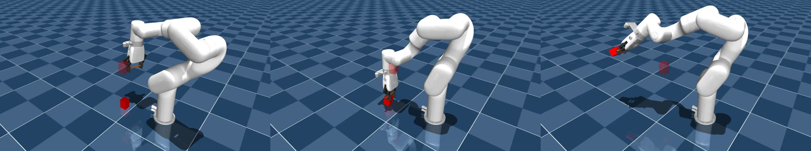
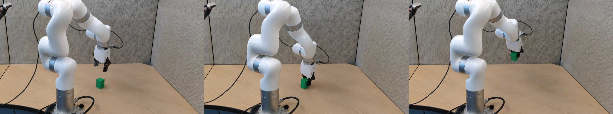
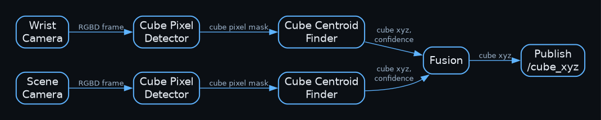
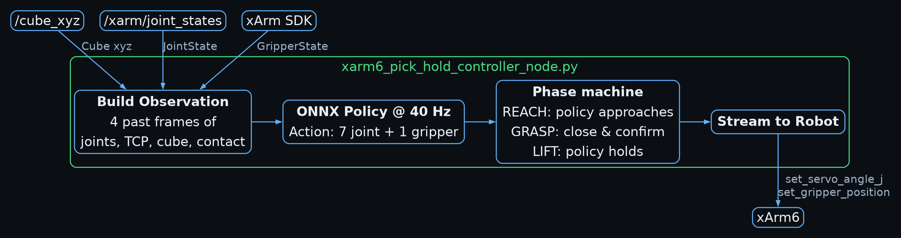

<!---
Copyright (c) 2026 Advanced Micro Devices, Inc. (AMD)

Permission is hereby granted, free of charge, to any person obtaining a copy
of this software and associated documentation files (the "Software"), to deal
in the Software without restriction, including without limitation the rights
to use, copy, modify, merge, publish, distribute, sublicense, and/or sell
copies of the Software, and to permit persons to whom the Software is
furnished to do so, subject to the following conditions:

The above copyright notice and this permission notice shall be included in all
copies or substantial portions of the Software.

THE SOFTWARE IS PROVIDED "AS IS", WITHOUT WARRANTY OF ANY KIND, EXPRESS OR
IMPLIED, INCLUDING BUT NOT LIMITED TO THE WARRANTIES OF MERCHANTABILITY,
FITNESS FOR A PARTICULAR PURPOSE AND NONINFRINGEMENT. IN NO EVENT SHALL THE
AUTHORS OR COPYRIGHT HOLDERS BE LIABLE FOR ANY CLAIM, DAMAGES OR OTHER
LIABILITY, WHETHER IN AN ACTION OF CONTRACT, TORT OR OTHERWISE, ARISING FROM,
OUT OF OR IN CONNECTION WITH THE SOFTWARE OR THE USE OR OTHER DEALINGS IN THE
SOFTWARE.
--->

# Unlocking Sim2Real for a Robotic Arm with RL Accelerated by AMD Instinct GPUs

Training a policy in simulation and transferring those weights to a real robot (sim2real) is a highly desirable goal in physical AI. Simulation scales data collection far beyond what a single robot can provide, but mismatches in physics and in the software stack make transfer difficult. In this blog post, we train a pick-and-lift policy for a [UFactory XArm-6](https://www.ufactory.cc/xarm-collaborative-robot/) with reinforcement learning on [AMD Instinct GPUs](https://www.amd.com/en/products/accelerators/instinct.html), then deploy the same network on the real arm with a classical perception front-end in place of privileged simulator state.

## Background

Sim2real faces challenges in two primary areas: physics and software. The physics simulation can be inaccurate or incorrectly configured: its friction, masses, and actuator dynamics can be mismatched with the hardware, so a grasp that holds in simulation slips on the robot. The software interface could also be incorrectly modeled: the robot's firmware turns an API call into motion through its own controllers, delays, and filters, which the simulator might not get right. The two standard fixes are **domain randomization** and **real-to-sim** modeling.

**Domain randomization** samples physics and interface parameters independently each episode - mass, poses, and actuation delay, in our case - so the policy succeeds across a distribution rather than a single calibrated world. That increases the number of simulated rollouts required. A GPU lets us run many environments in parallel, each with its own sampled parameters, which raises training *throughput* (samples per wall-clock second) enough to cover that distribution. **Real-to-sim** measures the real setup and calibrates the simulator to match it. These two are complementary: real2sim defines a plausible mean and domain randomization creates robustness around it.

A [previous blog](https://rocm.blogs.amd.com/artificial-intelligence/rocm-jax-mujoco/README.html) showed GPU-accelerated RL with domain randomization on a desktop AMD Radeon GPU using MuJoCo JAX. Here we move that stack to datacenter Instinct GPUs with MuJoCo Warp, and we randomize from ranges measured on the real XArm-6 so the policy can transfer.

Another [previous blog](https://rocm.blogs.amd.com/artificial-intelligence/rocm-genesis/README.html) demonstrated the use of a digital twin of the Franka robot to evaluate classic robot control in simulation. Due to the Franka robot's popularity in the research community, accurate public dynamics models already exist. That is not the case for the XArm-6, so we ran real-to-sim calibration experiments to model its arm and gripper joints in MuJoCo.

We also chose joint-space control over Cartesian-space control. Cartesian commands depend on an inverse-kinematics solver, which is well established for six-DoF manipulators but less so for more complex kinematic chains. Joint-space control lets the policy learn the robot's own dynamics, which is useful for later work that adds torque or other proprioceptive signals or targets more complex robotic form factors like humanoid robots.

## Training Setup

### Hardware and Software

We reproduced training on two single-GPU setups: one [MI300X](https://www.amd.com/en/products/accelerators/instinct/mi300/mi300x.html) and one [MI355X](https://www.amd.com/en/products/accelerators/instinct/mi350/mi355x.html). We train with proximal policy optimization (PPO) in [MuJoCo Playground](https://github.com/google-deepmind/mujoco_playground) using the [MuJoCo Warp](https://github.com/google-deepmind/mujoco_warp) (MJWarp) backend. MJWarp is a framework for GPU-accelerated computational physics. We run it on Instinct GPUs through a [ROCm](https://www.amd.com/en/products/software/rocm.html) implementation. Patches we made to these dependencies for this use case ship in the accompanying `robotics.zip` archive.

### Environment Details

The task is to pick up a cube and hold it 0.25 m above the ground. [Below](#fig-simulated-training) are frames of a successful policy in simulation:

(fig-simulated-training)=

An effective RL environment requires a well-defined reward function. [MetaWorld](https://github.com/Farama-Foundation/Metaworld/) provides an environment with a reward function for a pick-and-place task, which we adapted to the XArm-6 by adding **orientation-aware caging**. MetaWorld's environments simulate the Sawyer robot with a gripper that always faces down, so its grasping reward assumes a constant gripper "caging axis" (i.e., the direction vector between the two fingers of the gripper). The XArm-6 can grip at any wrist orientation, so we redefine the reward function to use a variable caging axis calculated from the gripper orientation at each policy step.

We define the policy's **observation space** as:

* **Proprioceptive state**: the arm's joint angles, joint velocities, the gripper's position and orientation, and the gap between commanded and actual joints.
* **Environment state**: the cube's true position and orientation relative to the gripper, and the target relative to the cube. This privileged information is available in simulation. On the real robot we fill the same slots with the perception estimates in [Perception and Camera](#perception-and-camera): measured 3-D position, and a fixed upright orientation for this block-lifting task.

The policy's **action space** is six joint-angle deltas and one gripper delta. At each policy step, these deltas are added to the joint and gripper position targets, with clipping and scaling to keep motion stable and within joint limits.

### Sim2Real Techniques

To address the most obvious gaps, we hand-built crude **collision primitives** (boxes, capsules, cylinders) that approximate the XArm-6's visual meshes, with the most care on the gripper fingers and pads where manipulation contact happens. We also hand-guided the real robot into a starting position that had a good camera view of the table in our real setup and brought that into the simulation environment as a **custom home frame**.

Then, from our first few experiments, we identified and addressed several more gaps. The XArm-6 firmware uses a built-in dynamics model to compensate for its own gravity. We enable **gravity compensation** on the arm in MuJoCo to emulate that firmware behavior. We fit a **dynamics model** for the arm by measuring joint-angle responses to commanded motions, one joint at a time, and fit the gripper with a similar procedure but a different model. The gripper was the hardest to capture with MuJoCo joint definitions.

This was still not enough, so we added domain randomization and policy-side constraints. Each episode we randomize **scene layout** (block position and initial joint configuration) and **dynamics parameters** (block mass), with ranges measured on the real setup. We command the XArm-6 in `servo_streaming` mode, which stalls or jerks if joint targets are not smooth enough. We **stack a short history of robot state** in the observation and **reward smooth motion** so the policy outputs feasible streaming commands. At that rate, **actuation delay** between the API call and joint motion still hurt transfer, so we modeled that delay in simulation and randomized it as well.

## Real Robot Deployment

[Below](#fig-real-robot) are frames of the policy running on a real robot.

(fig-real-robot)=

### Perception and Camera

(fig-vision-pipeline)=

The trained policy does not process camera images. In simulation it sees privileged cube pose. On the real robot, a [classical perception pipeline](#fig-vision-pipeline) estimates the cube's 3-D position in the robot base frame and writes it into those observation slots, with orientation held at a fixed upright pose rather than a recovered 6-DoF estimate.

There are two cameras, both of which are [RealSense D435i](https://www.intelrealsense.com/depth-camera-d435i/) models. One is bolted to the wrist and moves with the arm; the other is fixed overhead watching the workspace. The wrist camera can see the cube on approach but loses it as the fingers cover it in the last centimeters of a grasp. The scene camera can see the cube, but the arm occludes it on approach. Both are needed for a successful grasp.

Before running the policy, we **calibrate the cameras** once. The wrist camera is fixed relative to the gripper, so we solve that transform with an eye-in-hand calibration. The scene camera is static; we sweep the gripper to known points and fit camera-to-base pose by least squares (about 4 mm residual). Intrinsics - focal length and principal point - come from each camera's factory calibration.

The pipeline converts the two RGB-D images into a cube position with the following stages:

1. **Estimate the cube centroid from each view.** On each camera we threshold the RGB image in HSV (hue-saturation-value) color space to find the green cube, take the largest blob, and read its centroid pixel. At close range the color blob gets unreliable, so we fuse it with depth: the cube height is about 6 cm, so green pixels that are also closer in depth than the table are treated as the cube. We deproject that centroid pixel and its depth to a 3-D point in the robot base frame. Depth processing runs on an AMD GPU using a librealsense build with ROCm device support ([PR 15074](https://github.com/realsenseai/librealsense/pull/15074)).
2. **Fuse the two views, with occlusion.** Each camera produces a cube estimate in the robot base frame and a confidence score from blob size and whether the measured depth is consistent with a cube sitting on the table. We take a confidence-weighted average, so an occluded camera (fingers in front, or arm in front) is downweighted instead of contributing a confident guess from background pixels. If only one view remains usable, the estimate falls back to that view alone.

This pipeline uses only traditional robotics perception techniques, without any neural networks.

### Policy Controller Architecture

[Below](#fig-controller-pipeline) is the high-level architecture of our controller.

(fig-controller-pipeline)=

The deployed policy is a small multilayer perceptron (MLP) exported to [ONNX](https://onnx.ai/) and queried at 40 Hz. Combined with action clipping and the smoothness reward, that rate kept `servo_streaming` stable on our setup. Policy inference and the vision pipeline run on an [AMD Ryzen AI 300](https://www.amd.com/en/products/processors/laptop/ryzen/ai-300-series/amd-ryzen-ai-9-hx-370.html) Mini-PC. Commands go to the XArm-6 through [ROS 2](https://www.ros.org/) and the [xArm SDK](https://github.com/xArm-Developer/xArm-Python-SDK).

## Instructions to Reproduce

Download [robotics.zip](_downloads/robotics.zip), unzip it, and follow the `README.md` and `SETUP.md` files inside the archive.

## Takeaways

A well-defined reward was what unlocked a successful policy. Hand-designed rewards failed until we adapted MetaWorld's pick-and-place shaping, including the orientation-aware caging term described above.

Real2sim modeling closed most of the remaining gap. Public XArm-6 models were a starting point; measuring our arm and gripper, then putting those parameters into MuJoCo, is what made transfer work. Setup-specific measurements matter on this class of problem, including firmware effects such as API-call delay.

## Summary

In this blog, we trained a pick-and-lift policy for a robotic manipulator arm with reinforcement learning, then deployed the same policy on the real robot. We used a GPU-accelerated simulation framework on AMD Instinct GPUs for the training. We used a well-defined reward function, real-to-sim dynamics calibration, domain randomization, and a target detection vision pipeline to achieve zero-shot sim-to-real.

A natural follow-up is to put a vision encoder in the policy instead of an external pipeline, and to randomize the rendered scene so the policy generalizes across environments (different backgrounds, lighting, etc). MuJoCo Warp can support that with a GPU batch renderer that produces camera views across many parallel environments, so we can keep training entirely with reinforcement learning at Instinct-GPU scale.

In addition, the lessons learned here can be used to train VLAs and WAMs going forward. RL is often used as an augmentation on top of recorded demonstrations to train state-of-the-art VLAs.

## Disclaimers

Third-party content is licensed to you directly by the third party that owns the content and is not licensed to you by AMD. ALL LINKED THIRD-PARTY CONTENT IS PROVIDED "AS IS" WITHOUT A WARRANTY OF ANY KIND. USE OF SUCH THIRD-PARTY CONTENT IS DONE AT YOUR SOLE DISCRETION AND UNDER NO CIRCUMSTANCES WILL AMD BE LIABLE TO YOU FOR ANY THIRD-PARTY CONTENT. YOU ASSUME ALL RISK AND ARE SOLELY RESPONSIBLE FOR ANY DAMAGES THAT MAY ARISE FROM YOUR USE OF THIRD-PARTY CONTENT.
The information contained herein is for informational purposes only and is subject to change without notice. While every precaution has been taken in the preparation of this document, it may contain technical inaccuracies, omissions and typographical errors, and AMD is under no obligation to update or otherwise correct this information. Advanced Micro Devices, Inc. makes no representations or warranties with respect to the accuracy or completeness of the contents of this document, and assumes no liability of any kind, including the implied warranties of noninfringement, merchantability or fitness for particular purposes, with respect to the operation or use of AMD hardware, software or other products
