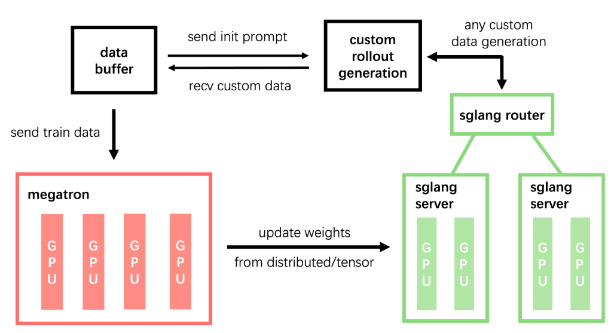
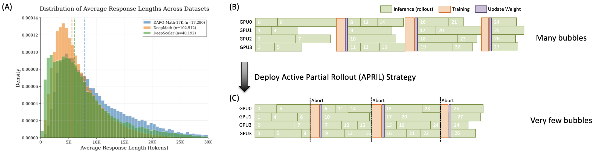
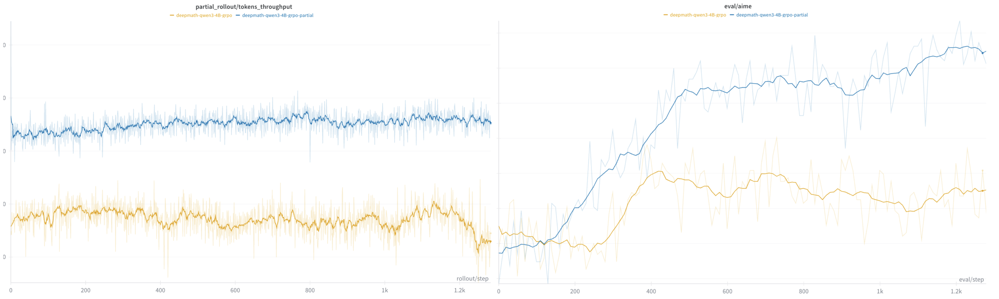
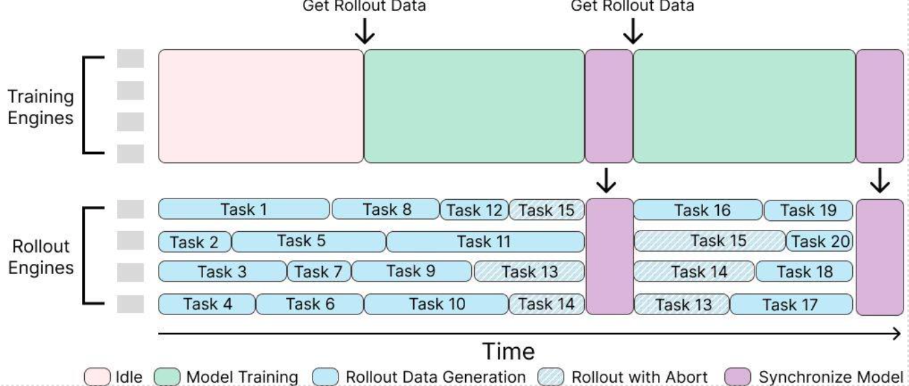
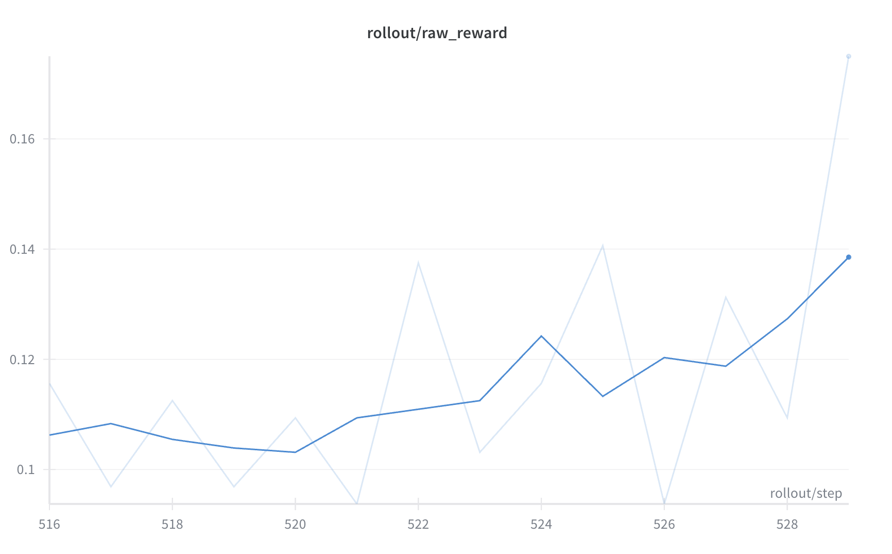

<!---
Copyright (c) 2025 Advanced Micro Devices, Inc. (AMD)

Permission is hereby granted, free of charge, to any person obtaining a copy
of this software and associated documentation files (the "Software"), to deal
in the Software without restriction, including without limitation the rights
to use, copy, modify, merge, publish, distribute, sublicense, and/or sell
copies of the Software, and to permit persons to whom the Software is
furnished to do so, subject to the following conditions:

The above copyright notice and this permission notice shall be included in all
copies or substantial portions of the Software.

THE SOFTWARE IS PROVIDED "AS IS", WITHOUT WARRANTY OF ANY KIND, EXPRESS OR
IMPLIED, INCLUDING BUT NOT LIMITED TO THE WARRANTIES OF MERCHANTABILITY,
FITNESS FOR A PARTICULAR PURPOSE AND NONINFRINGEMENT. IN NO EVENT SHALL THE
AUTHORS OR COPYRIGHT HOLDERS BE LIABLE FOR ANY CLAIM, DAMAGES OR OTHER
LIABILITY, WHETHER IN AN ACTION OF CONTRACT, TORT OR OTHERWISE, ARISING FROM,
OUT OF OR IN CONNECTION WITH THE SOFTWARE OR THE USE OR OTHER DEALINGS IN THE
SOFTWARE.
--->

# Day-0 Support for the SGLang-Native RL Framework - slime on AMD Instinct™ GPUs

AMD is excited to provide Day-0 support for the SGLang-native RL framework, [slime](https://github.com/THUDM/slime). In this post, we will provide more details about our support and optimizations, as well as slime's benefits for large-scale RL training. First, we describe the engineering efforts behind slime—including codebase modification, kernel-level memory management for ROCm™ software, and modifications to third-party dependencies (Megatron-LM, SGLang, and torch_memory_saver)—as well as Docker images that enable efficient execution on AMD Instinct™ GPUs. Architecturally, slime supports two training modes: synchronous and asynchronous. Across these modes, we additionally present system-level optimizations with the corresponding use cases. Specifically, in the synchronous setting, our rollout optimizations deliver a 40% throughput improvement over the one without it on AMD Instinct™ GPUs. In the asynchronous setting, we develop a multi-turn RL agent framework to train the kernel generation model. You can also read more about this support in the [MLsys – SGLang official blog](https://lmsys.org/blog/2025-07-09-slime).

## Key Takeaways

- slime framework and its advantages
- Codebase-level & kernel-level support and corresponding released Docker image
- System-level optimizations: APRIL – active partial rollouts
- Multi-turn kernel-agent RL training framework

## slime Framework and its Advantages

To develop intelligent large-scale foundation models, RL training is just as critical as pre-training. Since the release of ChatGPT at the end of 2023, the effectiveness of RLHF in enhancing large-scale pre-trained language models (LLMs) has become increasingly evident. More recently, the introduction of several O1/R1-series models trained with RLHF has once again demonstrated its strength, particularly in improving reasoning capabilities. Additionally, there have been increased efforts in RL [during training](https://arxiv.org/abs/2506.08007). Consequently, an increasing number of RL training frameworks have emerged from the open-source community, including OpenRLHF, [verl](https://rocm.blogs.amd.com/artificial-intelligence/verl-large-scale/README.html), Areal, and slime. Among these, slime is currently the only verified framework used for RL training on large-scale mixture-of-experts (MoE) models, including those with sizes up to 355 billion parameters.


*Figure 1. Overall slime framework*

The slime framework not only supports supervised fine-tuning (SFT) but is also designed as an RL framework that emphasizes versatility through its customizable rollout interface and support for diverse training configurations—whether co-located or decoupled, synchronous or asynchronous. As shown in Figure 1, it achieves high performance by running inference through SGLang and leveraging Megatron-LM for training in a fully native capacity, all while maintaining a lightweight and maintainable codebase that smooths the transition from Megatron pre-training to SGLang deployment. Moreover, by rethinking RL data sampling to better meet user needs, slime simplifies development: it centrally manages all SGLang servers through an sgl-router, exposing a single HTTP endpoint that allows environments to communicate via an OpenAI-compatible API while ensuring consistency between training and deployment. Additionally, it streamlines experiment setup through Ray-based resource management, enabling users to seamlessly toggle between co-located and decoupled GPU configurations—all within a unified framework. In general, slime offers:

- Customizable rollout interface and diverse training setups (co-located / decoupled / async).
- Native SGLang experience — full MoE support, pass-through configs, debug modes.
- Lightweight codebase with minimal abstractions, easy to extend & maintain.
- Verified with large-scale coding agent RL training for enterprise use.

## Codebase-level & Kernel-level Support

To ensure that slime runs effectively on AMD Instinct GPUs, we introduced several key enhancements. First, we updated the slime codebase for full compatibility with the ROCm, enabling stable and efficient execution on AMD hardware (see PRs: slime [[Hardware] Support AMD - ROCm](https://github.com/THUDM/slime/pulls?q=is%3Apr+Hardware+is%3Aclosed)). In addition, we addressed ROCm-related issues by improving virtual memory management and adding HIP-based implementations for memory offload and upload, thereby enhancing the efficiency of RL training (see PR: torch_memory_saver [[Hardware Support] AMD - ROCm](https://github.com/fzyzcjy/torch_memory_saver/pull/43)). Finally, we provide [Dockerfiles](https://github.com/THUDM/slime/blob/main/docker/Dockerfile.rocm) along with corresponding [Docker images](https://hub.docker.com/r/rlsys/slime/tags) to simplify the setup of the slime training environment.

## Quick Start

You can try the following scripts to run slime on your system.

First, launch the docker image:

```bash
docker run --rm -it \
--device /dev/dri \
--device /dev/kfd \
-p 8265:8265 \
--group-add video \
--cap-add SYS_PTRACE \
--security-opt seccomp=unconfined \
--privileged \
-v $HOME/.ssh:/root/.ssh \
-v $HOME:$HOME \
--shm-size 128G \
--name slime \
--ulimit memlock=-1 \
--ulimit stack=67108864 \
-w $PWD \
rlsys/slime:latest \
/bin/bash
```

Next, run the example script:

```bash
# Step three is to download slime
git clone https://github.com/THUDM/slime
cd slime

# Note --You can run the latest upstream version. If you want a stable version, please check out the following commit ID: 5f78160
git checkout 5f78160

# RL training
bash scripts/run-qwen3-4B-amd.sh
```

As mentioned earlier, slime provides two modes for RL training: synchronous (GPU co-located mode) and asynchronous (GPU decoupled mode). In synchronous mode, the inference and training engines share the same set of GPUs, with the system alternating between rollout generation (inference) and gradient update (training) phases. This contrasts with an asynchronous architecture, where separate GPU clusters are dedicated to each engine. The main advantage of the synchronous mode is that it lowers the hardware barrier, enabling training to run on relatively limited computational resources. However, it requires more complex system management, as different engines must be offloaded and reloaded onto GPUs. By contrast, the asynchronous mode consumes more GPUs but avoids the overhead of managing GPU alternation. In the following two sections, we discuss when each mode is most appropriate and highlight the bottlenecks we addressed.

## System-level Optimizations

When GPU resources are limited and the rollout generation lengths are relatively uniform—such as in math reasoning tasks—we adopt the synchronous mode. However, rollout generation is the primary overhead in RL training, typically consuming over 90% of the total training time. In addition, training tasks often include a few extremely long rollout generations, as shown in Figure 2(A). These "long-tails" cause GPUs to sit idle while waiting for the longest sequences to complete, thereby reducing utilization and slowing down the entire training cycle, as illustrated in Figure 2(B).


*Figure 2. (A) Distribution of rollout lengths across tasks. (B) Standard rollouts exhibit many bubbles during RL training. \(C) APRIL mitigates these bubbles in RL training.*

To mitigate this issue, we introduce the [Active Partial Rollout (APRIL)](https://github.com/RLsys-Foundation/APRIL) strategy which has been merged into the upstream slime ([#PR](https://github.com/THUDM/slime/pull/2)) repository to tackle the long-tail bottleneck:

- **Over-sampling:** Start more rollout requests than required (e.g., launch 64 for a target batch of 32).
- **Early termination:** As soon as the needed batch size is met, abort the rest.
- **Collection and Reuse:** Aborted, half-completed trajectories are stored in a buffer and reused in the next iteration, continuing from where they left off.

This mechanism integrates natively with SGLang's router and can be enabled simply with `--partial-rollout` and `--over-sampling-batch-size`, which can significantly reduce bubbles during RL training as shown in Figure 2 \(C), and works well across all RL algorithms and LLMs. In the following section, we present a comparative experiment using one of the most commonly used algorithms, GRPO, together with the Qwen3-4B model and DeepMath reasoning dataset:

- **Throughput:** As shown in Figure 3, end-to-end throughput improved from <span style="color: #FFA500;">9.3k</span> → <span style="color: #4A90E2;">13k</span> tokens/sec (40% gain) with 16k max response lengths.
- **Stability and Accuracy:** Compared to the original approach, APRIL is more stable and achieves slightly higher accuracy, although it involves some off-policy rollouts (completing unfinished rollouts from the previous time step). This mixture of on-policy and off-policy rollout generation may increase data diversity, thereby leading to more robust training.


*Figure 3. [Left] APRIL (<span style="color: #4A90E2;">blue</span>) improves throughput by 40% compared to the original baseline (<span style="color: #FFA500;">orange</span>); [Right] Compared to the original approach (<span style="color: #FFA500;">orange</span>), APRIL (<span style="color: #4A90E2;">blue</span>) is more stable and achieves slightly higher accuracy.*

## Multi-turn Kernel-agent RL Training Framework

In agentic tasks such as coding, the synchronous mode RL framework encounters bottlenecks. Because of the asynchronous system, each step must include both inference (rollout) and training (model weight updates). However, the rollout distribution of agentic tasks often exhibits a more severe version of the aforementioned "long-tail" problem.

To address this, slime also provides a fully asynchronous, decoupled design: GPUs are partitioned between rollout engines and training engines. Rollout engines host LLM servers that continuously stream trajectories, while training engines consume these trajectories, compute losses, and update the actor. The new weights are then broadcast to the rollout servers; in-flight requests are safely preempted, and generation resumes with the updated model. Its advantages are as follows:

- **No batch barriers:** trajectories are processed as they arrive, avoiding head-of-line blocking.
- **Higher utilization:** rollout and training run concurrently, maximizing GPU throughput, and cutting wall-clock time.
- **Memory stability:** no frequent load/unload cycles between phases, reducing fragmentation—especially at scale.
- **Clean scale-out:** independent components make it easy to grow rollout or training capacity as needed.

Figure 4 illustrates this resource allocation and workflow, showing how rollout engines and training engines operate independently over time.


*Figure 4. The overview of slime asynchronous framework*

Based on this architecture, we design a multi-turn agentic training framework, [TritonForge](https://github.com/RLsys-Foundation/TritonForge)
—a kernel generation sandbox that enables the RL engine slime to interact with it. More specifically, the sandbox serves as a kernel-bench–based environment for Torch-to-Triton tasks. During RL training, Torch code is provided as input and processed by the inference engine to generate Triton code. The generated Triton code is then executed in the sandbox to obtain rewards defined by compilation success, correctness, and speedup. These rewards are subsequently used to optimize the policy. Furthermore, the framework supports both single-turn and multi-turn modes of RL training. In our experiments, the multi-turn mode consistently yields better code generation performance. We conducted kernel agent single-turn training on Qwen3-8B, and the corresponding training curve is shown below in Figure 5:


*Figure 5. Single turn Qwen3-8B kernel agent RL training curve showing steady reward improvement over time*

## Summary

As RL training becomes essential for advancing foundation models beyond pre-training, slime stands out as the only verified framework supporting large-scale MoE models up to 355B parameters with native SGLang integration. This blog demonstrates AMD's Day-0 ROCm support for slime on AMD Instinct™ GPUs, covering our kernel-level optimizations, Docker deployment, and the innovative APRIL strategy that achieves 40% throughput gains in synchronous mode. We present both synchronous and asynchronous training architectures, showcasing practical applications through our multi-turn kernel-agent framework for Torch-to-Triton code generation. With its lightweight codebase, customizable rollout interface, and seamless Ray-based resource management, this framework enables AMD Instinct users to harness slime's full potential for scalable RL training, ultimately accelerating the development of advanced reasoning and coding agents.

## Contributors

**Core contributors:** Yusheng Su, Yuzhen Zhou, Jin Pan, Gowtham Ramesh, Zicheng Liu

**Contributors:** Xiaodong Yu, Jialian Wu, Ze Wang, Ximeng Sun, Jiang Liu, Hao Chen, Emad Barsoum

## Citations

Feel free to cite this blog if you find it helpful to your work:

```bibtex
@misc{slime_rocm,
  title = {Day-0 Support for the SGLang-Native RL Framework - slime on AMD Instinct™ GPUs},
  url = {https://rocm.blogs.amd.com/artificial-intelligence/slime/README.html},
  author = {Yusheng Su, Yuzhen Zhou, Jin Pan, Gowtham Ramesh, Xiaodong Yu, Jialian Wu, Ze Wang, Ximeng Sun, Jiang Liu, Hao Chen, Zicheng Liu, Emad Barsoum},
  month = {Sep},
  year = {2025}
}
```

We also encourage you to check out our paper **APRIL: Active Partial Rollouts in Reinforcement Learning to tame long-tail generation** and cite it if relevant to your work:

```bibtex
@misc{zhou2025aprilactivepartialrollouts,
      title={APRIL: Active Partial Rollouts in Reinforcement Learning to tame long-tail generation}, 
      author={Yuzhen Zhou and Jiajun Li and Yusheng Su and Gowtham Ramesh and Zilin Zhu and Xiang Long and Chenyang Zhao and Jin Pan and Xiaodong Yu and Ze Wang and Kangrui Du and Jialian Wu and Ximeng Sun and Jiang Liu and Qiaolin Yu and Hao Chen and Zicheng Liu and Emad Barsoum},
      year={2025},
      eprint={2509.18521},
      archivePrefix={arXiv},
      primaryClass={cs.LG},
      url={https://arxiv.org/abs/2509.18521}, 
}
```

## Acknowledgement

Thanks to Bingqing Guo and Guruprasad MP from AMD for sponsoring one MI300 node for our experiments.
Thanks to Yang Wang from Microsoft Research Asia for assistance with ROCm-6.3.4 support.
Thanks to Zilin Zhu from the slime open-source community for contributions to high-level understanding and implementation of slime.
Thanks to Jiajun Li, Xiang Long, and Chenyang Zhao from the MLSys – SGLang open-source community for their help with system-level optimizations and the kernel-agent framework.

## Reference

- [Arxiv](https://arxiv.org/abs/2509.18521)
- [slime](https://github.com/THUDM/slime)
- [slime: An SGLang-Native Post-Training Framework for RL Scaling](https://lmsys.org/blog/2025-07-09-slime/)
- [Reinforcement Pre-Training](https://arxiv.org/abs/2506.08007)
- [Reinforcement Learning from Human Feedback on AMD GPUs with verl and ROCm Integration](https://rocm.blogs.amd.com/artificial-intelligence/verl-large-scale/README.html)
- [Active Partial Rollout (APRIL)](https://github.com/RLsys-Foundation/APRIL)
- [TritonForge](https://github.com/RLsys-Foundation/TritonForge)

## SYSTEM CONFIGURATION

**AMD Instinct™ MI300X platform:**

- **CPU:** 2x Intel® Xeon® Platinum 8480C 48-core Processor (2 sockets, 48 cores per socket, 1 thread per core)
- **NUMA Config:** 1 NUMA node per socket
- **Memory:** 1.8 TiB
- **Disk:** Root drive + Data drive combined: 8x 3.5TB local SSD
- **GPU:** 8x AMD MI300X 192GB HBM3 750W
- **Host OS:** Ubuntu 22.04.5 LTS with Linux kernel 5.15.0-1086-azure
- **Host GPU Driver (amd gpu version):** 6.12.12

## Disclaimers

Third-party content is licensed to you directly by the third party that owns the
content and is not licensed to you by AMD. ALL LINKED THIRD-PARTY CONTENT IS
PROVIDED "AS IS" WITHOUT A WARRANTY OF ANY KIND. USE OF SUCH THIRD-PARTY CONTENT
IS DONE AT YOUR SOLE DISCRETION AND UNDER NO CIRCUMSTANCES WILL AMD BE LIABLE TO
YOU FOR ANY THIRD-PARTY CONTENT. YOU ASSUME ALL RISK AND ARE SOLELY RESPONSIBLE
FOR ANY DAMAGES THAT MAY ARISE FROM YOUR USE OF THIRD-PARTY CONTENT.
