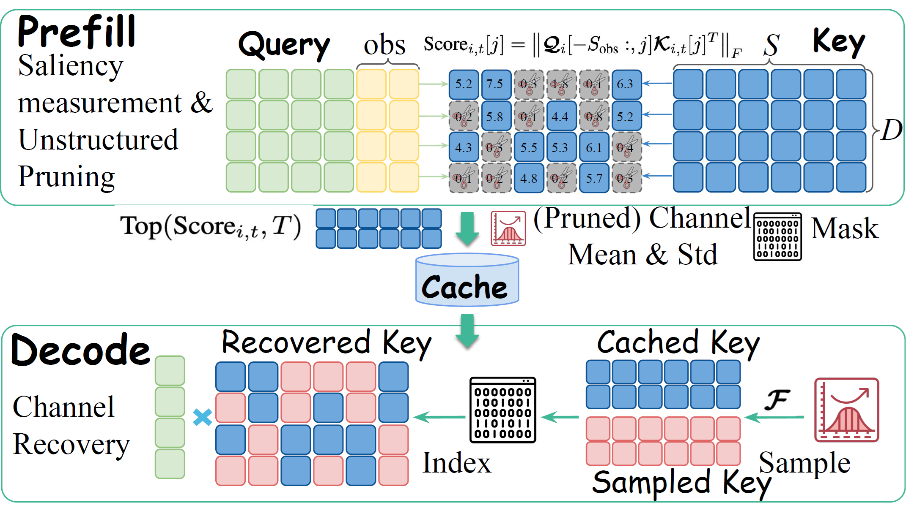
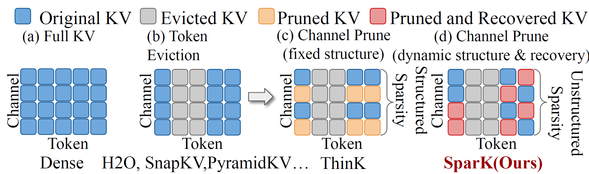
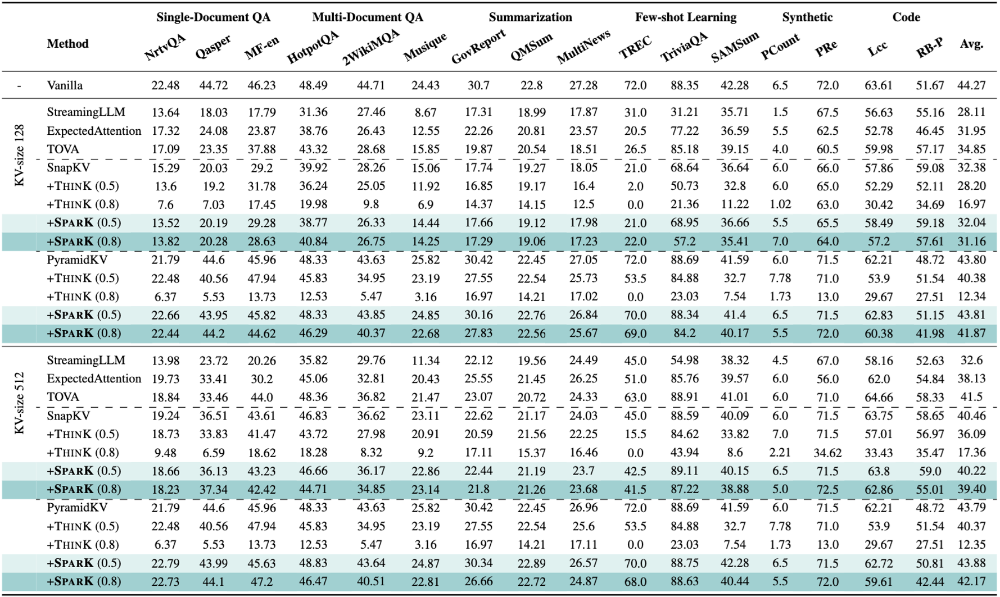
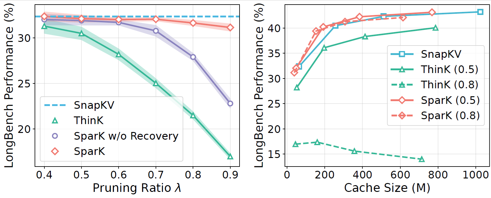

<!---
Copyright (c) 2025 Advanced Micro Devices, Inc. (AMD)

Permission is hereby granted, free of charge, to any person obtaining a copy
of this software and associated documentation files (the "Software"), to deal
in the Software without restriction, including without limitation the rights
to use, copy, modify, merge, publish, distribute, sublicense, and/or sell
copies of the Software, and to permit persons to whom the Software is
furnished to do so, subject to the following conditions:

The above copyright notice and this permission notice shall be included in all
copies or substantial portions of the Software.

THE SOFTWARE IS PROVIDED "AS IS", WITHOUT WARRANTY OF ANY KIND, EXPRESS OR
IMPLIED, INCLUDING BUT NOT LIMITED TO THE WARRANTIES OF MERCHANTABILITY,
FITNESS FOR A PARTICULAR PURPOSE AND NONINFRINGEMENT. IN NO EVENT SHALL THE
AUTHORS OR COPYRIGHT HOLDERS BE LIABLE FOR ANY CLAIM, DAMAGES OR OTHER
LIABILITY, WHETHER IN AN ACTION OF CONTRACT, TORT OR OTHERWISE, ARISING FROM,
OUT OF OR IN CONNECTION WITH THE SOFTWARE OR THE USE OR OTHER DEALINGS IN THE
SOFTWARE.
--->

# SparK: Query-Aware Unstructured Sparsity with Recoverable KV Cache Channel Pruning

In this blog we will discuss **SparK**, a training-free, plug-and-play method for KV cache compression in large language models (LLMs). By addressing the overlooked redundancy in feature channels and employing a "prune-and-recover" strategy, SparK reduces KV cache storage by over 30% compared to traditional methods while maintaining model accuracy. It offers a robust solution for long-context inference, establishing a new perspective on unstructured sparsity.

SparK is co-designed with the AMD ROCm™ software stack to fully exploit the parallel compute capabilities of AMD Instinct™ GPUs. Our KV cache pruning method can help improve the performance of LLMs on AMD Instinct™ GPUs.

Read the [full paper](https://arxiv.org/abs/2508.15212) and try the [implementation](https://github.com/AMD-AGI/AMD-Spark). This work has been accepted to [AAAI 2026](https://aaai.org/conference/aaai/aaai-26/).

## **Why KV cache compression matters**

Long-context inference in LLMs is increasingly constrained by the **KV cache bottleneck**: memory usage grows linearly with sequence length, while attention computation scales quadratically. This limits the maximum batch size and sequence length that can be processed on a single GPU.

<i>Figure 1: Illustrative comparisons among (a) full KV cache, (b) eviction-based KV compression, (c) structured channel pruning-based KV reduction, and (d) our proposed SparK, which employs unstructured channel pruning with subsequent recovery during attention score computation.</i>

As shown in figure 1, existing approaches typically address this by compressing the KV cache along the **temporal axis** (the token dimension). Strategies like token eviction (removing less important tokens) or token merging have been the standard to reduce memory overhead. However, these methods often ignore the redundancy that exists within the **feature dimension** (channels). They treat all channels as equally important, potentially preserving "dead" or irrelevant feature information that consumes valuable memory.

## **Inside SparK: How It Works**

<i>Figure 2: An illustration of SparK. SparK computes channel-wise saliency scores and applies unstructured pruning during prefill. During decoding, SparK leverages F and sampling from the cached distribution to reconstruct the pruned channels and then performs standard full attention.</i>

**SparK** (Query-Aware Unstructured Sparsity with Recoverable KV Cache Channel Pruning) takes a different approach. Instead of just evicting tokens, it targets **channel-level redundancy**, as shown in figure 2.

The core insight driving SparK is that **channel saliency varies dramatically** across both queries and positions. For a given query, certain feature channels carry near-zero information, while others spike in relevance.

SparK operates on a simple but effective principle:

1. **Query-Aware Pruning:** It identifies and prunes KV entries at the channel level that are deemed irrelevant for the current query.
2. **Dynamic Recovery:** Crucially, it dynamically restores the pruned entries during the attention score computation.

This "prune-and-recover" mechanism allows SparK to apply unstructured sparsity without permanently losing critical information needed for high-precision attention. Notably, SparK is **orthogonal** to existing compression techniques. This means it can be integrated on top of quantization or token-eviction methods to achieve even further memory savings on AMD Instinct™ GPUs.

## **Results on AMD GPUs: Robustness and Efficiency**

<i>Table 1: Performance comparison on LLaMA-3-8B-Instruct at LongBench. SparK (λ) denotes the channel-wise key cache pruning ratio λ. Benchmarks were conducted on AMD Instinct™ MI250 Accelerators. </i>

SparK demonstrates impressive resilience compared to baseline eviction-based methods.

1. **Storage Reduction:** For sequences of equal length, SparK reduces KV cache storage by over **30%** compared to standard eviction methods, as shown in figure 3 (b).

2. **Accuracy Preservation:** By reducing channel-level redundancy, SparK enables the processing of longer sequences within the same memory budget. In tests, it either preserves or improves model accuracy compared to baselines as shown in table 1.

3. **High Sparsity Tolerance:** Even with an aggressive pruning ratio of **80%**, SparK maintains performance with less than **5% degradation** compared to baseline eviction methods, as shown in figure 3 (a).

<i>Figure 3: Performance analysis of SparK on LLaMA3-8B-Instruct. (a) LongBench average performance under varying pruning ratios (λ). SparK significantly outperforms ThinK across all compression levels. (b) Cache size vs. performance trade-off. SparK achieves a favorable storage–performance balance compared to ThinK and SnapKV. Experiments are conducted on AMD Instinct™ MI250 Accelerators.</i>

These results highlight SparK’s capability to handle long-context scenarios effectively, making it a robust choice for memory-constrained environments.

## Summary

In this blog, you explored **SparK**, a novel method for alleviating the KV cache bottleneck in LLMs. Unlike traditional temporal compression, SparK exploits **unstructured sparsity in the channel dimension**. By pruning irrelevant channels and recovering them dynamically during computation, it achieves significant memory savings without the need for model retraining.

SparK stands out as a plug-and-play solution that is compatible with existing KV compression and quantization techniques, offering a versatile tool for optimizing long-context LLM inference.

You can dive deeper into the methodology and extensive benchmarks in our paper, and access our implementation on [GitHub](https://github.com/AMD-AIG-AIMA/AMD-Spark). We welcome researchers to explore SparK on AMD ROCm-enabled GPUs and to share feedback with the community.

We also invite you to explore the [AMD Developer Cloud](https://www.amd.com/en/forms/registration/developer-cloud-application.html), featuring AMD Instinct™ accelerators purpose-built for AI workflows. For questions or collaboration opportunities, reach out to the AMD team at [amd_ai_mkt@amd.com](mailto:amd_ai_mkt@amd.com). Stay tuned for future posts, expanded tooling, and hands-on tutorials as we continue advancing KV cache pruning research and deployment.

## Disclaimers

Third-party content is licensed to you directly by the third party that owns the
content and is not licensed to you by AMD. ALL LINKED THIRD-PARTY CONTENT IS
PROVIDED “AS IS” WITHOUT A WARRANTY OF ANY KIND. USE OF SUCH THIRD-PARTY CONTENT
IS DONE AT YOUR SOLE DISCRETION AND UNDER NO CIRCUMSTANCES WILL AMD BE LIABLE TO
YOU FOR ANY THIRD-PARTY CONTENT. YOU ASSUME ALL RISK AND ARE SOLELY RESPONSIBLE
FOR ANY DAMAGES THAT MAY ARISE FROM YOUR USE OF THIRD-PARTY CONTENT.
