# Accelerating LLM Inference: Up to 3x Speedup on MI300X with Speculative Decoding

In this blog you will learn how speculative decoding boosts LLM inference, providing out-of-the-box speedups in LLM token generation on the AMD Instinct™ MI300X GPU. We start the blog by providing you with a brief overview of Speculative Decoding. We then demonstrate, through extensive benchmarking on a number of LLMs and datasets, as well as on different frameworks viz. [vLLM](https://github.com/vllm-project/vllm) and native PyTorch ([gpt-fast](https://github.com/pytorch-labs/gpt-fast)), speedups in the range of 1.3x - 3x in the LLM generation throughput (tokens/second) through speculative decoding as compared to running a vanilla LLM for batch size 1. We show you how these speedups vary for batch sizes greater than 1 in vLLM. Finally, we will share a detailed profiling-based case study to identify some high-level differences between these two frameworks, i.e. the type of kernels that are launched and their overall latencies, which are critical differentiators between the performance of these frameworks. Let's get started!

## Overview of Speculative Decoding

LLM token generation occurs in an autoregressive manner, where tokens are generated one at a time and each generated token depends on all preceding tokens (also referred to as the context).
This requires the entire model weights to be read from main memory to the compute unit for every single token generation, which, combined with the sequential data dependency, makes the LLM decoding (token generation) phase, a memory-bandwidth bound problem and an inherently slow one (Figure 1a.).
Speculative Decoding (SpD) was proposed to solve this problem by employing light-weight extensions, such as a small draft model [[1](https://arxiv.org/abs/2211.17192), [2](https://arxiv.org/abs/2302.01318)] or additional model heads [[3](https://arxiv.org/abs/2401.10774)], that speculatively generate multiple tokens quickly and cheaply, that are then verified by the main/target LLM in parallel. Figure 1b. shows a separate small model (also known as an auxiliary or draft model) that quickly generates several draft tokens.
These speculative tokens are verified by the large (also known as the target LLM) model in parallel.
This enables the LLM to generate more than one token for every LLM forward pass call.
The example in Figure 1b. shows that the draft model generates 4 tokens, out of which, the target LLM accepts the first 3 tokens and during verification, also generates the 4th token.
Thus, 4 tokens are generated at the cost of running the LLM once along with some overhead incurred during the drafting process.
The drafting length, denoted by K, can either be constant [[1](https://arxiv.org/abs/2211.17192), [2](https://arxiv.org/abs/2302.01318)] or variable [[4](https://huggingface.co/blog/assisted-generation), [5](https://arxiv.org/abs/2405.04304)], and in the latter case, it often depends on the running average of the acceptance rate of the drafted tokens [[4](https://huggingface.co/blog/assisted-generation)].

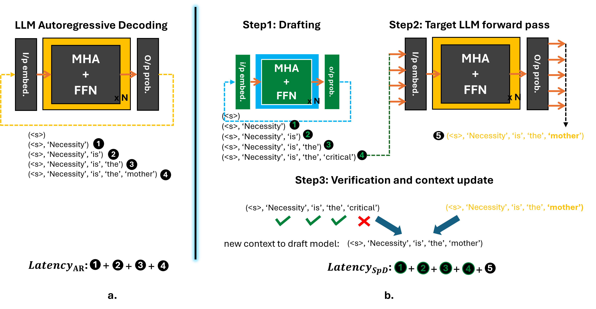
**Figure 1.** LLM token generation in (a) conventional autoregressive mode, (b) in speculative decoding (SpD) mode.

SpD can lead to remarkable speedups during LLM inference provided the following two conditions are satisfied:

- The drafting model is small and has a much lower forward pass execution time than the target model,
- The drafting model has a reasonable rate of acceptance by the target LLM (i.e. >= 1 draft token gets accepted by the LLM on an average) for every inference call

While a number of different variants of SpD have been explored in the literature, for the purposes of this article, we will refer to the methods proposed by [[1](https://arxiv.org/abs/2211.17192), [2](https://arxiv.org/abs/2302.01318)] involving a separate draft model and a constant draft length and study its performance on the AMD Instinct; MI300X GPU.

## MI300X Overview

The AMD Instinct MI300X architecture is composed of two fundamental chiplet types: the XCD (Accelerator Complex Die) and the IOD (I/O Die). A single MI300X is composed of 8 XCDs and 4 IODs. Each pair of XCDs is 3D-stacked on the top of an IOD, which are then connected using an inter-die interconnect. Each XCD has its own L2 cache, and each IOD contains a network that can connect all the XCDs to the rest of the device. Additionally, there will be some amount of higher-capacity DRAM memory attached to the device. In MI300X, this is implemented as High-Bandwidth Memory (HBM). While memory is typically exposed as a single pool to the programmer, it is physically implemented as several individual "stacks". MI300X has 8 HBM stacks (2 per IOD).

**Overview of MI300X Specifications:**

| Architecture    | HBM Memory Capacity (GiB) | Compute Units | LDS (KiB) | L3 Cache (MiB) | L2 Cache (MiB) | L1 Vector Cache (KiB) | L1 Scalar Cache (KiB) | L1 Instruction Cache (KiB) | VGPR File (KiB) | SGPR File (KiB)
| -------- | ------- | ------- | ------- | ------- | ------- | ------- | ------- | ------- | ------- | ------- |
| CDNA3  | 192    | 304 (38 per XCD) | 64 | 256 | 32 (4 per XCD) | 32 | 16 per 2 CUs | 64 per 2 CUs | 512 | 12.5

For additional information on the MI300X, please refer to the [AMD Instinct™ MI300X datasheet](https://www.amd.com/en/products/accelerators/instinct/mi300/mi300x.html).

## Case Study of SpD Out-of-the-Box Performance on MI300X

### Evaluation Tasks, Models Examined and Frameworks Considered

**Table 1. Models and Datasets Evaluated:**  

| Expt no.       | 1.1 | 1.2 | 2.1 | 2.2 | 3.1 | 3.2 | 4.1 | 4.2 |
| -------------- | --- | --- | --- | --- | --- | --- | --- | --- |
| **Dataset**        | MBPP | HumanEval | WMT16 | CNN_DM | WMT16 | CNN_DM | WMT16 | CNN_DM  |
| **#Samples**       | 90   | 164       | 200   | 200    | 200   | 200    | 200   | 200     |
| **Max new tokens** | 512 | 374 | 64 | 128 | 64 | 128 | 64 | 128 |
| **Target**         | PhindCodeLlama-v2-34B | PhindCodeLlama-v2-34B | Llama3-70B-instruct | Llama3-70B-instruct | Llama2-70B-chat-hf | Llama2-70B-chat-hf | Llama3-70B-instruct | Llama3-70B-instruct | Llama2-70B-chat-hf | Llama2-70B-chat-hf  |
| **Draft**          | TinyLlama-1.1B | TinyLlama-1.1B | Llama3-8B | Llama3-8B | Llama2-7B-chat-hf | Llama2-7B-chat-hf | Llama3.2-3B | Llama3.2-3B |

Table 1 (above) shows the evaluation tasks that were used to perform our experiments. We experimented with a variety of LLM sizes ranging from a parameter count of 34B up to 70B and different model architectures such as Phind-CodeLlama-v2, Llama2-70B-chat and Llama3-70B-instruct. These LLMs were assisted by draft models such as TinyLlama-1.1B, Llama2-7B-chat, Llama3.2-3B, and Llama3-8B. The model sizes were chosen such that they can fit on to the 192 GiB of HBM memory on MI300X. In each experiment listed from 1.1 to 4.2, we ran benchmarks with a different combination of target models, draft models and datasets. The datasets that were used as application drivers were:

- [MBPP](https://huggingface.co/datasets/Muennighoff/mbpp): The Mostly Basic Python Programming (MBPP) dataset consists of 1000 Python programming problems, covering programming fundamentals, standard library functionality, etc. and is designed to be solvable by entry level programmers. Each problem consists of the task description, code solution and 3 automated test cases.

- [HumanEval](https://github.com/openai/human-eval): HumanEval is a benchmark dataset for evaluating LLMs on code generation tasks designed to test the model's ability to comprehend language, reason, and solve problems related to algorithms and mathematics. Each sample problem consists of a function signature, docstring body, and several tests.
- [WMT16](https://huggingface.co/datasets/wmt/wmt16): WMT 2016 is a collection of datasets used in shared tasks of the [First Conference on Machine Translation](https://www.statmt.org/wmt16/index.html). In this blog post, we evaluated the LLMs on the German to English language translation task.
- [CNN_DM](https://huggingface.co/datasets/abisee/cnn_dailymail): The CNN / DailyMail Dataset is an English-language dataset containing just over 300k unique news articles as written by journalists at CNN and the Daily Mail. In our specific experiments, the LLMs are used to summarize these articles.

For each of the tasks listed above the problem samples were taken from the validation or test set and number of evaluated samples is reported in the table above.

SpD is a popular algorithm to accelerate LLM inference and is readily supported by several frameworks. In this article, we evaluate SpD within two well-known frameworks viz. native PyTorch (gpt-fast) and vLLM.

### Methodology, experimental setup

For all our experiments, we used apptainer with PyTorch version 2.6.0, and ROCm-6.2 along with a vLLM version 0.6.2 and the main branch of the gpt-fast github repository. We ran the LLMs with the corresponding datasets listed in table 1 and measured the end-to-end latency of token generation for a part of or the entire dataset. For e.g. as part of our first case study, in experiment no. 1.1 we fed all 90 test samples from the MBPP dataset to the LLM and for each sample input, the model generated 512 tokens each. During speculative execution, the draft model (TinyLlama-1.1B) generates 16 draft tokens sequentially which are verified by the large model in parallel. At the end of the token generation for every sample, we subtract the prefill latency from the total inference latency to obtain the decoding time, which is then used to calculate LLM generation throughput in terms of 'tokens/sec'. The same experiment is repeated across both vLLM and gpt-fast for a batch size of 1.

In our next case study, we use vLLM to run LLM inference on batch sizes > 1 and benchmark the performance of vanilla LLM token generation when compared to speculative decoding.
We also plot the arithmetic intensity of the workload to better explain the trends observed.
For this, we make use of the ROCm profiler [rocprof](https://rocm.docs.amd.com/projects/rocprofiler/en/latest/) to measure the total FLOP count as well as the number of bytes read and written from HBM memory for the all the operations performed during LLM inference.

Finally, in our third case study, with the help of the [pytorch profiler](https://pytorch.org/tutorials/recipes/recipes/profiler_recipe.html), we profile the vanilla LLM token generation phase to gather further insights into the kernel-level behavior of the model in both the frameworks.

In all our experiments, we used a combination of top-k and top-p sampling to sample the output tokens from the output probability distribution with the top-k and top-p values being set at 40 and 0.75 respectively and a sampling temperature of 0.1.
Note that in all our case studies, the draft and target LLMs are executed in native precision (bfloat16) as we wanted to benchmark the raw performance improvement that speculative decoding provides, without any other orthogonal optimizations.

## Case Studies

In this section, we present our 3 case studies as described above, viz., SpD speedup with batch size 1, SpD speedup with batch sizes > 1, and profiling results.

### gpt-fast speedup across use-cases (B=1)

| 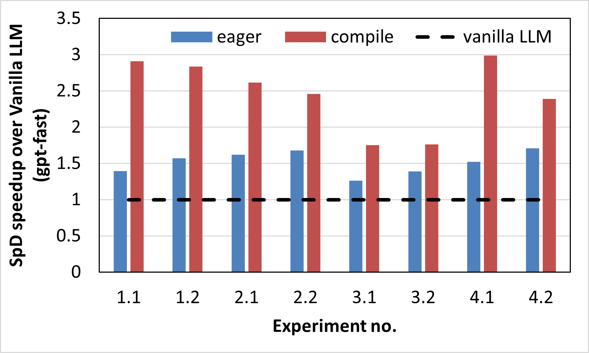                                                | 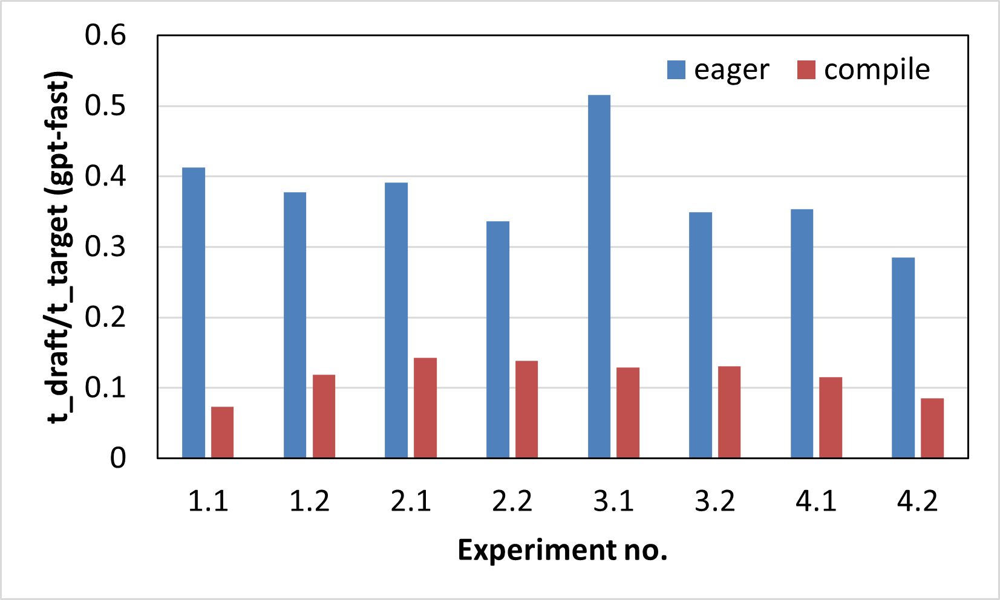                                   |
| ---------------------------------------------------------------------------------------------------- | --------------------------------------------------------------------------------------------------- |
| **Figure 2a.** Out-of-the-box speedup of SpD over vanilla LLM token generation on MI300X (gpt-fast). | **Figure 2b.** Ratio of average forward pass latencies of the draft and target models (gpt-fast). |

Figure 2a. shows the improvement in tokens/sec of speculative decoding compared to a vanilla LLM token generation in both the eager and compile modes of PyTorch on MI300X for 8 different scenarios as described in Table 1. The speedup improvements are ranging from 1.26x - 1.71x in eager mode and from 1.75x - 2.99x in compile mode.
The draft lengths for the 8 experiments were set to 16, 8, 8, 8, 8, 6, 8 and 10 respectively.
The speedups obtained from speculative decoding depend on a variety of factors such as choice of the target and draft models, the type of tasks they were pre-trained on, the size difference between the two models, the semantic alignment between them leading to a low or high acceptance rate, the draft length (K), as well as the complexity of the evaluation task.
As can be seen from the figure, the speedups in compile mode are consistently higher than in eager mode (all other factors being constant).
This can be attributed to the spread in the token generation latencies of the target and draft models. Figure 2b. plots the ratio between the average forward pass latencies of the draft and target models, which shows that the spread between the two models is consistently higher in compile mode compared to the eager mode, i.e., the drafting phase incurs lower latency in compile mode than the eager mode, leading to better overall speedups in compile mode.

LLM token generation is a CPU overhead-bound problem since it has a lot of short-lived kernels that incur a higher kernel launch latency from the host CPU than the time spent by the GPU to perform the computations. This kernel launch overhead tends to dominate the overall model runtime leading to lower performance. This also explains why even though the draft and target model sizes are far apart (size difference is at least ~9X), the execution times are only up to 3.5x apart in eager mode.
On the other hand, `torch.compile` increases the latency gap between the draft and target models, thus leading to improved speculative decoding performance. `torch.compile` achieves this using two main optimizations: first, it reduces the kernel launch overhead through a variety of techniques, the most significant of them being [HIP Graphs](https://rocm.docs.amd.com/projects/HIP/en/docs-develop/how-to/hip_runtime_api/hipgraph.html), which enables `torch.compile` to capture all the kernels from a larger code region into a single compiled region and launch them all at once, thus reducing the launching overhead. Under the hood, the underlying HIP API calls and their dependencies are predefined and collected within a graph, that then requires only a single call to launch on the GPU, after which the HIP runtime takes care of executing the operations within the graph. In addition to reducing the kernel launch overhead, graphs provide an additional performance benefit, by enabling optimizations that are only possible when the kernel dependencies are known in advance. This feature feeds into the second set of optimizations provided by `torch.compile` in which it replaces some of the native kernels from PyTorch and rocBLAS by compiler-generated kernels for both matrix multiplications and attention calculations, which are much faster in practice.
The combined effect of these two optimizations in `torch.compile` is faster LLM decoding, however, the amount of speedup is not equal across models - the compile mode favors the draft models more than the target models causing their execution latencies to spread farther apart and thus improving speculative decoding execution latency.

### vLLM speedup across use-cases (B=1)

| 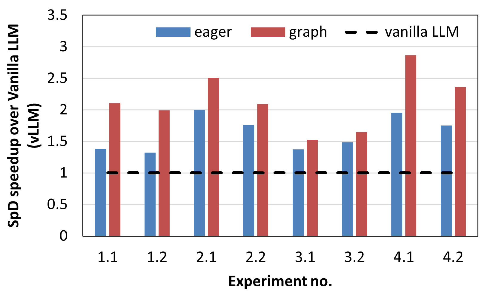                                                | 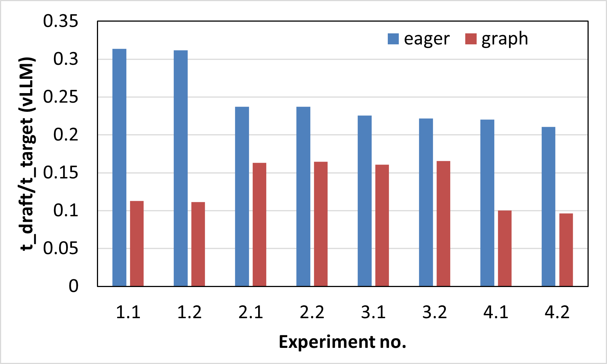                                   |
| ---------------------------------------------------------------------------------------------------- | --------------------------------------------------------------------------------------------------- |
| **Figure 3a.** Out-of-the-box speedup of SpD over vanilla LLM token generation on MI300X (vLLM). | **Figure 3b.** Ratio of average forward pass latencies of the draft and target models (vLLM). |

The same experiments described above were performed using the vLLM framework and the results are reported in Figure 3.
Figure 3a. shows the speedup of speculative decoding compared to a vanilla LLM token generation in both the eager and graph modes of PyTorch on MI300X for 8 different scenarios as described in Table 1.
The speedup improvements range from 1.32x - 2x in eager mode and from 1.5x - 2.9x in compile mode.
The draft lengths for the 8 experiments were set to 8, 8, 8, 6, 3, 4, 8 and 6 respectively.
In the case of vLLM too, the speedup in graph mode is higher than in eager mode although the difference is less pronounced.
The corresponding forward pass latency ratios of the draft and target models are plotted in Figure 3b. which demonstrate a larger spread between the model latencies in graph mode versus eager, leading to better performance improvements in the former.
Note that similar to `torch.compile` in gpt-fast, the graph mode in vLLM also makes use of HIP graphs under the hood to reduce the kernel launch latencies, thus leading to latency reduction, especially in smaller models.
It, however, does not perform other optimizations used in `torch.compile` such as kernel re-compilation and performance tuning, due to which the model latency spread is less pronounced in graph mode compared to gpt-fast's compile mode.
Finally, vLLM's performance in eager mode is better than that of gpt-fast mainly due to optimizations to the attention module - vLLM utilizes the more efficient paged attention kernel whereas gpt-fast uses native pytorch-based kernels.

### vLLM SpD speedup (B > 1)

In this section, we investigate the performance improvement provided by speculative decoding with increasing batch sizes. We used the model combination from experiment no. 1.2 for this study, i.e. the target model is PhindCodeLlama-v2-34B and the draft model is TinyLlama-1.1B. The draft length was set at 8. We performed inference on the entire test split of the HumanEval dataset and measured the total decode latency.

| 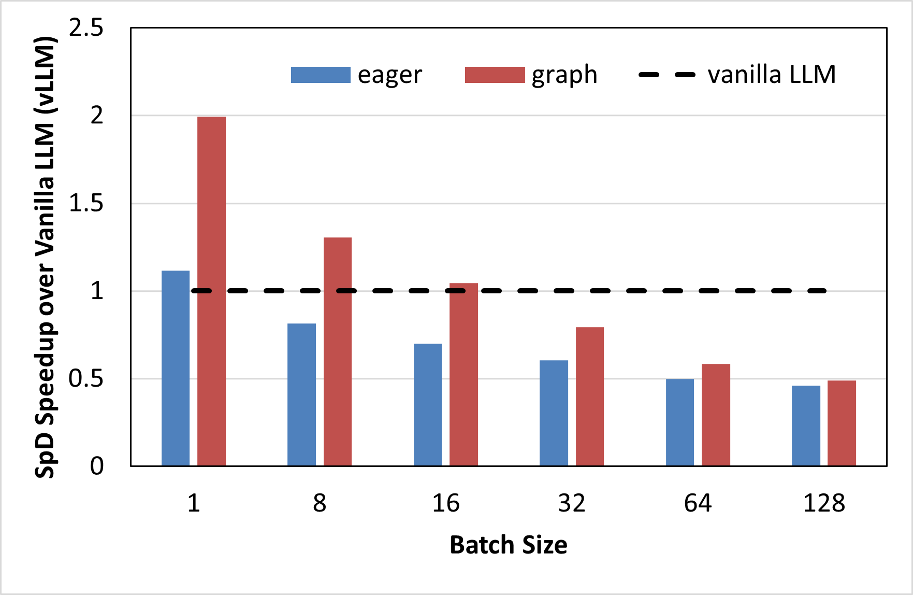                                                | 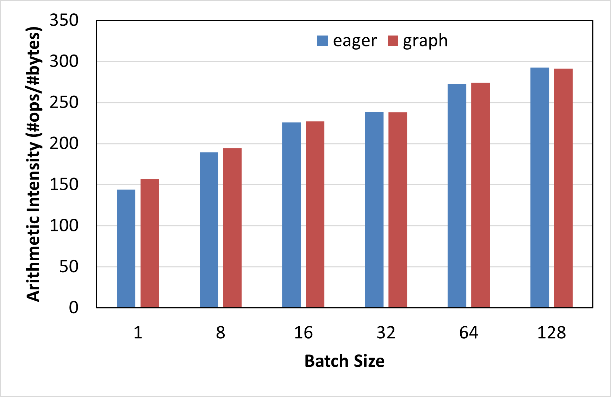                                   |
| ---------------------------------------------------------------------------------------------------- | --------------------------------------------------------------------------------------------------- |
| **Figure 4a.** Out-of-the-box speedup of SpD over vanilla LLM token generation on MI300X (vLLM). | **Figure 4b.** Arithemtic Intensity in #FLOPs/byte of SpD on MI300X (vLLM) |

Figure 4a. shows the speculative decoding speedup for batch sizes ranging from 1 to 128.
As can be seen from the figure, the speedup steadily decreases with increasing batch sizes: in eager mode, we observe slowdowns in speculative decoding compared to vanilla LLM inference from batch size 8 onwards, whereas in graph mode, the slowdown occurs from batch size 32.
This is because, at larger batch sizes, the LLM inference workload becomes less memory bandwidth bound and more compute-bound, due to which speculative decoding, which is a technique designed to accelerate memory-bound workloads, fumbles.
Figure 4b. further corroborates this observation by demonstrating that the arithmetic intensity of speculative execution at various batch sizes increases with batch size, thus lowering its efficacy in LLM inference acceleration. A higher arithmetic intensity indicates a more compute-bound workload.

### Deeper Performance Profiling

In this section, we utilize the PyTorch profiler to collect CPU and GPU traces of the workload in both the frameworks.
We used the PhindCodeLlama-v2-34B model for this experiment in which we capture the function call traces while it generates 10 tokens for a single input sample from HumanEval after running 3 warmup iterations.
Figures 5ab, and Figures 6ab, show the kernel traces on MI300X using gpt-fast, and vLLM, respectively in both eager and compile/graph execution modes.

| 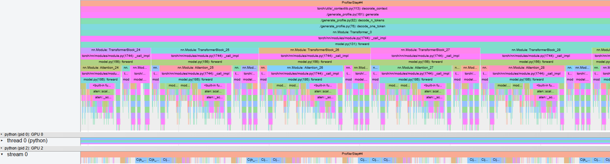         |
| ---------------------------------------------------------------------------------------------- |
| **Figure 5a.** Function call trace of LLM generation on MI300x using gpt-fast in eager mode.|

| 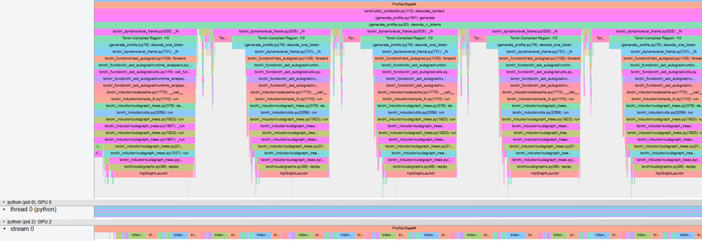         |
| ---------------------------------------------------------------------------------------------- |
| **Figure 5b.** Function call trace of LLM generation on MI300x using gpt-fast in compile mode.|

| 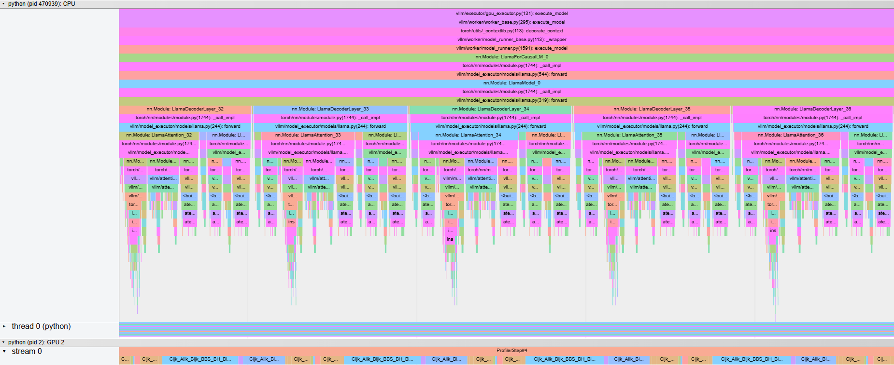         |
| ---------------------------------------------------------------------------------------------- |
| **Figure 6a.** Function call trace of LLM generation on MI300x using vLLM in eager mode.|

| 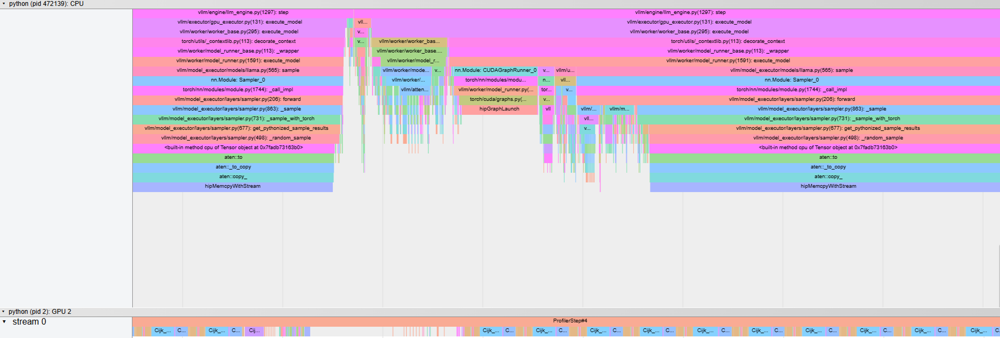         |
| ---------------------------------------------------------------------------------------------- |
| **Figure 6b.** Function call trace of LLM generation on MI300x using vLLM in graph mode.|

Figures 5a. and 6a. show that in the eager mode, the kernels are launched from the host as and when the host traverses through the program leading to gaps in kernel launches and under-utilization of the GPU, which in turn leads to higher decode latencies.
On the other hand, Figures 5b. and 6b. demonstrate that in the graph mode of execution, the initial code region is replaced by a compiled code region which collects all the kernels into a graph and uses a single function call to launch this graph on the GPU, leading to fewer GPU idle times and improved decoding latencies.

| 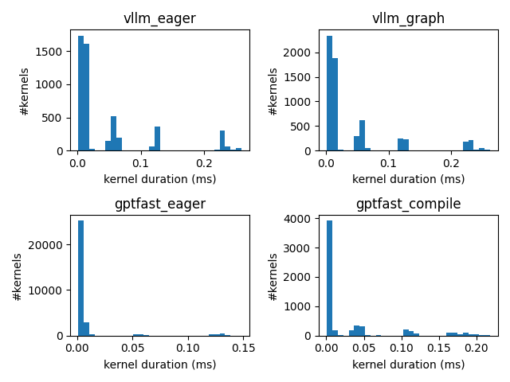                                            |
| ------------------------------------------------------------------------------------ |
| **Figure 7.** Histogram of kernel duration on MI300X during the Decode Phase.        |

Figure 7 shows a histogram plot of all the kernels executed on MI300X during the decode phase of PhindCodeLlama-v2-34B while generating 10 tokens.
We observe that the number of kernels in vLLM is slightly higher in graph mode compared to eager mode, but most of the kernels have a shorter duration leading to lower latency in graph mode.
In gpt-fast, the eager mode launches a lot more, albeit short-lived kernels than compile mode which explains the longer inference latency in eager mode. Compile mode, on the other hand, not only collects all the kernels into a graph to reduce kernel launch latency, but also optimizes them through re-compilation and kernel fusion to create more efficient kernels.

| 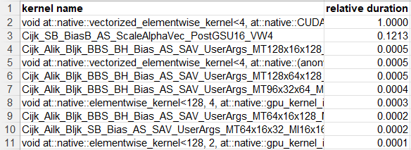 | 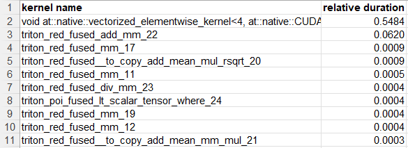 |
| ---------------------------------------------------------------- | -------------------------------------------------------------------- |
| 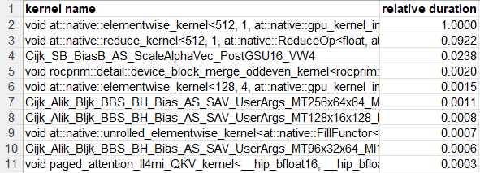        | 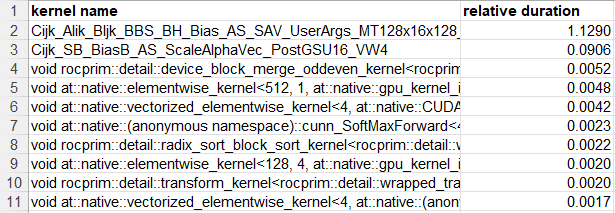            |

**Figure 8.** Top 10 kernels launched during the decode phase and total relative duration across all dispatches for gpt-fast eager mode (top left), gpt-fast compile mode (top right), vLLM eager mode (bottom left), vLLM graph mode (bottom right).

Figure 8 shows the relative kernel durations (relative to the top-most kernel in eager mode) of the top-10 kernels across all dispatches launched during the token generation phase of PhindCodeLlama-v2-34B. We observe that in gpt-fast, most of the native kernels used in eager mode are replaced by compiler-generated kernels in compile mode with shorter execution latencies. In vLLM, on the other hand, most of the native kernels used in eager mode remain the same in graph mode with similar execution times.
Finally, the overall execution time of gpt-fast in compile mode is ~12-21% faster than the graph mode in vLLM.

## Takeaways and Insights

- For speculative decoding to yield reasonable speedups, it is not enough for the draft and target model sizes to be >10x apart, their forward pass latencies should also have a similar ratio.
- `torch.compile` mode in gpt-fast and graph mode in vLLM help to increase the latency gap between the target and draft models as smaller models can benefit from these optimizations more than larger models.
- Speculative Decoding is more suitable for inference acceleration at smaller batch sizes and provides diminishing gains with increase in batch size.
- gpt-fast eager mode launches a lot of kernels and is generally inefficient compared to compile mode. The performance difference between graph and eager modes in vLLM is less pronounced.
- The compile mode in gpt-fast and graph mode in vLLM favor smaller models more than larger models.

## Summary

- In this blog post, we demonstrated that Speculative Decoding can lead to considerable speedup on MI300X (up to 3x out-of-the-box) and is natively supported on MI300X in several popular ML inference back-end libraries.
- Multiple options exist for experimentation, development, and production deployment, with trade-offs in performance and features.
- The use of speculative token generation is a rapidly evolving space; this post serves as a blueprint to explore the latest speculative token generation techniques, like Eagle, reDrafter, and multi-token prediction on AMD Instinct MI GPUs.

Finally, for further interesting case studies with speculative decoding on AMD Instinct GPUs, we direct the interested reader to these articles: [Speculative Decoding - Deep Dive](https://rocm.blogs.amd.com/software-tools-optimization/speculative-decoding---deep-dive/README.html?utm_source=LinkedIn&utm_medium=Social&utm_campaign=ai-tech-v&utm_content=Anush), [Speed Up Text Generation with Speculative Sampling on AMD GPUs](https://rocm.blogs.amd.com/artificial-intelligence/speculative-decoding/README.html), [Introducing the First AMD SLM (Small Language Model)](https://www.amd.com/en/developer/resources/technical-articles/introducing-amd-first-slm-135m-model-fuels-ai-advancements.html) and [vLLM x AMD: Efficient LLM Inference on AMD Instinct™ MI300X GPUs (Part 3)](https://www.amd.com/en/developer/resources/technical-articles/vllm-x-amd-highly-efficient-llm-inference-on-amd-instinct-mi300x-gpus-part3.html).
