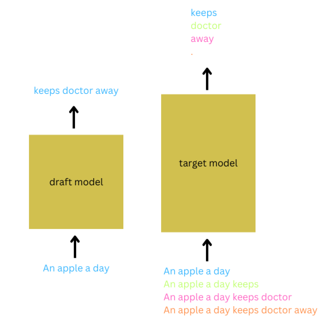
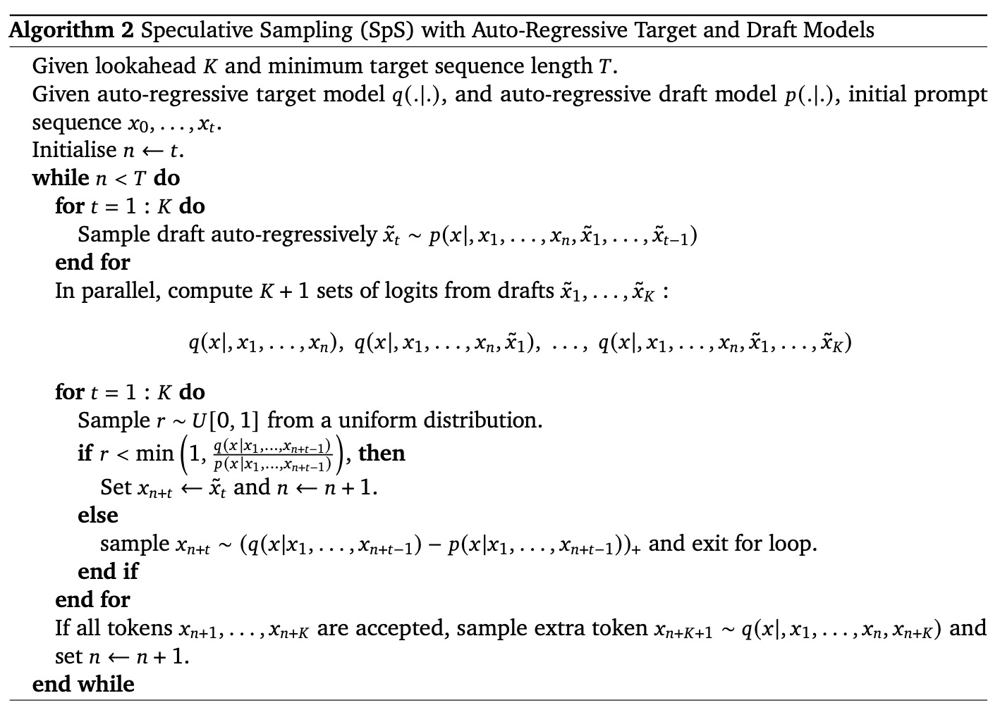

# Speed Up Text Generation with Speculative Sampling on AMD GPUs

As the size of transformer models grow, so does the cost of conducting inference, impacting latency and throughput. Compression methods such as quantization and distillation, as well as hardware-aware optimizations such as Flash Attention and Triton, have been proposed to cut down the computation cost at different levels. However, these models either compromise on accuracy or require major changes to the model implementation.

Speculative Sampling is a technique that speeds up inference (2-2.5x on a 70B Chinchilla model) with no change in mathematical accuracy and no change in model configuration or training. Moreover, it can be combined with the above optimization strategies to further reduce the latency of text generation.
In this blog post we will briefly introduce you to Speculative Sampling, its algorithmic approach based on draft and target models, and its realization on AMD GPUs using ROCm.

## Understanding Speculative Sampling

Speculative Sampling was proposed in [Accelerating Large Language Model Decoding
with Speculative Sampling](https://arxiv.org/pdf/2302.01318) by DeepMind and [Fast Inference from Transformers via Speculative Decoding](https://arxiv.org/pdf/2211.17192) by Google Research. Despite slight differences, they propose similar strategies to reduce the inference cost in large language models.

At a high level, Speculative Sampling employs an [Assisted Generation](https://huggingface.co/blog/assisted-generation) methodology, using a small-sized draft model to generate the next `k` tokens and a large-sized target model to verify the generated tokens.  The total time needed to generate and verify tokens using this method is less than the time needed to generate tokens using a large-sized target model alone.

The rationale behind using a draft model is that most "next token" predictions are simple and obvious. For example, they can be common phrases or expected pronouns. Imagine using a multi-billion parameter model's forward pass only to generate a comma as the next token!  Could a smaller version of the model do that? In most cases it could.

Additionally, most computations in a transformer model are memory-bound more than they are computation-bound. The memory bandwidth usage of matrix multipliers and large KV caches increase as the number of parameters increaces, making it necessary to reduce the size of the model and thereby decrease latency.

Furthermore, Speculative Sampling scores and verifies the K tokens in parallel which produces a speed improvement over traditional autoregression.

To illustrate Speculative Sampling, consider the input prompt, "An apple a day." Setting K=3, the draft model autoregressively speculates that the next 3 tokens will be "keeps doctor away." The target model batches the input prompt with different continuations of the predicted tokens to verify these predictions. When the verification criteria are met, and the draft model’s distribution is close to that of target's for all three tokens, all three tokens are accepted. In addition to accepting the prediction for the first `K` tokens, the prediction for the `(K+1)` token from the target model is also accepted. In this case, `K+1` tokens were generated within a single forward pass of the large model and `K` forward passes of the draft model, drastically reducing the latency. This whole process is repeated until the desired length of the sequence is reached.



Naturally, we would now be curious to know what happens if the verification fails for any predicted token. To tackle this, the authors proposed a ```Modified Rejection Sampling``` strategy. The verification strategy, described in Algorithm 2 below, takes the ratio of the probability that the target model predicts the token, `q(x_n+1|x_1,...,x_n)`, to the probability that the draft model predicts the token, `p(x_n+1|x_1,...,x_n)`. If this ratio falls above a specified threshold, the token is accepted. If it falls below the ratio, the token is rejected, and is resampled from a new distribution based on the differences between the two probabilities `q()-p()`.



Image source is [Chen et al.’s Speculative Sampling paper](https://arxiv.org/pdf/2302.01318)

Predictions made with a draft model have been shown to produce mathematically equivalent results to predictions made using a target model. However, it is important to choose a draft model that is in strong alignment with the target model. Choosing a smaller version of the target model as the draft model achieves the lowest latency possible.

## Requirements

The example of Speculative Sampling outlined in this blog used the following hardware and software:

* AMD GPU: List of supported OS and hardware on the [ROCm documentation page](https://rocm.docs.amd.com/projects/install-on-linux/en/latest/reference/system-requirements.html).

* ROCm 6.1.2: Refer to [ROCm installation instructions](https://rocm.docs.amd.com/projects/install-on-linux/en/latest/index.html).

* PyTorch 2.1.2: We will use the official ROCm Docker image [rocm6.1.2_ubuntu20.04_py3.9_pytorch_release-2.1.2](https://hub.docker.com/layers/rocm/pytorch/rocm6.1.2_ubuntu20.04_py3.9_pytorch_release-2.1.2/images/sha256-e3c1c3cde0886689b139daad7a62ad24af3f292855f683d7b28806ae9f1d2a7e?context=explore). You can run the following docker command to start a ROCm based pytorch session. Replace ```/YOUR/FOLDER``` with your home location to access local files.

  ```bash
  docker run -it --rm --device=/dev/kfd --device=/dev/dri --group-add=video --shm-size 8G -v /YOUR/FODLER:/root rocm/pytorch:rocm6.1.2_ubuntu20.04_py3.9_pytorch_release-2.1.2
  ```

* Install Hugging Face libraries
    ```pip install transformers datasets accelerate```

## Code

In this section, you will implement Speculative Sampling using the algorithm outlined in [Accelerating Large Language Model Decoding with Speculative Sampling](https://arxiv.org/pdf/2302.01318).

You will use the EleutherAI/gpt-neo-1.3B model as the draft model and the EleutherAI/gpt-neox-20B model as the target model. EleutherAI/gpt-neo-1.3B has 1.3 billion parameters, while EleutherAI/gpt-neox-20B has 20 billion parameters. The GPT Neo family of models, developed by the EleutherAI community, serves as an open-source alternative to GPT-3. For this blog, the GPT Neo family of models with N=30 and K=4 will be used for text generation.

The code used here can be found in [the Jupyter Notebook located in this blog's `src` directory](./src/sps.ipynb).

Begin by benchmarking the autoregressive sampling of `N=50` tokens using the target model. The total time taken to predict a string of 50 tokens is around 3.85s .

```python
from transformers import AutoTokenizer, AutoModelForCausalLM
import torch
torch.manual_seed(0)
import torch.nn.functional as F
import time
import numpy as np
np.random.seed(30)

draft_model = AutoModelForCausalLM.from_pretrained("EleutherAI/gpt-neo-1.3B", device_map='auto',torch_dtype=torch.float16)
draft_tokenizer = AutoTokenizer.from_pretrained("EleutherAI/gpt-neo-1.3B")
model = AutoModelForCausalLM.from_pretrained("EleutherAI/gpt-neox-20b", device_map='auto',torch_dtype=torch.float16)
tokenizer = AutoTokenizer.from_pretrained("EleutherAI/gpt-neox-20b")

model.device.type=='cuda', draft_model.device.type=='cuda'

prompt = "Difference between a gasoline and hybrid vehicles is"
K=4
N=50

############## Autoregressive sampling test ##############
inputs = tokenizer(prompt, return_tensors="pt")
inp = inputs['input_ids'].to('cuda')
start = time.time()
while(inp.shape[-1]<N):
    o = model(inp)
    o = torch.softmax(o.logits,-1)
    o = torch.argmax(o,-1)[0,-1]
    inp = torch.cat((inp, torch.tensor([[o]],device='cuda')),-1)
end=time.time()
# print(tokenizer.decode(inp[0]))
print(f'Time taken is {end-start}s')
```

```bash
Time taken is 3.85893177986145s
```

Now benchmark this blog's implementation of Speculative Sampling using the same pair of models. You can uncomment the debug statements in the code to observe the tokens accepted at every iteration.

```python
############## Sepculative Sampling test ##############
inputs = draft_tokenizer(prompt, return_tensors="pt")
inp = inputs['input_ids'].to('cuda')
print(inp)
start = time.time()
while(inp.shape[-1]<N):
    global_inp = [inp[0]]
    global_o=[]
    # global_tok=[]
    for i in range(K):
        o = draft_model(inp)#attn_mask)#,inputs['attention_mask'])
        o['logits'] = torch.softmax(o['logits'],-1)
        new_token = torch.argmax(o['logits'][0,-1])
        inp = torch.cat((inp,torch.tensor([[new_token]],device='cuda')),-1)
        global_inp.append(inp[0])
        global_o.append((new_token,o.logits[0,-1,new_token]))
        # print(draft_tokenizer.decode(new_token), new_token, o.logits[0,-1,new_token])
    # print('Draft output: ',global_tok)

    ########## VERIFY INPUTS FOR TARGET MODEL #########################
    # print("Inputs for the target model are:")
    # for i in range(len(global_inp)):
    #     print(draft_tokenizer.decode(global_inp[i], ignore_special_tokens=True))
    
    target_inp=[]
    for i in global_inp:
        target_inp.append(torch.tensor(tokenizer(draft_tokenizer.decode(i)).input_ids))
    first_tok_idx = target_inp[0].shape[0]
    target_inp_padded = torch.nn.utils.rnn.pad_sequence(target_inp,batch_first=True,padding_value=0)
    
    ########## VERIFY INPUTS FOR TARGET MODEL AFTER TOKENIZING & PADDING #########################
    # for i in range(len(global_inp)):
    #     print(tokenizer.decode(target_inp_padded[i], ignore_special_tokens=True))

    target_output = model(target_inp_padded.to('cuda'))#, attention_mask=torch.where(target_inp_padded>0,1,0))
    target_output.logits = torch.softmax(target_output.logits,-1)

    ########## PRINT SERIALIZED OUTPUTS FROM TARGET MODEL #########################
    # out = torch.argmax(target_output.logits,-1)
    # out_decode = [tokenizer.decode(out[i][first_tok_idx+i-1]) for i in range(K+1)]
    # print('Target output: ',out_decode)
    
    all_accepted=True
    inp = global_inp[0] #Preparing draft model input for next Speculative Sampling
    for i in range(K):
        print(f'K: {first_tok_idx+i-1}')
        token_idx, prob_d = global_o[i] #token index and probability from draft prediction
        # probability from target prediction for the same token
        prob_t = target_output.logits[i,first_tok_idx+i-1,tokenizer(draft_tokenizer.decode(token_idx)).input_ids[0]]

        # Accepted token
        if np.random.random() < min(1,prob_t/prob_d):
        # if prob_t/prob_d>=1:
            # print(f'Accepted {first_tok_idx+i-1} token: ', draft_tokenizer.decode(token_idx), token_idx)
            inp = torch.cat((inp,torch.tensor([token_idx],device='cuda')))
        
        # Modified Rejected token
        else:
            token_idx = torch.argmax(target_output.logits[i][first_tok_idx+i-1])
            # print(f'Replaced  {first_tok_idx+i-1} token: ', tokenizer.decode(token_idx), token_idx)
            draft_token_idx = draft_tokenizer([tokenizer.decode(token_idx)]).input_ids[0]
            inp = torch.cat((inp,torch.tensor(draft_token_idx,device='cuda')))
            all_accepted = False
            break
            
        if inp.shape[-1]==N-1:
            print(inp.shape)
            break
            
    # If all accepted then add extra token from target prediction
    if all_accepted:
        #print('All tokens are accepted, adding extra token')
        token_idx = torch.argmax(target_output.logits[-1,first_tok_idx+K-1])
        draft_token_idx = draft_tokenizer([tokenizer.decode(token_idx)]).input_ids[0]
        prob_t = torch.tensor(draft_token_idx,device='cuda')
        inp = torch.cat((inp,prob_t))

    print(f'After verification: {draft_tokenizer.decode(inp)}\n')
    inp = inp.unsqueeze(0) #batched input
end = time.time()
print(f'Time taken is {end-start}s')
```

In the output below, we display the verified output after each iteration of Speculative Sampling, along with the token indices accepted during the verification process. During most iterations, the target model accepts 3-4 tokens, demonstrating the effectiveness of Speculative Sampling in reducing latency. The total time taken is approximately 2.849 seconds (please note that this benchmark cannot be precisely replicated due to the pseudo-randomness inherent in PyTorch functions), which is approximately 1.35x faster.

```bash
K: 8
After verification: Difference between a gasoline and hybrid vehicles is that

K: 9
K: 10
K: 11
K: 12
After verification: Difference between a gasoline and hybrid vehicles is that the gasoline vehicle has

K: 13
K: 14
After verification: Difference between a gasoline and hybrid vehicles is that the gasoline vehicle has a fuel

K: 15
K: 16
After verification: Difference between a gasoline and hybrid vehicles is that the gasoline vehicle has a fuel tank that

K: 17
K: 18
K: 19
K: 20
After verification: Difference between a gasoline and hybrid vehicles is that the gasoline vehicle has a fuel tank that is filled with gasoline.

K: 22
K: 23
After verification: Difference between a gasoline and hybrid vehicles is that the gasoline vehicle has a fuel tank that is filled with gasoline. The hybrid

K: 24
K: 25
K: 26
K: 27
After verification: Difference between a gasoline and hybrid vehicles is that the gasoline vehicle has a fuel tank that is filled with gasoline. The hybrid vehicle has a fuel tank

K: 29
K: 30
K: 31
K: 32
After verification: Difference between a gasoline and hybrid vehicles is that the gasoline vehicle has a fuel tank that is filled with gasoline. The hybrid vehicle has a fuel tank that is filled with a

K: 34
K: 35
After verification: Difference between a gasoline and hybrid vehicles is that the gasoline vehicle has a fuel tank that is filled with gasoline. The hybrid vehicle has a fuel tank that is filled with a fuel that

K: 36
K: 37
After verification: Difference between a gasoline and hybrid vehicles is that the gasoline vehicle has a fuel tank that is filled with gasoline. The hybrid vehicle has a fuel tank that is filled with a fuel that is a

K: 38
K: 39
K: 40
K: 41
After verification: Difference between a gasoline and hybrid vehicles is that the gasoline vehicle has a fuel tank that is filled with gasoline. The hybrid vehicle has a fuel tank that is filled with a fuel that is a mixture of gasoline and electricity

K: 43
K: 44
K: 45
After verification: Difference between a gasoline and hybrid vehicles is that the gasoline vehicle has a fuel tank that is filled with gasoline. The hybrid vehicle has a fuel tank that is filled with a fuel that is a mixture of gasoline and electricity. The electricity

K: 46
K: 47
torch.Size([49])
After verification: Difference between a gasoline and hybrid vehicles is that the gasoline vehicle has a fuel tank that is filled with gasoline. The hybrid vehicle has a fuel tank that is filled with a fuel that is a mixture of gasoline and electricity. The electricity is generated battery

Time taken is 2.8490023612976074s
```

Using a single AMD GPU, Speculative Sampling produced a 1.35x speedup over autoregression for generating 50 tokens. You can choose to replace these models with other existing models such as Google's Gemma(9B & 27B), Meta's Llama(7B & 70B), Mistral's models to analyze the speed up for text generation.

The implementation of Speculative Sampling in this blog is for demonstration purposes only and has not been optimized for performance analysis. Outputs from Autoregressive Sampling and Speculative Sampling on the same prompt may not be identical, as seen in the above two experiments. This is attributed to different processing of pseudo-random seeds in both strategies, resulting in different numerics. However, the algorithm assures that decoded tokens come from the same distribution.

## Summary

In this blog post we provided a brief introduction to an assisted text generation methodology called Speculative Sampling. We explained the principles underlying Speculative Sampling, its use of two models from the same family of models to speed up generation inference by approximately 2x for given hardware with guaranteed mathematical accuracy and with no change in training architecture or implementation. We then demonstrated how you can leverage the power of AMD hardware and ROCm to realize Speculative Sampling over a range of models.

## Disclaimers

Third-party content is licensed to you directly by the third party that owns the content and is not licensed to you by AMD. ALL LINKED THIRD-PARTY CONTENT IS PROVIDED “AS IS” WITHOUT A WARRANTY OF ANY KIND. USE OF SUCH THIRD-PARTY CONTENT IS DONE AT YOUR SOLE DISCRETION AND UNDER NO CIRCUMSTANCES WILL AMD BE LIABLE TO YOU FOR ANY THIRD-PARTY CONTENT. YOU ASSUME ALL RISK AND ARE SOLELY RESPONSIBLE FOR ANY
DAMAGES THAT MAY ARISE FROM YOUR USE OF THIRD-PARTY CONTENT.
