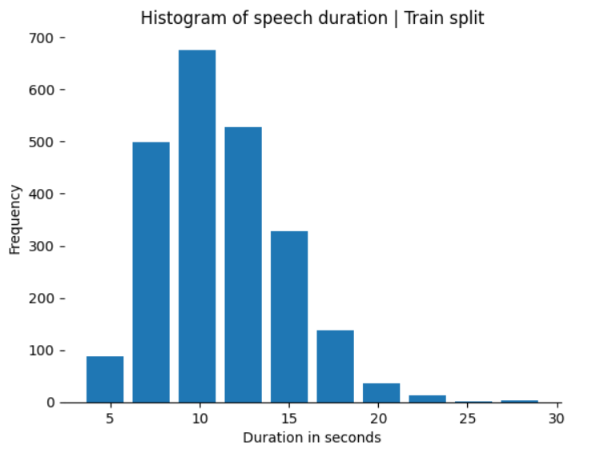

# Fine-tuning and Testing Cutting-Edge Speech Models using ROCm on AMD GPUs

AI Voice agents, or voice bots, are designed to communicate with people using a spoken language. Voice bots are commonly deployed in customer service and personal assistant applications, and have the potential to enter and revolutionize almost every aspect of people’s interaction with technology that can benefit from the use of voice.
Automatic Speech Recognition (ASR), the technology that processes human speech into text, is essential for the creation of AI Voice agents. In this blog post we will provide you with a hands-on introduction to the deployment of three machine learning ASR models, using ROCm on AMD GPUs.

We will first cover how to fine-tune the [Wav2Vec 2.0](https://arxiv.org/abs/2006.11477) model for Automatic Speech Recognition (ASR) in Spanish, highlighting how this approach efficiently recognizes spoken Spanish.
We will then show you how to explore audio classification, the task of identifying and categorizing different types of audio such as speech, environmental sounds, or music, with the [Audio Spectrogram Transformer](https://arxiv.org/abs/2104.01778) model, emphasizing its precision and reliability in categorizing audio signals.
Finally, we will discuss the task of speaker diarization, or modeling and identifying each speaker in an audio stream, using the [PyAnnote.Audio](https://github.com/pyannote/pyannote-audio) toolkit, demonstrating in practice its effectiveness in distinguishing between different speakers.

The fine-tuning and testing processes illustrated in this blog underscore the usefulness and robustness of AMD’s products and technology, which makes AMD GPUs and ROCm an ideal choice for speech-processing applications.

You can find the resources related to this blog post in this
[GitHub folder](https://github.com/ROCm/rocm-blogs/tree/release/blogs/artificial-intelligence/speech_models).

## Requirements

* AMD GPU: See the [ROCm documentation page](https://rocm.docs.amd.com/projects/install-on-linux/en/latest/reference/system-requirements.html) for supported hardware and operating systems.

* ROCm 6.1: See the [ROCm installation for Linux](https://rocm.docs.amd.com/projects/install-on-linux/en/latest/index.html) for installation instructions.

* Docker: See [Install Docker Engine on Ubuntu](https://docs.docker.com/engine/install/ubuntu/#install-using-the-repository) for installation instructions.

* PyTorch 2.1.2: This blog uses the official ROCm Docker image found at: [rocm/pytorch:rocm6.1_ubuntu22.04_py3.10_pytorch_2.1.2](https://hub.docker.com/layers/rocm/pytorch/rocm6.1_ubuntu22.04_py3.10_pytorch_2.1.2/images/sha256-f6ea7cee8aae299c7f6368187df7beed29928850c3929c81e6f24b34271d652b?context=explore).

* Hugging Face Access Token: This blog requires a [Hugging Face](https://huggingface.co/) account with a newly generated [User Access Token](https://huggingface.co/docs/hub/security-tokens).

## Running this blog

* Clone the repo and `cd` into the blog directory:

    ```shell
    git clone git@github.com:ROCm/rocm-blogs.git
    cd rocm-blogs/blogs/artificial-intelligence/speech_models
    ```

* Build and start the container. For details on the build process, see the `speech_models/docker/Dockerfile`.

    ```shell
    cd docker
    docker compose build
    docker compose up
    ```
  
* Access http://localhost:8888/lab/tree/src/speech_models.ipynb in your browser and open the `speech_models.ipynb` notebook.

You can follow along with the exercise in this blog using the `speech_models.ipynb` notebook

## Exploring the google/fleur dataset

This blog uses the [`google/fleurs`](https://paperswithcode.com/dataset/fleurs) dataset ([available at Hugging Face](https://huggingface.co/datasets/google/fleurs)) to fine-tune an Automatic Speech Recognition model in Spanish. The Few-shot Learning Evaluation of Universal Representations of Speech benchmark in `google/fleurs` is a dataset that spans 102 languages, each with approximately 12 hours of supervised speech data.

Begin by importing the following dependencies for this task:

```python
from transformers import Wav2Vec2CTCTokenizer, Wav2Vec2FeatureExtractor, Wav2Vec2Processor, TrainingArguments, Trainer, Wav2Vec2ForCTC, AutoFeatureExtractor, AutoModelForAudioClassification
from huggingface_hub import login
from unidecode import unidecode
import json
import re
import torch

import evaluate

from datasets import load_dataset, load_metric, DatasetDict
import numpy as np
import pandas as pd
import IPython.display as ipd

import random
from IPython.display import Audio, display

pd.set_option('display.max_columns', None)
pd.set_option('display.max_rows', None)
pd.set_option('display.max_colwidth', None)
```

Then load and explore the `google/fleurs` dataset:

```python
# Load the dataset

dataset = load_dataset(
    "google/fleurs", 
    "es_419", 
    split={'train':'train', 'test':'test', 'validation':'validation'},
    trust_remote_code=True
)

'''
Google/fleurs dataset contains some inconsistent audio examples depending on the
language selected. For the Spanish language, one workaround is to filter for those 
invalid records by noticing that the maximum value of the waveform is around 1e-4. 
For more information see the corresponding discussion on Hugging Face:
https://huggingface.co/datasets/google/fleurs/discussions/16
'''
dataset = dataset.filter(lambda example: example['audio']['array'].max()>1e-4)
dataset
```

```text
DatasetDict({
    train: Dataset({
        features: ['id', 'num_samples', 'path', 'audio', 'transcription', 'raw_transcription', 'gender', 'lang_id', 'language', 'lang_group_id'],
        num_rows: 2306
    })
    test: Dataset({
        features: ['id', 'num_samples', 'path', 'audio', 'transcription', 'raw_transcription', 'gender', 'lang_id', 'language', 'lang_group_id'],
        num_rows: 908
    })
    validation: Dataset({
        features: ['id', 'num_samples', 'path', 'audio', 'transcription', 'raw_transcription', 'gender', 'lang_id', 'language', 'lang_group_id'],
        num_rows: 408
    })
})
```

The dataset in this output consists of a DatasetDict object with corresponding `train`, `test`, and `validation` splits. The `num_rows` property in each split indicates the number of records the split contains.

> **Note:** Depending on the language selected, the `Google/fleurs` dataset contains some inconsistent audio examples. For the Spanish language, one workaround is to filter for those invalid records by noticing that the maximum value of the waveform is around 1e-4. For more information, see the corresponding [discussion on Hugging Face](https://huggingface.co/datasets/google/fleurs/discussions/16).

First explore the first example in the `train` split:

```python
# Explore the first record on the train split
dataset["train"][0]
```

```text
{'id': 844,
 'num_samples': 92160,
 'path': '/root/.cache/huggingface/datasets/downloads/extracted/ceb7b7f0b52887eaab6f672ec380d2cb9d46b7b8423185434fb6b186f63d4b2b/10005668950815513748.wav',
 'audio': {'path': 'train/10005668950815513748.wav',
  'array': array([0., 0., 0., ..., 0., 0., 0.]),
  'sampling_rate': 16000},
 'transcription': 'los murales o garabatos indeseados reciben el nombre de grafiti',
 'raw_transcription': 'Los murales o garabatos indeseados reciben el nombre de grafiti.',
 'gender': 1,
 'lang_id': 20,
 'language': 'Spanish',
 'lang_group_id': 0}
```

The first example in the `train` split consists of an array with 92,160 values. This array represents the audio data in numerical form, corresponding to the actual audio waveform sampled at a rate of 16,000 values per second (16kHz). This results in a total of 5.76 seconds of audio data. You can also observe the text transcription of the contents of the audio file, which corresponds to a female speaker in Spanish language.

Inside the notebook you can listen to a few random examples from the `train` split:

```python
# Dictionaries with label to id and viceversa
labels = dataset["train"].features["gender"].names[:2] # Extract gender of person's speech
label2id, id2label = dict(), dict()
for i, label in enumerate(labels):
    label2id[label] = str(i)
    id2label[str(i)] = label


# Explore some dataset examples
idx_list = []
num_examples = 5

for _ in range(num_examples):
    rand_idx = random.randint(0, len(dataset["train"])-1)
    example = dataset["train"][rand_idx] # select a random example
    audio = example["audio"] # extract waveform
    idx_list.append(rand_idx) 

    print(f'Item: {rand_idx} | Label: {id2label[str(example["gender"])]}={label2id[id2label[str(example["gender"])]]}')
    print(f'Shape: {audio["array"].shape}, sampling rate: {audio["sampling_rate"]}')
    display(Audio(audio["array"], rate=audio["sampling_rate"]))
    print()
```

> **Note:** You must run the notebook to listen to the samples of the audio recordings

You can also display the raw transcription of the random samples:

```python
# Display the corresponding Raw text transcription of each audio record
pd.DataFrame({'sentence':dataset['train'][idx_list]['raw_transcription']})
```

| Sentence | Content |
| --- | --- |
| 1 | La forma evidente de viajar en la primera clase o en la clase ejecutiva de un avión es gastar una fortuna por ese privilegio (o, lo que es mejor, hacer que su compañía pague por usted). |
| 2 | Desde entonces, el brasileño ha jugado para el equipo en 53 enfrentamientos, en todos los campeonatos, y ha convertido 24 veces. |
| 3 | «Actualmente, tenemos ratones de cuatro meses de edad que antes solían ser diabéticos y que ya no lo son», agregó. |
| 4 | Se llevaron a cabo manifestaciones a nivel mundial, se condujeron numerosos juicios criminales, y los jefes de estado tanto de Islandia como de Pakistán renunciaron. |
| 5 | Muchas personas comprobaron el hallazgo mediante el uso de varios tipos de hardware y software y a comienzos del mes de febrero y se dio a conocer el martes. |

The text transcriptions listed above contain vocabulary and characters that are part of the Spanish Language. You must pre-process them before feeding them into your model.

Additionally, you can explore how the durations of the examples in the `train` split are distributed. Use this code sample to create a histogram of the audio clip durations.

```python
# Histogram: duration of audio records in train split

sampling_rate = 16000

duration_in_seconds = pd.Series([len(k['audio']['array'])/sampling_rate for k in dataset['train']])

ax = duration_in_seconds.hist(rwidth = 0.8)
ax.set_xlabel('Duration in seconds')
ax.set_ylabel('Frequency')
ax.grid(False)
ax.spines['top'].set_visible(False)
ax.spines['right'].set_visible(False)
ax.spines['left'].set_visible(False)
ax.set_title('Histogram of speech duration | Train split')
```



The histogram shows that most of the audio files have a duration of around 10 to 15 seconds.

## Fine-tuning and testing speech models

The following subsections show how to fine-tune the [Wav2Vec 2.0](https://arxiv.org/abs/2006.11477) model for Spanish speech recognition from audio recordings. Wav2Vec 2.0 is a self-supervised pretrained model for speech representations capable of learning features from raw audio alone. It can be fine-tuned for tasks like audio classification and automatic speech recognition. Additionally, the blog demonstrates how to perform inference with the [Audio Spectrogram Transformer](https://arxiv.org/abs/2104.01778) model for audio classification and use the [PyAnnote toolkit](https://pypi.org/project/pyannote.audio/) for speaker diarization.

### Fine-tuning Wav2Vec 2.0 for automatic speech recognition in Spanish

The Wav2Vec 2.0 model, developed by Facebook AI research, is a state-of-the-art framework for automatic speech recognition (ASR). It processes raw audio waveforms using convolutional neural networks to extract meaningful features from the audio data. The model is trained in two phases. In the first phase, it learns general audio representations through self-supervised learning, predicting the masked portions of the input audio. In the second, the model is fine-tuned for specific ASR tasks using labeled data.

The Wav2Vec2-Large-XLSR-53, a variant of the Wav2Vec 2.0 model, is designed for cross-lingual speech recognition. This variant has been trained on 56,000 hours of speech data across 53 languages. It aims to capture a large diversity of linguistic properties, making it effective for ASR tasks.

The process of fine-tuning Wav2Vec2-Large-XLSR-53 for the specific task of Spanish speech recognition on the `google/fleurs` dataset involves adapting the pre-trained model to the Spanish language by fine-tuning it with a relatively small amount of labeled data. This enables the model to recognize and transcribe Spanish speech more accurately.

Fine-tuning typically involves resampling the audio data at 16kHz and processing the text labels to remove special characters and normalize them. The audio waveforms in the `google/fleurs` dataset are already sampled at 16kHz, so you can focus on removing the special characters and normalizing the values.

To fine-tune your custom model, create a custom data collator `DataCollatorCTCWithPadding` class. The purpose of this class is to batch, pad, and preprocess the data so it meets the model's input requirements during training.

```python
class DataCollatorCTCWithPadding:

    def __init__(self, processor, padding = True):
        self.processor = processor
        self.padding = padding

    def __call__(self, features):

        # Split input and labels. They might need different padding methods
        input_features = [{"input_values": feature["input_values"]} for feature in features]
        label_features = [{"input_ids": feature["labels"]} for feature in features]

        # Pad input features
        batch = self.processor.pad(input_features, padding = self.padding, return_tensors = "pt")

        # Prepare labels for processing and use processor
        label_texts = [self.processor.decode(feature["input_ids"], skip_special_tokens = True) for feature in label_features]
        labels_batch = self.processor(text = label_texts, padding = self.padding, return_tensors = "pt")
        
        # Replace padding with -100 to ignore
        labels = labels_batch["input_ids"].masked_fill(labels_batch.attention_mask.ne(1),-100)
        batch["labels"] = labels

        return batch
```

Next, define a custom `ASRFineTuner` class to assist with the fine-tuning task:

<details>
<summary> Custom fine-tuning class (click to expand)</summary>

```python
class ASRFineTuner:

    def __init__(self, pretrained_model_tag, dataset_name, output_dir, num_train_epochs = 5, learning_rate=3e-4, batch_size = 16):
        
        self.pretrained_model_tag = pretrained_model_tag
        self.dataset_name = dataset_name
        self.output_dir = output_dir
        self.num_train_epochs = num_train_epochs
        self.learning_rate = learning_rate
        self.batch_size = batch_size
        
        # Load and preprocess dataset
        self.dataset = load_dataset(self.dataset_name, "es_419", split={'train':'train', 'test':'test', 'validation':'validation'}, trust_remote_code=True)
        self.dataset = self.dataset.filter(lambda example: example['audio']['array'].max()>1e-4) #remove invalid examples
        
        self.tokenized_dataset =  self.dataset.map(self._remove_special_characters)
        self._create_vocabulary_json() # Create vocabulary tokens file
        
        self.vocab_dict = None # contains the vocabulary letters. For display only

        # Load tokenizer, feature extractor, processor
        self.tokenizer = Wav2Vec2CTCTokenizer("./vocab.json", unk_token="[UNK]", pad_token="[PAD]", word_delimiter_token="|",)
        self.feature_extractor = Wav2Vec2FeatureExtractor(feature_size=1, sampling_rate=16000, padding_value=0.0, do_normalize=True, return_attention_mask=True)
        self.processor = Wav2Vec2Processor(feature_extractor = self.feature_extractor, tokenizer = self.tokenizer)

        # Tokenize dataset
        self.tokenized_dataset = self.tokenized_dataset.map(self._prepare_dataset, num_proc=4, remove_columns=self.dataset.column_names["train"]) 
        self.train_dataset = self.tokenized_dataset['train']
        self.test_dataset = self.tokenized_dataset['test']
        self.validation_dataset = self.tokenized_dataset['validation']        

        # Instantiate data collator
        self.data_collator = DataCollatorCTCWithPadding(processor=self.processor, padding=True)

        # Load the model
        self.model = Wav2Vec2ForCTC.from_pretrained(
            self.pretrained_model_tag, 
            attention_dropout=0.1,
            hidden_dropout=0.1,
            feat_proj_dropout=0.0,
            mask_time_prob=0.05,
            layerdrop=0.1,
            ctc_loss_reduction="mean", 
            pad_token_id = self.processor.tokenizer.pad_token_id,
            vocab_size = len(self.processor.tokenizer)
        ).to("cuda")
        
        # Wav2Vec2 layers are used to extract acoustic features from the raw speech signal. 
        # thus the feaure extraction part of the model has been sufficiently trained and does not need additional fine-tune
        self.model.freeze_feature_encoder() 

        # Gradient checkpointing reduces memory footprint during training  by storing
        # only a subset of intermediate activations and recomputing the rest during backward pass
        self.model.gradient_checkpointing_enable()
        
        
        # Training arguments
        self.training_args = TrainingArguments(
            output_dir = self.output_dir,
            group_by_length = True,
            per_device_train_batch_size = 4,
            per_device_eval_batch_size= 4,
            eval_strategy = "epoch",
            num_train_epochs=self.num_train_epochs,
            fp16=True, #enabled mixed precision
            save_steps = 100,
            eval_steps = 100,
            logging_steps = 10,
            learning_rate = self.learning_rate,
            warmup_steps = 50,
            save_total_limit = 2,
            push_to_hub = False
        )

    
        # Trainer
        self.trainer = Trainer(
            model = self.model,
            data_collator = self.data_collator,
            args = self.training_args,
            compute_metrics = self._compute_metrics,
            train_dataset = self.train_dataset,
            eval_dataset = self.validation_dataset,
            tokenizer = self.processor.feature_extractor,
        )

        # Inference results
        self.results = None
        

    # -- Helper methods --

    def _prepare_dataset(self, batch):
        audio = batch["audio"]
        
        # batched input_values and labels
        batch["input_values"] = self.processor(audio["array"], sampling_rate=16000).input_values[0]
        batch["labels"] = self.processor(text = batch['raw_transcription']).input_ids
        
        return batch

    def _remove_special_characters(self,batch):
        chars_to_ignore_regex =  "[.,?!;:'-=@$#<>\[\]_{}|&`~'*\/()+%0-9']"
        batch["raw_transcription"] = re.sub(chars_to_ignore_regex, "",unidecode(batch["raw_transcription"])).lower() + " "
        
        return batch

    def _extract_all_chars(self,batch):
      all_text = " ".join(batch["raw_transcription"])
      vocab = list(set(all_text))
        
      return {"vocab": [vocab], "all_text": [all_text]}

    def _create_vocabulary_json(self):
        # Aggreagates all the transcription text
        vocabs = self.tokenized_dataset.map(
            self._extract_all_chars, 
            batched=True, 
            batch_size=-1,
            keep_in_memory=True,
            remove_columns=self.dataset.column_names["train"]
        )

        # Create a vocabulary (letters) dictionary
        vocab_list = list(set(vocabs["train"]["vocab"][0]) | set(vocabs["test"]["vocab"][0]) | set(vocabs["validation"]["vocab"][0]))
        vocab_dict = {v: k for k, v in enumerate(vocab_list)}
        vocab_dict["|"] = vocab_dict[" "]
        del vocab_dict[" "]
        vocab_dict["[UNK]"] = len(vocab_dict)
        vocab_dict["[PAD]"] = len(vocab_dict)

        # Save the vocabulary as json for Wav2Vec2CTCTokenizer
        with open('vocab.json', 'w') as vocab_file:
            json.dump(vocab_dict, vocab_file)

        self.vocab_dict = vocab_dict

    def _compute_metrics(self, pred):
        pred_logits = pred.predictions
        pred_ids = np.argmax(pred_logits, axis=-1)
    
        pred.label_ids[pred.label_ids == -100] = self.processor.tokenizer.pad_token_id
    
        pred_str = self.processor.batch_decode(pred_ids) #predicted string
        label_str = self.processor.batch_decode(pred.label_ids, group_tokens=False) 

        wer_metric = evaluate.load("wer", trust_remote_code=True) #Word Error Rate metric
        wer = wer_metric.compute(predictions=pred_str, references=label_str)
        
        return {"wer": wer}

    def _map_to_result(self,batch):        
        with torch.no_grad():
            input_values = torch.tensor(batch["input_values"], device="cuda").unsqueeze(0)
            logits = self.model(input_values).logits
        
        pred_ids = torch.argmax(logits, dim=-1)
        batch["pred_str"] = self.processor.batch_decode(pred_ids)[0]
        batch["text"] = self.processor.decode(batch["labels"], group_tokens=False)        
        
        return batch


    # -- Class methods --
    def train(self):
        self.trainer.train()

    def predict_test_set(self):
        results = self.test_dataset.map(self._map_to_result, remove_columns = self.test_dataset.column_names)
        
        return results
```

</details>

> **Note:** The code above enables mixed precision by setting `fp16=True` when instantiating the `TrainingArguments` class. Mixed precision refers to the use of both 16-bit and 32-bit floating point types to improve training speed and reduce memory usage. For more information on mixed-precision training, read the blogs: [Automatic mixed precision in PyTorch using AMD GPUs](https://rocm.blogs.amd.com/artificial-intelligence/automatic-mixed-precision/README.html) and [Optimizing RoBERTa: Fine-Tuning with Mixed Precision on AMD](https://rocm.blogs.amd.com/artificial-intelligence/roberta_amp/README.html).

Instantiate the `ASRFineTuner` class and call its `train` method:

```python
spanish_ASR = ASRFineTuner(
    pretrained_model_tag = "facebook/wav2vec2-large-xlsr-53", 
    dataset_name = "google/fleurs",
    output_dir = './spanish_asr_out',
    num_train_epochs = 5
)        

# Fine-tune the model
spanish_ASR.train()
```

While training, you are presented with output similar to this example:

| Epoch | Training Loss | Validation Loss | Wer       |
|-------|---------------|-----------------|-----------|
| 1     | 2.807         | 2.823586        | 0.982931  |
| 2     | 1.4859        | 1.254473        | 0.999501  |
| 3     | 0.4344        | 0.297086        | 0.330006  |
| 4     | 0.2789        | 0.194332        | 0.227491  |
| 5     | 0.2667        | 0.184779        | 0.21092   |

This table shows that the Training Loss and Validation Loss are decreasing. Similarly, the Word Error Rate metric (WER) is also decreasing.

The [Word Error Rate](https://huggingface.co/spaces/evaluate-metric/wer) is a common metric used to evaluate the performance of speech recognition systems. It measures the difference between a transcribed text and a reference text by calculating the sum of substitutions, insertions, and deletions required to convert the transcribed text into the reference text. A lower WER indicates the speech recognition system is more accurate.

After training is complete, evaluate the test set results by calling the `predict_test_set` method:

```python
# Perform inference 
results = spanish_ASR.predict_test_set()
```

You can inspect the output by displaying the transcribed text and the reference text next to each other. To do this, define a function to visualize the predicted and the original text:

```python
import random
import pandas as pd
from IPython.display import display, HTML


def show_random_elements(dataset, num_examples=50):

    # Shows 50 examples    
    assert num_examples <= len(dataset), "Not enough elements in the dataset."
    picks = []
    for _ in range(num_examples):
        pick = random.randint(0, len(dataset)-1)
        while pick in picks:
            pick = random.randint(0, len(dataset)-1)
        picks.append(pick)
    
    df = pd.DataFrame(dataset[picks])
    display(HTML(df.to_html()))


show_random_elements(results)
```

| predicted_text | text |
| --- | --- |
| pasado siminutos del inicio del espectaculo se desato un viento que aproximabamente un minuto despues habia alcanzado los kmphluego lego ala luvia pero tan fuerte tan densa que poerforaba tupiel como una uja a continuacion cayo gran izo del cielo nla gente aterorizada gritaba y coria por encima de otros | pasados cinco minutos del inicio del espectaculo se desato un viento que aproximadamente un minuto despues habia alcanzado los kilometros por hora luego llego la lluvia pero tan fuerte y tan densa que perforaba tu piel como una aguja a continuacion cayo granizo del cielo la gente aterrorizada gritaba y corria por encima de otros |
| el vale de cochamo es el destino para escalar mas popular de chile ya es conocido como el yosimite de sudamerica con variedad de extensos muros y riscos de granito | el valle de cochamo es el destino para escalar mas popular de chile y es conocido como el yosemite de sudamerica con variedad de extensos muros y riscos de granito |
| la mayor parte de las islas mas pequenas constituyen estados independientes o asociadas con francia y son populares por sus playas y complejos turisticos de lujo | la mayor parte de las islas mas pequenas constituyen estados independientes o asociadas con francia y son populares por sus playas y complejos turisticos de lujo |
| esto parece tener sentido ya que en la tiera no se percidibe su movimiento cierto | esto parece tener sentido ya que en la tierra no se percibe su movimiento cierto |

These results show that the fine-tuned model is able to recognize most of the speech contained in each audio file. For a more accurate transcription, train the model for more epochs.

While ASR focuses on transcribing spoken language, another important application in the audio domain is audio classification, which categorizes different types of sounds.

### Audio classification using Audio Spectrogram Transformer (AST)

The [Audio Spectrogram Transformer (AST)](https://arxiv.org/abs/2104.01778) is a model designed for audio classification tasks. AST leverages the attention mechanism rather than traditional convolutional neural networks (CNNs). The attention mechanism allows the model to weight the importance of different parts of the input data (spectrograms) dynamically. This implies that AST can capture long-range dependencies and global context more efficiently than CNNs. AST first transforms the input audio waveform into a spectrogram and then divides it into overlapping patches. Each of these patches is transformed into a vector of embeddings, which are then fed into a Transformer model.

For the audio classification task, the blog uses the finetuned model [`MIT/ast-finetuned-audioset-10-10-0.4593`](https://huggingface.co/MIT/ast-finetuned-audioset-10-10-0.4593) to classify a small sample of audio records from the [Google's AudioSet](https://research.google.com/audioset/dataset/index.html). The AudioSet dataset is a large-scale collection of human-labeled 10-second sound clips drawn from YouTube videos where human annotators verified the presence of sounds within the audio segments. The dataset consists of around 2 million records containing 527 labels and is available at [agkphysics/AudioSet on Hugging Face](https://huggingface.co/datasets/agkphysics/AudioSet).

To begin testing this model, import the required modules:

```python
from transformers import ASTFeatureExtractor
from datasets import load_dataset, Audio, DatasetDict, Dataset
from transformers import AutoModelForAudioClassification
import torchaudio
import torch
import numpy as np
import random
import IPython
```

Next, load the dataset and randomly select a few examples from the test split:

```python
# Prepare the dataset by selecting a few examples

audio_dataset = load_dataset("agkphysics/AudioSet",
                             trust_remote_code=True,
                             split = "test",
                             streaming = True
                            )

audio_dataset_sample = [next(iter(audio_dataset)) for _ in range(50)] # select 50 examples
audio_dataset_sample = Dataset.from_list(random.sample(audio_dataset_sample,5)) # dataset with 5 random examples from the 50 before
audio_dataset_sample = DatasetDict({'test':audio_dataset_sample}) # transform to datasetdict object
audio_dataset_sample
```

Then explore the first example in the dataset:

```python
# Explore the first example
audio_dataset_sample['test']['audio'][0]
```

```text
{'array': [0.09896022081375122,
  0.16452562808990479,
  0.18296313285827637,
  ...],
 'path': 'audio/eval/-1PZQg5Gi8A.flac',
 'sampling_rate': 48000}    
```

The output shows that the sampling rate is48kHz. To use the Audio Spectrogram Transformer for inference, you must re-sample the data to 16kHz:

```python
# Resampling waveform to 16kHz
sampling_rate = 16000
audio_dataset_sample = audio_dataset_sample.cast_column('audio', Audio(sampling_rate = sampling_rate))
```

You can listen to a few examples in the `train` split:

```python
# Explore audio samples
num_examples = 5
for k in range(num_examples):
    example = audio_dataset_sample['test'][k]
    actual_label = example['human_labels']
    print(f'True labels: {actual_label}')
    display(IPython.display.Audio(data = np.asarray(example['audio']['array']),rate = sampling_rate, autoplay=False) )
```

> **Note:** You must run the notebook to listen to the audio samples.

Finally, you can test audio classification on the set of examples you created by running this code:

```python
# Aggregate waveforms in a single list
waveforms  = [np.asarray(k['audio']['array']) for k in audio_dataset_sample['test']] 

# Apply feature extractor on waveforms
feature_extractor = ASTFeatureExtractor()
inputs = feature_extractor(waveforms, sampling_rate=sampling_rate, padding="max_length", return_tensors="pt")
input_values = inputs.input_values

# Instantiate the model for inference
model = AutoModelForAudioClassification.from_pretrained("MIT/ast-finetuned-audioset-10-10-0.4593")

# Set to inference mode
with torch.no_grad():
  outputs = model(input_values)

# Predicted labels
predicted_class_ids = outputs.logits.argmax(-1)

for id in predicted_class_ids:
    print("Predicted class:", model.config.id2label[id.item()])
```

This results in the following predictions:

```text
Predicted class: Speech
Predicted class: Tools
Predicted class: Speech
Predicted class: Smoke detector, smoke alarm
Predicted class: Rumble
```

Another crucial aspect of audio analysis is identifying and segmenting different speakers within a recording.

### Speaker diarization using PyAnnote.Audio

[PyAnnote](https://github.com/pyannote/pyannote-audio) is an open-source toolkit written in Python for speaker diarization. Built on top of PyTorch, PyAnnote leverages deep learning models to accurately identify and differentiate between speakers in an audio recording. PyAnnote diarization automatically detects the moment when the speaker changes in a conversation and assigns each segment to a specific speaker.

For the purpose of illustrating speaker diarization, this blog applies the PyAnnote toolkit to the [`talkbank/callhome`](https://huggingface.co/datasets/talkbank/callhome) dataset. This dataset is a collection of unscripted telephone conversations between native speakers in Chinese, English, German, Japanese and Spanish.

>**Note:** [PyAnnote](https://huggingface.co/pyannote/speaker-diarization-3.1) and [`talkbank/callhome`](https://huggingface.co/datasets/talkbank/callhome) are available at Hugging Face as a gated model and gated dataset respectively. You must request access to these resources and have a Hugging Face [Access Token](https://huggingface.co/docs/hub/security-tokens) available.

Running this section of the blog requires a Hugging Face Access Token.

You can perform speaker diarization on the telephone conversations between native Spanish speakers using the PyAnnote toolkit below. Begin by importing the following modules:

```python
from transformers import ASTFeatureExtractor
from datasets import load_dataset, Audio, DatasetDict, Dataset
from transformers import AutoModelForAudioClassification
from pyannote.audio import Pipeline
import torch
import torchaudio
import numpy as np
import random

import IPython
```

Next, load the dataset, randomly select a few examples, and aggregate those samples into a DatasetDict object:

```python
hf_token = "Your_Hugging_Face_Token"

audio_dataset = load_dataset("talkbank/callhome", 
                             "spa", 
                             trust_remote_code=True, 
                             split = "data", 
                             streaming = True, 
                             token= hf_token
                            )

data_iter = iter(audio_dataset)
audio_dataset_sample = [next(data_iter) for _ in range(30)]
audio_dataset_sample = Dataset.from_list(random.sample(audio_dataset_sample,3))
audio_dataset_sample = DatasetDict({'test':audio_dataset_sample})
audio_dataset_sample
```

Explore the first example in the dataset:

```python
# Explore the first example
audio_dataset_sample['test']['audio'][0]
```

```text
{'array': [-0.003448486328125,
  -0.00347900390625,
  -0.003631591796875,
...],
 'path': None,
 'sampling_rate': 16000}
```

The sampling rate for this dataset is 16kHz.

You can now listen to the last 15 seconds of each of telephone conversation in the dataset:

```python
# Examples of Telephone conversations by limiting to 15 seconds of audio

secs = 15
sampling_rate = 16000
num_examples = audio_dataset_sample['test'].num_rows

for k in range(num_examples):
    example = audio_dataset_sample['test'][k]
    
    print(f'Telephone conversations: {k+1} of {num_examples}')
    conversation_snippet = np.asarray(example['audio']['array'][-secs*sampling_rate:]) #select last 15 seconds of audio
    display(IPython.display.Audio(data = conversation_snippet,rate = sampling_rate, autoplay=False) )
```

> **Note:** You must run the notebook to listen to the audio samples.

Finally, you can test the model for speaker diarization on the first telephone conversation.

```python
hf_token = "Your_Hugging_Face_Token"

# Load the model
pipeline = Pipeline.from_pretrained("pyannote/speaker-diarization-3.1", use_auth_token = hf_token)
pipeline.to(torch.device("cuda"))

# Perform inference on the first Telephone conversation audio example
example = audio_dataset_sample['test'][0]
waveform_snippet = example['audio']['array'][-secs*sampling_rate:] #slice for the last 15 seconds
waveform_snippet = torch.tensor(waveform_snippet, device = 'cuda').unsqueeze(0)

# Apply pretrained pipeline
diarization = pipeline({"waveform":waveform_snippet, "sample_rate":sampling_rate})

# Print the result
for turn, _, speaker in diarization.itertracks(yield_label=True):
    print(f"start={turn.start:.1f}s stop={turn.end:.1f}s speaker_{speaker}")
```

The model's output is:

```text
start=0.0s stop=1.0s speaker_SPEAKER_00
start=1.4s stop=3.7s speaker_SPEAKER_00
start=2.0s stop=3.3s speaker_SPEAKER_01
start=3.7s stop=3.7s speaker_SPEAKER_01
start=4.0s stop=5.5s speaker_SPEAKER_00
start=4.1s stop=4.4s speaker_SPEAKER_01
start=6.1s stop=6.9s speaker_SPEAKER_00
start=6.1s stop=6.9s speaker_SPEAKER_01
start=7.4s stop=7.4s speaker_SPEAKER_01
start=7.4s stop=7.8s speaker_SPEAKER_00
start=7.8s stop=11.9s speaker_SPEAKER_01
start=12.3s stop=15.0s speaker_SPEAKER_01
```

The output displays a list of segments, including the time interval and the identified speaker for each segment. The structure consists of the start time, end time, and a label for the associated speaker.

## Summary

In this blog post we showed you, step-by-step, how to fine-tune and test three state-of-the-art ML ASR speech models, deployed on AMD hardware using ROCm. We started by introducing the Wav2Vec 2.0 model, which was fine-tuned for automatic speech recognition in the Spanish language. Next, we examined how to use the Audio Spectrogram Transformer for audio classification. And finally, we highlighted the use of PyAnnote.Audio for speaker diarization.
The finetuning and inference processes of each model emphasize the robustness and capabilities of ROCm, running on AMD’s GPUs, in handling complex speech-processing tasks.

## Disclaimers

Third-party content is licensed to you directly by the third party that owns the content and is not licensed to you by AMD. ALL LINKED THIRD-PARTY CONTENT IS PROVIDED “AS IS” WITHOUT A WARRANTY OF ANY KIND. USE OF SUCH THIRD-PARTY CONTENT IS DONE AT YOUR SOLE DISCRETION AND UNDER NO CIRCUMSTANCES WILL AMD BE LIABLE TO YOU FOR
ANY THIRD-PARTY CONTENT. YOU ASSUME ALL RISK AND ARE SOLELY RESPONSIBLE FOR ANY
DAMAGES THAT MAY ARISE FROM YOUR USE OF THIRD-PARTY CONTENT.
