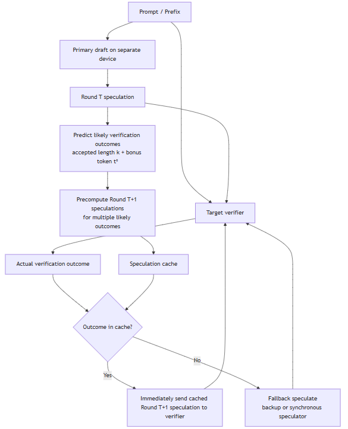

<!---
Copyright (c) 2026 Advanced Micro Devices, Inc. (AMD)

Permission is hereby granted, free of charge, to any person obtaining a copy
of this software and associated documentation files (the "Software"), to deal
in the Software without restriction, including without limitation the rights
to use, copy, modify, merge, publish, distribute, sublicense, and/or sell
copies of the Software, and to permit persons to whom the Software is
furnished to do so, subject to the following conditions:

The above copyright notice and this permission notice shall be included in all
copies or substantial portions of the Software.

THE SOFTWARE IS PROVIDED "AS IS", WITHOUT WARRANTY OF ANY KIND, EXPRESS OR
IMPLIED, INCLUDING BUT NOT LIMITED TO THE WARRANTIES OF MERCHANTABILITY,
FITNESS FOR A PARTICULAR PURPOSE AND NONINFRINGEMENT. IN NO EVENT SHALL THE
AUTHORS OR COPYRIGHT HOLDERS BE LIABLE FOR ANY CLAIM, DAMAGES OR OTHER
LIABILITY, WHETHER IN AN ACTION OF CONTRACT, TORT OR OTHERWISE, ARISING FROM,
OUT OF OR IN CONNECTION WITH THE SOFTWARE OR THE USE OR OTHER DEALINGS IN THE
SOFTWARE.
--->

# Enabling Speculative Speculative Decoding on MI300X

[Speculative speculative decoding (SSD)](https://arxiv.org/pdf/2603.03251) [1] is a recently proposed speculative decoding (SD) algorithm that further accelerates large language model (LLM) inference beyond conventional SD. In standard SD, a small draft model proposes several future tokens, and a large target model verifies them in parallel. SD already reduces the cost of purely autoregressive decoding, but it still contains a sequential dependency: the next draft step cannot start until the current verification step finishes.

SSD removes that dependency. While the target model is still verifying the current speculation, the draft model runs on separate hardware and pre-computes likely next-round speculations for multiple possible verification outcomes. If the actual outcome matches one of those pre-computed branches, the next speculation is returned immediately, effectively hiding draft latency behind target-side verification.

This blog has three goals:

- Introduce the core idea behind SSD and why it matters for low-latency LLM serving.
- Summarize the engineering work required to enable SSD on AMD Instinct MI300X GPUs with ROCm.
- Report end-to-end results for reproducing SSD on MI300X and explain why this enablement is meaningful for future ROCm inference work.

Our implementation is available [here](https://github.com/AMD-AGI/ssd/tree/rocm-upstream).

## Why SSD Matters

Autoregressive decoding generates one token at a time, which leaves modern accelerators underutilized. SD improves this by allowing a smaller draft model to propose several tokens and having the larger target model verify them in one pass. However, even SD alternates between two stages:

1. Draft several candidate continuations
2. Verify them with the target model

That remaining synchronization point becomes the next bottleneck. SSD addresses exactly this bottleneck. It disaggregates drafting and verification across different devices and lets the draft model speculate ahead for several possible verifier responses. Conceptually, it spends otherwise idle compute to prepare likely future paths in advance.

This matters because interactive LLM systems are often latency-sensitive. If the draft latency can be hidden, end users see faster token streaming without changing model outputs. SSD outperformed strong speculative decoding baselines and pushed the throughput-latency Pareto frontier forward. We derive the same conclusion on the AMD MI300X GPU, and show that ROCm can support not only mainstream inference paths, but also newer asynchronous serving algorithms that require deeper systems integration.

## How SSD Works


<p align="center"><i>Figure 1. Overview of SSD.</i></p>

As you can see in Figure 1 (above), `Round T speculation` corresponds to the current speculation, and the `Actual verification outcome` corresponds to the verification outcome consisting of the accepted-prefix length and the sampled bonus token. The speculation cache stores precomputed next-round drafts keyed by likely verifier outcomes.

## Setup

Our MI300X reproduction uses the following software stack:

- GPU: AMD Instinct MI300X
- ROCm: `7.2`
- Docker image: built from [ROCm/flashinfer v0.5.3+amd.2](https://github.com/ROCm/flashinfer/releases/tag/v0.5.3%2Bamd.2) (`.devcontainer/rocm/Dockerfile`)
  - PyTorch: `2.9.1+rocm7.2`
  - FlashInfer: `amd-flashinfer 0.5.3+amd.2` (includes all kernel fixes via [PR #214](https://github.com/ROCm/flashinfer/pull/214))
- flash-attn: upstream `Dao-AILab/flash-attention` built with the Composable Kernel (CK) backend for `gfx942`

The implementation follows the same high-level SSD deployment pattern described in the paper: the large target model is sharded across multiple GPUs, while the smaller draft model runs asynchronously on a separate GPU. For the 70B benchmark configuration, SSD uses five MI300X GPUs in total: four for the target model and one for the draft model.

## MI300X Enablement Highlights

The main value of this work is to stress multiple advanced inference components at once: asynchronous multi-device scheduling, tree-style speculative decoding, paged KV cache management, custom attention masks, and graph-friendly execution.

### 1. Identifying and upstreaming correctness fixes in ROCm FlashInfer

Two independent correctness bugs were identified in the FlashInfer HIP path and fixed during bring-up:

- A `bf16/fp16` MMA type-confusion issue in the rowsum kernel caused the draft token acceptance rate to collapse, because bfloat16 inputs were effectively being interpreted with the wrong MFMA intrinsic.
- A row-mapping bug in the custom-mask code path on AMD CDNA3 corrupted attention outputs for grouped-query attention when tree decoding used custom masks.

These fixes were essential because SSD relies heavily on tree decode and custom-mask attention for preparing many speculative branches in parallel. Without fixing them, the algorithm would run but produce poor acceptance behavior or incorrect attention outputs, which would make end-to-end SSD performance unusable.

### 2. Adapting the attention stack for ROCm

We updated the attention path to work across ROCm-compatible backends:

- changed the default architecture target from NVIDIA `9.0` to AMD `gfx942`
- removed NVIDIA-only dependencies
- added a compatibility layer for `flash_attn_varlen_func` and `flash_attn_with_kvcache`
- adapted API differences between the original code path and ROCm-available attention implementations

This makes the codebase more portable and reduces dependence on NVIDIA-specific packaging assumptions.

### 3. Adding dual tree-decode backends

We introduced a backend switch, `SSD_TREE_DECODE_BACKEND`, with two execution paths:

- `flashinfer`: the default high-performance path with HIP graph support
- `sdpa`: a correctness-oriented fallback path that runs eagerly

This dual-backend design was important for bring-up. The SDPA path provided a reliable reference for debugging correctness, while the FlashInfer path enabled higher-performance execution once the ROCm kernel issues were fixed.

### 4. Patching JIT and graph-related runtime differences

The ROCm port also required several lower-level runtime changes:

- patching FlashInfer JIT behavior for `packbits`-related compilation issues
- adapting low-level `plan()` argument differences between NVIDIA and AMD FlashInfer builds
- passing custom mask and wrapper state through runtime context
- enabling graph capture conditionally for supported tree-decode paths

These are the kinds of details that often determine whether a research prototype can become a reproducible ROCm proof-of-concept.

### 5. Automating the ROCm setup flow

We added a `setup_rocm.sh` script to automate environment bring-up inside the ROCm container, including package checks, header patching, editable install, optional `flash-attn` build, and sanity tests. This reduces the reproduction burden and makes the MI300X path easier for other engineers to validate and extend.

## Quick Start

Requirements: AMD Instinct MI300X, ROCm `7.2`, Docker.

The basic reproduction flow is:

1. Clone SSD.
2. Build the ROCm FlashInfer Docker image from source.
3. Create and start the container.
4. Enter the container, activate the micromamba environment, and install FlashInfer.
5. Run `setup_rocm.sh` to install SSD and build `flash-attn` with the CK backend.
6. Download the target and draft models, and preprocess the benchmark datasets.
7. Run SSD benchmarks on MI300X.

### Step 1: Clone SSD

```bash
cd /home/<your-username>
git clone -b rocm-mi300x https://github.com/AMD-AGI/ssd.git
cd ssd
```

### Step 2: Build the Docker image

The Docker image is built from [FlashInfer v0.5.3+amd.2](https://github.com/ROCm/flashinfer/releases/tag/v0.5.3%2Bamd.2), which includes the CDNA3 kernel fixes for bf16 rowsum and custom-mask attention ([PR #214](https://github.com/ROCm/flashinfer/pull/214)). Clone it under `/home/<your-username>/tmp/` so it is accessible from inside the container (the container bind-mounts `/home`):

```bash
git clone --branch v0.5.3+amd.2 --depth 1 \
  https://github.com/ROCm/flashinfer.git /home/<your-username>/tmp/flashinfer-build
cd /home/<your-username>/tmp/flashinfer-build

docker build \
  --build-arg ROCM_VERSION=7.2 \
  --build-arg PY_VERSION=3.12 \
  --build-arg TORCH_VERSION=2.9.1 \
  -t flashinfer-0.5.3.amd2_rocm7.2 \
  -f .devcontainer/rocm/Dockerfile .
```

### Step 3: Create and start the container

```bash
docker run -dit \
  --name ssd \
  --privileged --network=host \
  --device=/dev/kfd --device=/dev/dri \
  --ipc=host --shm-size 64G \
  --group-add video \
  --cap-add=SYS_PTRACE \
  --security-opt seccomp=unconfined \
  -v /home:/home \
  flashinfer-0.5.3.amd2_rocm7.2 \
  /bin/bash
```

### Step 4: Enter the container and set up the environment

```bash
docker exec -u 0 -it ssd bash

# Activate the pre-built micromamba environment
export MAMBA_EXE=/bin/micromamba
export MAMBA_ROOT_PREFIX=/opt/conda
eval "$($MAMBA_EXE shell hook --shell bash)"
micromamba activate flashinfer-py3.12-torch2.9.1-rocm7.2

# Install FlashInfer from the source used to build the Docker image
pip install --no-build-isolation -ve /home/<your-username>/tmp/flashinfer-build
```

Sanity-check the installation:

```bash
python -c "import torch; print(torch.__version__)"          # 2.9.1+...
python -c "import flashinfer; print(flashinfer.__version__)" # 0.5.3+amd.2
```

### Step 5: Install SSD and build flash-attn

```bash
cd /home/<your-username>/ssd
bash setup_rocm.sh
```

The script runs `pip install -e .` (editable install of SSD) and then builds `flash-attn` from upstream `Dao-AILab/flash-attention` with the CK backend for `gfx942`. The flash-attn build is required for HIP graph mode and takes 10-30 minutes.

### Step 6: Download models and datasets

```bash
export SSD_HF_CACHE=/home/<your-username>/hf_cache
export SSD_DATASET_DIR=$SSD_HF_CACHE/processed_datasets
export HSA_NO_SCRATCH_RECLAIM=1

pip install huggingface_hub datasets
huggingface-cli login        # required for the gated meta-llama/* repos

huggingface-cli download meta-llama/Llama-3.1-8B-Instruct  --cache-dir $SSD_HF_CACHE
huggingface-cli download meta-llama/Llama-3.2-1B-Instruct  --cache-dir $SSD_HF_CACHE
# For the 70B benchmark configuration (~140 GB of weights):
huggingface-cli download meta-llama/Llama-3.1-70B-Instruct --cache-dir $SSD_HF_CACHE

HF_DATASETS_CACHE=$SSD_HF_CACHE python scripts/get_data_from_hf.py
```

`scripts/get_data_from_hf.py` downloads HumanEval, Alpaca, C4, GSM8K, and UltraFeedback, then writes preprocessed JSONL files under `$SSD_DATASET_DIR`.

### Step 7: Run a quick SSD validation

```bash
python -O bench/bench.py \
  --llama --size 8 --gpus 2 \
  --spec --async \
  --k 7 --f 3 --b 1 \
  --temp 0 \
  --numseqs 16 --output_len 128 \
  --random
```

### Run the 70B benchmark configuration

```bash
python -O bench/bench.py \
  --llama --size 70 --gpus 5 \
  --spec --async \
  --k 7 --f 3 --b 1 \
  --temp 0 \
  --numseqs 128 --output_len 512 \
  --all
```

If needed, `SSD_TREE_DECODE_BACKEND=sdpa` can be used as a fallback backend for debugging or correctness validation.

## Results on MI300X

We use `Llama-3.2-1B-Instruct` as the draft model to accelerate `Llama-3.1-70B-Instruct`, and report the average inference speed of three algorithms:

- `Auto-Regressive (AR)`

- `SD`

- `SSD`

on four benchmarks:

- `alpaca`
- `c4`
- `ultrafeedback`
- `humaneval`

<div align="center">

| Methods / Speed (tokens/s) |      TP=1      |      TP=2      |      TP=4      |
| :------------------------: | :------------: | :------------: | :------------: |
|             AR             |     21.41      |     32.87      |     52.32      |
|             SD             |      OOM       | 89.56 (2.72×)  | 138.06 (2.64×) |
|            SSD             | 107.59 (5.03×) | 154.07 (4.69×) | 225.86 (4.32×) |

</div>
<p align="center"><i>Table 1. Average inference speed of AR, SD, and SSD across four benchmarks: alpaca, c4, ultrafeedback, and humaneval, with TP=[1,2,4].</i></p>

Using `TP=4` as an example, on this MI300X configuration, SSD reaches `225.86 tokens/s`, compared with `138.06 tokens/s` for SD and `52.32 tokens/s` for autoregressive decoding. That corresponds to:

- `4.32x` speedup over autoregressive decoding
- `1.64x` speedup over conventional speculative decoding

These results are important for two reasons. First, they show that SSD retains its core advantage on AMD hardware: overlapping draft and verify work is beneficial on MI300X. Second, the gap between SD and SSD confirms that the extra enablement work was worthwhile. A simple SD port would already improve latency, but SSD demonstrates that ROCm can support a newer class of asynchronous decoding algorithms with additional performance upside.

## Why This Work Matters

This effort has value beyond a single benchmark table.

- It brings a recent research decoding algorithm to AMD hardware quickly, which helps show software readiness for emerging LLM serving techniques.
- It produced reusable porting patterns such as backend abstraction, compatibility layers, graph-aware fallbacks, and automated setup flows.
- It provides a concrete proof of concept, showing that MI300X can serve as a platform not only for standard transformer inference, but also for more advanced, multi-device inference scheduling strategies.

In short, this is both an algorithm reproduction and a systems enablement project. The performance result is the visible outcome, but the larger impact is that it lowers the barrier for future ROCm work on speculative decoding, tree decoding, and other latency-oriented LLM serving innovations.

## Reflections on Previous SD ROCm Blogs

Our teams in AMD pursue SD on several fronts: as you've seen, this blog focuses on enabling the latest SSD method that accelerate SD by using separate hardware for drafter and verifier on MI300X. Previous SD ROCm Blogs focused on designing new algorithms [2-4], and on introducing the original SD method and applying it to AMD GPUs [5-7].

## Summary

In this blog, we introduced SSD, a new decoding algorithm that removes the remaining synchronization bottleneck in speculative decoding by overlapping verification and future speculation across separate devices. We then described the key engineering work required to enable SSD on AMD Instinct MI300X GPUs with ROCm, including attention-stack adaptation, dual tree-decode backends, runtime integration changes, and automated setup support.

Our MI300X reproduction shows that SSD can deliver substantial gains on AMD hardware, reaching `4.32x` speedup over autoregressive decoding and `1.64x` speedup over standard speculative decoding in our benchmark setting using the LLaMA series models with `TP=4`. More broadly, this project demonstrates that ROCm is capable of supporting not only established inference stacks but also the next generation of asynchronous and systems-heavy LLM decoding methods.

## References

[1] Kumar, T., Dao, T. and May, A., 2026. [Speculative speculative decoding (SSD)](https://arxiv.org/pdf/2603.03251). *arXiv preprint arXiv:2603.03251*.

[2] [FLy: A New Paradigm for Speculative Decoding — Accepting Semantically Correct Drafts Beyond Exact Match](https://rocm.blogs.amd.com/artificial-intelligence/fly/README.html)

[3] [Gumiho: A New Paradigm for Speculative Decoding — Earlier Tokens in a Draft Sequence Matter More](https://rocm.blogs.amd.com/software-tools-optimization/gumiho/README.html)

[4] [Beyond Text: Accelerating Multimodal AI Inference with Speculative Decoding on AMD Instinct™ MI300X GPUs](https://rocm.blogs.amd.com/software-tools-optimization/multimodal-spec-dec/README.html)

[5] [Speculative Decoding - Deep Dive](https://rocm.blogs.amd.com/software-tools-optimization/speculative-decoding---deep-dive/README.html)

[6] [Accelerating LLM Inference: Up to 3x Speedup on MI300X with Speculative Decoding](https://rocm.blogs.amd.com/artificial-intelligence/spec_decode_mi300x/README.html)

[7] [Speed Up Text Generation with Speculative Sampling on AMD GPUs](https://rocm.blogs.amd.com/artificial-intelligence/speculative-decoding/README.html)

## Disclaimers

Third-party content is licensed to you directly by the third party that owns the
content and is not licensed to you by AMD. ALL LINKED THIRD-PARTY CONTENT IS
PROVIDED “AS IS” WITHOUT A WARRANTY OF ANY KIND. USE OF SUCH THIRD-PARTY CONTENT
IS DONE AT YOUR SOLE DISCRETION AND UNDER NO CIRCUMSTANCES WILL AMD BE LIABLE TO
YOU FOR ANY THIRD-PARTY CONTENT. YOU ASSUME ALL RISK AND ARE SOLELY RESPONSIBLE
FOR ANY DAMAGES THAT MAY ARISE FROM YOUR USE OF THIRD-PARTY CONTENT.
