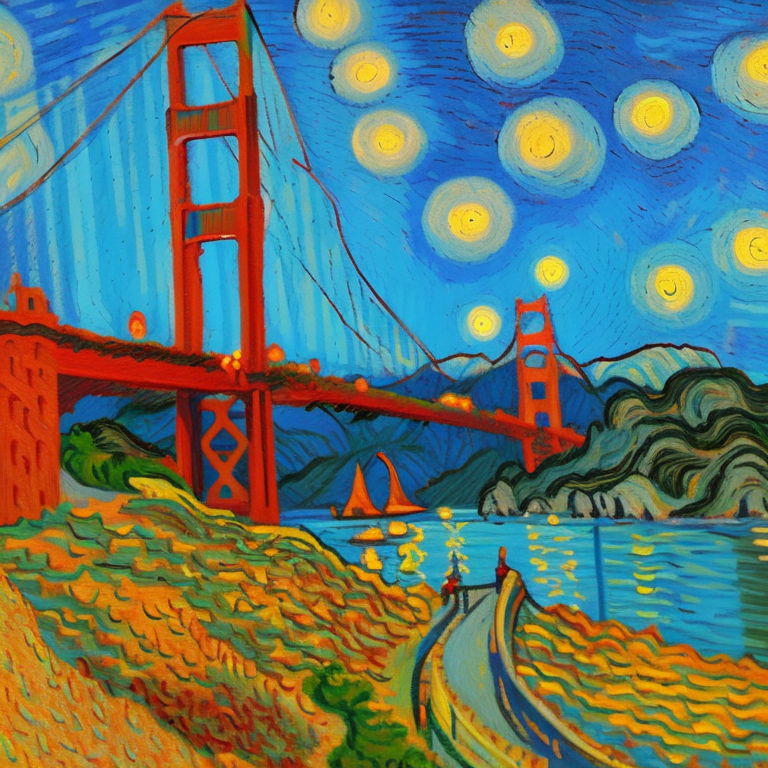

# Efficient image generation with Stable Diffusion models and AITemplate using AMD GPUs

<span style="font-size:0.7em;">24 Jan, 2024 by {hoverxref}`Douglas Jia<djia>`. </span>

Stable Diffusion has emerged as a groundbreaking advancement in the field of image generation,
empowering users to translate text descriptions into captivating visual output.

At the heart of Stable Diffusion lies a unique approach known as *diffusion modeling*. This process
takes an existing image and gradually introduces noise until it becomes unrecognizable in the forward
pass. Then, guided by text prompts, the model meticulously reverses this process, gradually refining
the noisy image back into a coherent and meaningful representation that aligns with the textual input.
This innovative technique enables Stable Diffusion to generate images with remarkable fidelity and
adherence to the text input.

By carefully controlling the diffusion process and incorporating textual guidance, the model effectively
captures the essence of the text, translating abstract concepts into vivid visual representations.

The versatility of Stable Diffusion extends beyond text-to-image generation. Its capabilities encompass
a range of image manipulation tasks, including image-to-image translation and inpainting.

* **Image-to-image translation** involves transforming one image into another while preserving
  essential features, such as style, color palette, and structure.

* **Inpainting** focuses on restoring damaged or incomplete images by filling in missing or corrupted
  regions with plausible and consistent details.

AITemplate plays a crucial role in enhancing the performance and efficiency of Stable Diffusion. This
open-source Python framework transforms AI models into high-performance C++ GPU template code
for accelerating inference. It operates by analyzing the model architecture, then fuses and optimizes
layers and operations specific to that architecture. This allows AITemplate to generate highly optimized
code that leverages the capabilities of the target hardware, particularly AMD GPUs.

Through its support of AMD MatrixCore architecture, AITemplate unlocks additional performance gains
via the efficient utilization of hardware resources. This translates to faster inference times, smoother
image generation, and a more streamlined and user-friendly experience.

In this blog, we use pre-trained Stable Diffusion models for text-to-image generation with AITemplate
on AMD GPUs. You can also independently explore the steps for image-to-image generation and
inpainting.

## Setting up the running environment

You can run Stable Diffusion models on AMD GPUs after
[installing ROCm](https://rocm.docs.amd.com/projects/install-on-linux/en/latest/tutorial/quick-start.html)
and its compatible packages.

For this blog, we tested our code snippets on ROCm 5.7, Ubuntu 22.04, Python 3.10, and Pytorch 2.0.1.
For convenience, you can directly pull and run the Docker container in your Linux system using the
following code:

```sh
docker pull rocm/pytorch
docker run -it --ipc=host --network=host --device=/dev/kfd --device=/dev/dri \
           --group-add video --cap-add=SYS_PTRACE --security-opt seccomp=unconfined \
           --name=sdxl rocm/pytorch:rocm5.7_ubuntu22.04_py3.10_pytorch_2.0.1 /bin/bash
```

You must install essential Python packages (notably AITemplate) once you are in the running Docker
(or other appropriate PyTorch/ROCm) environment.

Note that the AITemplate package on [Meta Incubator](https://github.com/facebookincubator) may
not be compatible with ROCm. We recommend cloning the repository from
[ROCmSoftwarePlatform](https://github.com/ROCmSoftwarePlatform) and installing the package using
this code:

```sh
git clone --recursive --branch ds-blog https://github.com/ROCmSoftwarePlatform/AITemplate

cd AITemplate/python
python setup.py bdist_wheel
pip install dist/aitemplate-*.whl
```

To install other necessary packages, use:

```sh
pip3 install diffusers transformers click accelerate
```

## Generating images with a text prompt

First, download the diffusers pipeline files. The model is
[`stabilityai/stable-diffusion-2-1`](https://huggingface.co/stabilityai/stable-diffusion-2-1), which is
fine-tuned from [stable-diffusion-2](https://huggingface.co/stabilityai/stable-diffusion-2)
(768-v-ema.ckpt). The resolution of the generated image is 768 x 768 px.

```sh
cd ../examples/05_stable_diffusion/

python3 scripts/download_pipeline.py \
--model-name "stabilityai/stable-diffusion-2-1"
```

Then, compile the model.

```sh
python3 scripts/compile.py --width 768 --height 768
```

You can test the complied model by supplying it with different prompts. For example:

```sh
python3 scripts/demo_alt.py --hf-hub-or-path stabilityai/stable-diffusion-2-1 --width 768 --height 768 \
--prompt "A Van Gogh-inspired landscape painting of Golden Gate Bridge, capturing the swirling brushstrokes\
 and vibrant colors characteristic of the artist's style."
```

The generated image is saved in the `AITemplate/examples/05_stable_diffusion/` folder as
`example_ait.png`.

The above Van Gogh-inspired prompt generates .

Here are some prompt suggestions you can try:

* "The house in the forest, dark night, leaves in the air, fluorescent mushrooms, clear focus, very
  coherent, very detailed, contrast, vibrant, digital painting"
* "A photorealistic portrait of a young woman with flowing red hair and piercing green eyes, smiling
  warmly against a backdrop of lush greenery."
* "A classic oil painting depicting a grand banquet scene, with nobles and ladies adorned in exquisite
  attire feasting under a chandelier's soft glow."
* "A pixel art rendition of a bustling cyberpunk cityscape, neon lights illuminating skyscrapers and
  holographic advertisements casting a vibrant glow."
