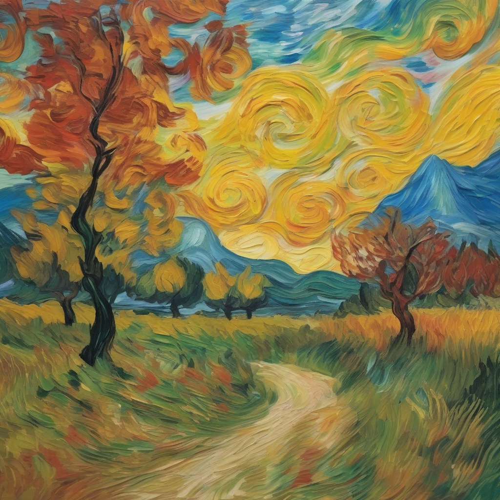
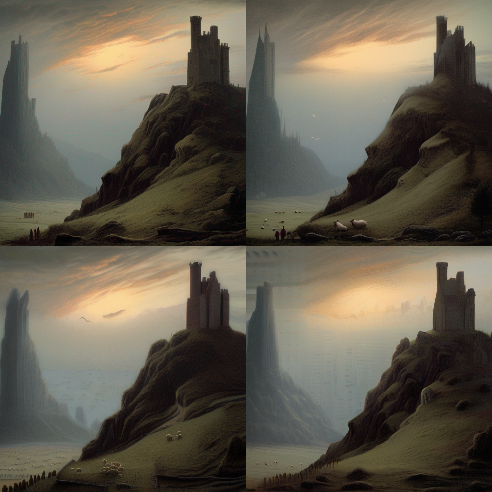
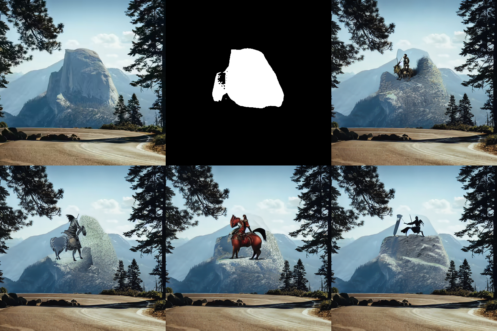

# Efficient image generation with Stable Diffusion models and ONNX Runtime using AMD GPUs

In this blog, we show you how to use pre-trained Stable Diffusion models to generate images from text
(text-to-image), transform existing visuals (image-to-image), and restore damaged pictures
(inpainting) on AMD GPUs using ONNX Runtime.

## Stable Diffusion

Stable Diffusion has emerged as a groundbreaking advancement in the field of image generation,
empowering users to seamlessly translate text descriptions into captivating visual imagery.

Stable Diffusion uses diffusion modeling to gradually introduce noise into an image until the image
becomes unrecognizable in the forward pass. Then, guided by text prompts, the model meticulously
reverses this process, gradually refining the noisy image back into a coherent and meaningful
representation that aligns with the textual input. This innovative technique allows Stable Diffusion to
generate images with remarkable fidelity and faithfulness to the provided text descriptions. By carefully
controlling the diffusion process and incorporating textual guidance, the model effectively captures the
essence of the text, translating abstract concepts into vivid visual representations.

The versatility of Stable Diffusion extends beyond text-to-image generation, and include a range of
image manipulation tasks, such as image-to-image translation and inpainting.

**Image-to-image translation** involves transforming one image into another while preserving its
essential features, such as style, color palette, and structure.

**Inpainting** involves restoring damaged or incomplete images by filling in missing or corrupted
regions with plausible and consistent details.

## ONNX Runtime

ONNX Runtime is an open-source inference and training accelerator that optimizes machine learning
models for various hardware platforms, including AMD GPUs. By leveraging ONNX Runtime, Stable
Diffusion models can run seamlessly on AMD GPUs, significantly accelerating the image generation
process, while maintaining exceptional image quality.

## Set up your running environment

Stable Diffusion models can run on AMD GPUs as long as ROCm and its compatible packages are
properly installed. The code snippets used in this blog were tested with ROCm 5.6, Ubuntu 20.04,
Python 3.8, and PyTorch 2.0.1. For convenience, you can directly pull and run the Docker in your Linux system with the following code:

```sh
docker run -it --ipc=host --network=host --device=/dev/kfd --device=/dev/dri \
           --group-add video --cap-add=SYS_PTRACE --security-opt seccomp=unconfined \
           --name=sdxl rocm/pytorch:rocm5.6_ubuntu20.04_py3.8_pytorch_2.0.1 /bin/bash
```

To run the code snippets provided in this blog, you must first install Optimum and ONNX Runtime
Python packages.

The Hugging Face Optimum package enhances Transformers by providing
specialized performance optimization tools for efficient model training on targeted hardware. At its
core, Optimum utilizes configuration objects to define optimization parameters for various
accelerators, creating dedicated optimizers, quantizers, and pruners. Notably, Optimum seamlessly
integrates with ONNX Runtime, boosting its adaptability in optimizing and deploying models for
enhanced performance.

```{NOTE}
To successfully run a model, you must install an ONNX Runtime package that is compatible with
ROCm. Refer to the list of [ONNX Runtime wheels](https://download.onnxruntime.ai/) for different
ROCm versions. Using the stable package is recommended.
```

```sh
pip install https://download.onnxruntime.ai/onnxruntime_training-1.16.3%2Brocm56-cp38-cp38-manylinux_2_17_x86_64.manylinux2014_x86_64.whl
pip install optimum diffusers accelerate deepspeed numpy==1.20.3
```

## Image manipulation

For the tasks described in the following sections, we use the
[stable diffusion inferencing pipelines](https://huggingface.co/docs/optimum/main/en/onnxruntime/package_reference/modeling_ort#stable-diffusion) from the `optimum.onnxruntime` class. Given the
size of the stable diffusion model checkpoints, we first export the diffuser model into ONNX model
format, then save it to local. After this, we load and work with the local model for inference. By specifying `provider="ROCMExecutionProvider"`, we are asking the ONNX Runtime to use our AMD
GPU for inference whenever possible.

```{tip}
To see how much time your AMD GPU can save, you can use `provider="CPUExecutionProvider"`.
```

To avoid memory errors as you run each section of this tutorial, you may need to clear prior Python
shells, then reload the packages and the model.

### Text-to-image

```python
# This code block only need to be ran once to save the model to local. After this, you only need to
# load the local model.
from optimum.onnxruntime import ORTStableDiffusionXLPipeline

model_id = "stabilityai/stable-diffusion-xl-base-1.0"
pipeline_rocm = ORTStableDiffusionXLPipeline.from_pretrained(
    model_id,
    export=True,
    provider="ROCMExecutionProvider",
)
pipeline_rocm.save_pretrained("sdxl_onnx_base")
```

```python
from optimum.onnxruntime import ORTStableDiffusionXLPipeline

pipeline_rocm = ORTStableDiffusionXLPipeline.from_pretrained(
    "./sdxl_onnx_base", export=False, provider="ROCMExecutionProvider"
)
```

You can toggle between commented and uncommented prompts to explore the diverse range of
images generated by the models. Additionally, we encourage you to create your own prompts to test
the creativity and versatility of the model outputs.

```python
# prompt = "the house in the forest, dark night, leaves in the air, fluorescent mushrooms, clear focus, very coherent, very detailed, contrast, vibrant, digital painting"
# prompt = "A photorealistic portrait of a young woman with flowing red hair and piercing green eyes, smiling warmly against a backdrop of lush greenery."
# prompt = "A classic oil painting depicting a grand banquet scene, with nobles and ladies adorned in exquisite attire feasting under a chandelier's soft glow."
# prompt = "A pixel art rendition of a bustling cyberpunk cityscape, neon lights illuminating skyscrapers and holographic advertisements casting a vibrant glow."
prompt = "A Van Gogh-inspired landscape painting, capturing the swirling brushstrokes and vibrant colors characteristic of the artist's style."
images = pipeline_rocm(prompt=prompt).images[0]
# You can also use images.save('file_name.png') if you are using a remote machine and cannot show images inline.
images.show()
```

```sh
100%|██████████| 50/50 [01:30<00:00,  1.80s/it]
```



### Image-to-image

In this task, we provide a text prompt along with an image, instructing Stable Diffusion to modify the
image in accordance with the text.

```python
from diffusers.utils import load_image, make_image_grid
from optimum.onnxruntime import ORTStableDiffusionXLImg2ImgPipeline

pipeline = ORTStableDiffusionXLImg2ImgPipeline.from_pretrained(
    "./sdxl_onnx_base", export=False, provider="ROCMExecutionProvider"
)
```

```python
url = "https://huggingface.co/datasets/optimum/documentation-images/resolve/main/intel/openvino/sd_xl/castle_friedrich.png"
image_in = load_image(url).convert("RGB")
prompt = "A multitude of sheep blankets the hillside"
images = pipeline(prompt, image=image_in, num_images_per_prompt=3).images

make_image_grid([image_in, *images], rows=2, cols=2)
```

```sh
100%|██████████| 15/15 [00:15<00:00,  1.04s/it]
```

The modified images retain the style, texture, and key elements of the original image, while
incorporating the specified changes outlined in the text prompt.



### Inpainting

Inpainting involves the meticulous reconstruction of missing or damaged sections within an image
using controlled techniques. Leveraging stable diffusion models, this process intelligently generates content for the identified gaps, ensuring seamless integration with the existing context while
preserving the overall coherence and style. This method proves particularly effective for tasks that
require the restoration, enhancement, or completion of obscured or damaged portions in an image. To
initiate the inpainting pipeline, essential inputs include a base image, a mask mimicking the missing or
damaged parts, and a text prompt instructing the pipeline on how to create the absent segment.

The resulting images from the following example showcase the pipeline's ability not only to generate
parts based on prompts, but also to harmonize with the original image's surroundings.

```python
# You only need to run this code block once to save the model to local. After this, you can load the
# local model.
from optimum.onnxruntime import ORTStableDiffusionInpaintPipeline

pipeline_in = ORTStableDiffusionInpaintPipeline.from_pretrained(
    "runwayml/stable-diffusion-inpainting",
    export=True,
    provider="ROCMExecutionProvider",
)
pipeline_in.save_pretrained("sd_inpaint")
```

```python
from diffusers.utils import load_image, make_image_grid
from optimum.onnxruntime import ORTStableDiffusionInpaintPipeline

pipeline_in = ORTStableDiffusionInpaintPipeline.from_pretrained(
    "sd_inpaint", export=False, provider="ROCMExecutionProvider"
)
```

```python
# load base and mask image
init_image = load_image(
    "https://huggingface.co/datasets/huggingface/documentation-images/resolve/main/diffusers/inpaint.png"
)
mask_image = load_image(
    "https://huggingface.co/datasets/huggingface/documentation-images/resolve/main/diffusers/inpaint_mask.png"
)

prompt = "concept art of a Medieval Knight holding a sword riding on a horse on a huge stone, highly detailed, 8k"
image = pipeline_in(
    prompt=prompt, image=init_image, mask_image=mask_image, num_images_per_prompt=4
).images
make_image_grid([init_image, mask_image, *image], rows=2, cols=3)
```

```sh
100%|██████████| 50/50 [00:24<00:00,  2.07it/s]
```


