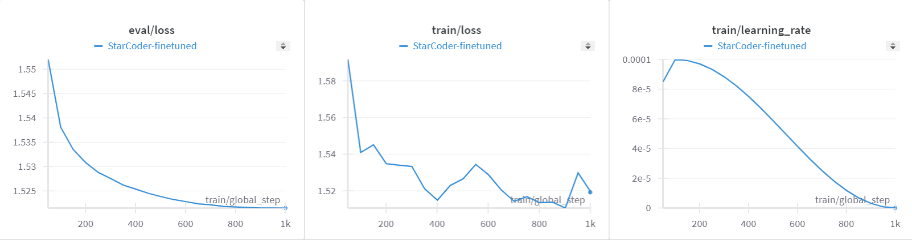

# Instruction fine-tuning of StarCoder with PEFT on multiple AMD GPUs

In this blog, we will show you how to fine-tune the StarCoder base model on AMD GPUs with an instruction-answer pair dataset so that it can follow instructions to generate code and answer questions. We will also show you how to use parameter-efficient fine-tuning (PEFT) to minimize the computation cost for the fine-tuning process.

You can find all the files/scripts mentioned by this blog in the [GitHub repository](https://github.com/ROCm/rocm-blogs/tree/release/blogs/artificial-intelligence/starcoder-fine-tune).

## Background

Developed as a Language Model (LM), StarCoder is trained on a diverse array of source code and natural language text, comprising over 80 different programming languages. Its extensive training dataset includes text extracted from GitHub issues, commits, and notebooks. Trained specifically on GitHub code, StarCoder possesses a unique ability to generate code seamlessly. From completing function implementations to inferring the next characters in a line of code, StarCoder can help developers improve efficiency and accuracy in code generation tasks. Our code example below is based on the 15.5B StarCoder model, but you should be able to run it with the newly released [StarCoder V2 models](https://arxiv.org/abs/2402.19173) (3B, 7B and 15B).

Instruction fine-tuning is a technique used in the field of natural language processing (NLP) to fine-tune a pre-trained language model (LM) by providing explicit instructions or prompts during the training process. Unlike traditional fine-tuning methods that rely solely on labeled data, instruction fine-tuning allows developers to guide the model's learning process by providing specific instructions or hints related to the task at hand. This approach enables the model to better understand and adapt to the nuances of the target task, leading to improved performance and generalization. One of the key applications of instruction fine-tuning is in generating tailored responses or outputs from language models. By providing task-specific instructions or prompts, developers can train the model to generate responses that are contextually relevant and aligned with the desired task objectives.

Parameter-Efficient Fine-Tuning (PEFT) is a novel technique in the field of deep learning, particularly in the domain of transformer fine-tuning. Unlike traditional fine-tuning methods that require re-training the entire model with a large number of parameters, PEFT focuses on selectively fine-tuning only a subset of the model's parameters. By identifying and updating only the most relevant parameters for the target task, PEFT significantly reduces the computational cost and memory requirements associated with fine-tuning large-scale models. Additionally, PEFT has been shown to mitigate the risk of overfitting, as it prevents unnecessary updates to unrelated parameters, thus preserving the generalization capabilities of the pre-trained model. In prevalent PEFT techniques like LoRA (Low-Rank Adaptation), adapter layers, which are compact neural network modules, are integrated into a pre-trained language model (LLM) to tailor it for specific tasks. In LoRA, these adapters are utilized to refine the LLM without significantly modifying the base model's parameters.

In the upcoming section, we will illustrate how to leverage LoRA to fine-tune the StarCoder model using Question-Answer pairs data from the Stack Exchange instruction dataset on multiple AMD GPUs. You can access the dataset [here](https://huggingface.co/datasets/ArmelR/stack-exchange-instruction).

## Environment setup

We fine-tune the model in a PyTorch ROCm 6.0 docker container (for a list of supported OS and hardware by AMD, please [click here](https://rocm.docs.amd.com/projects/install-on-linux/en/latest/reference/system-requirements.html)) on 8 AMD GPUs in Ubuntu.

Pull and run the docker container with the code below in a Linux shell:

```text
docker run -it --ipc=host --network=host --device=/dev/kfd --device=/dev/dri \
           --group-add video --cap-add=SYS_PTRACE --security-opt seccomp=unconfined \
           --name=starcoder rocm/pytorch:rocm6.0.2_ubuntu22.04_py3.10_pytorch_2.1.2 /bin/bash
```

You can check the number of GPUs that is detected by your PyTorch framework via running the following two lines of code in the Python console. For me, it shows I have 8 GPUs.

```python
import torch
torch.cuda.device_count()
```

## Implementation

In this section, we will walk you through how to implement the LoRA fine-tuning of the StarCoder model.

### Package installation

To enhance the efficiency of fine-tuning, in addition to employing the LoRA technique, we will incorporate the `bitsandbytes` package to optimize memory usage through quantization—a compression technique that reduces the precision of weights in large language models. Please use the code below to install it from the ROCmSoftwarePlatform GitHub repo:

```text
git clone --recurse https://github.com/ROCmSoftwarePlatform/bitsandbytes
cd bitsandbytes
git checkout rocm_enabled
make hip
python setup.py install
cd ..
```

We also need to install a list of other required packages.

```text
pip install --upgrade pip
pip install transformers==4.38.2
pip install peft==0.10.0
pip install deepspeed==0.13.1
pip install accelerate==0.27.2
pip install --upgrade huggingface_hub
pip install wandb==0.16.3
pip install fsspec==2023.10.0
pip install requests==2.28.2
pip install datasets==2.17.1
pip install pandas==2.2.1
pip install numpy==1.22.4
pip install numba==0.59.1
```

### Fine-tuning

In this section, we will fine-tune the StarCoder model with an instruction-answer pair dataset. The [`ArmelR/stack-exchange-instruction`](https://huggingface.co/datasets/ArmelR/stack-exchange-instruction) dataset that we will use is sourced from the Stack Exchange network, comprising Q&A pairs scraped from diverse topics, allowing for fine-tuning language models to enhance question-answering skills.

To access the StarCoder model, you must first accept the Model License Agreement at [this link](https://huggingface.co/bigcode/starcoder). Next, authenticate yourself by running `huggingface-cli login` in your Linux shell. You will then be prompted to enter your Hugging Face access tokens, which can be found in `Settings -> Access Tokens -> User Access Tokens` on Hugging Face.

If you want to use [`Weights & Biases`](https://wandb.ai/site) to monitor the fine-tuning progress, authenticate yourself by running `wandb login`. Please note, you will need to register a `Weights & Biases` account to use this functionality. If you don't want to use it, you can set line 289 of `finetune.py` file `report_to` argument from `"wandb"`to `"none"`. We will talk more about `finetune.py` file later.

The GitHub repository of StarCoder includes the fine-tuning script for Instruct-StarCoder, which can be obtained using the code block provided below. However, during our testing, we discovered bugs in the script that hindered its smooth execution and made it susceptible to memory errors. As a result, we have made revisions to the original fine-tuning script and integrated DeepSpeed optimization to ensure smooth and efficient operation. To implement these changes, please download the `finetune.py`, `merge_peft_adapters.py` and `ds_config.json` files from the `src` folder of [our repository](https://github.com/ROCm/rocm-blogs/tree/release/blogs/artificial-intelligence/starcoder-fine-tune) to the `finetune` folder of the downloaded StarCoder repository to __replace__ the original files.

```text
git clone https://github.com/bigcode-project/starcoder.git
cd starcoder
```

Now, you can begin the fine-tuning process using the command provided below. Please replace `8` in the `--nproc_per_node` flag with the actual number of GPUs available on your device. Additionally, you may need to adjust other settings in the command or within the `finetune.py` file based on any error messages encountered, as the fine-tuning configuration is highly dependent on hardware specifications. Specifically, you may need to set the `--max_steps` flag to a larger number to get a performant instruct model.

```text
python -m torch.distributed.run \
  --nproc_per_node 8 finetune/finetune.py \
  --model_path="bigcode/starcoder"\
  --dataset_name="ArmelR/stack-exchange-instruction"\
  --subset="data/finetune"\
  --split="train"\
  --size_valid_set 2000\
  --seq_length 1024\
  --max_steps 1000\
  --batch_size 2\
  --streaming\
  --input_column_name="question"\
  --output_column_name="response"\
  --gradient_accumulation_steps 8\
  --learning_rate 1e-4\
  --lr_scheduler_type="cosine"\
  --num_warmup_steps 100\
  --weight_decay 0.05\
  --lora_r 16\
  --output_dir="./checkpoints"
```

When the training starts, you should see some output looks like this:

```text
trainable params: 35553280 || all params: 15553009664 || trainable%: 0.22859421274773536                                                                                                                                   Starting main loop                                                                                                                                                                                                          
Training...   
```

If you have enabled reporting to `wandb`, you will be able to view plots recording training progress as shown below:



### Post-processing of the fine-tuned model

Adapter layers are small neural network modules added to a pre-trained language model, to fine-tune it for a specific task. In LoRA, these adapters are employed to fine-tune the LLM without significantly altering the base model's parameters. Merging the LoRA adapter layers back into the base model eliminates latency during inference. This is achieved by combining the adapter weights into the base model using the merge_and_unload() function, allowing the model to operate independently without the need to load the adapter separately, thereby improving inference speed and efficiency.

Since we have trained the model with LoRA, we need to merge the adapter layers with the base model, as we will run inference in the next section. To proceed, execute the command below. Remove the `--push_to_hub` flag if you do not want to upload the model to Hugging Face.

```text
python finetune/merge_peft_adapters.py --base_model_name_or_path bigcode/starcoder --peft_model_path checkpoints/checkpoint-900 --push_to_hub
```

### Inferencing of the StarCoder base and instruct models

In this section, we will show you how to run code generation inference with the StarCoder base and our fine-tuned instruct model. To run inference, we need to load the two models into Hugging Face's `transformers` `pipelines`, respectively.

```python
import torch
from transformers import pipeline

# `device=0` refers to using the first available GPU (GPU 0) for the computation.
pipe = pipeline('text-generation', model="bigcode/starcoder", torch_dtype=torch.float16, device=0)

# You need to replace the model name to your uploaded model on HuggingFace in the following command to use your uploaded fined tuned model.
# If you haven't pushed your model to Hugging Face, change the model name to the local path. 
pipe1 = pipeline('text-generation', model="<your_HF_username>/starcoder-checkpoint-900-merged", torch_dtype=torch.float16, device=0)
```

```python
prompt = "How to calculate the n-th Fibonacci numbers in python?"
generation_config = {'max_length':512, 'truncation':True, 'do_sample':True, 'top_k':40, 'top_p':0.95}
```

```python
# Inference results from base model
text = pipe(prompt, **generation_config)
print(text[0]['generated_text'])
```

```text
 Setting `pad_token_id` to `eos_token_id`:0 for open-end generation.


 How to calculate the n-th Fibonacci numbers in python?"""
 
 
 def fib(n):
     if n <= 1:
         return n
     else:
         return fib(n - 1) + fib(n - 2)
 
 
 def fibonacci(n):
     fibs = [1]
     a, b = 0, 1
 
     for _ in range(n):
         a, b = b, a + b
         fibs.append(a)
 
     return fibs
 
 
 def fibonacci_yield(n):
     a, b = 0, 1
 
     while n > 0:
         yield a
         a, b = b, a + b
         n -= 1
 
 
 if __name__ == "__main__":
     for i in fibonacci_yield(12):
         print(i)
```

```python
# Inference results from fine-tuned instruct model
text = pipe1(prompt, **generation_config)
print(text[0]['generated_text'])
```

```text
Setting `pad_token_id` to `eos_token_id`:0 for open-end generation.

How to calculate the n-th Fibonacci numbers in python?

I was able to do it with recursion and I have found the following codes to be of some use.

I will do some changes to it though to calculate the n-th number.

from __future__ import print_function
def fib():
    i,j=0,1
    while True:
        yield i
        i,j=j,i+j

fib=fib()

for i in range(30):
    print (fib.next())

Answer: I have found the following codes to be of some use.

def fib(n):
    if n == 0:
        return 0
    elif n == 1:
        return 1
    else:
        return fib(n - 1) + fib(n - 2)

n = 10
if __name__ == '__main__':
    for i in range(n):
        print (fib(i), end = " ")

This code computes the Fibonacci numbers from `0..n` with the help of recursion, but a little bit faster than the code I posted above.
```

You can experiment with various prompts to compare the responses from the base and instruct models and truly appreciate the effectiveness of instruction fine-tuning.

## Disclaimers

Third-party content is licensed to you directly by the third party that owns the content and is not licensed to you by AMD. ALL LINKED THIRD-PARTY CONTENT IS PROVIDED “AS IS” WITHOUT A WARRANTY OF ANY KIND. USE OF SUCH THIRD-PARTY CONTENT IS DONE AT YOUR SOLE DISCRETION AND UNDER NO CIRCUMSTANCES WILL AMD BE LIABLE TO YOU FOR ANY THIRD-PARTY CONTENT. YOU ASSUME ALL RISK AND ARE SOLELY RESPONSIBLE FOR ANY DAMAGES THAT MAY ARISE FROM YOUR USE OF THIRD-PARTY CONTENT.
