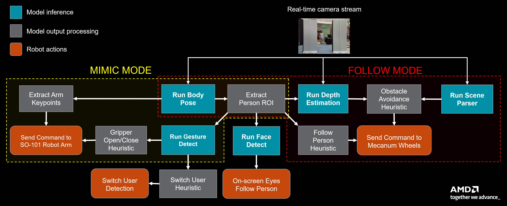
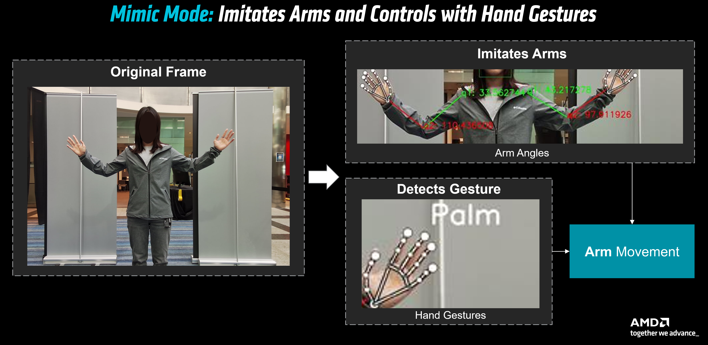
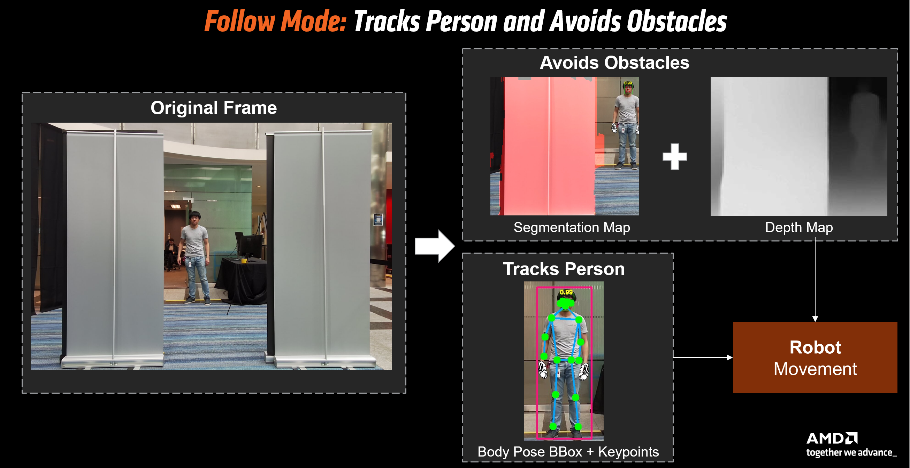
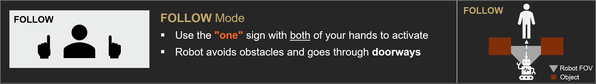
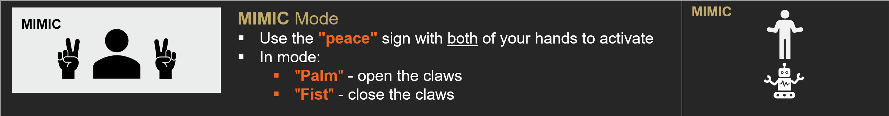
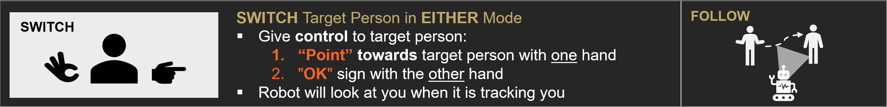

<!---
Copyright (c) 2025 Advanced Micro Devices, Inc. (AMD)

Permission is hereby granted, free of charge, to any person obtaining a copy
of this software and associated documentation files (the "Software"), to deal
in the Software without restriction, including without limitation the rights
to use, copy, modify, merge, publish, distribute, sublicense, and/or sell
copies of the Software, and to permit persons to whom the Software is
furnished to do so, subject to the following conditions:

The above copyright notice and this permission notice shall be included in all
copies or substantial portions of the Software.

THE SOFTWARE IS PROVIDED "AS IS", WITHOUT WARRANTY OF ANY KIND, EXPRESS OR
IMPLIED, INCLUDING BUT NOT LIMITED TO THE WARRANTIES OF MERCHANTABILITY,
FITNESS FOR A PARTICULAR PURPOSE AND NONINFRINGEMENT. IN NO EVENT SHALL THE
AUTHORS OR COPYRIGHT HOLDERS BE LIABLE FOR ANY CLAIM, DAMAGES OR OTHER
LIABILITY, WHETHER IN AN ACTION OF CONTRACT, TORT OR OTHERWISE, ARISING FROM,
OUT OF OR IN CONNECTION WITH THE SOFTWARE OR THE USE OR OTHER DEALINGS IN THE
SOFTWARE.
--->

# STX-B0T: Real-time AI Robot Assistant Powered by RyzenAI and ROCm

In this blog post, we introduce STX-B0T, our human-responsive social robot prototype powered by [AMD Ryzen AI's CVMLSDK](https://ryzenai.docs.amd.com/en/latest/ryzen_ai_libraries.html), the Strix-Halo (STX-Halo) APU, and built with open-source hardware.

Our team, Advanced Technologies Group (ATG), created STX-B0T as an exploration into the future of robotic assistants when state-of-the art AI perception models are combined with compact, energy-efficient hardware acceleration. Imagine a robot that could assist around the office -- following team members to meetings, shuttling items between desks, and answering day-to-day visitor queries as a help desk concierge stationed in the office lobby.

Most importantly, STX-B0T serves as a reference platform for future developments in AMD's embedded and robotics applications. With the ever-rising demand for compute power needed to drive AI-based perception, we envision that a seamless integration of AMD's hardware and software stacks will be critical to ensure efficient on-device processing without relying on external cloud infrastructure.

::::{grid} 2
:gutter: 2

:::{grid-item}

```{video} videos/mimic_6sec.mp4
:width: 288
:height: 512
:controls:
:autoplay:
:loop:
```

**Figure 1**: Demonstration of robot running in MIMIC mode

:::

:::{grid-item}

```{video} videos/follow_8sec.mp4
:width: 288
:height: 512
:controls:
:autoplay:
:loop:
```

**Figure 2**: Demonstration of robot running in FOLLOW mode

:::

::::

## Building STX-B0T with Off the Shelf Components

### Hardware

- HP ZBook Ultra Laptop with AMD Ryzen AI MAX+ 395 APU

- 5.2-megapixel built-in AMD Image Signal Processing(ISP) webcam

- [Mecanum wheel](https://en.wikipedia.org/wiki/Mecanum_wheel) drive
  base

- Open source SO-101 arms by
  [RobotStudio](https://github.com/TheRobotStudio/SO-ARM100)

- Arduino Mega to interface with drive base and SO-101 arms

#### Movement

Shown in Figure 2, the STX-B0T drive base uses Mecanum wheels. This allows for movement in all
directions without rotating. This kind of movement is helpful for
avoiding close obstacles such as chairs in a meeting room or people in a
crowded atrium.

#### Arms

[The Ryzers team](https://github.com/AMDResearch/Ryzers) inspired us to
incorporate robotic arms through their successful demonstration of
[trained policy models for robot arms on AMD Instinct GPUs and deployed
on RyzenAI
APU.](https://github.com/ROCm/rocm-blogs/tree/release/blogs/artificial-intelligence/rocm-lerobot)
STX-B0T has two [SO-101
arms](https://huggingface.co/docs/lerobot/en/so101) on both sides to
resemble a more human-like stature with shoulder, elbow, and wrist
joints.  The movement of the arms is shown in Figure 1.

Both the drive base and robotic arms are powered separately by 12V
rechargeable batteries. STX-B0T controls both subsystems through an
Arduino Mega.

### Software

- Optimized inference of custom vision models on NPU using [Ryzen AI
  CVMLSDK (Computer Vision and Machine Learning
  SDK)](https://ryzenai.docs.amd.com/en/latest/ryzen_ai_libraries.html)
  and inference on iGPU using
  [MIGraphX](https://github.com/ROCm/AMDMIGraphX) +
  [ROCm](https://rocm.docs.amd.com/projects/install-on-linux/en/latest/)

- Arduino + SCServo library (interface with robotic arms)

#### Algorithms

With Ryzen AI CVMLSDK, C++ applications gain robust AI capabilities through NPU and iGPU execution of custom-trained machine learning models. For STX-B0T, we deploy the following features in real time:

- Person Mimicking

  - Face Detect\*\*

  - Gesture Recognition\*

  - Body Pose Detection\*

- Obstacle Detection and Avoidance

  - Scene Parser\*

  - Depth Estimation\*\*

STX-B0T processes the output of the models to determine motor and servo
movement. Instructions are then sent to the Arduino.

\* These models have not yet been released for public use. Please reach out to ATG team if you are interested in learning more: [dl.atg.info@amd.com](dl.atg.info@amd.com)

\*\* These models can be accessed at the public [Ryzen AI Github repo](https://github.com/amd/RyzenAI-SW)!

## How it Works: The Algorithms Powering STX-B0T

Here we will explain some of the algorithms behind STX-B0T's FOLLOW and
MIMIC modes (depicted in Figure 3) which enable the robot to semantically parse and make
informed decisions in its environment.

Our algorithms start with the AMD ISP webcam frame which serves as our only sensor input to the robot. In the rest of the blog, we will show that STX-B0T can extract useful data about the environment from a single camera frame to perform the robot actions in MIMIC and FOLLOW mode.



**Figure 3**: High level workflow showing how the real-time camera feed is
interpreted into actions via perception models

### Mimicking Human Arm Pose

When a user stands in front of STX-B0T, their arm joint locations are
captured in real-time using CVMLSDK's multi-person body pose tracking
model (shown in Figure 4). Joint angles are computed from pixel coordinates and sent as
serial commands via Arduino to control the servo motors on the shoulder,
elbow, and gripper.

Due to workspace configuration limitations as well as physical safety,
we limit the range of motion of each joint and apply current sensing for
the robot gripper.



**Figure 4**: From an input frame, we infer arm angles and hand gestures in order to control robot arm movement.

### Intelligent Person Following & Switching

While in FOLLOW mode, STX-B0T will follow the user and maintain a safe distance by ensuring the person’s detected bounding box is centered and within the specific proportion in the frame.

We allow the user to easily switch tracking at any given moment to another person who are also detected in the frame. When the tracked person performs the switching gesture, it will calculate the distance from the finger to the bounding box of each person present in the frame in the direction of the pointed finger. The tracked person will switch and update the cache to the person who was closest.

### Obstacle Avoiding: Depth Awareness and Strafing

To avoid scenarios where STX-B0T collides with nearby objects while in
FOLLOW mode, we implement depth-aware obstacle avoidance. First, we
divide the visual scene into recognizable objects (wall, ground, chair)
using our scene parser model and mask out these areas relative to the
detected user, then run a relative depth model over the entire scene (shown in Figure 5).

If an obstacle is detected to be in the line of sight, depending on its
location (left or right of the user) we program the robot to strafe
(horizontally translate) right or left before advancing forwards. This
allows STX-B0T to successfully turn corners, navigate between walls, and
follow a person through a doorway.



**Figure 5**: From an input frame, we infer body pose and nearby objects based on
their depth in order to determine the robot base movement.

## Interacting with STX-B0T Using Hand Gestures

### FOLLOW Mode

Presenting a "one" hand gesture (see Figure 6) puts the robot into FOLLOW mode, in
which it begins tracking a person using **body pose estimation**. It
navigates around obstacles using **depth maps and scene parsing** and
can follow through doorways and tight spaces. The movement is smooth and
adaptive, thanks to the mecanum wheel setup and real-time pose updates.

 

**Figure 6**: User guide for interacting with STX-B0T in FOLLOW mode.

### MIMIC Mode

Showing a "two" or "peace sign" gesture (see Figure 7) puts the robot into MIMIC mode.
Using pose data, it mirrors the user's arm movements with its own
robotic arms. Additional gestures like "palm" and "fist" control the
claws, opening and closing them in sync with the user.



**Figure 7**: User guide for interacting with STX-B0T in MIMIC mode.

### SWITCH Person in *any Mode*

To hand off control to another person, the user performs a "point"
gesture toward the new target, followed by an "OK" gesture (shown in Figure 8). The robot
updates its tracking and confirms the switch by displaying a **live cropped image
of the new person's face** on its screen.  This intuitive visual
confirmation is powered by CVMLSDK's face detection feature.



**Figure 8**: User guide for switching target person.

## Summary

In this blogpost, we demonstrated our application of RyzenAI PCs in the robotics domain with STX-B0T, defining the start of our team's journey into robotics by leveraging AMD's latest edge hardware. While the current iteration of STX-B0T is able to perceive its surroundings and react to human movement, we have several ideas in mind to elevate its autonomy and utility. One future integration is to deploy a voice assistant through [GAIA](https://github.com/amd/gaia) to enable personalized voice profiles, allowing the robot to recognize verbal commands and proactively respond to queries. In addition, the current STX-B0T is constrained in software to only operate in the 2D plane. By expanding the robot arm's motion in MIMIC mode into 3D space, we can enable the robot to autonomously deploy tasks via VLA (Vision Language Action) Models like [Pi0](https://www.physicalintelligence.company/blog/pi0). Finally, we propose to train the robot in a simulation like [AMD's Open Source RL environment Schola](https://gpuopen.com/learn/sim-to-real-in-amd-schola/) which provides diversified environments and terrains. We hope this post sparks some ideas in the robotics community and encourages more innovation within the robotics space using RyzenAI PCs. Stay tuned for future updates from our team!

## Additional Resources

- [Ryzen AI](https://ryzenai.docs.amd.com/en/latest/)
- [SO-ARM100 GitHub Repository](https://github.com/TheRobotStudio/SO-ARM100)
- [CVMLSDK Documentation](https://ryzenai.docs.amd.com/en/latest/ryzen_ai_libraries.html)
- [AMD Schola](https://gpuopen.com/amd-schola/)
- [AMD Ryzers](https://github.com/AMDResearch/Ryzers/tree/main)
- [Pi0](https://www.physicalintelligence.company/blog/pi0)
- [Huggingface LeRobot](https://github.com/huggingface/lerobot/tree/main)
- [GAIA](https://github.com/amd/gaia)
  
## Disclaimers

Third-party content is licensed to you directly by the third party that owns the
content and is not licensed to you by AMD. ALL LINKED THIRD-PARTY CONTENT IS
PROVIDED “AS IS” WITHOUT A WARRANTY OF ANY KIND. USE OF SUCH THIRD-PARTY CONTENT
IS DONE AT YOUR SOLE DISCRETION AND UNDER NO CIRCUMSTANCES WILL AMD BE LIABLE TO
YOU FOR ANY THIRD-PARTY CONTENT. YOU ASSUME ALL RISK AND ARE SOLELY RESPONSIBLE
FOR ANY DAMAGES THAT MAY ARISE FROM YOUR USE OF THIRD-PARTY CONTENT.
