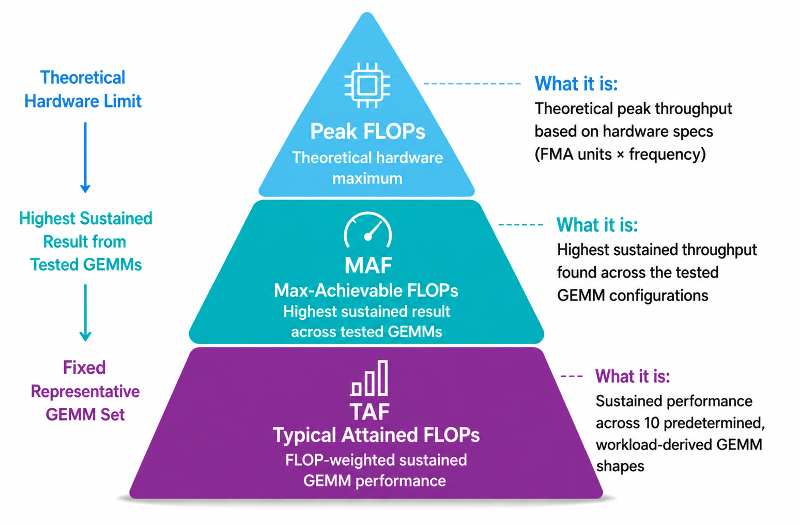

<!---
Copyright (c) 2026 Advanced Micro Devices, Inc. (AMD)

Permission is hereby granted, free of charge, to any person obtaining a copy
of this software and associated documentation files (the "Software"), to deal
in the Software without restriction, including without limitation the rights
to use, copy, modify, merge, publish, distribute, sublicense, and/or sell
copies of the Software, and to permit persons to whom the Software is
furnished to do so, subject to the following conditions:

The above copyright notice and this permission notice shall be included in all
copies or substantial portions of the Software.

THE SOFTWARE IS PROVIDED "AS IS", WITHOUT WARRANTY OF ANY KIND, EXPRESS OR
IMPLIED, INCLUDING BUT NOT LIMITED TO THE WARRANTIES OF MERCHANTABILITY,
FITNESS FOR A PARTICULAR PURPOSE AND NONINFRINGEMENT. IN NO EVENT SHALL THE
AUTHORS OR COPYRIGHT HOLDERS BE LIABLE FOR ANY CLAIM, DAMAGES OR OTHER
LIABILITY, WHETHER IN AN ACTION OF CONTRACT, TORT OR OTHERWISE, ARISING FROM,
OUT OF OR IN CONNECTION WITH THE SOFTWARE OR THE USE OR OTHER DEALINGS IN THE
SOFTWARE.
--->
# Completing the GPU Performance Picture: Understanding TAF Alongside Peak FLOPs and MAF

Modern AI accelerators can execute an extraordinary number of floating-point operations every second. But a single FLOPs number rarely tells the full performance story. In the first two blogs in this series, we discussed [Peak FLOPs](https://rocm.blogs.amd.com/software-tools-optimization/Understanding_Peak_and_Max-Achievable_FLOPS/README.html) and [Max-Achievable FLOPs (MAF)](https://rocm.blogs.amd.com/software-tools-optimization/measuring-max-achievable-flops-part2/README.html#amd-maf-results) for AMD Instinct™ GPUs., we discussed Peak FLOPs and Max-Achievable FLOPs (MAF) for AMD Instinct™ GPUs. Peak FLOPs describe the theoretical compute capability of the hardware. MAF goes a step further by measuring the highest sustained throughput the GPU can achieve after testing a range of GEMM sizes. This blog introduces a third metric: Typical Attained FLOPs (TAF). TAF measures FLOP-weighted sustained throughput across a fixed representative GEMM set selected before testing. The goal is not to replace Peak FLOPs or MAF. Each metric answers a different question, and together they provide a more complete view of GPU compute performance.

## Highlights

- Learn where TAF fits alongside Peak FLOPs and MAF.
- See how a fixed representative GEMM set provides a repeatable measure of sustained compute throughput.
- Review FP16, BF16, and unscaled FP8 TAF results for one AMD Instinct™ MI325X GPU.

## Three Metrics, Three Different Questions

Peak FLOPs, MAF, and TAF are useful for different reasons:

| **Metric**     | **Question it answers**                                                                    |
|----------------|--------------------------------------------------------------------------------------------|
| **Peak FLOPs** | What is the theoretical compute ceiling of the GPU?                                        |
| **MAF**        | What is the highest sustained throughput the GPU can achieve across the tested GEMM sizes? |
| **TAF**        | What is a reasonable target for GEMM performance on a variety of GEMM sizes?               |

Peak FLOPs are calculated from the GPU architecture, including the number of compute units, operations performed per cycle, and maximum clock frequency. They provide an important upper bound, but they are not a prediction of sustained application performance. MAF measures sustained performance rather than a theoretical maximum. Multiple GEMM sizes are tested, and the highest-performing result is reported. This indicates the GPU’s optimized sustained-compute ceiling. However, the GEMM shape that produces the highest MAF result may be particularly well suited to that GPU and may not reflect the shapes used by a given application. TAF approaches the measurement differently. Before testing, a representative set of GEMM shapes drawn directly from an actual workload—in this case, DeepSeek V3—is fixed. Every shape in the set contributes to the final result through a FLOP-weighted harmonic mean. This reduces best-case shape-selection bias and provides a consistent basis for comparing GPUs using the same workload-derived GEMM set. As shown in the figure below, Peak FLOPs, MAF, and TAF each answer a distinct performance question and together provide a more complete view of sustained GPU compute performance.

## Introducing Typical Attained FLOPs

In our previous blogs, we discussed Peak FLOPs and MAF. TAF measures sustained floating-point throughput on predetermined GEMM workloads under standardized test conditions. Unlike MAF, which reports the highest result found across the tested GEMM configurations, TAF includes all 10 predetermined representative shapes in the calculation. The reported value therefore represents FLOP-weighted sustained performance across the complete GEMM set rather than performance from one particularly favorable shape.

TAF (Typical Attained FLOPs) provides a standardized measure of sustained GEMM compute performance rather than a direct measure of end-to-end application performance. TAF is a useful compute-side indicator for the GEMM portion of inference, providing a realistic measure of attainable GEMM throughput alongside other factors that influence end-to-end inference performance. Modern inference workloads, particularly the decode and token-generation stages of large language models, can be constrained by memory bandwidth, KV-cache access, communication overhead, latency, and sequential token dependencies rather than raw compute throughput. Consequently, differences in TAF may produce smaller improvements in end-to-end throughput or latency when another part of the pipeline is the bottleneck. TAF characterizes sustained GEMM compute performance under standardized conditions, while overall application performance depends on the combined efficiency of compute, memory, communication, and the software stack.

## TAF Methodology

The AMD Instinct™ MI325X GPU results in this blog use a fixed set of 10 representative GEMM shapes derived from DeepSeek V3. Five predetermined $(N,K)$ pairs are each evaluated at two $M$ values, $M = 32$ and $M = 32,768$, producing the following 10 $(M,N,K)$ shapes:

| **Shape** | **M**  | **N** | **K** |
|-----------|--------|-------|-------|
| 1         | 32     | 2,112 | 7,168 |
| 2         | 32     | 3,072 | 1,536 |
| 3         | 32     | 7,168 | 2,048 |
| 4         | 32     | 4,608 | 7,168 |
| 5         | 32     | 7,168 | 256   |
| 6         | 32,768 | 2,112 | 7,168 |
| 7         | 32,768 | 3,072 | 1,536 |
| 8         | 32,768 | 7,168 | 2,048 |
| 9         | 32,768 | 4,608 | 7,168 |
| 10        | 32,768 | 7,168 | 256   |

Each shape is run for 30 seconds using `mblas-bench` to obtain its measured sustained performance, $P_i$. The test is performed separately for each reported data format, producing individual TAF results for FP16, BF16, and unscaled FP8.

For each GEMM $i$, the number of floating-point operations is

$$
F_i = 2 \times M_i \times N_i \times K_i
$$

Its equivalent execution time is calculated as:

$$
t_i = \frac{F_i}{P_i}
$$

The final TAF result combines all 10 shapes using a FLOP-weighted harmonic mean:

$$
\mathrm{TAF} = \frac{\sum_i F_i}{\sum_i(F_i/P_i)} = \frac{\text{total FLOPs}}{\text{total equivalent execution time}}
$$

The 30-second measurement periods are used to establish a stable sustained-performance value for each shape; they are not added together in the TAF calculation. Because the calculation is weighted by mathematical work, GEMMs with more FLOPs contribute proportionally more to the final result. The same predetermined 10-shape set is used for every GPU evaluated under this methodology, providing a consistent basis for comparison.

## Controlled Initialization and Test Conditions

Matrix size is not the only factor that affects GEMM performance. The values in the input matrices also matter. Different data patterns can change switching activity, power consumption, and sustained GPU frequency, which can affect measured throughput.

To keep this consistent, the current MAF and TAF tests initialize the input matrices using a normal distribution. Values are generated directly in each target data format. For unscaled FP8, the scale factors are set to one.

Earlier published MAF results used `trig_float` initialization. This structured input pattern can result in lower switching activity and power consumption for some data formats, allowing the GPU to sustain higher frequencies than it would with more representative input data. The current tests use normal-distribution initialization to better reflect the range of values typically found in AI workloads.

Because the initialization method was different, those results are not directly comparable with the current MAF and TAF results. The current results use the same normal-distribution initialization, making it easier to see the difference between the two metrics: MAF and TAF.

Using the same initialization, test duration, system configuration, and operating conditions makes the results repeatable. However, MAF and TAF remain GPU-level measurements and do not directly predict end-to-end application performance.

## TAF Results for the AMD Instinct MI325X GPU

TAF is an important metric for evaluating sustained GEMM compute performance under standardized conditions. Table 1 reports the throughput measured on one AMD Instinct™ MI325X GPU across the tested FP16, BF16, and unscaled FP8 data formats.

The results show the sustained GEMM throughput achieved by the AMD Instinct™ MI325X GPU for each tested precision using the prescribed representative GEMM set and operating conditions. They provide an additional view of delivered GPU compute performance alongside Peak FLOPs and MAF. These measurements should not be interpreted as a competitive ranking or as a direct prediction of end-to-end training or inference performance.

Here are the Typical Attained FLOPs (TAF) results for one AMD Instinct™ MI325X GPU:

| **Product**          | **TAF FP16** | **TAF BF16** | **TAF FP8 (unscaled)** |
|----------------------|--------------|--------------|------------------------|
| AMD Instinct™ MI325X | 606 TFLOPs   | 616 TFLOPs   | 1,143 TFLOPs           |

*Table 1: Typical Attained FLOPs (TAF) for one AMD Instinct™ MI325X GPU.*

## How to Interpret TAF

TAF is a useful proxy for measuring and comparing sustained GPU performance on GEMM shapes derived from real workloads. TAF complements MAF rather than replacing it. MAF shows the highest sustained throughput a GPU can achieve across the tested GEMM configurations, while TAF shows sustained performance across a fixed representative GEMM set. Both measurements are useful because they answer different questions.

The purpose of TAF is not to produce another number that is closer to Peak FLOPs. Peak FLOPs define the theoretical compute ceiling, MAF measures the optimized sustained-compute ceiling, and TAF measures sustained throughput across the complete representative GEMM set.

TAF remains a compute metric, not an end-to-end application benchmark. It does not directly predict training time, inference latency, or tokens per second. Application-level benchmarks remain necessary to measure the performance of the complete hardware and software system.

## Comparing the Three Metrics on the AMD Instinct MI325X GPUs[^1]

| **Data format** | **Peak FLOPs** | **MAF**      | **TAF**      | **TAF as % of MAF** |
|-----------------|----------------|--------------|--------------|---------------------|
| FP16            | 1,300 TFLOPs   | 787 TFLOPs   | 606 TFLOPs   | 77%                 |
| BF16            | 1,300 TFLOPs   | 831 TFLOPs   | 616 TFLOPs   | 74%                 |
| FP8             | 2,610 TFLOPs   | 1,409 TFLOPs | 1,143 TFLOPs | 81%                 |

The Peak FLOPs values are the published dense, non-sparse values from the [AMD Instinct MI325X specifications](https://www.amd.com/en/products/accelerators/instinct/mi300/mi325x.html).

The numerical differences show how the three metrics answer different questions. Peak FLOPs represent the MI325X GPU’s theoretical compute ceiling under ideal utilization and maximum specified operating conditions. MAF runs several GEMM tests with different matrix dimensions $(M,N,K)$. Each test produces a throughput result, and MAF reports only the highest result. TAF is lower than MAF because it includes performance from all 10 predetermined, workload-derived GEMM shapes rather than selecting only the highest-performing result. The reported MI325X TAF values are approximately 74–81% of the corresponding published MAF values.

The lower TAF values do not indicate a loss of GPU performance—TAF is a measurement methodology, not an operating mode. Instead, the difference shows why the highest sustained throughput achieved on one favorable GEMM shape may not represent the same performance across a broader set of workload-derived shapes.

Peak-to-MAF shows the difference between theoretical and maximum sustained performance. MAF-to-TAF shows the difference between the best-performing GEMM shape and sustained performance across the complete representative GEMM set.

## Summary

In this blog, we introduced how Typical Attained FLOPs (TAF) complements Peak FLOPs and Max-Achievable FLOPs (MAF), explained the methodology behind the metric, and reviewed TAF results for the AMD Instinct™ MI325X GPU. Peak FLOPs, MAF, and TAF provide distinct but complementary views of GPU compute performance. Peak FLOPs defines the theoretical ceiling, MAF measures the highest optimized sustained throughput, and TAF measures sustained performance on workloads fixed before testing. Understanding all three helps readers interpret benchmark results appropriately and select the metric that best answers their performance question. End-to-end application benchmarks remain necessary for evaluating complete training or inference performance.

[^1]: Measurements by internal AMD Performance Labs as of September 2026 on one AMD Instinct™ MI325X GPU configured at 1,000 W resulted in MAF performance of 787.25 TFLOPs for FP16 and 831.40 TFLOPs for BF16 using (M=4096), (N=4864), and (K=32896), and 1,408.06 TFLOPs for unscaled FP8 using (M=4096), (N=3648), and (K=32896). On the same system, TAF performance was 606.31 TFLOPs for FP16, 616.42 TFLOPs for BF16, and 1,143.18 TFLOPs for unscaled FP8, calculated across the fixed set of 10 workload-derived GEMM shapes described in this article. Both MAF and TAF measurements used input values drawn from a normal distribution and generated directly in the target data format. Configuration: Microsoft C278A system with one AMD Instinct™ MI325X GPU with 256 GiB of memory, two Intel® Xeon® Platinum 8480C processors, 2,048 GiB of system memory, Ubuntu® 22.04.5 LTS, ROCm™ 7.2.1, and system BIOS C2789.5.BS.1C17.AG.2.

## Disclaimers

The information contained herein is for informational purposes only and is subject to change without notice. While every precaution has been taken in the preparation of this document, it may contain technical inaccuracies, omissions, and/or typographical errors, and AMD is under no obligation to update or otherwise correct this information. Advanced Micro Devices, Inc. makes no representations or warranties with respect to the accuracy or completeness of the contents of this document, and assumes no liability of any kind, including the implied warranties of noninfringement, merchantability or fitness for particular purposes, with respect to the operation or use of AMD hardware, software or other products described herein. No license, including implied or arising by estoppel, to any intellectual property rights is granted by this document. Terms and limitations applicable to the purchase or use of AMD products are set forth in a signed agreement between the parties or in AMD's Standard Terms and Conditions of Sale. GD-18u.

© 2026 Advanced Micro Devices, Inc. All rights reserved. AMD, the AMD Arrow logo, Instinct , and combinations thereof are trademarks of Advanced Micro Devices, Inc. Other product names contained herein are for identification purposes only and may be trademarks of their respective owners.Certain AMD technologies may require third-party enablement or activation. Supported features may vary by operating system. Please confirm with the system manufacturer for specific features. No technology or product can be completely secure.
