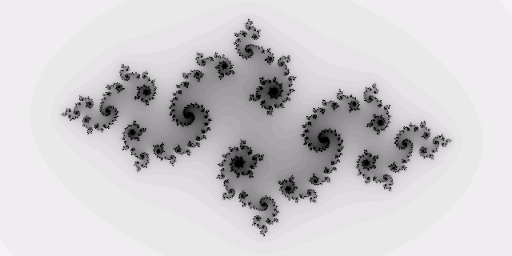

<!---
Copyright (c) 2025 Advanced Micro Devices, Inc. (AMD)

Permission is hereby granted, free of charge, to any person obtaining a copy
of this software and associated documentation files (the "Software"), to deal
in the Software without restriction, including without limitation the rights
to use, copy, modify, merge, publish, distribute, sublicense, and/or sell
copies of the Software, and to permit persons to whom the Software is
furnished to do so, subject to the following conditions:

The above copyright notice and this permission notice shall be included in all
copies or substantial portions of the Software.

THE SOFTWARE IS PROVIDED "AS IS", WITHOUT WARRANTY OF ANY KIND, EXPRESS OR
IMPLIED, INCLUDING BUT NOT LIMITED TO THE WARRANTIES OF MERCHANTABILITY,
FITNESS FOR A PARTICULAR PURPOSE AND NONINFRINGEMENT. IN NO EVENT SHALL THE
AUTHORS OR COPYRIGHT HOLDERS BE LIABLE FOR ANY CLAIM, DAMAGES OR OTHER
LIABILITY, WHETHER IN AN ACTION OF CONTRACT, TORT OR OTHERWISE, ARISING FROM,
OUT OF OR IN CONNECTION WITH THE SOFTWARE OR THE USE OR OTHER DEALINGS IN THE
SOFTWARE.
--->

# Modernizing Taichi Lang to LLVM 20 for MI325X GPU Acceleration

[Our first Taichi Lang blog](https://rocm.blogs.amd.com/artificial-intelligence/taichi/README.html) intrduced you to Taichi Lang on AMD's MI210 and MI250X GPUs. This previous version of Taichi was limited by it's dependence on outdated versions of LLVM. We have modernized Taichi to LLVM 20 to take advantage of the latest advances in LLVM's code generation capabilities. This modernization also allows us to make Taichi available for execution on newer AMD Instinct GPUs, MI300X and MI325X. As with our previous blog, we provide you with a guide for understanding Taichi, and walk you through installing Taichi, as well as, writing and executing a Taichi program.

## ROCm Taichi

* [Installation](https://rocm.docs.amd.com/projects/install-on-linux/en/latest/install/3rd-party/taichi-install.html)

* [Docker image](https://hub.docker.com/r/rocm/taichi/tags)

* [GitHub](https://github.com/ROCm/taichi)

## Getting Started with Taichi

When writing compute-intensive tasks, users can make use of the two decorators `@ti.func` and `@ti.kernel`.
Functions decorated with `@ti.kernel` are kernels that serve as the entry points where Taichi's runtime takes over the tasks,
and they must be directly invoked by Python code. Functions decorated with `@ti.func` are building blocks of kernels and can only be
invoked by another Taichi function or a kernel. These decorators instruct Taichi to take over the computation tasks and
compile the decorated functions to machine code using the JIT compiler.
As a result, calls to these functions are executed on multi-core CPUs or GPUs.

Below we show how simple it is to use the Taichi `@ti.func` and `@ti.kernel` decorators to accelerate Python code. First, we show the Python code without using Taichi. In this example, we have the function `inv_square` which acts as a building block function for the kernel `partial_sum`.

Example without Taichi:

```python
def inv_square(x):  # A function
    return 1.0 / (x * x)

def partial_sum(n: int) -> float:  # A kernel
    total = 0.0
    for i in range(1, n + 1):
        total += inv_square(i)
    return total

partial_sum(1000)
```

To write this code with Taichi, we simply import and initialize Taichi for acceleration:

```python
import taichi as ti
ti.init(arch=ti.gpu)
```

and decorate the building block function and kernel with the `@ti.func` and `@ti.kernel` decorators, respectively:

```python
@ti.func
def inv_square(x):  # A Taichi function
    return 1.0 / (x * x)

@ti.kernel
def partial_sum(n: int) -> float:  # A kernel
    total = 0.0
    for i in range(1, n + 1):
        total += inv_square(i)
    return total
```

## Docker Environments for Taichi Lang on AMD GPUs

### Use a Prebuilt Docker Image with Taichi Pre-Installed

To simplify running Taichi programs on AMD GPUs, we recommend using the pre-built Docker image.
To do this, pull the docker image:

```bash
docker pull rocm/taichi:taichi-1.8.0b2_rocm7.0_ubuntu22.04_py3.10.12
```

and launch the docker container:

```bash
docker run -it --privileged --network=host --device=/dev/kfd --device=/dev/dri --group-add video --cap-add=SYS_PTRACE --security-opt seccomp=unconfined --ipc=host --name taichi_lang rocm/taichi:taichi-1.8.0b2_rocm7.0.0_ubuntu24.04_py3.12 bash
```

### Build Your Own Docker Image

You can also install Taichi in an existing docker image with ROCm 7.0. To do this, copy the instructions below into a Dockerfile:

```text
FROM rocm/dev-ubuntu-24.04:7.0-complete

ARG LLVM_VERSION=20
ARG GPU_TARGETS=gfx90a,gfx940,gfx941,gfx942,gfx950
ARG ROCM_VERSION=7.0.0

ENV LLVM_PATH=/usr/lib/llvm-${LLVM_VERSION}/
ENV ROCM_PATH=/opt/rocm-${ROCM_VERSION}
ENV PATH=${LLVM_PATH}/bin:$PATH

ENV TAICHI_CMAKE_ARGS="-DTI_WITH_VULKAN=OFF -DTI_WITH_OPENGL=OFF -DTI_BUILD_TESTS=OFF -DTI_BUILD_EXAMPLES=OFF -DCMAKE_PREFIX_PATH=${LLVM_PATH}/lib/cmake -DCMAKE_CXX_COMPILER=${LLVM_PATH}/bin/clang++ -DTI_WITH_AMDGPU=ON -DTI_WITH_CUDA=OFF -DTI_AMDGPU_ARCHS=${GPU_TARGETS} -DUSE_LLD=ON -DTI_WITH_LLVM=ON"


RUN apt-get update && apt-get install -y --no-install-recommends \
        git wget vim git freeglut3-dev libglfw3-dev libglm-dev \
        libglu1-mesa-dev libjpeg-dev liblz4-dev libpng-dev \
        libssl-dev libwayland-dev libx11-xcb-dev libxcb-dri3-dev \
        libxcb-ewmh-dev libxcb-keysyms1-dev libxcb-randr0-dev \
        libxcursor-dev libxi-dev libxinerama-dev libxrandr-dev \
        libzstd-dev python3-pip cmake pybind11-dev \
        ca-certificates python3-venv rocm-llvm-dev \
        gdb python3-dbg

WORKDIR /app

RUN wget https://apt.llvm.org/llvm.sh \
        && chmod +x llvm.sh \
        && apt-get update && apt-get install -y \
        lsb-release software-properties-common gnupg \
        && ./llvm.sh ${LLVM_VERSION} llvm clang lld

RUN git clone --recursive -b amd-integration https://github.com/ROCm/taichi.git \
        && cd  taichi/external/spdlog \
        && git apply /app/taichi/spdlog_fmt.patch \
        && cd /app/taichi \
        && ./build.py \
        && python3 -m pip config set global.break-system-packages true \
        && python3 -m pip install /app/taichi/dist/taichi*.whl
```

Build the docker container with the following command:

```bash
docker build  -t taichi-lang-dev .
```

Launch the docker container using the following docker run command:

```bash
docker run -it --privileged --network=host --device=/dev/kfd --device=/dev/dri --group-add video --cap-add=SYS_PTRACE --security-opt seccomp=unconfined --ipc=host --name taichi_lang taichi-lang-dev bash
```

If the docker container terminal does not launch automatically run the following docker attach command:

```bash
docker attach taichi_lang
```

## Prepared Taichi Lang Examples

AMD has a collection of select examples to demonstrate the use of Taichi Lang on AMD Instinct GPUs. One such example is the "count primes" program. In this example we have the function `is_prime` which will be used in the kernel `count_primes`. In the code below, we write this example as a Taichi program by decorating `is_prime` with the Taichi decorator `@ti.func` and decorating `count_primes` with the Taichi decorator `@ti.kernel`. To run this example, copy the code below to a file named count_primes.py:

```python
import taichi as ti
ti.init(arch=ti.gpu)

@ti.func
def is_prime(n: int):
    result = True
    for k in range(2, int(n ** 0.5) + 1):
        if n % k == 0:
            result = False
            break
    return result

@ti.kernel
def count_primes(n: int) -> int:
    count = 0
    for k in range(2, n):
        if is_prime(k):
            count += 1

    return count

print(count_primes(1000000))
```

Once this file has been created, execute the code in your Docker container with the following command:

```bash
python3 count_primes.py
```

The output should be similar to the output below:

```text
[Taichi] version 1.8.0, llvm 20.1.8, commit ed1c61d5, linux, python 3.12.3
[Taichi] Starting on arch=amdgpu
78498
```

Another example is a longest common subsequence kernel. In this example we do not need a helper function, so the only decorator we use is `@ti.kernel` to accelerate the kernel function `compute_lcs`. To run this example, copy the code below into a file named lcs.py:

```python
import taichi as ti
import numpy as np

ti.init(arch=ti.gpu)

benchmark = True

N = 15000

f = ti.field(dtype=ti.i32, shape=(N + 1, N + 1))

if benchmark:
    a_numpy = np.random.randint(0, 100, N, dtype=np.int32)
    b_numpy = np.random.randint(0, 100, N, dtype=np.int32)
else:
    a_numpy = np.array([0, 1, 0, 2, 4, 3, 1, 2, 1], dtype=np.int32)
    b_numpy = np.array([4, 0, 1, 4, 5, 3, 1, 2], dtype=np.int32)

@ti.kernel
def compute_lcs(a: ti.types.ndarray(), b: ti.types.ndarray()) -> ti.i32:
    len_a, len_b = a.shape[0], b.shape[0]

    ti.loop_config(serialize=True) # Disable auto-parallelism in Taichi
    for i in range(1, len_a + 1):
        for j in range(1, len_b + 1):
               f[i, j] = ti.max(f[i - 1, j - 1] + (a[i - 1] == b[j - 1]),
                          ti.max(f[i - 1, j], f[i, j - 1]))

    return f[len_a, len_b]


print(compute_lcs(a_numpy, b_numpy))
```

Once this file has been created, execute the code in your Docker container with the following command:

```bash
python3 lcs.py
```

The output should be similar to the output below:

```text
[Taichi] version 1.8.0, llvm 20.1.8, commit ed1c61d5, linux, python 3.12.3
[Taichi] Starting on arch=amdgpu
2706
```

The last example we will demonstrate is the fractal example. This example demonstrates how to iteratively save images and video using Taichi's Video Manager Tool:
To run this, save the code below into a file named fractal.py:

```python
import taichi as ti
import taichi.math as tm

ti.init(arch=ti.gpu)

n = 320
pixels = ti.field(dtype=float, shape=(n * 2, n))

@ti.func
def complex_sqr(z):  # complex square of a 2D vector
    return tm.vec2(z[0] * z[0] - z[1] * z[1], 2 * z[0] * z[1])

@ti.kernel
def paint(t: float):
    for i, j in pixels:  # Parallelized over all pixels
        c = tm.vec2(-0.8, tm.cos(t) * 0.2)
        z = tm.vec2(i / n - 1, j / n - 0.5) * 2
        iterations = 0
        while z.norm() < 20 and iterations < 50:
            z = complex_sqr(z) + c
            iterations += 1
        pixels[i, j] = 1 - iterations * 0.02

result_dir = "./taichi_fractal_results"
video_manager = ti.tools.VideoManager(output_dir=result_dir, framerate=24, automatic_build=False)

frames = 200

i = 0
for f in range(frames):
    paint(i * 0.03)

    pixels_img = pixels.to_numpy()
    video_manager.write_frame(pixels_img)
    i += 1

video_manager.make_video(gif=True, mp4=True)
```

Once this file has been created, you must also install ffmpeg, as it is a dependency for Taichi's VideoManager:

```bash
sudo apt update
sudo apt install ffmpeg
```

Once this dependency has been installed, execute the code in your Docker container with the following command:

```bash
python3 fractal.py
```

Once execution of fractal.py has completed, a directory named `taichi_fractal_results` should have been created. This directory should contain an mp4 video file named `video.mp4`, a gif video file named `video.gif` and a directory named 'frames' that contains the 200 png files created during the execution.

The two video files, `video.mp4` and `video.gif`, are identical animations. When you open either video file, the animation should display this fractal:



## Summary

Taichi Lang has been modernized to LLVM 20 for use on AMD's MI300X, and MI325X GPUs, an anticipated update from [previous versions of Taichi](https://rocm.blogs.amd.com/artificial-intelligence/taichi/README.html). The provided step-by-step guide should enable users to install Taichi Lang in a ROCm 7.0 docker environment, and run Taichi Lang programs with features enabled for AMD MI210, MI250X, MI300X, and MI325x GPUs.

AMD continues to enhance Taichi support through ongoing development on its latest ROCm software and AMD Instinct GPU products. Keep an eye out for updates and new blogs as we share our progress.

## Acknowledgements

The authors wish to acknowledge the AMD teams that supported this work, whose contributions were
instrumental in enabling Taichi Lang:
*Tiffany Mintz, Deepan Sekar, Debasis Mandal, Yao Liu, Phani Vaddadi, Vish Vadlamani, Ritesh Hiremath,
Bhavesh Lad, Radha Srimanthula, Anisha Sankar, Amit Kumar, Ram Seenivasan, Kiran Thumma,
Aakash Sudhanwa, Aditya Bhattacharji*

## Disclaimers

Third-party content is licensed to you directly by the third party that owns the
content and is not licensed to you by AMD. ALL LINKED THIRD-PARTY CONTENT IS
PROVIDED “AS IS” WITHOUT A WARRANTY OF ANY KIND. USE OF SUCH THIRD-PARTY CONTENT
IS DONE AT YOUR SOLE DISCRETION AND UNDER NO CIRCUMSTANCES WILL AMD BE LIABLE TO
YOU FOR ANY THIRD-PARTY CONTENT. YOU ASSUME ALL RISK AND ARE SOLELY RESPONSIBLE
FOR ANY DAMAGES THAT MAY ARISE FROM YOUR USE OF THIRD-PARTY CONTENT.
