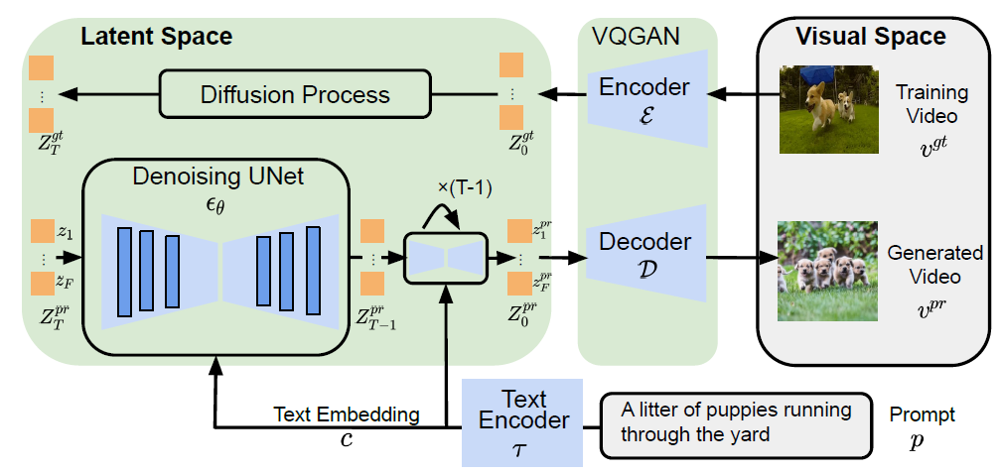
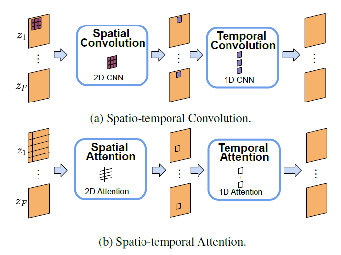

# Transforming Words into Motion: A Guide to Video Generation with AMD GPU

This blog introduces the advancements in text-to-video generation through enhancements to the stable diffusion model and demonstrates the process of generating videos from text prompts on an AMD GPU using Alibaba's ModelScopeT2V model.

## Introduction

Artificial intelligence has transformed content generation across various mediums, including text, images, and audio. While significant advancements have been made in image generation using diffusion models, video generation remains a challenging task due to training complexities. Despite the progress in text-to-image synthesis, the lack of a publicly available codebase for video generation hinders further research. To address this, [ModelScopeT2V](https://arxiv.org/abs/2308.06571) introduces a simple yet effective approach for video generation, leveraging Latent Diffusion Models and a multi-frame training strategy. Experimental results demonstrate the model's superior performance, positioning it as a valuable baseline for future video synthesis research.


<figure style="text-align: left;">
    <figcaption>ModelScopeT2V model architecture<br>Source: ModelScope Text-to-Video Technical Report</figcaption>
</figure>

Based on the model architecture, you can see that the main difference from the classical stable diffusion model is that, it converts a video with $F$ frames into a tensor with $F$ elements (and each element represent an image/frame in the video). Each image/frame will go through the diffusion and denoising process as in stable diffusion. But wait, how can this framework capture the essence of a video: the spatial-temporal relationships among pixels? Here comes the spatial-temporal block.
The spatio-temporal block is integral in capturing intricate spatial and temporal dependencies within the latent space, thereby improving the quality of video synthesis. In achieving this goal, we harness the capabilities of spatio-temporal convolutions and attentions to effectively capture these complex dependencies.


<figure style="text-align: left;">
    <figcaption>Diagram of the processing flow for the spatio-temporal block<br>Source: ModelScope Text-to-Video Technical Report</figcaption>
</figure>

The block utilizes a combination of spatio-temporal convolutions and attentions to analyze correlations across frames within videos. Spatio-temporal convolutions traverse both spatial and temporal dimensions, while spatio-temporal attentions focus on specific regions and time steps across the frames within the video. This integration enables the model to grasp complex spatio-temporal patterns and generate videos of high quality. Each spatio-temporal block consists of repeated spatial and temporal convolutions, as well as spatial and temporal attention operations. Specifically, these operations were repeated $(2, 4, 2, 2)$ times, respectively to strike a balance between performance and computational efficiency. Additionally, the model employs two types of spatial attentions: a cross-attention module for cross-modal interactions (attends to text prompt) and a self-attention module for spatial modeling of visual features. Both temporal attentions are self-attention modules. This overview aims to provide an intuitive understanding of text-to-video generation. For deeper insights, we recommend referring to the [original technical report](https://arxiv.org/abs/2308.06571) by the ModelScope team.

## Implementation

We ran the inference in a PyTorch ROCm 6.0 docker container ([see the list of supported OSs and AMD hardware](https://rocm.docs.amd.com/projects/install-on-linux/en/latest/reference/system-requirements.html)) on an AMD GPU.

First, pull and run the docker container with the code below in a Linux shell:

```text
docker run -it --ipc=host --network=host --device=/dev/kfd --device=/dev/dri \
           --group-add video --cap-add=SYS_PTRACE --security-opt seccomp=unconfined \
           --name=t2v-pytorch rocm/pytorch:rocm6.0_ubuntu20.04_py3.9_pytorch_2.1.1 /bin/bash
```

Then run the following code in the docker to install the required Python packages:

```text
pip install diffusers transformers accelerate opencv-python
```

Now, we are ready to generate interesting videos with the Hugging Face `diffusers` API in Python.

```python
import torch
from diffusers import DiffusionPipeline, DPMSolverMultistepScheduler, LMSDiscreteScheduler, PNDMScheduler
from diffusers.utils import export_to_video

# Defult scheduler: DDIMScheduler
pipe = DiffusionPipeline.from_pretrained("damo-vilab/text-to-video-ms-1.7b")
pipe.to('cuda')

# generate
generator = torch.Generator(device="cuda").manual_seed(1234)
prompt = "A monkey is riding a horse around a lake"
video_frames = pipe(prompt, generator=generator, num_inference_steps=50, num_frames=20).frames
export_to_video(video_frames[0], "/var/lib/jenkins/example.mp4")
```

```text
Loading pipeline components...: 100%|█████████████| 5/5 [00:00<00:00,  8.45it/s]
100%|███████████████████████████████████████████| 50/50 [00:31<00:00,  1.58it/s]

'/var/lib/jenkins/example.mp4'
```

You can find all the generated videos mentioned in this blog in the `videos` folder in the [GitHub repo](https://github.com/ROCm/rocm-blogs/tree/release/blogs/artificial-intelligence/text-to-video-generation) of this blog.

Stable diffusion-based models, including the current one, consist of various components such as the scheduler, text encoder, tokenizer, UNet, and a variational auto-encoder. These components are modular, allowing us to swap one component with another of the same type. For instance, we can replace the CLIPTextModel-based text encoder with larger models like OpenCLIP to improve prompt understanding. In the current blog, we will show you how to test the effect of different schedulers implemented in the `diffusers` package.

A scheduler is a component responsible for orchestrating the entire denoising process within the pipeline. This includes determining factors such as the number of denoising steps, whether the process is stochastic or deterministic, and which algorithm to employ to find the denoised sample. Schedulers play a crucial role in balancing denoising speed and quality, often requiring complex algorithms to optimize this trade-off. Due to the inherent difficulty in quantitatively measuring the effectiveness of different schedulers, it is common practice to experiment with various options to determine which one best suits a specific diffusion pipeline's requirements. You can find the generated videos in the `videos` folder and compare the schedulers' effect.

```python
# DPMSolverMultistepScheduler
pipe1 = DiffusionPipeline.from_pretrained("damo-vilab/text-to-video-ms-1.7b")
pipe1.scheduler = DPMSolverMultistepScheduler.from_config(pipe1.scheduler.config)
pipe1.to("cuda")

#LMSDiscreteScheduler
pipe2 = DiffusionPipeline.from_pretrained("damo-vilab/text-to-video-ms-1.7b")
pipe2.scheduler = LMSDiscreteScheduler.from_config(pipe2.scheduler.config)
pipe2.to("cuda")

#PNDMScheduler
pipe3 = DiffusionPipeline.from_pretrained("damo-vilab/text-to-video-ms-1.7b")
pipe3.scheduler = PNDMScheduler.from_config(pipe3.scheduler.config)
pipe3.to("cuda")

video_frames = pipe1(prompt, generator=generator, num_inference_steps=50, num_frames=20).frames
export_to_video(video_frames[0], "/var/lib/jenkins/example1.mp4")

video_frames = pipe2(prompt, generator=generator, num_inference_steps=50, num_frames=20).frames
export_to_video(video_frames[0], "/var/lib/jenkins/example2.mp4")

video_frames = pipe3(prompt, generator=generator, num_inference_steps=50, num_frames=20).frames
export_to_video(video_frames[0], "/var/lib/jenkins/example3.mp4")
```

```text
Loading pipeline components...: 100%|█████████████| 5/5 [00:00<00:00,  8.24it/s]
Loading pipeline components...: 100%|█████████████| 5/5 [00:00<00:00,  8.45it/s]
Loading pipeline components...: 100%|█████████████| 5/5 [00:00<00:00,  8.92it/s]
100%|███████████████████████████████████████████| 50/50 [00:30<00:00,  1.66it/s]
100%|███████████████████████████████████████████| 50/50 [00:30<00:00,  1.65it/s]
100%|███████████████████████████████████████████| 50/50 [00:31<00:00,  1.57it/s]

'/var/lib/jenkins/example3.mp4'
```

In the following section, we examined the model's ability to integrate prior knowledge from training data, such as "Times Square" and "Van Gogh Style". Upon reviewing the generated videos, it became evident that the model effectively incorporates these key elements from the prompt, producing videos that reflect the specified characteristics.

```python
# generate

prompt = "A Robot is dancing in the Times Square"
video_frames = pipe(prompt, generator=generator, num_inference_steps=50, num_frames=20).frames
export_to_video(video_frames[0], "/var/lib/jenkins/example_ts.mp4")

prompt = "A cartoon of a dog dancing in Van Gogh style"
video_frames = pipe(prompt, generator=generator, num_inference_steps=50, num_frames=20).frames
export_to_video(video_frames[0], "/var/lib/jenkins/example_vs.mp4")
```

```text
100%|███████████████████████████████████████████| 50/50 [00:31<00:00,  1.59it/s]
100%|███████████████████████████████████████████| 50/50 [00:31<00:00,  1.58it/s]  

'/var/lib/jenkins/example_vs.mp4'
```

If you're aiming for higher-quality images in the video, consider increasing the `num_inference_steps`. For longer videos, adjust the `num_frames`. Feel free to tweak these parameters to suit your needs, provided you don't encounter memory issues.

## Acknowledgement

We extend our sincere gratitude to the authors of the [ModelScope Text-to-Video Technical Report](https://arxiv.org/abs/2308.06571). Their invaluable contribution to the GenAI community has made this blog possible.

## Disclaimers

Third-party content is licensed to you directly by the third party that owns the content and is not licensed to you by AMD. ALL LINKED THIRD-PARTY CONTENT IS PROVIDED “AS IS” WITHOUT A WARRANTY OF ANY KIND. USE OF SUCH THIRD-PARTY CONTENT IS DONE AT YOUR SOLE DISCRETION AND UNDER NO CIRCUMSTANCES WILL AMD BE LIABLE TO YOU FOR ANY THIRD-PARTY CONTENT. YOU ASSUME ALL RISK AND ARE SOLELY RESPONSIBLE FOR ANY DAMAGES THAT MAY ARISE FROM YOUR USE OF THIRD-PARTY CONTENT.
