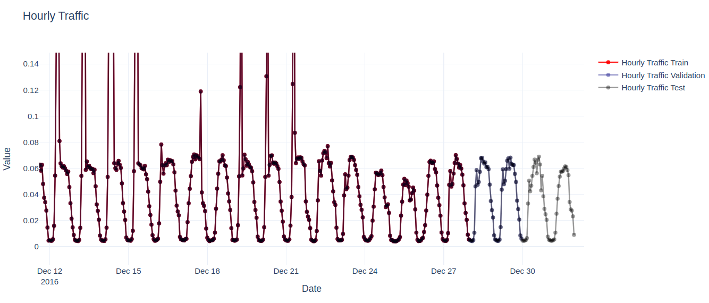
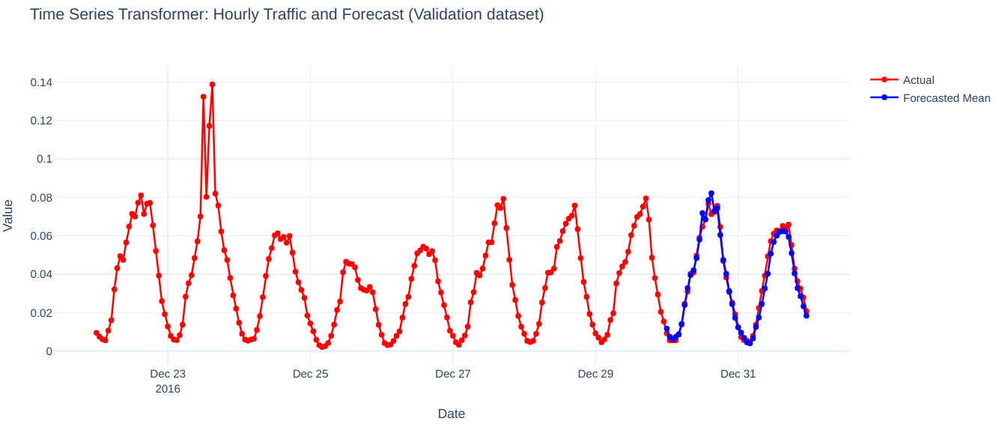
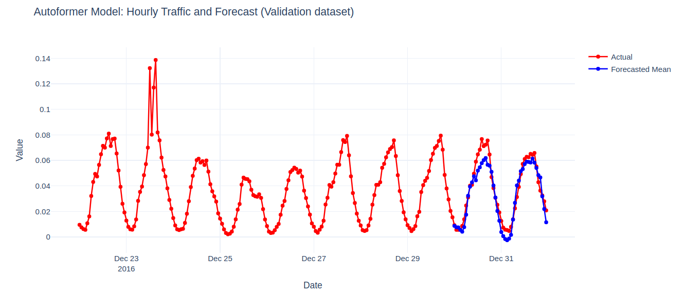
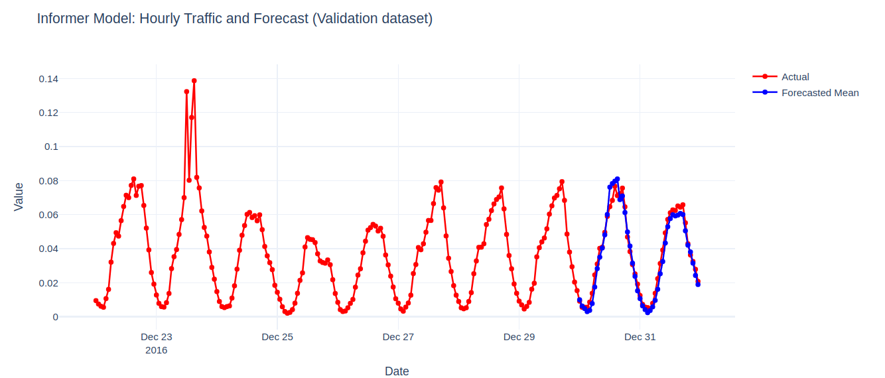

# Using AMD GPUs for Enhanced Time Series Forecasting with Transformers

Time series forecasting (TSF) is a key concept in fields such as signal processing, data science, and machine learning (ML). TSF involves predicting future behavior of a system by analyzing its past temporal patterns, using historical data to forecast future data points. Classical approaches to TSF relied on a variety of statistical methods. Recently, machine learning techniques have been increasingly used for TSF, generating discussions within the community about whether these modern approaches outperform the classical statistical ones (see: [Are Transformers Effective for Time Series Forecasting?](https://arxiv.org/abs/2205.13504) and [Yes, Transformers are Effective for Time Series Forecasting (+ Autoformer)](https://huggingface.co/blog/autoformer)).

This blog post will not address whether the conventional statistical approach or the use of machine learning-based models are better for forecasting. Instead, it will offer a practical guide on implementing one of the key machine learning methods for time series forecasting: Transformers. In this blog we will implement a complete Transformers-based TSF workflow, from data preprocessing to model training and evaluation.

## Introduction

The application of Transformer-based architectures in time series forecasting has emerged as a substantial alternative over the conventional statistical models such as Autoregressive Integrated Moving Average (ARIMA) or Exponential Smoothing (ETS). Transformers have the capability to capture complex temporal dependencies, and handle different types of input data such as text, audio, images, and time series data.

### What is a Transformer-based model?

A transformer-based model is a type of neural network architecture designed to handle sequential data and capture long-range dependencies. Transformers were introduced in the paper [Attention is All You Need](https://arxiv.org/abs/1706.03762). While originally designed to handle text data for Natural Language Processing (NLP) tasks, transformers have been adapted for applications such as image classification, speech recognition and forecasting.

For the case of time series data and prediction, Time Series Transformer, Autoformer, and Informer are models that use a Transformer-based architecture to improve the accuracy and efficiency of forecasting tasks.

**[Time Series Transformer](https://huggingface.co/docs/transformers/v4.41.3/en/model_doc/time_series_transformer#time-series-transformer)** is specifically designed for analyzing sequential data over time. It adapts the original Transformer architecture to better capture temporal patterns by incorporating modifications that address the dependency of long-term dependencies in the data.

**[Autoformer](https://huggingface.co/docs/transformers/v4.41.3/en/model_doc/autoformer)** extends the original Transformer architecture by integrating a decomposition architecture and an auto-correlation mechanism. The decomposition and auto-correlation mechanisms help in better capturing temporal and periodic patterns.

**[Informer](https://huggingface.co/docs/transformers/v4.41.3/en/model_doc/informer)** designed for long sequence time-series forecasting, it address the challenges of the original Transformer such as high computational complexity and memory usage. It uses probabilistic sparse self-attention mechanism and self-attention distilling mechanism allowing for a reduced time complexity, and the retention of dominant features by reducing the input sequence progressively.

In this blog, we explore the capabilities these 3 models offer for the purpose of time series forecasting using AMD GPUs. We also provide a practical application using the **traffic_hourly** dataset, which is part of the  **monash_tsf** time series data repository.

You can find the files related to this blog post in this
[GitHub folder](https://github.com/ROCm/rocm-blogs/tree/main/docs/artificial-intelligence/timeseries_transformers).

## Requirements

* AMD GPU: See the [ROCm documentation page](https://rocm.docs.amd.com/projects/install-on-linux/en/latest/reference/system-requirements.html) for supported hardware and operating systems.

* ROCm 6.1: See the [ROCm installation for Linux](https://rocm.docs.amd.com/projects/install-on-linux/en/latest/index.html) for installation instructions.

* Docker: See [Install Docker Engine on Ubuntu](https://docs.docker.com/engine/install/ubuntu/#install-using-the-repository) for installation instructions.

* PyTorch 2.0.1: Use the official ROCm Docker image found at: [rocm/pytorch:rocm6.0_ubuntu22.04_py3.9_pytorch_2.0.1](https://hub.docker.com/layers/rocm/pytorch/rocm6.0_ubuntu22.04_py3.9_pytorch_2.0.1/images/sha256-0902b07be4f58e84ec79dd8409f8a49d563d6f161a99d2bd3525067794470b16?context=explore).

## Following along with this blog

This blog uses the **GluonTS** Python library for the management and transformation of data. See [GluonTS - Probabilistic Time Series Modeling in Python](https://ts.gluon.ai/stable/) for more information.

* Clone the repo and `cd` into the blog directory:

    ```shell
    git clone git@github.com:ROCm/rocm-blogs.git
    cd rocm-blogs/blogs/artificial-intelligence/timeseries_transformers
    ```

* Build and start the container. For details on the build process, see the `timeseries_transformers/docker/Dockerfile`.

    ```shell
    cd docker
    docker compose build
    docker compose up
    ```
  
* Open  http://localhost:8888/lab/tree/src/time_series_transformers.ipynb in your browser and open the `time_series_transformers.ipynb` notebook.

You can follow along with this blog using the `time_series_transformers.ipynb` notebook.

## The dataset

The **Monash Time Series Forecasting** repository offers an extensive collection of datasets designated to the development and evaluation of forecasting models. Among these datasets, the **traffic_hourly** dataset provides detailed hourly traffic volume data, capturing the flow of traffic on roads and networks. By analyzing this dataset, researchers and practitioners can design strategies to optimize traffic control systems and enhance urban mobility.

We are accessing the version of the dataset that is available from Hugging Face. The dataset consists of a DatasetDict object with splits for train, test, and validation. Each split contains 862 individual time-series of traffic data sampled every hour.

Let's visualize part of the time series data:



In the example, we notice that the validation set comprises identical data to the training set but extends over a longer prediction length (48 points) in time. This configuration enables us to assess the model’s predictions against the actual outcomes. Similarly, the test set also covers a prediction length of 48 points beyond the validation set.

Let's now proceed to train each of the models mentioned before using the `traffic_hourly` dataset.

## The Time Series Transformer model

Time Series Transformer is a deep learning model that leverage the self-attention mechanism of the Transformer architecture to handle sequential data for forecasting tasks. Conventional models, such as ARIMA or LSTM, face challenges with long-term dependencies and parallelization. Transformers capture long-term dependencies more effectively and support parallel processing, making them a good option for time series forecasting.

Time Series Transformer adapt the standard transformer architecture to handle sequential time series data. They include several modifications to make them suitable for time series data:

* Context and Prediction Windows: Instead of processing entire sequences, Time Series Transformer use context windows (historical data) and prediction windows (future data) to manage memory and computational demands.

* Causal masking: Ensures the model only uses past data points to predict future values.

* Incorporating Time Features: Additional temporal features such as day of the week, month of the year or age of the time series (sequential time stamps starting from the first to the last data point) are added to help the model learn seasonal patterns.

* Handling missing values: Missing values are managed with attention masks, allowing the model to ignore data gaps without imputation.

The Time Series Transformer model is well-suited for time series data because it uses context windows, causal masking, and additional temporal features, as well as mechanisms to handle missing values. These features enable it to effectively capture temporal dependencies and patterns. In contrast, transformers designed for Natural Language Processing tasks process entire sequences and primarily focus on token relationships. For more information on the Time Series Transformer model, see [Probabilistic Time Series Forecasting with Hugging Face Transformers.](https://huggingface.co/docs/transformers/v4.41.3/en/model_doc/time_series_transformer#time-series-transformer)

Let's use the `hourly_traffic` dataset and the [`TimeSeriesTransformerConfig`](https://huggingface.co/docs/transformers/model_doc/time_series_transformer#transformers.TimeSeriesTransformerConfig) class from Hugging Face to set up the parameters for a Time Series Transformer model that predicts the next 48 hourly values (`prediction_length`).

In the following code, we are setting `prediction_length` to 48. This value comes from the difference between the length of the train and validation splits. In terms of hyperparameter values, we set the `context_length` to be equal to 5 times the size of the `prediction_length`, the number of layers for the encoder and decoder to 4 and the size of the feature vector in the input and output of each transformer layer `d_layer` to be 32.

In other words, we want to predict the hourly traffic volume for the next 2 days (`prediction_length`) based on the last 10 days ($5 \times$`prediction_length`) of hourly traffic data.

```python
prediction_length = 48
freq = "H" # data is sampled in an hourly frequency 

lags_sequence = get_lags_for_frequency(freq_str = freq) # Default lags provided by GluonTS for the given frequency
time_features = time_features_from_frequency_str(freq) # Default additional time features provided by GluonTS


config = TimeSeriesTransformerConfig(
    prediction_length = prediction_length,
    context_length = prediction_length * 5,
    # Lags provided by GluonTS
    lags_sequence=lags_sequence,
    # Add time features and "series age"
    num_time_features=len(time_features) + 1, 
    # Length of train dataset
    cardinality=[len(train_dataset)], 
    # Learn and embedding of size 5
    embedding_dimension=[5],         
    # Transformer parameters:
    encoder_layers=4,
    decoder_layers=4,
    d_model=32,
)

# Instantiate the model
model = TimeSeriesTransformerForPrediction(config)
```

Next, we proceed to instantiate the corresponding **data loaders** with the given parameter values:

```python
train_dataloader = create_train_dataloader(
    config = config,
    freq=freq,
    data=train_dataset,
    batch_size=256,
    num_batches_per_epoch=100,
)


test_dataloader = create_backtest_dataloader(
    config=config,
    freq=freq,
    data=test_dataset,
    batch_size=64,
)
```

The `train_dataloader` and `test_dataloader` are GluonTS iterable objects. Each element of the iterator is a dictionary with the following keys:

```python
# Print the keys of an instance of the train_dataloader
example = next(iter(train_dataloader))
example.keys()
```

```text
dict_keys(['past_time_features', 'past_values', 'past_observed_mask', 'future_time_features', 'future_values', 'future_observed_mask'])
```

We are training our model for 20 epochs and then measure the total training time. Let's start the training process:

```python
# Train the model
from accelerate import Accelerator
from torch.optim import AdamW
from tqdm import tqdm

accelerator = Accelerator()
device = accelerator.device

model.to(device)
optimizer = AdamW(model.parameters(), lr=1e-4, betas=(0.9, 0.95), weight_decay=1e-1,)

model, optimizer, train_dataloader = accelerator.prepare(
    model,
    optimizer,
    train_dataloader,
)

model.train()
start_time = time.time()
for epoch in (range(20)):
    for idx, batch in enumerate(train_dataloader):
        optimizer.zero_grad()
        outputs = model(
            past_time_features=batch["past_time_features"].to(device),
            past_values=batch["past_values"].to(device),
            future_time_features=batch["future_time_features"].to(device),
            future_values=batch["future_values"].to(device),
            past_observed_mask=batch["past_observed_mask"].to(device),
            future_observed_mask=batch["future_observed_mask"].to(device),
        )
        loss = outputs.loss

        # Backprop
        accelerator.backward(loss)
        optimizer.step()

        if idx % 100 == 0:
            print(f'Epoch: {epoch}', f'Loss: {loss.item()}')

print(f'Total training time: {time.time() - start_time}')
```

Upon training you will see an output similar to:

```text
...
Epoch: 15 Loss: -3.1552791595458984
Epoch: 16 Loss: -3.1698923110961914
Epoch: 17 Loss: -3.1928699016571045
Epoch: 18 Loss: -3.072526216506958
Epoch: 19 Loss: -3.2241008281707764
Total training time: 156.99232363700867
```

Where the total training time is around 157 seconds with our setup. We also observe that while the training loss decreases over time, it is also negative. This behavior is expected because we are using the negative log-likelihood loss function, which tends to converge toward negative infinity as training progresses.

Finally, let's perform inference and plot the resulting time series to visualize how our model is performing:

```python
model.eval()

forecasts = []

for batch in test_dataloader:
    outputs = model.generate(
        past_time_features=batch["past_time_features"].to(device),
        past_values=batch["past_values"].to(device),
        future_time_features=batch["future_time_features"].to(device),
        past_observed_mask=batch["past_observed_mask"].to(device),
    )
    forecasts.append(outputs.sequences.cpu().numpy())

forecasts = np.vstack(forecasts)
```

```python
plot_ts(test_dataset, forecasts, 'Time Series Transformer')
```



The model effectively captures the seasonality and trend in the training data and performs well in predicting the next 48 timesteps of the time series.

## Autoformer (Decomposition Transformers with Auto-Correlation for Long-Term Series Forecasting)

Autoformer is a model designed for time series forecasting. It was developed to address the limitations of the original Transformer model when dealing with temporal data. Autoformer uses decomposition blocks to extract the trend and seasonal components of time series data. Autoformer introduces a decomposition that allows for better capturing of the patterns within the data, making it handle long-term dependencies and seasonality in time series data better than Time Series Transformer.

The key differences between Autoformer and the standard transformers used in NLP tasks include:

* Decomposition Block: Autoformer incorporates decomposition blocks that split the trend and seasonal components from the time series data.

* Auto-Correlation Mechanism: Instead of the self-attention mechanism used in standard transformers architecture, Autoformer employs an auto-correlation mechanism to capture temporal dependencies more efficiently, thus reducing computational overhead.

* Reduced complexity: The Autoformer architecture is optimized to handle the specific characteristics of time series data. In particular, Autoformer uses simplified positional encodings that are well suited for the periodic nature of the data, thus reducing complexity.

For more information on the Autoformer model, see: [Autoformer: Decomposition Transformers with Auto-Correlation for Long-Term Series Forecasting](https://arxiv.org/abs/2106.13008)

As in the Time Series Transformer model, let's use the same values for the `prediction_length`, `context_length` and the rest of the remaining parameters. Let's instantiate the [`AutoformerConfig`](https://huggingface.co/docs/transformers/model_doc/autoformer#transformers.AutoformerConfig) class as follows:

```python
from transformers import AutoformerConfig, AutoformerForPrediction
from gluonts.time_feature import time_features_from_frequency_str
from gluonts.time_feature import get_lags_for_frequency


prediction_length = 48
freq = "H"

lags_sequence = get_lags_for_frequency(freq_str = freq)
time_features = time_features_from_frequency_str(freq)


config = AutoformerConfig(
    
    prediction_length=prediction_length,    
    context_length=prediction_length * 5,
    lags_sequence=lags_sequence,    
    num_time_features=len(time_features) + 1,    
    cardinality=[len(train_dataset)],    
    embedding_dimension=[5],
    
    # transformer params:
    encoder_layers=4,
    decoder_layers=4,
    d_model=32,
)

model = AutoformerForPrediction(config)
```

After instantiating the corresponding data loaders, we proceed to train the model as follows:

```python
# Train the model
from accelerate import Accelerator
from torch.optim import AdamW
from tqdm import tqdm

accelerator = Accelerator()
device = accelerator.device

model.to(device)
optimizer = AdamW(model.parameters(), lr=1e-4, betas=(0.9, 0.95), weight_decay=1e-1,)

model, optimizer, train_dataloader = accelerator.prepare(
    model,
    optimizer,
    train_dataloader,
)

model.train()
start_time = time.time()
for epoch in (range(20)):
    for idx, batch in enumerate(train_dataloader):
        optimizer.zero_grad()
        outputs = model(
            past_time_features=batch["past_time_features"].to(device),
            past_values=batch["past_values"].to(device),
            future_time_features=batch["future_time_features"].to(device),
            future_values=batch["future_values"].to(device),
            past_observed_mask=batch["past_observed_mask"].to(device),
            future_observed_mask=batch["future_observed_mask"].to(device),
        )
        loss = outputs.loss

        # Backprop
        accelerator.backward(loss)
        optimizer.step()

        if idx % 100 == 0:
            print(f'Epoch: {epoch}', f'Loss: {loss.item()}')

print(f'Total training time: {time.time() - start_time}')
```

where the output will be similar to the following results:

```text
...
Epoch: 15 Loss: -2.4633355140686035
Epoch: 16 Loss: -2.78301739692688
Epoch: 17 Loss: -2.3952136039733887
Epoch: 18 Loss: -2.4368600845336914
Epoch: 19 Loss: -2.4414479732513428
Total training time: 271.12153911590576
```

We observe that the training time is larger with the Autoformer model than in the case of the Time Series Transformer. Since Autoformer uses a decomposition block to separate the trend and the seasonal components, we expect an additional computational overhead at the expense of capturing more intricate patterns in the data. Let's visually check how our model performed:

```python
plot_ts(test_dataset, forecasts, 'Autoformer Model')
```



On the figure above, we observe the Autoformer model performing similar to the Time Series Transformer model by capturing the seasonality and trend of the data.

## Informer: Beyond Efficient Transformer for Long Sequence Time-Series Forecasting

Informer is a model designed for time series forecasting that is capable of handling long-term dependencies and reducing computational complexity, making it suitable for large scale time series data. Informer uses a ProbSparse self-attention mechanism that decreases the time and space complexity of standard self-attention mechanisms used in Transformers by selecting the most informative queries by sampling a sparse set of attention scores. By query, we refer to the vector that represents the current point in the sequence for which the model is trying to find relevant information from the entire sequence. This is the same concept as in the Transformer architecture, where queries, keys, and values are used to compute the attention scores. In the Informer model, these queries are optimized for long sequence times series forecasting through the ProbSparse self-attention mechanism.

The key aspects of Informer are:

* Informer uses ProbSparse self-attention, which selects a subset of queries based on the sparsity of the attention matrix, reducing computational complexity when compared with the standard transformer used for NLP tasks.

* Informer employs a process called "distillation" where the model progressively reduces the sequence length through a series of distilling layers. Each layer selects the most informative points, summarizing the information and making the sequence shorter. This helps in focusing on significant patterns and trends in the data. This contrasts with standard Transformers that do not have mechanisms to reduce sequence length, which is inefficient for very long sequences.

For more information on the Informer model, see: [Informer: Beyond Efficient Transformer for Long Sequence Time-Series Forecasting](https://arxiv.org/abs/2012.07436).

Let's set up the configuration parameters for the `InformerConfig` class in the same way as before:

```python
from transformers import InformerConfig, InformerForPrediction

prediction_length = 48
freq = "H"

lags_sequence = get_lags_for_frequency(freq_str = freq)
time_features = time_features_from_frequency_str(freq)


config = InformerConfig(
    
    prediction_length=prediction_length,    
    context_length=prediction_length * 5,
    lags_sequence=lags_sequence,    
    num_time_features=len(time_features) + 1,    
    cardinality=[len(train_dataset)],    
    embedding_dimension=[5],
    
    # Transformer params:
    encoder_layers=4,
    decoder_layers=4,
    d_model=32,
)

model = InformerForPrediction(config)
```

After instantiating the data loaders, we can proceed to train the model as follows:

```python
# Train the model
from accelerate import Accelerator
from torch.optim import AdamW
from tqdm import tqdm

accelerator = Accelerator()
device = accelerator.device

model.to(device)
optimizer = AdamW(model.parameters(), lr=1e-4, betas=(0.9, 0.95), weight_decay=1e-1,)

model, optimizer, train_dataloader = accelerator.prepare(
    model,
    optimizer,
    train_dataloader,
)

model.train()
start_time = time.time()
for epoch in (range(20)):
    for idx, batch in enumerate(train_dataloader):
        optimizer.zero_grad()
        outputs = model(
            past_time_features=batch["past_time_features"].to(device),
            past_values=batch["past_values"].to(device),
            future_time_features=batch["future_time_features"].to(device),
            future_values=batch["future_values"].to(device),
            past_observed_mask=batch["past_observed_mask"].to(device),
            future_observed_mask=batch["future_observed_mask"].to(device),
        )
        loss = outputs.loss

        # Backprop
        accelerator.backward(loss)
        optimizer.step()

        if idx % 100 == 0:
            print(f'Epoch: {epoch}', f'Loss: {loss.item()}')

print(f'Total training time: {time.time() - start_time}')
```

where the output is as follows:

```text
...
Epoch: 14 Loss: -3.1271555423736572
Epoch: 15 Loss: -3.138277769088745
Epoch: 16 Loss: -3.078387975692749
Epoch: 17 Loss: -3.09626841545105
Epoch: 18 Loss: -3.276211977005005
Epoch: 19 Loss: -3.2201414108276367
Total training time: 183.03989911079407
```

We observe the training time is smaller than the **Autoformer** case but similar to the **Time Series Transformer** model.

As before we can see that the Informer model performs similarly to both Autoformer and the Time Series Transformer model. It effectively captures the seasonality and trend of the data.



## Summary

In this blog we explored the process of training and using Transformer-based methods for the task of time series forecasting, using of AMD GPUs. By leveraging the power of AMD hardware, we demonstrate the complete workflow from data preprocessing to model training and evaluation.

## Disclaimers

Third-party content is licensed to you directly by the third party that owns the content and is not licensed to you by AMD. ALL LINKED THIRD-PARTY CONTENT IS PROVIDED “AS IS” WITHOUT A WARRANTY OF ANY KIND. USE OF SUCH THIRD-PARTY CONTENT IS DONE AT YOUR SOLE DISCRETION AND UNDER NO CIRCUMSTANCES WILL AMD BE LIABLE TO YOU FOR
ANY THIRD-PARTY CONTENT. YOU ASSUME ALL RISK AND ARE SOLELY RESPONSIBLE FOR ANY
DAMAGES THAT MAY ARISE FROM YOUR USE OF THIRD-PARTY CONTENT.
