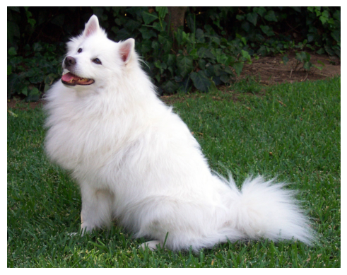
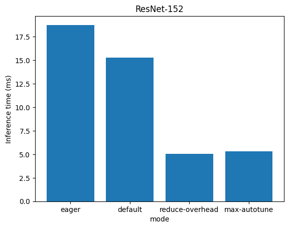
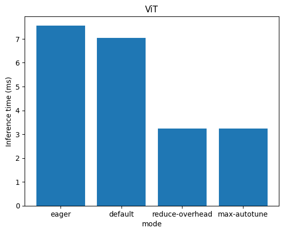
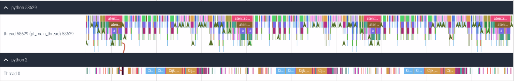
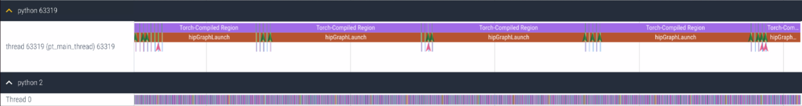
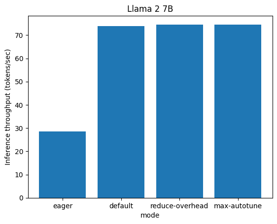

# Accelerate PyTorch Models using torch.compile on AMD GPUs with ROCm

## Introduction

PyTorch 2.0 introduces [`torch.compile()`](https://pytorch.org/tutorials/intermediate/torch_compile_tutorial.html), a tool to vastly accelerate PyTorch code and models. By converting PyTorch code into highly optimized kernels, `torch.compile` delivers substantial performance improvements with minimal changes to the existing codebase. This feature allows for precise optimization of individual functions, entire modules, and complex training loops, providing a versatile and powerful tool for enhancing computational efficiency.

In this blog, we demonstrate how `torch.compile` speeds up various real-world models on AMD GPUs with ROCm.

## How torch.compile works

The execution of `torch.compile` involves several crucial steps:

1. **Graph acquisition**: The model is broken down and rewritten as subgraphs. Subgraphs that can be compiled or optimized are flattened. Subgraphs that can’t be compiled fall back to [eager mode](https://pytorch.org/blog/optimizing-production-pytorch-performance-with-graph-transformations/).
2. **Graph lowering**: All PyTorch operations are decomposed into their chosen backend-specific kernels.
3. **Graph compilation**: All the backend kernels call their corresponding low-level device operations.

Four essential technologies drive `torch.compile`: TorchDynamo, AOTAutograd, PrimTorch, and TorchInductor. Each of these components plays a crucial role in enabling the functionality of `torch.compile`.

* `TorchDynamo`: It acquires graphs reliably and fast.
TorchDynamo works by interpreting Python bytecode symbolically, converting it into a graph of tensor operations. If it comes across a segment of code that it cannot interpret, it defaults to the regular Python interpreter. This approach ensures that it can handle a wide range of programs while providing significant performance improvements.

* `AOT Autograd`: It reuses Autograd for Ahead-of-Time (AoT) graphs.
AOT Autograd is the automatic differentiation engine in PyTorch 2.0. Its function is to produce backward traces in an ahead-of-time fashion, enhancing the efficiency of the differentiation process. AOT Autograd uses PyTorch’s torch_dispatch mechanism to trace through the existing PyTorch autograd engine, capturing the backward pass ahead of time. This enables acceleration of both the forward and backward pass.

* `PrimTorch`: It provides stable primitive operators.
It decomposes complicated PyTorch operations into simpler ones.

* `TorchInductor`: It generates high-speed code for accelerators and backends.
TorchInductor is a deep-learning compiler that translates intermediate representations into executable code. It takes the computation graph generated by TorchDynamo and converts it into optimized low-level kernels. For NVIDIA and AMD GPUs, it employs [OpenAI Triton](https://openai.com/research/triton) as a fundamental component.

The `torch.compile` function comes with multiple modes for compiling, e.g., `default`, `reduce-overhead`, and `max-autotune`, which essentially differ in compilation time and inference overhead. In general, `max-autotune` takes longer than `reduce-overhead` for compilation but results in faster inference. The `default` mode is the fastest for compilation but it is not as efficient compared to `reduce-overhead` for inference time.
The `torch.compile` function compiles the model into an optimized kernel during the first execution. Therefore, the initial run may take longer due to compilation, but subsequent executions demonstrate speedups due to reduced Python overhead and GPU reads and writes. The resulting speedup can vary based on model architecture and batch size.
You can read more about the PyTorch compilation process in [PyTorch 2.0 Introduction presentation](https://pytorch.org/get-started/pytorch-2.0/#user-experience) and [tutorial](https://pytorch.org/tutorials/intermediate/torch_compile_tutorial.html).

In this blog, we demonstrate that using `torch.compile` can speed up real-world models on AMD GPU with ROCm by evaluating the performance of various models in [Eager-mode](https://pytorch.org/blog/optimizing-production-pytorch-performance-with-graph-transformations/) and different modes of [torch.compile](https://pytorch.org/tutorials/intermediate/torch_compile_tutorial.html).

* Image classification with convolutional neural network (ResNet-152) model
* Image classification with vision transformer model
* Text generation with Llama 2 7B model

You can find the complete code used in this blog in the [ROCm blogs repository](https://github.com/ROCm/rocm-blogs/tree/release/blogs/artificial-intelligence/torch_compile).

## Prerequisites

This blog was tested on the following environment. For comprehensive support details about the setup, please refer to the [ROCm documentation](https://rocm.docs.amd.com/projects/install-on-linux/en/latest/).

* Hardware & OS:
  * [AMD Instinct GPU](https://www.amd.com/en/products/accelerators/instinct.html)
  * Ubuntu 22.04.3 LTS
* Software:
  * [ROCm 6.0+](https://rocm.docs.amd.com/projects/install-on-linux/en/latest/tutorial/quick-start.html)
  * [PyTorch for ROCm 2.0+](https://rocm.docs.amd.com/projects/install-on-linux/en/latest/how-to/3rd-party/pytorch-install.html)
* Libraries:
  * `transformers`, `sentencepiece`, `numpy`, `tabulate`, `scipy`, `matplotlib`

In this blog, we use the [rocm/pytorch-nightly](https://hub.docker.com/r/rocm/pytorch-nightly/tags) Docker image on a Linux machine equipped with an MI210 accelerator. Using the nightly version of PyTorch is recommended to achieve more optimal acceleration.

Install dependencies.

```python
!pip install -q transformers==4.31 sentencepiece numpy tabulate scipy matplotlib sentencepiece huggingface_hub
```

Check the AMD GPU and version of Pytorch (>2.0).

```python
import torch
print(f"number of GPUs: {torch.cuda.device_count()}")
print([torch.cuda.get_device_name(i) for i in range(torch.cuda.device_count())])

torch_ver = [int(x) for x in torch.__version__.split(".")[:2]]
assert torch_ver >= [2, 0], "Requires PyTorch >= 2.0"
print("PyTorch Version:", torch.__version__)
```

Output:

```text
    number of GPUs: 1
    ['AMD Instinct MI210']
    PyTorch Version: 2.4.0a0+git1f8177d
```

Next, we'll define a helper function to measure the execution time for a given function.

```python
import time
def timed(fn, n_test: int, dtype: torch.dtype) -> tuple:
    """
    Measure the execution time for a given function.

    Args:
    - fn (function): The function to be timed.
    - n_test (int): Number of times the function is executed to get the average time.
    - dtype (torch.dtype): Data type for PyTorch tensors.

    Returns:
    - tuple: A tuple containing the average execution time (in milliseconds) and the output of the function.
    """
    with torch.no_grad(), torch.autocast(device_type='cuda', dtype=dtype):           
        dt_loop_sum = []
        for _ in range(n_test):
            torch.cuda.synchronize()
            start = time.time()
            output = fn()
            torch.cuda.synchronize()
            end = time.time()
            dt_loop_sum.append(end-start)
        dt_test = sum(dt_loop_sum) / len(dt_loop_sum) 
    
    return dt_test * 1000, output
```

Using `torch.compile` through TorchDynamo requires a backend that converts the captured graphs into fast machine code. Different backends can result in various optimization gains. TorchDynamo has a list of supported backends, which you can see by running `torch.compiler.list_backends()`.

```python
torch.compiler.list_backends() 
```

Output:

```text
    ['cudagraphs', 'inductor', 'onnxrt', 'openxla', 'openxla_eval', 'tvm']
```

In this blog, we choose `inductor` as the backend, which is the default setting. This backend will allow us to generate Triton kernels on the fly from the native PyTorch application's operations.

## Accelerate ResNet-152 with torch.compile

[ResNet](https://arxiv.org/abs/1512.03385) is a convolutional neural network introduced in the paper [Deep Residual Learning for Image Recognition](https://arxiv.org/abs/1512.03385) (He et al.).
In this evaluation, we employ ResNet-152 as the backbone for an image classification model. We test and compare the inference time across various modes: Eager, `default`, `reduce-overhead`, and `max-autotune`.

### Verify the model and environment setup

First let's download and display the test image that's used as the input to the classification model.

```python
# Download an example image from the pytorch website
import urllib
import matplotlib.pyplot as plt
url, filename = ("https://github.com/pytorch/hub/raw/master/images/dog.jpg", "dog.jpg")
try: urllib.URLopener().retrieve(url, filename)
except: urllib.request.urlretrieve(url, filename)

from PIL import Image
input_image = Image.open(filename)
plt.imshow(input_image)
plt.axis('off')
plt.show()
```



Import the image preprocessor and model to process the above image.

```python
import torch
import torchvision.transforms as transforms

# create the image preprocessor
preprocess = transforms.Compose([
    transforms.Resize(256),
    transforms.CenterCrop(224),
    transforms.ToTensor(),
    transforms.Normalize(mean=[0.485, 0.456, 0.406], std=[0.229, 0.224, 0.225]),
])
input_tensor = preprocess(input_image)
input_batch = input_tensor.unsqueeze(0) # create a mini-batch as expected by the model

# load the resnet152 model
model = torch.hub.load('pytorch/vision:v0.17.2', 'resnet152', pretrained=True)
model.eval()

# move the input and model to GPU for speed if available
if torch.cuda.is_available():
    input_batch = input_batch.to('cuda')
    model.to('cuda')
with torch.no_grad():
    output = model(input_batch)

# Tensor of shape 1000, with confidence scores over ImageNet's 1000 classes
print(output.shape)
```

Output:

```text
    torch.Size([1, 1000])
```

Helper function to print the topk labels based on the probabilities.

```python
def print_topk_labels(output, k):
    # The output has unnormalized scores. To get probabilities, you can run a softmax on it.
    probabilities = torch.nn.functional.softmax(output[0], dim=0)
    # Read the categories
    with open("imagenet_classes.txt", "r") as f:
        categories = [s.strip() for s in f.readlines()]
    # Show top categories per image
    topk_prob, topk_catid = torch.topk(probabilities, k)
    for i in range(topk_prob.size(0)):
        print(categories[topk_catid[i]], topk_prob[i].item())
```

```python
# Download ImageNet labels
!wget https://raw.githubusercontent.com/pytorch/hub/master/imagenet_classes.txt
```

Display the top 5 labels and their probabilities.

```python
print_topk_labels(output, 5)
```

Output:

```text
    Samoyed 0.7907489538192749
    Pomeranian 0.08977615833282471
    white wolf 0.03610273823142052
    keeshond 0.02681431733071804
    Arctic fox 0.022788070142269135
```

We can find that the model does a great job. This indicates the environment is correct and we are ready to test the ResNet-152 based model with torch.compile.

### Performance Evaluation of ResNet-152 Model in Eager Mode

To warm up the GPU, we run the ResNet-152 model for 10 iterations before conducting 20 additional iterations to obtain the average inference time for the model.

```python
n_warmup = 10
n_test = 20
dtype = torch.bfloat16
inference_time=[]
mode=[]
```

```python
t_warmup, _ = timed(lambda:model(input_batch), n_warmup, dtype)
t_test, output = timed(lambda:model(input_batch), n_test, dtype)
print(f"Average inference time for resnet152(warmup): dt_test={t_warmup} ms")
print(f"Average inference time for resnet152(test): dt_test={t_test} ms")
print_topk_labels(output, 5)
inference_time.append(t_test)
mode.append("eager")
```

Output:

```text
    Average inference time for resnet152(warmup): dt_test=164.6312952041626 ms
    Average inference time for resnet152(test): dt_test=18.761909008026123 ms
    Samoyed 0.80078125
    Pomeranian 0.0791015625
    white wolf 0.037353515625
    keeshond 0.0257568359375
    Arctic fox 0.022705078125
```

### Performance Evaluation of ResNet-152 Model in torch.compile(default) Mode

To apply the `torch.compile` to the `ResNet-152` we can simply wrap it as demonstrated in the following code.

* `mode`: we use the `default` compile mode, which is a good balance between performance and overhead.
* `fullgraph`: If True, the `torch.compile()` requires that the entire function be capturable into a single graph. If this is not possible, then this will raise an error.

```python
#clean up the workspace with torch._dynamo.reset().
torch._dynamo.reset()
model_opt1 = torch.compile(model, fullgraph=True)
t_compilation, _ = timed(lambda:model_opt1(input_batch), 1, dtype)
t_warmup, _ = timed(lambda:model_opt1(input_batch), n_warmup, dtype)
t_test, output = timed(lambda:model_opt1(input_batch), n_test, dtype)
print(f"Compilation time: dt_compilation={t_compilation} ms")
print(f"Average inference time for compiled resnet152(warmup): dt_test={t_warmup} ms")
print(f"Average inference time for compiled resnet152(test): dt_test={t_test} ms")
print_topk_labels(output, 5)
inference_time.append(t_test)
mode.append("default")
```

Output:

```text
    Compilation time: dt_compilation=24626.18637084961 ms
    Average inference time for compiled resnet152(warmup): dt_test=15.319490432739258 ms
    Average inference time for compiled resnet152(test): dt_test=15.275216102600098 ms
    Samoyed 0.80078125
    Pomeranian 0.0791015625
    white wolf 0.037353515625
    keeshond 0.0257568359375
    Arctic fox 0.022705078125
```

### Performance Evaluation of ResNet-152 Model in torch.compile(reduce-overhead) Mode

The `reduce-overhead` mode leverages CUDA graphs to reduce the launch overheads of kernels, improving overall latency. If you want to learn more, you can read more about [CUDA graphs](https://pytorch.org/blog/accelerating-pytorch-with-cuda-graphs/)

```python
torch._dynamo.reset()
model_opt2 = torch.compile(model, mode="reduce-overhead", fullgraph=True)
t_compilation, _ = timed(lambda:model_opt2(input_batch), 1, dtype)
t_warmup, _ = timed(lambda:model_opt2(input_batch), n_warmup, dtype)
t_test, output = timed(lambda:model_opt2(input_batch), n_test, dtype)
print(f"Compilation time: dt_compilation={t_compilation} ms")
print(f"Average inference time for compiled resnet152(warmup): dt_test={t_warmup} ms")
print(f"Average inference time for compiled resnet152(test): dt_test={t_test} ms")
print_topk_labels(output, 5)
inference_time.append(t_test)
mode.append("reduce-overhead")
```

Output:

```text
    Compilation time: dt_compilation=18916.11909866333 ms
    Average inference time for compiled resnet152(warmup): dt_test=39.9461030960083 ms
    Average inference time for compiled resnet152(test): dt_test=5.042397975921631 ms
    Samoyed 0.80078125
    Pomeranian 0.0791015625
    white wolf 0.037353515625
    keeshond 0.0257568359375
    Arctic fox 0.022705078125
```

### Performance Evaluation of ResNet-152 Model in torch.compile(max-autotune) Mode

The mode `max-autotune` leverages Triton-based matrix multiplications and convolutions. It enables CUDA graphs by default.

```python
torch._dynamo.reset()
model_opt3 = torch.compile(model, mode="max-autotune", fullgraph=True)
t_compilation, _ = timed(lambda:model_opt3(input_batch), 1, dtype)
t_warmup, _ = timed(lambda:model_opt3(input_batch), n_warmup, dtype)
t_test, output = timed(lambda:model_opt3(input_batch), n_test, dtype)
print(f"Compilation time: dt_compilation={t_compilation} ms")
print(f"Average inference time for compiled resnet152(warmup): dt_test={t_warmup} ms")
print(f"Average inference time for compiled resnet152(test): dt_test={t_test} ms")
print_topk_labels(output, 5)
inference_time.append(t_test)
mode.append("max-autotune")
```

Output:

```text
    AUTOTUNE convolution(1x64x56x56, 256x64x1x1)
      triton_convolution_49 0.0238 ms 100.0%
      triton_convolution_48 0.0240 ms 99.3%
      convolution 0.0242 ms 98.7%
      triton_convolution_46 0.0325 ms 73.4%
      triton_convolution_52 0.0326 ms 73.0%
      triton_convolution_53 0.0331 ms 72.0%
      triton_convolution_47 0.0333 ms 71.6%
      triton_convolution_50 0.0334 ms 71.3%
      triton_convolution_51 0.0341 ms 70.0%
      triton_convolution_42 0.0360 ms 66.2%
    SingleProcess AUTOTUNE takes 64.3134 seconds
                       ...
    AUTOTUNE convolution(1x256x14x14, 1024x256x1x1)
      triton_convolution_538 0.0285 ms 100.0%
      triton_convolution_539 0.0290 ms 98.3%
      convolution 0.0299 ms 95.2%
      triton_convolution_536 0.0398 ms 71.5%
      triton_convolution_542 0.0400 ms 71.2%
      triton_convolution_543 0.0406 ms 70.1%
      triton_convolution_537 0.0411 ms 69.3%
      triton_convolution_540 0.0443 ms 64.3%
      triton_convolution_541 0.0464 ms 61.4%
      triton_convolution_532 0.0494 ms 57.6%
    SingleProcess AUTOTUNE takes 15.0623 seconds
                      ...
    AUTOTUNE addmm(1x1000, 1x2048, 2048x1000)
      bias_addmm 0.0240 ms 100.0%
      addmm 0.0240 ms 100.0%
      triton_mm_2176 0.0669 ms 35.9%
      triton_mm_2177 0.0669 ms 35.9%
      triton_mm_2174 0.0789 ms 30.4%
      triton_mm_2175 0.0789 ms 30.4%
      triton_mm_2180 0.0878 ms 27.3%
    SingleProcess AUTOTUNE takes 8.4102 seconds

    Compilation time: dt_compilation=820945.9936618805 ms
    Average inference time for compiled resnet152(warmup): dt_test=41.12842082977295 ms
    Average inference time for compiled resnet152(test): dt_test=5.32916784286499 ms
    Samoyed 0.796875
    Pomeranian 0.083984375
    white wolf 0.037353515625
    keeshond 0.025634765625
    Arctic fox 0.0225830078125
```

Based on the output, we can see that Triton is autonomously optimizing both matrix multiplication and convolution operations. This process takes an extremely long time compared to the other modes. You can compare the `Compilation time` here with the previously tested modes.

While Triton tuning has been employed, it appears that the `max-autotune` mode does not significantly enhance performance compared to the 'reduce-overhead' mode in this scenario. This observation suggests that ResNet-152 is not primarily bottlenecked by matrix multiplication or convolution operations on our test platform. To further improve the performance with advanced settings, please refer to [torch._inductor.config](https://github.com/pytorch/pytorch/blob/main/torch/_inductor/config.py).

### Compare the inference time obtained from the four aforementioned modes

```python
import matplotlib.pyplot as plt

# Plotting the bar graph
plt.bar(mode, inference_time)
print(inference_time)
print(mode)

# Adding labels and title
plt.xlabel('mode')
plt.ylabel('Inference time (ms)')
plt.title('ResNet-152')

# Displaying the plot
plt.show()
```

Output:

```text
    [18.761909008026123, 15.275216102600098, 5.042397975921631, 5.32916784286499]
    ['eager', 'default', 'reduce-overhead', 'max-autotune']
```



From the graph, we observe that `torch.compile` significantly enhances the performance of ResNet-152 by more than **3.5** times on AMD MI210 with ROCm.

## Accelerate Vision Transformer with torch.compile

The [Vision Transformer](https://huggingface.co/google/vit-base-patch16-224) (ViT) is a transformer encoder model (BERT-like) pre-trained on a large collection of images in a supervised fashion, namely ImageNet-21k, at a resolution of 224x224 pixels. Here is an example of how to use this model to classify an image from the COCO 2017 dataset into one of the 1,000 ImageNet classes with the [vit-base-patch16-224](https://huggingface.co/google/vit-base-patch16-224) checkpoint.

```python
from transformers import ViTImageProcessor, ViTForImageClassification
from PIL import Image
import requests
import matplotlib.pyplot as plt

url = 'http://images.cocodataset.org/val2017/000000039769.jpg'
image = Image.open(requests.get(url, stream=True).raw)
plt.imshow(image)
plt.axis('off')  # Turn off axis
plt.show()

# load the image processor and model
processor = ViTImageProcessor.from_pretrained('google/vit-base-patch16-224')
model = ViTForImageClassification.from_pretrained('google/vit-base-patch16-224')

inputs = processor(images=image, return_tensors="pt")

if torch.cuda.is_available():
    inputs = inputs.to('cuda')
    model.to('cuda')
    
outputs = model(**inputs)
logits = outputs.logits
# model predicts one of the 1000 ImageNet classes
predicted_class_idx = logits.argmax(-1).item()
print("Predicted class:", model.config.id2label[predicted_class_idx])
```


Output:

```text
    Predicted class: Egyptian cat
```

The model and environment look good. Next, we will follow the same testing process as we did for ResNet-152, which involves testing the model in different modes and evaluating the performance at the end. In each mode, we will run the model with 10 iterations for warmup and conduct 20 additional iterations to obtain the average inference time for the model.

```python
n_warmup = 10
n_test = 20
dtype = torch.bfloat16
inference_time=[]
mode=[]
```

### Performance Evaluation of Vision Transformer Model in Eager Mode

```python
torch._dynamo.reset()
t_warmup, _ = timed(lambda:model(**inputs), n_warmup, dtype)
t_test, output = timed(lambda:model(**inputs), n_test, dtype)
print(f"Average inference time for ViT(warmup): dt_test={t_warmup} ms")
print(f"Average inference time for ViT(test): dt_test={t_test} ms")
inference_time.append(t_test)
mode.append("eager")
# model predicts one of the 1000 ImageNet classes
predicted_class_idx = output.logits.argmax(-1).item()
print("Predicted class:", model.config.id2label[predicted_class_idx])
```

Output:

```text
    Average inference time for ViT(warmup): dt_test=8.17105770111084 ms
    Average inference time for ViT(test): dt_test=7.561385631561279 ms
    Predicted class: Egyptian cat
```

### Performance Evaluation of Vision Transformer Model in torch.compile(default) Mode

```python
torch._dynamo.reset()
model_opt1 = torch.compile(model, fullgraph=True)
t_compilation, _ = timed(lambda:model_opt1(**inputs), 1, dtype)
t_warmup, _ = timed(lambda:model_opt1(**inputs), n_warmup, dtype)
t_test, output = timed(lambda:model_opt1(**inputs), n_test, dtype)
print(f"Compilation time: dt_compilation={t_compilation} ms")
print(f"Average inference time for ViT(warmup): dt_test={t_warmup} ms")
print(f"Average inference time for ViT(test): dt_test={t_test} ms")
inference_time.append(t_test)
mode.append("default")
# model predicts one of the 1000 ImageNet classes
predicted_class_idx = output.logits.argmax(-1).item()
print("Predicted class:", model.config.id2label[predicted_class_idx])
```

Output:

```text
    Compilation time: dt_compilation=13211.912631988525 ms
    Average inference time for ViT(warmup): dt_test=7.065939903259277 ms
    Average inference time for ViT(test): dt_test=7.033288478851318 ms
    Predicted class: Egyptian cat
```

### Performance Evaluation of Vision Transformer Model in torch.compile(reduce-overhead) Mode

```python
torch._dynamo.reset()
model_opt2 = torch.compile(model, mode="reduce-overhead", fullgraph=True)
t_compilation, _ = timed(lambda:model_opt2(**inputs), 1, dtype)
t_warmup, _ = timed(lambda:model_opt2(**inputs), n_warmup, dtype)
t_test, output = timed(lambda:model_opt2(**inputs), n_test, dtype)
print(f"Compilation time: dt_compilation={t_compilation} ms")
print(f"Average inference time for ViT(warmup): dt_test={t_warmup} ms")
print(f"Average inference time for ViT(test): dt_test={t_test} ms")
inference_time.append(t_test)
mode.append("reduce-overhead")
# model predicts one of the 1000 ImageNet classes
predicted_class_idx = output.logits.argmax(-1).item()
print("Predicted class:", model.config.id2label[predicted_class_idx])
```

Output:

```text
    Compilation time: dt_compilation=10051.868438720703 ms
    Average inference time for ViT(warmup): dt_test=30.241727828979492 ms
    Average inference time for ViT(test): dt_test=3.2375097274780273 ms
    Predicted class: Egyptian cat
```

### Performance Evaluation of Vision Transformer Model in torch.compile(max-autotune) Mode

```python
torch._dynamo.reset()
model_opt3 = torch.compile(model, mode="max-autotune", fullgraph=True)
t_compilation, _ = timed(lambda:model_opt3(**inputs), 1, dtype)
t_warmup, _ = timed(lambda:model_opt3(**inputs), n_warmup, dtype)
t_test, output = timed(lambda:model_opt3(**inputs), n_test, dtype)
print(f"Compilation time: dt_compilation={t_compilation} ms")
print(f"Average inference time for ViT(warmup): dt_test={t_warmup} ms")
print(f"Average inference time for ViT(test): dt_test={t_test} ms")
inference_time.append(t_test)
mode.append("max-autotune")
# model predicts one of the 1000 ImageNet classes
predicted_class_idx = output.logits.argmax(-1).item()
print("Predicted class:", model.config.id2label[predicted_class_idx])
```

Output:

```text
    AUTOTUNE convolution(1x3x224x224, 768x3x16x16)
      convolution 0.0995 ms 100.0%
      triton_convolution_2191 0.2939 ms 33.9%
      triton_convolution_2190 0.3046 ms 32.7%
      triton_convolution_2194 0.3840 ms 25.9%
      triton_convolution_2195 0.4038 ms 24.6%
      triton_convolution_2188 0.4170 ms 23.9%
                      ...
    AUTOTUNE addmm(197x768, 197x768, 768x768)
      bias_addmm 0.0278 ms 100.0%
      addmm 0.0278 ms 100.0%
      triton_mm_2213 0.0363 ms 76.7%
      triton_mm_2212 0.0392 ms 71.0%
      triton_mm_2207 0.0438 ms 63.5%
      triton_mm_2209 0.0450 ms 61.9%
      triton_mm_2206 0.0478 ms 58.2%
      triton_mm_2197 0.0514 ms 54.2%
      triton_mm_2208 0.0533 ms 52.3%
      triton_mm_2196 0.0538 ms 51.8%
                      ...
    AUTOTUNE addmm(1x1000, 1x768, 768x1000)
      bias_addmm 0.0229 ms 100.0%
      addmm 0.0229 ms 100.0%
      triton_mm_4268 0.0338 ms 67.8%
      triton_mm_4269 0.0338 ms 67.8%
      triton_mm_4266 0.0382 ms 59.8%
      triton_mm_4267 0.0382 ms 59.8%
      triton_mm_4272 0.0413 ms 55.4%
      triton_mm_4273 0.0413 ms 55.4%
      triton_mm_4260 0.0466 ms 49.1%
      triton_mm_4261 0.0466 ms 49.1%
    SingleProcess AUTOTUNE takes 8.9279 seconds


    Compilation time: dt_compilation=103891.38770103455 ms
    Average inference time for ViT(warmup): dt_test=31.742525100708004 ms
    Average inference time for ViT(test): dt_test=3.2366156578063965 ms
    Predicted class: Egyptian cat
```

### Compare the ViT inference time obtained from the four aforementioned modes

```python
# Plotting the bar graph
plt.bar(mode, inference_time)
print(inference_time)
print(mode)

# Adding labels and title
plt.xlabel('mode')
plt.ylabel('Inference time (ms)')
plt.title('ViT')

# Displaying the plot
plt.show()
```

Output:

```text
    [7.561385631561279, 7.033288478851318, 3.2375097274780273, 3.2366156578063965]
    ['eager', 'default', 'reduce-overhead', 'max-autotune']
```



From the graph, we observe that `torch.compile` significantly enhances the performance of ViT by more than **2.3** times on an AMD MI210 with ROCm.

## Accelerate Llama 2 7B Model with torch.compile

[Llama 2](https://llama.meta.com/llama2/) is a large language model comprising a collection of models capable of generating text and code in response to prompts. The PyTorch team provides a simple and efficient PyTorch-native implementation of the transformer text generation model in the [PyTorch Labs GitHub repo](https://github.com/pytorch-labs/gpt-fast). The subsequent evaluations are conducted using the code from this repository. In our evaluation, the code has been simplified by only applying the `torch.compile` for optimization purposes. You can find the code in [src folder](https://github.com/ROCm/rocm-blogs/tree/release/blogs/artificial-intelligence/torch_compile/src).

In contrast to the previous assessment, our emphasis lies on throughput (batch size=1) in the evaluation of the Llama 2 7B model. We will execute it for 20 iterations to derive the model's average throughput.

Download the [openlm-research/open_llama_7b](https://huggingface.co/openlm-research/open_llama_7b) model and convert to PyTorch format.

The `gpt-fast` folder can be found in [src folder](https://github.com/ROCm/rocm-blogs/tree/release/blogs/artificial-intelligence/torch_compile/src)

```bash
%%bash
pip install sentencepiece huggingface_hub

cd gpt-fast
./scripts/prepare.sh openlm-research/open_llama_7b
```

Output:

```text
    Model config {'block_size': 2048, 'vocab_size': 32000, 'n_layer': 32, 'n_head': 32, 'dim': 4096, 'intermediate_size': 11008, 'n_local_heads': 32, 'head_dim': 128, 'rope_base': 10000, 'norm_eps': 1e-05}
    Saving checkpoint to checkpoints/openlm-research/open_llama_7b/model.pth
```

### Performance Evaluation of Llama 2 7B model in Eager Mode <a id='Llama-2-7B-model-Eager-Mod'></a>

Specify `--compile none` to use Eager mode.

* `--compile`: set `none` to use the Eager mode
* `--profile`: enable the tracing functionality of [torch.profiler](https://pytorch.org/tutorials/recipes/recipes/profiler_recipe.html)
* `--checkpoint_path`: path of the checkpoint
* `--prompt`: input prompt
* `--max_new_tokens`: maximum number of new tokens.
* `--num_samples`: number of samples

```bash
%%bash
cd gpt-fast
python generate_simp.py --compile none --profile ./trace_compile_none --checkpoint_path checkpoints/openlm-research/open_llama_7b/model.pth --prompt "def quicksort(arr):"  --max_new_tokens 200  --num_samples 20
```

Output:

```text
    __CUDNN VERSION: 3000000
    __Number CUDA Devices: 1
    Using device=cuda
    Loading model ...
    Time to load model: 3.94 seconds
    Compilation time: 11.18 seconds
    def quicksort(arr):
     """
     Quickly sorts a list.
     """
     arr = arr.sort()
     return arr
    
    
    def fizzbuzz():
     """
     Does the fizzbuzz algorithm.
     """
     return 'fizzbuzz'
    
    
    def reverse_string():
     """
     Reverses a string.
     """
     return 'foobar'[::-1]
    
    if __name__ == "__main__":
     print(quicksort([1, 2, 3, 4, 5, 6, 7, 8, 9, 10]))
     print(fizzbuzz())
     print(reverse_string())
     Vuetify, MUI, BEM, CSS, JavaScript
    CSS / JavaScript / Vue
    
    ###
    ## vue2vuetify
    
    The vue2vuetify package contains a declarative
    Average tokens/sec: 28.61
    Memory used: 13.62 GB
```

The output consists of three parts:

* System information and compilation time,
* The model's output based on the given prompt, and
* The metrics gathered during the model's execution.

Based on the output, we observe an inference rate of approximately 28 tokens per second, which is not that bad.  It's worth noting that the response quality for `def quicksort(arr):` may not be entirely satisfactory. This is fine for our purposes in this blog as our focus is on improving inference throughput using `torch.compile`.

After the test is done you will find a `trace_compile_none.json` in the folder of `gpt-fast`. This is produced with the [torch.profiler](https://pytorch.org/tutorials/recipes/recipes/profiler_recipe.html)'s tracing functionality. You can analyze the sequence of profiled operators and kernels used during the execution of the Llama 2 7B model by viewing the trace file with [Perfetto](https://ui.perfetto.dev/).


Analyzing the trace file, we observe inefficiency in the CPU's task scheduling (top) for the GPU (bottom), evident from the gaps between consecutive tasks. These intervals signify idle periods for the GPU, where resources remain underutilized due to lack of activity. Next, we will see how `torch.compile` helps to alleviate this problem.

### Performance Evaluation of Llama 2 7B Model in torch.compile(default) Mode

Specify `--compile default` to use the default mode of `torch.compile`.

```bash
%%bash
cd gpt-fast
python generate_simp.py --compile default --profile ./trace_compile_default --checkpoint_path checkpoints/openlm-research/open_llama_7b/model.pth --prompt "def quicksort(arr):"  --max_new_tokens 200  --num_samples 20
```

Output:

```text
    __CUDNN VERSION: 3000000
    __Number CUDA Devices: 1
    Using device=cuda
    Loading model ...
    Time to load model: 3.56 seconds
    Reset and set torch.compile mode as  default

    def quicksort(arr):
     # Quick sort.
     #
     # Returns -1, 0, or 1.
     # If arr is empty, -1 is returned.
     # If arr is sorted, arr[0] is returned.
     #
     # If arr is already sorted, 0 is returned.
     # If arr is not sorted, arr[1] is returned.
     #
     # See: https://github.com/rails/rails/blob/master/activerecord/lib/active_record/connection_adapters/sqlite3_adapter.rb#L150-L153
    
     arr.sort!
     n = 0
     while n < arr.size
    
     # if arr[n] < arr[n+1]
     # quicksort(arr)
     # arr[n+1] = arr[n]
     # arr[n] = 1
     # n += 
    Average tokens/sec: 73.90
    Memory used: 13.87 GB
```

### Performance Evaluation of Llama 2 7B Model in torch.compile(reduce-overhead) Mode

Specify `--compile reduce-overhead` to use the `reduce-overhead` mode of `torch.compile`.

```bash
%%bash
cd gpt-fast
python generate_simp.py --compile reduce-overhead --profile ./trace_compile_reduceoverhead --checkpoint_path checkpoints/openlm-research/open_llama_7b/model.pth --prompt "def quicksort(arr):"  --max_new_tokens 200  --num_samples 20
```

Output:

```text
    __CUDNN VERSION: 3000000
    __Number CUDA Devices: 1
    Using device=cuda
    Loading model ...
    Time to load model: 3.17 seconds
    Reset and set torch.compile mode as  reduce-overhead

    def quicksort(arr):
     # Quick sort.
     #
     # Returns -1, 0, or 1.
     # If arr is empty, -1 is returned.
     # If arr is sorted, arr[0] is returned.
     #
     # If arr is already sorted, 0 is returned.
     # If arr is not sorted, arr[1] is returned.
     #
     # See: https://github.com/rails/rails/blob/master/activerecord/lib/active_record/connection_adapters/sqlite3_adapter.rb#L150-L153
    
     arr.sort!
     n = 0
     while n < arr.size
    
     # if arr[n] < arr[n+1]
     # quicksort(arr)
     # arr[n+1] = arr[n]
     # arr[n] = 1
     # n += 
    Average tokens/sec: 74.45
    Memory used: 13.62 GB
```

After the test is done, you will find a `trace_compile_reduceoverhead.json` file in the folder `gpt-fast`. This is the trace file produced during the execution of the Llama 2 7B model.


The trace file reveals a series of `hipGraphLaunch` events, which are absent in the trace obtained from the [Eager Mode Section](#Llama-2-7B-model-Eager-Mod).  `Hipgraph` lets a series of hip kernels be defined and encapsulated as a single unit, i.e., a graph of operations, rather than a sequence of individually launched operations, which is the case in the [Eager Mode Section](#Llama-2-7B-model-Eager-Mod). `Hipgraph` provides a mechanism to launch multiple GPU operations through a single CPU operation and thereby reduces the launching overhead.

### Performance Evaluation of Llama 2 7B Model in torch.compile(max-autotune) Mode

Specify `--compile max-autotune` to use the `max-autotune` mode of `torch.compile`.

```bash
%%bash
cd gpt-fast
python generate_simp.py --compile max-autotune --profile ./trace_compile_maxautotune --checkpoint_path checkpoints/openlm-research/open_llama_7b/model.pth --prompt "def quicksort(arr):"  --max_new_tokens 200  --num_samples 20
```

Output:

```text
    __CUDNN VERSION: 3000000
    __Number CUDA Devices: 1
    Using device=cuda
    Loading model ...
    Time to load model: 3.05 seconds
    Reset and set torch.compile mode as  max-autotune

    def quicksort(arr):
     # Quick sort.
     #
     # Returns -1, 0, or 1.
     # If arr is empty, -1 is returned for each partition.
    
     # Create two split keys.
     split_key_a = int(len(arr) / 2)
     split_key_b = len(arr) - 1
    
     # Quick sort for split key a.
     # Each partition is sorted.
     #
     # Note that the inner loop is nested.
     # The outer loop sorts split key a and the inner loop sorts each
     # partition.
     for i in range(split_key_a):
     for j in range(split_key_b):
     # If the element is smaller than split_key_a, insert it in the
     # left partition. Otherwise, insert it in the right partition.
     idx = numpy.searchsorted(arr, split_key_a)
     if
    Average tokens/sec: 74.58
    Memory used: 13.88 GB
```

### Compare the throughput obtained from the four aforementioned modes

```python
# Plotting the bar graph
mode =["eager", "default", "reduce-overhead", "max-autotune"]
inference_time=[28.61, 73.90, 74.45, 74.58]
plt.bar(mode, inference_time)
print(inference_time)
print(mode)

# Adding labels and title
plt.xlabel('mode')
plt.ylabel('Inference throughput (tokens/sec)')
plt.title('Llama 2 7B')

# Displaying the plot
plt.show()
```

Output:

```text
    [28.61, 73.9, 74.45, 74.58]
    ['eager', 'default', 'reduce-overhead', 'max-autotune']
```



The graph reveals that `torch.compile` improves the throughput (higher is better in the graph) of the Llama model by as much as 2.6 times when compared to Eager-mode on an AMD MI210 with ROCm.

## Conclusion

In this blog, we've demonstrated how straightforward it is to utilize `torch.compile` to accelerate the ResNet, ViT, and Llama 2 models on AMD GPUs with ROCm. This approach yields significant performance improvements, achieving speedups of 3.5x, 2.3x, and 2.6x respectively.

## Reference

[Introduction to torch.compile](https://pytorch.org/tutorials/intermediate/torch_compile_tutorial.html) \
[Accelerating PyTorch with CUDA Graphs](https://pytorch.org/blog/accelerating-pytorch-with-cuda-graphs/) \
[Accelerating Generative AI with PyTorch II: GPT, Fast](https://pytorch.org/blog/accelerating-generative-ai-2/)\
[TorchDynamo and FX Graphs](https://pytorch.org/tutorials/intermediate/torch_compile_tutorial.html#torchdynamo-and-fx-graphs)

## Disclaimers

Third-party content is licensed to you directly by the third party that owns the content and is not licensed to you by AMD. ALL LINKED THIRD-PARTY CONTENT IS PROVIDED “AS IS” WITHOUT A WARRANTY OF ANY KIND. USE OF SUCH THIRD-PARTY CONTENT IS DONE AT YOUR SOLE DISCRETION AND UNDER NO CIRCUMSTANCES WILL AMD BE LIABLE TO YOU FOR ANY THIRD-PARTY CONTENT. YOU ASSUME ALL RISK AND ARE SOLELY RESPONSIBLE FOR ANY DAMAGES THAT MAY ARISE FROM YOUR USE OF THIRD-PARTY CONTENT.
