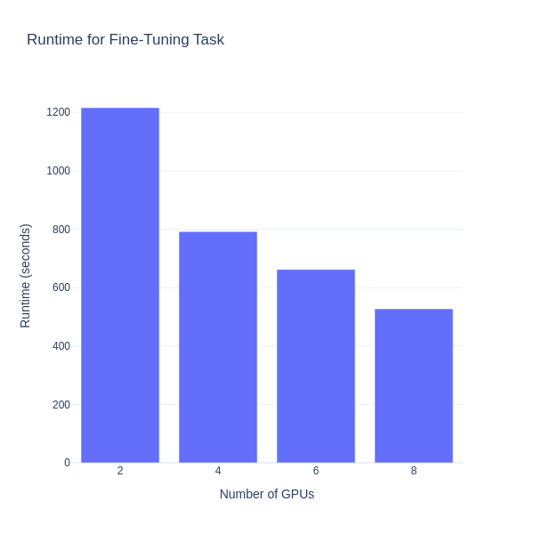

# Torchtune on AMD GPUs How-To Guide: Fine-tuning and Scaling LLMs with Multi-GPU Power

This blog provides a thorough how-to guide on using Torchtune to fine-tune and scale large language models (LLMs) with AMD GPUs. [Torchtune](https://github.com/pytorch/torchtune) is a PyTorch library designed to let you easily fine-tune and experiment with LLMs. Using Torchtune’s flexibility and scalability, we show you how to fine-tune the [Llama-3.1-8B](https://arxiv.org/pdf/2407.21783) model for summarization tasks using the [EdinburghNLP/xsum](https://huggingface.co/datasets/EdinburghNLP/xsum) dataset. Using [LoRA(Low-Rank Adaptation)](https://arxiv.org/pdf/2106.09685), a parameter-efficient fine-tuning technique, Torchtune enables efficient training while maintaining performance across a different number of GPUs (2, 4, 6, and 8). This post also highlights how Torchtune’s distributed training capabilities allow users to scale up LLM fine-tuning on multiple GPUs to reduce training time while maintaining the quality of the trained model, demonstrating its potential and usage on modern AMD hardware using ROCm.

For the files related to this blog post, see this
[GitHub folder](https://github.com/ROCm/rocm-blogs/tree/release/blogs/artificial-intelligence/torchtune).

## Requirements

* AMD GPU: See the [ROCm documentation page](https://rocm.docs.amd.com/projects/install-on-linux/en/latest/reference/system-requirements.html) for supported hardware and operating systems.

* ROCm: See the [ROCm installation for Linux](https://rocm.docs.amd.com/projects/install-on-linux/en/latest/index.html) page for installation instructions.

* Docker: See [Install Docker Engine on Ubuntu](https://docs.docker.com/engine/install/ubuntu/#install-using-the-repository) for installation instructions.

* PyTorch 2.4 and Torchtune: We have created a custom service using Docker Compose that runs and serves Torchtune models. For details on Torchtune service creation, see the respective `./torchtune/docker/docker-compose.yaml` and `./torchtune/docker/Dockerfile` files.

* Hugging Face Access Token: This blog requires a [Hugging Face](https://huggingface.co/) account with a newly generated [User Access Token](https://huggingface.co/docs/hub/security-tokens).

* Access to the `Llama-3.1-8B` model on Hugging Face. `Llama-3.1` family models are [gated models](https://huggingface.co/docs/hub/models-gated) on Hugging Face. To request access, see: [meta-llama/Meta-Llama-3.1-8B](https://huggingface.co/meta-llama/Meta-Llama-3.1-8B).

## Following along with this blog

* Clone the repo and `cd` into the blog directory:

    ```shell
    git clone https://github.com/ROCm/rocm-blogs.git
    cd rocm-blogs/blogs/artificial-intelligence/torchtune
    ```

* Build and start the container. For details on the build process, see the `./torchtune/docker/Dockerfile`.

    ```shell
    cd docker
    docker compose build
    docker compose up
    ```
  
* Open http://localhost:8888/lab/tree/src/torchtune.ipynb and load the `torchtune.ipynb` notebook.

Follow along with this blog using the `torchtune.ipynb` notebook.

## Background: LoRA, Torchtune and EdinburghNLP/Xsum

In this blog, we fine-tune the specific Meta-Llama-3.1-8B-Instruct version of the Llama-3.1 model variant for the task of abstractive summarization (summarizing by rephrasing and condensing main ideas instead of extracting sentences verbatim) using Torchtune. Llama-3.1, being a large language model designed for general-purpose text generation, is well-suited for abstractive summarization. To enhance the efficiency of the fine-tuning process, we will use LoRA (Low Rank Adaptation), which is especially effective in scenarios with limited computational resources. To provide background for this blog let’s start by briefly discussing LoRA, Torchtune, and the EdinburghNLP/Xsum dataset which we will use later when fine-tuning the Llama-3.1-8B LLM.

### LoRA: Low-Rank Adaptation of large language models

[LoRA (Low-Rank Adaptation)](https://arxiv.org/pdf/2106.09685) is a technique frequently used to fine-tune large pre-trained models. The core idea of LoRA is to reduce the number of parameters that need to be updated during fine-tuning by introducing low-rank matrices into the architecture of a model. Instead of updating all the parameters of a large model, LoRA inserts trainable, low-rank matrices that approximate the changes required for fine-tuning. This reduces the computational cost and memory usage compared to regular fine-tuning because only a small fraction of the model's parameters are adjusted. LoRA is particularly useful in scenarios where computational resources are limited or when retraining is not practical due to time constraints, when fast adaptation to new tasks is required. For more information about LoRA, see the article [LoRA: Low-Rank Adaptation of Large Language Models](https://arxiv.org/pdf/2106.09685) and the blogs [Using LoRA for efficient fine-tuning: Fundamental principles](https://rocm.blogs.amd.com/artificial-intelligence/lora-fundamentals/README.html) and [Fine-tune Llama 2 with LoRA: Customizing a large language model for question-answering](https://rocm.blogs.amd.com/artificial-intelligence/llama2-lora/README.html).

While LoRA optimizes resource usage during fine-tuning, Torchtune helps in streamlining the entire fine-tuning workflow, ensuring an efficient and scalable model training.

### Torchtune concepts: configs and recipes

Torchtune is a PyTorch library designed for fine-tuning and experimenting with large language models (LLMs). It offers modular, native PyTorch implementations of popular LLMs, various training recipes for different fine-tuning techniques, and integration with Hugging Face datasets for training. Additionally, it supports distributed training using Fully Sharded Data Parallel (FSDP) and provides YAML configurations for easy setup of training runs, among other features.

The main concepts behind Torchtune are `configs` and `recipes`:

* `configs`: These are YAML files that let users configure training settings such as the dataset, model, checkpoints, and hyperparameters without needing to modify the code.

* `recipes`: These are similar to end-to-end pipelines for training and optionally evaluating large language models. Each recipe implements a specific training method and includes a set of features tailored to a particular model family.

Torchtune provides access to a command-line interface (CLI). Torchtune CLI is designed to simplify the fine-tuning of LLMs. It provides a way to interact with the Torchtune library, allowing users to download models, manage configurations, and execute training recipes directly from the command line. Its key features let users easily list and copy pre-build fine-tuning recipes, run training jobs with custom configurations, and validate configuration files for proper formatting.

Let's use Torchtune CLI to view all the available built-in recipes. Use the `tune ls` command to print out all recipes and corresponding configs.

```bash
! tune ls
```

```text
RECIPE                                   CONFIG                                  
full_finetune_single_device              llama2/7B_full_low_memory               
                                         code_llama2/7B_full_low_memory          
                                         llama3/8B_full_single_device            
                                         llama3_1/8B_full_single_device          
                                         mistral/7B_full_low_memory              
                                         phi3/mini_full_low_memory               
full_finetune_distributed                llama2/7B_full                          
                                         llama2/13B_full                         
                                         llama3/8B_full                          
                                         llama3_1/8B_full                        
                                         llama3/70B_full                         
                                         llama3_1/70B_full                       
                                         mistral/7B_full                         
                                         gemma/2B_full                           
                                         gemma/7B_full                           
                                         phi3/mini_full                          
lora_finetune_single_device              llama2/7B_lora_single_device            
                                         llama2/7B_qlora_single_device           
                                         code_llama2/7B_lora_single_device       
                                         code_llama2/7B_qlora_single_device      
                                         llama3/8B_lora_single_device            
                                         llama3_1/8B_lora_single_device          
                                         llama3/8B_qlora_single_device           
                                         llama3_1/8B_qlora_single_device         
                                         llama2/13B_qlora_single_device          
                                         mistral/7B_lora_single_device           
                                         mistral/7B_qlora_single_device          
                                         gemma/2B_lora_single_device             
                                         gemma/2B_qlora_single_device            
                                         gemma/7B_lora_single_device             
                                         gemma/7B_qlora_single_device            
                                         phi3/mini_lora_single_device            
                                         phi3/mini_qlora_single_device           
lora_dpo_single_device                   llama2/7B_lora_dpo_single_device        
lora_dpo_distributed                     llama2/7B_lora_dpo                      
lora_finetune_distributed                llama2/7B_lora                          
                                         llama2/13B_lora                         
                                         llama2/70B_lora                         
                                         llama3/70B_lora                         
                                         llama3_1/70B_lora                       
                                         llama3/8B_lora                          
                                         llama3_1/8B_lora                        
                                         mistral/7B_lora                         
                                         gemma/2B_lora                           
                                         gemma/7B_lora                           
                                         phi3/mini_lora                          
lora_finetune_fsdp2                      llama2/7B_lora                          
                                         llama2/13B_lora                         
                                         llama2/70B_lora                         
                                         llama2/7B_qlora                         
                                         llama2/70B_qlora                        
generate                                 generation                              
eleuther_eval                            eleuther_evaluation                     
quantize                                 quantization                            
qat_distributed                          llama2/7B_qat_full                      
                                         llama3/8B_qat_full
```

The `tune ls` command in the Torchtune CLI lists all the built-in fine-tuning recipes and configurations available within the tool. It provides a detailed output that includes the names of the recipes and the corresponding configurations.

With the fine-tuning framework using Torchtune in place, the next task is to select a suitable dataset designed for fine-tuning Llama-3.1-8B summarization tasks.

### The EdinburghNLP/xsum dataset and summarization approaches

The [`EdinburghNLP/xsum`](https://huggingface.co/datasets/EdinburghNLP/xsum) dataset or [Extreme Summarization (XSum) Dataset](https://github.com/EdinburghNLP/XSum), is a collection of BBC news articles designed specifically for training and evaluating models for abstractive summarization. The dataset was introduced in the paper ["Don't Give Me the Details, Just the Summary! Topic-Aware Convolutional Neural Networks for Extreme Summarization"](https://arxiv.org/pdf/1808.08745). Collected between 2010 and 2017, the dataset consists of around 226,000 news articles from the BBC on topics such as politics, sports, business, technology, and others. The dataset is split into training (204,000 articles), validation (11,300), and test (11,300) sets.

Let's select the first 1% of the `train` split and explore the first element of the `EdinburghNLP/xsum` dataset:

```python
import datasets
summarization_dataset = datasets.load_dataset('EdinburghNLP/xsum', trust_remote_code=True, split="train[:1%]")
summarization_dataset
```

```text
Dataset({
    features: ['document', 'summary', 'id'],
    num_rows: 2040
})
```

The dataset consists of three features `document`, `summary`, and `id`. `document` contains the actual BBC news article, `summary` is the short and concise summary, and `id` is the instance identification number. Explore the first training example using the following commands:

```python
print(f"\nDocument:\n{summarization_dataset['document'][0]}")
print(f"\nSummary:\n{summarization_dataset['summary'][0]}")
```

```text
Document:
The full cost of damage in Newton Stewart, one of the areas worst affected, is still being assessed.
Repair work is ongoing in Hawick and many roads in Peeblesshire remain badly affected by standing water.
Trains on the west coast mainline face disruption due to damage at the Lamington Viaduct.
Many businesses and householders were affected by flooding in Newton Stewart after the River Cree overflowed into the town.
First Minister Nicola Sturgeon visited the area to inspect the damage.
The waters breached a retaining wall, flooding many commercial properties on Victoria Street - the main shopping thoroughfare.
Jeanette Tate, who owns the Cinnamon Cafe which was badly affected, said she could not fault the multi-agency response once the flood hit.
However, she said more preventative work could have been carried out to ensure the retaining wall did not fail.
"It is difficult but I do think there is so much publicity for Dumfries and the Nith - and I totally appreciate that - but it is almost like we're neglected or forgotten," she said.
"That may not be true but it is perhaps my perspective over the last few days.
"Why were you not ready to help us a bit more when the warning and the alarm alerts had gone out?"
Meanwhile, a flood alert remains in place across the Borders because of the constant rain.
Peebles was badly hit by problems, sparking calls to introduce more defences in the area.
Scottish Borders Council has put a list on its website of the roads worst affected and drivers have been urged not to ignore closure signs.
The Labour Party's deputy Scottish leader Alex Rowley was in Hawick on Monday to see the situation first hand.
He said it was important to get the flood protection plan right but backed calls to speed up the process.
"I was quite taken aback by the amount of damage that has been done," he said.
"Obviously it is heart-breaking for people who have been forced out of their homes and the impact on businesses."
He said it was important that "immediate steps" were taken to protect the areas most vulnerable and a clear timetable put in place for flood prevention plans.
Have you been affected by flooding in Dumfries and Galloway or the Borders? Tell us about your experience of the situation and how it was handled. Email us on selkirk.news@bbc.co.uk or dumfries@bbc.co.uk.

Summary:
Clean-up operations are continuing across the Scottish Borders and Dumfries and Galloway after flooding caused by Storm Frank.
```

Each article in the dataset is paired with a one-sentence summary, making this dataset suitable for fine-tuning models on generating concise and informative summaries.

When fine-tuning models for summarization tasks, there are two types of approaches: extractive summarization, which we will not be using in this blog, and abstractive summarization:

* Extractive summarization: this approach selects key sentences, phrases, or segments directly from the source text to create a summary. It focuses on the most important parts of the text without altering the original wording.

* Abstractive summarization: in this type of summarization, the model generates new sentences that convey the essence of the original text. It involves paraphrasing or restructuring information to create a more coherent and concise summary. The objective is to produce summaries that are shorter and easier to understand.

In the following section, we provide an overview of the different Llama-3.1 model variants, emphasizing the fine-tuning process for the LLaMA 3.1-8B model using Torchtune. We use the `lora_finetune_distributed` recipe along with the `llama3_1/8B_lora configuration`.

## Fine-tuning Llama-3.1-8B with LoRA and distributed training

[Llama-3.1](https://arxiv.org/pdf/2407.21783) is one of the Meta’s large language model collections. It includes models with 8 billion, 70 billion, and 405 billion parameters, balancing efficiency and performance for tasks like text generation, reasoning, and multilingual processing. The Llama-3.1 family models, based on parameter count, are:

* **LlaMA 3.1-8B**. This is an 8 billion-parameter model. It delivers updated reasoning capabilities, better performance on benchmarks, and multilingual support across 8 languages. It is a versatile model for tasks that require high accuracy without excessive computational power.

* **LlaMA 3.1-70B**. Equipped with 70 billion parameters, it is suited for high-end applications like large-scale content generation and more complex conversational chatbot systems. It offers high performance for demanding tasks while being efficient enough to run on most computer servers.

* **LlaMA 3.1-405B**. This 405 billion-parameter model is the largest and more powerful in the Llama family. It's designed for applications such as large-scale research, highly complex reasoning, and extensive multilingual support. Due to its large parameter count, it is designed to run on server-class nodes.

```{Note}
Llama-3.1 is a gated model on Hugging Face. See [gated models](https://huggingface.co/docs/hub/en/models-gated) to know more about gated models and request access to the [meta-llama/Meta-Llama-3.1-70B-Instruct](https://huggingface.co/meta-llama/Meta-Llama-3.1-70B-Instruct) model on Hugging Face.
```

The following command downloads the `meta-llama/Meta-Llama-3.1-8B-Instruct` model from Hugging Face to the local directory `/tmp/Meta-Llama-3.1-8B-Instruct`. The `Meta-Llama-3.1-8B-Instruct` model is a specialized version of the 8B model that has been fine-tuned for instruction-following tasks. The command also requires a Hugging Face token to access the model.

```bash
! tune download meta-llama/Meta-Llama-3.1-8B-Instruct --output-dir /tmp/Meta-Llama-3.1-8B-Instruct --ignore-patterns "original/consolidated.00.pth" --hf-token <YOUR_HF_TOKEN>
```

The `tune run` command is used to launch fine-tuning recipes for a large language model. This command allows us to initiate training using either predefined or custom recipes and configurations. For our task of fine-tuning Llama-3.1-8B with LoRA, the appropriate recipe is `lora_finetune_distributed`.

Once the recipe is selected, the necessary configuration parameters must be provided. There are two methods to pass these parameters to the `tune run` command: through a configuration file or command-line overrides.

### Fine-tuning using a configuration file

Torchtune primarily uses YAML configuration files to specify the full set of parameters needed for fine-tuning. To pass custom parameter values, we can make a copy of the configuration file for the Llama-3.1-8B model using the `tune cp` command:

```python
! tune cp llama3_1/8B_lora my_llama3_1_custom_config.yaml
```

The `tune cp` command is used to make a copy of the existing `llama3_1/8B_lora` `config` in the local working directory named `my_llama3_1_custom_config.yaml`. This copy can be customized by modifying configuration parameters such as the model's hyperparameters, datasets, model settings, or any other configuration required by the specific fine-tuning task.

The contents of new copy `my_llama3_1_custom_config.yaml` are:

<details>
<summary> Copy of config file (click to expand)</summary>

```yaml
# Config for multi-device LoRA finetuning in lora_finetune_distributed.py
# using a Llama-3.1-8B Instruct model
#
# This config assumes that you've run the following command before launching
# this run:
#   tune download meta-llama/Meta-Llama-3.1-8B-Instruct --output-dir /tmp/Meta-Llama-3.1-8B-Instruct --ignore-patterns "original/consolidated.00.pth"
#
# To launch on 2 devices, run the following command from root:
#   tune run --nproc_per_node 2 lora_finetune_distributed --config llama3_1/8B_lora
#
# You can add specific overrides through the command line. For example
# to override the checkpointer directory while launching training
# you can run:
#   tune run --nproc_per_node 2 lora_finetune_distributed --config llama3_1/8B_lora checkpointer.checkpoint_dir=<YOUR_CHECKPOINT_DIR>
#
# This config works best when the model is being fine-tuned on 2+ GPUs.
# For single device LoRA finetuning please use 8B_lora_single_device.yaml
# or 8B_qlora_single_device.yaml

# Tokenizer
tokenizer:
  _component_: torchtune.models.llama3.llama3_tokenizer
  path: /tmp/Meta-Llama-3.1-8B-Instruct/original/tokenizer.model

# Model Arguments
model:
  _component_: torchtune.models.llama3_1.lora_llama3_1_8b
  lora_attn_modules: ['q_proj', 'v_proj']
  apply_lora_to_mlp: False
  apply_lora_to_output: False
  lora_rank: 8
  lora_alpha: 16

checkpointer:
  _component_: torchtune.utils.FullModelHFCheckpointer
  checkpoint_dir: /tmp/Meta-Llama-3.1-8B-Instruct/
  checkpoint_files: [
    model-00001-of-00004.safetensors,
    model-00002-of-00004.safetensors,
    model-00003-of-00004.safetensors,
    model-00004-of-00004.safetensors
  ]
  recipe_checkpoint: null
  output_dir: /tmp/Meta-Llama-3.1-8B-Instruct/
  model_type: LLAMA3
resume_from_checkpoint: False

# Dataset and Sampler
dataset:
  _component_: torchtune.datasets.alpaca_cleaned_dataset
seed: null
shuffle: True
batch_size: 2

# Optimizer and Scheduler
optimizer:
  _component_: torch.optim.AdamW
  weight_decay: 0.01
  lr: 3e-4
lr_scheduler:
  _component_: torchtune.modules.get_cosine_schedule_with_warmup
  num_warmup_steps: 100

loss:
  _component_: torch.nn.CrossEntropyLoss

# Training
epochs: 1
max_steps_per_epoch: null
gradient_accumulation_steps: 32

# Logging
output_dir: /tmp/lora_finetune_output
metric_logger:
  _component_: torchtune.utils.metric_logging.DiskLogger
  log_dir: ${output_dir}
log_every_n_steps: 1
log_peak_memory_stats: False

# Environment
device: cuda
dtype: bf16
enable_activation_checkpointing: False
```

</details>

When fine-tuning an LLM with Torchtune, a key component is the dataset used in the training process. Torchtune provides the `datasets` module with an extended set of tools to facilitate the preparation and use of various datasets. For more information on configuring datasets, see [Configuring Datasets for Fine-Tuning](https://pytorch.org/torchtune/stable/tutorials/datasets.html#dataset-tutorial-label).

Torchtune has access to a collection of built-in datasets for various fine-tuning tasks, including instruction-following, chat interactions, and text completion. These datasets are designed to integrate with Torchtune’s fine-tuning workflows, making it easier to train LLMs for specific tasks. Additionally, Torchtune integrates with Hugging Face datasets, offering access to a large pool of pre-existing datasets from the Hugging Face platform. For more information about Torchtune datasets and datasets builders, see [`torchtune.datasets`](https://pytorch.org/torchtune/stable/api_ref_datasets.html#datasets).

When configuring Torchtune to use Hugging Face datasets we need to make use of the
[generic dataset builders](https://pytorch.org/torchtune/stable/api_ref_datasets.html#generic-dataset-builders) that are part of the Torchtune datasets library (`torchtune.datasets`).

For the particular case of the `EdinburghNLP/xsum` dataset, we need to use the [`instruct_dataset`](https://pytorch.org/torchtune/stable/generated/torchtune.datasets.instruct_dataset.html#instruct-dataset) builder. The `instruct_dataset` builder requires the following parameters:

* **tokenizer**: the tokenizer used by the model
* **source**: the path string of the dataset. This can be anything supported by Hugging Face’s `load_dataset` class.
* **column_map**: an optional argument that maps the expected placeholder names in the `template` to the column/key names in the dataset(sample)
* **split**: a Hugging Face datasets parameter that defines the split used in the training process. It allows for the specific division or selection of subsets from a dataset, offering options to choose a particular percentage or a fixed number of instances.
* **max_seq_len**: the maximum sequence length, measured in tokens, for the input and output sequences. When this is set, any sequence longer than this limit will be truncated.
* **template**: the template being used to format the instruction-based prompts in the dataset. For more information on the available templates, see [Torchtune instruct templates](https://pytorch.org/torchtune/0.1/_modules/torchtune/data/_instruct_templates.html).
* **train_on_input**: whether the model is trained on the user prompt or not. In other words, controls whether the model learns from both the user prompt and the response, or just the response. For more information see: [train_on_inputs clarification.](https://github.com/tloen/alpaca-lora/issues/255)
* **trust_remote_code**: a Hugging Face datasets parameter that permits remote code execution on certain datasets.
* **epochs**: the number of epochs for training the model

Most of the parameter values in the `my_llama3_1_custom_config.yaml` are already configured when making a copy of the `llama3_1/8B_lora` configuration file. Below are the parameters and values that we need to modify in the YAML file:

```yaml
dataset:
  _component_: torchtune.datasets.instruct_dataset
  column_map:
    dialogue: document
    output: summary
  source: EdinburghNLP/xsum
  split: train[:2000]
  max_seq_len: 2048
  template: torchtune.data.SummarizeTemplate
  train_on_input: false
  trust_remote_code: true

epochs: 10
```

We’ve assigned values to the parameters for column mapping, dataset source tag, the portion of the training split, maximum sequence length, and number of epochs. These values are: `document`, `summary`, `EdinburghNLP/xsum`, `train[:2000]`, `2048`, and `10`. The last three values are for illustration purposes only and can be adjusted for a complete fine-tuning of the model. The complete `my_llama3_1_custom_config.yaml` file will look like this:

<details>
<summary> Custom config file (click to expand)</summary>

```yaml
# Config for multi-device LoRA finetuning in lora_finetune_distributed.py
# using a Llama-3.1-8B Instruct model
#
# This config assumes that you've run the following command before launching
# this run:
#   tune download meta-llama/Meta-Llama-3.1-8B-Instruct --output-dir /tmp/Meta-Llama-3.1-8B-Instruct --ignore-patterns "original/consolidated.00.pth"
#
# To launch on 2 devices, run the following command from root:
#   tune run --nproc_per_node 2 lora_finetune_distributed --config llama3_1/8B_lora
#
# You can add specific overrides through the command line. For example
# to override the checkpointer directory while launching training
# you can run:
#   tune run --nproc_per_node 2 lora_finetune_distributed --config llama3_1/8B_lora checkpointer.checkpoint_dir=<YOUR_CHECKPOINT_DIR>
#
# This config works best when the model is being fine-tuned on 2+ GPUs.
# For single device LoRA finetuning please use 8B_lora_single_device.yaml
# or 8B_qlora_single_device.yaml

# Tokenizer
tokenizer:
  _component_: torchtune.models.llama3.llama3_tokenizer
  path: /tmp/Meta-Llama-3.1-8B-Instruct/original/tokenizer.model

# Model Arguments
model:
  _component_: torchtune.models.llama3_1.lora_llama3_1_8b
  lora_attn_modules: ['q_proj', 'v_proj']
  apply_lora_to_mlp: False
  apply_lora_to_output: False
  lora_rank: 8
  lora_alpha: 16

checkpointer:
  _component_: torchtune.utils.FullModelHFCheckpointer
  checkpoint_dir: /tmp/Meta-Llama-3.1-8B-Instruct/
  checkpoint_files: [
    model-00001-of-00004.safetensors,
    model-00002-of-00004.safetensors,
    model-00003-of-00004.safetensors,
    model-00004-of-00004.safetensors
  ]
  recipe_checkpoint: null
  output_dir: /tmp/Meta-Llama-3.1-8B-Instruct/
  model_type: LLAMA3
resume_from_checkpoint: False

# Dataset and Sampler. We have set-up the parameters for the custom EdinburghNLP/xsum dataset
dataset:
  _component_: torchtune.datasets.instruct_dataset
  column_map:
    dialogue: document
    output: summary
  source: EdinburghNLP/xsum
  split: train[:2000]
  max_seq_len: 2048
  template: torchtune.data.SummarizeTemplate
  train_on_input: false
  trust_remote_code: true
  
  
seed: null
shuffle: True
batch_size: 2

# Optimizer and Scheduler
optimizer:
  _component_: torch.optim.AdamW
  weight_decay: 0.01
  lr: 3e-4
lr_scheduler:
  _component_: torchtune.modules.get_cosine_schedule_with_warmup
  num_warmup_steps: 100

loss:
  _component_: torch.nn.CrossEntropyLoss

# Training. Updated to finetune for 10 epochs
epochs: 10
max_steps_per_epoch: null
gradient_accumulation_steps: 32

# Logging
output_dir: /tmp/lora_finetune_output
metric_logger:
  _component_: torchtune.utils.metric_logging.DiskLogger
  log_dir: ${output_dir}
log_every_n_steps: 1
log_peak_memory_stats: False

# Environment
device: cuda
dtype: bf16
enable_activation_checkpointing: False
```

</details>

To start the fine-tuning process, run the following command:

```python
%%time
! tune run --nproc_per_node 8 lora_finetune_distributed --config my_llama3_1_custom_config.yaml
```

The fine-tuning process will start by displaying output similar to this:

```text
Running with torchrun...
W0814 16:18:44.070000 140416268592960 torch/distributed/run.py:778] 
W0814 16:18:44.070000 140416268592960 torch/distributed/run.py:778] *****************************************
W0814 16:18:44.070000 140416268592960 torch/distributed/run.py:778] Setting OMP_NUM_THREADS environment variable for each process to be 1 in default, to avoid your system being overloaded, please further tune the variable for optimal performance in your application as needed. 
W0814 16:18:44.070000 140416268592960 torch/distributed/run.py:778] *****************************************
INFO:torchtune.utils.logging:Running LoRAFinetuneRecipeDistributed with resolved config:

...

INFO:torchtune.utils.logging: Profiler config after instantiation: {'enabled': False}
1|3|Loss: 2.6132729053497314: 100%|██████████████| 3/3 [05:31<00:00, 110.20s/it]INFO:torchtune.utils.logging:Model checkpoint of size 4.98 GB saved to /tmp/Meta-Llama-3.1-8B-Instruct/hf_model_0001_0.pt

...

10|29|Loss: 1.33621084690094: 100%|██████████████| 3/3 [05:26<00:00, 107.99s/it]
10|30|Loss: 1.2566407918930054: 100%|████████████| 3/3 [05:26<00:00, 107.99s/it]
INFO:torchtune.utils.logging:Model checkpoint of size 4.98 GB saved to /tmp/Meta-Llama-3.1-8B-Instruct/hf_model_0001_9.pt
INFO:torchtune.utils.logging:Model checkpoint of size 5.00 GB saved to /tmp/Meta-Llama-3.1-8B-Instruct/hf_model_0002_9.pt
INFO:torchtune.utils.logging:Model checkpoint of size 4.92 GB saved to /tmp/Meta-Llama-3.1-8B-Instruct/hf_model_0003_9.pt
INFO:torchtune.utils.logging:Model checkpoint of size 1.17 GB saved to /tmp/Meta-Llama-3.1-8B-Instruct/hf_model_0004_9.pt
INFO:torchtune.utils.logging:Adapter checkpoint of size 0.01 GB saved to /tmp/Meta-Llama-3.1-8B-Instruct/adapter_9.pt
INFO:torchtune.utils.logging:Adapter checkpoint of size 0.01 GB saved to /tmp/Meta-Llama-3.1-8B-Instruct/adapter_model.bin
INFO:torchtune.utils.logging:Adapter checkpoint of size 0.00 GB saved to /tmp/Meta-Llama-3.1-8B-Instruct/adapter_config.json
10|30|Loss: 1.2566407918930054: 100%|████████████| 3/3 [07:59<00:00, 159.98s/it]
CPU times: user 24.9 s, sys: 6.56 s, total: 31.5 s
Wall time: 1h 20min 44s
```

In the command above, we pass the recipe tag `lora_finetune_distributed` and the configuration file `my_llama3_1_custom_config.yaml`. Additionally, we set the `nproc_per_node` parameter to 8. Since the recipe uses distributed training (`lora_finetune_distributed`), we specify the number of GPUs on a single node for training. Each GPU runs a separate process, enabling parallelism and more efficient training, especially with large models. The `nproc_per_node` parameter not only sets the number of GPUs for distributed training but also allows for scaling the training process across multiple GPUs. The fine-tuning process took around 1.5 hours for a dataset size of 2000 training instances with a maximum sequence length size of 2048 tokens.

Using a YAML configuration file allows for a clear and structured way to to define parameters and configurations for a training run, making it easier to maintain, share, and reuse configurations across different experiments or teams. There are times when a more agile approach is needed. This is where command-line overrides are useful.

### Fine-tuning using command-line overrides

Command-line overrides are useful for making quick changes to a configuration without modifying a YAML file. This approach is particularly useful during experimentation to tweak a few parameters, such as the learning rate, batch size, and the number of epochs, or to use a different training dataset.

To replicate the scenario handled by the `my_llama3_1_custom_config.yaml` file with command-line overrides instead, we can run the following command:

```python
%%time
! tune run --nproc_per_node 8 lora_finetune_distributed --config llama3_1/8B_lora \
dataset=torchtune.datasets.instruct_dataset \
dataset.source=EdinburghNLP/xsum \
dataset.split=train[:2000] \
dataset.max_seq_len=2048 \
dataset.template=torchtune.data.SummarizeTemplate \
dataset.column_map.dialogue=document \
dataset.column_map.output=summary \
dataset.trust_remote_code=True \
epochs=10
```

We have overridden the default parameter values by passing them as additional parameters to the `tune run` command.

### Performing inference with the fine-tuned model

To perform inference with the fine-tuned Llama-3.1-8B model using Torchtune we need to modify the default generation configuration. Similar to the creation process for a custom `config` file, we have to create a custom generation configuration by running the following command:

```python
! tune cp generation ./my_llama3_1_custom_generation_config.yaml
```

This command generates a new YAML configuration file. To use it, we need to update the file with the paths to the model checkpoints and tokenizer. The required checkpoints are those listed at the end of the fine-tuning process:

```text
10|30|Loss: 1.2566407918930054: 100%|████████████| 3/3 [05:26<00:00, 107.99s/it]
INFO:torchtune.utils.logging:Model checkpoint of size 4.98 GB saved to /tmp/Meta-Llama-3.1-8B-Instruct/hf_model_0001_9.pt
INFO:torchtune.utils.logging:Model checkpoint of size 5.00 GB saved to /tmp/Meta-Llama-3.1-8B-Instruct/hf_model_0002_9.pt
INFO:torchtune.utils.logging:Model checkpoint of size 4.92 GB saved to /tmp/Meta-Llama-3.1-8B-Instruct/hf_model_0003_9.pt
INFO:torchtune.utils.logging:Model checkpoint of size 1.17 GB saved to /tmp/Meta-Llama-3.1-8B-Instruct/hf_model_0004_9.pt
```

In other words, the checkpointer argument in the `my_llama3_1_custom_generation_config.yaml` file will look like this:

```yaml
checkpointer:
  _component_: torchtune.utils.FullModelHFCheckpointer
  checkpoint_dir: /tmp/Meta-Llama-3.1-8B-Instruct/
  checkpoint_files: [
    hf_model_0001_9.pt,
    hf_model_0002_9.pt,
    hf_model_0003_9.pt,
    hf_model_0004_9.pt,
  ]
```

While the complete `my_llama3_1_custom_generation_config.yaml` YAML file will look like this:

<details>
<summary> Custom generation configuration file (click to expand)</summary>

```yaml
# Config for running the InferenceRecipe in generate.py to generate output from an LLM
#
# To launch, run the following command from root torchtune directory:
#    tune run generate --config generation

# Model arguments
model:
  _component_: torchtune.models.llama3.llama3_8b

checkpointer:
  _component_: torchtune.utils.FullModelHFCheckpointer
  checkpoint_dir: /tmp/Meta-Llama-3.1-8B-Instruct/
  checkpoint_files: [
    hf_model_0001_9.pt,
    hf_model_0002_9.pt,
    hf_model_0003_9.pt,
    hf_model_0004_9.pt,
  ]
  
  output_dir: /tmp/Meta-Llama-3.1-8B-Instruct/
  model_type: LLAMA3

device: cuda
dtype: bf16

seed: 1234

# Tokenizer arguments
tokenizer:
  _component_: torchtune.models.llama3.llama3_tokenizer
  path: /tmp/Meta-Llama-3.1-8B-Instruct/original/tokenizer.model

# Generation arguments; defaults taken from gpt-fast
prompt: "Summarize this dialogue: The crash happened about 07:20 GMT at the junction of the A127 and Progress Road in Leigh-on-Sea, Essex. The man, who police said is aged in his 20s, was treated at the scene for a head injury and suspected multiple fractures, the ambulance service said. He was airlifted to the Royal London Hospital for further treatment. The Southend-bound carriageway of the A127 was closed for about six hours while police conducted their initial inquiries. A spokeswoman for Essex Police said it was not possible comment to further as this time as the 'investigation is now being conducted by the IPCC'. --- Summary:"
instruct_template: null
chat_format: null
max_new_tokens: 300
temperature: 0.6 # 0.8 and 0.6 are popular values to try
top_k: 300
# It is recommended to set enable_kv_cache=False for long-context models like Llama-3.1
enable_kv_cache: False

quantizer: null

```

</details>

The file includes the `prompt` argument. This argument was also updated so that it runs the model on the following prompt:

```yaml
# Generation arguments; defaults taken from gpt-fast
prompt: "Summarize this dialogue: The crash happened about 07:20 GMT at the junction of the A127 and Progress Road in Leigh-on-Sea, Essex. The man, who police said is aged in his 20s, was treated at the scene for a head injury and suspected multiple fractures, the ambulance service said. He was airlifted to the Royal London Hospital for further treatment. The Southend-bound carriageway of the A127 was closed for about six hours while police conducted their initial inquiries. A spokeswoman for Essex Police said it was not possible comment to further as this time as the 'investigation is now being conducted by the IPCC'. --- Summary:"
```

Finally, we can perform inference with our fine-tuned Llama-3.1-8B model for summarization tasks with the following command:

```python
! tune run generate --config ./my_llama3_1_custom_generation_config.yaml
```

This results in the following output:

```text
INFO:torchtune.utils.logging:Running InferenceRecipe with resolved config:

...

model:
  _component_: torchtune.models.llama3.llama3_8b
prompt: 'Summarize this dialogue: The crash happened about 07:20 GMT at the junction
  of the A127 and Progress Road in Leigh-on-Sea, Essex. The man, who police said is
  aged in his 20s, was treated at the scene for a head injury and suspected multiple
  fractures, the ambulance service said. He was airlifted to the Royal London Hospital
  for further treatment. The Southend-bound carriageway of the A127 was closed for
  about six hours while police conducted their initial inquiries. A spokeswoman for
  Essex Police said it was not possible comment to further as this time as the ''investigation
  is now being conducted by the IPCC''. --- Summary:'
quantizer: null
seed: 1234
temperature: 0.6
tokenizer:
  _component_: torchtune.models.llama3.llama3_tokenizer
  path: /tmp/Meta-Llama-3.1-8B-Instruct/original/tokenizer.model
top_k: 300

DEBUG:torchtune.utils.logging:Setting manual seed to local seed 1234. Local seed is seed + rank = 1234 + 0
INFO:torchtune.utils.logging:Model is initialized with precision torch.bfloat16.
INFO:torchtune.utils.logging:
Summarize this dialogue: The crash happened about 07:20 GMT at the junction of the A127 and Progress Road in Leigh-on-Sea, Essex. The man, who police said is aged in his 20s, was treated at the scene for a head injury and suspected multiple fractures, the ambulance service said. He was airlifted to the Royal London Hospital for further treatment. The Southend-bound carriageway of the A127 was closed for about six hours while police conducted their initial inquiries. A spokeswoman for Essex Police said it was not possible comment to further as this time as the 'investigation is now being conducted by the IPCC'. 

--- Summary: A man has been airlifted to hospital after a car crashed into a tree in Essex.

...

INFO:torchtune.utils.logging:Time for inference: 25.33 sec total, 11.84 tokens/sec
INFO:torchtune.utils.logging:Bandwidth achieved: 191.80 GB/s
INFO:torchtune.utils.logging:Memory used: 16.64 GB
```

Our fine-tuned model does a good job in summarizing the provided text.

## Evaluating scalability on multiple GPUs with Torchtune's distributed training

Torchtune provides consistent scalability across multiple GPUs. By utilizing distributed training, Torchtune efficiently uses hardware resources, enabling the scaling of training from single-device setups to multi-GPU configurations within a single node. We will evaluate the runtime improvements on a node with 8 AMD Instinct MI210 GPUs when using distributed training across 2, 4, 6, and 8 GPUs. This evaluation will offer insights into how distributed setups can optimize the training process for large models.

To evaluate the runtime improvements, change the value of the parameter `nproc_per_node` in the `tune run` command. For rapid experimentation, use command-line overrides to fine-tune Llama-3.1-8B with the following command:

```python
%%time
! tune run --nproc_per_node <NUMBER_OF_GPUs_TO_USE> lora_finetune_distributed --config llama3_1/8B_lora \
dataset=torchtune.datasets.instruct_dataset \
dataset.source=EdinburghNLP/xsum \
dataset.split=train[:2000] \
dataset.max_seq_len=2048 \
dataset.template=torchtune.data.SummarizeTemplate \
dataset.column_map.dialogue=document \
dataset.column_map.output=summary \
dataset.trust_remote_code=True \
dataset.packed=False \
dataset.train_on_input=False \
epochs=1
```

For experimentation purposes, we are fine-tuning for just one epoch. We need to specify a value (2, 4, 6, or 8) for `NUMBER_OF_GPUs_TO_USE` in each run. The following figure shows the runtime required to complete the fine-tuning task:



## Summary

In this blog post we provided a detailed how-to guide on fine-tuning Llama-3.1-8B model for summarization tasks on an AMD-powered multi-GPU setup using the Torchtune library and ROCm. By integrating LoRA for efficient fine-tuning, we demonstrated how Torchtune enables scaling from 2 to 8 GPUs, showcasing its distributed training capabilities on AMD hardware.

## Disclaimers

Third-party content is licensed to you directly by the third party that owns the content and is not licensed to you by AMD. ALL LINKED THIRD-PARTY CONTENT IS PROVIDED “AS IS” WITHOUT A WARRANTY OF ANY KIND. USE OF SUCH THIRD-PARTY CONTENT IS DONE AT YOUR SOLE DISCRETION AND UNDER NO CIRCUMSTANCES WILL AMD BE LIABLE TO YOU FOR
ANY THIRD-PARTY CONTENT. YOU ASSUME ALL RISK AND ARE SOLELY RESPONSIBLE FOR ANY
DAMAGES THAT MAY ARISE FROM YOUR USE OF THIRD-PARTY CONTENT.
