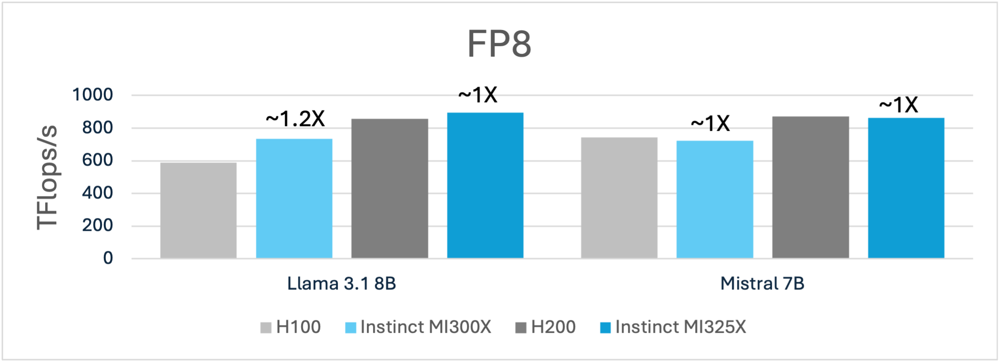
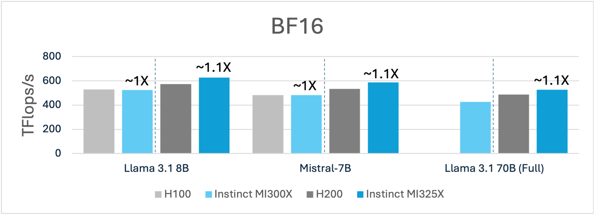
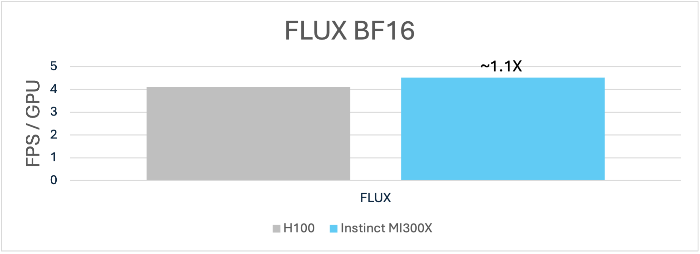

# Enhancing AI Training with AMD ROCm Software

ROCm™ has emerged as a premier open software stack designed to address
the evolving needs of AI and machine learning workloads. Built for
inference and training, ROCm delivers leadership performance, empowering
developers and organizations to optimize their workloads for efficiency,
scalability, and cost-effectiveness.

The inference capabilities of ROCm have already demonstrated [leadership performance](https://rocm.blogs.amd.com/artificial-intelligence/LLM_Inference/README.html)
and have been adopted by industry leaders like Microsoft and Meta.

For example, Meta recently highlighted at the [AMD Advancing
AI](https://www.amd.com/en/corporate/events/advancing-ai.html) event
that all live traffic for the Meta Llama 405B model is supported
exclusively by AMD Instinct™ MI300X GPUs due to its large memory that
can require fewer GPUs to run a model.

ROCm has also demonstrated strong performance capabilities for industry
standard benchmarks like
[MLPerf](https://community.amd.com/t5/instinct-accelerators/engineering-insights-unveiling-mlperf-results-on-amd-instinct/ba-p/705623)®.

As we continue to advance ROCm software capabilities, we are placing
greater emphasis on delivering robust training solutions to complement
our expanding inference capabilities. This blog explores how ROCm
enhances training efficiency and optimizes performance for popular
models while offering a glimpse into planned future advancements.

## Focus on Training Workloads

**Delivering Key Requirements for End-to-End Training Leadership.** Training state-of-the-art AI models, such as Llama and Mistral, requires
a combination of software and hardware optimizations to achieve the
necessary scale and efficiency. ROCm addresses these challenges through
a holistic approach that enhances end-to-end (E2E) performance while
focusing on real-world use cases. This involves optimizing core
operations like matrix calculations, refining parallelization techniques
for [distributed
training](https://rocm.blogs.amd.com/artificial-intelligence/ddp-training-pytorch/README.html),
and implementing advanced algorithms, including [Flash
Attention](https://rocm.blogs.amd.com/artificial-intelligence/flash-attention/README.html)
and mixed precision training. By tailoring these optimizations to
specific architectures, ROCm enables robust and adaptable performance
for developers.

AMD is dedicated to delivering a rich and robust ROCm software stack
optimized for training workloads. Recent advancements include BF16
optimization for hipBLASLt and FP8 support for inference and training, supporting both E4M3 and E5M2 formats.
There are several other critical optimizations planned for
imminent support, including Transformer Engine, improved GEMM
heuristics and full [TunableOps](https://rocm.blogs.amd.com/artificial-intelligence/pytorch-tunableop/README.html)
stable release in upcoming PyTorch releases, which will enable
developers an easy avenue to tune targeted GEMMs for their custom use
cases.

Let\'s look at the end-to-end training performance on AMD Instinct
MI300X using some of these upcoming ROCm enhancements.

## Performance Highlights

**Strong Competitive Training Performance Across Models, Datatypes & Frameworks.** The latest ROCm enhancements
deliver strong competitive performance on models like Llama, Mistral, and FLUX by leveraging FP8 and BF16 data
formats alongside key optimizations. Performance gains come from a
combination of software optimizations---such as improved Flash Attention
v3, targeted GEMM refinements, FP8 training optimizations, and enhanced
support for sliding window attention (SWA)---and architectural
advantages, including larger batch sizes enabled by the MI300X\'s and
MI325X\'s leading HBM memory capacity.

The FP8 training FLOPs highlight the E2E training performance advantage
for AMD Instinct MI300X and MI325X for popular models like the Llama 3.1
8B and Mistral 7B compared to Nvidia H100 and H200, respectively. For
example, the 192GB of HBM3 memory advantage enables MI300X to not only
deliver \~1.2X more performance it also enables a larger batch size of 6
compared to a batch size of 2 H100 using a sequence length of 4k.

Figure 1: Llama 3.1 8B and Mistral 7B training using (FP8)1,2

As shown below, similar performance advantages can be observed using
BF16 as well where AMD Instinct GPUs deliver a higher TFLOPs/s over
Nvidia GPUs.

While performance is critical in GPU evaluation, capabilities and total
cost of ownership (TCO) play a vital role in assessing the competitive
landscape. The MI300X GPU, with its 192GB of HBM3 memory, and MI325X,
with 256GB HBM3E, offer unique advantages over the H100 and H200. Unlike
H100 GPUs, which require multiple nodes to support the full Llama 3.1
70B model at 16-bit precision, both MI300X and MI325X enable full weight
finetuning on fewer nodes. This helps reduce costs, simplify training
infrastructure management, and reduce the need for complex
parallelization techniques, offering a significant edge in both and
efficiency.

Figure 1: Llama 3.1 8B and Mistral 7B training using (BF16)1,2

While AMD Instinct GPUs demonstrate impressive performance for language
models like Llama and Mistral, they also deliver highly competitive
performance on image generation models like FLUX.

In the example below, we showcase that fine-tuning for tasks such as
image generation with FLUX, we show competitive performance on MI300X
compared to H100.

Figure 1: FLUX using BF161,2

## How to Access These Features

AMD provides pre-configured public containers with the latest
optimizations to help developers harness the full potential of ROCm.

Follow the step-by-step
[examples](https://github.com/AMD-AIG-AIMA/pytorch-training-benchmark)
to run the models discussed above with AMD-optimized [pytorch training
docker](https://hub.docker.com/r/rocm/pytorch-training). Learn how to get started with AMD ROCm containers at [ROCm
Blogs](https://rocm.blogs.amd.com/software-tools-optimization/rocm-containers/README.html)

## Conclusion

ROCm continues to redefine what's possible in AI and machine learning
through its comprehensive software stack. From leading inference
performance to its existing competitive performance on training
workloads, ROCm provides the tools necessary to tackle the most
demanding challenges in AI. With ongoing optimizations and a commitment
to accessibility through open-source, public containers, ROCm is paving
the way for researchers and AI engineers to unlock AI breakthroughs.

Explore the latest tools and join the growing community of ROCm
developers to realize the full the potential of AI innovation. If you want to know more about AI development on AMD GPUs, visit the [AI developer hub](https://www.amd.com/gpu-ai-developer).

END NOTES

[1, 2]: Testing conducted on 01/29/20025 by AMD. The overall training text
generation throughput was measured in Tflops/s/GPU for Llama-3.1 8B
using FP8 & BF16 with a sequence length of 4096 tokens and batch size 6
for MI300X and 1 for H100. Mistral 7B using FP8 & BF16 using a sequence
length of 8192 using a batch size of 3 for BF16 and 4 for FP8 on MI300X
and batch size 1 for H100. FLUX.1-dev using BF16 and batch size 10 for
MI300X and 3 for H100.

[1, 2]: Testing conducted on 01/29/20025 by AMD. The overall training text
generation throughput was measured in Tflops/s/GPU for Llama-3.1 8B
using FP8 & BF16 with a sequence length of 4096 tokens and batch size 8
for BF16 and 10 for FP8 for MI325X and 4 for H1200. Mistral 7B using FP8
& BF16 using a sequence length of 8192 using a batch size of 5 for BF16
and 6 for FP8 on MI325X and batch size 2 for BF16 and 3 for FP8 H200.
FLUX.1-dev using BF16 and batch size 10 for MI325X and 3 for H200.

Configurations:

Supermicro GPU A+ Server AS - 8125GS-TNMR2 with 2x AMD EPYC 9654
Processors, 2304 GB DDR5 memory with 8x AMD Instinct MI300X (192GB HBM3,
750W) GPUs, Ubuntu® 22.04.5 LTS with Linux kernel 5.15.0-122-generic,
System BIOS 5.27; and a pre-release version of ROCm™ 6.3. \
Vs.\
Supermicro AS -8125GS-TNHR  2x AMD EPYC 9654 96-Core Processor, 2304 GB
DDR5 memory with 8x NVIDIA H100 80GB HBM3 \[PB1\] (80GiB, 700W) GPUS,
Ubuntu 22.04.5 LTD with Linux kernel titan 6.8.0-51-generic,  System
BIOS 3.5.0, CUDA® 12.6

Dell PowerEdge XE9680 with 2x Intel Xeon Platinum 8480+ Processors, 4096
GiB (32 DIMMS, 4400 mts, 128 GiB/DIMM), 8x AMD Instinct MI325X (256GiB,
1000W) GPUs, Ubuntu 22.04.2 LTS with Linux kernel 5.15.0-122-generic,
and a pre-release build of ROCm 6.3
Vs.
Supermicro SuperServer with 2x Intel Xeon Platinum 8468 Processors, 3
TiB (32 DIMMs, 4400 mts, 96 GiB/DIMM, 16 channels, 2 DIMMs/channel)
memory, 8x Nvidia H200 (140GB, 700W) GPUs, Ubuntu 22.04.5 LTS with Linux
kernel 5.15.0-122-generic, CUDA 12.6
