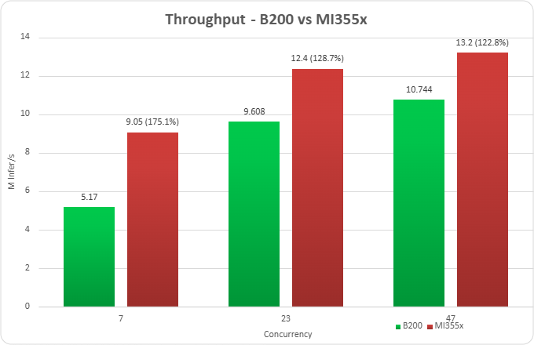

<!---
Copyright (c) 2026 Advanced Micro Devices, Inc. (AMD)

Permission is hereby granted, free of charge, to any person obtaining a copy
of this software and associated documentation files (the "Software"), to deal
in the Software without restriction, including without limitation the rights
to use, copy, modify, merge, publish, distribute, sublicense, and/or sell
copies of the Software, and to permit persons to whom the Software is
furnished to do so, subject to the following conditions:

The above copyright notice and this permission notice shall be included in all
copies or substantial portions of the Software.

THE SOFTWARE IS PROVIDED "AS IS", WITHOUT WARRANTY OF ANY KIND, EXPRESS OR
IMPLIED, INCLUDING BUT NOT LIMITED TO THE WARRANTIES OF MERCHANTABILITY,
FITNESS FOR A PARTICULAR PURPOSE AND NONINFRINGEMENT. IN NO EVENT SHALL THE
AUTHORS OR COPYRIGHT HOLDERS BE LIABLE FOR ANY CLAIM, DAMAGES OR OTHER
LIABILITY, WHETHER IN AN ACTION OF CONTRACT, TORT OR OTHERWISE, ARISING FROM,
OUT OF OR IN CONNECTION WITH THE SOFTWARE OR THE USE OR OTHER DEALINGS IN THE
SOFTWARE.
--->

# Serving CTR Recommendation Models with Triton Inference Server using the ONNX Runtime Backend

In a previous ROCm blog post, ["Triton Inference Server with vLLM on AMD GPUs"](https://rocm.blogs.amd.com/artificial-intelligence/triton_server_vllm/README.html), deploying large language models using Triton Inference Server with the vLLM backend on ROCm-enabled AMD GPUs was introduced. In this blog, you will explore the ONNX Runtime and Python backends in the ROCm build of Triton Inference Server, along with an upgrade that aligns the build with the latest upstream Triton Inference Server release. You will also see how these enhancements expand AI model deployment capabilities and highlight the performance advantages of AMD Instinct GPUs using a representative recommendation model.

Triton Inference Server is a **production-grade AI inference platform** that allows models from different frameworks to be served through a unified interface, supporting features like dynamic batching, model repositories, and concurrent execution. However, real-world AI deployments rarely rely on a single framework or runtime. Models are often trained in one framework, exported to another format, or require custom preprocessing and post-processing logic during inference. Supporting additional backends enables Triton Inference Server to serve a broader range of workloads, ranging from optimized runtime formats to custom pipelines, while maintaining a unified inference interface.

To address these broader deployment needs, the latest ROCm Triton Inference Server release introduces several important updates:

- **ONNX Runtime backend support:** Enables serving ONNX models optimized through ONNX Runtime on AMD GPUs, expanding support for models exported from multiple frameworks.

- **Python backend support:** Allows developers to implement custom inference logic directly in Python, enabling rapid experimentation, pre/post-processing pipelines, and integration with specialized model frameworks.

- **Version upgrade aligned with upstream Triton Inference Server version 25.12:** The ROCm build of Triton Inference Server has been upgraded to align with the upstream Triton Inference Server release, providing improved performance, expanded backend support, and enhancements across the inference serving stack.

Together, these additions significantly broaden the set of workloads that can be deployed on Triton Inference Server with AMD GPUs, enabling a more flexible and production-ready inference platform.

## Triton Inference Server on ROCm

- [ROCm installation page](https://rocm.docs.amd.com/projects/triton-inference-server/en/docs-26.03/install/triton-inference-server-install.html)
- [Docker Images](https://hub.docker.com/r/rocm/tritoninferenceserver/tags)
- [GitHub Repository](https://github.com/ROCm/triton-inference-server-server)

## Version Upgrade

The ROCm build of Triton Inference Server has been upgraded to align with upstream Triton Inference Server `25.12`, incorporating approximately two years of upstream development. This upgrade brings improvements across multiple areas including backend infrastructure, framework support, observability, and runtime stability. It also enables compatibility with newer Triton Inference Server features and backend capabilities introduced in recent upstream releases.

## ONNX Runtime Backend on AMD GPUs

### What It Enables

The ONNX Runtime backend enables models in the Open Neural Network Exchange (ONNX) format to be served using Triton Inference Server on ROCm-enabled AMD GPUs. Since ONNX is widely used as an interchange format, models trained in frameworks such as PyTorch and TensorFlow can be exported and deployed through a common runtime.

With the ONNX Runtime backend, Triton Inference Server can serve a broader range of models while leveraging ROCm GPU acceleration. Developers can also take advantage of Triton Inference Server features such as dynamic batching, concurrent execution, and scalable model serving.

### Deployment Through ONNX Runtime Backend

Deployment follows the standard Triton Inference Server model repository structure. The ONNX model is placed in a versioned model directory along with a `config.pbtxt` configuration file describing inputs, outputs, and batching behavior.

The ROCm-enabled Triton Inference Server container then loads the model through the ONNX Runtime backend and serves inference requests via Triton Inference Server’s HTTP or gRPC endpoints.

## Python Backend on AMD GPUs

### What It Enables

The Python backend allows developers to deploy models and inference pipelines written in Python using Triton Inference Server on ROCm-enabled AMD GPUs. It enables custom inference logic to be implemented directly in Python, including preprocessing, post-processing, and model orchestration.

This backend is particularly useful for workloads that require flexible pipelines or integration with Python-based frameworks, such as PyTorch. This allows developers to combine custom logic with Triton Inference Server’s serving capabilities, including batching, concurrency, and scalable deployment.

### Deployment Through Python Backend

Deployment uses the standard Triton Inference Server model repository structure. The Python inference logic is implemented in a `model.py` file, along with a `config.pbtxt` configuration file describing model inputs, outputs, and execution settings.

When the Triton Inference Server starts, the Python backend loads the model implementation and executes inference requests through the Python runtime, while leveraging ROCm for GPU acceleration where applicable.

## Benchmark Methodology

### Hardware Setup

Benchmarks were conducted using the [FinalNet](https://github.com/reczoo/BARS/tree/main/ranking/ctr/FinalNet/FinalNet_criteo_x4_001) model, a top-ranked click-through rate (CTR) prediction model across multiple public datasets. Based on the [BARS-CTR Leaderboard](https://openbenchmark.github.io/BARS/CTR/leaderboard/index.html), FinalNet is the ranked #1 model in Criteo_x1, Criteo_x4, and MovielensLatest_x1 datasets. Experiments were run on AMD and NVIDIA GPU platforms, including AMD Instinct MI355X and NVIDIA B200.

Performance comparisons focus on the following configuration: AMD Instinct MI355X compared with NVIDIA B200 Tensor Core GPU. These platforms were selected to represent comparable generations of accelerators for large-scale inference workloads.

### Software Setup

The benchmarks were conducted using the Triton Inference Server with the ONNX Runtime backend on both platforms. On the NVIDIA side, the upstream Triton Inference Server 25.12 Docker image was used. On the AMD side, a ROCm-enabled Triton Inference Server build aligned with the upstream 25.12 release was used, ensuring a fair and up-to-date comparison across platforms.

### Metrics

Benchmarks evaluate inference performance and efficiency using the following two metrics:

- **Throughput:** number of inference requests processed per second
- **Latency:** response time per request under load

These metrics provide a clear comparison of model serving performance across AMD and NVIDIA accelerators.

## ONNX Runtime Backend Benchmarks

For all benchmarks, the following command from the Triton Inference Server Performance Analyzer (perf_analyzer) was used.

```bash
perf_analyzer -m FinalNet_onnx  --input-data=random -b 8192 --concurrency-range 1:72:2
```

This command runs the ROCm Perf Analyzer against the FinalNet ONNX model deployed on Triton Inference Server to measure inference performance under varying request loads.

The parameters are defined as follows:

- **`-m FinalNet_onnx`** – Specifies the model name in the Triton Inference Server model repository.
- **`--input-data=random`** – Generates synthetic random input data for inference requests during benchmarking.
- **`-b 8192`** – Sets the inference batch size to 8192, allowing evaluation of throughput at large batch sizes typical for recommendation models.
- **`--concurrency-range 1:72:2`** – Sweeps the number of concurrent inference requests from 1 to 72 in increments of 2, enabling measurement of latency and throughput under increasing request load.

This configuration allows consistent evaluation of model throughput and latency across different GPU platforms under controlled benchmarking conditions.

The full steps to reproduce the benchmarks—including model training, ONNX export, Triton Inference Server deployment on both AMD and NVIDIA GPUs, model config, and performance measurement—are available in the [FinalNet benchmark guide](https://github.com/ROCm/triton-inference-server-server/blob/rocm7.2_r25.12/docs/perf_benchmark/FinalNet/FinalNet_benchmark.md).

## Performance Comparison: NVIDIA B200 vs AMD Instinct MI355X

### Throughput



*Figure 1. Throughput benchmarks for AMD Instinct MI355X vs NVIDIA B200 at concurrency levels of 7, 23, and 47.*

Figure 1 highlights throughput improvement of 175.1% at concurrency 7, 128.7% at concurrency 23, and 122.8% at concurrency 47. All runs were performed with Ubuntu 24.04, Python version 3.12, and ROCm version 7.2.0. Additional details are provided in the footnotes<sup>[1](#footnote-1)</sup> and in claim MI350-075.

## Summary

In this blog, you learned how ROCm-enabled Triton Inference Server now supports the ONNX Runtime and Python backends — and what that unlocks for your AMD GPU deployments. You can now serve standardized ONNX models without custom conversion, build flexible pipelines with Python-based preprocessing and postprocessing, and benefit from the latest upstream improvements through alignment with Triton Inference Server 25.12. Benchmarks on the FinalNet CTR model show that the AMD Instinct MI355X delivers strong throughput advantages over comparable NVIDIA GPUs at scale. This confirms the AMD Instinct MI355X as a production-ready inference platform for serving modern AI workloads.
Looking ahead, our next release will focus on upgrading the vLLM backend to the latest upstream version. We're also working toward TensorFlow backend support, a PyTorch backend upgrade, and Debian OS compatibility — so stay tuned for more updates.

## Acknowledgements

Thank you to the broader AMD team whose contributions made this work possible: Jorge Parada, Fabricio Flores Yepez, Eliot Li, Ted Maeurer, Ted Themistokleous, Christopher Austen, Stephen Baione, Sahil Faizal, Dipto Deb, James Smith, Debasis Mandal, Vicky Tsang, Amit Kumar, Anisha Sankar, Anshul Gupta, Bhavesh Lad, Ehud Sharlin, Jayshree Soni, Jeffrey Daily, Leo Paoletti, Marco Grond, Mohan Kumar Mithur, Phaneendr-kumar Lanka, Ram Seenivasan, Ritesh Hiremath, Saad Rahim, Shivesh Sinha, Kiran Thumma, Kenny Roche, Satya Ramji Ainapurapu, Chao Chen, Jason Furmanek.

## Footnotes

<a id="footnote-1"></a>**1.** Based on calculations by AMD engineering as of March 2026, measuring the inferencing throughput using the Triton Inference Server open-source software library on an AMD Instinct MI355X 1x GPU platform powered by AMD CDNA™ 4 architecture, compared to an NVIDIA B200 GPU 1x platform with NVIDIA “Blackwell” architecture, using the FinalNet model, with batch size of 8192, concurrency level of 23. For more details, see: <https://github.com/ROCm/triton-inference-server-server>. Server manufacturers may vary in configurations, yielding different results. Performance may vary based on the use of the latest drivers and optimizations (MI355X-075)

## Disclaimers

Third-party content is licensed to you directly by the third party that owns the
content and is not licensed to you by AMD. ALL LINKED THIRD-PARTY CONTENT IS
PROVIDED “AS IS” WITHOUT A WARRANTY OF ANY KIND. USE OF SUCH THIRD-PARTY CONTENT
IS DONE AT YOUR SOLE DISCRETION AND UNDER NO CIRCUMSTANCES WILL AMD BE LIABLE TO
YOU FOR ANY THIRD-PARTY CONTENT. YOU ASSUME ALL RISK AND ARE SOLELY RESPONSIBLE
FOR ANY DAMAGES THAT MAY ARISE FROM YOUR USE OF THIRD-PARTY CONTENT.
