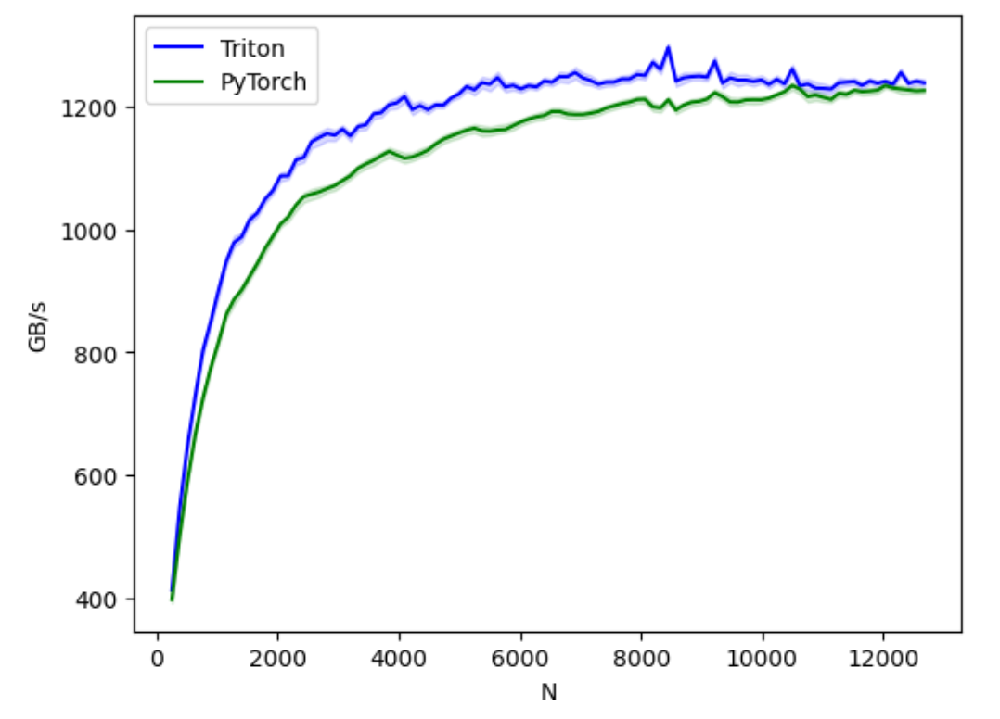

# Developing Triton Kernels on AMD GPUs

<span style="font-size:0.7em;">15 Apr, 2024 by {hoverxref}`Clint Greene<clingree>`. </span>

## Introduction

OpenAI has developed a powerful GPU focused programming language and compiler called [Triton](https://triton-lang.org) that works seamlessly with AMD GPUs. The goal of Triton is to enable AI engineers and scientists to write high-performant GPU code with minimal expertise. Triton kernels are performant because of their blocked program representation, allowing them to be compiled into highly optimized binary code. Triton also leverages Python for kernel development, making it both familiar and accessible. And the kernels can be easily compiled by simply declaring the `triton.jit` python decorator before the kernel.

In this blog, we will dive into developing a GELU (Gaussian Error Linear Unit) kernel and benchmark its performance with its PyTorch analogues.

## Prerequisites

To run this blog, you will need the following:

- **An AMD GPU**: see the [list of compatible GPUs](https://rocm.docs.amd.com/projects/install-on-linux/en/latest/reference/system-requirements.html#supported-gpus)
- **Linux**: see [supported Linux distributions](https://rocm.docs.amd.com/projects/install-on-linux/en/latest/reference/system-requirements.html#supported-operating-systems)
- **ROCm 5.7+**: see the [installation instructions](https://rocm.docs.amd.com/projects/install-on-linux/en/latest/tutorial/quick-start.html)

## Getting Started

Let's first install the libraries we'll need. If you have ROCm 6.0 and the latest version of PyTorch, you can skip this step. However, if you encounter issues running any of the commands, we recommend updating with the nightly wheels. This will also install the version of Triton that is compatible with PyTorch for ROCm.

```bash
pip install matplotlib pandas -q
pip install --pre torch torchvision torchaudio --index-url https://download.pytorch.org/whl/nightly/rocm6.0/ -q
```

And import them

```python
import torch
import triton
import triton.language as tl
```

Now that the necessary libraries are installed and imported, we can begin developing a Triton kernel that approximates the GELU using *tanh*. But let's first discuss what a GELU is and why we would want to develop a kernel for it.

## GELU

The GELU is one of the most widely used activation functions in neural networks because of its ability to introduce non-linearities into networks, the smoothness and stability of its gradients during training, its computational efficiency, and empirical performance in deep learning applications. They are commonly used in Transformer based models like GPT and BERT and have been employed in CNNs for various computer vision tasks with excellent performance. The GELU takes a vector *x* of arbitrary real values as input and outputs a vector of the same size. The GELU approximated by tanh function is defined as:

$$\text{GELU}(x) \approx \frac{x}{2} \left[ 1 + \text{tanh} \left( \sqrt{\frac{2}{\pi}} \left( x + 0.044715 x^3 \right) \right) \right]$$

We can easily code this from scratch in Triton.

```python
# Constant for GELU calculation
k = (2.0 / torch.pi) ** 0.5

@triton.jit  # Decorator for Triton Just-In-Time compilation
def gelu_kernel(
    output_buffer,
    input_buffer,
    input_row_stride,
    output_row_stride,
    n_cols,
    block_size: tl.constexpr,
):
    """
    Function for applying the GeLU using Triton.

    Parameters
    ----------
    output_buffer (pointer): Pointer to the buffer storing the output tensor data.
    input_buffer (pointer): Pointer to the buffer storing the input tensor data.
    input_row_stride (int): Stride (number of elements to skip) between rows in the input tensor.
    output_row_stride (int): Stride (number of elements to skip) between rows in the output tensor.
    n_cols (int): Number of columns in both the input and output tensors.
    block_size (tl.constexpr int): Block size for efficient processing of the tensors (known at compile time).

    Returns: None, output tensor buffer is modified in-place.
    """
    # Determine the starting row pointer based on program ID
    row_idx = tl.program_id(0)
    row_start_ptr = input_buffer + row_idx * input_row_stride

    # Generate a range of column offsets for block processing
    col_offsets = tl.arange(0, block_size)
    input_ptrs = row_start_ptr + col_offsets

    # Load the current row of data, handling potential out-of-bounds elements
    row = tl.load(input_ptrs, mask=col_offsets < n_cols, other=-float('inf'))

    # Apply the GELU activation function using a tanh approximation
    t = (row + 0.044715 * row * row * row) * k
    numerator = 2
    denominator = (1 + tl.exp(-2 * t))
    gelu_output = 0.5 * row * (1 + (numerator / denominator) - 1)

    # Calculate output pointers and store the calculated GELU values
    output_row_start_ptr = output_buffer + row_idx * output_row_stride
    output_ptrs = output_row_start_ptr + col_offsets
    tl.store(output_ptrs, gelu_output, mask=col_offsets < n_cols)
```

In Triton, it's also necessary to create a helper function that enqueues the kernel with the required arguments. If you need more information on the arguments and GPU programming in Triton, take a look at the [official docs](https://triton-lang.org). Let's now develop our enqueing function.

```python
def gelu(x: torch.Tensor):
    n_rows, n_cols = x.shape

    # Determine an efficient block size for processing elements in parallel on the GPU
    block_size = triton.next_power_of_2(n_cols)

    # Adjust the number of warps (thread groups) based on block size for optimal performance
    # Use 4 warps for smaller block sizes
    num_warps = 4
    
    # Increase to 8 warps for larger blocks
    if block_size >= 2048:
        num_warps = 8
    
    # Further increase to 16 warps for even larger blocks
    elif block_size >= 4096:
        num_warps = 16

    y = torch.empty_like(x)

    gelu_kernel[(n_rows,)](# Launch with a one-element tuple for grid size (number of rows)
      y,  # Output tensor
      x,  # Input tensor
      x.stride(0),  # Stride between rows in the input tensor
      y.stride(0),  # Stride between rows in the output tensor
      n_cols,  # Number of columns in the tensors
      num_warps=num_warps,  # Number of warps for parallel execution
      block_size=block_size,  # Block size for efficient processing
    )

    return y
```

It's also always a good idea to perform a unit test after developing a Triton kernel. This will ensure we correctly coded the gelu approximation and that our kernel can handle an irregular number of rows and columns.

``` python
torch.manual_seed(0)
x = torch.randn(4097, 311, device='cuda')
y_triton = gelu(x)
y_torch = torch.nn.functional.gelu(x, approximate='tanh')
assert torch.allclose(y_triton, y_torch, rtol=1e-04,atol=1e-04), (y_triton, y_torch)
```

The unit test confirms our kernel is working as expected. We are now ready to benchmark our kernel and assess its performance.

## Benchmarks

We use Triton's benchmarking utilities to benchmark our Triton kernel on tensors of increasing size and compare its performance with PyTorch's internal `gelu` function.

``` python
@triton.testing.perf_report(
    triton.testing.Benchmark(
        x_names=['N'],  # argument names to use as an x-axis for the plot
        x_vals=[128 * i for i in range(2, 100)],  # different possible values for `x_name`
        line_arg='provider',  # argument name whose value corresponds to a different line in the plot
        line_vals=[
            'triton',
            'pytorch',
        ],  # possible values for `line_arg``
        line_names=[
            "Triton",
            "PyTorch",
        ],  # label name for the lines
        styles=[('blue', '-'), ('green', '-'), ('green', '--')],  # line styles
        ylabel="GB/s",  # label name for the y-axis
        plot_name="gelu-performance",  # name for the plot. Used also as a file name for saving the plot.
        args={'M': 4096},  # values for function arguments not in `x_names` and `y_name`
    ))
def benchmark(M, N, provider):
    x = torch.randn(M, N, device='cuda', dtype=torch.float32)
    quantiles = [0.5, 0.2, 0.8]
    if provider == 'pytorch':
        ms, min_ms, max_ms = triton.testing.do_bench(lambda: torch.nn.functional.gelu(x), quantiles=quantiles)
    if provider == 'triton':
        ms, min_ms, max_ms = triton.testing.do_bench(lambda: gelu(x), quantiles=quantiles)
    gbps = lambda ms: 2 * x.nelement() * x.element_size() * 1e-9 / (ms * 1e-3)
    return gbps(ms), gbps(max_ms), gbps(min_ms)

benchmark.run(show_plots=True, print_data=True)
```

Let's now run the benchmark and see the performance.

```python
benchmark.run(print_data=True, show_plots=True)
```



We can see that our GELU kernel (blue) outperforms PyTorch's implementation of the GELU (green) in terms of bandwidth by as much as 10%. The performance improvement is driven by manually fusing operations on chip in SRAM rather than reading and writing many times from HBM DRAM.

## Summary

In this blog, we have demonstrated how to develop a Triton kernel and benchmark its performance. For additional details on understanding GPU programming and further examples on developing more advanced fused kernels, visit Triton's official [tutorials](https://triton-lang.org/main/getting-started/tutorials/index.html).

## Disclaimer

Third-party content is licensed to you directly by the third party that owns the content and is not licensed to you by AMD. ALL LINKED THIRD-PARTY CONTENT IS PROVIDED “AS IS” WITHOUT A WARRANTY OF ANY KIND. USE OF SUCH THIRD-PARTY CONTENT IS DONE AT
YOUR SOLE DISCRETION AND UNDER NO CIRCUMSTANCES WILL AMD BE LIABLE TO YOU FOR
ANY THIRD-PARTY CONTENT. YOU ASSUME ALL RISK AND ARE SOLELY RESPONSIBLE FOR ANY
DAMAGES THAT MAY ARISE FROM YOUR USE OF THIRD-PARTY CONTENT.
