<!---
Copyright (c) 2026 Advanced Micro Devices, Inc. (AMD)

Permission is hereby granted, free of charge, to any person obtaining a copy
of this software and associated documentation files (the "Software"), to deal
in the Software without restriction, including without limitation the rights
to use, copy, modify, merge, publish, distribute, sublicense, and/or sell
copies of the Software, and to permit persons to whom the Software is
furnished to do so, subject to the following conditions:

The above copyright notice and this permission notice shall be included in all
copies or substantial portions of the Software.

THE SOFTWARE IS PROVIDED "AS IS", WITHOUT WARRANTY OF ANY KIND, EXPRESS OR
IMPLIED, INCLUDING BUT NOT LIMITED TO THE WARRANTIES OF MERCHANTABILITY,
FITNESS FOR A PARTICULAR PURPOSE AND NONINFRINGEMENT. IN NO EVENT SHALL THE
AUTHORS OR COPYRIGHT HOLDERS BE LIABLE FOR ANY CLAIM, DAMAGES OR OTHER
LIABILITY, WHETHER IN AN ACTION OF CONTRACT, TORT OR OTHERWISE, ARISING FROM,
OUT OF OR IN CONNECTION WITH THE SOFTWARE OR THE USE OR OTHER DEALINGS IN THE
SOFTWARE.
--->

# Productionizing TurboQuant on AMD GPUs for KV-Cache-Bound LLM Inference

*\*Equal contributions.*

The KV cache management is critical to modern LLM inference workloads. Previously decoded key and value vectors were cached per attention block to avoid repeated attention calculations. While saving compute, the burden is now shifted to the memory as every new token processed or generated adds another set of keys and values to the cache. As agentic and long-context workloads push sequence lengths into the hundreds of thousands, this cache quickly comes to dominate both memory footprint and token throughput.

TurboQuant (TQ) is a recently published KV-cache compression algorithm [1]. By pairing a structured rotation with a small, fixed codebook, TQ aims to push KV cache down to 4/3/2 bits with surprisingly little accuracy loss in the offline accuracy-only setting it was originally analyzed in. In this work, we focus on what is required to translate that algorithm into a competitive production deployment on AMD GPUs, where additional practical considerations around accuracy, kernel performance, and serving behavior become important.

In this post, we share our experience building and deploying an improved, productionized version of TurboQuant on AMD GPUs via vLLM. TurboQuant matters most when KV-cache capacity, rather than compute, becomes the bottleneck—a regime that commonly appears in long-context, multi-turn agentic workloads, where improving KV-cache residency and hit rate can materially reduce latency and increase throughput. We will break down our analysis of the algorithm, the refinements we made to resolve the practical bottlenecks of the original design, and the kernel-level optimizations required to make TurboQuant competitive with well-established BF16/FP8 baselines.

## Key Results

We are showcasing a specific scenario for long-context multi-turn agents where TurboQuant is especially effective. In these scenarios, KV cache capacity often becomes the bottleneck, and reducing KV-cache footprint improves cache residency and hit rate. This translates into lower TTFT, higher throughput, and strong overall system efficiency, while preserving accuracy well in the recommended configuration.

We enabled and optimized TurboQuant for ROCm in vLLM on AMD GPUs. Without kernel optimization, TurboQuant performance benchmarks against well-established BF16/FP8 baselines hold little meaning, since those baselines are backed by mature, highly optimized kernels. With custom Triton, HIP and FlyDSL [7] kernels, our implementation delivers up to ~3.6× end-to-end speedup over the open-source vLLM TurboQuant baseline.

Based on our empirical analysis, we recommend defaulting to TQ4/4 (TQ K/V = K-bits / V-bits) in production for a strong balance of compression, accuracy, and performance. Detailed tradeoffs across model types and precision settings are discussed in this post. We provide a detailed analysis of each of the following points in the Deployment Configuration section.

- Apply rotation and LUT-based quantization to K, and use standard uniform quantization for V. In our analysis, keys are more quantization-sensitive than values.

- Skip boundary layers for full-attention models. The first and last layers are often the most sensitive to KV quantization and leaving them unquantized can recover substantial accuracy at modest compression cost. The same effect is documented in TurboQuant+ Boundary V experiments [2]. We include some analysis on the magnitude of this effect across different forms of attention.

- Use Walsh-Hadamard rotation instead of random rotation. In practice, WHT is both more kernel-friendly and more accurate. TurboQuant+ also converges to the same choice for llama.cpp [2].

- Omit QJL in the default 4-bit path. In our experiments, QJL adds complexity and runtime overhead without delivering accuracy benefits in our experiments. This matches community consensus as some works drop QJL and D'Alberto et al. report similar conclusions [2, 3].

## Why TurboQuant Matters for Agentic Workloads

Agentic applications are characterized by high input length, low output length, and multiple turns sharing common prefixes. This is a workload pattern where KV-cache capacity, rather than compute, tends to be the limiter, which is the regime where TurboQuant is designed to help. We show that this is the case through the following experiment that uses a larger client pool (100 conversations) as well as longer per-conversation prefixes (~25K). This experiment was conducted on MiniMax M2.5 with TP=2 on AMD Instinct MI355X GPUs with the following task configuration:

100 conversations, 32 concurrency | Common prefix 2K, per-conversation prefix ~25K, input 2-3K/round, output 200/round, 6 rounds

| Metric | FP8 Baseline | TQ4/4 | Improvement |
| --- | --- | --- | --- |
| Time-to-First-Token (TTFT) (P50) | 13.9 s | 0.89 s | 17.1x faster |
| Total throughput | 17,536 tok/s | 28,539 tok/s | 1.63x higher |
| KV cache hit rate | 5.3% | 67.7% | +62.4 pp |
| Cache evictions | Frequent | Rare | Near-Eliminated |

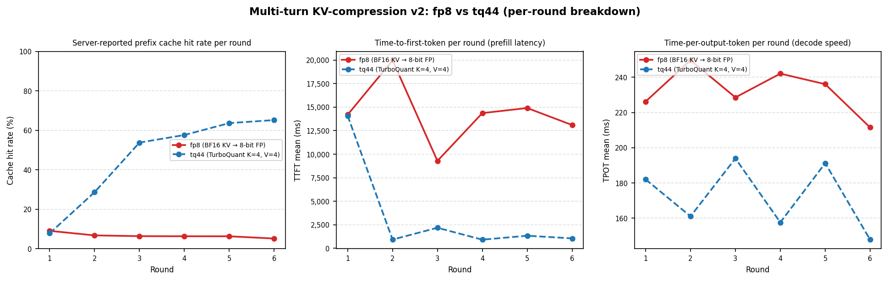

Figure 1: Performance of TurboQuant vs FP8 KV-Cache Compression on Multi-turn Agentic Workloads

### Why do we see such large gains?

With FP8 KV cache, the large per-client prefixes (32K tokens each) fill available GPU memory quickly at concurrency 32. The 5.3% cache hit rate reflects the system spending most of its time re-prefilling evicted contexts rather than doing useful generations. This explains the long 13.9s taken to generate the first token (P50). The same memory-pressure regime reproduces on different hardware and models in the vLLM serving study [6], where Llama-3.3-70B BF16 P99 TTFT under burst load explodes to ~17 s while TurboQuant variants stay under 3.5 s.

With TQ4/4 at ~3.8x compression, all 32 clients' 32K per-client prefixes fit resident simultaneously with no eviction. The cache hit rate jumps to 67.7%, and P50 TTFT falls to less than 1s because the system is attending over cached keys and values rather than recomputing them. Figure 1 above visualizes these gains across per-round TTFT, ITL, and throughput.

## Deployment Configuration

TurboQuant works to compress the KV cache in 4 key steps:

- Random rotation of the K/V vector – this rotation spreads outliers uniformly across dimensions.

- Normalize by a per-token L2-norm scale

- Quantize via a fixed codebook – the expectation is the distribution created by the previous two steps is n-dimensional Beta which is approximately Gaussian as n tends to infinity.

- Find the error residual (full precision minus quantized) and then requantize this residual using QJL -- a single sign bit.

In production, we modify this baseline algorithm with the earlier mentioned 4 changes in Key Results section. Here, we include some justifications for these choices.

### Key vs Value Compression

We note earlier that the rotation and LUT are reserved for the K-side. Here, we provide justification for this choice. Quantizing V to 4-bits (or even 3 bits) incurs minimal accuracy loss compared to K, and rotation/LUT brings only marginal improvement. This story only changes when we explore extreme compression at 2 bits where we note that V can be compressed to 2-bits at the cost of the rotation/LUT overhead, a finding echoed by the community [2]. As shown in Figure 2, the perplexity heatmap confirms that applying rotation and LUT to V provides negligible benefit at 4-bit precision.

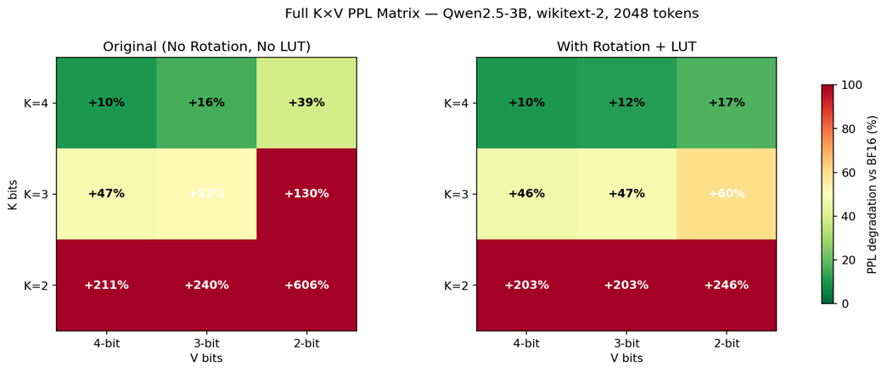

Figure 2: Heatmap of K-V Precision Configurations comparing Qwen2.5-3B Perplexity with Rotation and LUT for V vs without Rotation and LUT for V

### Layer Configuration Analysis

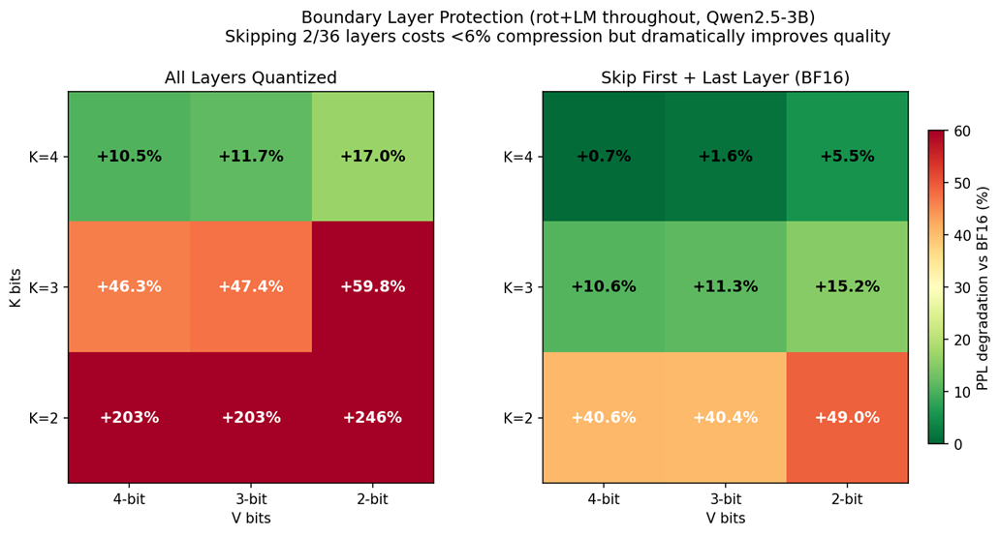

Figure 3: Heatmap of K-V Precision Configurations comparing Qwen2.5-3B Perplexity over with Rotation and LUT for V vs without Rotation and LUT for V

Analysis of Softmax attention models (GPT-OSS, Minimax on vLLM) on various tasks reveals that boundary layers are more sensitive to quantization. This finding leads us to consider skipping the quantization of the first and last layer (losing 6% of the compression benefit for a meaningful accuracy gain). However, this effect is not as strong for hybrid attention models such as Qwen3.5 as noted in the later accuracy section. As per the vLLM community implementation, we also follow the heuristic of only skipping boundary layers on softmax attention models, and disregarding this finding for hybrid attention models altogether; we use the existing –kv-cache-dtype-skip-layers in vLLM.

### Quantized Johnson-Lindenstrauss Transform (QJL)

TurboQuant introduces the Quantized Johnson-Lindenstrauss (QJL) quantizer to address the bias introduced by MSE quantization of the Keys and Values [1, 5]. This quantizer would be applied to the residual following MSE quantization, meaning that in a 4-bit TurboQuant variant, we would use 3-bits for MSE and 1-bit for QJ, essentially just saving the sign of the error. Due to RTN being sufficient for Value quantization, we primarily consider the effects of QJL on K (more detailed analysis can be found in D’Alberto [Arxiv, 2026]). We find, in line with community implementations, that QJL causes severe degradation of accuracy. To identify the source of error, we developed and tested alternative constructions of the projection matrix S, holding the MSE rotation, bit budget, and inference protocol fixed.

We compared three constructions of QJL rotation matrices at d=128: a raw i.i.d. Gaussian matrix (common to community implementations), a QR-orthogonalized Gaussian (as prescribed by the QJL paper), and a randomized Walsh-Hadamard projection that replaces the dense d×d matrix with an O(d log d) butterfly and a length-d sign vector. On Llama 3.1 8B at K=V=4, the raw Gaussian incurs the largest penalty when applied to the K side, confirming the missing orthogonalization as the dominant variance source. The Orthogonal-Gaussian and Walsh-Hadamard projections recover most of that gap, landing within 4 pp of MSE-only and within 1 pp of each other.

Two qualifications appear in the broader sweep. At a 4-bit budget the sketch is at best neutral: MSE-only (73.6%) outperforms every K-side variant, so the sign-sketch correction is not justified on Llama. At 2-bit value quantization, the V-side sketches collapse to 31–41% strict-match, because the residual being sketched is dominated by V codebook noise rather than signal. Key-side sketches degrade gracefully under the same value precision cut. In our experiments, skipping QJL at the 4-bit budget produced the strongest accuracy among the configurations tested, as illustrated in Figure 4.

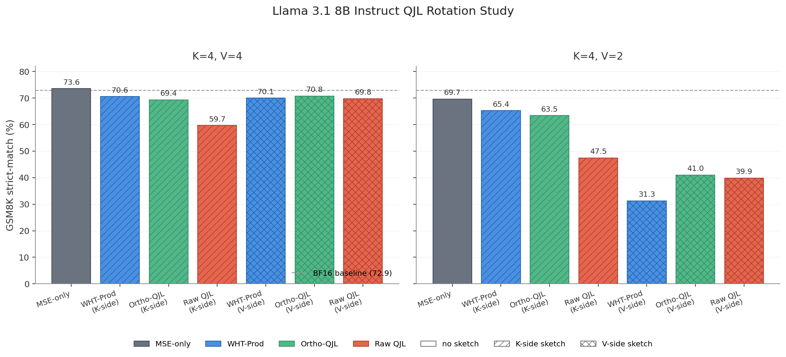

Figure 4: Accuracy comparison between the four QJL rotation implementations, applied at key vectors and value vectors. In our experiments, omitting QJL at the 4-bit budget delivers the strongest accuracy.

### Rotation Analysis

We begin by presenting some data justifying preservation of the Hadamard rotation step with a comparison against identity (no rotation) and random orthogonal rotations (as per the original TurboQuant paper [1]). We note that the energy-spreading effect of the Hadamard transform empirically leads to better accuracy as well as performance (described in later section). This finding is corroborated by TurboQuant+'s kurtosis analysis on Qwen3 KV tensors confirming the distribution is truly pushed to approximately Gaussian by the Hadamard transform [2]. Figure 5 shows the kurtosis distribution across layers for each rotation strategy.

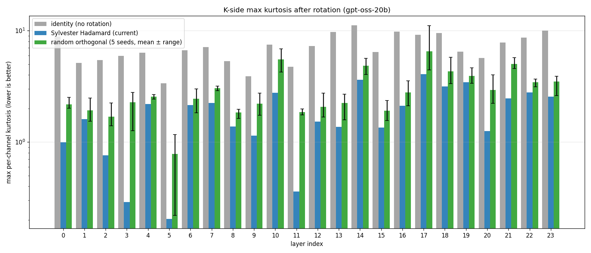

Figure 5: Kurtosis analysis for GPT-OSS-20b layers for Keys across random rotation, Hadamard rotation, and no rotation

## Kernel Implementation in vLLM

In this section, we describe the implementation of TurboQuant on ROCm and the series of kernel optimizations that close the performance gap to baseline. We present throughput and latency results across fixed long-context and concurrency sweep benchmarks, showing how each optimization from improved Triton tiling to native HIP ISA control to FlyDSL generated code contributes to the final performance.

Turboquant compresses the KV cache to 4 bits per element, storing the keys and values in a codebook format. The cache is dequantized on the fly, making decode step memory-bandwidth-bound. Our kernels are inspired by FLUTE [4], which introduced offline restructuring of quantized weight matrices to minimize bit-manipulation overhead during unpacking, as well as vectorized LUT access to reduce shared memory pressure. In our implementation, we adapt and extend these ideas by adding GQA-aware tiling, SoA cache layout, and AMD specific MFMA dispatch.

The current Triton TQ kernel in VLLM is based on scalar LUT lookups per-query-head causing redundant KV cache loads across GQA groups and non-coalesced memory access. Our improved Triton kernel gives a 2X improvement over the current implementation. We incorporate a series of optimizations:

- SoA KV layout: keys and values are stored continuously per block, coalesced 128-bit HBM loads

- GQA grouping: query heads sharing a KV head processed in one tile using MFMA tensor cores

- Pair LUT (FLUTE [4]): precompute all centroid pairs offline, one byte load and one gather recover two dequantized values, halving LUT lookups

- Hadamard rotation: adds a signed Hadamard pre-rotation on keys once before storage to eliminate recomputation

- Unified prefill + decode: single parametrized kernel instead of separate code paths, making the long-context continuation-prefill code paths easier

While the improved Triton TQ kernel closes some performance gap through algorithmic improvements, it has limited performance improvements when it comes to controlling register allocations or wavefront-level instructions. We also implement a native HIP kernel compiled directly to AMD GCNISA. It gives another 1.2-1.5X performance benefit over our in-house triton TQ implementation. Key improvements include:

Native MFMA dispatch: matrix-core instructions issued via direct AMD GCN ISA intrinsics rather than Triton's tl.dot abstraction, giving the kernel author control over MFMA op selection and operand register layout

- 4-wave parallel QK: hides bandwidth latency and improves occupancy

- LDS usage to reduce VGPR pressure and stalls, V dequant staged in LDS so all GQA query heads sharing a KV head reuse a single global V load

- BF16 Q input: triton casts the queries to fp32 internally before QK dot product, HIP feeds them directly as BF16

Together, our in-house Triton TQ and HIP kernel implementations reduce the throughput gap from 68% down to 22%, demonstrating that algorithmic optimizations along with hardware-level control can close the performance gap. We are also working on a FlyDSL kernel written in a high-level DSL that generates optimized code at JIT compile time for AMD GPUs without per-device .so files; full control over tiling, register layout, and memory access pattern is preserved. The DSL exposes MFMA operand layouts which unlocks further codegen choices, a wider MFMA variant for QK, an in-register handoff from QK through softmax to PV (no LDS spill), a transposed V LDS layout for single-instruction PV loads, and a one-wave-per-CTA design that eliminates cross-wave reduction. At 8K/1K context (C=64), the FP8 KV cache baseline achieves 8% above BF16 by halving HBM reads with 2× compressed keys and values, while keeping all arithmetic in BF16. FlyDSL TQ operates on 4-bit KV (4× compression vs. BF16, 2× vs. FP8) and delivers 95% of BF16 and 88% of FP8 despite the heavier dequantization cost. Accuracy evaluations across short, medium, and long context windows confirm that 4-bit quantization incurs no meaningful quality degradation relative to the BF16 baseline.

To attribute these speedups to individual optimizations, we run a kernel-microbenchmark ablation that adds one technique at a time on top of the open-source Triton TQ baseline. The table below reports per-optimization cumulative speedup over TQ baseline on MiniMax-M2.5 (GQA-6) and Qwen-72B (GQA-8) at 8K and 32K context.

| Optimization | Minimax 2.5 8K | Minimax 2.5 32K | Qwen 72B 8K | Qwen 72B 32K |
| --- | --- | --- | --- | --- |
| Baseline (scalar LUT, AoS cache, per-head grid) | 1.00x | 1.00x | 1.00x | 1.00x |
| GQA grouping + unified prefill / decode | 2.49× | 2.61x | 3.16x | 3.30x |
| SoA KV layout + pair LUT + BF16 dot (tl.dot) | 2.69x | 2.87x | 3.42x | 3.63x |
| Native MFMA dispatch (intrinsics) | 2.64x | 2.94x | 3.35x | 3.73x |
| 4-wave parallel QK + LDS V staging | 2.88x | 3.22x | 3.66x | 4.09x |
| BF16 Q input + matrix-core PV | 4.52x | 5.53x | 6.62x | 8.53x |
| wider MFMA, in-register softmax, transposed V LDS | 7.64x | 9.96x | 9.42x | 12.68x |

Each tier of algorithmic, hardware-level, and codegen optimizations compounds multiplicatively on the decode kernel, reaching up to 12.7× over the open-source baseline. In the following section, we discuss performance results in detail.

Performance Results:

All results on MiniMax-M2.5 (GQA-6), 2× AMD MI355X, TP=2, --kv-cache-dtype turboquant_4bit_nc, --block-size 32, --attention-backend ROCM_AITER_UNIFIED_ATTN, N=80 prompts. Below we show results from two benchmarks with configurations as following:

- 32K / 1K (ISL=32K, OSL=1K): long-context decode at fixed C=64

- 8K / 1K sweep (ISL=8K, OSL=1K): concurrency sweep from C=4 to C=64

We evaluate four configurations spanning different kernel versions and optimizations. Each kernel variant represents the current state of that codegen path; the optimization sets are not identical across variants, and most optimizations are portable across the versions. The relative ordering in the plots for our in-house implementations reflects each kernel's optimization maturity, not a structural advantage of one approach over another.

- BF16 (AITER FA): BF16 with ROCm AITER Unified Attention; the competitive production baseline

- FP8 KV: FP8 KV-cache with hardware-native tensor core attention

- vLLM OSS TQ: open-source TurboQuant decode kernel; scalar LUT lookups, AoS KV layout, per-head grid

- Opt. TQ: our FLUTE [4] optimized version of Triton unified kernel

- HIP TQ: our HIP kernel compiled to AMD GCN ISA

- FlyDSL TQ: AOT-compiled via FlyDSL DSL targeting AMD CDNA3, current codegen snapshot of implementation

Figures 6 and 7 compare output throughput and TPOT at fixed 32K/1K context (C=64), while Figures 8 and 9 show how these metrics scale across concurrency levels at 8K/1K.

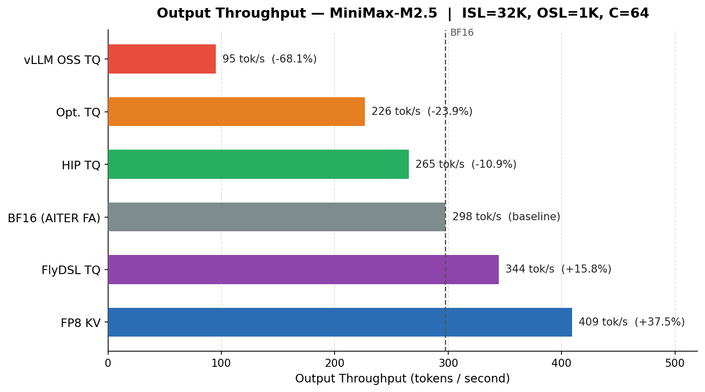

Figure 6: Output Throughput of TQ Kernels vs BF16 and FP8 KV-Cache Quantization

As shown in Figure 6, FlyDSL TQ surpasses the BF16 baseline on output throughput at +15.8%, while FP8 KV leads at +37.5% — HIP TQ closes to within 11% of BF16, with each TQ kernel generation roughly halving the remaining gap.

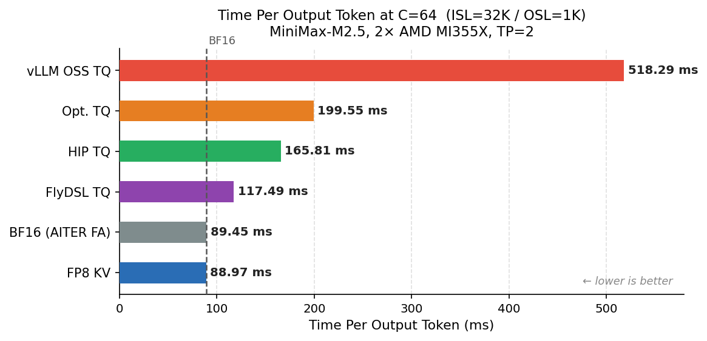

Figure 7: TPOT for TQ Kernels vs BF16 and FP8 KV-Cache Quantization

Figure 7 shows that our FlyDSL TQ kernel sits at 117ms TPOT, within 31% of both BF16 and FP8 KV.

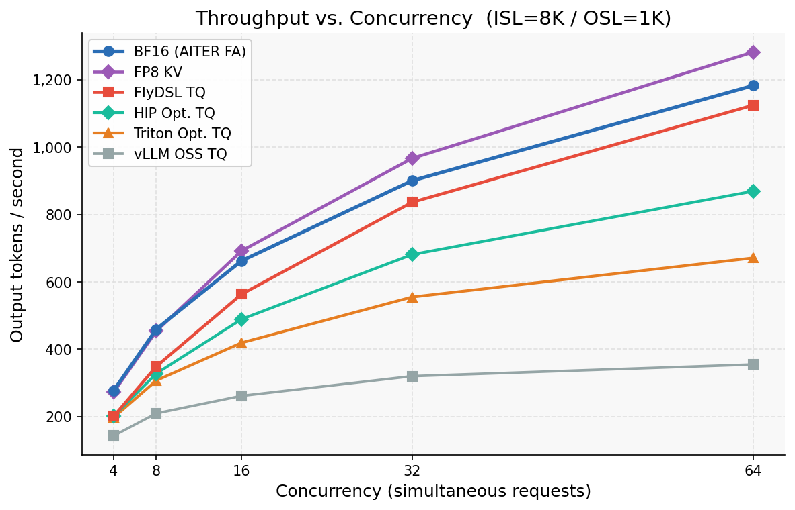

Figure 8: Throughput vs Concurrency for TQ Kernels vs BF16 and FP8 KV-Cache Quantization

As seen in Figure 8, HIP throughput tracks the BF16 scaling curve closely at 8K ISL, with Triton v3 diverging at high concurrency. FlyDSL TQ kernel reaches within 5% of BF16 throughput, surpassing all other TQ implementations across every concurrency level.

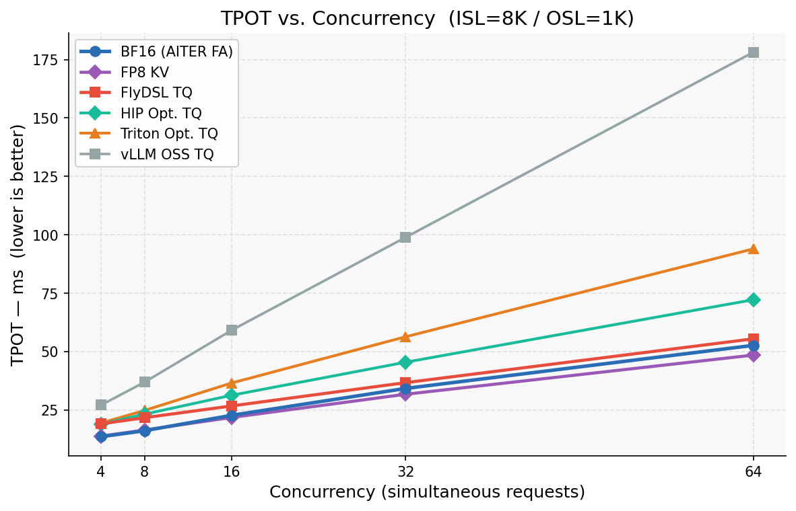

Figure 9: TPOT vs Concurrency for TQ Kernels vs BF16 and FP8 KV-Cache Quantization

Figure 9 shows that HIP TPOT stays within 1.3–1.4× BF16 across all concurrencies; Triton v3 widens to 1.8× at longer concurrency. FlyDSL TQ tracks closest to BF16, reaching only 1.05× at C=64 matching FP8 KV.

In these measurements, our FlyDSL kernel reached 95% of BF16 throughput and 88% of FP8 KV throughput on AMD hardware. Our Triton and HIP TQ kernels brought TurboQuant 4bit-nc to 65% and 89% of BF16 throughput respectively, compared to 32% with the open-source baseline, narrowing the performance gap to the BF16 AITER FA and FP8 KV baselines in this configuration while also providing the KV compression benefit.

## Accuracy Analysis

We investigate TurboQuant across three models (Qwen 3.5 35B A3B, MiniMax M2.5, GPT-OSS 120B) and four precision configurations (FP8, TQ 4/4, TQ 4/2, TQ 3/4). Note that the framing TQ n/m refers to a n-bit Key and a m-bit Value. We evaluate our models on GPQA and LongCodeBench to examine long context KV cache limitations as well as effects on reasoning. Figures 10–11 present the Qwen3.5 results, Figures 12–13 cover MiniMax M2.5, and Figures 14–15 cover GPT-OSS 120B.

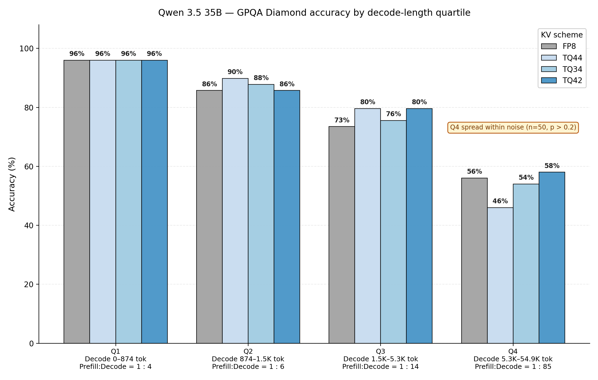

Figure 10: Qwen3.5 35B FP8 evaluated on GPQA diamond. Benchmark is decomposed into decode length quartiles, and accuracy is analyzed at each decode length quartile.

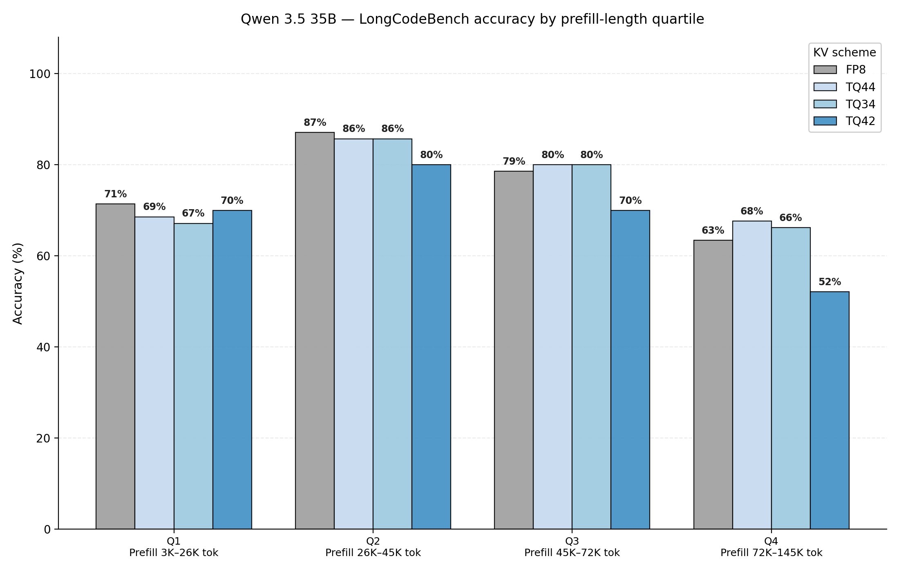

Figure 11: Qwen3.5 35B FP8 evaluated on LongCodeBench 32k, 64k, and 128k. Benchmark is decomposed into prefill length quartiles, and accuracy is analyzed at each decode length quartile.

As shown in Figures 10 and 11, Qwen3.5 is a unique model compared to other LLM model architectures, in which linear attention layers represent ~75% (30 of 40 attention layers in 35B variant). Linear attention layers utilize structured state space models in place of quadratic attention; this means our cache and inference time only increase linearly instead of quadratically. Thus, KV compression only applies to the 10 full attention layers. Limited application of TQ yields a more robust model to compression degradation – accuracy degradation modestly drops across increasing decode length and increasing prefill lengths. Notably, TQ 3/4 and TQ 4/2 also hold accuracy well compared to FP8 baseline.

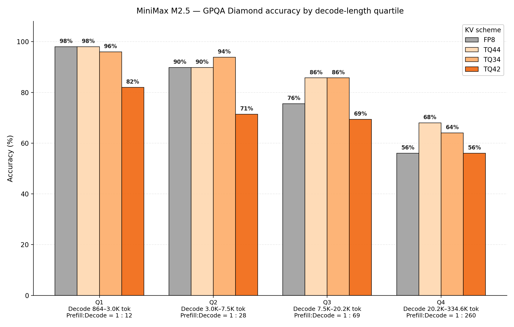

Figure 12: MiniMax M2.5 evaluated on GPQA Diamond. Benchmark is decomposed into decode length quartiles, and accuracy is analyzed at each decode length quartile.

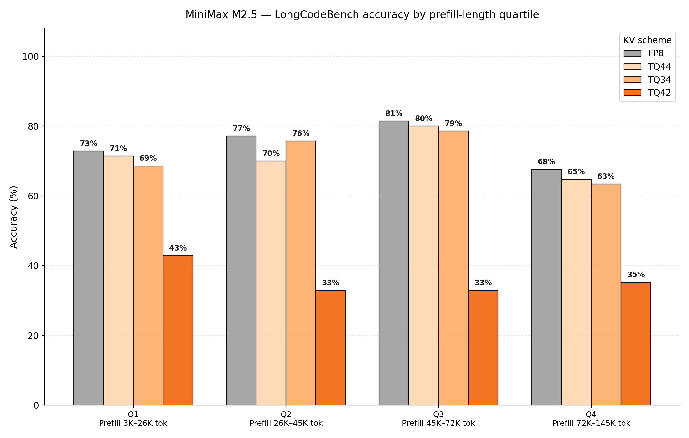

Figure 13: MiniMax M2.5 evaluated on LongCodeBench 32k, 64k, and 128k. Benchmark is decomposed into prefill length quartiles, and accuracy is analyzed at each decode length quartile.

Figures 12 and 13 show that MiniMax M2.5 accuracy reveals a more precise insight into KV cache compression effects on long context tasks. M2.5 utilizes full attention layers, exposing the whole model to KV cache compression. The effects of quantization become obvious: setting keys and values to 4-bit precision preserve accuracy relative to FP8 precision. Meanwhile, TQ34 configurations struggle to maintain an accurate context history. This observation is consistent between both prefill-heavy workloads and decode-heavy workloads. As discussed earlier in #Layer Configuration Analysis, for Minimax M2.5 we skip quantization for the first two and last two attention layers for better perf-accuracy trade-off.

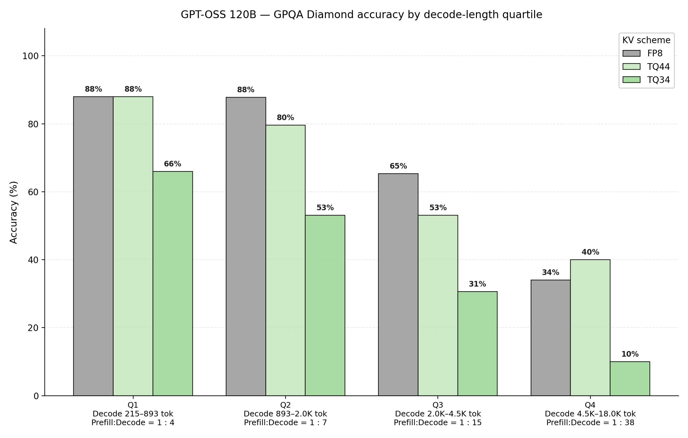

Figure 14: GPT-OSS 120B evaluated on GPQA Diamond. Benchmark is decomposed into decode length quartiles, and accuracy is analyzed at each decode length quartile.

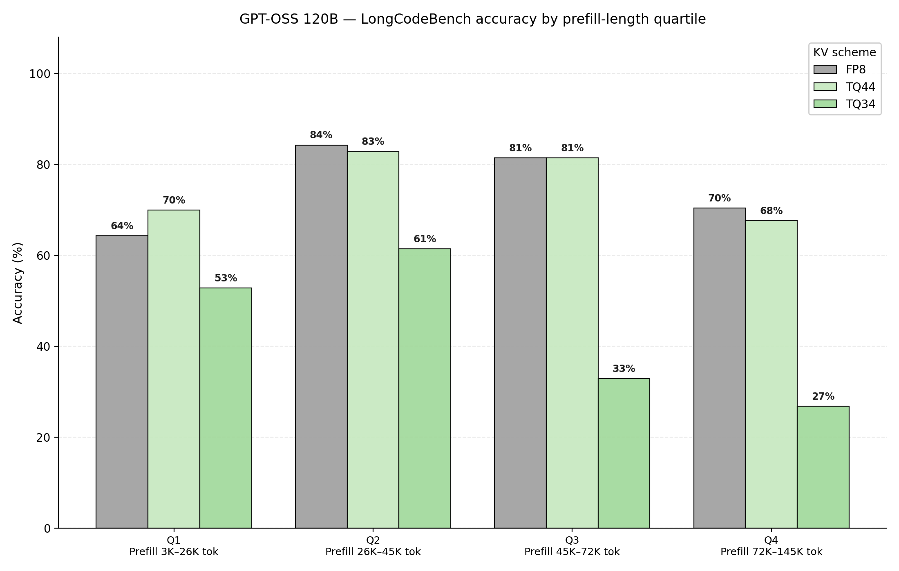

Figure 15: GPT-OSS 120B evaluated on GPQA Diamond. Benchmark is decomposed into prefill length quartiles, and accuracy is analyzed at each decode length quartile

We make a couple of observations from Figures 14 and 15. First, we reconfirm our earlier finding that key quantization is more sensitive than value quantization. Additionally, we omitted TQ42 results due to inconsistent accuracy measures. The independent vLLM community study by Red Hat AI [6] reaches a compatible conclusion: their 4bit-nc preset (TQ K4/V4) stays within 1–4 points of FP8/BF16 on most benchmarks, while 3-bit variants degrade by up to ~20 points on hard reasoning tasks.

GPT-OSS accuracy performance reveals another set of unique trends. Firstly, Key quantization is far more sensitive to quantization; TQ34 accuracy drops off significantly at long prefill and long decode tasks. Similar to Qwen, GPT-OSS uses a hybrid attention structure; half of the attention blocks are full attention, and the other half are sliding window attention blocks. GPT-OSS also uses more narrow attention heads compared to MiniMax M2.5 and Qwen3.5, utilizing head dimensions of 64, compared to 128 or 256. We attribute the long context quantization sensitivity in GPT-OSS as an artifact of its lower dimensional attention architecture.

Given our observations of accuracy trends between precision, context length, and model architecture, we conclude with the following deployment guidance: hybrid attention models exhibit robustness to extreme compression, and can support lower precision cache, whereas full attention models can be brittle. It’s also important to consider the dimensionality of attention heads; lower dimensional heads are quite sensitive to key quantization. We recommend maintaining key quantization at 4-bits for such models. Therefore, we suggest using TQ44 for full attention models, and more extreme configurations for hybrid attention models (TQ34, TQ42).

## Limitations

We note two primary limitations of TQ:

- ROI depends heavily on the model’s attention architecture. The benefit of TQ varies significantly depending on the specific attention variant used in the model.

- Supported / favorable architectures: MHA and GQA. For example, TQ is a good fit for models such as MiniMax.

- Unsupported / unfavorable architectures: MLA is not currently supported. For example, TQ is not a good fit for models such as Kimi K2.5.

- Performance benefits depend on KV-cache memory pressure. TQ is most effective when KV-cache memory is the bottleneck. In memory-constrained workloads, it can reduce KV-cache footprint and improve overall efficiency. However, if GPU memory is already sufficient to hold the KV cache comfortably, TQ typically provides little to no performance gain.

## Summary

We presented a production-ready implementation of TurboQuant on AMD GPUs via vLLM, demonstrating that 4-bit KV-cache quantization can deliver meaningful gains for real-world LLM serving.

- Algorithm refinements: Walsh-Hadamard rotation, asymmetric K/V treatment, boundary-layer skipping, and QJL removal together recover accuracy lost by naive 4-bit quantization while simplifying the pipeline.

- Kernel optimizations: A progression from Triton to HIP to FlyDSL narrowed the throughput gap from 68% behind BF16 to within 5% in our measurements, making TQ practical for production serving in this configuration. More broadly, end-to-end performance is heavily dependent on kernel optimization quality: with sufficiently optimized kernels, TurboQuant can approach the BF16 baseline.

- Workload-dependent performance: TurboQuant is not a universally better default in every serving regime. Its benefits are strongest when KV-cache capacity is the bottleneck. In compute-bound settings, TurboQuant can underperform BF16 due to quantization and dequantization overheads.

- Agentic workloads: Where long prefixes and high concurrency make KV-cache capacity the bottleneck, TQ 4/4 boosted cache hit rates from 5.3% to 67.7% and cut P50 TTFT from 13.9s to under 1s.

- Deployment guidance: We recommend TQ 4/4 as the default for a strong balance of compression, accuracy, and performance.

Several directions remain open for future work:

- Model-aware quantization strategies: More effective mixed-precision KV cache deployments with TurboQuant aligning with attention-layer sensitivity.

- Advances in quantization methods: Promising areas include learned centroids, learned rotations, and additional low-precision formats such as BlockScale and FP4 variants.

- System support for distributed inference: TurboQuant could be extended as a compressed KV transfer mechanism for disaggregated inference, including prefill–decode disaggregation and multi-node deployments.

- Broader kernel and architecture support: Future work includes expanding support for additional TurboQuant presets, MLA through latent KV quantization, WHT butterfly integration, and multi-token decode kernels for speculative decoding.

## Acknowledgements

We would like to express our thanks to our colleagues Jiangyong Ren, Jiaxin Wang, Zhao Lin, Wei Luo, Chao Li, Xinjun Niu, and the AMD Quark Team, for their insightful feedback and technical assistance, which helped inform parts of this work. We also thank Paolo D'Alberto, Devleena Das, Rajeev Patwari, and Elliott Delaye for valuable technical discussions.

## References

[1] Zandieh, A., Daliri, M., Hadian, M., and Mirrokni, V. TurboQuant: Online Vector Quantization with Near-optimal Distortion Rate. In International Conference on Learning Representations (ICLR), 2026. https://openreview.net/forum?id=tO3ASKZlok

[2] TheTom. TurboQuant+: community llama.cpp port and exploration of TurboQuant. GitHub repository, 2026. https://github.com/TheTom/turboquant_plus

[3] D'Alberto, P. Statistical Inference and Quality Measures of KV Cache Quantisations Inspired by TurboQuant. arXiv:2605.08114, 2026. https://arxiv.org/abs/2605.08114

[4] Guo, H., Brandon, W., Cholakov, R., Ragan-Kelley, J., Xing, E. P., and Kim, Y. Fast Matrix Multiplications for Lookup Table-Quantized LLMs. In Findings of the Association for Computational Linguistics: EMNLP 2024, pp. 12419–12433, 2024. https://aclanthology.org/2024.findings-emnlp.724/

[5] Zandieh, A., Daliri, M., and Han, I. QJL: 1-Bit Quantized JL Transform for KV Cache Quantization with Zero Overhead. arXiv:2406.03482, 2024. https://arxiv.org/abs/2406.03482

[6] Kurtić, E., Goin, M., and Marques, A. (Red Hat AI). A First Comprehensive Study of TurboQuant: Accuracy and Performance. vLLM Blog, May 11, 2026. https://vllm.ai/blog/2026-05-11-turboquant

[7] Li, F., Feng, S., Huang, C., Wang, D., Yang, H., Sun, P., and Barsoum, E. FlyDSL: Expert GPU Kernel Development with the Ease of MLIR Python Native DSL on AMD GPUs. AMD ROCm Blogs. https://rocm.blogs.amd.com/software-tools-optimization/flydsl-python-native/README.html

## Disclaimers

Third-party content is licensed to you directly by the third party that owns the
content and is not licensed to you by AMD. ALL LINKED THIRD-PARTY CONTENT IS
PROVIDED "AS IS" WITHOUT A WARRANTY OF ANY KIND. USE OF SUCH THIRD-PARTY CONTENT
IS DONE AT YOUR SOLE DISCRETION AND UNDER NO CIRCUMSTANCES WILL AMD BE LIABLE TO
YOU FOR ANY THIRD-PARTY CONTENT.

Results shown are from specific test configurations and may vary based on workload, model, and system configuration.

The information presented in this document is for informational purposes only and may contain technical inaccuracies, omissions, and typographical errors. The information contained herein is subject to change and may be rendered inaccurate for many reasons, including but not limited to product and roadmap changes, component and motherboard version changes, new model and/or product releases, product differences between differing manufacturers, software changes, BIOS flashes, firmware upgrades, or the like. Any computer system has risks of security vulnerabilities that cannot be completely prevented or mitigated. AMD assumes no obligation to update or otherwise correct or revise this information.
However, AMD reserves the right to revise this information and to make changes from time to time to the content hereof without obligation of AMD to notify any person of such revisions or changes.
THIS INFORMATION IS PROVIDED 'AS IS." AMD MAKES NO REPRESENTATIONS OR WARRANTIES WITH RESPECT TO THE CONTENTS HEREOF AND ASSUMES NO RESPONSIBILITY FOR ANY INACCURACIES, ERRORS, OR OMISSIONS THAT MAY APPEAR IN THIS INFORMATION. AMD SPECIFICALLY DISCLAIMS ANY IMPLIED WARRANTIES OF NON-INFRINGEMENT, MERCHANTABILITY, OR FITNESS FOR ANY PARTICULAR PURPOSE. IN NO EVENT WILL AMD BE LIABLE TO ANY PERSON FOR ANY RELIANCE, DIRECT, INDIRECT, SPECIAL, OR OTHER CONSEQUENTIAL DAMAGES ARISING FROM THE USE OF ANY INFORMATION CONTAINED HEREIN, EVEN IF AMD IS EXPRESSLY ADVISED OF THE POSSIBILITY OF SUCH DAMAGES.
AMD, the AMD Arrow logo, AMD Instinct, AMD ROCm, CDNA, and combinations thereof are trademarks of Advanced Micro Devices, Inc. Other product names used in this publication are for identification purposes only and may be trademarks of their respective companies. Linux is the registered trademark of Linus Torvalds in the U.S. and other countries. PyTorch, the PyTorch logo and any related marks are trademarks of The Linux Foundation. vLLM is a trademark of vLLM Project. Llama is a trademark of Meta Platforms, Inc. All other trademarks and product names referenced in this publication, including TurboQuant, Triton, llama.cpp, MiniMax, Qwen, GPT-OSS, are the property of their respective owners.
© 2026 Advanced Micro Devices, Inc. All rights reserved
