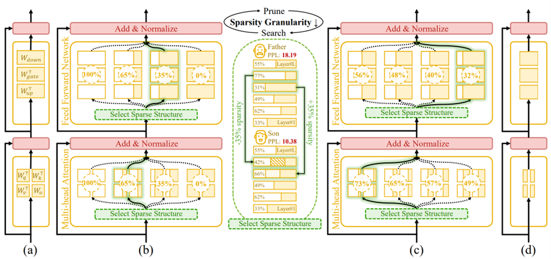
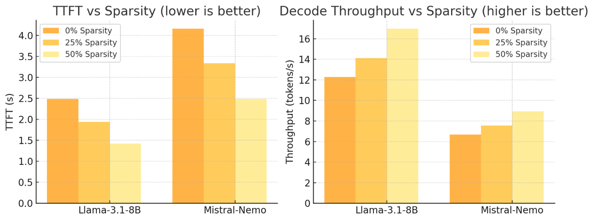

<!---
Copyright (c) 2025 Advanced Micro Devices, Inc. (AMD)

Permission is hereby granted, free of charge, to any person obtaining a copy
of this software and associated documentation files (the "Software"), to deal
in the Software without restriction, including without limitation the rights
to use, copy, modify, merge, publish, distribute, sublicense, and/or sell
copies of the Software, and to permit persons to whom the Software is
furnished to do so, subject to the following conditions:

The above copyright notice and this permission notice shall be included in all
copies or substantial portions of the Software.

THE SOFTWARE IS PROVIDED "AS IS", WITHOUT WARRANTY OF ANY KIND, EXPRESS OR
IMPLIED, INCLUDING BUT NOT LIMITED TO THE WARRANTIES OF MERCHANTABILITY,
FITNESS FOR A PARTICULAR PURPOSE AND NONINFRINGEMENT. IN NO EVENT SHALL THE
AUTHORS OR COPYRIGHT HOLDERS BE LIABLE FOR ANY CLAIM, DAMAGES OR OTHER
LIABILITY, WHETHER IN AN ACTION OF CONTRACT, TORT OR OTHERWISE, ARISING FROM,
OUT OF OR IN CONNECTION WITH THE SOFTWARE OR THE USE OR OTHER DEALINGS IN THE
SOFTWARE.
--->

# Týr-the-Pruner: Search-based Global Structural Pruning for LLMs

This blog introduces Týr-the-Pruner, a search-based, end-to-end framework for global structural pruning of large language models (LLMs). By constructing a supernet of layer-wise pruned candidates with different sparsity levels and searching for the optimal sparsity distribution under a target overall sparsity, Týr-the-Pruner removes up to 50% of parameters while retaining ~97% of dense accuracy on Llama-3.1-70B—establishing a new state of the art among structured pruning methods. Experiments also show tangible inference speedups on AMD Instinct™ GPUs. Read the [full paper](https://arxiv.org/abs/2503.09657) and try the [implementation](https://github.com/AMD-AGI/Tyr-the-Pruner). This work has been accepted to [NeurIPS 2025](https://neurips.cc/).

## Why global sparsity matters

Local structural pruning is attractive because it is compute and memory efficient: layers are compressed independently, often enabling single device offload even for hundred-billion–scale LLMs. However, local pruning enforces uniform per layer sparsity and ignores cross layer dependencies. “Global” pruning methods attempt to fix this by following a two-stage pipeline:
(i) compute a global ranking of substructure saliencies to allocate layerwise sparsity
(ii) prune accordingly—which breaks end-to-end optimization and mishandles inter-structure interactions.

**Týr-the-Pruner inverts this process**: Instead of ranking before pruning, it first builds a multi-sparsity supernet and then searches for the optimal layer-wise sparsity distribution under a global sparsity target - yielding a truly end-to-end global approach.

## Inside Týr-the-Pruner: How It Works

<i>Figure 1. An overview of Týr-the-Pruner. Large language models (a) will be effectively locally pruned across multiple sparsity ratios and constructed into a supernet (b). An iterative prune-and-search strategy will be used to select the optimal sparse structure for each layer while maintaining a target overall sparsity ratio: pruning and sparsity-shift-driven evolutionary search are implemented iteratively with a coarse-to-fine sparsity interval granularity (c). Ultimately, the post-pruned LLM with the optimal sparsity distribution (d) is obtained.</i>

As illustrated in Figure 1, we first construct a reliable supernet via local pruning and expectation-aware error accumulation, and then employ an iterative coarse-to-fine prune-and-search strategy to identify the optimal layer-wise sparsity allocation.

**Reliable supernet**. We first build a strong supernet by locally pruning every layer across multiple sparsity levels using a Taylor-informed saliency (first/second order) and backprop free weight adjustment, applied progressively to minimize perturbation. To make layer variants mutually aware, we introduce an expectation error accumulation approach to address the challenge of unclear error propagation caused by the multiple pruned copies within the supernet.

**Efficient coarse-to-fine search**. With the supernet in place, we apply an evolutionary search to find the best layer-wise sparsity allocation. Each mutation performs a sparsity shift that preserves the global budget—for example, when one layer becomes denser by a few percent, another becomes equally sparser. Candidates are evaluated using a distillation-based similarity over hidden activations and logits. A one-shot fine-grained (1.56% sparsity interval) search would require about 65 candidates per layer (≈ 10¹⁴⁵ configurations for an 80-sublayer model), so we instead adopt an iterative prune-and-search strategy: in each iteration, we build a smaller supernet with only nine candidates per layer (starting at 12.5% sparsity interval), run the evolutionary search, and then re-center on the best sparsity pattern, which serves as the base for constructing the next-iteration supernet with a halved sparsity interval (12.5% → 6.25% → 3.13% → 1.56%). After four iterations, the search reaches 1.56% granularity while keeping the effective search around 10⁷⁶ configurations per iteration—the search space becomes smaller, the process lighter, and convergence faster, efficiently and effectively identifying the optimal global sparsity pattern.

## Results: Accuracy and efficiency on AMD hardware

|     Model    |     Sparsity    |     Method    |     Arc-C    |     Arc-E    |     BoolQ    |     HellaSwag    |     OBQA    |     RTE    |     WinoGrande    |     MMLU    |     AVG    |
|---|---|---|---|---|---|---|---|---|---|---|---|
|     Llama-2-70B    |     0%    |     N/A    |     54.44    |     82.74    |     83.73    |     64.77    |     37.4    |     67.87    |     77.98    |     68.79    |     67.22 (100%)    |
|  |     50%    |     SliceGPT    |     38.65    |     68.39    |     69.63    |     38.4    |     25    |     63.54    |     67.4    |     50.2    |     52.65 (78%)    |
|  |  |     LLM-Pruner    |     21.93    |     29.08    |     43.18    |     26.26    |     18.36    |     51.62    |     49.25    |     23.77    |     32.39 (48%)    |
|  |  |     ZipLM    |     46.67    |     77.61    |     82.26    |     56.94    |     34    |     67.61    |     76.43    |     63.05    |     63.43 (92%)    |
|  |  |     OSSCAR    |     48.21    |     78.37    |     81.99    |     57    |     32.4    |     67.15    |     76.64    |     56.05    |     62.25 (93%)    |
|  |  |     FLAP    |     40.02    |     70.79    |     74.74    |     51.83    |     32    |     69.29    |     67.88    |     59.35    |     54.65 (81%)    |
|  |  |     Týr-the-Pruner    |     48.21    |     79.12    |     83.18    |     60.04    |     35.2    |     70.76    |     78.14    |     60.58    |     64.40 (96%)    |
|     Llama-3.1-70B    |     0%    |     N/A    |     60.58    |     87.29    |     85.29    |     66.5    |     37    |     70.04    |     79.64    |     78.72    |     70.63 (100%)    |
|  |     50%    |     SliceGPT    |     32.08    |     58    |     63.85    |     34.02    |     20.62    |     53.43    |     56.99    |     32.6    |     43.95 (62%)    |
|  |  |     LLM-Pruner    |     21.42    |     25.35    |     38.81    |     26.22    |     13.8    |     54.39    |     50.83    |     24.95    |     32.40 (45%)    |
|  |  |     ZipLM    |     48.55    |     78.54    |     80.55    |     55.98    |     31.64    |     66.93    |     78.37    |     63.27    |     62.89 (89%)    |
|  |  |     OSSCAR    |     48.29    |     78.51    |     81.44    |     56.47    |     30.23    |     65.73    |     78.48    |     64.03    |     62.65 (89%)    |
|  |  |     FLAP    |     37.54    |     66.97    |     73.17    |     49.44    |     26.4    |     65.13    |     72.84    |     54.83    |     54.39 (76%)    |
|  |  |     Týr-the-Pruner    |     56.74    |     85.4    |     85.2    |     64.07    |     36.4    |     71.48    |     78.91    |     70.29    |     68.56 (97%)    |

<i>Table 1: Post pruning performance on massive language models. Accuracy (%, higher is better) serves as the comparison metric. MMLU employed a 5-shot benchmark, while other tasks used 0-shot benchmarks.</i>

<i>Figure 2: Inference efficiency of post-pruned LLMs with Týr-the-Pruner. Benchmarks were conducted on a single AMD Instinct™ MI250 Accelerator using PyTorch (HipBlas) for LLM inference, with input and output sequence lengths set to 2048.</i>

As shown in Table 1 and Figure 2, Týr-the-Pruner consistently maintains near-dense accuracy while offering substantial efficiency gains on AMD Instinct™ MI250 Accelerators. At 50% sparsity, Týr-the-Pruner achieves 96–97% average accuracy retention on 70B-scale models—establishing a new state-of-the-art among structured pruning methods such as SliceGPT, LLM-Pruner, and FLAP. On Llama-3.1-8B and Mistral-Nemo, 50% pruning reduces TTFT (time to first token) by 1.75× and 1.67×, respectively, and increases decode throughput by 1.38× and 1.34×, demonstrating pruning as a key technique for inference optimization in large language models. These results highlight Týr-the-Pruner’s capability to jointly preserve task fidelity and accelerate inference on modern AMD accelerators.

## Practical Considerations: Memory and Search Efficiency

Because supernets can be large, we store pruned substructures on disk and load only the active subnet into HBM (high bandwidth memory), keeping memory usage close to that of a single dense model. Disk footprints remain moderate (≈ 39.6 GB for 7–8B models and ≈ 414.7 GB for 70B), and artifacts from earlier iterations can be cleaned up. The evolutionary search is also computationally efficient: generations are evaluated under progressively increasing token budgets (2K → 16K → 128K) and converge rapidly thanks to the coarse-to-fine interval schedule. For 8B-scale models, a single evolutionary search iteration takes about 190 seconds per generation (50 generations per iteration), indicating that Týr-the-Pruner’s overall runtime cost remains well-controlled.

## Summary

In this blog, you explored Týr-the-Pruner, an end-to-end framework for global structural pruning of large language models. Týr builds a reliable supernet by locally pruning each layer at multiple sparsity levels and then uses an evolutionary, sparsity-shift search to identify the optimal per-layer sparsity allocation under a global budget. By combining expectation-aware error accumulation with an iterative, coarse-to-fine prune-and-search schedule, the method attains stable convergence while keeping the search tractable.

Týr-the-Pruner achieves up to 50% parameter reduction while preserving 97% accuracy on Llama-3.1-70B, demonstrating strong pruning quality, effective search efficiency, and meaningful acceleration on modern hardware.

Looking ahead, we will continue expanding the Týr-the-Pruner ecosystem. Upcoming efforts include more in-depth evaluations, additional tuning recipes, and practical guides for deploying pruned LLMs on ROCm-enabled platforms. You can dive deeper into the methodology and extensive benchmarks in our [paper](https://arxiv.org/abs/2503.09657), and access our implementation on [GitHub](https://github.com/AMD-AGI/Tyr-the-Pruner).

We also invite you to explore the [AMD Developer Cloud](https://www.amd.com/en/forms/registration/developer-cloud-application.html), featuring AMD Instinct™ accelerators purpose-built for AI workflows. For questions or collaboration opportunities, reach out to the AMD team at [amd_ai_mkt@amd.com](mailto:amd_ai_mkt@amd.com). Stay tuned for future posts, expanded tooling, and hands-on tutorials as we continue advancing LLM pruning research and deployment.

## Disclaimers

Third-party content is licensed to you directly by the third party that owns the
content and is not licensed to you by AMD. ALL LINKED THIRD-PARTY CONTENT IS
PROVIDED “AS IS” WITHOUT A WARRANTY OF ANY KIND. USE OF SUCH THIRD-PARTY CONTENT
IS DONE AT YOUR SOLE DISCRETION AND UNDER NO CIRCUMSTANCES WILL AMD BE LIABLE TO
YOU FOR ANY THIRD-PARTY CONTENT. YOU ASSUME ALL RISK AND ARE SOLELY RESPONSIBLE
FOR ANY DAMAGES THAT MAY ARISE FROM YOUR USE OF THIRD-PARTY CONTENT.
