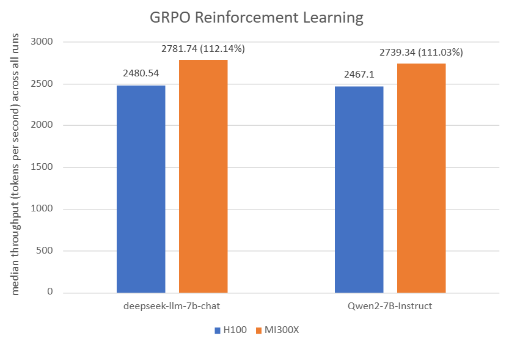

<!---
Copyright (c) 2025 Advanced Micro Devices, Inc. (AMD)

Permission is hereby granted, free of charge, to any person obtaining a copy
of this software and associated documentation files (the "Software"), to deal
in the Software without restriction, including without limitation the rights
to use, copy, modify, merge, publish, distribute, sublicense, and/or sell
copies of the Software, and to permit persons to whom the Software is
furnished to do so, subject to the following conditions:

The above copyright notice and this permission notice shall be included in all
copies or substantial portions of the Software.

THE SOFTWARE IS PROVIDED "AS IS", WITHOUT WARRANTY OF ANY KIND, EXPRESS OR
IMPLIED, INCLUDING BUT NOT LIMITED TO THE WARRANTIES OF MERCHANTABILITY,
FITNESS FOR A PARTICULAR PURPOSE AND NONINFRINGEMENT. IN NO EVENT SHALL THE
AUTHORS OR COPYRIGHT HOLDERS BE LIABLE FOR ANY CLAIM, DAMAGES OR OTHER
LIABILITY, WHETHER IN AN ACTION OF CONTRACT, TORT OR OTHERWISE, ARISING FROM,
OUT OF OR IN CONNECTION WITH THE SOFTWARE OR THE USE OR OTHER DEALINGS IN THE
SOFTWARE.
--->

# Reinforcement Learning from Human Feedback on AMD GPUs with verl and ROCm 7.0.0

In our [previous blog post](https://rocm.blogs.amd.com/artificial-intelligence/verl-large-scale/README.html), we introduced Volcano Engine Reinforcement Learning for LLMs (verl) 0.3.0.post0 with ROCm 6.2 and vLLM 0.6.4. In this blog post, we will provide you with an overview of verl 0.6.0 with ROCm 7.0.0 and vLLM 0.11.0.dev and its benefits for large-scale reinforcement learning from human feedback (RLHF). You will also learn about the modifications made to optimize verl performance on AMD Instinct™ MI300X GPUs. Next, you will walk through building the Docker image on your system, along with training scripts for single-node and multi-node setups. Lastly, we provide you with verl performance results, focusing on throughput and convergence accuracy achieved on AMD Instinct MI300X GPUs.
Follow this guide to get started with verl on AMD Instinct GPUs and accelerate your RLHF training with ROCm-optimized performance.

## Introducing verl: A scalable RLHF training framework

To develop intelligent large-scale foundation models, post-training is just as important as pre-training. Among post-training paradigms, reinforcement learning from human feedback (RLHF) has emerged as a critical technique, though its full potential has not been thoroughly explored until now. Since the release of ChatGPT at the end of 2022, the effectiveness of RLHF in enhancing large-scale pre-trained language models (LLMs) has become increasingly evident. More recently, the release of several O1/R1-series models trained with RLHF has once again highlighted its performance, particularly in improving reasoning capabilities. Despite growing recognition of its importance, there remains a lack of mature, open-source RLHF frameworks, particularly those capable of supporting training with both high efficiency and scalability.

Building on this foundation, the open-source ([Volcengine](https://github.com/volcengine/verl)) community introduces verl, an efficient RLHF framework designed for scalable, high-performance training. It integrates high-throughput LLM training engines such as FSDP and Megatron, with advanced inference engines like vLLM and SGLang. It also uses Ray as part of a hybrid orchestration engine to schedule and coordinate training and inference tasks in parallel, enabling optimized resource utilization and overlap between these phases. This dynamic resource allocation strategy significantly improves overall system efficiency.

## Enable verl on AMD Instinct GPUs with ROCm and Docker

To support AMD Instinct GPUs and ROCm 7.0.0, AMD provides prebuilt Docker images to simplify the verl training environment setup.

- [Installation](https://rocm.docs.amd.com/projects/install-on-linux/en/latest/install/3rd-party/verl-install.html)

- [Docker image](https://hub.docker.com/r/rocm/verl/tags)

- [GitHub](https://github.com/ROCm/verl)

To get started with running verl on AMD Instinct GPUs, follow these steps:

### Single-node training

First, launch the verl Docker image:

```shell
docker run --rm -it \
        --device /dev/dri \
        --device /dev/kfd \
        -p 8265:8265 \
        --group-add video \
        --cap-add SYS_PTRACE \
        --security-opt seccomp=unconfined \
        --privileged \
        -v $HOME/.ssh:/root/.ssh \
        -v $HOME:$HOME \
        --shm-size 128G \
        -w $PWD \
        rocm/verl:verl-0.6.0.amd0_rocm7.0_vllm0.11.0.dev
```

#### Prepare data

```shell
python3 examples/data_preprocess/gsm8k.py --local_dir ../data/gsm8k
```

#### Load models

```shell
python3 -c "import transformers;transformers.pipeline('text-generation', model='Qwen/Qwen2-7B-Instruct')"
python3 -c "import transformers;transformers.pipeline('text-generation', model='deepseek-ai/deepseek-llm-7b-chat')"
```

#### Configure settings

 ```shell
MODEL_PATH="Qwen/Qwen2-7B-Instruct"
train_files="../data/gsm8k/train.parquet"
test_files="../data/gsm8k/test.parquet"
```

You can choose any model supported by verl and assign it to the `$MODEL_PATH` variable. In this example, the `Qwen/Qwen2-7B-Instruct` and `deepseek-ai/deepseek-llm-7b-chat` models are used. For datasets, you may use any dataset of your choice, just ensure it is converted into the required format. In this example, `GSM8K` is used, as verl provides preprocessing code to format it appropriately.

#### Set environment variables

```shell
export HIP_VISIBLE_DEVICES=0,1,2,3,4,5,6,7
GPUS_PER_NODE=8
```

You must assign `HIP_VISIBLE_DEVICES`. This is the most crucial step, and the only difference compared to running the model on CUDA-based PyTorch.

Then, you can run the RLHF algorithms provided by verl, including Proximal Policy Optimization (PPO), Group Relative Policy Optimization (GRPO), ReMax, REINFORCE++, RLOO, PRIME, and others. In this example, we demonstrate the use of PPO and GRPO to illustrate the workflow.

PPO example:

```shell
MODEL_PATH="Qwen/Qwen2-7B-Instruct" # You can use: deepseek-ai/deepseek-llm-7b-chat
TP_VALUE=2 #If deepseek, set TP_VALUE=4
INFERENCE_BATCH_SIZE=32 #If deepseek, set INFERENCE_BATCH_SIZE=32
GPU_MEMORY_UTILIZATION=0.4 #If deepseek, set GPU_MEMORY_UTILIZATION=0.4

python3 -m verl.trainer.main_ppo  \
        data.train_files=$train_files  \
        data.val_files=$test_files  \
        data.train_batch_size=1024 \
        data.max_prompt_length=1024 \
        data.max_response_length=512 \
        actor_rollout_ref.model.path=$MODEL_PATH \
        actor_rollout_ref.actor.optim.lr=1e-6 \
        actor_rollout_ref.model.use_remove_padding=True \
        actor_rollout_ref.actor.ppo_mini_batch_size=256 \
        actor_rollout_ref.actor.ppo_micro_batch_size_per_gpu=16 \
        actor_rollout_ref.model.enable_gradient_checkpointing=True \
        actor_rollout_ref.actor.fsdp_config.param_offload=False \
        actor_rollout_ref.actor.fsdp_config.optimizer_offload=False \
        actor_rollout_ref.rollout.log_prob_micro_batch_size_per_gpu=$INFERENCE_BATCH_SIZE \
        actor_rollout_ref.rollout.tensor_model_parallel_size=$TP_VALUE \
        actor_rollout_ref.rollout.name=vllm  \
        actor_rollout_ref.rollout.gpu_memory_utilization=$GPU_MEMORY_UTILIZATION \
        actor_rollout_ref.ref.log_prob_micro_batch_size_per_gpu=$INFERENCE_BATCH_SIZE \
        actor_rollout_ref.ref.fsdp_config.param_offload=True \
        critic.optim.lr=1e-5 \
        critic.model.use_remove_padding=True \
        critic.model.path=$MODEL_PATH \
        critic.model.enable_gradient_checkpointing=True \
        critic.ppo_micro_batch_size_per_gpu=32 \
        critic.model.fsdp_config.param_offload=False \
        critic.model.fsdp_config.optimizer_offload=False \
        algorithm.kl_ctrl.kl_coef=0.001 \
        trainer.critic_warmup=0 \
        trainer.logger=['console','wandb'] \
        trainer.project_name='ppo_qwen_llm' \
        trainer.experiment_name='ppo_trainer/run_qwen2-7b.sh_default' \
        trainer.n_gpus_per_node=8 \
        trainer.nnodes=1 \
        trainer.save_freq=-1 \
        trainer.test_freq=10 \
        trainer.total_epochs=50
```

GRPO example:

```shell
MODEL_PATH="Qwen/Qwen2-7B-Instruct" #  You can use: deepseek-ai/deepseek-llm-7b-chat
TP_VALUE=2 #If deepseek, set TP_VALUE=2
INFERENCE_BATCH_SIZE=40 #If deepseek, set INFERENCE_BATCH_SIZE=110
GPU_MEMORY_UTILIZATION=0.4 #If deepseek, set GPU_MEMORY_UTILIZATION=0.6

python3 -m verl.trainer.main_ppo \
        algorithm.adv_estimator=grpo \
        data.train_files=$train_files \
        data.val_files=$test_files \
        data.train_batch_size=1024 \
        data.max_prompt_length=512 \
        data.max_response_length=1024 \
        actor_rollout_ref.model.path=$MODEL_PATH \
        actor_rollout_ref.actor.optim.lr=1e-6 \
        actor_rollout_ref.model.use_remove_padding=True \
        actor_rollout_ref.actor.ppo_mini_batch_size=256 \
        actor_rollout_ref.actor.ppo_micro_batch_size_per_gpu=80 \
        actor_rollout_ref.actor.use_kl_loss=True \
        actor_rollout_ref.actor.kl_loss_coef=0.001 \
        actor_rollout_ref.actor.kl_loss_type=low_var_kl \
        actor_rollout_ref.model.enable_gradient_checkpointing=True \
        actor_rollout_ref.actor.fsdp_config.param_offload=False \
        actor_rollout_ref.actor.fsdp_config.optimizer_offload=False \
        actor_rollout_ref.rollout.log_prob_micro_batch_size_per_gpu=$INFERENCE_BATCH_SIZE \
        actor_rollout_ref.rollout.tensor_model_parallel_size=$TP_VALUE \
        actor_rollout_ref.rollout.name=vllm \
        actor_rollout_ref.rollout.gpu_memory_utilization=$GPU_MEMORY_UTILIZATION \
        actor_rollout_ref.rollout.n=5 \
        actor_rollout_ref.ref.log_prob_micro_batch_size_per_gpu=$INFERENCE_BATCH_SIZE \
        actor_rollout_ref.ref.fsdp_config.param_offload=True \
        algorithm.kl_ctrl.kl_coef=0.001 \
        trainer.critic_warmup=0 \
        trainer.logger=['console','wandb'] \
        trainer.project_name='grpo_qwen_llm' \
        trainer.experiment_name='grpo_trainer/run_qwen2-7b.sh_default' \
        trainer.n_gpus_per_node=8 \
        trainer.nnodes=1 \
        trainer.save_freq=-1 \
        trainer.test_freq=10 \
        trainer.total_epochs=50
```

### Multi-node training

After you successfully run single-node training, scale to multi-node training on AMD clusters using the Slurm workload manager by following the provided [multi-node training script](https://github.com/volcengine/verl/blob/main/docs/amd_tutorial/amd_build_dockerfile_page.rst#slurm_scriptsh).

This guide walks you through each step of the process, from Slurm configuration, environment setup, and Docker or Podman container setup to Ray cluster initialization, data preprocessing, model setup, and training launch, to help you smoothly run multi-node training.

#### Launch multi-node training

```shell
sbatch slurm_script.sh
```

For more detailed guidance, comprehensive single-node and multi-node training tutorials are available in the official verl upstream [GitHub introduction](https://github.com/volcengine/verl/blob/main/docs/amd_tutorial/amd_build_dockerfile_page.rst) and [documentation](https://verl.readthedocs.io/en/latest/index.html).

## Performance benchmarks: Throughput and convergence on MI300X vs. H100

In this section, we run verl (v0.6.0) and present throughput and convergence accuracy on NVIDIA H100 and AMD Instinct MI300X GPUs using the same hyperparameters. As you can see below, the MI300X [^A][^B] platform demonstrated higher throughput in both models compared to the H100 platform, with comparable convergence accuracy.

Recent advancements to the verl open-source library on AMD ROCm™ software further demonstrate how AMD Instinct™ GPUs offer leadership in open-source LLM training performance. With ROCm 7, AMD Instinct MI300X systems deliver state-of-the-art throughput, outperforming the NVIDIA H100 across multiple models and configurations.


Figure 1: *For PPO Reinforcement Learning: The AMD Instinct MI300X 8x GPU also offers up to 56% higher PPO training throughput vs. NVIDIA H100 on deepseek-llm-7b-chat with TP_VALUE of 4, INFERENCE_BATCH_SIZE of 32, and GPU_MEMORY_UTILIZATION of 0.4[^D]. The AMD Instinct MI300X 8x GPU offers up to 36% higher PPO training throughput vs. NVIDIA H100 on Qwen2-7B-Instruct with TP_VALUE of 2, INFERENCE_BATCH_SIZE of 32, and GPU_MEMORY_UTILIZATION of 0.4. [^C]*

| Platform | Model | TP_VALUE | INFERENCE_BATCH_SIZE | GPU_MEMORY_UTILIZATION | Throughput (tokens/GPU/second) | Convergence (accuracy) |
|--|--|--|--|--|--|--|
| H100[^D] | deepseek-llm-7b-chat | 4 | 32 | 0.4 | 910.42[^A] | 68.30[^B] |
| MI300X [^D] | deepseek-llm-7b-chat | 4 | 32 | 0.4 | 1,428.64[^A] | 69.00[^B] |
|--|--|--|--|--|--|--|
| H100[^C] | Qwen2-7B-Instruct | 2 | 32 | 0.4 | 1,109.38[^A] | 86.27[^B] |
| MI300X [^C] | Qwen2-7B-Instruct | 2 | 32 | 0.4 | 1,514.46[^A] | 85.06[^B] |

Table 1: *PPO hyperparameters and throughput/convergence results[^C][^D]*



Figure 2: *For GRPO Reinforcement Learning: The AMD Instinct MI300X 8x GPU also offers up to 12% higher GRPO training throughput vs. NVIDIA H100 on deepseek-llm-7b-chat with TP_VALUE of 2, INFERENCE_BATCH_SIZE of 110, and GPU_MEMORY_UTILIZATION of 0.4[^F]. The AMD Instinct MI300X 8x GPU offers up to 11% higher GRPO training throughput vs. NVIDIA H100 on Qwen2-7B-Instruct with TP_VALUE of 2, INFERENCE_BATCH_SIZE of 40, and GPU_MEMORY_UTILIZATION of 0.6. [^E]*

| Platform | Model | TP_VALUE | INFERENCE_BATCH_SIZE | GPU_MEMORY_UTILIZATION | Throughput (tokens/GPU/second) | Convergence (accuracy) |
|--|--|--|--|--|--|--|
| H100[^F] | deepseek-llm-7b-chat | 2 | 110 | 0.4 | 2,480.54[^A] | 70.05[^B] |
| MI300X [^F] | deepseek-llm-7b-chat | 2 | 110 | 0.4 | 2,781.74[^A] | 66.11[^B] |
|--|--|--|--|--|--|--|
| H100[^E] | Qwen2-7B-Instruct | 2 | 40 | 0.6 | 2,467.10[^A] | 88.93[^B] |
| MI300X [^E] | Qwen2-7B-Instruct | 2 | 40 | 0.6 | 2,739.34[^A] | 89.46[^B] |

Table 2: *GRPO hyperparameters and throughput/convergence results[^E][^F]*

[^A]: For throughput (tokens/GPU/second), 350 training steps were run for each setting and then the average throughput over the remaining steps was computed.
[^B]: For convergence (measured by accuracy), 350 training steps were run and the highest accuracy achieved during this period was reported.

## Summary

As RLHF becomes a cornerstone in fine-tuning LLMs, verl offers a scalable, open-source solution optimized for AMD Instinct GPUs with full ROCm support. This blog walks you through setting up verl using Docker, configuring training scripts for single-node and multi-node clusters, and evaluating performance (throughput and accuracy) across leading models on both MI300X and H100 platforms. We hope this work encourages more AMD Instinct users to adopt verl for RLHF training and contribute to the development of more capable foundation models.

## Acknowledgements

The authors would also like to acknowledge the broader AMD team whose contributions were instrumental in enabling verl on ROCm 7.0.0: *Yusheng Su, Xiaodong Yu, Gowtham Ramesh, Jiang Liu, Zhenyu Gu, Zicheng Liu, Emad Barsoum, Arhat Kobawala, Marco Grond, Lillian Zheng, Ramesh Mantha, Wenbo Shao, Mukhil Azhagan Mallaiyan Sathiaseelan, Pei Zhang, Matthew Steggink, Gazi Rashid, Bhavesh Lad, Pankaj Gupta, Aakash Sudhanwa, Joseph Macaranas, Kiran Thumma, Ian Dass, Ram Seenivasan, Amit Kumar, Anisha Sankar, Saad Rahim, Ehud Sharlin, Liam Berry, Cindy Lee, Lindsey Brown, Catherine Ortega, Ashley Cowart, Joyce Zhang, Keith Anderson, Lorelei Misajlovich, Jennifer Barry*.

## System configuration

AMD Instinct MI300X platform\
System Model: AS -8125GS-TNMR2\
CPU: AMD EPYC 9654 96-Core Processor\
NUMA: 2 NUMA nodes per socket. NUMA auto-balancing disabled\
Memory: 1.5 TB (24 × 64 GiB SK Hynix HMCG94MEBRA123N DDR5 4800 MT/s)\
Disk: 3.5 TB SAMSUNG MZQL23T8HCLS-00A07\
GPU: 8 x AMD Instinct MI300X, 192 GB  HBM3 750 W\
Host OS: Ubuntu 24.04 LTS\
System BIOS Vendor: American Megatrends International, LLC.\
Host GPU Driver (ROCm): 7.0.1

[^C]: Based on calculations by AMD engineering as of January 2026, measuring the training throughput using the verl open-source software library on an AMD Instinct MI300X 8x GPU platform powered by AMD CDNA™ 3 architecture and ROCm 7 software, versus an NVIDIA H100 GPU 8x platform with NVIDIA Hopper architecture, using the Qwen2-7B-Instruct model, with TP_VALUE of 2, INFERENCE_BATCH_SIZE OF 32, and GPU_MEMORY_UTILIZATION OF 0.4. For more details, see: [Verl GitHub](https://github.com/ROCm/verl). Server manufacturers may vary in configurations, yielding different results. Performance may vary based on the use of the latest drivers and optimizations (MI300X-096).

[^D]: Based on calculations by AMD engineering as of January 2026, measuring the training throughput using  the verl open-source software library on an AMD Instinct MI300X 8x GPU platform powered by AMD CDNA™ 3 architecture, versus an NVIDIA H100 GPU 8x platform with NVIDIA Hopper architecture, using the deepseek-llm-7b-chat model, with TP_VALUE of 4, INFERENCE_BATCH_SIZE OF 32, and GPU_MEMORY_UTILIZATION OF 0.4. For more details, see: [Verl GitHub](https://github.com/ROCm/verl). Server manufacturers may vary in configurations, yielding different results. Performance may vary based on the use of the latest drivers and optimizations (MI300-097).

[^E]: Based on calculations by AMD engineering as of January 2026, measuring the training throughput using the verl open-source software library on an AMD Instinct MI300X 8x GPU platform powered by AMD CDNA™ 3 architecture and ROCm 7.0 software, versus an NVIDIA H100 GPU 8x platform with NVIDIA Hopper architecture, using the Qwen2-7B-Instruct model, with TP_VALUE of 2, INFERENCE_BATCH_SIZE OF 40, and GPU_MEMORY_UTILIZATION OF 0.6. For more details, see: [Verl GitHub](https://github.com/ROCm/verl). Server manufacturers may vary in configurations, yielding different results. Performance may vary based on the use of the latest drivers and optimizations (MI300-098).

[^F]: Based on calculations by AMD engineering as of January 2026, measuring the training throughput using the verl open-source software library on an AMD Instinct MI300X 8x GPU platform powered by AMD CDNA™ 3 architecture and ROCm 7.0 software, versus an NVIDIA H100 GPU 8x platform with NVIDIA Hopper architecture, using the deepseek-llm-7b-chat model, with TP_VALUE of 2, INFERENCE_BATCH_SIZE OF 110, and GPU_MEMORY_UTILIZATION OF 0.4. For more details, see: [Verl GitHub](https://github.com/ROCm/verl). Server manufacturers may vary in configurations, yielding different results. Performance may vary based on the use of the latest drivers and optimizations (MI300-099).

## Disclaimers

Third-party content is licensed to you directly by the third party that owns the
content and is not licensed to you by AMD. ALL LINKED THIRD-PARTY CONTENT IS
PROVIDED “AS IS” WITHOUT A WARRANTY OF ANY KIND. USE OF SUCH THIRD-PARTY CONTENT
IS DONE AT YOUR SOLE DISCRETION AND UNDER NO CIRCUMSTANCES WILL AMD BE LIABLE TO
YOU FOR ANY THIRD-PARTY CONTENT. YOU ASSUME ALL RISK AND ARE SOLELY RESPONSIBLE
FOR ANY DAMAGES THAT MAY ARISE FROM YOUR USE OF THIRD-PARTY CONTENT.

The information contained herein is for informational purposes only and is subject to change without notice. While every precaution has been taken in the preparation of this document, it may contain technical inaccuracies, omissions and typographical errors, and AMD is under no obligation to update or otherwise correct this information. Advanced Micro Devices, Inc. makes no representations or warranties with respect to the accuracy or completeness of the contents of this document, and assumes no liability of any kind, including the implied warranties of noninfringement, merchantability or fitness for particular purposes, with respect to the operation or use of AMD hardware, software or other products described herein. No license, including implied or arising by estoppel, to any intellectual property rights is granted by this document. Terms and limitations applicable to the purchase or use of AMD products are as set forth in a signed agreement between the parties or in AMD’s Standard Terms and Conditions of Sale. GD-18u.

©2026 Advanced Micro Devices, Inc. All rights reserved. AMD, the AMD Arrow logo, Instinct, ROCm, and combinations thereof are trademarks of Advanced Micro Devices, Inc. Other product names used in this publication are for identification purposes only and may be trademarks of their respective owners. Certain AMD technologies may require third-party enablement or activation. Supported features may vary by operating system. Please confirm with the system manufacturer for specific features. No technology or product can be completely secure.
