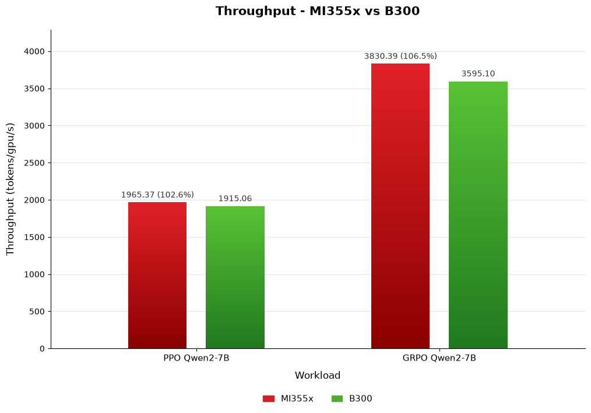

<!---
Copyright (c) 2026 Advanced Micro Devices, Inc. (AMD)

Permission is hereby granted, free of charge, to any person obtaining a copy
of this software and associated documentation files (the "Software"), to deal
in the Software without restriction, including without limitation the rights
to use, copy, modify, merge, publish, distribute, sublicense, and/or sell
copies of the Software, and to permit persons to whom the Software is
furnished to do so, subject to the following conditions:

The above copyright notice and this permission notice shall be included in all
copies or substantial portions of the Software.

THE SOFTWARE IS PROVIDED "AS IS", WITHOUT WARRANTY OF ANY KIND, EXPRESS OR
IMPLIED, INCLUDING BUT NOT LIMITED TO THE WARRANTIES OF MERCHANTABILITY,
FITNESS FOR A PARTICULAR PURPOSE AND NONINFRINGEMENT. IN NO EVENT SHALL THE
AUTHORS OR COPYRIGHT HOLDERS BE LIABLE FOR ANY CLAIM, DAMAGES OR OTHER
LIABILITY, WHETHER IN AN ACTION OF CONTRACT, TORT OR OTHERWISE, ARISING FROM,
OUT OF OR IN CONNECTION WITH THE SOFTWARE OR THE USE OR OTHER DEALINGS IN THE
SOFTWARE.
--->

# Scaling RL with verl on AMD Instinct MI355X: Async Walkthrough and Sync Benchmark

Reinforcement learning (RL) for large language models (LLMs) alternates between two phases: generation (rollout), where the current policy produces responses, and training, where those responses are used to update the policy. In verl, the key design choices are when these phases run relative to each other (synchronously or with overlap) and where they run (colocated on the same GPUs or on separate GPU pools). This blog first explains the differences between the two modes and when to use each.

It then provides a hands-on walkthrough of running verl's two fully asynchronous examples end-to-end on AMD Instinct™ MI355X GPUs with ROCm. You begin with Group Relative Policy Optimization (GRPO) on Qwen2.5-VL-7B-Instruct with the Geometry3k vision-math dataset and the Megatron trainer, and then run Decoupled Clip and Dynamic Sampling Policy Optimization (DAPO) on Qwen2.5-Math-7B with the DAPO-Math-17k and AIME-2024 datasets and the FSDP2 trainer.
Finally, it presents throughput numbers for the synchronous use case on AMD Instinct™ MI355X compared to the NVIDIA B300.

These are two distinct studies: the async walkthroughs characterize pipeline behavior and GPU utilization on AMD Instinct™ MI355X using log-derived idle ratios and corresponding GPU busy-time, and the synchronous section separately compares MI355X and B300 throughput on a different workload.

For more background on verl on ROCm, see the earlier [verl on ROCm blog](https://rocm.blogs.amd.com/artificial-intelligence/verl-large-scale-rocm7/README.html).

## Synchronous vs. Asynchronous RL: What They Are and Use Cases

### Synchronous RL

In a synchronous setup, the trainer does not start an update until a defined rollout unit, typically a full batch, has finished. Rollout and training still take turns, as they do not run in parallel on the same GPUs at the same time.

The most common synchronous mode in verl is colocated training with the hybrid engine, where training weights are offloaded, the vLLM rollout engine generates a batch, and then the system swaps back to run the optimizer step on the same GPUs. verl also supports disaggregated synchronous placement, where rollout and training use separate GPU pools but still follow a batch barrier, and the trainer waits for the full batch before updating.

Synchronous training keeps policy-version lag minimal. Samples are generated with weights that are current or very close to the weights being updated. That makes the loop easier to reason about and usually more stable, with fewer knobs for staleness and off-policy correction. The tradeoff is efficiency. Response lengths are often highly variable, so the batch cannot proceed until the slowest sample finishes. During rollout, workers that finish early can sit idle waiting on stragglers, and during training, no new rollouts are produced. On colocated setups, there is also overhead from switching between training and inference.

### Asynchronous RL

In an asynchronous setup, rollout and training overlap in time, usually on disaggregated GPU pools. While the trainer updates weights on its GPUs, the rollout fleet continues generating samples on separate GPUs. Weights are broadcast periodically (for example, via RCCL), and the trainer consumes samples from a buffer rather than waiting for one synchronized batch to complete.

verl supports more than one async mode:

- One-step-off async overlaps training on batch t with generation of batch t+1, with roughly one step of policy lag. See the [One Step Off Async Trainer documentation](https://verl.readthedocs.io/en/latest/advance/one_step_off.html).

- Fully Async Policy streams samples one at a time, with tunable staleness (`staleness_threshold`), sync frequency (`trigger_parameter_sync_step`), and partial rollout across weight updates. This is what the walkthroughs below use. See the [Fully Async Policy documentation](https://verl.readthedocs.io/en/latest/advance/fully_async.html).

Async training reduces long-tail stalls and keeps training GPUs busy, especially when generation dominates wall-clock time. The cost is bounded off-policy staleness (samples may come from slightly older weights), plus extra orchestration: separate resource pools, weight sync, and often rollout correction or importance-sampling settings when lag grows.

Note: Disaggregated placement does not by itself mean asynchronous. verl's fully async framework can also run in synchronous on-policy mode (for example, `staleness_threshold=0`). The async and sync distinction is about overlap, not only about separate fleets.

### When to Use: Synchronous vs. Asynchronous?

| Synchronous | Asynchronous |
| --- | --- |
| Responses are short and fairly uniform, so there's little long-tail idle time to reclaim | Generation is long and highly variable (long-chain reasoning, agentic/multi-turn, vision-math) where long-tail rollouts dominate wall-clock time |
| Requires a minimal policy-version lag for stability, simpler debugging, or easier run-to-run comparison | Can allocate separate GPU pools for rollout and training and want to scale each side independently |
| Smaller scale, prefer fewer tuning knobs, or have a limited GPU budget (colocated sync fits on fewer GPUs) | Can tolerate bounded off-policy staleness in exchange for higher throughput and shorter iteration cycles (and will tune staleness, sync frequency, and rollout correction) |
| Getting started with verl or reproducing published colocated baselines | Training at larger scale, where utilization gains from overlap compound |

## Fully Async Policy

In reinforcement learning, generation length can be highly variable: many prompts within a single batch finish quickly, while a handful generate very long responses. Because the trainer must wait for the slowest sample in the batch, these long-tail generations stall the entire RL workflow. The training GPUs sit idle waiting on a few stragglers, and overall throughput is gated by the worst-case rollout rather than the average one.

[verl](https://github.com/ROCm/verl/tree/amd-integration)'s Fully Async Policy trainer resolves this issue by physically separating the rollout and training fleets and letting them run at the same time. The following sections walk through both examples end-to-end: first the GRPO example on Qwen2.5-VL-7B-Instruct (Geometry3k vision-math, Megatron trainer), and then the DAPO example on Qwen2.5-Math-7B (DAPO-Math-17k and AIME-2024, FSDP2 trainer).

---

## Qwen2.5-VL-7B-Instruct on the Geometry3k Vision-Math Dataset, Megatron Trainer

### What the Fully Async Policy Trainer Gives You

This section walks through the GRPO example end-to-end, starting with what the Fully Async Policy trainer provides.

The fully asynchronous training system decouples the Trainer and the Rollouter and supports asynchronous sample generation and training. Because rollout and training own separate resources, they can be allocated more flexibly and support more flexible training logic. Concretely, the design provides:

- **Resource isolation**: Unlike a hybrid engine, the Rollouter and Trainer use separate GPUs. Each fleet is sized independently.
- **Parallel generation and training**: While the Trainer updates weights, the Rollouter is already generating the next samples.
- **Multi-step asynchronous**: Compared to one step off policy, it supports asynchronous settings from 0.x steps to multiple steps, making the asynchronous solution more flexible.
- **RCCL parameter synchronization**: Weight broadcasts from Trainer to Rollouter use the ROCm Collective Communication Library (RCCL) collective communication primitives.
- **Streaming inference and training**: The Rollouter emits samples one at a time; a single sample is the minimum transmission unit.
- **Freshness control**: `async_training.staleness_threshold` bounds how stale a sample can be and still be trained on.
- **Partial rollout**: During parameter sync, in-flight rollouts are paused (`sleep()`) and resumed (`resume()`) rather than discarded, so you avoid paying the cost of regenerating them.

The supported training modes are Megatron and Fully Sharded Data Parallel (FSDP), with vLLM (server mode, AgentLoop) used for rollout.

> Background reading: the [official fully async docs](https://verl.readthedocs.io/en/latest/advance/fully_async.html).

---

### GRPO Experiment at a Glance

This GRPO run is a demonstration to validate the async pipeline's resource split, weight sync and partial rollout rather than model quality. The model is rewarded even as responses hit the truncation limit.

The following table summarizes the hardware and software configuration used for this run.

| Item | Value |
| --- | --- |
| Hardware | 8× AMD Instinct MI355X (gfx950) |
| Software stack | ROCm 7.0.2, PyTorch 2.9.1 (ROCm), vLLM, Megatron-core 0.16.0, TransformerEngine (ROCm) |
| Docker image | [rocm/verl:verl-0.7.1.amd0_rocm7.0.2_ubuntu22.04_py3.12_vllm0.20.2](https://hub.docker.com/layers/rocm/verl/verl-0.7.1.amd0_rocm7.0.2_ubuntu22.04_py3.12_vllm0.20.2/images/sha256-64072e02ef3fc364a0bef09e71c0f4b3ae32ba6fc65e4d121a4736a538aa2bb8) |
| Model | Qwen2.5-VL-7B-Instruct (approx. 16 GB, 5 safetensors shards) |
| Dataset | hiyouga/geometry3k → 2,101 train / 300 val / 601 test |
| Algorithm | GRPO, fully async policy, Megatron trainer + vLLM rollout |
| GPU split | 4 GPUs training (TP=2) + 4 GPUs rollout (vLLM, TP=1) |

---

### Step 1: Pull the Docker Image

Pull the [Docker image](https://hub.docker.com/layers/rocm/verl/verl-0.7.1.amd0_rocm7.0.2_ubuntu22.04_py3.12_vllm0.20.2/images/sha256-64072e02ef3fc364a0bef09e71c0f4b3ae32ba6fc65e4d121a4736a538aa2bb8):

```shell
docker pull rocm/verl:verl-0.7.1.amd0_rocm7.0.2_ubuntu22.04_py3.12_vllm0.20.2
```

---

### Step 2: Launch the Container

Launch the container with the following command:

```shell
docker run -it --name verl-release --device /dev/kfd --device /dev/dri \
    --network=host \
    --group-add video --cap-add=SYS_PTRACE --security-opt seccomp=unconfined \
    --shm-size=2048g \
    --ulimit memlock=-1 --ulimit stack=67108864 \
    -w /workspace \
    rocm/verl:verl-0.7.1.amd0_rocm7.0.2_ubuntu22.04_py3.12_vllm0.20.2 \
    /bin/bash
```

What the important flags do:

- `--device /dev/kfd --device /dev/dri` + `--group-add video` expose the AMD GPUs to the container.
- `--shm-size=2048g` gives Ray and the rollout workers plenty of shared memory for inter-process sample passing.
- `--ulimit memlock=-1 --ulimit stack=67108864` are required for RCCL/registered-memory pinning and deep stacks.
- `-w /workspace` drops the user in the working directory where the verl repo already lives (`/workspace/verl`).

Sanity-check the environment inside the container:

```shell
python3 -c "import verl; print('verl OK:', verl.__file__)"
rocm-smi --showproductname        # should list 8 gfx950 GPUs
```

This confirms `verl` is imported from `/workspace/verl/verl/__init__.py` and all 8 MI355X (gfx950) GPUs are visible.

---

### Step 3: Download and Prepare Data and Model

The example ships with a preparation script (`prepare_geo3k_qwen25vl_7b_megatron_4_4.sh`) for downloading the raw dataset, preprocessing it into parquet, and downloading the model. Inside the container run:

```shell
export HF_TOKEN=your_token

bash /workspace/verl/verl/experimental/fully_async_policy/shell/data_model_preparation/prepare_geo3k_qwen25vl_7b_megatron_4_4.sh
```

By default it writes:

- Dataset → `${HOME}/data/geo3k/{train,test}.parquet`
- Model → `${HOME}/models/Qwen2.5-VL-7B-Instruct`

Under the hood it:

1. verifies `verl` is importable
2. `hf download`s `hiyouga/geometry3k`
3. runs `examples/data_preprocess/geo3k.py` to emit parquet
4. `hf download`s `Qwen/Qwen2.5-VL-7B-Instruct`. The relevant slice of the `prepare.log`:

```text
✓ Downloaded  path: /root/downloads/datasets/hiyouga_geometry3k
Preprocessing Geometry3k to parquet in /root/data/geo3k...
Generating train split:      100%|██████████| 2101/2101
Generating validation split: 100%|██████████| 300/300
Generating test split:       100%|██████████| 601/601
...
Downloading model Qwen/Qwen2.5-VL-7B-Instruct to /root/models/Qwen2.5-VL-7B-Instruct...
Fetching 16 files: 100%|██████████| 16/16
```

After finishing, the output will look like:

```text
/root/data/geo3k/train.parquet   (approx. 43 MB)
/root/data/geo3k/test.parquet    (approx. 12 MB)
/root/models/Qwen2.5-VL-7B-Instruct/   (16 GB, 5× *.safetensors, config.json present)
```

---

### Step 4: Training Script

The experiment runs `/workspace/verl/verl/experimental/fully_async_policy/shell/geo3k_qwen25vl_7b_megatron_4_4.sh`. It launches fully asynchronous GRPO for Qwen2.5-VL-7B on Geometry3k using the Megatron trainer config.

**Resource split: this is the heart of "fully async".** With 8 GPUs, the script dedicates 4 to rollout and 4 to training:

```bash
NGPUS_PER_NODE=8
n_gpus_rollout=4
n_gpus_training=$((NGPUS_PER_NODE - n_gpus_rollout))   # = 4
```

These map onto two independent resource pools at the bottom of the launch command:

```bash
trainer.nnodes=1   trainer.n_gpus_per_node=4     # Megatron trainer fleet
rollout.nnodes=1   rollout.n_gpus_per_node=4     # vLLM rollout fleet
```

**Async behavior knobs:**

```bash
staleness_threshold=0.1            # how stale a sample may be and still be trained on
trigger_parameter_sync_step=4      # push new weights to rollout every 4 local steps
require_batches=2                  # batches to accumulate before a trainer step
partial_rollout=True               # pause/resume in-flight rollouts across weight syncs
n_resp_per_prompt=4                # GRPO group size
train_prompt_mini_bsz=128          # PPO mini-batch
total_rollout_steps=$((512*100))   # rollout-step budget that bounds the run
```

**Algorithm + parallelism:**

- `algorithm.adv_estimator=grpo`, `use_kl_loss=True`, `kl_loss_coef=0.01`, `kl_loss_type=low_var_kl`.
- Trainer: Megatron with `tensor_model_parallel_size=2`, full CPU offload of params/grads/optimizer (`param_offload`, `grad_offload`, `optimizer_offload`, plus precision-aware optimizer offload): this is what lets a 7B VLM + Megatron fit comfortably on 4 GPUs.
- Rollout: `name=vllm`, `gpu_memory_utilization=0.8`, `max_model_len=32768`, async server mode (`VLLM_USE_V1=1`, `return_raw_chat=True`).

Point the script at the model and launch (see Step 5). If you want the script to find the model automatically, you can instead `export RAY_DATA_HOME=/root` (it then resolves `${RAY_DATA_HOME}/models/Qwen2.5-VL-7B-Instruct`).

---

### Step 5: Run the Experiment

Run the experiment with the following commands:

```shell
export HF_MODEL_PATH=${HOME}/models/Qwen2.5-VL-7B-Instruct
cd /workspace/verl
bash verl/experimental/fully_async_policy/shell/geo3k_qwen25vl_7b_megatron_4_4.sh
```

As the experiment can take several hours, it is recommended to tee the output to a log file so it can be monitored:

```shell
mkdir -p /workspace/logs
bash verl/experimental/fully_async_policy/shell/geo3k_qwen25vl_7b_megatron_4_4.sh \
    2>&1 | tee /workspace/logs/training_$(date +%Y%m%d_%H%M%S).log
```

### Healthy Startup

Ray brings up the workers, and the four vLLM rollout engines initialize and capture HIP or CUDA graphs. The completion of the graph captures indicates the rollout is live.

```text
(vLLMHttpServer) Capturing CUDA graphs (decode, FULL): 100%|██████████| 51/51 [00:01<00:00, 49.14it/s]
... [repeated 3x across cluster]
```

Then the Trainer begins requesting samples from the queue and the first local steps tick over:

```text
(FullyAsyncTrainer) [FullyAsyncTrainer] global_steps: 1 local_trigger_step: 1 trigger_parameter_sync_step: 4
(FullyAsyncTrainer) [FullyAsyncTrainer] Requesting 256 samples from queue
(FullyAsyncTrainer) [FullyAsyncTrainer] Collected 256/256 samples. mq_len: 513
(FullyAsyncTrainer) [BatchUtils] Batch assembly completed in 0.31s
```

A quick `rocm-smi` during the run is the clearest confirmation the async split is working: the four training GPUs sit near full utilization while the four rollout GPUs hold approx.  80% VRAM for the vLLM KV cache and burst as they generate:

```text
GPU[0..3]  GPU use (%): 92–99      # Megatron trainer: compute bound
GPU[4..7]  GPU use (%): 1, VRAM 80%   # vLLM rollout: KV cache resident, bursty
```

---

### GRPO Results

The run completes cleanly after 50 trainer steps (200 global steps), in approx. 11 h, terminating on the `total_rollout_steps` budget:

```text
Training Progress: 100%|██████████| 50/50 [10:58:51<00:00, 790.62s/it]
(FullyAsyncTrainer) [FullyAsyncTrainer] Training stopped by queue termination signal
total time: 39739.00 seconds
(FullyAsyncTaskRunner) [ASYNC MAIN] Training completed or interrupted
```

---

## Fully Async DAPO on Qwen2.5-Math-7B

The same fully async machinery is not tied to one model, dataset, or trainer backend. To demonstrate this, the walkthrough runs a second example, `dapo_7b_math_fsdp2_4_4.sh`, which trains Qwen2.5-Math-7B on text-only math reasoning using the DAPO algorithm and an FSDP2 trainer (instead of Megatron). The Docker pull and launch steps are identical; only the preparation script, training script, and algorithm differ.

### What DAPO Changes

The [verl repository](https://github.com/AMD-Ecosystem/verl/tree/amd-integration) implements DAPO (Decoupled Clip and Dynamic Sampling Policy Optimization), a GRPO-family algorithm tuned for long-chain math reasoning. In this script it keeps GRPO's group-relative advantage (`adv_estimator=grpo`) but layers on the DAPO-specific settings, all visible in the launch command:

- **Clip-Higher**: asymmetric Proximal Policy Optimization (PPO) clipping (`clip_ratio_low=0.2`, `clip_ratio_high=0.28`), so the upper clip is loosened to preserve exploration on rare, high-reward tokens.
- **KL-free objective**: `use_kl_loss=False`, `kl_coef=0.0`. DAPO drops the KL penalty entirely and lets the clip bounds do the regularizing.
- **Token-level loss aggregation**: `loss_agg_mode=token-mean`, which weights long and short responses by their token counts rather than per sequence.
- **Overlong reward shaping**: the `dapo` reward manager with an overlong buffer (`overlong_buffer.len=4096`, `penalty_factor=1.0`, `max_resp_len=8192`) that softly penalizes responses approaching the length cap instead of hard-truncating their reward.
- **Large GRPO groups**: `n_resp_per_prompt=16` samples per prompt, `train_prompt_mini_bsz=32`.

The async knobs mirror the geo3k example (`staleness_threshold=0.1`, `trigger_parameter_sync_step=4`, `partial_rollout=True`) but with `require_batches=4`, and the run is bounded by `total_rollout_steps=$((512*100))`.

### DAPO Experiment at a Glance

In contrast to the geo3k run, this DAPO configuration—clip-higher, a KL-free objective, and overlong reward shaping—produces real learning: AIME-2024 accuracy climbs while response length stays stable.

The following table summarizes the hardware and software configuration used for this run.

| Item | Value |
| --- | --- |
| Hardware | 8× AMD Instinct MI355X (gfx950) |
| Docker image | [rocm/verl:verl-0.7.1.amd0_rocm7.0.2_ubuntu22.04_py3.12_vllm0.20.2](https://hub.docker.com/layers/rocm/verl/verl-0.7.1.amd0_rocm7.0.2_ubuntu22.04_py3.12_vllm0.20.2/images/sha256-64072e02ef3fc364a0bef09e71c0f4b3ae32ba6fc65e4d121a4736a538aa2bb8) |
| Model | Qwen2.5-Math-7B (approx. 15 GB, 4 safetensors shards) |
| Dataset | BytedTsinghua-SIA/DAPO-Math-17k (train, approx. 299 MB parquet) + BytedTsinghua-SIA/AIME-2024 (val, approx. 29 KB) |
| Algorithm | DAPO (GRPO advantage + clip-higher + overlong shaping, KL-free), fully async |
| Trainer backend | FSDP2 (strategy=fsdp2, fsdp_size=2), ref-model CPU offload |
| GPU split | 4 GPUs training (FSDP2) + 4 GPUs rollout (vLLM, TP=1, async server) |
| Response budget | max_prompt_length=2048, max_response_length=8192 |
| Validation (AIME-2024) | acc@1 0.0 → 0.262 peak, 0.242 final |

---

Steps 1 (pull the image) and 2 (launch the container) are identical to the GRPO walkthrough above, so this section picks up at Step 3.

### Step 3 (DAPO): Prepare Data and Model

The prepare script downloads the two parquet datasets and the model, then patches `config.json`. It is a required step that the script header and the release notes both call out:

```shell
export HF_TOKEN=your_token

bash verl/experimental/fully_async_policy/shell/data_model_preparation/prepare_dapo_7b_math_fsdp2_4_4.sh
```

By default it writes (under `RAY_DATA_HOME=${HOME}/verl`):

```text
/root/verl/data/dapo-math-17k.parquet   (approx. 299 MB, train)
/root/verl/data/aime-2024.parquet       (approx. 29 KB, validation)
/root/verl/models/Qwen2.5-Math-7B/      (15 GB, 4× *.safetensors)
```

### Step 4 (DAPO): What's Different in the Script

The script lives at `verl/experimental/fully_async_policy/shell/dapo_7b_math_fsdp2_4_4.sh`. The resource split and async settings are the same idea as geo3k, but the trainer is FSDP2 rather than Megatron:

```bash
NGPUS_PER_NODE=8
n_gpus_rollout=4
n_gpus_training=$((NGPUS_PER_NODE - n_gpus_rollout))   # = 4

actor_rollout_ref.actor.fsdp_config.strategy=fsdp2     # FSDP2 trainer
actor_rollout_ref.actor.fsdp_config.fsdp_size=2
actor_rollout_ref.ref.fsdp_config.param_offload=True   # ref model offloaded to CPU
actor_rollout_ref.model.use_remove_padding=True
actor_rollout_ref.model.use_fused_kernels=True
```

### Step 5 (DAPO): Run It

If only running the DAPO example, run:

```shell
mkdir -p /workspace/logs
```

Run DAPO with the following command:

```shell
cd /workspace/verl
bash verl/experimental/fully_async_policy/shell/dapo_7b_math_fsdp2_4_4.sh \
    2>&1 | tee /workspace/logs/dapo_$(date +%Y%m%d_%H%M%S).log
```

Startup looks the same as Geometry3k: Ray brings up the four vLLM rollout engines, which capture HIP or CUDA graphs and go live, then the FSDP2 trainer begins pulling samples:

```text
(vLLMHttpServer) Capturing CUDA graphs (decode, FULL): 100%|██████████| 51/51 [00:01<00:00, ...]
(FullyAsyncTrainer) [FullyAsyncTrainer] Collected 128/128 samples. mq_len: 74
(FullyAsyncTrainer) [BatchUtils] Batch assembly completed in 0.52s
```

`val_before_train=True` runs one validation pass before any optimization (step 0), giving a clean baseline.

### DAPO Results

The run completes after 100 trainer steps (400 global steps) in 35,901.66 s (approx. 10 h), terminating on the total_rollout_steps budget:

```text
Training Progress: 100%|██████████| 100/100 [9:56:04<00:00, 357.64s/it]
total time: 35901.66 seconds
(FullyAsyncTaskRunner) [ASYNC MAIN] One component completed successfully
(FullyAsyncTrainer) [FullyAsyncTrainer] Training stopped by queue termination signal
```

---

## GRPO vs. DAPO at a Glance

Here is a summary of the experiments derived from the logs collected through internal experimentation as well as `rocm-smi` outputs.

Idle ratio is the fraction of trainer wall-clock spent waiting on the sample queue, parsed from the FullyAsyncTrainer step logs, while peak throughput is the maximum per-step tokens/GPU/s observed over the run, computed over the 4 training GPUs.

| | GRPO (Qwen2.5-VL-7B) | DAPO (Qwen2.5-Math-7B) |
| --- | --- | --- |
| Trainer backend | Megatron (TP=2) | FSDP2 (fsdp_size=2) |
| Algorithm | GRPO (+KL loss) | DAPO (clip-higher, KL-free, overlong shaping) |
| Modality and data | Vision-math (Geometry3k) | Text-only math (DAPO-Math-17k and AIME-2024) |
| Trainer steps | 50 (200 global) | 100 (400 global) |
| Wall-clock | approx. 11 h (39,739 s) | approx. 10 h (35,902 s) |
| Peak throughput | approx. 1,050 tokens/GPU/s | approx. 2,994 tokens/GPU/s |
| Trainer idle ratio | approx. 6–7% | approx. 8–9% |
| Held-out accuracy | 0.0 (plumbing run) | 0.0 → 0.262 peak (0.242 final) |
| Response length | grew into truncation (clip approx. 0.77) | stable approx. 800–890 (clip approx. 0.0) |

The throughput gap is mostly attributable to differences in modality and backend: the text-only Math-7B with an FSDP2 trainer and shorter, well-bounded responses keeps the rollout and update pipeline fuller than the heavier multimodal Megatron path.

---

## Performance Comparison of Synchronous Use Case: AMD Instinct MI355X vs. NVIDIA B300

### Throughput

For the throughput analysis, this section shifts from the async walkthroughs to a separate, synchronous benchmark. These runs use Qwen2-7B in a conventional colocated synchronous setup to derive throughput. The first experiment uses Proximal Policy Optimization (PPO) on Qwen2-7B, while the second uses Group Relative Policy Optimization (GRPO) on the same Qwen2-7B model. More details on the experiments and how to run them can be found at [Reinforcement Learning from Human Feedback on AMD GPUs with verl and ROCm 7.0.0](https://rocm.blogs.amd.com/artificial-intelligence/verl-large-scale-rocm7/README.html).

Both experiments are run with Tensor Parallelism (TP) = 2. In the GRPO configuration, `n` denotes the number of responses sampled per prompt (the group size); GRPO requires `n > 1` because its advantage estimate is computed across the group. This is a key difference from PPO: PPO trains a separate critic model to estimate the value (expected return) used as the advantage baseline, whereas GRPO removes the critic and instead derives the baseline directly from the group: normalizing each response's reward by the group's mean (and standard deviation) to compute its advantage.

The results of this experiment are summarized in the table and visualized in the figure below.

| Workload | Variant | MI355X (tokens/GPU/s) | B300 (tokens/GPU/s) |
| --- | --- | --- | --- |
| **PPO Qwen2-7B** (TP=2) | baseline | 1965.37[^1] | 1915.06[^1] |
| **GRPO Qwen2-7B** (TP=2, n=5) | baseline | 3830.39[^2] | 3595.10[^2] |



*Figure 1: Throughput (tokens/GPU/s) comparison of AMD Instinct MI355X vs. NVIDIA B300 on PPO and GRPO Qwen2-7B workloads at baseline.*

In these benchmarks, on both Qwen workloads, MI355X measured higher throughput than B300 at default settings.

---

## Takeaways

This section summarizes the key results from both experiments:

- **The async split sustains high GPU utilization.** Dedicating 4 GPUs to vLLM rollout and 4 to the trainer kept the training GPUs busy roughly 91–94% of the time across both runs (about 93–94% for GRPO and 91–92% for DAPO), consistent with the log-derived idle ratios above, with healthy queues and zero dropped stale samples throughout.
- **DAPO on Math-7B learns.** With clip-higher, a KL-free objective, and overlong reward shaping, AIME-2024 accuracy climbed from 0.0 to a peak of 0.262 (0.242 final) in 100 steps while response length stayed stable. This is a contrast to the geo3k plumbing run.
- **The same async knobs port across backends.** `staleness_threshold`, `trigger_parameter_sync_step`, and `partial_rollout` behaved identically on Megatron and FSDP2. Together, they govern how off-policy your training is and how much rollout work you preserve across weight syncs, making the async approach more flexible than one-step off-policy training.
- **Match the reward to the response budget.** DAPO's buffer kept responses off the truncation wall and let accuracy climb. The geo3k run, without length-aware shaping, was rewarded into truncation instead. Separate quality runs from plumbing runs, and add length-aware rewards before judging model quality.
- **Higher throughput on MI355X.** In these synchronous benchmarks at default settings, MI355X showed higher throughput on both Qwen workloads. See footnotes [^1] and [^2] for methodology.

## Summary

This walkthrough demonstrates verl's Fully Async Policy trainer end-to-end on AMD Instinct™ MI355X GPUs with ROCm. In this setup, physically separating the rollout and training fleets lets generation and weight updates run in parallel so the training GPUs are not stalled waiting on long-tail rollouts and sustain high GPU utilization. By dedicating 4 GPUs to vLLM rollout and 4 to the trainer, the training GPUs were busy approx. 91–94% of the time across both runs.

The walkthrough shows two examples that share the same async machinery but differ in model, data, algorithm, and trainer backend: GRPO on Qwen2.5-VL-7B-Instruct (Geometry3k vision-math, Megatron trainer) and DAPO on Qwen2.5-Math-7B (DAPO-Math-17k / AIME-2024, FSDP2 trainer). The same async knobs (`staleness_threshold`, `trigger_parameter_sync_step`, and `partial_rollout`) port cleanly across both Megatron and FSDP2, and full CPU offload keeps a 7B model comfortable on just 4 training GPUs.

## Acknowledgements

The authors would also like to acknowledge the broader AMD team whose contributions were instrumental in this work: Jared Bowden, Dong Li, Gowtham Ramesh, Jiang Liu, Zhenyu Gu, Zicheng Liu, Emad Barsoum, Marco Grond, Lillian Zheng, Ramesh Mantha, Wenbo Shao, Pei Zhang, Matthew Steggink, Gazi Rashid, Bhavesh Lad, Pankaj Gupta, Aakash Sudhanwa, Joseph Macaranas, Kiran Thumma, Ian Dass, Ram Seenivasan, Amit Kumar, Anisha Sankar, Saad Rahim, Ehud Sharlin, Liam Berry, Cindy Lee, Lindsey Brown, Catherine Ortega, Ashley Cowart, Keith Anderson, Lorelei Misajlovich, Jennifer Barry.

## Disclaimers

Third-party content is licensed to you directly by the third party that owns the content and is not licensed to you by AMD. ALL LINKED THIRD-PARTY CONTENT IS PROVIDED “AS IS” WITHOUT A WARRANTY OF ANY KIND. USE OF SUCH THIRD-PARTY CONTENT IS DONE AT YOUR SOLE DISCRETION AND UNDER NO CIRCUMSTANCES WILL AMD BE LIABLE TO YOU FOR ANY THIRD-PARTY CONTENT. YOU ASSUME ALL RISK AND ARE SOLELY RESPONSIBLE FOR ANY DAMAGES THAT MAY ARISE FROM YOUR USE OF THIRD-PARTY CONTENT.

The information contained herein is for informational purposes only and is subject to change without notice. While every precaution has been taken in the preparation of this document, it may contain technical inaccuracies, omissions and typographical errors, and AMD is under no obligation to update or otherwise correct this information. Advanced Micro Devices, Inc. makes no representations or warranties with respect to the accuracy or completeness of the contents of this document, and assumes no liability of any kind, including the implied warranties of noninfringement, merchantability or fitness for particular purposes, with respect to the operation or use of AMD hardware, software or other products described herein. No license, including implied or arising by estoppel, to any intellectual property rights is granted by this document. Terms and limitations applicable to the purchase or use of AMD products are as set forth in a signed agreement between the parties or in AMD’s Standard Terms and Conditions of Sale. GD-18u.

©2026 Advanced Micro Devices, Inc. All rights reserved. AMD, the AMD Arrow logo, Instinct, ROCm, and combinations thereof are trademarks of Advanced Micro Devices, Inc. Other product names used in this publication are for identification purposes only and may be trademarks of their respective owners. Certain AMD technologies may require third-party enablement or activation. Supported features may vary by operating system. Please confirm with the system manufacturer for specific features. No technology or product can be completely secure.

[^1]: Based on calculations by AMD engineering as of June 2026, measuring the RL training throughput (tokens/GPU/second) using the verl open-source software library (release 0.7.1) on an AMD Instinct MI355X 8x GPU platform powered by AMD CDNA™ 4 architecture, versus an NVIDIA B300 8x GPU platform with NVIDIA "Blackwell" architecture, using the Qwen2-7B-Instruct model with the PPO algorithm, with TP_VALUE of 2, INFERENCE_BATCH_SIZE of 32, and GPU_MEMORY_UTILIZATION of 0.4. For more details, see: https://github.com/ROCm/verl. Server manufacturers may vary in configurations, yielding different results. Performance may vary based on the use of the latest drivers and optimizations (MI350-079).

[^2]: Based on calculations by AMD engineering as of June 2026, measuring the RL training throughput (tokens/GPU/second) using the verl open-source software library (release 0.7.1) on an AMD Instinct MI355X 8x GPU platform powered by AMD CDNA™ 4 architecture, versus an NVIDIA B300 8x GPU platform with NVIDIA "Blackwell" architecture, to measure tokens/GPU/second using the Qwen2-7B-Instruct model with the GRPO algorithm, with TP_VALUE of 2, rollout.n of 5, INFERENCE_BATCH_SIZE of 40, and GPU_MEMORY_UTILIZATION of 0.4. For more details, see: https://github.com/ROCm/verl. Server manufacturers may vary in configurations, yielding different results. Performance may vary based on the use of the latest drivers and optimizations (MI350-080)
