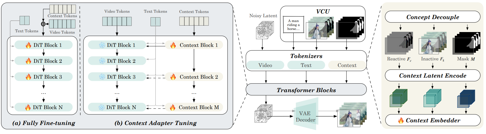

<!---
Copyright (c) 2025 Advanced Micro Devices, Inc. (AMD)

Permission is hereby granted, free of charge, to any person obtaining a copy
of this software and associated documentation files (the "Software"), to deal
in the Software without restriction, including without limitation the rights
to use, copy, modify, merge, publish, distribute, sublicense, and/or sell
copies of the Software, and to permit persons to whom the Software is
furnished to do so, subject to the following conditions:

The above copyright notice and this permission notice shall be included in all
copies or substantial portions of the Software.

THE SOFTWARE IS PROVIDED "AS IS", WITHOUT WARRANTY OF ANY KIND, EXPRESS OR
IMPLIED, INCLUDING BUT NOT LIMITED TO THE WARRANTIES OF MERCHANTABILITY,
FITNESS FOR A PARTICULAR PURPOSE AND NONINFRINGEMENT. IN NO EVENT SHALL THE
AUTHORS OR COPYRIGHT HOLDERS BE LIABLE FOR ANY CLAIM, DAMAGES OR OTHER
LIABILITY, WHETHER IN AN ACTION OF CONTRACT, TORT OR OTHERWISE, ARISING FROM,
OUT OF OR IN CONNECTION WITH THE SOFTWARE OR THE USE OR OTHER DEALINGS IN THE
SOFTWARE.
--->

# All-in-One Video Editing with VACE on AMD Instinct GPUs

This blog takes a closer look at recent advances in AI-powered video editing, highlighting how modern diffusion models enable users to accomplish various video editing tasks on AMD Instinct GPUs using Alibaba’s VACE model.

While diffusion transformers have shown impressive results in generating high-quality images and videos, combining video generation and various editing tasks into a single, seamless process remains a technical challenge. To address these challenges, [VACE: All-in-One Video Creation and Editing](https://arxiv.org/abs/2503.07598), built on the WAN series models, introduces a unified approach for video editing, including:

- **Text-to-Video (T2V):** Generate videos from text descriptions.
- **Reference-to-Video (R2V):** Use images or videos as references to guide generation.
- **Video-to-Video Editing (V2V):** Apply edits to entire videos, such as style transfer or colorization.
- **Masked Video-to-Video Editing (MV2V):** Edit specific regions within a video using spatiotemporal masks.
- **Compositional Tasks:**
By combining these core task types, VACE enables complex and creative video editing scenarios in a single run.
*For example: Extend a video scene, change the color of an object, and add a new object in a masked area—all at once.*

## VACE Framework


<figure style="text-align: left;">
  <figcaption>
    Overview of VACE Framework. The Video Condition Unit (VCU) combines the elements textual input (T), frame sequence (F), and mask sequence (M) to allow multiple editing tasks with the same format. <br>
    <a href="https://arxiv.org/pdf/2503.07598">Source: VACE Technical Report</a>
  </figcaption>
</figure>

The VACE framework streamlines video editing tasks by introducing the Video Condition Unit (VCU, visualized in image above), which unifies inputs for different scenarios. The VCU combines three elements: textual input (T), frame sequence (F), and mask sequence (M), represented as **V = [T; F; M]**. This structure allows the model to handle a variety of editing tasks using a consistent format.

For most tasks, textual input provides overall direction, while the frame sequence and mask sequence specify which parts of the video to modify or preserve. This unified approach makes it easier to switch between editing modes and ensures the model can interpret diverse scenarios efficiently.

Context tokenization further divides the video into editable and non-editable regions, so only the intended areas are changed. The context adapter adds task-specific information, helping maintain smooth and coherent edits throughout the video.

Together, these components enable flexible and efficient video editing, supporting everything from simple text-driven generation to more complex, multi-step edits.

This blog is part of our team's ongoing efforts to ensure ease-of-use and maximizing performance for various video generation related tasks as exemplified by recent blog posts on [Fine-tuning of video generation model Wan2.2](https://rocm.blogs.amd.com/artificial-intelligence/finetuning-wan-part1/README.html), [Accelerating FastVideo on AMD GPUs with TeaCache](https://rocm.blogs.amd.com/artificial-intelligence/fastvideo-v1/README.html) and [ComfyUI](https://rocm.blogs.amd.com/software-tools-optimization/comfyui-on-amd/README.html) - a graphical user interface for video generation.

# Implementation

In the following sections, you’ll find step-by-step instructions for running VACE video editing tasks across different use cases.

## Environment Setup

Inference was performed using the ROCm vLLM Docker image (rocm/vllm-dev), which provides a prebuilt, optimized environment for inference on AMD Instinct MI325X and MI300X accelerators. The code was also tested in the PyTorch for ROCm training Docker (rocm/pytorch-training:v25.6). For details on supported hardware, see the [list of supported OSs and AMD hardware](https://rocm.docs.amd.com/projects/install-on-linux/en/latest/reference/system-requirements.html).
For this blog, we used an AMD Instinct MI300X GPU with 192 GB VRAM, which accommodates both the Wan2.1-VACE-1.3B and Wan2.1-VACE-14B models.

To get started, pull and run the docker container with the code below in a Linux shell:

```bash
docker run -it --ipc=host --cap-add=SYS_PTRACE --network=host \
  --device=/dev/kfd --device=/dev/dri --security-opt seccomp=unconfined \
  --group-add video --privileged --name vace \
  -v $(pwd):/workspace -w /workspace rocm/pytorch-training:v25.6
```

## VACE Inference

Clone the VACE repository and install the required dependencies:

```bash
git clone https://github.com/ali-vilab/VACE.git
cd VACE
pip install -r requirements.txt
pip install "huggingface_hub[cli]"
# If you want to use Wan2.1-based VACE.
pip install wan@git+https://github.com/Wan-Video/Wan2.1 
# If you want to use LTX-Video-0.9-based VACE. Here we need this for outpainting tasks.
pip install ltx-video@git+https://github.com/Lightricks/LTX-Video@ltx-video-0.9.1 sentencepiece --no-deps
```

Download the VACE model weights. VACE is available in both 1.3B and 14B parameter versions. Here, we use the smaller 1.3B model for a single GPU setup:

```bash
huggingface-cli download Wan-AI/Wan2.1-VACE-1.3B --local-dir "models/Wan2.1-VACE-1.3B"
```

Preprocessing is required for tasks that need extra input data or transformations, such as generating masks or reference features.  
Download annotators if you need preprocessing tools

```bash
pip install -r requirements/annotator.txt
# Install Git LFS (required for large files):
apt update && apt install -y git-lfs
git lfs install
# Download VACE-Annotators to <repo-root>/models/
git clone https://huggingface.co/ali-vilab/VACE-Annotators models/VACE-Annotators
```

Now you are ready to edit videos! The WAN video generation model runs under the hood, so you can generate videos with the original [WAN 2.1](https://github.com/Wan-Video/Wan2.1) from VACE as well. More detailed prompts will generally improve video quality.

```bash
python vace/vace_wan_inference.py \
--prompt "Summer beach vacation style, a white cat wearing sunglasses sits on a surfboard. The fluffy-furred feline gazes directly at the camera with a relaxed expression. Blurred beach scenery forms the background featuring crystal-clear waters, distant green hills, and a blue sky dotted with white clouds. The cat assumes a naturally relaxed posture, as if savoring the sea breeze and warm sunlight. A close-up shot highlights the feline's intricate details and the refreshing atmosphere of the seaside."
```

## Use Case: Inpainting

Let’s use the generated video as input for an inpainting task—changing the style of the sunglasses.

```bash
# Replace `<path-to-input-video>` with the path to your input video.
python vace/vace_pipeline.py \
  --base wan \
  --task inpainting \
  --mode salientmasktrack \
  --maskaug_mode original_expand \
  --maskaug_ratio 0.1 \
  --video <path-to-input-video> \
  --prompt "The cat is wearing pink sunglasses. Everything else remains unchanged."
```

Now you can compare the original video and the edited one.

```{video} videos/vace_original_vs_inpainting.mp4
:width: 960
:height: 882
:controls:
```

## Use Case: Outpainting

Suppose you want to outpaint the video by adding seagulls to the background:

```bash
# Replace `<path-to-input-video>` with the path to your input video.
python vace/vace_pipeline.py --base wan --task outpainting --direction 'up,down,left,right'  \
--expand_ratio 0.8  \
--video <path-to-input-video> \
--prompt "The surfboard stretches further along the sandy beach beneath the cat, revealing more of its colorful design and sunlit contours. Above, a flock of seagulls soars through the clear blue sky, bringing a sense of movement to the peaceful coastal scene. The background remains gently blurred to keep the focus on the cat."
```

```{video} videos/vace_outpaint_video.mp4
:width: 480
:height: 832
:controls:
```

The above code runs video preprocessing and model inference sequentially in a pipeline.
To have more flexible control over the input, before VACE model inference, preprocess inputs by running `vace_preprocess.py` first, followed by `vace_wan_inference.py`. For detailed instructions refer to [VACE User Guide](https://github.com/ali-vilab/VACE/blob/main/UserGuide.md).

Multi-GPU parallel inference on AMD Instinct GPUs is also possible with minor code changes. More example code and output videos are available in the [code repository](https://github.com/silogen/ai-samples).

## Summary

This blog highlights how recent advances in AI and unified frameworks like VACE are transforming video editing, making complex tasks more accessible and efficient. By leveraging the performance and scalability of AMD Instinct GPUs, users can take full advantage of these cutting-edge models for creative video workflows. As AI-driven video editing continues to evolve, AMD hardware is well-positioned to support the next generation of content creation. We are actively tracking emerging technologies and products in video generation/editing domains, aiming to deliver an optimized and seamless user experience for video generation on AMD GPUs. Our focus is on ensuring ease-of-use and maximizing performance for various video generation related tasks as exemplified by recent blog posts on [Fine-tuning of video generation model Wan2.2](https://rocm.blogs.amd.com/artificial-intelligence/finetuning-wan-part1/README.html), [Accelerating FastVideo on AMD GPUs with TeaCache](https://rocm.blogs.amd.com/artificial-intelligence/fastvideo-v1/README.html) and [ComfyUI](https://rocm.blogs.amd.com/software-tools-optimization/comfyui-on-amd/README.html) - a graphical user interface for video generation. In parallel, we are developing additional playbooks, including model inference, model serving, and video generation workflow management, etc.

## Acknowledgement

We gratefully acknowledge the authors of the [VACE Technical Report](https://arxiv.org/abs/2503.07598), whose significant work in the GenAI community provided the foundation for this blog.

## Disclaimers

Third-party content is licensed to you directly by the third party that owns the
content and is not licensed to you by AMD. ALL LINKED THIRD-PARTY CONTENT IS
PROVIDED “AS IS” WITHOUT A WARRANTY OF ANY KIND. USE OF SUCH THIRD-PARTY CONTENT
IS DONE AT YOUR SOLE DISCRETION AND UNDER NO CIRCUMSTANCES WILL AMD BE LIABLE TO
YOU FOR ANY THIRD-PARTY CONTENT. YOU ASSUME ALL RISK AND ARE SOLELY RESPONSIBLE
FOR ANY DAMAGES THAT MAY ARISE FROM YOUR USE OF THIRD-PARTY CONTENT.
