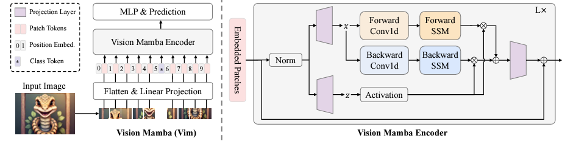

# Vision Mamba on AMD GPU with ROCm

[State Space Models (SSMs)](https://arxiv.org/abs/2111.00396), such as [Mamba](https://arxiv.org/abs/2312.00752), have emerged as a potential alternative to Transformer models. Vision backbones using only SSMs have yielded promising results. For more information about SSMs and Mamba's performance on AMD hardware, see [Mamba on AMD GPUs with ROCm](https://rocm.blogs.amd.com/artificial-intelligence/mamba/README.html).
This blog explores [Vision Mamba](https://arxiv.org/abs/2401.09417) (Vim), an innovative and efficient backbone for vision tasks and evaluate its performance on AMD GPUs with ROCm. We'll start with a brief introduction to Vision Mamba, followed by a step-by-step guide on training and running inference with Vision Mamba on AMD GPUs using ROCm.

## Vision Mamba

Vision Mamba (Vim) is inspired by the Mamba in language modeling and it extends its principles to vision tasks. However, due to the inherent differences between language and vision tasks, directly applying Mamba to vision tasks is ineffective. This is because Mamba’s unidirectional modeling, suited for sequential data, lacks positional awareness crucial for vision tasks. To overcome this, Vim introduces a bidirectional selective state space model (SSM) for global visual context modeling and incorporates position embeddings for location-aware visual recognition.

Vim splits the input image into patches that are linearly projected into tokens. These patches are passed as a token sequence to the Vim block, which normalizes the token sequence and linearly projects it into x and z. The x sequence is processed from both forward and backward directions. The outputs from these backwards and forwards passes are gated by z and combined to produce the final output token sequence. Position embeddings provide spatial awareness, making Vim more robust for dense prediction tasks. For more information about Vim, see [Vision Mamba: Efficient Visual Representation Learning with Bidirectional State Space Model](https://arxiv.org/abs/2401.09417).



Image source: [Vision Mamba paper](https://arxiv.org/abs/2401.09417)

## Preparation and Setup

The source code for Vim can be found in the [Vision Mamba repo](https://github.com/hustvl/Vim).
The [causal-conv1d](https://github.com/hustvl/Vim/tree/main/causal-conv1d) and [mamba-1p1p1](https://github.com/hustvl/Vim/tree/main/mamba-1p1p1) folders contain the CUDA source code which adds hardware-aware optimization for bidirectional Mamba. To run this code on ROCm, the CUDA source code needs to be translated to HIP C++. [HIP](https://github.com/ROCm/HIP) is a C++ Runtime API and Kernel Language that allows developers to create portable applications for AMD and NVIDIA GPUs using the same source code. PyTorch uses a tool called [Hipify_torch](https://github.com/ROCm/hipify_torch) to translate source code from CUDA to HIP, making custom kernels that can run on ROCm. Translation is done internally within PyTorch when building the CUDA extension, ensuring a seamless experience when using custom kernels on ROCm.
For more information on HIPIFY, see [the HIPIFY documentation](https://rocm.docs.amd.com/projects/HIPIFY/en/latest/index.html).

For comprehensive support details about the setup, please refer to the [ROCm documentation](https://rocm.docs.amd.com/projects/install-on-linux/en/latest/). This blog was created using the following setup.

* Hardware & OS:
  * [AMD Instinct GPU](https://www.amd.com/en/products/accelerators/instinct.html)
  * Ubuntu 22.04.3 LTS
* Software:
  * [ROCm 6.1+](https://rocm.docs.amd.com/projects/install-on-linux/en/develop/how-to/amdgpu-install.html)
  * [PyTorch 2.1+ for ROCm](https://rocm.docs.amd.com/projects/install-on-linux/en/latest/how-to/3rd-party/pytorch-install.html)
  
For this blog, we used the [`rocm/pytorch:rocm6.2_ubuntu20.04_py3.9_pytorch_release_2.1.2`](https://hub.docker.com/layers/rocm/pytorch/rocm6.2_ubuntu20.04_py3.9_pytorch_release_2.1.2/images/sha256-58186da550e3d83c5b598ce0c1f581206eabd82c85bd77d22b34f5695d749762?context=explore) docker image on a Linux machine equipped with MI210 GPUs and the AMD GPU driver version 6.7.0.

<!-- > **Note**: *If your machine does not have ROCm installed or if you need to update the driver, follow the steps show in [ROCm installation via AMDGPU installer](https://rocm.docs.amd.com/projects/install-on-linux/en/develop/how-to/amdgpu-install.html). In this blog, We install ROCm, including the GPU driver, using the package [`amdgpu-install_6.1.60101-1_all.deb`](https://repo.radeon.com/amdgpu-install/6.1.1/ubuntu/jammy/amdgpu-install_6.1.60101-1_all.deb) for ROCm.* -->

## Getting Started

Use the [`rocm/pytorch:rocm6.2_ubuntu20.04_py3.9_pytorch_release_2.1.2`](https://hub.docker.com/layers/rocm/pytorch/rocm6.2_ubuntu20.04_py3.9_pytorch_release_2.1.2/images/sha256-58186da550e3d83c5b598ce0c1f581206eabd82c85bd77d22b34f5695d749762?context=explore) Docker image and build Vision Mamba in the container.

```bash
docker pull rocm/pytorch:rocm6.2_ubuntu20.04_py3.9_pytorch_release_2.1.2
docker run -it --name vision_mamba --rm --ipc=host \
            --device=/dev/kfd --device=/dev/dri/ \
            --group-add=video --shm-size 8G \
            rocm/pytorch:rocm6.2_ubuntu20.04_py3.9_pytorch_release_2.1.2
```

Build and install Vision Mamba on AMD GPU with ROCm.

```bash
git clone https://github.com/hustvl/Vim
cd Vim 

pip install -r vim/vim_requirements.txt
# Install hipified packages required by Vision Mamba
pip install -e ./causal-conv1d
pip install -e ./mamba-1p1p1
```

There are three versions of the model for Vim:

| Model | #param. | Top-1 Acc. | Top-5 Acc. |
|:------------:|:-------------:|:----------:|:----------:|
| [Vim-tiny](https://huggingface.co/hustvl/Vim-tiny-midclstok)    |       7M       |   76.1   | 93.0 |
| [Vim-tiny<sup>+</sup>](https://huggingface.co/hustvl/Vim-tiny-midclstok)    |       7M       |   78.3   | 94.2 |
| [Vim-small](https://huggingface.co/hustvl/Vim-small-midclstok)    |       26M       |   80.5   | 95.1 |
| [Vim-small<sup>+</sup>](https://huggingface.co/hustvl/Vim-small-midclstok)    |       26M       |   81.6   | 95.4 |
| [Vim-base](https://huggingface.co/hustvl/Vim-base-midclstok)    |       98M       |   81.9   | 95.8 |

This blog uses Vim-small<sup>+</sup> in the following test.
> **Note** <sup>+</sup> means the model has been fine-tuned at finer granularity with short schedule. Please use the following command to download the weights for Vim-small.

```bash
wget https://huggingface.co/hustvl/Vim-small-midclstok/resolve/main/vim_s_midclstok_ft_81p6acc.pth
```

After completing these steps, you will obtain a weight file for Vim-small (e.g., vim_s_midclstok_ft_81p6acc.pth).

>**Note:**
If you only need to do inference, then you can skip the following dataset downloading. The dataset is only required for training and accuracy testing.

Use the [ImageNet dataset](https://www.image-net.org/challenges/LSVRC/index.php) for training and testing. ImageNet is a popular benchmark for vision models. Use the following command to download it. Depending on your network speed, this process may take several hours.

```bash
mkdir image_dataset
cd image_dataset
wget https://image-net.org/data/ILSVRC/2012/ILSVRC2012_img_val.tar
wget https://image-net.org/data/ILSVRC/2012/ILSVRC2012_img_train.tar
mkdir train && mv ILSVRC2012_img_train.tar train/ && cd train
tar -xvf ILSVRC2012_img_train.tar && rm -f ILSVRC2012_img_train.tar
# Extract each .tar file into its own directory
find . -name "*.tar" | while read -r NAME; do
    mkdir -p "${NAME%.tar}"
    tar -xvf "${NAME}" -C "${NAME%.tar}" && rm -f "${NAME}"
done

rm train/n04266014/n04266014_10835.JPEG
cd ..
mkdir val && mv ILSVRC2012_img_val.tar val/ && cd val && tar -xvf ILSVRC2012_img_val.tar
wget -qO- https://raw.githubusercontent.com/soumith/imagenetloader.torch/master/valprep.sh | bash
```

Everything is now set up for accuracy testing, training, and inference with Vision Mamba on AMD GPUs using ROCm.

## Accuracy Test

In this section, we will evaluate the performance of Vision Mamba (small) on the ImageNet dataset. The accuracy test will help verify that the model is functioning correctly on AMD GPUs with ROCm.

```bash
cd Vim
python ./vim/main.py --eval --resume ./vim_s_midclstok_ft_81p6acc.pth \
    --model vim_small_patch16_stride8_224_bimambav2_final_pool_mean_abs_pos_embed_with_midclstok_div2  \
    --data-path ./image_dataset
```

The output should be similar to the one below. The full training log can be found in the [ROCm blogs repository](https://github.com/ROCm/rocm-blogs/tree/release/blogs/artificial-intelligence/vision-mamba/srctraining_loglog.txt).

```text
Namespace(batch_size=64, epochs=300, bce_loss=False, unscale_lr=False, model='vim_small_patch16_stride8_224_bimambav2_final_pool_mean_abs_pos_embed_with_midclstok_div2', input_size=224, drop=0.0, drop_path=0.1, model_ema=True, model_ema_decay=0.99996, model_ema_force_cpu=False, opt='adamw', opt_eps=1e-08, opt_betas=None, clip_grad=None, momentum=0.9, weight_decay=0.05, sched='cosine', lr=0.0005, lr_noise=None, lr_noise_pct=0.67, lr_noise_std=1.0, warmup_lr=1e-06, min_lr=1e-05, decay_epochs=30, warmup_epochs=5, cooldown_epochs=10, patience_epochs=10, decay_rate=0.1, color_jitter=0.3, aa='rand-m9-mstd0.5-inc1', smoothing=0.1, train_interpolation='bicubic', repeated_aug=True, train_mode=True, ThreeAugment=False, src=False, reprob=0.25, remode='pixel', recount=1, resplit=False, mixup=0.8, cutmix=1.0, cutmix_minmax=None, mixup_prob=1.0, mixup_switch_prob=0.5, mixup_mode='batch', teacher_model='regnety_160', teacher_path='', distillation_type='none', distillation_alpha=0.5, distillation_tau=1.0, cosub=False, finetune='', attn_only=False, data_path='./image1k2012/tarfile', data_set='IMNET', inat_category='name', output_dir='', device='cuda', seed=0, resume='./vim_s_midclstok_ft_81p6acc.pth', start_epoch=0, eval=True, eval_crop_ratio=0.875, dist_eval=False, num_workers=10, pin_mem=True, distributed=False, world_size=1, dist_url='env://', if_amp=True, if_continue_inf=False, if_nan2num=False, if_random_cls_token_position=False, if_random_token_rank=False, local_rank=0, gpu=None)
Creating model: vim_small_patch16_stride8_224_bimambav2_final_pool_mean_abs_pos_embed_with_midclstok_div2
number of params: 26001256
Test:  [ 0/27]  eta: 0:22:19  loss: 0.5674 (0.5674)  acc1: 88.4896 (88.4896)  acc5: 98.3333 (98.3333)  time: 49.6074  data: 18.4177  max mem: 49186
Test:  [10/27]  eta: 0:03:52  loss: 0.7132 (0.6941)  acc1: 83.8021 (85.2510)  acc5: 97.3438 (97.2064)  time: 13.6715  data: 1.6747  max mem: 49193
Test:  [20/27]  eta: 0:01:23  loss: 0.8571 (0.8317)  acc1: 81.5625 (82.3289)  acc5: 95.4167 (95.6324)  time: 10.0834  data: 0.0003  max mem: 49193
Test:  [26/27]  eta: 0:00:11  loss: 0.9202 (0.8809)  acc1: 80.2604 (81.5600)  acc5: 94.2188 (95.4420)  time: 9.6160  data: 0.0002  max mem: 49193
Test: Total time: 0:05:02 (11.2071 s / it)
* Acc@1 81.560 Acc@5 95.442 loss 0.881
Accuracy of the network on the 50000 test images: 81.6%
```

This result closely matches the [results reported by the author](https://github.com/hustvl/Vim?tab=readme-ov-file#model-weights), confirming that the ROCm-enabled setup and the modifications made using Hipify_torch work as expected.

## Vision Mamba Distributed Data Parallel Training on AMD GPU with ROCm

Training can take a very long time (i.e., days) if you use a small GPU. To speed up the process, [DistributedDataParallel](https://pytorch.org/tutorials/intermediate/ddp_tutorial.html) is used to run multiple processes across all 8 AMD Instinct MI210 GPUs. Depending on your GPU type and memory capacity, you need to adjust the batch_size and num_workers values—either increasing them to fully maximize resource utilization or reducing them to prevent out-of-memory (OOM) issues. Based on our tests, training takes approximately 5 hours on 8 AMD Instinct MI210 GPUs and around 2 hours on 8 AMD Instinct MI300X GPUs. Please note, these times are provided for reference only and are not optimized for the fastest training speed. Actual performance may vary depending on your specific setup.

```bash
cd Vim
torchrun --nnodes 1 --nproc_per_node 8 ./vim/main.py \
    --model vim_small_patch16_stride8_224_bimambav2_final_pool_mean_abs_pos_embed_with_midclstok_div2 \
    --batch-size 128 --lr 5e-6 --min-lr 1e-5 --warmup-lr 1e-5 --drop-path 0.0 --weight-decay 1e-8 --num_workers 8 \
    --data-path  ./image_dataset --output_dir ./output/vim_small_patch16_stride8_224_bimambav2_final_pool_mean_abs_pos_embed_with_midclstok_div2\
    --epochs 1 --finetune  ./vim_s_midclstok_ft_81p6acc.pth --no_amp
```

```python
Outputs:
```text
[2024-09-09 04:43:53,537] torch.distributed.run: [WARNING] 
[2024-09-09 04:43:53,537] torch.distributed.run: [WARNING] *****************************************
[2024-09-09 04:43:53,537] torch.distributed.run: [WARNING] Setting OMP_NUM_THREADS environment variable for each process to be 1 in default, to avoid your system being overloaded, please further tune the variable for optimal performance in your application as needed. 
[2024-09-09 04:43:53,537] torch.distributed.run: [WARNING] *****************************************
Namespace(batch_size=128, epochs=1, bce_loss=False, unscale_lr=False, model='vim_small_patch16_stride8_224_bimambav2_final_pool_mean_abs_pos_embed_with_midclstok_div2', input_size=224, drop=0.0, drop_path=0.0, model_ema=True, model_ema_decay=0.99996, model_ema_force_cpu=False, opt='adamw', opt_eps=1e-08, opt_betas=None, clip_grad=None, momentum=0.9, weight_decay=1e-08, sched='cosine', lr=5e-06, lr_noise=None, lr_noise_pct=0.67, lr_noise_std=1.0, warmup_lr=1e-05, min_lr=1e-05, decay_epochs=30, warmup_epochs=5, cooldown_epochs=10, patience_epochs=10, decay_rate=0.1, color_jitter=0.3, aa='rand-m9-mstd0.5-inc1', smoothing=0.1, train_interpolation='bicubic', repeated_aug=True, train_mode=True, ThreeAugment=False, src=False, reprob=0.25, remode='pixel', recount=1, resplit=False, mixup=0.8, cutmix=1.0, cutmix_minmax=None, mixup_prob=1.0, mixup_switch_prob=0.5, mixup_mode='batch', teacher_model='regnety_160', teacher_path='', distillation_type='none', distillation_alpha=0.5, distillation_tau=1.0, cosub=False, finetune='./vim_s_midclstok_ft_81p6acc.pth', attn_only=False, data_path='./image_dataset', data_set='IMNET', inat_category='name', output_dir='./output/vim_small_patch16_stride8_224_bimambav2_final_pool_mean_abs_pos_embed_with_midclstok_div2', device='cuda', seed=0, resume='', start_epoch=0, eval=False, eval_crop_ratio=0.875, dist_eval=False, num_workers=8, pin_mem=True, distributed=True, world_size=8, dist_url='env://', if_amp=False, if_continue_inf=False, if_nan2num=False, if_random_cls_token_position=False, if_random_token_rank=False, local_rank=0, gpu=0, rank=0, dist_backend='nccl')
Creating model: vim_small_patch16_stride8_224_bimambav2_final_pool_mean_abs_pos_embed_with_midclstok_div2
number of params: 26001256
Start training for 1 epochs
Epoch: [0]  [   0/1251]  eta: 4:05:42  lr: 0.000010  loss: 2.8620 (2.8620)  time: 11.7846  data: 1.4589  max mem: 58000
Epoch: [0]  [  10/1251]  eta: 1:21:45  lr: 0.000010  loss: 2.8620 (2.7414)  time: 3.9532  data: 0.1329  max mem: 58204
Epoch: [0]  [  20/1251]  eta: 1:13:30  lr: 0.000010  loss: 2.7010 (2.7007)  time: 3.1725  data: 0.0003  max mem: 58204
Epoch: [0]  [  30/1251]  eta: 1:10:40  lr: 0.000010  loss: 2.7748 (2.7117)  time: 3.2089  data: 0.0003  max mem: 58205
Epoch: [0]  [  40/1251]  eta: 1:08:46  lr: 0.000010  loss: 2.7195 (2.6884)  time: 3.2240  data: 0.0003  max mem: 58205
Epoch: [0]  [  50/1251]  eta: 1:07:18  lr: 0.000010  loss: 2.6703 (2.6825)  time: 3.1924  data: 0.0003  max mem: 58206
...
Epoch: [0]  [1210/1251]  eta: 0:02:13  lr: 0.000010  loss: 2.6030 (2.5552)  time: 3.1808  data: 0.0004  max mem: 58206
Epoch: [0]  [1220/1251]  eta: 0:01:41  lr: 0.000010  loss: 2.5304 (2.5541)  time: 3.1812  data: 0.0004  max mem: 58206
Epoch: [0]  [1230/1251]  eta: 0:01:08  lr: 0.000010  loss: 2.5217 (2.5542)  time: 3.1813  data: 0.0004  max mem: 58206
Epoch: [0]  [1240/1251]  eta: 0:00:35  lr: 0.000010  loss: 2.6710 (2.5543)  time: 3.1810  data: 0.0006  max mem: 58206
Epoch: [0]  [1250/1251]  eta: 0:00:03  lr: 0.000010  loss: 2.5232 (2.5541)  time: 3.1798  data: 0.0005  max mem: 58206
Epoch: [0] Total time: 1:08:01 (3.2629 s / it)
Averaged stats: lr: 0.000010  loss: 2.5232 (2.5604)
Test:  [ 0/14]  eta: 1:01:08  loss: 0.7193 (0.7193)  acc1: 83.8802 (83.8802)  acc5: 97.0313 (97.0313)  time: 262.0067  data: 77.2542  max mem: 99122
Test:  [10/14]  eta: 0:02:53  loss: 0.8385 (0.8442)  acc1: 82.8906 (81.9058)  acc5: 95.1042 (95.4380)  time: 43.4364  data: 7.0233  max mem: 99137
Test:  [13/14]  eta: 0:00:37  loss: 0.8385 (0.9020)  acc1: 81.4583 (81.5280)  acc5: 95.0000 (95.3680)  time: 37.1473  data: 5.5183  max mem: 99137
Test: Total time: 0:08:40 (37.1782 s / it)
* Acc@1 81.469 Acc@5 95.298 loss 0.906
Accuracy of the network on the 50000 test images: 81.5%
Max accuracy: 81.47%
Training time 1:16:43
```

According to the paper, the `vim_s_midclstok_ft_81p6acc.pth` checkpoint was fine-tuned on the ImageNet dataset. The goal of the training done in the context of this blog was not to surpass the existing results through further fine-tuning with different settings, but to verify that Distributed Data Parallel (DDP) training on AMD GPUs with ROCm functions correctly with our modifications using 'Hipify_torch'.

After training is done, the checkpoints will be found in  `./output/vim_small_patch16_stride8_224_bimambav2_final_pool_mean_abs_pos_embed_with_midclstok_div2`.

## Vision Mamba Inference on AMD GPU with ROCm

Vim can be used for  inference tasks such as image classification, segmentation, and detection. The model generated in the previous steps will be used on an image classification task to demonstrate Vim's inference capabilities on AMD GPUs with ROCm, we use the model generated in the previous step for an image classification task. The images (`cab.png` and `cat.jpeg`) and file (`imagenet_class_index.json`) used during the test are available in the [ROCm blogs repository](https://github.com/ROCm/rocm-blogs/tree/release/blogs/artificial-intelligence/vision-mamba/).

```bash
pip install rope
```

```python
import torch
from PIL import Image
from torchvision import transforms
from timm.data.constants import IMAGENET_DEFAULT_MEAN, IMAGENET_DEFAULT_STD
from vim.models_mamba import VisionMamba
from vim.models_mamba import (
    vim_small_patch16_stride8_224_bimambav2_final_pool_mean_abs_pos_embed_with_midclstok_div2)

# Create Vim model and load the weights
model = vim_small_patch16_stride8_224_bimambav2_final_pool_mean_abs_pos_embed_with_midclstok_div2()
sd = torch.load("./output/vim_small_patch16_stride8_224_bimambav2_final_pool_mean_abs_pos_embed_with_midclstok_div2/best_checkpoint.pth")
model.load_state_dict(sd["model"])
model.eval()
model.to("cuda")


def inference(model, image):
    ## preprocess image
    test_image = Image.open(image).convert('RGB')
    test_image.show()
    test_image = test_image.resize((224, 224))
    image_as_tensor = transforms.ToTensor()(test_image)
    normalized_tensor = transforms.Normalize(
        IMAGENET_DEFAULT_MEAN, IMAGENET_DEFAULT_STD
    )(image_as_tensor)

    ## inference with vision mamba
    x = normalized_tensor.unsqueeze(0).cuda()
    pred = model(x)

    ## decode the output and print the class
    import json
    f = open('./src/imagenet_class_index.json')
    class_idx = json.load(f)
    idx2label = [class_idx[str(k)][1] for k in range(len(class_idx))]
    print(f"label: class - {pred.argmax()}:{idx2label[pred.argmax()]}")

inference(model,"./image/cab.png")
inference(model,"./image/cat.jpeg")
```

Outputs:


    label: class - 468:cab


    label: class - 282:tiger_cat

The output looks correct! The model correctly identifies the images. This demonstrates that Vision Mamba can be used for inference tasks on AMD GPUs with ROCm.

## Summary

In this blog, we explored Vision Mamba on AMD GPUs with ROCm, showcasing its capabilities and performance for vision tasks. The hipified Vision Mamba effectively leverages AMD hardware for both training and inference, offering a robust alternative to traditional models. We encourage readers to experiment with Vision Mamba in their computer vision applications using ROCm on AMD GPUs.

## Disclaimers

Third-party content is licensed to you directly by the third party that owns the content and is not licensed to you by AMD. ALL LINKED THIRD-PARTY CONTENT IS PROVIDED “AS IS” WITHOUT A WARRANTY OF ANY KIND. USE OF SUCH THIRD-PARTY CONTENT IS DONE AT YOUR SOLE DISCRETION AND UNDER NO CIRCUMSTANCES WILL AMD BE LIABLE TO YOU FOR ANY THIRD-PARTY CONTENT. YOU ASSUME ALL RISK AND ARE SOLELY RESPONSIBLE FOR ANY DAMAGES THAT MAY ARISE FROM YOUR USE OF THIRD-PARTY CONTENT.
