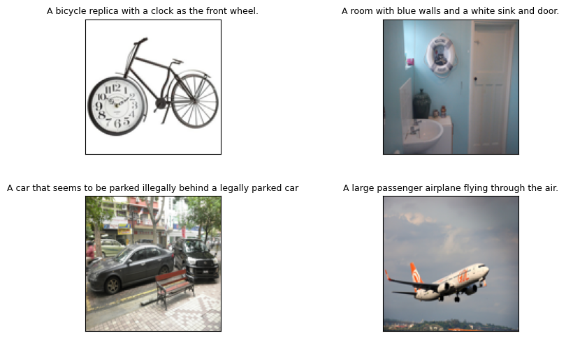
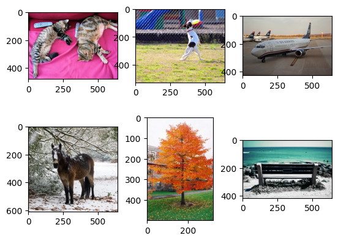
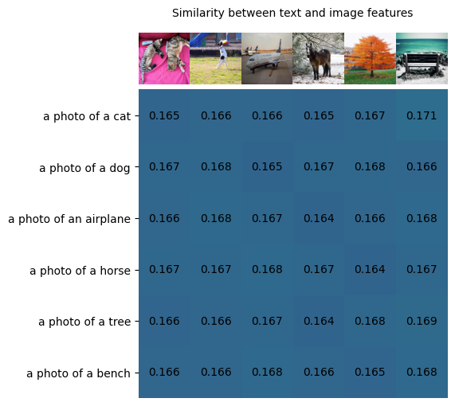
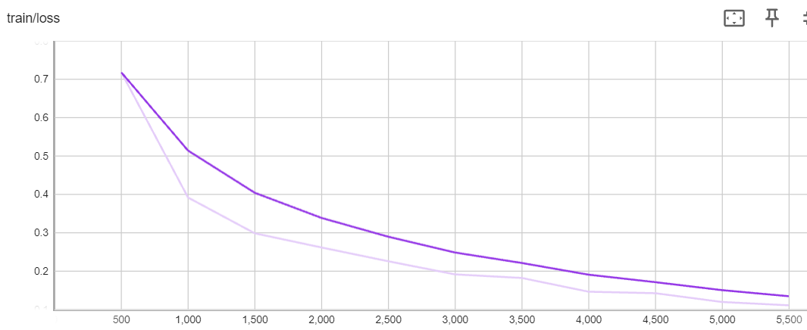
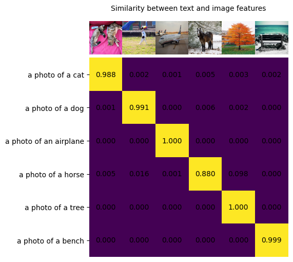

<head>
  <meta charset="UTF-8">
  <meta name="description" content="Unlocking Vision-Text Dual-Encoding: Multi-GPU Training of a CLIP-Like Model">
  <meta name="keywords" content="CLIP, Contrastive learning, multimodal learning, AMD Instinct GPU, MI300, Training, Language-Image, Vision-Text, ROCm, Training">
</head>

# Unlocking Vision-Text Dual-Encoding: Multi-GPU Training of a CLIP-Like Model

In this blog, we will build a vision-text dual encoder model akin to CLIP and fine-tune it with the [COCO dataset](https://cocodataset.org/#overview) on AMD GPU with ROCm.  This work is inspired by the principles of [CLIP](https://openai.com/research/clip) and the [Hugging Face example](https://github.com/huggingface/transformers/tree/main/examples/pytorch/contrastive-image-text). The idea is to train a vision encoder and a text encoder jointly to project the representation of images and their descriptions into the same embedding space, such that the text embeddings are located near the embeddings of the images they describe. The objective during training is to maximize the similarity between the embeddings of image and text pairs in the batch while minimizing the similarity of embeddings for incorrect pairs. The model achieves this by learning a multimodal embedding space. A symmetric cross entropy loss is optimized over these similarity scores.


Image source: [Learning Transferable Visual Models From Natural Language Supervision](https://arxiv.org/abs/2103.00020).

Vision-text dual encoder model can be applied to a wide range of downstream vision and language tasks such as image classification, object detection, image captioning, visual question answering, and more. Refer to our previous [Interacting with CLIP blog](https://github.com/ROCm/rocm-blogs/tree/release/blogs/artificial-intelligence/CLIP) to learn how to use a pretrained CLIP model to calculate the similarity between images and texts for Zero-Shot image classification.

You can find the complete code used in this blog from [vision-text-dual-encoding](https://github.com/ROCm/rocm-blogs/tree/release/blogs/artificial-intelligence/vision-text-dual-encoding/src).

## Setup

This demo was created using the following settings. For comprehensive support details, please refer to the [ROCm documentation](https://rocm.docs.amd.com/projects/install-on-linux/en/latest/).

* Hardware & OS:
  * [Supported AMD GPU](https://www.amd.com/en/products/accelerators/instinct.html)
  * Ubuntu 22.04.3 LTS
* Software:
  * [ROCm 5.7.0+](https://rocm.docs.amd.com/en/latest/)
  * [PyTorch 2.0+](https://pytorch.org/)

## 1. Getting started

Install the required libraries.

```python
!pip install datasets accelerate matplotlib -U
```

It's recommended to install Transformers from source.

```bash
%%bash
git clone https://github.com/huggingface/transformers
cd transformers
pip install -e .
```

Check the availability of the GPU on your system.

```python
!rocm-smi
```

```bash
    ========================= ROCm System Management Interface =========================
    =================================== Concise Info ===================================
    GPU  Temp (DieEdge)  AvgPwr  SCLK    MCLK     Fan  Perf  PwrCap  VRAM%  GPU%  
    0    39.0c           41.0W   800Mhz  1600Mhz  0%   auto  300.0W    0%   0%    
    1    42.0c           43.0W   800Mhz  1600Mhz  0%   auto  300.0W    0%   0%    
    2    41.0c           43.0W   800Mhz  1600Mhz  0%   auto  300.0W    0%   0%    
    3    41.0c           40.0W   800Mhz  1600Mhz  0%   auto  300.0W    0%   0%    
    4    41.0c           44.0W   800Mhz  1600Mhz  0%   auto  300.0W    0%   0%    
    5    40.0c           42.0W   800Mhz  1600Mhz  0%   auto  300.0W    0%   0%    
    6    37.0c           43.0W   800Mhz  1600Mhz  0%   auto  300.0W    0%   0%    
    7    40.0c           43.0W   800Mhz  1600Mhz  0%   auto  300.0W    0%   0%    
    ====================================================================================
    =============================== End of ROCm SMI Log ================================
```

## 2. Download the COCO dataset

This example uses the COCO dataset (2017) via a custom dataset script, which requires users to manually download the COCO dataset before training. Download time depends on the network speed. In our experience, it takes about 7 minutes when initiated from a terminal. It takes longer from a Jupyter notebook cell.

```python
%%bash
mkdir data
cd data
wget http://images.cocodataset.org/zips/train2017.zip
wget http://images.cocodataset.org/zips/val2017.zip
wget http://images.cocodataset.org/zips/test2017.zip
wget http://images.cocodataset.org/annotations/annotations_trainval2017.zip
wget http://images.cocodataset.org/annotations/image_info_test2017.zip
cd ..
```

Once you have manually downloaded the COCO dataset, load it using the provided script ([ydshieh/coc_dataset_script](https://huggingface.co/datasets/ydshieh/coco_dataset_script)).

```python
import os
import datasets

COCO_DIR = os.path.join(os.getcwd(), "data")
ds = datasets.load_dataset("ydshieh/coco_dataset_script", "2017", data_dir=COCO_DIR)
print(ds["train"])
```

```bash
    Dataset({
        features: ['image_id', 'caption_id', 'caption', 'height', 'width', 'file_name', 'coco_url', 'image_path'],
        num_rows: 591753
    })
```

Each data sample is comprised of the eight fields mentioned above. In the context of contrastive learning, pairs of images and captions serve as positive examples when they originate from the same sample, and as negative examples when they are unmatched and from different samples. Below are four samples from the training dataset.

```python
import matplotlib.pyplot as plt
from PIL import Image
import requests

f, axarr = plt.subplots(2,2, figsize=(8,8))
plt.subplots_adjust(hspace=-0.3, wspace=1.2)
for index in range(4):
    image = Image.open(requests.get(ds["train"][index]['coco_url'], stream=True).raw).resize((128,128)).convert("RGB")
    caption = ds["train"][index]['caption']
    axarr[index//2,index%2].imshow(image)
    axarr[index//2,index%2].title.set_text(caption)
    axarr[index//2,index%2].title.set_size(9) 
    axarr[index//2,index%2].set_xticks([])
    axarr[index//2,index%2].set_yticks([])
```



## 3. Create a CLIP-like vision-text dual encoder model

We use [VisionTextDualEncoderModel](https://huggingface.co/docs/transformers/model_doc/vision-text-dual-encoder#visiontextdualencoder) to build the vision-text dual encoder model like the CLIP model. This [VisionTextDualEncoderModel](https://huggingface.co/docs/transformers/model_doc/vision-text-dual-encoder#visiontextdualencoder) class can be used to initialize a vision-text dual encoder model with any pretrained vision autoencoding model as the vision encoder and a pretrained language model as the text encoder. In our case, we utilize [openai/clip-vit-base-patch32](https://huggingface.co/openai/clip-vit-base-patch32) and [roberta-base](https://huggingface.co/FacebookAI/roberta-base) as the vision encoder and text encoder, respectively.

```python
from transformers import (
    VisionTextDualEncoderModel,
    VisionTextDualEncoderProcessor,
    AutoTokenizer,
    AutoImageProcessor
)

model = VisionTextDualEncoderModel.from_vision_text_pretrained(
    "openai/clip-vit-base-patch32", "roberta-base"
)

# get the tokenizer and image processor from text and vision encoders 
tokenizer = AutoTokenizer.from_pretrained("roberta-base")
image_processor = AutoImageProcessor.from_pretrained("openai/clip-vit-base-patch32")
processor = VisionTextDualEncoderProcessor(image_processor, tokenizer)

# save the model and processor
model.save_pretrained("clip-roberta")
processor.save_pretrained("clip-roberta")
# check the model  
print(model)
```

Output:

```bash
    VisionTextDualEncoderModel(
      (vision_model): CLIPVisionModel(
        (vision_model): CLIPVisionTransformer(
          (embeddings): CLIPVisionEmbeddings(
            (patch_embedding): Conv2d(3, 768, kernel_size=(32, 32), stride=(32, 32), bias=False)
            (position_embedding): Embedding(50, 768)
          )
          (pre_layrnorm): LayerNorm((768,), eps=1e-05, elementwise_affine=True)
          (encoder): CLIPEncoder(
            (layers): ModuleList(
              (0-11): 12 x CLIPEncoderLayer(
                (self_attn): CLIPAttention(
                  (k_proj): Linear(in_features=768, out_features=768, bias=True)
                  (v_proj): Linear(in_features=768, out_features=768, bias=True)
                  (q_proj): Linear(in_features=768, out_features=768, bias=True)
                  (out_proj): Linear(in_features=768, out_features=768, bias=True)
                )
                (layer_norm1): LayerNorm((768,), eps=1e-05, elementwise_affine=True)
                (mlp): CLIPMLP(
                  (activation_fn): QuickGELUActivation()
                  (fc1): Linear(in_features=768, out_features=3072, bias=True)
                  (fc2): Linear(in_features=3072, out_features=768, bias=True)
                )
                (layer_norm2): LayerNorm((768,), eps=1e-05, elementwise_affine=True)
              )
            )
          )
          (post_layernorm): LayerNorm((768,), eps=1e-05, elementwise_affine=True)
        )
      )
      (text_model): RobertaModel(
        (embeddings): RobertaEmbeddings(
          (word_embeddings): Embedding(50265, 768, padding_idx=1)
          (position_embeddings): Embedding(514, 768, padding_idx=1)
          (token_type_embeddings): Embedding(1, 768)
          (LayerNorm): LayerNorm((768,), eps=1e-05, elementwise_affine=True)
          (dropout): Dropout(p=0.1, inplace=False)
        )
        (encoder): RobertaEncoder(
          (layer): ModuleList(
            (0-11): 12 x RobertaLayer(
              (attention): RobertaAttention(
                (self): RobertaSelfAttention(
                  (query): Linear(in_features=768, out_features=768, bias=True)
                  (key): Linear(in_features=768, out_features=768, bias=True)
                  (value): Linear(in_features=768, out_features=768, bias=True)
                  (dropout): Dropout(p=0.1, inplace=False)
                )
                (output): RobertaSelfOutput(
                  (dense): Linear(in_features=768, out_features=768, bias=True)
                  (LayerNorm): LayerNorm((768,), eps=1e-05, elementwise_affine=True)
                  (dropout): Dropout(p=0.1, inplace=False)
                )
              )
              (intermediate): RobertaIntermediate(
                (dense): Linear(in_features=768, out_features=3072, bias=True)
                (intermediate_act_fn): GELUActivation()
              )
              (output): RobertaOutput(
                (dense): Linear(in_features=3072, out_features=768, bias=True)
                (LayerNorm): LayerNorm((768,), eps=1e-05, elementwise_affine=True)
                (dropout): Dropout(p=0.1, inplace=False)
              )
            )
          )
        )
        (pooler): RobertaPooler(
          (dense): Linear(in_features=768, out_features=768, bias=True)
          (activation): Tanh()
        )
      )
      (visual_projection): Linear(in_features=768, out_features=512, bias=False)
      (text_projection): Linear(in_features=768, out_features=512, bias=False)
    )
```

Both the text and vision encoders are loaded with pre-trained weights. Because the projection layers are randomly initialized and we haven't jointly trained the two encoders, directly using this model to calculate similarity between images and texts won't yield satisfactory results. To explore this limitation, let's conduct a quick test. For ease of reference, let's name the constructed model `clip-roberta`.

### 3.1. Create test data for clip-roberta

First, prepare the test data including four images and four text descriptions.

```python
urls = [
    "http://images.cocodataset.org/val2017/000000039769.jpg",
    "https://farm3.staticflickr.com/2674/5850229113_4fe05d5265_z.jpg",
    "http://farm6.staticflickr.com/5250/5255601114_e6bd308f74_z.jpg",
    "http://farm4.staticflickr.com/3389/3251688524_b35eaf2acd_z.jpg",
    "https://m.media-amazon.com/images/W/MEDIAX_849526-T1/images/I/51hDgswvNqL._AC_.jpg",
    "http://farm1.staticflickr.com/62/202534637_2dbb3071e5_z.jpg",
]
images = [Image.open(requests.get(url, stream=True).raw) for url in urls]

f, axarr = plt.subplots(2,3)
axarr[0,0].imshow(images[0])
axarr[0,1].imshow(images[1])
axarr[0,2].imshow(images[2])
axarr[1,0].imshow(images[3])
axarr[1,1].imshow(images[4])
axarr[1,2].imshow(images[5])

texts = ["a photo of a cat", "a photo of a dog", "a photo of an airplane", "a photo of a horse", "a photo of a tree", "a photo of a bench"]
```



### 3.2. Process the images and texts and feed them to the clip-roberta model

```python
# inference
inputs = processor(
    text=texts, images=images, return_tensors="pt", padding=True
)
outputs = model(**inputs)
logits_per_image = outputs.logits_per_image  # this is the image-text similarity score
print(logits_per_image)
probs = logits_per_image.softmax(dim=1)  # we can take the softmax to get the label probabilities
```

Output:

```bash
    tensor([[ 0.4270,  0.4314,  0.4330,  0.4296,  0.4369,  0.4647],
            [ 1.2838,  1.2888,  1.2693,  1.2823,  1.2885,  1.2793],
            [ 0.9680,  0.9829,  0.9737,  0.9589,  0.9696,  0.9837],
            [ 0.4647,  0.4655,  0.4695,  0.4623,  0.4461,  0.4612],
            [-0.1244, -0.1225, -0.1151, -0.1315, -0.1097, -0.1017],
            [ 0.2710,  0.2707,  0.2837,  0.2689,  0.2669,  0.2833]],
           grad_fn=<PermuteBackward0>)
```

### 3.3. Visualize the similarity score

We can visualize the similarity score between the images and texts using a heatmap. The higher the score, the more similar the text and image features are.

```python
count = len(texts)
similarity = probs.detach().numpy()
plt.figure(figsize=(5, 9))
plt.imshow(similarity, vmin=0.1, vmax=0.3)
plt.yticks(range(count), texts, fontsize=10)
plt.xticks([])
for i, image in enumerate(images):
    plt.imshow(image, extent=(i - 0.5, i + 0.5, -1.6, -0.6), origin="lower")
for x in range(similarity.shape[1]):
    for y in range(similarity.shape[0]):
        plt.text(x, y, f"{similarity[y, x]:.3f}", ha="center", va="center", size=10)

for side in ["left", "top", "right", "bottom"]:
  plt.gca().spines[side].set_visible(False)

plt.xlim([-0.5, count - 0.5])
plt.ylim([count-0.5, -1.8])

plt.title("Similarity between text and image features", size=10)
```



As mentioned previously, due to the randomly initialized projection layers and separate training of the vision and text encoders, the model is currently unable to provide accurate results. It tends to assign similar scores to each pair of image and text, rather than accurately evaluating them individually. This is an expected outcome. The next step involves the joint training of the model, followed by reassessing its performance using the same test.

## 4. Train the model with the COCO dataset

You can easily log and monitor the training process with [Weights & Biases](https://wandb.ai/site). To use Weights & Biases, install the wandb package with:

```python
!pip install wandb
```

```python
import wandb
wandb.login()

# In case you don't want to use wandb, replace this cell with the following two lines
# import os
# os.environ["WANDB_DISABLED"] = "true"
```

Finally, we are ready to train our `clip-roberta` model using the [run_clip.py](./src/run_clip.py) script. In our training, we utilize [Trainer](https://huggingface.co/docs/transformers/main_classes/trainer) and [TrainingArguments](https://huggingface.co/docs/transformers/main_classes/trainer) from Hugging Face, which offer a convenient method to tailor the training process according to our needs. We trained the model for 5 epochs and saved checkpoints every 500 steps. You can increase this configuration to reduce the overhead of saving. Please see more settings in the following for reference.

```bash
%%bash
torchrun \
    --nproc_per_node 8 ./run_clip.py \
    --output_dir ./clip-roberta-finetuned \
    --model_name_or_path ./clip-roberta \
    --data_dir $PWD/data \
    --dataset_name ydshieh/coco_dataset_script \
    --dataset_config_name=2017 \
    --image_column image_path \
    --caption_column caption \
    --remove_unused_columns=False \
    --do_train  --do_eval\
    --per_device_train_batch_size="64" \
    --per_device_eval_batch_size="64" \
    --learning_rate="5e-5" --warmup_steps="0" --weight_decay 0.1 \
    --num_train_epochs=5 \
    --overwrite_output_dir
```

If your system is equipped with multiple GPUs, you can specify the number of available GPUs as an input to `nproc_per_node` (8 GPUs are used in the following training) to expedite the training process. The following table shows training runtime when utilizing varying numbers of GPUs (AMD Instinct MI210):

| Number of GPUs | 1  | 2 | 4 | 8 |
|---------------|:---:|:---:|:---:| :---|
| Train Runtime (hours) | 7.8 | 5.2 | 2.5 | 1.3|

 After the completion of the training, the model `clip-roberta-finetuned` will be saved. You can find similar outputs at the beginning of the training. Simply click on the provided link to access and track the training metrics, such as the training loss.

> wandb: ⭐️ View project at https://wandb.ai/your-account/huggingface \
> wandb: 🚀 View run at https://wandb.ai/your-account/huggingface/runs/0q98bm04 \



From the previous training loss chart, we observe a consistent decrease in loss, which aligns with our expectations. However, the aim of this blog isn't to delve into all possible training configurations to achieve an optimal model. Instead, its focus is on harnessing the power of AMD multi-GPU to unlock the potential of vision-text dual encoding.

Next, we will conduct a test on the fine-tuned model (`clip-roberta-finetuned`) to gauge its ability to accurately classify images that 'clip-roberta' struggles with.

## 8. Test the fine-tuned model

Load the `clip-roberta-finetuned` model and test with the test data used previously.

```python
model = VisionTextDualEncoderModel.from_pretrained(
    "./clip-roberta-finetuned"
)
# get the tokenizer and image processor from text and vision encoders 
tokenizer = AutoTokenizer.from_pretrained("./clip-roberta-finetuned")
image_processor = AutoImageProcessor.from_pretrained("./clip-roberta-finetuned")
processor = VisionTextDualEncoderProcessor(image_processor, tokenizer)
```

```python
# inference
outputs = model(**inputs)
logits_per_image = outputs.logits_per_image  # this is the image-text similarity score
probs = logits_per_image.softmax(dim=1)  # we can take the softmax to get the label probabilities
print(probs)
```

Output:

```bash
    tensor([[9.8811e-01, 1.6277e-03, 9.7421e-04, 4.5114e-03, 3.1330e-03, 1.6449e-03],
            [9.7203e-04, 9.9060e-01, 3.4517e-04, 5.8935e-03, 1.9453e-03, 2.4285e-04],
            [1.3150e-05, 3.2590e-05, 9.9988e-01, 2.8037e-05, 1.6928e-05, 3.3404e-05],
            [5.4424e-03, 1.6018e-02, 5.6439e-04, 8.7959e-01, 9.7941e-02, 4.4352e-04],
            [9.0918e-07, 3.3684e-06, 8.4072e-07, 1.0356e-05, 9.9989e-01, 9.4088e-05],
            [6.3964e-05, 1.7778e-05, 9.8011e-06, 4.8208e-04, 5.2074e-05, 9.9937e-01]],
           grad_fn=<SoftmaxBackward0>)
```

Lastly, we'll display the results, and see that each image has been correctly classified by `clip-roberta-finetuned` model. This successful outcome demonstrates the effectiveness of our training.

```python
count = len(texts)
similarity = probs.detach().numpy()
plt.figure(figsize=(5, 9))
plt.imshow(similarity, vmin=0.1, vmax=0.3)
plt.yticks(range(count), texts, fontsize=10)
plt.xticks([])
for i, image in enumerate(images):
    plt.imshow(image, extent=(i - 0.5, i + 0.5, -1.6, -0.6), origin="lower")
for x in range(similarity.shape[1]):
    for y in range(similarity.shape[0]):
        plt.text(x, y, f"{similarity[y, x]:.3f}", ha="center", va="center", size=10)

for side in ["left", "top", "right", "bottom"]:
  plt.gca().spines[side].set_visible(False)

plt.xlim([-0.5, count - 0.5])
plt.ylim([count-0.5, -1.8])

plt.title("Similarity between text and image features", size=10)
```



## Disclaimers

Third-party content is licensed to you directly by the third party that owns the content and is not licensed to you by AMD. ALL LINKED THIRD-PARTY CONTENT IS PROVIDED “AS IS” WITHOUT A WARRANTY OF ANY KIND. USE OF SUCH THIRD-PARTY CONTENT IS DONE AT YOUR SOLE DISCRETION AND UNDER NO CIRCUMSTANCES WILL AMD BE LIABLE TO YOU FOR ANY THIRD-PARTY CONTENT. YOU ASSUME ALL RISK AND ARE SOLELY RESPONSIBLE FOR ANY DAMAGES THAT MAY ARISE FROM YOUR USE OF THIRD-PARTY CONTENT.
