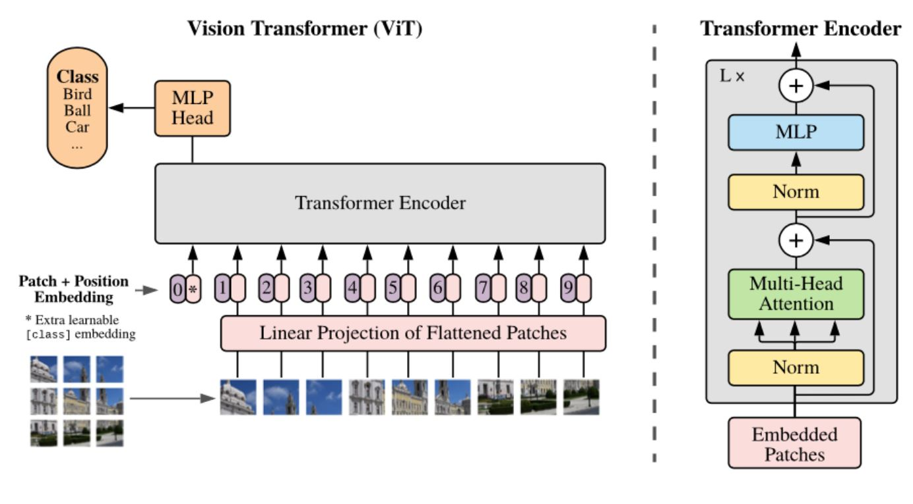
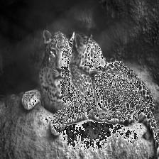

# Image classification using Vision Transformer with AMD GPUs

The Vision Transformer (ViT) model was first proposed in
[An Image is Worth 16x16 Words: Transformers for Image Recognition at Scale](https://arxiv.org/abs/2010.11929). ViT is an attractive alternative to conventional Convolutional Neural Network (CNN) models due to its excellent scalability and adaptability in the field of computer vision. On the other hand, ViT can be more expensive compared to CNN for large input images as it has quadratic computation complexity with respect to input size.

This blog demonstrates how to use the ViT model on AMD GPUs with ROCm Software.



The preceding figure, which is taken from the original
[paper](https://arxiv.org/abs/2010.11929), shows the ViT architecture.

Some of the code used in this blog is adapted from the blog:
[Quick demo: Vision Transformer (ViT) by Google Brain](https://github.com/NielsRogge/Transformers-Tutorials/blob/master/VisionTransformer/Quick_demo_of_HuggingFace_version_of_Vision_Transformer_inference.ipynb)
by Niels Rogge.

## Setup

The code in this blog has been tested on a single AMD MI210 GPUs with a Docker image that
has ROCm 6.0 and PyTorch 2.2 installed. It will also run on any [ROCm supported GPU](https://rocm.docs.amd.com/projects/install-on-linux/en/latest/reference/system-requirements.html).

### Software

You can find the Docker image used in this demo on
[Docker Hub](https://hub.docker.com/layers/rocm/pytorch/latest/images/sha256-cfc5bfe46ad5d487ef9a928f50d1f2ff0941b724a6978f6d6350d13ce2c6ca88?context=explore)
using the following command:

```bash
docker run -it --cap-add=SYS_PTRACE --security-opt seccomp=unconfined \
--device=/dev/kfd --device=/dev/dri --group-add video \
--ipc=host --shm-size 8G  rocm/pytorch:latest
```

For further details on how to install ROCm and PyTorch, visit:

* [ROCm quick-start install guide](https://rocm.docs.amd.com/projects/install-on-linux/en/latest/tutorial/quick-start.html)
* [Installing PyTorch for ROCm](https://rocm.docs.amd.com/projects/install-on-linux/en/latest/how-to/3rd-party/pytorch-install.html)

To see if you have the correct version of ROCm installed, use:

```bash
apt show rocm-libs -a
```

```text
Package: rocm-libs
Version: 6.0.0.60000-91~20.04
Priority: optional
Section: devel
Maintainer: ROCm Dev Support <rocm-dev.support@amd.com>
Installed-Size: 13.3 kB
Depends: hipblas (= 2.0.0.60000-91~20.04), hipblaslt (= 0.6.0.60000-91~20.04), hipfft (= 1.0.12.60000-91~20.04), hipsolver (= 2.0.0.60000-91~20.04), hipsparse (= 3.0.0.60000-91~20.04), hiptensor (= 1.1.0.60000-91~20.04), miopen-hip (= 3.00.0.60000-91~20.04), half (= 1.12.0.60000-91~20.04), rccl (= 2.18.3.60000-91~20.04), rocalution (= 3.0.3.60000-91~20.04), rocblas (= 4.0.0.60000-91~20.04), rocfft (= 1.0.23.60000-91~20.04), rocrand (= 2.10.17.60000-91~20.04), hiprand (= 2.10.16.60000-91~20.04), rocsolver (= 3.24.0.60000-91~20.04), rocsparse (= 3.0.2.60000-91~20.04), rocm-core (= 6.0.0.60000-91~20.04), composablekernel-dev (= 1.1.0.60000-91~20.04), hipblas-dev (= 2.0.0.60000-91~20.04), hipblaslt-dev (= 0.6.0.60000-91~20.04), hipcub-dev (= 3.0.0.60000-91~20.04), hipfft-dev (= 1.0.12.60000-91~20.04), hipsolver-dev (= 2.0.0.60000-91~20.04), hipsparse-dev (= 3.0.0.60000-91~20.04), hiptensor-dev (= 1.1.0.60000-91~20.04), miopen-hip-dev (= 3.00.0.60000-91~20.04), rccl-dev (= 2.18.3.60000-91~20.04), rocalution-dev (= 3.0.3.60000-91~20.04), rocblas-dev (= 4.0.0.60000-91~20.04), rocfft-dev (= 1.0.23.60000-91~20.04), rocprim-dev (= 3.0.0.60000-91~20.04), rocrand-dev (= 2.10.17.60000-91~20.04), hiprand-dev (= 2.10.16.60000-91~20.04), rocsolver-dev (= 3.24.0.60000-91~20.04), rocsparse-dev (= 3.0.2.60000-91~20.04), rocthrust-dev (= 3.0.0.60000-91~20.04), rocwmma-dev (= 1.3.0.60000-91~20.04)
Homepage: https://github.com/RadeonOpenCompute/ROCm
Download-Size: 1046 B
APT-Manual-Installed: yes
APT-Sources: http://repo.radeon.com/rocm/apt/6.0 focal/main amd64 Packages
Description: Radeon Open Compute (ROCm) Runtime software stack
```

You'll also need to install the transformers package from Hugging Face.

```bash
pip install -q transformers
```

### Hardware

For a list of supported hardware, visit the
[ROCm System requirements page](https://rocm.docs.amd.com/projects/install-on-linux/en/latest/reference/system-requirements.html).

Check your hardware to make sure that the system recognizes the AMD GPU.

```bash
rocm-smi --showproductname
```

```text
============================ ROCm System Management Interface ============================
====================================== Product Info ======================================
GPU[0]          : Card series:          0x740f
GPU[0]          : Card model:           0x0c34
GPU[0]          : Card vendor:          Advanced Micro Devices, Inc. [AMD/ATI]
GPU[0]          : Card SKU:             D67301V
==========================================================================================
================================== End of ROCm SMI Log ===================================
```

Make sure PyTorch also recognizes the GPU.

```python
import torch
print(f"number of GPUs: {torch.cuda.device_count()}")
print([torch.cuda.get_device_name(i) for i in range(torch.cuda.device_count())])
```

```text
number of GPUs: 1
['AMD Instinct MI210']
```

## Loading the ViT model

Load the pre-trained ViT model `vit-base-patch16-224` from Hugging Face.

```python
from transformers import ViTForImageClassification

device = torch.device('cuda' if torch.cuda.is_available() else 'cpu')

model = ViTForImageClassification.from_pretrained('google/vit-base-patch16-224')
model.to(device)
```

## Image classification

Load an unlicensed [image](https://www.pexels.com/photo/two-leopards-lying-together-19448090/)
for the model to classify.

```python
from PIL import Image
import requests

url = 'https://images.pexels.com/photos/19448090/pexels-photo-19448090.png'
image = Image.open(requests.get(url, stream=True).raw)
image
```


The ViT model accepts an input resolution of 224x224. You can use the ViTImageProcessor to normalize and resize the image so that it's ready for the model.

```python
from transformers import ViTImageProcessor

processor = ViTImageProcessor.from_pretrained('google/vit-base-patch16-224')
inputs = processor(images=image, return_tensors="pt").to(device)
pixel_values = inputs.pixel_values
```

Check that the image has the correct size. The shape of the `pixel_values` tensor represents \[batch,
channel, height, width\].

```python
print(pixel_values.shape)
```

```python
torch.Size([1, 3, 224, 224])
```

The processed image shows the correct size. To look at the output image, use:

```python
import torchvision
from torchvision.io import read_image
import torchvision.transforms as T

T.ToPILImage()(pixel_values[0])
```



As expected, the processed image is a normalized and resized version of the original one.

The model has been trained to classify images to one of 1,000 classes. Here are some sample classes
that the model supports.

```python
import random

random.seed(1002)
i = 0
while  i < 10:
    print(model.config.id2label[random.randint(0, 999)])
    i = i+1
```

```text
dishrag, dishcloth
jeep, landrover
bassinet
traffic light, traffic signal, stoplight
briard
grey whale, gray whale, devilfish, Eschrichtius gibbosus, Eschrichtius robustus
bittern
Siamese cat, Siamese
china cabinet, china closet
flamingo
```

Now you're ready to use the ViT model to classify the image. The ViT model consists of a BERT-like
encoder and a linear classification head on top of the last hidden state of the \[CLS\] (classification)
token.  The output of the model is the logit (log odds) of the image that belongs to each of the 1,000
classes that the model has been trained for. The classification result is simply the class that has the
highest logit value.

```python
with torch.no_grad():
  outputs = model(pixel_values)
logits = outputs.logits
print("Total number of classes:", logits.shape[1])

prediction = logits.argmax(-1)
print("Predicted class:", model.config.id2label[prediction.item()])
```

```bash
Total number of classes: 1000
Predicted class: leopard, Panthera pardus
```

The model got it right! You can give this a try with other images to see how this model performs on
your AMD GPUs.

To learn more about Vision Transformer, see: [Official Vision Transformer repo from Google Research](https://github.com/google-research/vision_transformer).

## Disclaimers

Third-party content is licensed to you directly by the third party that owns the content and is
not licensed to you by AMD. ALL LINKED THIRD-PARTY CONTENT IS PROVIDED “AS IS”
WITHOUT A WARRANTY OF ANY KIND. USE OF SUCH THIRD-PARTY CONTENT IS DONE AT
YOUR SOLE DISCRETION AND UNDER NO CIRCUMSTANCES WILL AMD BE LIABLE TO YOU FOR
ANY THIRD-PARTY CONTENT. YOU ASSUME ALL RISK AND ARE SOLELY RESPONSIBLE FOR ANY
DAMAGES THAT MAY ARISE FROM YOUR USE OF THIRD-PARTY CONTENT.
