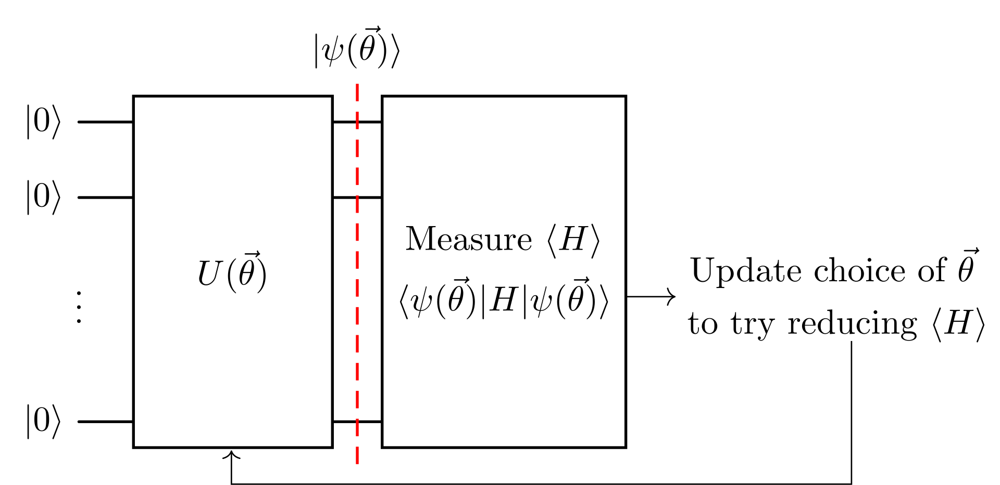
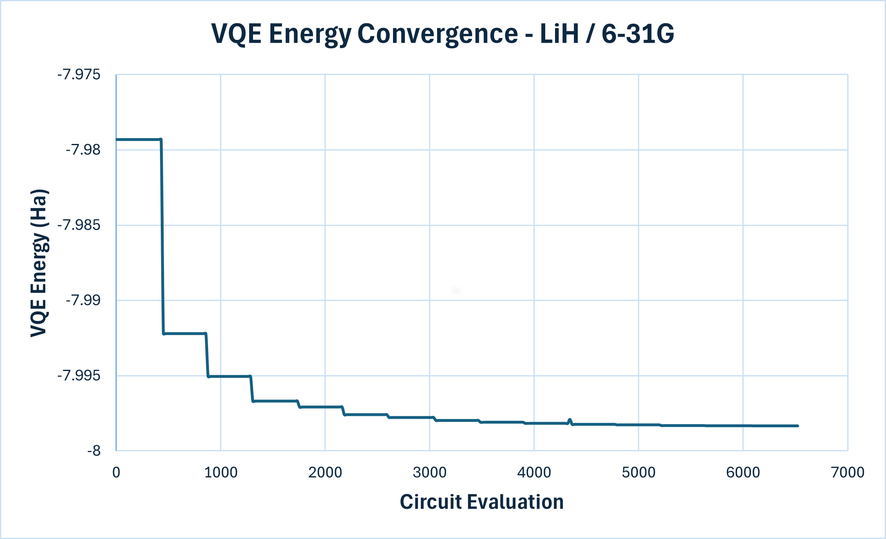

<!---
Copyright (c) 2026 Advanced Micro Devices, Inc. (AMD)

Permission is hereby granted, free of charge, to any person obtaining a copy
of this software and associated documentation files (the "Software"), to deal
in the Software without restriction, including without limitation the rights
to use, copy, modify, merge, publish, distribute, sublicense, and/or sell
copies of the Software, and to permit persons to whom the Software is
furnished to do so, subject to the following conditions:

The above copyright notice and this permission notice shall be included in all
copies or substantial portions of the Software.

THE SOFTWARE IS PROVIDED "AS IS", WITHOUT WARRANTY OF ANY KIND, EXPRESS OR
IMPLIED, INCLUDING BUT NOT LIMITED TO THE WARRANTIES OF MERCHANTABILITY,
FITNESS FOR A PARTICULAR PURPOSE AND NONINFRINGEMENT. IN NO EVENT SHALL THE
AUTHORS OR COPYRIGHT HOLDERS BE LIABLE FOR ANY CLAIM, DAMAGES OR OTHER
LIABILITY, WHETHER IN AN ACTION OF CONTRACT, TORT OR OTHERWISE, ARISING FROM,
OUT OF OR IN CONNECTION WITH THE SOFTWARE OR THE USE OR OTHER DEALINGS IN THE
SOFTWARE.
--->

# Running Variational Quantum Eigensolver with Qiskit Aer on AMD Instinct

Quantum computing offers a fundamentally different approach to computational problems by leveraging quantum mechanical properties such as superposition and entanglement.
Unlike a classical bit, which is always 0 or 1, a [qubit](https://en.wikipedia.org/wiki/Qubit) can exist in a superposition of both, and in principle this gives a significant resource advantage: $n$ qubits represent a state that would otherwise require $2^n$ complex numbers on a classical computer.
However, current quantum hardware is still in its early stages - noise and limited qubit counts constrain the scale of problems it can handle reliably.
GPU-accelerated simulators efficiently emulate quantum circuits on classical hardware, though they inherit the same exponential memory cost and become impractical past a few dozen qubits.
Of course, any problem whose quantum circuit can be fully simulated on classical hardware can also be handled with other methods that avoid the simulation overhead, but the real value of circuit simulation is the opportunity to develop, validate, and benchmark quantum algorithms in a controlled setting where exact solutions are known, so that the same algorithms can be trusted on future hardware tackling problems that remain intractable at scale today.

One of the most promising near-term applications of quantum computing is quantum chemistry, and at the heart of many of its problems, and across quantum physics more broadly, lies finding the ground state energy of a system by solving the Schrödinger equation.
Exact solutions are generally intractable for all but the simplest systems, as the computational cost grows exponentially with the number of orbitals involved.
Conventional quantum chemistry methods offer various trade-offs between accuracy and computational complexity, but even the most accurate of them become prohibitively expensive for larger, strongly correlated systems.

The Variational Quantum Eigensolver (VQE) [[1]](#1) is a hybrid quantum-classical algorithm specifically designed for this task.
It combines a parameterized quantum circuit, known as an ansatz, with a classical optimizer to iteratively minimize the energy expectation value and approximate the molecular ground state.
GPU-accelerated circuit simulators allow us to study VQE at meaningful scales by exactly emulating quantum circuits, providing a controlled environment for understanding the interplay between ansatz design, optimizer choice, basis set, and system size.

In this blog, we demonstrate GPU-accelerated VQE using Qiskit Aer [[2]](#2) on AMD Instinct GPU accelerators with ROCm.
We benchmark VQE on the LiH molecule with increasingly large basis sets and compare GPU versus CPU simulation performance.
We show that with the right configuration, VQE can achieve chemical accuracy on AMD hardware.

```{tip}
Already familiar with VQE? Skip to the [practical section](#prerequisites) for the hands-on walkthrough.
```

## Variational Quantum Eigensolver

A [quantum computer](https://en.wikipedia.org/wiki/Quantum_computing) processes information using the rules of [quantum mechanics](https://en.wikipedia.org/wiki/Quantum_mechanics), the theory that describes physical systems at atomic and subatomic scales. Its basic unit of information is the [qubit](https://en.wikipedia.org/wiki/Qubit).
Unlike a classical bit, which is either 0 or 1, a qubit can be in a [superposition](https://en.wikipedia.org/wiki/Quantum_superposition) of both states, with complex amplitudes describing how much of each state is present.
When multiple qubits interact, they can also become [entangled](https://en.wikipedia.org/wiki/Quantum_entanglement), meaning the state of the whole system cannot always be understood by looking at each qubit separately.
These properties do not make quantum computers faster for every problem, but they give quantum algorithms a natural way to represent and manipulate quantum states.
This is especially relevant for chemistry, where the objects we want to study, electrons and molecules, are themselves governed by quantum mechanics.
VQE uses a parameterized quantum circuit to prepare trial quantum states and then searches for the state with the lowest energy.
Before getting to the VQE algorithm itself, let's first formulate the problem it is designed to solve.

### Formulating the Problem

Quantum mechanics describes a system by a wavefunction that lives in a [Hilbert space](https://en.wikipedia.org/wiki/Hilbert_space), the mathematical space of all states the system can occupy.
For a real physical system such as a molecule, this space is infinite-dimensional in principle.
However, any practical calculation needs a finite approximation.
A quantum circuit, on the other hand, works with qubits.
A single qubit lives in a 2-dimensional Hilbert space, and the Hilbert space of $n$ qubits is the tensor product of $n$ such single-qubit spaces, giving a $2^n$-dimensional space.
In quantum chemistry simulations, the finite approximation is chosen through the basis set, which also determines how many qubits are needed to represent the resulting problem.

A **basis set** provides this: a finite collection of known mathematical functions, centered on atoms, that span a subspace of the full Hilbert space.
Choosing a richer basis set improves accuracy by capturing more of the electronic structure, but increases the qubit count and circuit complexity.
In our experiments we use three standard Pople basis sets [[6]](#6), commonly used in quantum chemistry:

- **STO-3G:** The name stands for "Slater-Type Orbital fitted with 3 Gaussians." A Slater-type orbital is a smooth exponential function that closely matches the shape of an atomic orbital, but it is expensive to work with mathematically. STO-3G approximates each Slater function by adding together 3 simple Gaussian curves, which are much cheaper to compute. It assigns exactly one basis function to every orbital in the atom (core and valence alike), so it is the smallest practical basis set. This makes calculations fast and keeps the qubit count low, but the limited flexibility means it can only give a rough picture of the electron distribution.

- **6-31G:** This is a "split-valence" basis set, meaning it treats core and valence electrons differently. Each core orbital is represented by a single function built from 6 Gaussians. These inner electrons sit close to the nucleus and their shape doesn't change much between molecules, so one fixed function is enough. Each valence orbital, on the other hand, is split into two pieces: a "tight" part made of 3 Gaussians that stays close to the nucleus, and a "diffuse" part made of 1 Gaussian that can spread further out. By adjusting the balance between these two pieces, the calculation can reshape the valence orbitals to better fit the molecular environment. The result is noticeably more accurate than STO-3G, at the cost of roughly doubling the number of basis functions and therefore the qubit count.

- **6-311G:** An extension of 6-31G that splits each valence orbital into three pieces instead of two (hence "311"): a tight contraction of 3 Gaussians, plus two additional Gaussians of different widths. The extra degree of freedom lets the basis describe finer details, for example how an orbital stretches or polarizes when a neighboring atom pulls on the electron cloud. Core orbitals are still handled with a single 6-Gaussian contraction, just as in 6-31G. The improved flexibility yields more accurate energies, but further increases the number of qubits and the depth of the resulting quantum circuits.

The energy of a molecule is described by its [Hamiltonian](https://en.wikipedia.org/wiki/Hamiltonian_(quantum_mechanics)), and finding the ground state energy means finding its smallest eigenvalue (excited states are outside the scope of this blog). It is one of the most important quantities governing stability, equilibrium geometry, and bonding.
For a system of $n$ qubits the Hilbert space has dimension $2^n$, and the Hamiltonian acts on it as a $2^n \times 2^n$ matrix, with $4^n$ entries in the dense case.
Finding its smallest eigenvalue requires diagonalizing this matrix. The matrix is typically sparse for molecular Hamiltonians, but the exponential memory scaling still makes exact diagonalization infeasible for larger qubit counts.

Treating nuclei and electrons quantum mechanically at the same time is not practical, so the standard starting point is the [**Born-Oppenheimer (BO) approximation**](https://en.wikipedia.org/wiki/Born%E2%80%93Oppenheimer_approximation). Because nuclei are thousands of times heavier than electrons, we can assume electrons adapt instantaneously to nuclear movement and treat the nuclei as fixed. The nuclear positions define a static external potential, and the electronic Schrödinger equation is solved using this boundary condition.
Contributions from nuclear motion (vibrations, rotations, and translations) are a separate problem that lies outside the scope of VQE and this blog.
Under this approximation, the total energy at a fixed geometry has two components:

$$E_\text{total} = E_\text{electronic} + E_\text{nuclear repulsion}$$

where $E_\text{nuclear repulsion}$ is the electrostatic repulsion between the positively charged nuclei.
This is a purely classical quantity: given fixed nuclear positions, it is just a sum of Coulomb terms and can be computed exactly and cheaply. In our pipeline, PySCF [[3]](#3) handles this calculation.
At fixed geometry it is a constant offset and does not affect the VQE optimization itself. It is added back at the end so the reported total energy matches what conventional reference methods compute.
$E_\text{electronic}$ is the energy of the electrons moving in the field of the nuclei and interacting with each other. It consists of kinetic energy, electron-nuclear attraction, and electron-electron repulsion.

### From Molecule to Qubit Hamiltonian

Before VQE can run, the molecular problem must be translated into a form that a quantum circuit can work with.
The pipeline is:

1. **Define the molecule:** Specify the atoms and their 3D coordinates (fixed geometry).
2. **Choose a basis set:** In our experiments STO-3G, 6-31G, or 6-311G.
3. **Compute electronic integrals:** A classical tool like PySCF computes the one and two electron integrals: numbers that quantify how electrons move in the nuclear field and how they repel each other.
PySCF also computes the nuclear repulsion energy at this stage.
4. **Map to qubits:** Map the Hamiltonian to qubits using the Jordan-Wigner transformation, which results in a sum of Pauli operators: $H = \sum_i c_i P_i$.
Here each $P_i$ is a tensor product of Pauli matrices ($I$, $X$, $Y$, $Z$) and $c_i$ is a real coefficient.
This qubit Hamiltonian fully encodes the electronic structure problem.

### The VQE Algorithm

As mentioned before, Variational Quantum Eigensolver (VQE) [[1]](#1) is a hybrid quantum-classical algorithm for approximating the ground state electronic energy.
Rather than diagonalizing the exponentially large Hamiltonian, VQE uses a parameterized quantum circuit to prepare trial states and a classical optimizer to iteratively improve them.
The theoretical foundation is the **variational principle**: for any trial wavefunction $|\psi(\theta)\rangle$, the expectation value of $H$ satisfies

$$E(\theta) = \langle\psi(\theta)|H|\psi(\theta)\rangle \geq E_0$$

where $E_0$ is the true ground state electronic energy.
No matter what trial state you prepare, the measured energy can never fall below the real ground state energy.
By minimizing $E(\theta)$ over the parameters $\theta$, you approach the true answer from above.
Although we apply VQE here to a molecular Hamiltonian, the variational principle holds for any Hermitian operator, so the same framework also targets other eigenvalue problems such as spin and lattice Hamiltonians.

The algorithm operates as a loop between a quantum component and a classical component (Figure 1):

1. **Quantum circuit:** All qubits start in the $|0\rangle$ state.
A parameterized quantum circuit, called the ansatz, applies a sequence of gates, rotations and entangling operations, controlled by the parameters $\theta$, transforming the initial state into a trial state $|\psi(\theta)\rangle$.
The energy $E(\theta) = \langle\psi(\theta)|H|\psi(\theta)\rangle$ is then estimated from measurements on this state. On real hardware many measurements are needed to estimate the expectation value. In this blog we use statevector simulation, which gives $E(\theta)$ exactly.
2. **Optimizer:** A classical optimizer running on a CPU examines the measured energy and updates values of $\theta$ to try to lower it.

This loop repeats until the energy converges, that is, until the optimizer can no longer find parameter updates that meaningfully reduce the energy.
The final electronic energy, combined with the nuclear repulsion energy from PySCF, gives the total ground state energy of the molecule at the fixed nuclear geometry.
The quality of the approximation depends on two critical choices: how expressive the ansatz is and how effective the optimizer is.



*Figure 1: The VQE feedback loop.
Qubits initialized to $|0\rangle$ pass through a parameterized circuit, the energy is estimated from measurements, and a classical optimizer updates $\theta$ to minimize it.
Figure by [Sjoerd Terlouw](https://commons.wikimedia.org/wiki/User:Sjoerd_Terlouw), from [Wikimedia Commons](https://commons.wikimedia.org/wiki/File:VQE.svg), licensed under [CC BY-SA 4.0](https://creativecommons.org/licenses/by-sa/4.0/deed.en); used unmodified.*

### Ansatz Choice

In quantum computing, an *ansatz* (German for "approach" or "starting assumption") is a parameterized quantum circuit whose structure is chosen in advance, but whose gate rotation angles are left as parameters to be tuned by an optimizer.
It fixes which gates are applied and in what order, while the specific rotation angles, collectively denoted $\theta$, determine the quantum state the circuit actually produces.
The expressiveness of the ansatz determines which quantum states are reachable. If the true ground state lies outside the family of states the ansatz can generate, no optimizer will find it.
Therefore, choosing an ansatz means balancing two competing pressures: it must be flexible enough to represent a good approximation of the ground state, yet simple enough that the resulting circuit remains practical to run on real hardware or to simulate.
In this blog we use UCCSD, a chemically motivated ansatz well suited for molecular problems.

#### UCCSD (Unitary Coupled Cluster Singles and Doubles)

UCCSD is one of the most accurate ansätze available for molecular problems.
It starts from the Hartree-Fock (HF) state, a classically computed approximation of the molecule's ground state, and iteratively improves it toward chemical accuracy by applying parameterized excitation operators.
In qubit terms, the HF state is prepared by flipping certain qubits to $|1\rangle$ to represent occupied orbitals (e.g., $|11110000\rangle$ for a system with four occupied and four virtual orbitals), giving the optimizer a starting point already in the right neighborhood of the answer.

The excitation operators then move amplitude from occupied into virtual orbitals: singles move one electron, while doubles move two simultaneously.
Double excitations are particularly important because they capture the strongest electron-electron correlations that Hartree-Fock misses.
Because the excitations are constructed from the molecule's orbital structure, the UCCSD circuit is molecule-specific: changing the molecule changes the number and type of excitations, and therefore the circuit itself.

This chemical expressiveness comes at a cost: decomposing the excitation operators into elementary gates produces deep circuits with high gate counts, making UCCSD expensive to simulate and susceptible to noise on real hardware.
In our setting, however, it converges reliably to accurate energies for molecular systems.

#### Other Ansätze

An alternative ansatz available in the provided scripts is **EfficientSU2**, a hardware-efficient, molecule-agnostic circuit built from repeating layers of single-qubit rotations and entangling gates. It uses a minimal gate count and the same circuit structure works for any system, but without chemical structure to guide it the optimizer can struggle, especially for larger problems where barren plateaus make the energy landscape exponentially flat.

### Optimizer Choice

The optimizer is the classical component of VQE.
It navigates the energy landscape defined by the ansatz parameters, deciding how to update $\theta$ at each step to lower the energy.
In fact, given the structural similarity between VQE and ML training processes, some of the optimizers used in VQE can also be found in traditional machine learning.
Each optimizer comes with trade-offs between convergence speed, robustness, and computational cost per step.

#### SLSQP (Sequential Least Squares Quadratic Programming)

SLSQP is a gradient-based optimizer.
At each step, it estimates the gradient of the energy with respect to every parameter by perturbing them one at a time and measuring how the energy changes.
With this gradient information, SLSQP constructs a local quadratic model of the energy surface and takes an optimal step.

This approach converges quickly when the energy landscape is smooth, making SLSQP a strong default choice for small-to-medium systems where you want fast, reliable convergence.
However, computing the gradient requires $O(n)$ circuit evaluations per step (two per parameter: one for $\theta_k + \epsilon$ and one for $\theta_k - \epsilon$), where $n$ is the number of parameters.
For ansätze like UCCSD, which can have hundreds or thousands of parameters, this cost adds up quickly.

#### Other Optimizers

The accompanying code also supports alternative optimizers. On the optimizer side, **COBYLA** is gradient-free and requires only one circuit evaluation per step, while **SPSA** estimates the gradient by perturbing all parameters simultaneously, requiring only two evaluations per step regardless of parameter count.

### GPU-Accelerated Quantum Circuit Emulation

In this blog, we run all VQE experiments with Qiskit Aer's [statevector simulator](https://qiskit.github.io/qiskit-aer/tutorials/1_aersimulator.html) via ROCm on AMD Instinct GPUs (MI300X, with an AMD EPYC 9534 host) and compare performance against the CPU backend.
The statevector method is the most direct simulation approach: it tracks the system's pure state and applies each gate exactly, giving deterministic expectation values that are ideal for benchmarking.
Other simulation methods (density-matrix, tensor-network, stabilizer, etc.) offer different trade-offs in memory, accuracy, gate-set generality, and noise handling, but we don't explore those in this blog.
Each VQE run involves hundreds or thousands of circuit evaluations as the optimizer iterates.
On a CPU, these are carried out with multithreaded linear algebra, which works well at small qubit counts but becomes a bottleneck as the statevector grows exponentially with $n$, as established earlier.
Real quantum hardware avoids this bottleneck by representing the state directly on $n$ qubits.
Applying a gate to an $n$-qubit statevector is a matrix–vector operation on $2^n$ amplitudes, an embarrassingly parallel workload that naturally benefits from GPU acceleration.
Since VQE repeats this operation hundreds or thousands of times, the per-iteration speedup compounds into a large wall-clock time reduction.

The statevector size grows as $2^n$ complex numbers, where $n$ is the number of qubits.
The qubit count itself comes from the molecular basis set: each spatial orbital produces two spin-orbitals, and under the Jordan-Wigner mapping each spin-orbital becomes one qubit.
For LiH, STO-3G gives 6 spatial orbitals (12 qubits), 6-31G gives 11 (22 qubits), and 6-311G gives 16 (32 qubits).
At double precision (16 bytes per amplitude), that translates to 64 KB, 64 MB, and 64 GB of statevector memory, respectively.
The UCCSD circuit that prepares the trial state grows alongside the qubit count as well, adding more excitation operators, more variational parameters $\theta$, and deeper circuits at each basis set tier.
For systems exceeding the memory of a single GPU, it is possible to distribute the workload across multiple GPUs using multi-GPU cache blocking.

## Pipeline Overview

The workflow we follow for each experiment tier is:

1. Set up the environment (Docker container with Qiskit Aer built for ROCm).
2. Define the molecular system and generate the qubit Hamiltonian using PySCF and Qiskit Nature [[4]](#4).
3. Select the ansatz, optimizer, basis set, and evaluation mode.
4. Run VQE on AMD Instinct GPUs using the statevector simulator.
5. Compare the computed ground state energy against reference values.

## Prerequisites

- Docker: See [the Install Docker Engine documentation](https://docs.docker.com/engine/install/) for installation instructions.
- ROCm kernel-mode driver: As described in [Running ROCm Docker Containers](https://rocm.docs.amd.com/projects/install-on-linux/en/latest/how-to/docker.html), you need to install [`amdgpu-dkms`](https://instinct.docs.amd.com/projects/amdgpu-docs/en/latest/install/detailed-install/post-install.html#verify-kernel-mode-driver-installation).
- MI300X (or other compatible GPU): See [System requirements (Linux)](https://rocm.docs.amd.com/projects/install-on-linux/en/latest/reference/system-requirements.html) for more details.

## Environment Setup

First, clone the repository and navigate to the source directory:

```bash
git clone https://github.com/ROCm/rocm-blogs.git

cd rocm-blogs/blogs/artificial-intelligence/vqe-qiskit-aer/src
```

Build the Docker image:

```bash
docker build -f qiskit.dockerfile -t qiskit_aer_rocm7.2:latest .
```

Using the [AMD Container Toolkit](https://instinct.docs.amd.com/projects/container-toolkit/en/latest/index.html) is recommended for launching containers with AMD GPUs.
Once installed, you can create and run a container from the image using the following command:

```bash
docker run -it --rm \
    --runtime=amd \
    -e AMD_VISIBLE_DEVICES=all \
    --name vqe_sim \
    --shm-size=16g \
    -v /path/to/local/dir:/workspace \
    -p 5000:5000 \
    qiskit_aer_rocm7.2:latest bash
```

If not using AMD Container Toolkit, just use the command:

```bash
docker run -it --rm \
    --device=/dev/kfd \
    --device=/dev/dri \
    --group-add video \
    --name vqe_sim \
    --shm-size=16g \
    -v /path/to/local/dir:/workspace \
    -p 5000:5000 \
    qiskit_aer_rocm7.2:latest bash
```

The container includes Qiskit with a GPU backend (Qiskit Aer), Qiskit Nature, and PySCF.

## Implementation

All three experiments use the same setup, so we put it into a few helper functions and only change the configuration for each experiment.

```python
import time
import numpy as np
from scipy.sparse.linalg import eigsh
from qiskit.transpiler.preset_passmanagers import generate_preset_pass_manager
from qiskit_aer import AerSimulator
from qiskit_aer.primitives import EstimatorV2 as AerEstimator
from qiskit_algorithms import VQE
from qiskit_algorithms.optimizers import SLSQP
from qiskit_nature.second_q.circuit.library import HartreeFock, UCCSD
from qiskit_nature.second_q.drivers import PySCFDriver
from qiskit_nature.second_q.mappers import JordanWignerMapper
from qiskit_nature.second_q.algorithms import GroundStateEigensolver
from qiskit_nature.units import DistanceUnit
```

Next, define utility functions for building the quantum chemistry problem, computing reference energies, and running VQE:

```python
def build_problem(atom_string, basis="sto-3g"):
    driver = PySCFDriver(
        atom=atom_string,
        basis=basis,
        charge=0,
        spin=0,
        unit=DistanceUnit.ANGSTROM,
    )
    return driver.run()

def nuclear_repulsion_energy(problem):
    return float(problem.hamiltonian.nuclear_repulsion_energy)

def exact_energy(problem):
    """Exact ground-state energy via sparse diagonalization (feasible up to ~20 qubits)."""
    mapper = JordanWignerMapper()
    qubit_op = mapper.map(problem.hamiltonian.second_q_op())
    if qubit_op.num_qubits > 20:
        return None
    nuc_rep = nuclear_repulsion_energy(problem)
    H_sparse = qubit_op.to_matrix(sparse=True)
    eigenvalues, _ = eigsh(H_sparse, k=1, which="SA")
    return float(np.real(eigenvalues[0])) + nuc_rep

def ccsdt_energy(atom_string, basis):
    """CCSD(T) total energy via PySCF."""
    from pyscf import gto, scf, cc
    mol = gto.M(atom=atom_string.replace(";", "\n"), basis=basis, unit="Angstrom")
    mf = scf.RHF(mol).run(verbose=0)
    mycc = cc.CCSD(mf).run(verbose=0)
    return float(mycc.e_tot + mycc.ccsd_t())

def reference_energy(problem, atom_string, basis):
    """Reference energy: exact diagonalization when feasible, else CCSD(T)."""
    e = exact_energy(problem)
    return e if e is not None else ccsdt_energy(atom_string, basis)

def build_uccsd_ansatz(problem):
    mapper = JordanWignerMapper()
    num_spatial = problem.num_spatial_orbitals
    num_particles = problem.num_particles
    hf = HartreeFock(num_spatial, num_particles, mapper)

    return UCCSD(num_spatial, num_particles, mapper, initial_state=hf)

def run_vqe(problem, ansatz, optimizer, device="CPU", blocking_qubits=None):
    mapper = JordanWignerMapper()
    sim_kwargs = dict(method="statevector", device=device)
    if blocking_qubits is not None:
        sim_kwargs["blocking_enable"] = True
        sim_kwargs["blocking_qubits"] = blocking_qubits

    backend = AerSimulator(**sim_kwargs)
    pm = generate_preset_pass_manager(optimization_level=3, backend=backend)
    transpiled = pm.run(ansatz)

    estimator = AerEstimator.from_backend(backend)
    vqe = VQE(estimator, transpiled, optimizer)
    # For UCCSD, initializing with zero amplitudes starts the optimizer at the Hartree-Fock state.
    vqe.initial_point = np.zeros(transpiled.num_parameters)

    solver = GroundStateEigensolver(mapper, vqe)
    t0 = time.time()
    result = solver.solve(problem)
    elapsed = time.time() - t0
    print(f"Time: {elapsed:.1f}s")
    return float(np.real(result.total_energies[0]))
```

With the shared code in place, let's run three experiments on Lithium Hydride (LiH) with progressively larger basis sets: STO-3G, 6-31G, and 6-311G. As the basis set grows, so does the qubit count and circuit complexity, which lets us observe how the CPU-to-GPU performance gap evolves with problem size.

## Experiments

With the theoretical components in place, we can define the experiments.

We choose **Lithium Hydride (LiH)** at a fixed bond length of 1.6 Å as our test system.
LiH is one of the most widely used benchmarks in quantum chemistry: it is small enough that high-quality reference energies are readily available for validation, yet exhibits non-trivial electron correlation.
This makes it an ideal proving ground: any error in our VQE results reflects genuine algorithmic or convergence limitations, not ambiguity in the reference answer.

With the molecule fixed, we vary a single axis: the **basis set**.
A larger basis set increases the number of qubits, the depth of the UCCSD circuit, and the number of variational parameters.
We test three progressively richer basis sets: STO-3G, 6-31G, and 6-311G.

All experiments use the **UCCSD ansatz** with the **SLSQP optimizer**.
By holding these constant while scaling only the basis set, we isolate the effect of problem size on two quantities: **accuracy** (does VQE still reach the correct energy?) and **runtime** (how much does the GPU help as circuits grow?).

To validate our results, we compare VQE energies against two references computed with PySCF: **exact diagonalization** of the full qubit Hamiltonian (feasible at these system sizes) and **CCSD(T)**, the "gold standard" of classical quantum chemistry.
The benchmark for success is **chemical accuracy**: an absolute error below $1.59 \times 10^{-3}$ Hartree (approximately 1 kcal/mol).
One Hartree (Ha), the atomic unit of energy, is roughly $27.2\,\text{eV}$. It is the standard unit for quantum chemistry calculations and what PySCF and Qiskit Nature return by default.

### Experiment 1: LiH with STO-3G

The minimal basis set STO-3G gives us 12 qubits, which is small enough that both CPU and GPU finish quickly. This serves as a sanity check that VQE reaches chemical accuracy before we move to larger problems.

```python
geometry = "Li 0 0 0; H 0 0 1.6"
basis_set = "sto-3g"
problem = build_problem(geometry, basis=basis_set)

nuc_rep = nuclear_repulsion_energy(problem)
ref_e = reference_energy(problem, geometry, basis_set)
print(f"Nuclear repulsion: {nuc_rep:.6f} Ha")
print(f"Reference energy: {ref_e:.6f} Ha")

ansatz = build_uccsd_ansatz(problem)
opt = SLSQP(maxiter=500)

vqe_e = run_vqe(problem, ansatz, opt, device="GPU")
print(f"VQE energy: {vqe_e:.6f} Ha")
print(f"Error vs reference: {abs(vqe_e - ref_e):.8f} Ha")
```

At this scale, CPU and GPU perform similarly: about 0.29 seconds per function evaluation on CPU versus 0.33 seconds on GPU. The CPU is slightly faster here because the 12-qubit statevector is small enough that multithreaded linear algebra handles it efficiently, and GPU launch overhead outweighs any parallelism benefit.
The important result is that VQE achieves chemical accuracy: starting optimization from $E_\text{HF} = -7.86186$ Ha, which is well above the 1.6 mHa threshold, it converges to $E_\text{VQE} = -7.88231$ Ha against a reference of $-7.88232$ Ha, giving an error of $\sim 1.1 \times 10^{-5}$ Ha.

### Experiment 2: LiH with 6-31G

The split-valence 6-31G basis increases the qubit count, giving the UCCSD ansatz more parameters and deeper circuits. This is where we start to see the GPU pull ahead.

```python
geometry = "Li 0 0 0; H 0 0 1.6"
basis_set = "6-31g"
problem = build_problem(geometry, basis=basis_set)

nuc_rep = nuclear_repulsion_energy(problem)
ref_e = reference_energy(problem, geometry, basis_set)
print(f"Nuclear repulsion: {nuc_rep:.6f} Ha")
print(f"Reference energy: {ref_e:.6f} Ha")

ansatz = build_uccsd_ansatz(problem)
opt = SLSQP(maxiter=500)

vqe_e = run_vqe(problem, ansatz, opt, device="GPU")
print(f"VQE energy: {vqe_e:.6f} Ha")
print(f"Error vs reference: {abs(vqe_e - ref_e):.8f} Ha")
```

The larger circuit makes a clear difference. The GPU completes each function evaluation in about 11.6 seconds compared to 35.1 seconds on CPU, roughly a 3.0x speedup. The problem is still manageable on both backends, but the GPU's ability to parallelize gate operations across the larger statevector is now paying off. Figure 2 below shows the convergence curve for this experiment; the full run on the GPU backend took ~21.1 hours. On CPU it would have taken ~2.7 days.
At 22 qubits, we compare against CCSD(T) instead of exact diagonalization: starting from $E_\text{HF} = -7.97932$ Ha, again well above the 1.6 mHa threshold, VQE converges to $E_\text{VQE} = -7.99834$ Ha against $E_\text{CCSD(T)} = -7.99836$ Ha, giving an error of $\sim 2.2 \times 10^{-5}$ Ha.
Note that the errors aren't directly comparable across experiments. Changing the basis changes the problem itself (a different finite approximation of the Hilbert space), and in our case the reference calculation also changes (exact diagonalization for STO-3G, CCSD(T) for 6-31G). VQE still reaches errors orders of magnitude below the chemical-accuracy threshold against each basis's own reference.



*Figure 2: VQE convergence for LiH with the 6-31G basis.
The x-axis counts circuit evaluations, not SLSQP outer iterations. Each flat plateau corresponds to a single SLSQP step ($\pm\epsilon$ perturbations of each parameter). The visible energy drops are the actual parameter updates.
The optimizer steadily lowers the energy over successive iterations, converging toward the exact ground state value.*

### Experiment 3: LiH with 6-311G

The triple-split 6-311G basis further increases the qubit count and circuit depth, pushing into a regime where CPU simulation becomes impractical.

```python
geometry = "Li 0 0 0; H 0 0 1.6"
basis_set = "6-311g"
problem = build_problem(geometry, basis=basis_set)

nuc_rep = nuclear_repulsion_energy(problem)
ref_e = reference_energy(problem, geometry, basis_set)
print(f"Nuclear repulsion: {nuc_rep:.6f} Ha")
print(f"Reference energy: {ref_e:.6f} Ha")

ansatz = build_uccsd_ansatz(problem)
opt = SLSQP(maxiter=500)

vqe_e = run_vqe(problem, ansatz, opt, device="GPU")
print(f"VQE energy: {vqe_e:.6f} Ha")
print(f"Error vs reference: {abs(vqe_e - ref_e):.8f} Ha")
```

At this scale, running on CPU is no longer practical. On GPU, each optimization step takes about 1.5 hours, so a full run of several hundred steps requires days of compute. This is where the choice of ansatz and optimizer matters most. Switching to EfficientSU2 with COBYLA or SPSA significantly reduces the cost per step by avoiding the per-parameter gradient evaluation, though convergence may require more iterations. The HF state can still be prepended to EfficientSU2 as the initial state, giving the optimizer a chemically meaningful starting point even with a hardware-efficient circuit. The accompanying scripts support these configurations.

For systems exceeding the memory of a single GPU, Qiskit Aer supports multi-GPU simulation. Here is how to distribute the run above across 2 GPUs.

```python
num_qubits = 2 * problem.num_spatial_orbitals
blocking_qubits = num_qubits - int(2).bit_length()

vqe_e = run_vqe(problem, ansatz, opt, device="GPU", blocking_qubits=blocking_qubits)
print(f"VQE energy (2-GPU): {vqe_e:.6f} Ha")
print(f"Error vs reference: {abs(vqe_e - ref_e):.8f} Ha")
```

### Discussion

The three experiments reveal a clear pattern. For small qubit counts (STO-3G, 12 qubits), CPU and GPU perform comparably, with CPU even holding a slight edge due to low overhead. As the basis set grows to 6-31G, the GPU delivers roughly 3x speedup because the larger statevector and deeper circuits give it enough parallel work to outweigh launch costs. At 6-311G, CPU simulation is no longer viable while the GPU can still make progress, though at the cost of hours per optimization step.

This progression highlights the practical value of GPU-accelerated simulation: it extends the range of problems you can study with VQE in a reasonable timeframe. For the largest basis sets, further gains are possible by switching to hardware-efficient ansätze and gradient-free or stochastic optimizers, trading per-step accuracy for dramatically lower per-step cost.

## Reproducing the Experiments

All experiments presented in this blog can be reproduced using the provided scripts and configuration files.
After setting up the environment as described in the [Environment Setup](#environment-setup) section, you can define each experiment with a YAML configuration file that specifies the molecular geometry, basis set, ansatz, optimizer, and simulator settings. Below is the example configuration for the LiH / 6-31G experiment:

```yaml
molecule:
  geometry: "Li 0 0 0; H 0 0 1.6"
basis: 6-31g
ansatz: uccsd
optimizer: slsqp
maxiter: 1000
simulator:
  device: GPU
  precision: double
```

These are some of the main configurations you may want to explore:

| Field | Options |
| ----- | ------- |
| `basis` | `sto-3g`, `6-31g`, `6-311g` |
| `ansatz` | `uccsd`, `efficientsu2` |
| `optimizer` | `slsqp`, `cobyla`, `spsa` |
| `maxiter` | any positive integer. Maximum optimizer iterations (typical: 100–1000) |
| `simulator.device` | `GPU`, `CPU` |
| `simulator.precision` | `single`, `double` |

```{tip}
UCCSD typically produces deep circuits. To minimize numerical errors, use double precision when working with this ansatz.
```

Once you have a configuration file ready, run the full VQE pipeline with a single command:

```bash
python3 vqe.py --config configs/lih_631g_uccsd_slsqp_gpu.yaml
```

The script executes the full VQE pipeline — Hamiltonian construction, circuit compilation, GPU-accelerated simulation, and result logging.

After the experiment finishes, you can explore the logged results with the MLflow [[5]](#5) UI. By default, runs are stored in a local `mlruns/` directory under the `VQE` experiment. Launch the UI with:

```{note}
If you are running inside a Docker container, make sure port 5000 is forwarded to the host (the `-p 5000:5000` flag in the [docker run commands](#environment-setup) above).
```

```bash
mlflow ui --backend-store-uri file:./mlruns --host 0.0.0.0 --port 5000
```

Then open <http://localhost:5000/> to browse runs, compare energy convergence curves similar to Figure 2, and inspect logged parameters.

## Summary

In this blog, we demonstrated GPU-accelerated Variational Quantum Eigensolver (VQE) simulations using Qiskit Aer on AMD Instinct MI300X GPUs with ROCm.
Starting from the theoretical foundations of VQE, we walked through a complete pipeline, from molecular definition and Hamiltonian construction to GPU-accelerated circuit simulation and energy optimization.
We hope you enjoyed this walkthrough. Looking ahead, GPU-accelerated simulation will remain a crucial bridge between today's noisy quantum hardware and the algorithms we hope to run on tomorrow's devices. In future blogs, we'll keep exploring quantum computing on AMD Instinct and its growing overlap with AI.

## Acknowledgements

Thanks to [Pauli Pihajoki](https://rocm.blogs.amd.com/authors/pauli-pihajoki.html), [Sopiko Kurdadze](https://rocm.blogs.amd.com/authors/sopiko-kurdadze.html), [Rahul Biswas](https://rocm.blogs.amd.com/authors/rahul-biswas.html), and [Arttu Niemela](https://rocm.blogs.amd.com/authors/arttu-niemela.html) for their reviews and feedback.

## References

- <a id="1">[1]</a> Peruzzo, A., McClean, J., Shadbolt, P., Yung, M.-H., Zhou, X.-Q., Love, P. J., Aspuru-Guzik, A., & O'Brien, J. L. (2014). A variational eigenvalue solver on a photonic quantum processor. Nature Communications, 5, 4213. https://doi.org/10.1038/ncomms5213

- <a id="2">[2]</a> [Qiskit Aer](https://github.com/Qiskit/qiskit-aer) - High-performance simulators for Qiskit with CPU and GPU backends.

- <a id="3">[3]</a> [PySCF](https://pyscf.org/) - The Python-based Simulations of Chemistry Framework, used here for molecular integrals, Hartree-Fock, and CCSD(T) references.

- <a id="4">[4]</a> [Qiskit Nature](https://github.com/qiskit-community/qiskit-nature) - Quantum computing framework for natural science applications, bridging PySCF with Qiskit.

- <a id="5">[5]</a> [MLflow](https://mlflow.org/) - Open-source platform for managing the ML lifecycle, used here for experiment tracking and convergence-curve logging.

- <a id="6">[6]</a> Hehre, W. J., Stewart, R. F., & Pople, J. A. (1969). Self-consistent molecular-orbital methods. I. Use of Gaussian expansions of Slater-type atomic orbitals. J. Chem. Phys. 51, 2657. https://doi.org/10.1063/1.1672392

## Disclaimers

Third-party content is licensed to you directly by the third party that owns the
content and is not licensed to you by AMD. ALL LINKED THIRD-PARTY CONTENT IS
PROVIDED “AS IS” WITHOUT A WARRANTY OF ANY KIND. USE OF SUCH THIRD-PARTY CONTENT
IS DONE AT YOUR SOLE DISCRETION AND UNDER NO CIRCUMSTANCES WILL AMD BE LIABLE TO
YOU FOR ANY THIRD-PARTY CONTENT. YOU ASSUME ALL RISK AND ARE SOLELY RESPONSIBLE
FOR ANY DAMAGES THAT MAY ARISE FROM YOUR USE OF THIRD-PARTY CONTENT.
