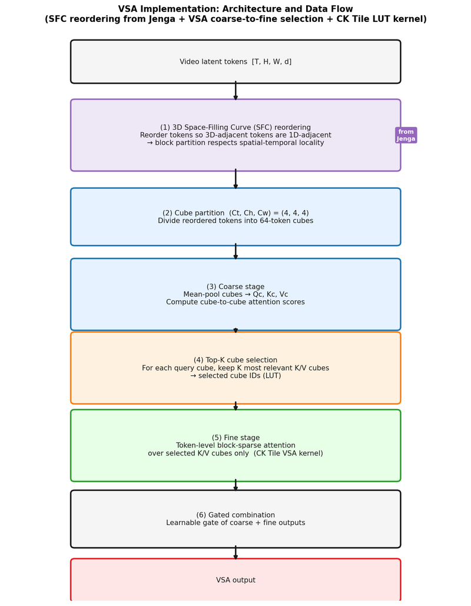
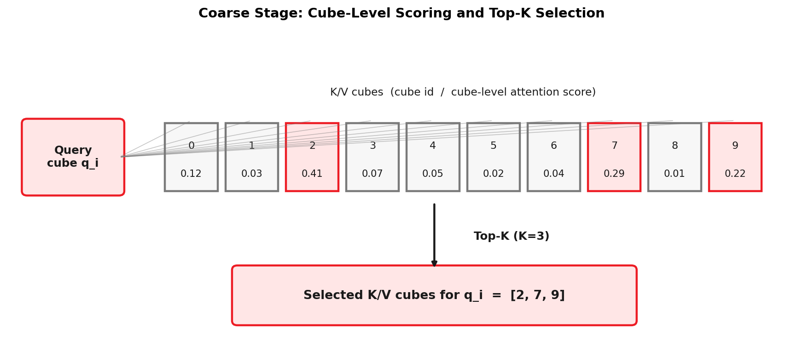
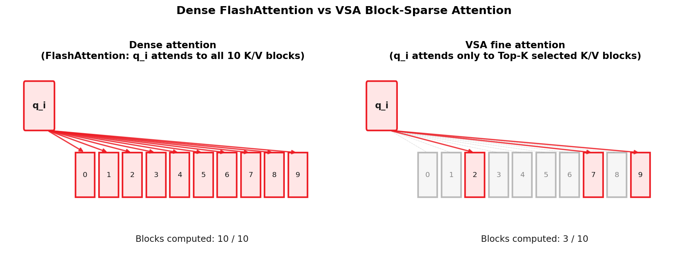
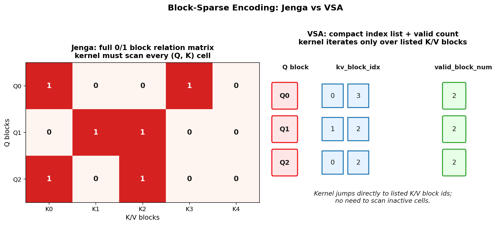
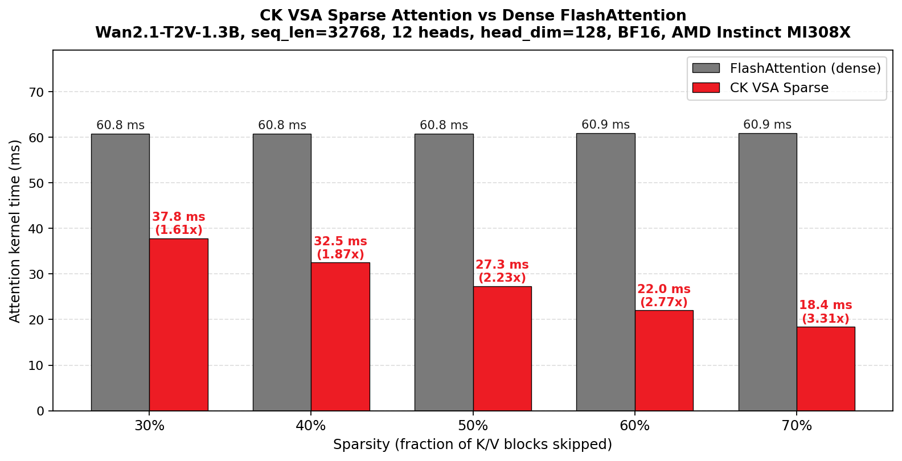
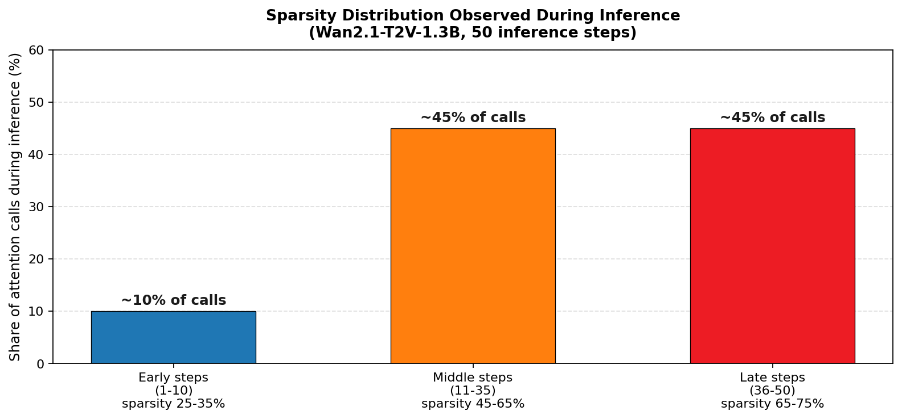

<!---
Copyright (c) 2026 Advanced Micro Devices, Inc. (AMD)

Permission is hereby granted, free of charge, to any person obtaining a copy
of this software and associated documentation files (the "Software"), to deal
in the Software without restriction, including without limitation the rights
to use, copy, modify, merge, publish, distribute, sublicense, and/or sell
copies of the Software, and to permit persons to whom the Software is
furnished to do so, subject to the following conditions:

The above copyright notice and this permission notice shall be included in all
copies or substantial portions of the Software.

THE SOFTWARE IS PROVIDED "AS IS", WITHOUT WARRANTY OF ANY KIND, EXPRESS OR
IMPLIED, INCLUDING BUT NOT LIMITED TO THE WARRANTIES OF MERCHANTABILITY,
FITNESS FOR A PARTICULAR PURPOSE AND NONINFRINGEMENT. IN NO EVENT SHALL THE
AUTHORS OR COPYRIGHT HOLDERS BE LIABLE FOR ANY CLAIM, DAMAGES OR OTHER
LIABILITY, WHETHER IN AN ACTION OF CONTRACT, TORT OR OTHERWISE, ARISING FROM,
OUT OF OR IN CONNECTION WITH THE SOFTWARE OR THE USE OR OTHER DEALINGS IN THE
SOFTWARE.
--->

# VSA: Accelerating Video Diffusion Inference with Sparse Attention on AMD GPUs

Video generation powered by diffusion transformers has achieved remarkable quality, but the computational cost of attention mechanisms remains a critical bottleneck. With sequence lengths reaching tens of thousands of tokens in video generation tasks, the quadratic complexity of standard attention becomes prohibitively expensive.

This blog introduces **[VSA (Video Sparse Attention)](https://arxiv.org/abs/2505.13389)** implemented with CK Tile, a hardware-efficient sparse attention mechanism that significantly accelerates video diffusion inference. We demonstrate how VSA, implemented through AMD's CK Tile library, delivers significant speedups across various sparsity levels, achieving a **3.31× attention kernel-time speedup** at 70% sparsity over FlashAttention on AMD Instinct™ MI308X GPUs, with qualitative visual checks included as a sanity check. This VSA CK Tile implementation was developed by the **AMD Quark team**.

*Results may vary based on model, prompt, resolution, frame count, sequence length, sparsity level, inference settings, software versions, system configuration, and other factors.*

## The Attention Bottleneck in Video Diffusion

Modern video diffusion models like [Wan2.1](https://github.com/Wan-Video/Wan2.1), [HunyuanVideo](https://github.com/Tencent/HunyuanVideo), and [CogVideoX](https://github.com/THUDM/CogVideo) rely on transformer architectures where attention dominates both compute and memory costs. For a typical video generation task:

| Parameter                | Typical Value                            |
| -------------------------- | ------------------------------------------ |
| **Resolution**           | 832 × 480                               |
| **Frames**               | 81                                       |
| **Sequence Length**      | 32,768 tokens                            |
| **Attention Complexity** | O(N²) = ~1 billion operations per layer |

The standard scaled dot-product attention (SDPA) formula is:

$$\text{Attention}(Q, K, V) = \text{Softmax}\left(\frac{QK^T}{\sqrt{d_k}}\right) V$$

While FlashAttention optimizes memory access patterns, it still computes attention over all token pairs. However, research has shown that **most attention mass concentrates in a small subset of positions**—a property that sparse attention methods exploit to reduce computation.

## VSA: Video Sparse Attention

[VSA (Video Sparse Attention)](https://arxiv.org/abs/2505.13389) is a hardware-efficient sparse attention mechanism designed specifically for video diffusion transformers. Developed by researchers from UC San Diego, MBZUAI, and UC Berkeley, VSA introduces a **two-stage coarse-to-fine attention** approach that dramatically reduces computation during inference by focusing token-level attention on selected spatial-temporal regions.

### Core Principles

VSA is built on three key insights:

1. **Attention Sparsity**: In video diffusion, attention patterns exhibit strong spatial-temporal locality. Tokens primarily attend to nearby frames and spatial regions, making full attention wasteful.
2. **Hardware Alignment**: Sparse patterns must align with GPU tile sizes to achieve actual wall-clock speedups, not just theoretical FLOP reductions.
3. **Adaptive Selection**: VSA dynamically selects which blocks to attend to based on the attention patterns, adapting to the specific characteristics of video data.

### Two-Stage Architecture

VSA implements a two-stage coarse-to-fine selection mechanism. The goal is to avoid computing full attention over all video tokens while still preserving the most important spatial-temporal regions. The end-to-end data flow is summarized in the figure below.



#### Pre-stage: 3D Space-Filling Curve (SFC) Token Reordering

Before any attention computation, video tokens are reordered using a **3D space-filling curve (SFC)**—a technique adopted from [Jenga](https://arxiv.org/abs/2505.16864). In native linear layout (T, H, W), tokens that are spatially adjacent in 3D but far apart in the flattened 1D sequence can end up in different attention blocks, breaking spatial locality. SFC reordering remaps token positions so that tokens close together in 3D space are also close together in the 1D sequence. This ensures that when the sequence is partitioned into fixed-size blocks for the attention kernel, each block corresponds to a contiguous spatial-temporal region of the video—which is the prerequisite for block-sparse patterns to be meaningful.

#### Stage 1: Coarse Selection

After SFC reordering, VSA groups neighboring video tokens into spatial-temporal cubes. In the VSA paper, a typical setting is `(Ct, Ch, Cw) = (4, 4, 4)`, so each cube contains 64 tokens. Each cube is mean-pooled into one cube-level representation, producing cube-level `Qc`, `Kc`, and `Vc`.

The coarse stage then computes cube-to-cube attention scores. For each query cube, VSA selects the Top-K key/value cubes with the highest scores. These selected cube IDs define the block-sparse attention pattern used by the fine stage.



Conceptually, each selected cube-level entry expands into a `B x B` block in the full attention mask. In practice, VSA does not materialize this full-resolution mask. Instead, it passes the selected block indices directly to the fine-grained attention kernel.

#### Stage 2: Fine Computation

The fine stage performs normal token-level attention, but only over the K/V cubes selected by the coarse stage. Unselected cubes are skipped entirely, reducing both memory traffic and attention computation while keeping the work aligned with block-sparse GPU kernels.



The final VSA output combines the coarse-stage output and the fine-stage output through learnable gates. This keeps global context from the coarse stage while using sparse token-level attention for the most important regions.

### Block-Sparse Encoding

VSA implements block-level sparse encoding that aligns with GPU execution characteristics:

```text
VSA Sparse Structure:
+-- lut_ptr           # Block index lookup table
+-- valid_block_num   # Number of valid blocks per query row
+-- kv_block_idx      # K/V block indices for each query block
```

This block encoding format allows the kernel to skip irrelevant blocks entirely. Unlike a full 0/1 block mask, VSA stores only selected K/V block indices plus the number of valid blocks for each query block.

## CK Tile Implementation

We provide high-performance implementations of VSA optimized for AMD Instinct GPUs in AMD's [Composable Kernel (CK) Tile](https://github.com/ROCm/composable_kernel) library.

### Key Components

| Component            | File Path                                                                             |
| ---------------------- | --------------------------------------------------------------------------------------- |
| **VSA Entry Point**  | `example/ck_tile/50_sparse_attn/vsa_sparse_attention.cpp`                              |
| **Dispatch & Kargs** | `example/ck_tile/50_sparse_attn/fmha_fwd_trek.hpp`                                    |
| **VSA Kernel**       | `include/ck_tile/ops/sparse_attn/kernel/fmha_fwd_vsa_kernel.hpp`                      |
| **VSA Pipeline**     | `include/ck_tile/ops/sparse_attn/pipeline/block_fmha_pipeline_qr_ks_vs_async_vsa.hpp` |

### Kernel Architecture

The CK Tile VSA kernel implements a three-stage pipeline with double buffering, enabling asynchronous overlap of computation and memory access:

#### Stage 1: QK GEMM + Softmax Statistics

```text
Q tiles × K tiles → attention scores
Compute running max (M) and sum (L) for online softmax
```

#### Stage 2: Softmax + Post-ops

```text
Apply softmax normalization using M and L
```

#### Stage 3: KV GEMM

```text
Softmax output × V tiles → attention output
Accumulate with previous tiles
```

### Sparse Traversal

Unlike dense attention that iterates over all K/V blocks, VSA uses the LUT to jump directly to relevant blocks:

```cpp
// Pseudo-code for VSA kernel traversal
for (int i = 0; i < valid_block_num[query_block]; i++) {
    int kv_block = kv_block_idx[query_block][i];
    // Load K/V tiles from kv_block
    // Compute attention for this block pair
}
```

This eliminates wasted computation on blocks that would contribute negligible attention weight.

## Comparison with Jenga

[Jenga](https://arxiv.org/abs/2505.16864) is another recent work targeting efficient video diffusion inference, and its CK Tile implementation shares the same block-sparse attention infrastructure as VSA. However, VSA and Jenga differ substantially in their **algorithmic design**, **sparse pattern selection strategy**, and **system-level scope**—not just in their kernel encoding format.

### Algorithmic Design

**VSA** is a **single-component sparse attention** method. Its two stages (coarse and fine) both operate within the attention module of each transformer layer: the coarse stage selects which K/V cubes matter for each query, and the fine stage computes token-level attention only over those cubes. The final output is a learnable gate of the two stages.

**Jenga** is a **two-component inference pipeline**:

1. **AttenCarve** (within-step sparse attention): Jenga first reorders tokens using a **3D space-filling curve (SFC)** so that spatially adjacent video tokens are also adjacent in the 1D flattened sequence, then partitions them into M uniform blocks. The sparse block selection is the union of **three masks**:
   - **Importance Mask (B_top)**: data-dependent; uses block-level mean Q/K scores (similar in spirit to VSA's coarse stage) to select Top-K relevant K/V blocks per query block.
   - **Condition Mask (B_cond)**: pre-computed; attends to text condition tokens to preserve cross-modal alignment.
   - **Adjacency Mask (B_adja)**: pre-computed; attends to spatially adjacent blocks to maintain local spatial coherence.

2. **ProRes** (cross-step resolution scheduling): early denoising steps run on **low-resolution latents** (fewer tokens); resolution is gradually increased to the target as denoising progresses. This reduces quadratic attention cost at the pipeline level, independently of AttenCarve.

### Sparse Encoding in CK Tile

When both methods are implemented as CK Tile kernels, the difference in how they store the sparse pattern becomes concrete:



- **VSA** stores only the *selected* K/V block indices plus a valid-count per query block (compact index list / LUT). The kernel jumps directly to active blocks.
- **Jenga** stores the full M×M one-hot block relation matrix **B** and skips cells where B\[i\]\[j\]=0 during traversal.

VSA's encoding is more compact when sparsity is high; Jenga's encoding naturally represents the union of its three heterogeneous masks (Importance ∪ Condition ∪ Adjacency) without converting to a list.

### Side-by-Side Summary

| Dimension | VSA | Jenga |
| --- | --- | --- |
| **Sparse selection** | Single Top-K from coarse cube-level attention | Union of 3 masks: data-driven Top-K + forced text-condition + forced adjacency |
| **Token organization** | **3D SFC reordering (adopted from Jenga)** → spatial-temporal cubes | 3D Space-Filling Curve (SFC) reordering → uniform blocks |
| **System scope** | Within-step attention only | Within-step (AttenCarve) + cross-step resolution (ProRes) + timestep skip |
| **Training required** | Yes (learnable gate between coarse and fine) | No (training-free, plug-and-play) |
| **Local coherence** | Captured implicitly by cube structure | Explicit Adjacency Mask enforces local block attention |
| **Text condition** | Not separately handled | Explicit Condition Mask preserves text-token attention |
| **Kernel encoding** | Compact index list + valid count (LUT) | Full M×M one-hot block relation matrix |
| **Reported speedup** | 3.31× attention kernel vs FlashAttention (measured by AMD, see [Performance Benchmarks](#performance-benchmarks)) | 8.83× end-to-end on VBench (0.01% quality drop), as reported by the Jenga authors |

> **Note on speedup numbers**: the two figures measure different things. VSA's 3.31× is a kernel-level timing comparison against FlashAttention at a fixed 70% sparsity. Jenga's 8.83× is an end-to-end pipeline speedup that includes both AttenCarve and ProRes (reduced token count from lower resolution). A direct apples-to-apples comparison would require running both on the same model under the same conditions. The Jenga figures in this section, including the 8.83× speedup and the accompanying quality result, are those reported in the Jenga paper ([arXiv:2505.16864](https://arxiv.org/abs/2505.16864)); AMD has not independently reproduced or verified them. The descriptions of Jenga's design in the table above are likewise drawn from that paper.

In our CK Tile implementation, both methods actually share the **3D SFC token reordering** step upstream. The key difference lies in what happens after reordering: VSA uses a Top-K coarse attention score to build a compact LUT, while Jenga builds a full M×M block relation matrix from its three-mask union. The choice of kernel then follows naturally from the encoding: the VSA CK Tile kernel consumes the compact LUT, while the Jenga CK Tile kernel consumes the full block matrix.

## Qualitative Visual Check

We generated videos using the same prompt ("Two anthropomorphic cats in comfy boxing gear and bright gloves fight intensely on a spotlighted stage.") and the same random seed with dense FlashAttention and CK VSA Sparse Attention. The purpose of this check is to confirm that the sparse attention path does not introduce obvious visual artifacts in this sample.

### Visual Comparison

| Flash Attention (Dense, ~60.8 ms) | CK VSA Sparse (Sparse, ~25 ms avg) |
| --- | --- |
|  |  |

### Quality Notes

| Implementation | Observation | Notes |
| --- | --- | --- |
| **FlashAttention** | Dense baseline | Computes all token pairs |
| **CK VSA Sparse** | Visually close to baseline in this sample | No obvious artifacts observed in the sampled frames |

This is a qualitative sanity check rather than a full video-generation quality benchmark. We have not yet included quantitative metrics such as VBench in this post. A VBench-style evaluation would be useful future work to measure detail preservation, temporal consistency, and semantic alignment more rigorously.

## Performance Benchmarks

We benchmarked CK VSA Sparse Attention against dense FlashAttention on a text-to-video generation task using the **Wan2.1-T2V-1.3B** model (832x480, 81 frames, 50 inference steps, BF16) on a single **AMD Instinct™ MI308X** GPU. Each attention call operates on Q/K/V of shape `[1, 12, 32768, 128]` with a `128 x 128` block size. Detailed tensor specifications and the per-step sparsity distribution observed during inference are listed in the [Appendix: Detailed Benchmark Configuration](#appendix-detailed-benchmark-configuration).

### Headline Result: Kernel Time by Sparsity Level

The figure below is the headline comparison: CK VSA Sparse Attention versus dense FlashAttention at varying sparsity levels. Higher sparsity means fewer K/V blocks are selected by VSA, which directly translates into shorter attention kernel time. FlashAttention is essentially constant (~60.8 ms) because it computes dense attention regardless of the sparse pattern, while CK VSA's runtime decreases as sparsity increases, reaching a **3.31×** kernel-time speedup at 70% sparsity.



### End-to-End Impact

Aggregated over the full 50-step inference using the sparsity distribution actually observed during generation (see [Sparsity Distribution During Inference](#sparsity-distribution-during-inference) below), the kernel-time gains translate into roughly **~37% lower end-to-end generation time** (about **3 min** with VSA versus **~4 min 47 s** with FlashAttention) on this configuration.

The kernel timings above assume the selected block indices are already available to the sparse kernel. In a full deployment, the coarse-stage selection and LUT generation must also be accounted for; that overhead is designed to be lightweight and is amortized by the savings in the fine stage, but it should still be measured in any production evaluation.

## Summary

We presented a CK Tile implementation of Video Sparse Attention (VSA) for video diffusion inference on AMD Instinct GPUs. On Wan2.1-T2V-1.3B at 32,768 tokens per attention call, CK VSA delivers up to **3.31×** kernel-time speedup over dense FlashAttention at 70% sparsity, and roughly **37%** lower end-to-end generation time on MI308X. We also compared the CK VSA index-list encoding with the existing CK Jenga block-mask encoding to clarify when each representation is preferable. As video diffusion models grow in resolution and length, hardware-aligned block-sparse attention such as VSA becomes increasingly important for practical deployment; a quantitative quality study (e.g., VBench) on top of these results is left as future work. For the full benchmark setup and the per-step sparsity distribution, please see the [Appendix: Detailed Benchmark Configuration](#appendix-detailed-benchmark-configuration).

*Results may vary based on model, prompt, resolution, frame count, sequence length, sparsity level, inference settings, software versions, system configuration, and other factors.*

## Appendix - Detailed Benchmark Configuration

The main text uses a single condensed configuration paragraph. The full set of parameters and the per-step sparsity behavior are listed here for reproducibility.

### Test Configuration

| Parameter           | Value                     |
| --------------------- | --------------------------- |
| **Hardware**        | AMD Instinct™ MI308X GPU |
| **Model**           | Wan2.1-T2V-1.3B           |
| **Task**            | Text-to-Video Generation  |
| **Resolution**      | 832 × 480                |
| **Frames**          | 81                        |
| **Inference Steps** | 50                        |
| **Data Type**       | BF16                      |

### Tensor Specifications

| Parameter                    | Value                 |
| ------------------------------ | ----------------------- |
| **Q/K/V Shape**              | `[1, 12, 32768, 128]` |
| **Batch Size**               | 1                     |
| **Number of Heads**          | 12                    |
| **Sequence Length**          | 32,768 tokens         |
| **Head Dimension**           | 128                   |
| **Block Size**               | 128 × 128            |
| **Block Grid Shape**         | `[1, 12, 256, 256]`   |
| **Attention Calls per Step** | ~55-60                |

> **Note:** the `(Ct, Ch, Cw) = (4, 4, 4)` cubes mentioned in the VSA algorithm are used for the coarse Top-K selection; the `128 × 128` block size above refers to the GPU tile granularity at which the fine-stage CK Tile kernel iterates over the selected K/V cubes.

### Sparsity Distribution During Inference

Sparsity is not constant across diffusion steps. Early diffusion steps select more K/V blocks (lower sparsity), while late steps become more selective (higher sparsity). The distribution we observed on this workload is shown below.



Combining this distribution with the per-sparsity kernel times in the main text gives a weighted-average attention kernel time of roughly **~25 ms** per call for CK VSA versus ~60.8 ms for FlashAttention, which is the basis for the end-to-end speedup quoted above.

### When CK VSA Sparse Attention Helps Most

| Sparsity range | Observed speedup vs FlashAttention | Practical guidance |
| --- | --- | --- |
| < 40%   | ~1.6×  | Marginal; dense FlashAttention is a reasonable fallback |
| 40-60% | ~1.9× – 2.8× | CK VSA recommended |
| > 60%  | > 2.8× | CK VSA strongly recommended |

## Integration Guide

### Prerequisites

- **GPU**: AMD Instinct™ MI308X or other ROCm-compatible GPU
- **ROCm**: 6.3+
- **PyTorch**: 2.3+
- **CK Tile**: Latest from [composable_kernel](https://github.com/ROCm/composable_kernel)

### Using VSA with CK Tile

The VSA implementation is available through the [AITER](https://github.com/ROCm/aiter) Python bindings, which wrap the CK Tile C++ kernels. Note that CK VSA and CK Jenga share the same sparse-attention dispatcher module in AITER, which is why the import path is named after `jenga_sparse_attention`; the underlying VSA kernel is still the index-list / LUT-based implementation described above.

```python
from aiter.ops.jenga_sparse_attention import vsa_sparse_attention

# Prepare inputs
TQ = torch.randn(batch, heads, seq_len, head_dim, dtype=torch.bfloat16, device="cuda")
TK = torch.randn(batch, heads, seq_len, head_dim, dtype=torch.bfloat16, device="cuda")
TV = torch.randn(batch, heads, seq_len, head_dim, dtype=torch.bfloat16, device="cuda")

# Prepare LUT from Top-K selection
Tkv_block_idx = ...  # [batch, heads, num_q_blocks, max_kv_blocks] block indices
Tkv_blocks = ...     # [batch, heads, num_q_blocks] valid block count per query

# Allocate output
out = torch.zeros_like(TQ)

# Compute VSA sparse attention
output = vsa_sparse_attention(
    TQ, TK, TV,
    Tkv_block_idx,    # LUT: K/V block indices for each Q block
    Tkv_blocks,       # Number of valid K/V blocks per query block
    out,
    batch=batch, nhead=heads, nhead_k=heads,
    seqlen_q=seq_len, seqlen_k=seq_len,
    hdim_q=head_dim, hdim_v=head_dim
)
```

**Key Input Parameters**:

| Parameter | Shape | Description |
| --- | --- | --- |
| `TQ`, `TK`, `TV` | `[B, H, S, D]` | Query, Key, Value tensors (BF16) |
| `Tkv_block_idx` | `[B, H, Q_blocks, max_K_blocks]` | LUT storing K/V block indices for each Q block |
| `Tkv_blocks` | `[B, H, Q_blocks]` | Number of valid K/V blocks to compute per query block |

**CK Tile Source Code**:

| Component | File Path |
| --- | --- |
| VSA Kernel Example | `example/ck_tile/50_sparse_attn/vsa_sparse_attention.cpp` |
| Dispatch Logic | `example/ck_tile/50_sparse_attn/fmha_fwd_trek.hpp` |
| VSA Kernel | `include/ck_tile/ops/sparse_attn/kernel/fmha_fwd_vsa_kernel.hpp` |
| VSA Pipeline | `include/ck_tile/ops/sparse_attn/pipeline/block_fmha_pipeline_qr_ks_vs_async_vsa.hpp` |

### Generating Sparsity Patterns

VSA requires upstream sparsity selection to generate the LUT. These can be:

1. **Heuristic-based**: Use spatial-temporal locality to determine block importance
2. **Profile-based**: Analyze attention patterns from sample runs to derive sparsity masks
3. **Dynamic**: Compute coarse attention scores at runtime for selection

> **Note:** The following is illustrative pseudocode. `pool_to_blocks` is a placeholder for the actual cube-level mean-pool used by VSA; see the VSA paper for the production implementation.

```python
def generate_sparsity_lut(query, key, block_size, top_k_ratio):
    """Generate LUT using coarse attention scores."""
    # Pool tokens into blocks
    q_blocks = pool_to_blocks(query, block_size)
    k_blocks = pool_to_blocks(key, block_size)

    # Compute coarse attention
    coarse_scores = torch.einsum('bhqd,bhkd->bhqk', q_blocks, k_blocks)

    # Top-K selection per query block
    top_k = int(coarse_scores.shape[-1] * top_k_ratio)
    _, lut = torch.topk(coarse_scores, top_k, dim=-1)

    return lut, top_k
```

## Acknowledgements

The authors would like to thank the AMD CK Tile and AITER teams for their support in developing and optimizing the sparse attention kernels on AMD Instinct GPUs — in particular Letao Qin, Poyen Chen, and Hanwen (Kevin) Chang for their guidance on the kernel implementation. We would also like to thank our colleagues on the AMD Quark team, in particular Han Lin, for their insightful feedback and technical discussions. We also thank the original VSA authors from UC San Diego, MBZUAI, and UC Berkeley for open-sourcing their work and making this collaboration possible.

## Additional Resources

- **Paper:** [VSA: Faster Video Diffusion with Trainable Sparse Attention](https://arxiv.org/abs/2505.13389)
- **Paper:** [Jenga: Towards Efficient Sparse Attention for Diffusion Transformer Inference](https://arxiv.org/abs/2505.16864)
- [Composable Kernel (CK Tile) on GitHub](https://github.com/ROCm/composable_kernel)
- [AITER: AMD Inference Engine Repository](https://github.com/ROCm/aiter)
- [Wan2.1 Text-to-Video Model](https://github.com/Wan-Video/Wan2.1)
- [ROCm Documentation](https://rocm.docs.amd.com)

## Disclaimers

The information presented in this document is for informational purposes only and may contain technical inaccuracies, omissions, and typographical errors. The information contained herein is subject to change and may be rendered inaccurate for many reasons, including but not limited to product and roadmap changes, component and motherboard version changes, new model and/or product releases, product differences between differing manufacturers, software changes, BIOS flashes, firmware upgrades, or the like. Any computer system has risks of security vulnerabilities that cannot be completely prevented or mitigated. AMD assumes no obligation to update or otherwise correct or revise this information. However, AMD reserves the right to revise this information and to make changes from time to time to the content hereof without obligation of AMD to notify any person of such revisions or changes.

THIS INFORMATION IS PROVIDED "AS IS." AMD MAKES NO REPRESENTATIONS OR WARRANTIES WITH RESPECT TO THE CONTENTS HEREOF AND ASSUMES NO RESPONSIBILITY FOR ANY INACCURACIES, ERRORS, OR OMISSIONS THAT MAY APPEAR IN THIS INFORMATION. AMD SPECIFICALLY DISCLAIMS ANY IMPLIED WARRANTIES OF NON-INFRINGEMENT, MERCHANTABILITY, OR FITNESS FOR ANY PARTICULAR PURPOSE. IN NO EVENT WILL AMD BE LIABLE TO ANY PERSON FOR ANY RELIANCE, DIRECT, INDIRECT, SPECIAL, OR OTHER CONSEQUENTIAL DAMAGES ARISING FROM THE USE OF ANY INFORMATION CONTAINED HEREIN, EVEN IF AMD IS EXPRESSLY ADVISED OF THE POSSIBILITY OF SUCH DAMAGES.

Third-party content is licensed to you directly by the third party that owns the content and is not licensed to you by AMD. ALL LINKED THIRD-PARTY CONTENT IS PROVIDED "AS IS" WITHOUT A WARRANTY OF ANY KIND. USE OF SUCH THIRD-PARTY CONTENT IS DONE AT YOUR SOLE DISCRETION AND UNDER NO CIRCUMSTANCES WILL AMD BE LIABLE TO YOU FOR ANY THIRD-PARTY CONTENT. YOU ASSUME ALL RISK AND ARE SOLELY RESPONSIBLE FOR ANY DAMAGES THAT MAY ARISE FROM YOUR USE OF THIRD-PARTY CONTENT.

AMD, the AMD Arrow logo, and combinations thereof are trademarks of Advanced Micro Devices, Inc. Other product names used in this publication are for identification purposes only and may be trademarks of their respective companies.

© 2026 Advanced Micro Devices, Inc. All rights reserved.
