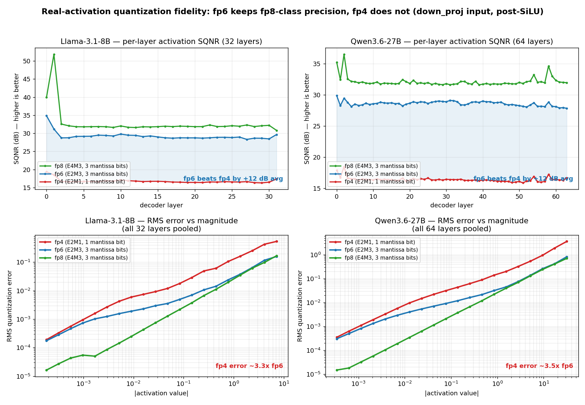
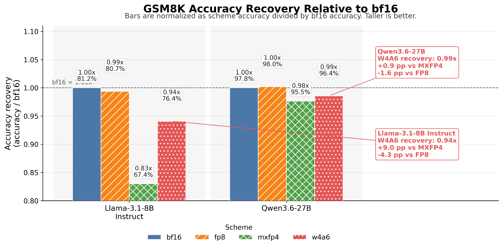
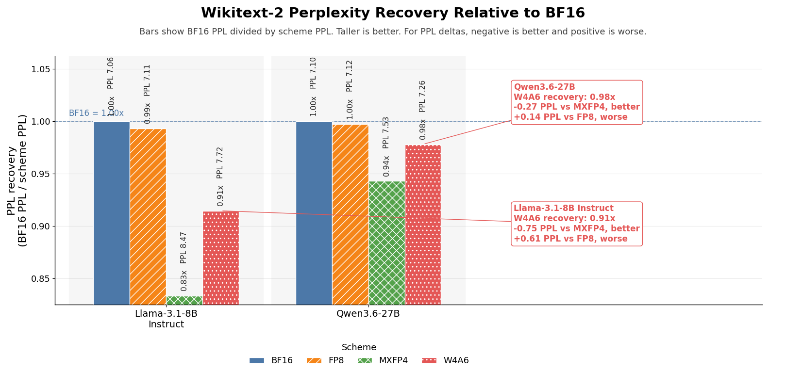
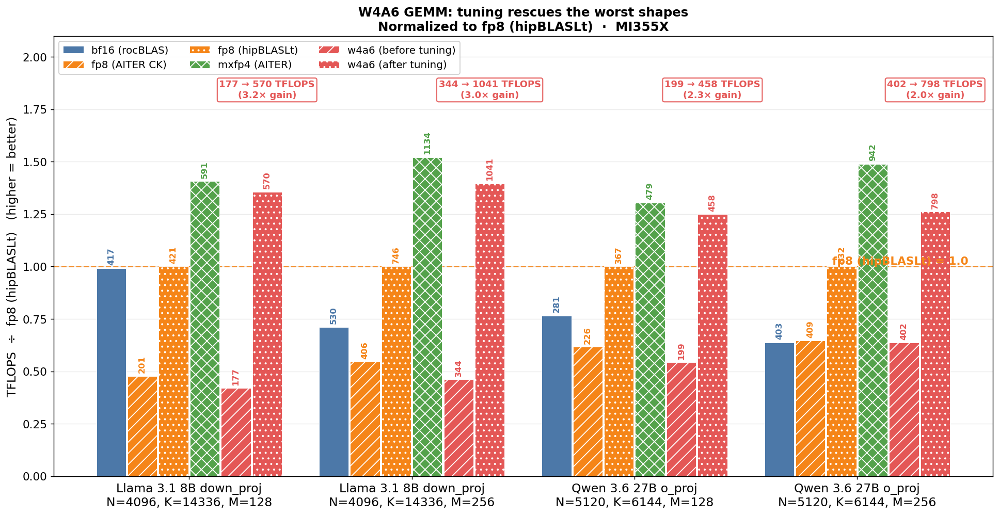
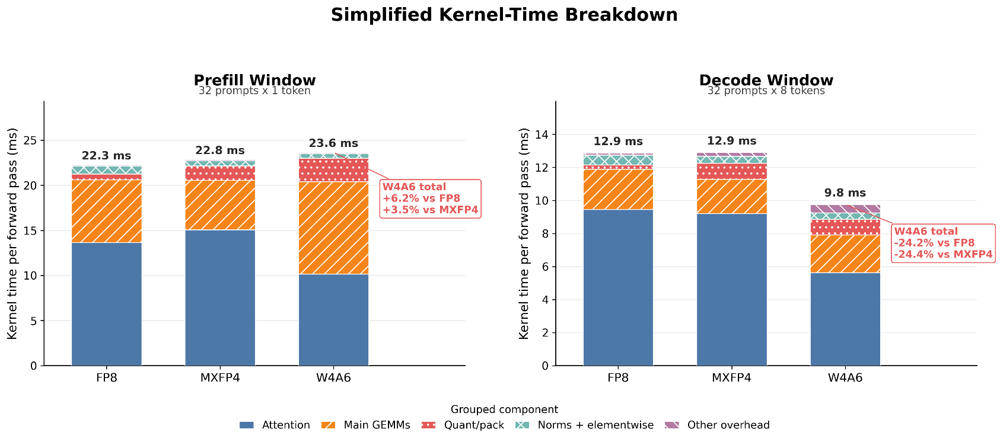
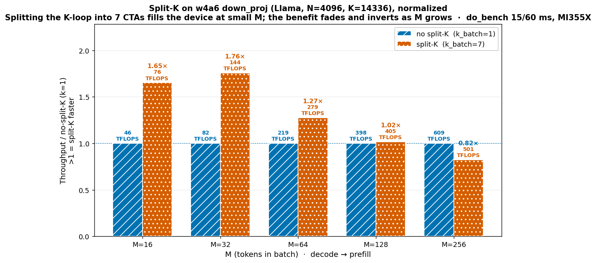
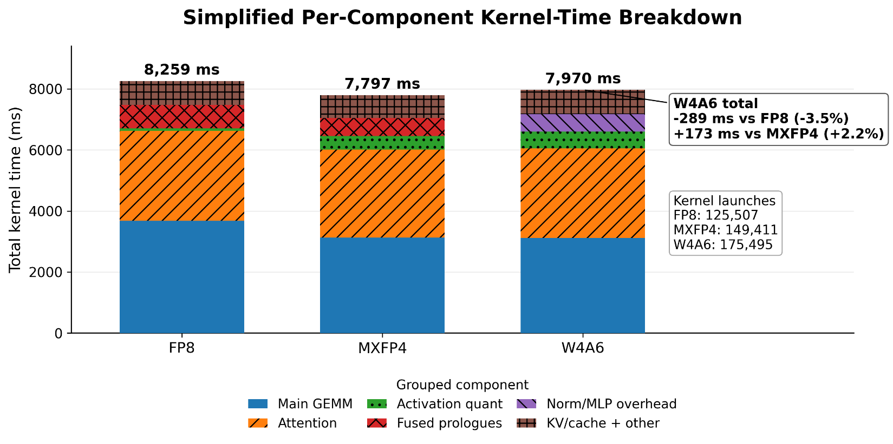
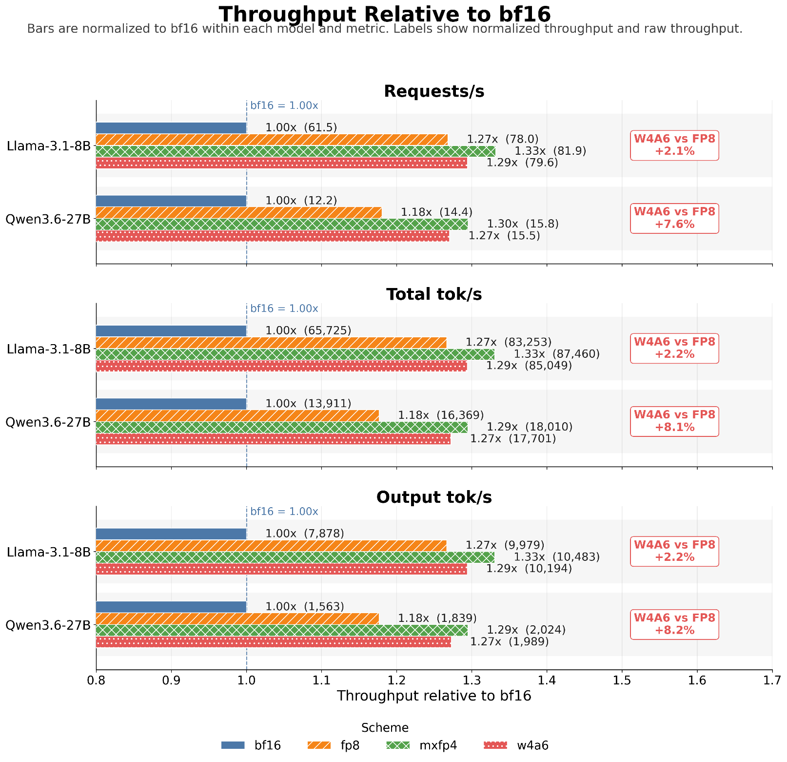
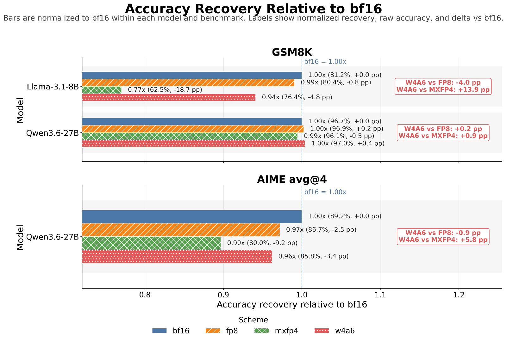
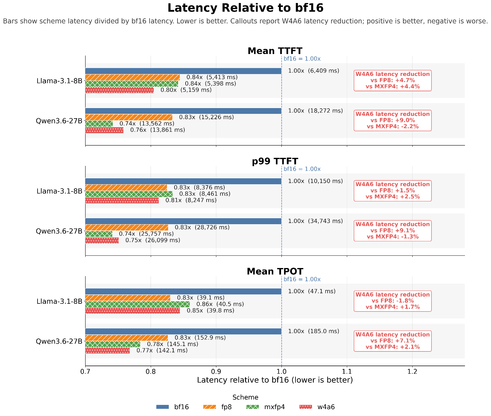

<!---
Copyright (c) 2026 Advanced Micro Devices, Inc. (AMD)

Permission is hereby granted, free of charge, to any person obtaining a copy
of this software and associated documentation files (the "Software"), to deal
in the Software without restriction, including without limitation the rights
to use, copy, modify, merge, publish, distribute, sublicense, and/or sell
copies of the Software, and to permit persons to whom the Software is
furnished to do so, subject to the following conditions:

The above copyright notice and this permission notice shall be included in all
copies or substantial portions of the Software.

THE SOFTWARE IS PROVIDED "AS IS", WITHOUT WARRANTY OF ANY KIND, EXPRESS OR
IMPLIED, INCLUDING BUT NOT LIMITED TO THE WARRANTIES OF MERCHANTABILITY,
FITNESS FOR A PARTICULAR PURPOSE AND NONINFRINGEMENT. IN NO EVENT SHALL THE
AUTHORS OR COPYRIGHT HOLDERS BE LIABLE FOR ANY CLAIM, DAMAGES OR OTHER
LIABILITY, WHETHER IN AN ACTION OF CONTRACT, TORT OR OTHERWISE, ARISING FROM,
OUT OF OR IN CONNECTION WITH THE SOFTWARE OR THE USE OR OTHER DEALINGS IN THE
SOFTWARE.
--->

# MXFP6 and MXFP4 Mixed Precision for Accelerating Dense LLMs on AMD Instinct MI355X

In this blog, you will learn how pairing MXFP6-E2M3 activations with MXFP4 weights can meaningfully recover accuracy lost to pure 4-bit MXFP4 quantization in specific workloads and configurations, while staying within 2–3% of MXFP4 throughput. You will see measured offline throughput, serving latency, and benchmark accuracy results comparing BF16, FP8, MXFP4, and W_MXFP4_A_MXFP6 on Llama-3.1-8B and Qwen3.6-27B on AMD Instinct MI355X.

We revisit [the mxfp6 (E2M3)](https://arxiv.org/abs/2310.10537) activations accuracy and throughput performance, building on our [earlier finding](https://rocm.blogs.amd.com/software-tools-optimization/mxfp4-mxfp6-quantization/README.html) that MXFP6 and mixed MXFP4–MXFP6 consistently outperform MXFP4 on accuracy. In this blog post we test whether that accuracy advantage carries through by implementing a W_MXFP4_A_MXFP6 (MXFP4 weights (4-bit) × MXFP6-E2M3 activations) matrix multiplication kernel and an MXFP6-E2M3 activations quantization kernel integrated in the vLLM pipeline. We also present end-to-end throughput and evaluation accuracy for Llama-3.1-8B and Qwen3.6-27B models. Weights are pre-quantized offline (Quark checkpoint); activations are quantized at runtime by the kernel. We proceed in four steps: tensor-level fidelity, an emulation sanity-check, the kernel and end-to-end results.

- **The idea**: W_MXFP4_A_MXFP6 = MXFP4 4-bit weights × MXFP6-E2M3 6-bit activations — spending two extra bits on activations (versus all-4-bit MXFP4). It lands between MXFP4 and FP8: near-MXFP4 throughput, near-FP8 accuracy, at half of FP8's weight bits.

- **Accuracy**: W_MXFP4_A_MXFP6 recovers most of MXFP4's loss. On Llama-3.1-8B GSM8K it moves from 62.55% (MXFP4) to 76.4% (W_MXFP4_A_MXFP6), versus 80.44% for FP8, and Wikitext-2 perplexity sits closer to FP8 than to MXFP4. On Qwen3.6-27B AIME26 (avg@4), W_MXFP4_A_MXFP6 reaches 85.8%, tracking FP8 (86.7%) within about 1 point and exceeding MXFP4 (80.0%) by 5.8 points.

- **Speed**: In offline throughput, W_MXFP4_A_MXFP6 exceeds FP8 on both models — Llama-3.1-8B 85.0k versus 83.3k total tokens/s, and Qwen3.6-27B 17.7k versus 16.4k total tokens/s — while trailing MXFP4 by roughly 2–3%. In online serving, W_MXFP4_A_MXFP6 also reduces latency relative to BF16 across mean TTFT, p99 TTFT, and mean TPOT.

- **Bottom line**: Among the low-bit options evaluated here, W_MXFP4_A_MXFP6 is the most balanced throughput/accuracy operating point. It keeps most of MXFP4's performance benefit, recovers much of MXFP4's accuracy loss, and uses half of FP8's weight bits. It is most valuable when pure 4-bit activation quantization is too lossy — especially for hard reasoning and perplexity-sensitive workloads.

Hardware, software, and command-line settings are listed in the [test configuration and methodology](#test-configuration-and-methodology) section of the appendix.

## Generating W_MXFP4_A_MXFP6 Checkpoints with AMD Quark

In this work, the W_MXFP4_A_MXFP6 checkpoints are generated using [AMD Quark](https://github.com/amd/Quark) round-to-nearest (RTN) quantization on the base models (`meta-llama/Llama-3.1-8B-Instruct` and `Qwen/Qwen3.6-27B`).

The following command reproduces the quantization with Quark:

```bash
python quantize_quark.py \
  --model_dir "$model" \
  --quant_scheme $scheme \
  --exclude_layers "lm_head" \
  --model_export hf_format --weight_format real_quantized --pack_method reorder \
  --output_dir "${tag}-${scheme}" --skip_evaluation
```

The schemes are `fp8`, `mxfp4`, and `mxfp4_mxfp6_e2m3`. Calibration is not required for these schemes (RTN weights plus dynamic activations — no stored activation scale).

Throughout this post:

- **fp8** = `w_fp8_a_fp8` (per-token, per-channel)
- **mxfp4** = `w_mxfp4_a_mxfp4`
- **W_MXFP4_A_MXFP6** = `w_mxfp4_a_mxfp6_e2m3` (MXFP4 weights × MXFP6-E2M3 activations)
- **bf16** is the unquantized reference

## Per-Layer Quantization Error Analysis

Prior work such as [SmoothQuant](https://arxiv.org/abs/2211.10438) highlights a key challenge in low-bit inference: activations are often harder to quantize than weights because their distributions are input-dependent and can contain large outlier channels. Motivated by this observation, we measure activation quantization error directly by comparing the post-SiLU `down_proj` input from every transformer block of Llama-3.1-8B-Instruct and Qwen3.6-27B on a real prompt. We use BF16 as the reference and quantize the activations with Quark's OCP-MX reference quantizers across MXFP4, FP8, and W_MXFP4_A_MXFP6.

We report two metrics, where $x$ is the BF16 reference and $\hat{x} = \mathrm{dequantize}(\mathrm{quantize}(x))$:

$$
\mathrm{SQNR}_{\mathrm{dB}} = 10 \cdot \log_{10}\!\left(\frac{\sum x^2}{\sum (x - \hat{x})^2}\right)
$$

$$
\mathrm{RMS\ Error} = \sqrt{\operatorname{mean}\!\left((x - \hat{x})^2\right)}
$$

FP4 and FP6 use identical OCP-MX block-32 scaling — only the element format differs; FP8 uses the real per-token E4M3 path, as shown in Figure 1.



*Figure 1: Top — per-layer SQNR (all 32/64 layers). Bottom — RMS error versus activation magnitude, pooled over all layers.*

This is not a one-layer result. The top two panels plot SQNR for *every* layer of each model: FP6 beats FP4 by about 12 dB at every depth and tracks within about 3.5 dB of FP8 (12 dB corresponds to roughly 16× lower noise power, or about 4× lower RMS error). To confirm that a few values are not responsible for the error, we also group all activation values across all layers, bin them by magnitude, and plot the RMS error per bin. Across the whole magnitude range, FP4's error curve sits about 3–4× above FP6's for both models — the gap is not confined to the outlier tail, it is everywhere. FP4's E2M1 element carries a single mantissa bit; FP6's E2M3 carries three. Because E2M3 and E4M3 share the *same* three mantissa bits, FP6's curve reaches FP8's at the large-magnitude end that dominates SQNR, conceding ground only on small values, where FP8's per-token scaling is finer.

At the tensor level, the two extra bits clearly help. The next question is whether the end-to-end evaluation tasks show a similar trend.

## Emulation (QDQ): W_MXFP4_A_MXFP6 Accuracy Evaluation

Before investing in a W_MXFP4_A_MXFP6 matrix multiplication and an MXFP6 activation-quantization kernel, we confirm that the tensor-level result (SQNR and RMS) carries through to end-to-end model evaluations for GSM8K and Wikitext-2, as shown in Figures 2 and 3 below.



*Figure 2: GSM8K accuracy recovery relative to BF16. Accuracy recovery for W_MXFP4_A_MXFP6 compared with MXFP4, with BF16 shown as the quality reference. Accuracy is normalized as scheme accuracy divided by BF16 accuracy, so taller bars indicate better recovery toward BF16 quality. Compared with MXFP4, W_MXFP4_A_MXFP6 improves GSM8K by +9.0 percentage points on Llama-3.1-8B-Instruct and by +0.9 percentage points on Qwen3.6-27B.*



*Figure 3: Wikitext-2 perplexity recovery relative to BF16. Perplexity recovery for W_MXFP4_A_MXFP6 compared with MXFP4, with BF16 shown as the quality reference. Perplexity recovery is computed as BF16 perplexity divided by scheme perplexity, so taller bars indicate better recovery toward BF16 quality. Compared with MXFP4, W_MXFP4_A_MXFP6 recovers 0.75 perplexity points on Llama-3.1-8B-Instruct and 0.27 perplexity points on Qwen3.6-27B.*

These are quantize-dequantize (QDQ) emulation numbers. GSM8K W_MXFP4_A_MXFP6 recovery for Llama-3.1-8B-Instruct is 94.1% of BF16, versus 83% for MXFP4. On Qwen3.6-27B, MXFP4 barely trails FP8 for GSM8K (95.5% versus 98.0% of BF16), whereas on Wikitext-2 perplexity W_MXFP4_A_MXFP6 recovers 3.5% more than MXFP4 (7.26 versus 7.53). Qwen3.6-27B is a dense thinking model, and GSM8K does not exercise its full capability.

This QDQ result is an emulation sanity check before investing in the W_MXFP4_A_MXFP6 kernel path. The final vLLM throughput and strict-match GSM8K results are reported later, in [Performance and accuracy results](#performance-and-accuracy-results).

The emulation accuracy lies between FP8 and MXFP4 and is much closer to FP8, which points in a positive direction. The only open question left is whether it can be made *fast*.

## Writing the W_MXFP4_A_MXFP6 Matrix Multiplication

Getting to a fast W_MXFP4_A_MXFP6 matrix-multiplication kernel was a two-step process. Triton cannot express MXFP6, so we moved to [FlyDSL](https://rocm.blogs.amd.com/software-tools-optimization/flydsl-python-native/README.html) and adapted its MXFP4 preshuffle GEMM to a 6-bit activation operand. Per-shape tuning plus a split-K reduction for the decode-shaped `down_proj` closed the gap and pushed W_MXFP4_A_MXFP6 past FP8 on offline throughput. The rest of this section walks through each step.

### Why Triton Isn't Enough

Triton is an industry-standard tool for writing production-level kernels with minimal effort. But as of this writing, the Triton `dot_scaled` path cannot express MXFP6 — it rejects E2M3 outright (`Not Yet Implemented: lhs_format e2m3`).

The `v_mfma_scale_f32_16x16x128_f8f6f4` instruction from CDNA4 supports 6- and 4-bit operands directly, applies per-block scales, and accumulates in FP32, so the arithmetic is essentially free — the hardware does it natively. The cost moves entirely into getting the bytes into the right registers in the right layout, which is a tiling, LDS, and scheduling problem.

### Adapting FlyDSL's Preshuffle GEMM

[FlyDSL](https://rocm.blogs.amd.com/software-tools-optimization/flydsl-python-native/README.html) fits this case well. It already includes a [preshuffle GEMM kernel](https://github.com/ROCm/FlyDSL/blob/main/kernels/preshuffle_gemm.py): a production MXFP4×MXFP4 GEMM (extensible to other types) that uses the same f8f6f4 MFMA, the same E8M0 block-scale path, and the same pre-shuffled weight layout. We made minimal changes — most importantly to the **A operand**, from 4-bit to 6-bit, which on this MFMA means a different `cbsz` and an FP8-padded A-tile (24 real bytes plus 8 zero-pad per K=32 chunk) instead of the dense FP4 packing. The kernel also needed a good dispatch heuristic and [tuning](https://rocm.docs.amd.com/en/latest/how-to/rocm-for-ai/inference-optimization/workload.html#mi300x-autotunable-kernel-config) for W_MXFP4_A_MXFP6. FlyDSL's Preshuffle GEMM kernel [now supports W_MXFP4_A_MXFP6](https://github.com/ROCm/FlyDSL/pull/684).

The results before and after tuning are shown in Figure 4.



*Figure 4: Per-shape A6W4 GEMM tuning results, normalized to FP8 hipBLASLt for each shape. Numbers on top of the bars show absolute TFLOPS.*

Before tuning, W_MXFP4_A_MXFP6 is substantially below the FP8 and MXFP4 baselines across all tested shapes. After per-shape tuning, W_MXFP4_A_MXFP6 improves by 2.0–3.2× over the untuned W_MXFP4_A_MXFP6 kernel and exceeds FP8 hipBLASLt on all four shapes. Tuned W_MXFP4_A_MXFP6 approaches MXFP4 performance, reaching within 3.6–15.7% of MXFP4 depending on shape.

With the standalone GEMM microbenchmarks in better shape, the next step was to plug the W_MXFP4_A_MXFP6 matrix multiplication into the vLLM backend for dense linear layers and measure end-to-end throughput with `vllm bench throughput`. The first result was underwhelming: on Llama-3.1-8B, W_MXFP4_A_MXFP6 barely matched BF16 throughput. That made profiling the next priority — we needed to understand where time was being spent before deciding what to tune next, as shown in Figure 5.



*Figure 5: Per-component kernel-time breakdown from PyTorch and rocprof profiling for the prefill and decode windows across FP8, MXFP4, and W_MXFP4_A_MXFP6. The prefill window measures 32 prompts × 1 token; the decode window measures 32 prompts × 8 tokens.*

In the prefill window, W_MXFP4_A_MXFP6 adds activation quantization/packing cost and increases main-GEMM time relative to both FP8 and MXFP4. In the decode window, W_MXFP4_A_MXFP6 activation quantization/packing is slightly lower than MXFP4, while main GEMM is lower than FP8 but higher than MXFP4. The profile shows two problems: the standalone activation-quantization path adds measurable overhead, and the W_MXFP4_A_MXFP6 GEMM is weaker on prefill-shaped workloads than on decode-shaped ones.

We wrote an activation-quantization kernel in FlyDSL using shuffle-xor reduction instead of LDS staging, which eliminated the activation-quantization overhead and removed it as a bottleneck.

### Closing the Gap: Split-K Plus Per-Shape Tuning

This was still behind FP8, which sent us into per-shape profiling. To close the gap we needed more data on which components and shapes were taking longer than expected.

Looking into per-shape performance, the `qkv` and `o_proj` shapes could use tuning (some were not included in any earlier tuning). For small-M, large-K shapes the kernel underperformed. The kernel partitions the output into `tile_m × tile_n` tiles, and each tile is one workgroup (CTA). The number of CTAs is therefore `ceil(M/tile_m) × ceil(N/tile_n)` — it scales with the *output* size, M×N, and not at all with K. In other words, this GEMM only parallelizes across its output tiles, and at decode there are not enough of them to fill the GPU. The down-projection's one free dimension is its long K, so the only way to do more concurrent work is to split the K-reduction — pure overhead once M is large enough to fill the device, but a real win for small M. This is where the split-K kernel comes in, as shown in Figure 6.



*Figure 6: Split-K tuning for W_MXFP4_A_MXFP6 `down_proj` decode shapes.*

Split-K improves W_MXFP4_A_MXFP6 `down_proj` throughput for small-M decode workloads by exposing additional parallelism along the K dimension. The chart compares the baseline kernel against a split-K variant with `K_batch=7`, normalized to the no-split-K case. Split-K gives the largest benefit at small M, where the output-tile grid alone does not provide enough CTAs to fill the GPU. As M increases, the baseline already has enough parallelism, so the split-K reduction overhead begins to dominate and the benefit fades.

After split-K and per-shape tuning, the per-component profile is shown in Figure 7.



*Figure 7: Per-component kernel-time profile after split-K and per-shape tuning.*

After split-K and per-shape tuning, W_MXFP4_A_MXFP6 reduces total kernel time relative to FP8 by 289 ms and reduces main-GEMM time by 563 ms.

## Performance and Accuracy Results

The following results reflect measured performance on the benchmark configurations described in the [test configuration and methodology](#test-configuration-and-methodology) section of the appendix. As with all quantization formats, performance and accuracy outcomes depend on the workload, model architecture, and configuration. W_MXFP4_A_MXFP6 may not be the optimal choice for all use cases; the data presented here illustrates its measured throughput and accuracy characteristics relative to BF16, FP8, and MXFP4 on the evaluated workloads, as shown in Figure 8 (throughput) and Figure 9 (accuracy).

### Throughput and Accuracy



*Figure 8: Throughput for BF16, FP8, MXFP4, and W_MXFP4_A_MXFP6 on Llama-3.1-8B and Qwen3.6-27B, normalized to BF16 within each model. The chart reports requests/s, total tokens/s, and output tokens/s.*

W_MXFP4_A_MXFP6 improves throughput over BF16 on both models, and is slightly below MXFP4: −2.76% total tokens/s on Llama-3.1-8B and −1.72% total tokens/s on Qwen3.6-27B.



*Figure 9: Accuracy summary for BF16, FP8, MXFP4, and W_MXFP4_A_MXFP6 on Llama-3.1-8B and Qwen3.6-27B, normalized to BF16 within each model and benchmark. The chart reports GSM8K strict-match accuracy for both models and AIME avg@4 for Qwen3.6-27B. Bars show accuracy divided by BF16 accuracy, so values closer to 1.00× indicate better recovery of BF16 quality.*

W_MXFP4_A_MXFP6 recovers a large fraction of the MXFP4 accuracy loss on Llama GSM8K, improves over MXFP4 on Qwen GSM8K, and remains much stronger than MXFP4 on Qwen AIME, while staying close to FP8 on the hardest Qwen reasoning result.

The end-to-end results show that W_MXFP4_A_MXFP6 moves the system into a much better throughput regime than BF16 while staying close to the faster MXFP4 path.

The key tradeoff is quality. MXFP4 is slightly faster, but it gives up noticeably more accuracy, especially on the harder evaluations. W_MXFP4_A_MXFP6 gives back a small amount of throughput relative to MXFP4 but recovers a meaningful amount of accuracy. This makes W_MXFP4_A_MXFP6 a better-balanced operating point: it keeps most of the low-bit throughput benefit while avoiding much of the quality drop seen with MXFP4. Viewed as a speed-accuracy tradeoff, W_MXFP4_A_MXFP6 sits between FP8 and MXFP4 — it does not consistently match BF16 or FP8 accuracy, and it does not quite reach MXFP4's peak throughput, but it offers a more favorable compromise: near-MXFP4 throughput with substantially better accuracy recovery; serving latency results are shown in Figure 10.

### Latency



*Figure 10: Latency summary for BF16, FP8, MXFP4, and W_MXFP4_A_MXFP6 on Llama-3.1-8B and Qwen3.6-27B, normalized to BF16 within each model. The chart reports mean TTFT, p99 TTFT, and mean TPOT. Bars show scheme latency divided by BF16 latency, so lower bars indicate better latency and values below 1.00× indicate latency reduction versus BF16. Callouts report W_MXFP4_A_MXFP6 latency reduction relative to FP8 and MXFP4; positive values mean W_MXFP4_A_MXFP6 is faster, negative values mean W_MXFP4_A_MXFP6 has higher latency.*

The normalized latency view makes the tradeoff easy to interpret: lower is better, and BF16 is the 1.00× reference. Across both models, W_MXFP4_A_MXFP6 reduces latency relative to BF16 for mean TTFT, p99 TTFT, and mean TPOT. This confirms that the W_MXFP4_A_MXFP6 path improves not only aggregate throughput but also serving latency.

Compared with FP8 and MXFP4, W_MXFP4_A_MXFP6 is competitive but not uniformly better across all latency metrics. On Llama-3.1-8B, W_MXFP4_A_MXFP6 has the strongest TTFT behavior among the low-precision schemes, while TPOT remains close to FP8 and MXFP4. On Qwen3.6-27B, W_MXFP4_A_MXFP6 is close to MXFP4 on TTFT and slightly better on TPOT, which matches the output-token throughput trend.

Overall, the latency results reinforce the speed-quality tradeoff seen in the throughput and accuracy results. W_MXFP4_A_MXFP6 provides clear latency reduction over BF16 and stays near the best low-bit latency behavior, while preserving better accuracy than MXFP4. This makes it a balanced serving point rather than a pure maximum-throughput configuration.

## Summary

In this blog, you explored W_MXFP4_A_MXFP6 step by step: from a per-layer activation error analysis and emulation sanity check, through a FlyDSL GEMM kernel integrated into vLLM, to measured throughput, latency, and accuracy benchmarks on Llama-3.1-8B and Qwen3.6-27B on AMD Instinct MI355X.

W_MXFP4_A_MXFP6 offers a practical middle point in the low-bit inference tradeoff. Compared with BF16, it improves end-to-end throughput and reduces serving latency across both Llama-3.1-8B and Qwen3.6-27B. Compared with MXFP4, it is slightly behind in peak throughput, but consistently recovers accuracy across the reported evaluations, especially the more sensitive ones.

The main takeaway is that the best quantization format is not always the one with the lowest bit-width or the highest raw throughput. MXFP4 can be faster, but it pays a larger quality cost. W_MXFP4_A_MXFP6 keeps most of the throughput and latency benefit of low-bit inference while reducing that quality loss, which makes it a more balanced choice for serving scenarios where both performance and model quality matter.

From the systems side, the results also show that standalone GEMM performance is only part of the story. Once W_MXFP4_A_MXFP6 is integrated into vLLM, end-to-end behavior depends on prefill, decode, activation quantization, kernel selection, and shape-specific tuning. Profiling was essential for identifying where the remaining gaps came from and for turning microbenchmark gains into real serving improvements.

## Acknowledgements

We would like to thank our colleagues Felix Marty and Aditi Ghai Rana, and the AMD Quark team, for their insightful feedback and technical assistance, which helped inform parts of this work.

## Appendix

### Mean SQNR Across All Layers

| Model | fp4 (E2M1) | fp6 (E2M3) | fp8 (E4M3) | fp6 − fp4 | fp8 − fp6 |
| ---- | ---- | ---- | ---- | ---- | ---- |
| Llama-3.1-8B (32 layers) | 16.8 dB | **29.3 dB** | 32.8 dB | +12.4 dB | +3.5 dB |
| Qwen3.6-27B (64 layers) | 16.4 dB | **28.6 dB** | 32.1 dB | +12.2 dB | +3.5 dB |

### Emulation Results: Perplexity

Wikitext-2 perplexity (lower is better).

| Model | bf16 | fp8 | mxfp4 | W_MXFP4_A_MXFP6 |
| ----------------------- | ---------- | --------- | ----------- | ---------- |
| Llama-3.1-8B-Instruct | 7.06 | 7.11 | 8.47 | **7.72** |
| Qwen3.6-27B | 7.10 | 7.12 | 7.53 | **7.26** |

### Throughput and Accuracy: Full Results

Llama-3.1-8B-Instruct and Qwen3.6-27B — bf16 / fp8 / mxfp4 / W_MXFP4_A_MXFP6.

| Model | Scheme | Requests/s | Total tokens/s | Output tokens/s | GSM8K accuracy (%), lm_eval strict match | AIME avg@4 |
| ---- | ---- | ---- | ---- | ---- | ---- | ---- |
| Llama-3.1-8B | bf16 | 61.5 | 65,725 | 7,878 | 81.20 | N/A |
| Llama-3.1-8B | fp8 | 78.0 | 83,253 | 9,979 | 80.44 | N/A |
| Llama-3.1-8B | mxfp4 | 81.9 | 87,460 | 10,483 | 62.55 | N/A |
| Llama-3.1-8B | **W_MXFP4_A_MXFP6** | 79.6 | 85,049 | 10,194 | **76.42** | N/A |
| Qwen3.6-27B | bf16 | 12.2 | 13,911 | 1,563 | 96.66 | 89.2% |
| Qwen3.6-27B | fp8 | 14.4 | 16,369 | 1,839 | 96.89 | 86.7% |
| Qwen3.6-27B | mxfp4 | 15.8 | 18,010 | 2,024 | 96.13 | 80.0% |
| Qwen3.6-27B | **W_MXFP4_A_MXFP6** | 15.5 | 17,701 | 1,989 | **97.04** | 85.8% |

Throughput command:

```bash
vllm bench throughput \
  --model <MODEL> --dtype bfloat16 --tensor-parallel-size 1 \
  --gpu-memory-utilization 0.85 --max-model-len 1280 \
  --dataset-name sonnet --dataset-path benchmarks/sonnet.txt \
  --input-len 1024 --output-len 128 --prefix-len 0 \
  --num-prompts 16384
```

GSM8K (5-shot, chat template, greedy `T=0`, `max_gen_toks=4096`):

```bash
UNTIL='<|im_end|>'   # Qwen (use '<|eot_id|>' for Llama-3.1)
lm_eval --model vllm \
  --model_args pretrained=<MODEL>,dtype=auto,tensor_parallel_size=1,gpu_memory_utilization=0.85,enforce_eager=False,max_model_len=12288 \
  --tasks gsm8k \
  --apply_chat_template \
  --batch_size auto \
  --gen_kwargs "max_gen_toks=4096,until=$UNTIL"
```

### AIME26 Results for Qwen3.6-27B

| Scheme | AIME26 avg@4 | Total output tokens | Mean / median tok per gen | Runaways (hit 81,920 cap, no answer) | Output tok/s | Elapsed (wall-clock) |
| ---- | ---- | ---- | ---- | ---- | ---- | ---- |
| bf16 | 89.2% | 5,071,553 | 42,262 / 34,452 | 11 / 120 | 260 | ≈ 5 h 25 m |
| fp8 | 86.7% | 6,051,101 | 50,425 / 47,437 | 16 / 120 | 485.6 | ≈ 3 h 27 m |
| W_MXFP4_A_MXFP6 | 85.8% | 5,734,314 | 47,785 / 44,118 | 16 / 120 | 469.0 | ≈ 3 h 24 m |
| mxfp4 | 80.0% | 5,939,519 | 49,495 / 44,302 | 24 / 120 | 482.1 | ≈ 3 h 25 m |

W_MXFP4_A_MXFP6 (85.8%) tracks FP8 (86.7%) to within about 1 point and exceeds MXFP4 (80.0%) by 5.8 points. W_MXFP4_A_MXFP6 is both the most accurate per token and the cheapest. FP8 has the highest raw decode rate (485.6 tok/s) but does the most total work because of its slightly longer correct generations.

```{note}
**AIME26 methodology.** Strict `\boxed` exact match, avg@4 (mean over the four samples per question of whether the last `\boxed{…}` integer equals the target), full thinking budget (max 81,920 tokens, temp 1.0 / top_p 0.95 / top_k 20), n = 30 AIME26 problems.
```

```{note}
**Comparison notes.** All MXFP4 results for Qwen3.6-27B and Llama-3.1-8B use fully tuned AITER configs. All BF16 Qwen3.6-27B results use the `ForCausalLM` path rather than the multimodal `ForConditionalGeneration` path, for an apples-to-apples comparison with the other schemes. All non-base models are quantized with AMD Quark.
```

### Latency: Full Results

Latency commands:

```bash
vllm serve <MODEL> --dtype bfloat16 --tensor-parallel-size 1 \
  --gpu-memory-utilization 0.85 --max-model-len 1280 --port <PORT>

vllm bench serve --backend vllm --model <MODEL> --base-url http://0.0.0.0:<PORT> \
  --dataset-name random --random-input-len 1024 --random-output-len 128 \
  --ignore-eos --request-rate inf --num-prompts 500 \
  --percentile-metrics ttft,tpot,itl,e2el --save-result
```

| Model | Scheme | mean TTFT (ms) | p99 TTFT (ms) | mean TPOT (ms) | output tok/s |
| ---- | ---- | ---- | ---- | ---- | ---- |
| Llama-3.1-8B | bf16 | 6,409 | 10,150 | 47.1 | 4,936 |
| Llama-3.1-8B | fp8 | 5,413 | 8,376 | 39.1 | 5,868 |
| Llama-3.1-8B | mxfp4 | 5,398 | 8,461 | 40.5 | 5,764 |
| Llama-3.1-8B | **W_MXFP4_A_MXFP6** | **5,159** | 8,247 | 39.8 | **5,950** |
| Qwen3.6-27B | bf16 | 18,272 | 34,743 | 185.0 | 1,488 |
| Qwen3.6-27B | fp8 | 15,226 | 28,726 | 152.9 | 1,788 |
| Qwen3.6-27B | mxfp4 | 13,562 | 25,757 | 145.1 | 1,928 |
| Qwen3.6-27B | **W_MXFP4_A_MXFP6** | **13,861** | 26,099 | 142.1 | **1,938** |

### Per-Component Analysis

The per-component and per-shape analysis figures are produced by a custom script that processes traces obtained with the following command:

```bash
rocprofv3 --kernel-trace --memory-copy-trace \
  -- vllm bench throughput --model <MODEL> \
  --dtype bfloat16 --max-model-len 4096 --gpu-memory-utilization 0.85 \
  --num-prompts 500 --input-len 1024 --output-len 512
```

### Terminology

- Offline throughput refers to `vllm bench throughput`.
- Online throughput refers to `vllm bench serve`.
- TTFT (time to first token) and TPOT (time per output token) measure first-token latency and average per-token latency, respectively.

### Test Configuration and Methodology

<!-- LEGAL: software versions and test date are filled in below. Add the legally approved AMD performance-claim footnote wording here before publication. -->

All performance and accuracy numbers in this post were measured by AMD on the following configuration:

- **Hardware**: AMD Instinct MI355X GPU (single GPU, TP=1).
- **Software**: AMD ROCm 7.2.2; vLLM 0.20.1rc1.dev365 (commit `g385a1adef`); AMD Quark 0.12 (commit `9686e396ffb`); FlyDSL (commit `4db22d7`, 2026-05-28); AITER (commit `63332f2`, 2026-06-03).
- **Models**: `meta-llama/Llama-3.1-8B-Instruct`, `Qwen/Qwen3.6-27B` (non-base schemes quantized with AMD Quark).
- **Offline throughput**: `vllm bench throughput`, sonnet dataset, ISL 1024 / OSL 128, 16,384 prompts, GPU memory utilization 0.85, max-model-len 1280, TP=1.
- **Online latency**: `vllm bench serve`, random dataset, ISL 1024 / OSL 128, 500 prompts, request rate infinite, GPU memory utilization 0.85, max-model-len 1280, TP=1.
- **GSM8K**: lm-evaluation-harness, 5-shot, chat template, greedy (T=0), `max_gen_toks=4096`, strict match.
- **AIME26**: avg@4, full thinking budget (max 81,920 tokens, temp 1.0 / top_p 0.95 / top_k 20), n = 30 problems, strict `\boxed` exact match.
- **Test date**: June 2026.

Performance and accuracy results depend on configuration, models, software versions, and workload, and may vary.

## Disclaimers

The information presented in this document is for informational purposes only and may contain technical inaccuracies, omissions, and typographical errors. The information contained herein is subject to change and may be rendered inaccurate for many reasons, including but not limited to product and roadmap changes, component and motherboard version changes, new model and/or product releases, product differences between differing manufacturers, software changes, BIOS flashes, firmware upgrades, or the like. Any computer system has risks of security vulnerabilities that cannot be completely prevented or mitigated. AMD assumes no obligation to update or otherwise correct or revise this information. However, AMD reserves the right to revise this information and to make changes from time to time to the content hereof without obligation of AMD to notify any person of such revisions or changes.

THIS INFORMATION IS PROVIDED "AS IS." AMD MAKES NO REPRESENTATIONS OR WARRANTIES WITH RESPECT TO THE CONTENTS HEREOF AND ASSUMES NO RESPONSIBILITY FOR ANY INACCURACIES, ERRORS, OR OMISSIONS THAT MAY APPEAR IN THIS INFORMATION. AMD SPECIFICALLY DISCLAIMS ANY IMPLIED WARRANTIES OF NON-INFRINGEMENT, MERCHANTABILITY, OR FITNESS FOR ANY PARTICULAR PURPOSE. IN NO EVENT WILL AMD BE LIABLE TO ANY PERSON FOR ANY RELIANCE, DIRECT, INDIRECT, SPECIAL, OR OTHER CONSEQUENTIAL DAMAGES ARISING FROM THE USE OF ANY INFORMATION CONTAINED HEREIN, EVEN IF AMD IS EXPRESSLY ADVISED OF THE POSSIBILITY OF SUCH DAMAGES.

AMD, the AMD Arrow logo, AMD Instinct, AMD CDNA, ROCm, AMD Quark, and combinations thereof are trademarks of Advanced Micro Devices, Inc. Other product names used in this publication are for identification purposes only and may be trademarks of their respective companies.

© 2026 Advanced Micro Devices, Inc. All rights reserved.
