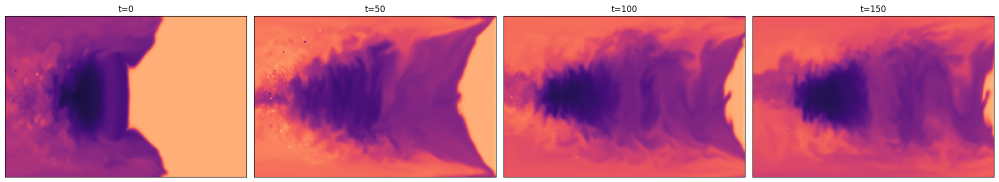
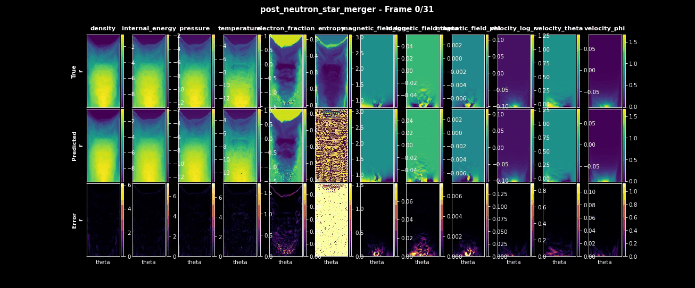

<!---
Copyright (c) 2026 Advanced Micro Devices, Inc. (AMD)

Permission is hereby granted, free of charge, to any person obtaining a copy
of this software and associated documentation files (the "Software"), to deal
in the Software without restriction, including without limitation the rights
to use, copy, modify, merge, publish, distribute, sublicense, and/or sell
copies of the Software, and to permit persons to whom the Software is
furnished to do so, subject to the following conditions:

The above copyright notice and this permission notice shall be included in all
copies or substantial portions of the Software.

THE SOFTWARE IS PROVIDED "AS IS", WITHOUT WARRANTY OF ANY KIND, EXPRESS OR
IMPLIED, INCLUDING BUT NOT LIMITED TO THE WARRANTIES OF MERCHANTABILITY,
FITNESS FOR A PARTICULAR PURPOSE AND NONINFRINGEMENT. IN NO EVENT SHALL THE
AUTHORS OR COPYRIGHT HOLDERS BE LIABLE FOR ANY CLAIM, DAMAGES OR OTHER
LIABILITY, WHETHER IN AN ACTION OF CONTRACT, TORT OR OTHERWISE, ARISING FROM,
OUT OF OR IN CONNECTION WITH THE SOFTWARE OR THE USE OR OTHER DEALINGS IN THE
SOFTWARE.
--->

# Fine-Tuning AI Surrogate Models for Physics Simulations with Walrus on AMD Instinct GPU Accelerators

Physics simulations are used for studying complex systems and are essential where experiments are difficult, expensive, or impossible. In our context, a simulation means numerically solving mathematical equations that are believed to describe a physical system and evolving them forward in time on a computer. They enable controlled exploration of physical behavior for science and engineering, but at a high computational cost, which in most cases increases rapidly with scale. Our focus is on continuum dynamics, where the system is represented by fields such as density, velocity, or temperature, defined on a grid and evolving over time. High-resolution physics simulations are slow to run, sensitive to numerical error and impractical for large parameter spaces. Surrogate models address these limitations by learning to approximate simulation dynamics directly from data. Once trained, they can produce fast predictions at a fraction of the cost, giving researchers the ability to rapidly explore parameter space and generate long rollouts.

Traditional surrogates are often narrow and task-specific, while more recent approaches in foundation models improve generalization by learning shared structure across many physical systems during the pretraining stage. Fine-tuning these models makes it possible to adapt their broad physical priors to a specific task with lower data requirements while improving accuracy. This makes fine-tuning foundation models a practical strategy for building scalable, high-performing physics surrogates.

In this blog, we will demonstrate fine-tuning a foundational physics model on a dataset not seen during the pretraining stage, using AMD Instinct MI300X GPU accelerators.

## Walrus: A Cross-domain Foundation Model for Continuum Dynamics

At a high level, surrogate models learn mappings between states of a physical system, often predicting the next timestep from the recent history. Walrus [[1]](#1) is a foundation model in the sense that a single large network is pretrained once on a broad collection of simulations and then fine‑tuned for many downstream physics tasks, rather than training a separate surrogate from scratch for each system. It is a transformer-based architecture, has 1.3B parameters and is trained on 19 different simulated datasets of both 2 and 3 dimensions, containing 63 state variables. This makes Walrus a cross‑domain model: it learns shared structure across the diverse systems, and this broad prior over fluid‑like dynamics enables it to transfer knowledge effectively when fine‑tuned on new datasets.

Walrus does not use full attention over `space x time` at once, as this would be extremely expensive. Instead, it has a space-time factorized architecture in which attention alternates between spatial and temporal dimensions. Spatial attention employs axial rotary position embeddings, while temporal attention is causal and uses T5-style relative position embeddings as introduced in the T5 paper [[3]](#3). This factorization enables efficient modeling of long spatiotemporal sequences and improves stability during long rollouts.

Another architectural optimization is patch jittering. It prevents grid-aligned errors introduced by patch-based tokenization from accumulating by shifting patch boundaries across timesteps. Patch jittering randomly shifts the input fields before patching and reverses the shift after decoding, preventing reconstruction errors from repeatedly appearing at the same spatial locations. This leads to more stable long-horizon predictions. To support training and fine-tuning across datasets with very different spatial resolutions, Walrus also uses compute-adaptive compression. Rather than applying a fixed downsampling scheme, the model dynamically adjusts how much spatial compression is used so that inputs of different sizes produce a similar number of tokens. This keeps memory usage and compute cost predictable while allowing the same model to operate efficiently across heterogeneous simulation grids.

To run Walrus on a new scenario, you first collect a short context window: a handful of consecutive timesteps of all relevant fields from your numerical simulation. Walrus can use this history to establish the current state of the system and then autoregressively predicts future timesteps, feeding its own outputs back as inputs. This workflow turns a short high‑fidelity simulation segment into a full rollout by letting Walrus handle the long‑time evolution.

## Fine-Tuning Walrus

The Walrus paper shows that a pretrained model can already generalize well to new physical systems without any fine-tuning. However, fine-tuning on a small amount of data from the target system further improves accuracy, outperforming other methods evaluated in the paper. In this blog, we will follow one of the fine-tuning workflows from the paper and use the [post_neutron_star_merger dataset](https://github.com/PolymathicAI/the_well/tree/master/datasets/post_neutron_star_merger) from The Well [[2]](#2).

The dataset captures some of the most extreme and scientifically important environments thought to be the primary sites for the formation of the elements heavier than iron in the universe. The dataset includes eight full simulations of the aftermaths of different scenarios: a neutron star merger with a neutron star and a neutron star merger with a black hole. Despite differing initial conditions, these events produce similar remnants: a compact central object surrounded by a hot and dense accretion disk. Each trajectory in the dataset consists of axisymmetrized snapshots of the simulation with 181 timesteps of a 192×128×66 dimensions covering fields such as density, temperature, electron fraction, velocity, magnetic field, and spacetime metric components ([See full description here](https://github.com/PolymathicAI/the_well/tree/master/datasets/post_neutron_star_merger)).


**Figure 1:** Example visualization of axisymmetrized `electron_fraction` snapshots corresponding to the first trajectory of the simulated `post_neutron_star_merger` dataset.

The visualization presented in Figure 1 was produced using a reference notebook that illustrates how to load and visualize the data. You can refer to the notebook in [The Well repository](https://github.com/PolymathicAI/the_well/blob/master/datasets/post_neutron_star_merger/visualization_post_neutron_star_merger.ipynb) to generate similar visualizations for different physical fields.

## Pipeline Overview

The fine-tuning pipeline we follow is straightforward:

1. Set up the environment.
2. Download the pretrained Walrus checkpoint from Hugging Face.
3. Download the `post_neutron_star_merger` dataset from The Well.
4. Fine-tune the pretrained Walrus model on the new dataset.
5. Evaluate and visualize the results.

## Quickstart

- Docker: See [the Install Docker Engine documentation](https://docs.docker.com/engine/install/) for installation instructions.
- ROCm kernel-mode driver: As described in [Running ROCm Docker Containers](https://rocm.docs.amd.com/projects/install-on-linux/en/latest/how-to/docker.html), you need to install [`amdgpu-dkms`](https://instinct.docs.amd.com/projects/amdgpu-docs/en/latest/install/detailed-install/post-install.html#verify-kernel-mode-driver-installation).
- MI300X (or other compatible GPU): See [System requirements (Linux)](https://rocm.docs.amd.com/projects/install-on-linux/en/latest/reference/system-requirements.html) for more details.

## Environment Setup

First, clone the repository and navigate to the source directory:

```bash
git clone https://github.com/ROCm/rocm-blogs.git

cd rocm-blogs/blogs/artificial-intelligence/walrus-finetuning/src
```

Build the Docker image:

```bash
docker build -f walrus_finetuning.dockerfile -t walrus_finetuning_rocm7.1_pytorch2.8.0:latest .
```

Using the [AMD Container Toolkit](https://instinct.docs.amd.com/projects/container-toolkit/en/latest/index.html) is recommended for launching containers with AMD GPUs. Once installed, you can create and run a container from the image using the following command:

```bash
docker run -d \
    --runtime=amd \
    -e AMD_VISIBLE_DEVICES=all \
    --name walrus_finetuning \
    --shm-size=16g \
    -v /path/to/local/dir:/artifacts \
    walrus_finetuning_rocm7.1_pytorch2.8.0 \
    tail -f /dev/null
```

If not using AMD Container Toolkit, just use the command:

```bash
docker run -d \
    --device=/dev/kfd \
    --device=/dev/dri \
    --group-add video \
    --name walrus_finetuning \
    --shm-size=16g \
    -v /path/to/local/dir:/artifacts \
    walrus_finetuning_rocm7.1_pytorch2.8.0 \
    tail -f /dev/null
```

Run the following command to open an interactive shell inside the running container:

```bash
docker exec -it walrus_finetuning bash
```

Once we are in the container, we can download the pretrained model. Pretrained and fine-tuned Walrus checkpoints are available on Hugging Face: [https://huggingface.co/polymathic-ai/walrus](https://huggingface.co/polymathic-ai/walrus)

```bash
checkpoint_base_path="/artifacts/models/walrus_pretrained/checkpoints"
config_base_path="/artifacts/models/walrus_pretrained/configs"

mkdir -p "$checkpoint_base_path"
mkdir -p "$config_base_path"

wget "https://huggingface.co/polymathic-ai/walrus/resolve/main/extended_config.yaml" \
     -O "$config_base_path/extended_config.yaml"

wget "https://huggingface.co/polymathic-ai/walrus/resolve/main/walrus.pt" \
     -O "$checkpoint_base_path/walrus.pt"
```

For downloading the dataset, we follow instructions from [The Well repository](https://github.com/PolymathicAI/the_well?tab=readme-ov-file#downloading-the-data). For example, to download the full `post_neutron_star_merger` dataset, you can run:

```bash
the-well-download --base-path /artifacts/the_well/ --dataset post_neutron_star_merger
```

The dataset is ~110.1 GB, so it may take a while depending on your internet connection speed. You can also specify `--split` if you want only the `train`, `valid`, or `test` subsets.

## Running the Fine-Tuning Job

Navigate to the `run_scripts` directory, where all the necessary scripts for fine-tuning and evaluation are located:

```bash
cd /workspace/walrus/walrus/run_scripts
```

Starting the training run triggers an MIOpen algorithm search, which can take a long time. However, if you let the search run to completion and cache the results once, subsequent runs will be much faster. You can skip this step, but we recommend running a short tuning job with the same batch size you will use for later fine-tuning to populate the MIOpen cache:

```bash
bash pre_finetuning_tune_perfdb.sh
```

After configuring the environment, proceed with the actual fine-tuning step. If tuning was intentionally skipped, you can control the startup and search behavior using the `MODE` variable. Setting `MODE=1` enables a fast startup path, which is recommended for quickly validating scripts. Using `MODE=2` triggers a full exhaustive algorithm search, which can be very time-consuming. With `MODE=3`, MIOpen prioritizes database reuse: existing entries are used when available, while missing entries trigger automatic tuning and database updates. This approach balances startup time with long-term performance and is recommended for most workloads. Some useful links to the documentation about the environment variables used for tuning: [MIOpen cache documentation](https://rocm.docs.amd.com/projects/MIOpen/en/develop/conceptual/cache.html), [MIOpen find and immediate mode documentation](https://rocm.docs.amd.com/projects/MIOpen/en/latest/how-to/find-and-immediate.html).

The script supports Distributed Data Parallel (DDP), Fully Sharded Data Parallel (FSDP), and Hierarchical Sharded Data Parallel (HSDP) for distributed training. For single GPU runs set `distribution=local`. Set `NPROC_PER_NODE` to the number of GPUs to use. To inspect the training progress, you can use Weights & Biases (W&B). If you have an account, set the `WANDB_API_KEY` environment variable inside the container or log in to Weights & Biases before starting the fine-tuning job. Otherwise, you can run it in offline mode by setting `WANDB_MODE=offline`.

Even though MI300X allows us to use larger batch sizes compared to the original experiments, we kept the fine-tuning hyperparameters similar to those used in the Walrus paper and released checkpoints. You can explore and modify them in `walrus/walrus/configs`.

### Important places to modify hyperparameters

- **`/walrus/walrus/configs/config.yaml`**  
  Controls overall experiment wiring, including dataset setup, model configuration, and checkpoint loading.

- **`/walrus/walrus/configs/trainer/blog_example_finetune_globalnorm.yaml`**  
  Main training and validation settings.  
  Defaults:
  - max_epoch: 50
  - grad_acc_steps: 1
  - Validation metrics: NRMSE, VRMSE, PearsonR

- **`/walrus/walrus/configs/optimizer/blog_example_adam.yaml`**  
  Optimizer configuration (default: AdamW).  
  Defaults:
  - lr: 8e-5
  - weight_decay: 1e-4
  - eps: 1e-10

- **`/walrus/walrus/configs/data/blog_example_post_neutron_star_merger.yaml`**  
  Data and batching parameters.  
  Defaults:
  - batch_size: 1 (You can increase it depending on your GPU memory. MI300X allows for larger batch sizes. Do not forget to adjust batch size in the tuning step too, if you change it here.)
  - n_steps_input: 3 (Number of input timesteps for context.)
  - n_steps_output: 1
  - max_samples: 2000 (This corresponds to the pseudo-epoch size in the paper. Each epoch has 2000 samples randomly drawn from the training set.)
  - start_rollout_valid_output_at_t: 17

- **`/walrus/walrus/configs/lr_scheduler/blog_example_inv_sqrt_w_sqrt_ramps_longer.yaml`**  
  Learning rate schedule.  
  Defaults:
  - warmup_epochs: 10
  - cooldown_epochs: 10
  - warmup_lr_factor: 0.1
  - cooldown_lr_factor: 0.001

All hyperparameters can be modified directly in the config files or overridden via Hydra using  
`++param=value` in `finetuning.sh`.

Run the fine-tuning script:

```bash
MODE=3 DISTRIBUTION=ddp NPROC_PER_NODE=4 WANDB_MODE=offline bash finetuning.sh
```

## Evaluation and Result Exploration

After training, you can find the fine-tuned model checkpoints and configuration files in the specified output directory, along with the evaluation histograms and rollout videos for each epoch. Here is a sample animation from the initial epochs of one of the fine-tuning runs:


**Figure 2:** Example rollout visualization comparing the surrogate model predictions to the ground-truth (i.e., simulated) fields at the validation stage of epoch 7: The top row shows the ground-truth fields, the middle row shows Walrus surrogate predictions, and the bottom row shows the difference between prediction and ground truth. The columns correspond to different fields from the dataset, such as density, temperature, electron fraction, pressure, and other simulated variables.

The snapshot shown in Figure 2 corresponds to an early stage of the training process, taken at epoch 7 out of 50. At this point, most physical fields are already predicted with reasonable accuracy, while entropy remains the primary source of error. This further indicates that the pretrained Walrus model has learned a strong physical prior that allows it to quickly adapt to the new dataset.

Once fine-tuning is complete, you can evaluate the model's performance using the evaluation script. It will calculate Normalized Root Mean Square Error (NRMSE), Variance-scaled Root Mean Squared Error (VRMSE), and PearsonR metrics on the validation and test sets and generate detailed Weights & Biases reports.

```bash
WANDB_MODE=offline bash evaluate.sh
```

The evaluation results along with Weights & Biases reports will be saved in the output directory specified in the evaluation script. A full evaluation run takes on the order of 10 minutes, whereas the underlying high‑fidelity simulation used to create a single trajectory in the post_neutron_star_merger dataset reportedly took roughly three weeks of compute time. This gap in runtime is precisely what makes surrogate models attractive for scientific workloads. The best checkpoints from our fine-tuning experiments achieved performance similar to the fine-tuned checkpoint released on the Polymathic AI Hugging Face repository, highlighting both the robustness of the method and the strong performance of AMD Instinct MI300X GPU accelerators.

## Summary

In this blog post, we demonstrated the fine-tuning of the Walrus foundational physics surrogate model on a new dataset using AMD Instinct MI300X GPU accelerators. We followed the fine-tuning methodology from the Walrus paper and achieved strong performance on the `post_neutron_star_merger dataset` from The Well. This showcases AMD hardware as a competitive platform for scientific AI workloads, enabling efficient adaptation of foundation models to specific physics tasks through fine-tuning.

## Acknowledgements

We would like to thank [Pauli Pihajoki](https://rocm.blogs.amd.com/authors/pauli-pihajoki.html), [Sopiko Kurdadze](https://rocm.blogs.amd.com/authors/sopiko-kurdadze.html), and [Rahul Biswas](https://rocm.blogs.amd.com/authors/rahul-biswas.html) for their insights and feedback on this blog post.

## References

<a id="1">[1]</a> Michael McCabe, Payel Mukhopadhyay, Tanya Marwah, Bruno Regaldo-Saint Blancard, Francois Rozet, Cristiana Diaconu, Lucas Meyer, Kaze W. K. Wong, Hadi Sotoudeh, Alberto Bietti, Irina Espejo, Rio Fear, Siavash Golkar, Tom Hehir, Keiya Hirashima, Geraud Krawezik, Francois Lanusse, Rudy Morel, Ruben Ohana, Liam Parker, Mariel Pettee, Jeff Shen, Kyunghyun Cho, Miles Cranmer, and Shirley Ho. Walrus: A cross-domain foundation model for continuum dynamics. arXiv:2511.15684, 2025.

<a id="2">[2]</a> Ruben Ohana, Michael McCabe, Lucas Meyer, Rudy Morel, Fruzsina Agocs, Miguel Beneitez, Marsha Berger, Blakesley Burkhart, Keaton Burns, Stuart Dalziel, Drummond Fielding, Daniel Fortunato, Jared Goldberg, Keiya Hirashima, Yan-Fei Jiang, Rich Kerswell, Suryanarayana Maddu, Jonah Miller, Payel Mukhopadhyay, Stefan Nixon, Jeff Shen, Romain Watteaux, Bruno Blancard, François Rozet, Liam Parker, Miles Cranmer, and Shirley Ho. The well: a large-scale collection of diverse physics simulations for machine learning. arXiv preprint arXiv:2412.00568, 2024.

<a id="3">[3]</a> Colin Raffel, Noam Shazeer, Adam Roberts, Katherine Lee, Sharan Narang, Michael Matena, Yanqi Zhou, Wei Li, and Peter J. Liu. Exploring the Limits of Transfer Learning with a Unified Text-to-Text Transformer. arXiv preprint arXiv:1910.10683, 2019.

## Disclaimers

Third-party content is licensed to you directly by the third party that owns the
content and is not licensed to you by AMD. ALL LINKED THIRD-PARTY CONTENT IS
PROVIDED “AS IS” WITHOUT A WARRANTY OF ANY KIND. USE OF SUCH THIRD-PARTY CONTENT
IS DONE AT YOUR SOLE DISCRETION AND UNDER NO CIRCUMSTANCES WILL AMD BE LIABLE TO
YOU FOR ANY THIRD-PARTY CONTENT. YOU ASSUME ALL RISK AND ARE SOLELY RESPONSIBLE
FOR ANY DAMAGES THAT MAY ARISE FROM YOUR USE OF THIRD-PARTY CONTENT.
