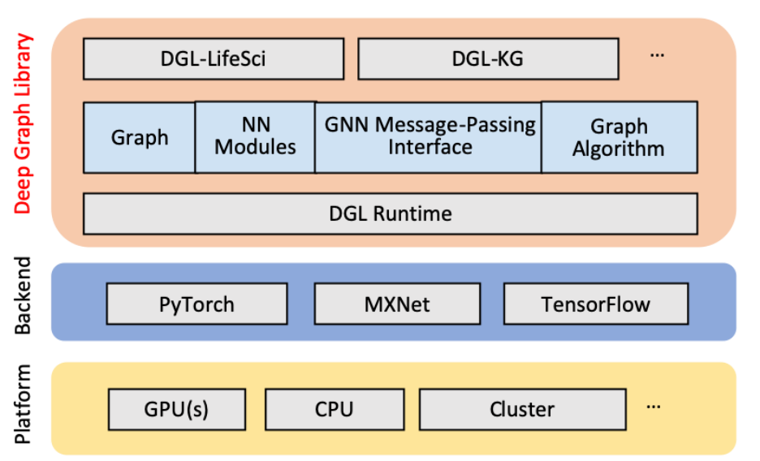

<!---
Copyright (c) 2025 Advanced Micro Devices, Inc. (AMD)

Permission is hereby granted, free of charge, to any person obtaining a copy
of this software and associated documentation files (the "Software"), to deal
in the Software without restriction, including without limitation the rights
to use, copy, modify, merge, publish, distribute, sublicense, and/or sell
copies of the Software, and to permit persons to whom the Software is
furnished to do so, subject to the following conditions:

The above copyright notice and this permission notice shall be included in all
copies or substantial portions of the Software.

THE SOFTWARE IS PROVIDED "AS IS", WITHOUT WARRANTY OF ANY KIND, EXPRESS OR
IMPLIED, INCLUDING BUT NOT LIMITED TO THE WARRANTIES OF MERCHANTABILITY,
FITNESS FOR A PARTICULAR PURPOSE AND NONINFRINGEMENT. IN NO EVENT SHALL THE
AUTHORS OR COPYRIGHT HOLDERS BE LIABLE FOR ANY CLAIM, DAMAGES OR OTHER
LIABILITY, WHETHER IN AN ACTION OF CONTRACT, TORT OR OTHERWISE, ARISING FROM,
OUT OF OR IN CONNECTION WITH THE SOFTWARE OR THE USE OR OTHER DEALINGS IN THE
SOFTWARE.
--->
# Graph Neural Networks at Scale: DGL with ROCm on AMD Hardware

This blog introduces the Deep Graph Library ([DGL](https://www.dgl.ai/))
and explores its significance on AMD hardware for enabling scalable,
performant graph neural networks.

Graphs power some of today’s most advanced AI workloads, from recommendation
systems and fraud detection to drug discovery and scientific modeling.
With DGL now ported to the ROCm platform, developers can run these cutting-edge
graph neural networks on high-performance, cost-effective AMD GPUs
— without sacrificing either performance or flexibility.

For AMD, this marks a major step toward enabling a broader class of AI
applications and supporting a growing ecosystem of graph-driven innovation.

## Get Started: Running DGL on ROCm

Get Started with the ROCm-DGL Repo - [_GitHub Repository_](https://github.com/ROCm/dgl)

Find All 4 Containerized Builds on Our DockerHub [_Dockerhub_](https://hub.docker.com/r/rocm/dgl/tags)

Install DGL — Follow the Official Guide - [_DGL installation
documentation_](https://rocmdocs.amd.com/projects/install-on-linux/en/latest/install/3rd-party/dgl-install.html)

ROCm-DGL Compatibility Guide — Platforms, Versions, and More [_DGL
compatibility_](https://rocmdocs.amd.com/en/latest/compatibility/ml-compatibility/dgl-compatibility.html)

## Why Does Deep Graph Learning Need a Specialized Stack?

Most popular deep learning frameworks today --- like PyTorch and
TensorFlow --- are optimized for dense tensor computations. This design
works beautifully for structured data types such as images, text, or
audio, where inputs can be neatly packed into regular shapes and
processed efficiently on GPUs using highly optimized linear algebra
kernels.

But graphs don't follow those rules.

Graph data is inherently sparse, irregular, and often
dynamic. You're dealing with nodes that each have a varying number
of neighbors, edges that may carry attributes, and topologies that defy
the predictable structure of a grid. This irregularity introduces three
big challenges:

1. **Memory Access**: Unlike dense tensors, graph operations often
    involve random memory access patterns --- which are hard to optimize for GPU
    parallelism.

2. **Batched Computation**: Batching across graphs (or subgraphs)
    isn\'t straightforward. Each sample might have a different shape or
    have a different number of nodes and edges.

3. **Semantic Gap**: Deep learning frameworks are designed around
    layers and tensors. But graph algorithms think in terms of
    nodes, edges, and message passing. Trying to implement
    GNNs with just tensor ops leads to verbose, error-prone, and
    inefficient code.

In short, there\'s a mismatch between what the compute model graphs require
and what general-purpose DL frameworks provide out of the box.

Deep Graph Learning needs its own abstraction --- one that natively
understands and optimizes the structure and semantics of graph data.
That's where libraries like DGL come in.

## What is DGL, and Why Was It Built?

At its core, the Deep Graph Library (DGL) is a framework
purpose-built to bring structure-aware learning to the deep learning
ecosystem. While traditional DL frameworks have made incredible strides
in computer vision, language, and audio --- all of which rely on dense,
grid-like data --- they begin to break down when faced with the
irregularity of graph-structured data.

DGL steps in to close that gap.

Instead of forcing graph computations into the rigid mold of tensor
operations, DGL flips the paradigm: it makes the graph itself the
primary abstraction. Nodes, edges, neighborhoods, and connectivity
aren\'t treated as secondary metadata --- they are front and center in
the programming model.

Under the hood, DGL translates these graph-centric computations into a
series of sparse tensor operations. That means you still benefit
from the raw performance of modern deep learning frameworks like PyTorch
or TensorFlow --- but with a semantic layer that understands how graphs
work.

In short, DGL was designed to:

- Bridge the gap between dense tensor-centric frameworks and the
  sparse, relational nature of graphs.

<!-- -->

- Abstract away the low-level complexity of graph computation while
  still giving developers full control when needed.

<!-- -->

- Enable portable, backend-agnostic development, so models can run
  on your framework of choice with minimal friction.

By treating graphs as first-class citizens and distilling GNN
computation into a small set of reusable primitives, DGL brings
structure, scalability, and simplicity to a domain that sorely needed
all three.

## Rethinking the Building Blocks: DGL\'s Design Principles

At the heart of DGL is a powerful insight: most Graph Neural Networks
(GNNs) --- no matter how complex --- can be reduced to a small number of
core operations. DGL abstracts these into customizable message-passing
primitives, which represent the fundamental stages of computation in a
GNN: message, aggregate, and update.

These aren\'t just fancy terms. They\'re the reason DGL is both powerful
and efficient.

### Message Passing as a First-Class Citizen

Each node in a graph gathers information from its neighbors, processes
it, and updates its own state. This process --- the essence of GNNs ---
maps directly onto DGL's design:

- Send (Message): Nodes \"send\" messages to their neighbors using
  learnable functions.

<!-- -->

- Aggregate: Each node collects incoming messages from neighbors.

<!-- -->

- Update: Nodes update their own state based on the aggregated
  messages.

By reducing GNNs to this pattern, DGL can:

- Generalize across different GNN architectures (GCNs, GATs,
  GraphSAGE, etc.).

<!-- -->

- Decouple model logic from execution logic, allowing for backend
  and hardware optimizations.

<!-- -->

- Streamline both forward and backward passes, meaning the same
  primitives can be used during inference and gradient computation.

This abstraction also enables low-level kernel optimizations under
the hood --- think better memory locality, kernel fusion, reduced data
movement --- without the user having to worry about any of it.

In other words, these primitives are not just functional; they are
designed for performance and lay a strong foundation for scaling GNN
workloads to large graphs and modern hardware.

## Graph-First Thinking: Making the Graph the Main Abstraction

If you've tried implementing GNNs manually in PyTorch or TensorFlow, you
know it can feel like swimming upstream. You end up writing complex code
to manage edges, neighborhoods, batch construction, and sparse updates
--- and before you know it, the elegance of your model is buried under
layers of boilerplate.

DGL flips that paradigm completely.

Rather than asking developers to think in terms of tensors and indices,
DGL makes the graph itself the core programming abstraction. You
describe your graph, define how information flows along its edges, and
DGL handles the rest --- from memory-efficient batching to edgewise
parallelism.

This change in mental model does more than just simplify code:

- It lets researchers focus on modeling, not memory layouts.

<!-- -->

- It abstracts away tedious graph engineering --- like sampling
  neighbors, normalizing adjacency matrices, or batching variable-sized
  graphs.

<!-- -->

- It unlocks new optimizations: by owning the graph structure, DGL
  can perform smart things like:

<!-- -->

- Caching frequently accessed neighborhoods,

<!-- -->

- Optimizing data layouts for GPU memory,

<!-- -->

- Dynamically partitioning graphs for distributed training.

In essence, DGL treats the graph as a dynamic, learnable,
high-performance data structure --- not just a container of edges.
This is a significant shift and enables DGL to scale GNNs both
horizontally (across GPUs or machines) and vertically (by optimizing
compute and memory use on each device).

## A Framework-Neutral Philosophy That Just Works

One of DGL's smartest design choices is that it doesn't try to reinvent
the deep learning wheel. Instead of acting as a heavyweight, standalone
framework, DGL is designed to sit seamlessly on top of existing
ecosystems --- including PyTorch, TensorFlow, and MXNet.
The figure below shows where DGL lies in the tech stack on top of existing ecosystems.

Figure 1. DGL overall architecture

This approach has a few big wins:

- You can reuse familiar tools, models, and training loops without
  needing to relearn everything.

<!-- -->

- Porting models across frameworks becomes trivial, which is
  especially useful in fast-moving research or when production
  infrastructure is tied to a specific backend.

<!-- -->

- Most importantly, it avoids vendor lock-in—allowing you to experiment,
  prototype, and scale without being tied to a single
  stack.

By staying lightweight and interoperable, DGL **future-proofs your
work**. Whether you\'re building experimental GNN models in PyTorch or
deploying production workloads in TensorFlow, DGL adapts to your
environment --- not the other way around.

## Built for Scale: Parallelism and Pipeline Flexibility in DGL

One of DGL's biggest strengths lies not just in what it does --- but
how well it scales. Graphs in the real world are rarely small.
Whether you\'re working with a protein interaction network or a massive
e-commerce graph, performance quickly becomes a bottleneck. DGL tackles
this head-on with a thoughtful, multi-level parallelization strategy
that extends from the smallest workloads to massive, distributed graph
training.

### Parallelism Where It Counts

Graph computations are notoriously hard to parallelize efficiently due
to their irregular memory access patterns. But DGL works around this
using a blend of smart strategies:

- Node-wise and edgewise batching: Enables parallelism across graph
  components while maintaining the connectivity structure that GNNs rely
  on.

<!-- -->

- Optimized scatter/gather kernels: These operations form the
  backbone of message passing and aggregation. DGL uses carefully tuned
  kernels to perform these efficiently across a wide range of
  workloads.

<!-- -->

- Memory-aware execution plans: Sparse data structures can quickly
  lead to inefficient memory use. DGL tracks and optimizes memory access
  patterns to reduce cache misses and unnecessary data movement. The
  result is smooth scaling from single-GPU setups to multi-GPU and fully
  distributed environments. You can go from prototyping on your laptop
  to training billion-edge graphs across clusters --- without rewriting
  your model code.

### A Modular Piece of a Bigger Pipeline

While DGL shines in handling graph-specific computation, it doesn\'t try
to do everything. You won't find built-in data preprocessing pipelines
or feature engineering tools --- and that's by design.

Instead, DGL keeps its scope focused: core GNN training and
inference.

This makes it highly modular and composable. You're free to plug DGL
into your existing machine learning pipeline --- whether you\'re doing
data cleaning in Spark, feature extraction with NumPy or Pandas, or
model deployment using ONNX. If your graph data is preprocessed
elsewhere, DGL will step in at the perfect time to handle the graph
computation efficiently.

This lean approach pays off especially in production, where you often
have domain-specific preprocessing, feature pipelines, or custom data
loaders. DGL doesn't get in your way --- it just handles the heavy
lifting once your data is ready.

## Optimizing DGL for AMD Platforms

While DGL supports multiple ML frameworks by design, its GPU support
relies on Nvidia\'s proprietary CUDA C++, so it cannot run on other GPUs
out of the box. This is where AMD steps in. Our HIP compatibility layer
and translation tooling allowed us to easily port the CUDA code to run
on AMD GPUs, achieving similar performance with minimal effort.

At AMD, we've contributed to enabling DGL to run efficiently on AMD GPUs
using the ROCm software stack. These efforts include:

- Supporting HIP-based kernel execution, allowing DGL to run on
  ROCm-compatible GPUs with minimal friction.

<!-- -->

- Providing prebuilt Docker containers that include DGL + ROCm, so
  researchers and practitioners can get started quickly.

<!-- -->

- Our implementation preserves full compatibility with NVIDIA GPUs and
  adheres to upstreaming guidelines.

You can find our fork and container setup here: [AMD ROCm-optimized DGL
GitHub repo](https://github.com/ROCm/dgl), [AMD Dockerhub
for DGL containers](https://hub.docker.com/r/rocm/dgl/tags)

This enablement is a part of AMD's broader commitment to building an
open, performant AI ecosystem --- one that makes machine learning,
including deep graph learning, accessible across architectures.

## Summary

DGL's design strikes a rare balance of research flexibility and
production readiness.  Its graph-centric abstractions simplify development,
while its modular architecture ensures seamless integration into
modern ML pipelines. With support for AMD’s powerful and cost-effective
GPUs via the ROCm platform, DGL now enables scalable, high-performance
graph neural network training across diverse computing environments.

This is the first post in a series exploring Deep Graph Library (DGL).
In the upcoming blogs, we'll dive deeper into real-world use cases ---
including a hands-on look at how DGL powers drug discovery through
graph-based learning.

## Acknowledgements

_This blog is inspired by the original work published by
[DGL](https://www.dgl.ai/). Full credit to the DGL
authors-_

- **Amazon Web Services AI Shanghai Lablet (ASAIL)**: _Dongyu Ru,
  Hongzhi (Steve) Chen, Jian Zhang, Minjie Wang, Peiyuan Zhou, Quan Gan,
  Rui Ying, Tiajun Xiao, Tong He, Xiangkun Hu, Zhenkun Cai, Chao Ma,
  Jinjing Zhou, Mufei Li, Zihao Ye, Zheng Zhang_

<!-- -->

- **Amazon Web Services Machine Learning**: _Da Zheng, Xiang Song, Israt
  Nisa, George Karypis_

<!-- -->

- **NVIDIA**: _Chang Liu, Dominique LaSalle, Joe Eaton, Triston Cao, Xin
  Yao_

<!-- -->

- **New York University**: _Lingfan Yu, Yu Gai, Jinyang Li_

<!-- -->

- **Georgia Institute of Technology**: Muhammed Fatih _Balın, Ümit V. Çatalyürek_

The authors would also like to acknowledge **the broader AMD team** whose contributions were
instrumental in enabling DGL: _Mukhil Azhagan Mallaiyan Sathiaseelan, Anuya Welling,
Vicky Tsang, Tiffany Mintz, Pei Zhang, Debasis Mandal, Yao Liu, Phani Vaddadi,
Vish Vadlamani, Ritesh Hiremath, Bhavesh Lad, Radha Srimanthula, Mohan Kumar Mithur,
Phaneendr-kumar Lanka, Jayshree Soni, Amit Kumar, Leo Paoletti, Anisha Sankar,
Ram Seenivasan, Aditya Bhattacharji, Marco Grond, Anshul Gupta, Saad Rahim_

### Additional Resources

1. [Deep Graph Library: A Graph-Centric, Highly Performant Package for
    Graph Neural Networks](https://arxiv.org/abs/1909.01315)

2. [GitHub repo for DGL](https://github.com/dmlc/dgl)

3. [Scalable Graph Neural Networks with Deep Graph Library](https://dl.acm.org/doi/abs/10.1145/3394486.3406712)

4. [Reprogramming Discovery: How AMD Instinct™ GPUs Are Powering the
    Next Wave of AI-Driven Biology - Part 3 -](https://www.amd.com/en/blogs/2025/reprogramming-discovery--mi300x-gpus-power-ai-driven-biology-par.html)

## Disclaimers

Third-party content is licensed to you directly by the third party that owns the
content and is not licensed to you by AMD. ALL LINKED THIRD-PARTY CONTENT IS
PROVIDED “AS IS” WITHOUT A WARRANTY OF ANY KIND. USE OF SUCH THIRD-PARTY CONTENT
IS DONE AT YOUR SOLE DISCRETION AND UNDER NO CIRCUMSTANCES WILL AMD BE LIABLE TO
YOU FOR ANY THIRD-PARTY CONTENT. YOU ASSUME ALL RISK AND ARE SOLELY RESPONSIBLE
FOR ANY DAMAGES THAT MAY ARISE FROM YOUR USE OF THIRD-PARTY CONTENT.
