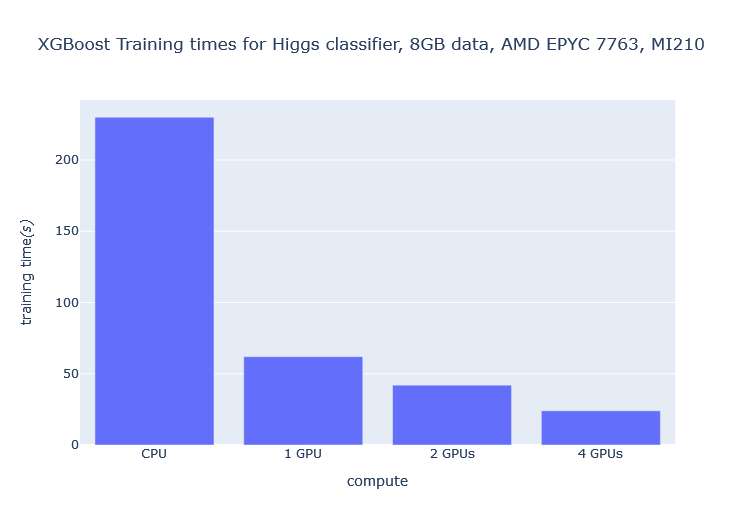

# Accelerating XGBoost with Dask using multiple AMD GPUs

XGBoost is an optimized library for distributed gradient boosting. It has become the leading machine
learning library for solving regression and classification problems. For a deeper dive into how gradient
boosting works, we recommend reading
[Introduction to Boosted Trees](https://xgboost.readthedocs.io/en/stable/tutorials/model.html).

In this blog, we show you how to build and install XGBoost with ROCm support, and how to accelerate
XGBoost training on multiple AMD GPUs using Dask. To accelerate XGBoost on multiple GPUs, we
leverage the AMD Accelerator Cloud (AAC), a platform that offers on-demand GPU cloud computing
resources. Specifically, we're using the AAC Dask Docker container with four GPUs to accelerate XGBoost
training. Access to [AAC](https://aac.amd.com) is required to follow along.

## Installation

After launching a Dask workload on AAC, clone the XGBoost ROCm repository and `cd`
into it.

```bash
git clone https://github.com/ROCmSoftwarePlatform/xgboost.git
cd xgboost
git submodule update --init --recursive
```

Next, build XGBoost from source. We're building on MI 200 Instinct Series GPUs, so we set
`DCMAK_HIP_ARCHITECTURES` to `gfx90a`. If you're using different architecture, modify this
accordingly. You can look up your architecture using: `rocminfo | grep gfx`.

```bash
mkdir build
cd build
cmake -DUSE_HIP=ON -DCMAKE_HIP_ARCHITECTURES="gfx90a" -DUSE_RCCL=1 ../
make -j
```

You can now compile XGBoost into a Python package. It should install XGBoost version `2.1.0-dev`.

```bash
cd python-package
pip install .
```

Once the XGBoost installation with ROCm support is complete, you can use it with Dask for distributed
training and inference across AMD GPUs.

## Getting started

Download a training dataset to measure the speedups achieved by distributing computations over
multiple GPUs. We use the Higgs boson dataset, where the goal is to differentiate a signal process that
produces Higgs bosons from those that do not.

```bash
wget http://mlphysics.ics.uci.edu/data/higgs/HIGGS.csv.gz
gunzip HIGGS.csv.gz
```

Import the libraries you'll need for XGBoost training.

```bash
import time
import os
import dask
import pandas as pd
import xgboost as xgb
from distributed import Client
from dask import dataframe as dd
from dask_hip import LocalHIPCluster
from xgboost.dask import DaskDMatrix
```

## Distributed environment

To perform multi-GPU training using XGBoost, you need to set up your distributed environment with
Dask. A Dask cluster consists of three different components: a centralized scheduler, one or more
workers (GPUs), and a client to submit tasks to the cluster.

To distribute XGBoost computations across a Dask cluster:

Set `num_gpus` to the number of GPUs you want to use. This will be used to specify which devices to
use. Then, create a cluster in single-node mode with `LocalHIPCluster` and connect a client to this
cluster.

```python
num_gpus = 4
devices = ','.join([str(i) for i in range(num_gpus)])
cluster = LocalHIPCluster(HIP_VISIBLE_DEVICES=devices)
client = Client(cluster)
```

Your distributed environment is now set up for computation.

## Load data

The dataset comes pre-balanced, cleaned, and standardized. For benchmarking purposes, we train
using the full dataset and load it as a Dask dataframe.

```python
colnames = ['label'] + ['feature-%02d' % i for i in range(1, 29)]
fn = 'HIGGS.csv'
df = dd.read_csv(fn, header=None, names=colnames, dtype='float32')
X = df[df.columns.difference(['label'])]
y = df['label']
```

## Training

We then create an `xgboost.dask.DaskDMatrix` object and pass it to `xgboost.dask.train()`, along with
other parameters, much like XGBoost's normal, non-Dask interface. Unlike that interface, data and
labels must be either Dask DataFrame or Dask Array instances.

```python
dtrain = xgb.dask.DaskDMatrix(client, X, y)

start_time = time.time()
param =  {
               'max_depth': 8,
               'objective': 'reg:squarederror',
               'tree_method': 'gpu_hist',
               'device': 'gpu'
          }
print('Training')
bst = xgb.dask.train(client, param, dtrain, num_boost_round=1000)
print("[INFO]: ------ Training is completed in {} seconds ------".format((time.time() - start_time)))
```

With XGBoost's Dask train interface, we pass our Dask client as an additional argument for carrying out
the computation.

```bash
[INFO]: ------ Training is completed in 24.53920841217041 seconds ------
```

## Inference

The Dask interface has 2 prediction functions: `predict` and `inplace_predict`. We use the `predict`
function. After obtaining the trained model booster, inference can be done using:

```python
booster = bst['booster']
# Set to use GPU for inference.
booster.set_param({'device': 'gpu'})
# dtrain is the DaskDMatrix defined above.
prediction = xgb.dask.predict(client, booster, dtrain)
```

## Performance

You can see significant reduction in training time as you increase the number of GPUs. For example,
increasing the number of GPUs from 1 to 4 results in a 2.6x decrease in training time and over 10x
decrease relative to a CPU training run.


