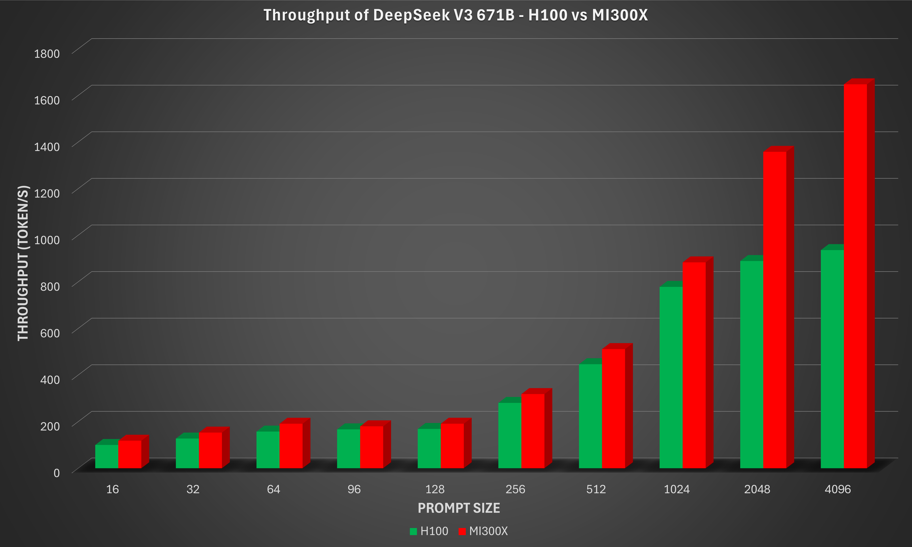
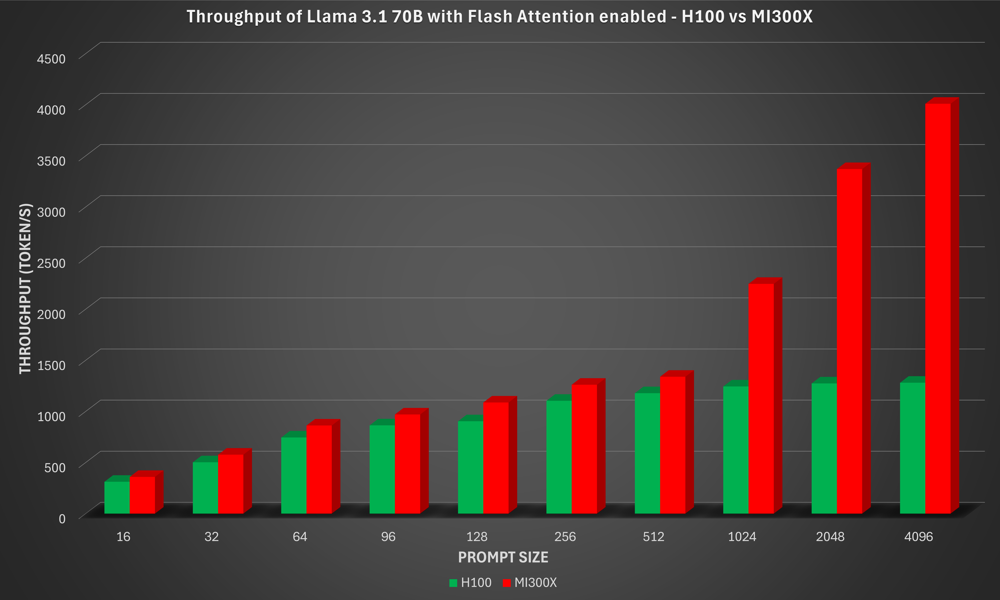
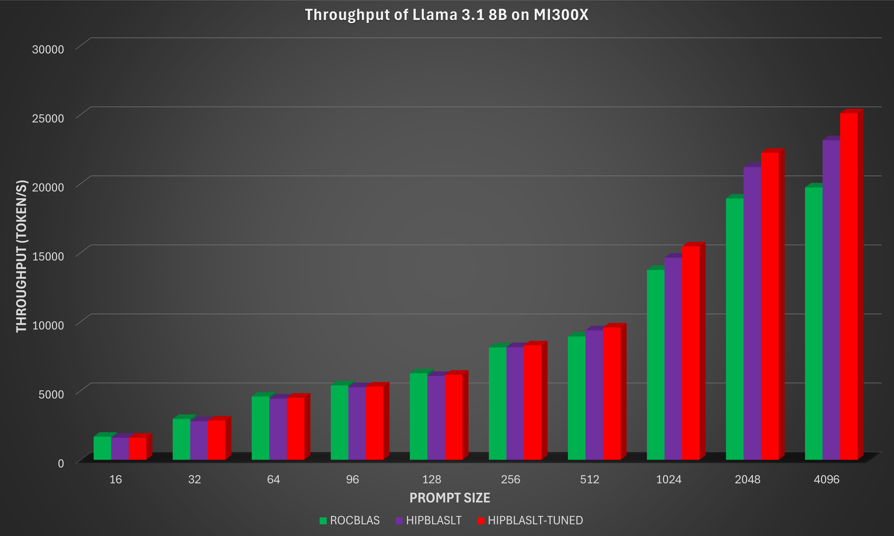

<!---
Copyright (c) 2025 Advanced Micro Devices, Inc. (AMD)

Permission is hereby granted, free of charge, to any person obtaining a copy
of this software and associated documentation files (the "Software"), to deal
in the Software without restriction, including without limitation the rights
to use, copy, modify, merge, publish, distribute, sublicense, and/or sell
copies of the Software, and to permit persons to whom the Software is
furnished to do so, subject to the following conditions:

The above copyright notice and this permission notice shall be included in all
copies or substantial portions of the Software.

THE SOFTWARE IS PROVIDED "AS IS", WITHOUT WARRANTY OF ANY KIND, EXPRESS OR
IMPLIED, INCLUDING BUT NOT LIMITED TO THE WARRANTIES OF MERCHANTABILITY,
FITNESS FOR A PARTICULAR PURPOSE AND NONINFRINGEMENT. IN NO EVENT SHALL THE
AUTHORS OR COPYRIGHT HOLDERS BE LIABLE FOR ANY CLAIM, DAMAGES OR OTHER
LIABILITY, WHETHER IN AN ACTION OF CONTRACT, TORT OR OTHERWISE, ARISING FROM,
OUT OF OR IN CONNECTION WITH THE SOFTWARE OR THE USE OR OTHER DEALINGS IN THE
SOFTWARE.
--->

# Accelerating llama.cpp on AMD Instinct MI300X

In this blog, you will learn about the ongoing work at AMD to optimize Large Language Model (LLM) inference using llama.cpp on AMD Instinct GPUs, and how its performance compares against competitive products in the market for common workloads.

Recent advancements to llama.cpp on AMD ROCm™ software further demonstrate how AMD Instinct™ GPUs offer leadership open-source LLM inference performance. With ROCm 7, AMD Instinct MI300X systems deliver industry-leading throughput, outperforming the NVIDIA H100 across multiple models and configurations.

- The AMD Instinct MI300X 8x GPU offers up to 76% higher inference throughput vs. NVIDIA H100 on DeepSeek-V3-671B-Q4_K_M with a prompt size of 4096.
- The AMD Instinct MI300X 8x GPU offers up to 213% higher inference throughput vs. NVIDIA H100 on Meta-Llama-3.1-70B-Instruct-Q4_K_M when flash attention is enabled with a prompt size of 4096.

These optimizations also provide stronger scaling at large prompt sizes, reinforcing AMD ROCm software’s commitment to open-source efficiency and high-performance inference. With these improvements, llama.cpp on ROCm software empowers developers to push open-source LLM innovation further with exceptional performance, scalability, and efficiency.

Please visit the blog titled [Llama.cpp Meets Instinct: A New Era of Open-Source AI Acceleration](https://rocm.blogs.amd.com/ecosystems-and-partners/llama-cpp/README.html) if you are interested in learning how to set up llama.cpp on an AMD Instinct MI300X system, use it to run inference on DeepSeek V3, and benchmark its performance across a range of configurations.

## Llama.cpp with ROCm 7.0.0 on MI300X

[ROCm 7.0.0](https://www.amd.com/en/blogs/2025/rocm7-supercharging-ai-and-hpc-infrastructure.html) is a major update to AMD’s AI software stack, tuned for generative AI, large-scale training and inference, and accelerated discovery. It delivers substantial end-to-end performance gains across multiple generations of AMD Instinct GPUs, improves portability with HIP 7.0.0, and streamlines deployment with enterprise-grade tooling. The release also adds production-ready MXFP4 and FP8 models via AMD Quark for faster, more efficient model delivery at scale, along with broad enhancements across tools, libraries, and infrastructure to build, train, and deploy next-generation AI applications.
The latest testing with llama.cpp on the ROCm 7.0.0 software stack highlights how AMD Instinct MI300X continues to set the bar for efficient and scalable LLM inference.

The latest llama.cpp release from AMD also benefits significantly from upstream improvements. In particular, there is a substantial reduction (~10x) in the number of calls to the `hipMemcpyAsync` API. `hipMemcpyAsync` is a HIP runtime API that enqueues a memory transfer on a stream without blocking the host thread. Due to limited bandwidth between the host and device, and between devices, calling this API can be expensive in terms of latency. Reducing the number of `hipMemcpyAsync` calls results in significant improvements in llama.cpp inference latency.

## Benchmark results

The sections below provide detailed instructions for benchmarking three popular models; DeepSeek V3 671B, Llama 3.1 70B, and Llama 3.1 8B, with llama.cpp on MI300X. The instructions leverage techniques such as Flash Attention and grouped GEMM to optimize performance for each model. Benchmark results are shown, along with corresponding results on the NVIDIA H100 GPU where applicable, to illustrate competitive performance on MI300X.

### Requirements

To follow the steps, you need:

- AMD Instinct MI300X GPU: See the [ROCm system requirements documentation](https://rocm.docs.amd.com/projects/install-on-linux/en/latest/reference/system-requirements.html) for supported operating systems.
- llama.cpp on ROCm 7.0.0: See the [llama.cpp on ROCm documentation](https://rocm.docs.amd.com/projects/install-on-linux/en/latest/install/3rd-party/llama-cpp-install.html) for installation instructions.
- Docker: See [Install Docker Engine on Ubuntu](https://docs.docker.com/engine/install/ubuntu/#install-using-the-repository) for installation instructions.

### ROCm llama.cpp

Resources and documentation on ROCm llama.cpp can be found at:

- [Installation](https://rocm.docs.amd.com/projects/install-on-linux/en/latest/install/3rd-party/llama-cpp-install.html)
- [Docker image](https://hub.docker.com/r/rocm/llama.cpp/tags)
- [GitHub](https://github.com/ROCm/llama.cpp)

### DeepSeek V3 671B

To benchmark the GGUF version of DeepSeek V3 across various prompt lengths, follow these steps:

First, run the following Python script to download the `DeepSeek-V3-Q4_K_M` GGUF model from Hugging Face.

```python
# The following python snippet downloads DeepSeekV3 Q4_K_M model only
from huggingface_hub import snapshot_download

snapshot_download(repo_id="unsloth/DeepSeek-V3-GGUF",
                  local_dir="./models",
                  local_dir_use_symlinks=False,
                  revision="main",
                  allow_patterns="DeepSeek-V3-Q4_K_M*")
```

Next, run the following commands to generate benchmark results for the model:

```bash
# Running DeepSeekV3-671B with the default configuration (for example, 8 GPUs); loading can take a few minutes
export MODEL_PATH=./models
export MODEL_NAME=DeepSeek-V3-Q4_K_M-00001-of-00009.gguf
export IMAGE=llama.cpp:llama.cpp-b6652.amd0_rocm7.0.0_ubuntu24.04_full

docker run --rm --privileged --network=host --device=/dev/kfd --device=/dev/dri \
           --group-add video --cap-add=SYS_PTRACE --security-opt seccomp=unconfined \
           --ipc=host --shm-size 16G -v $MODEL_PATH:/data \
           $IMAGE --bench -m /data/$MODEL_NAME \
           -p 16,32,64,96,128,256,512,1024,2048,4096 -n 64,128,256 -ngl 999
```

The result of the command above should be similar to the following when running on an MI300X system:

```bash
ggml_cuda_init: GGML_CUDA_FORCE_MMQ:    no
ggml_cuda_init: GGML_CUDA_FORCE_CUBLAS: no
ggml_cuda_init: found 8 ROCm devices:
  Device 0: AMD Instinct MI300X, gfx942:sramecc+:xnack- (0x942), VMM: no, Wave Size: 64
  Device 1: AMD Instinct MI300X, gfx942:sramecc+:xnack- (0x942), VMM: no, Wave Size: 64
  Device 2: AMD Instinct MI300X, gfx942:sramecc+:xnack- (0x942), VMM: no, Wave Size: 64
  Device 3: AMD Instinct MI300X, gfx942:sramecc+:xnack- (0x942), VMM: no, Wave Size: 64
  Device 4: AMD Instinct MI300X, gfx942:sramecc+:xnack- (0x942), VMM: no, Wave Size: 64
  Device 5: AMD Instinct MI300X, gfx942:sramecc+:xnack- (0x942), VMM: no, Wave Size: 64
  Device 6: AMD Instinct MI300X, gfx942:sramecc+:xnack- (0x942), VMM: no, Wave Size: 64
  Device 7: AMD Instinct MI300X, gfx942:sramecc+:xnack- (0x942), VMM: no, Wave Size: 64
load_backend: loaded ROCm backend from /app/libggml-hip.so
load_backend: loaded CPU backend from /app/libggml-cpu-icelake.so
| model                          |       size |     params | backend    | ngl |            test |                  t/s |
| ------------------------------ | ---------: | ---------: | ---------- | --: | --------------: | -------------------: |
| deepseek2 671B Q4_K - Medium   | 376.65 GiB |   671.03 B | ROCm       | 999 |            pp16 |        120.87 ± 3.12 |
| deepseek2 671B Q4_K - Medium   | 376.65 GiB |   671.03 B | ROCm       | 999 |            pp32 |        153.47 ± 3.08 |
| deepseek2 671B Q4_K - Medium   | 376.65 GiB |   671.03 B | ROCm       | 999 |            pp64 |        191.12 ± 1.84 |
| deepseek2 671B Q4_K - Medium   | 376.65 GiB |   671.03 B | ROCm       | 999 |            pp96 |        180.33 ± 2.89 |
| deepseek2 671B Q4_K - Medium   | 376.65 GiB |   671.03 B | ROCm       | 999 |           pp128 |        192.10 ± 3.28 |
| deepseek2 671B Q4_K - Medium   | 376.65 GiB |   671.03 B | ROCm       | 999 |           pp256 |        321.99 ± 1.55 |
| deepseek2 671B Q4_K - Medium   | 376.65 GiB |   671.03 B | ROCm       | 999 |           pp512 |        514.07 ± 4.15 |
| deepseek2 671B Q4_K - Medium   | 376.65 GiB |   671.03 B | ROCm       | 999 |          pp1024 |        883.28 ± 4.36 |
| deepseek2 671B Q4_K - Medium   | 376.65 GiB |   671.03 B | ROCm       | 999 |          pp2048 |       1356.21 ± 2.65 |
| deepseek2 671B Q4_K - Medium   | 376.65 GiB |   671.03 B | ROCm       | 999 |          pp4096 |       1650.33 ± 5.62 |
| deepseek2 671B Q4_K - Medium   | 376.65 GiB |   671.03 B | ROCm       | 999 |            tg64 |         42.95 ± 0.03 |
| deepseek2 671B Q4_K - Medium   | 376.65 GiB |   671.03 B | ROCm       | 999 |           tg128 |         42.51 ± 0.01 |
| deepseek2 671B Q4_K - Medium   | 376.65 GiB |   671.03 B | ROCm       | 999 |           tg256 |         41.97 ± 0.02 |
```

The benchmark result, along with the corresponding result from the NVIDIA H100 GPU, are shown in the figure below.



From the Deepseek-V3-671B-Q4_K_M figure, it is evident that as the prompt size increases, the MI300X scales more efficiently for long-context workloads such as document summarization, retrieval-augmented generation (RAG), and multi-turn chat. The AMD Instinct MI300X 8x GPU offers up to 76% higher inference throughput vs. NVIDIA H100 on DeepSeek-V3-671B-Q4_K_M with a prompt size of 4096.

### Llama 3.1 70B

The GGUF version of the Llama 3.1 70B-Instruct model from Meta on MI300X was also evaluated. In this case, Flash Attention is enabled (through the argument `-fa 1`). To benchmark this model, the GGUF model has to be converted from scratch as the model is not available for download. It requires a Hugging Face token, which can be generated by following the instructions on [this page](https://huggingface.co/docs/hub/security-tokens), to download the model.

```bash

export MODEL_PATH=~/models
export MODEL_NAME=Meta-Llama-3.1-70B-Instruct-Q4_K_M.gguf
export IMAGE=llama.cpp:llama.cpp-b6652.amd0_rocm7.0.0_ubuntu24.04_full

# Download the model from Hugging Face. 
# Access to https://huggingface.co/meta-llama/Llama-3.1-70B-Instruct is required. Follow the instructions from Meta to obtain access.
mkdir -p $MODEL_PATH
huggingface-cli login
huggingface-cli download meta-llama/Llama-3.1-70B-Instruct --local-dir "$MODEL_PATH" --include "*"

# Convert the model to GGUF format
docker run --rm -v "$MODEL_PATH":/repo $IMAGE --convert "/repo" --outtype f32

ls $MODEL_PATH | grep .gguf  # Expected output similar to: Repo-71B-F32.gguf

# quantize to Q4_K_M
docker run --rm -v "$MODEL_PATH":/repo $IMAGE --quantize "/repo/Repo-71B-F32.gguf" "/repo/$MODEL_NAME" "Q4_K_M"

# Running Meta-Llama-70B with the default setup (for example, 8 GPUs) with Flash Attention
docker run --rm --privileged --network=host --device=/dev/kfd --device=/dev/dri \
           --group-add video --cap-add=SYS_PTRACE --security-opt seccomp=unconfined \
           --ipc=host --shm-size 16G -v $MODEL_PATH:/data \
           $IMAGE --bench -m /data/$MODEL_NAME \
           -p 16,32,64,96,128,256,512,1024,2048,4096 -n 64,128,256 -ngl 999 -fa 1
```

The result of the command above should be similar to the following when running on an MI300X system:

```bash
ggml_cuda_init: GGML_CUDA_FORCE_MMQ:    no
ggml_cuda_init: GGML_CUDA_FORCE_CUBLAS: no
ggml_cuda_init: found 8 ROCm devices:
  Device 0: AMD Instinct MI300X, gfx942:sramecc+:xnack- (0x942), VMM: no, Wave Size: 64
  Device 1: AMD Instinct MI300X, gfx942:sramecc+:xnack- (0x942), VMM: no, Wave Size: 64
  Device 2: AMD Instinct MI300X, gfx942:sramecc+:xnack- (0x942), VMM: no, Wave Size: 64
  Device 3: AMD Instinct MI300X, gfx942:sramecc+:xnack- (0x942), VMM: no, Wave Size: 64
  Device 4: AMD Instinct MI300X, gfx942:sramecc+:xnack- (0x942), VMM: no, Wave Size: 64
  Device 5: AMD Instinct MI300X, gfx942:sramecc+:xnack- (0x942), VMM: no, Wave Size: 64
  Device 6: AMD Instinct MI300X, gfx942:sramecc+:xnack- (0x942), VMM: no, Wave Size: 64
  Device 7: AMD Instinct MI300X, gfx942:sramecc+:xnack- (0x942), VMM: no, Wave Size: 64
load_backend: loaded ROCm backend from /app/libggml-hip.so
load_backend: loaded CPU backend from /app/libggml-cpu-icelake.so
| model                          |       size |     params | backend    | ngl | fa |            test |                  t/s |
| ------------------------------ | ---------: | ---------: | ---------- | --: | -: | --------------: | -------------------: |
| llama 70B Q4_K - Medium        |  39.59 GiB |    70.55 B | ROCm       | 999 |  1 |            pp16 |        360.69 ± 0.95 |
| llama 70B Q4_K - Medium        |  39.59 GiB |    70.55 B | ROCm       | 999 |  1 |            pp32 |        578.37 ± 1.56 |
| llama 70B Q4_K - Medium        |  39.59 GiB |    70.55 B | ROCm       | 999 |  1 |            pp64 |        863.54 ± 2.70 |
| llama 70B Q4_K - Medium        |  39.59 GiB |    70.55 B | ROCm       | 999 |  1 |            pp96 |        971.51 ± 2.26 |
| llama 70B Q4_K - Medium        |  39.59 GiB |    70.55 B | ROCm       | 999 |  1 |           pp128 |      1088.59 ± 33.35 |
| llama 70B Q4_K - Medium        |  39.59 GiB |    70.55 B | ROCm       | 999 |  1 |           pp256 |       1262.34 ± 0.74 |
| llama 70B Q4_K - Medium        |  39.59 GiB |    70.55 B | ROCm       | 999 |  1 |           pp512 |       1340.55 ± 0.51 |
| llama 70B Q4_K - Medium        |  39.59 GiB |    70.55 B | ROCm       | 999 |  1 |          pp1024 |      2248.92 ± 22.51 |
| llama 70B Q4_K - Medium        |  39.59 GiB |    70.55 B | ROCm       | 999 |  1 |          pp2048 |      3372.32 ± 27.07 |
| llama 70B Q4_K - Medium        |  39.59 GiB |    70.55 B | ROCm       | 999 |  1 |          pp4096 |       4010.72 ± 4.37 |
| llama 70B Q4_K - Medium        |  39.59 GiB |    70.55 B | ROCm       | 999 |  1 |            tg64 |         36.40 ± 0.04 |
| llama 70B Q4_K - Medium        |  39.59 GiB |    70.55 B | ROCm       | 999 |  1 |           tg128 |         36.51 ± 0.02 |
| llama 70B Q4_K - Medium        |  39.59 GiB |    70.55 B | ROCm       | 999 |  1 |           tg256 |         36.51 ± 0.11 |

```

The benchmark result, along with the corresponding result from the NVIDIA H100 GPU, are shown in the figure below.



Once again, the MI300X demonstrates clear performance gains while maintaining strong compute and memory efficiency on transformer workloads. These results highlight MI300X's strengths in throughput scaling, memory bandwidth utilization, and mixed-precision compute efficiency, key factors for high-performance inference. The AMD Instinct MI300X 8x GPU offers up to 213% higher inference throughput vs. NVIDIA H100 on Meta-Llama-3.1-70B-Instruct-Q4_K_M when flash attention is enabled with a prompt size of 4096.

### Llama 3.1 8B

Grouped GEMM kernels allow the inference engine to bundle matrix multiplications with different sizes, transposes, and scaling factors into a single kernel launch, yielding significant speedups over naive batched GEMM loops, especially for workloads like mixture-of-experts (MoE) models. AMD has added support for the [Grouped GEMM API](https://rocm.docs.amd.com/projects/hipBLASLt/en/develop/reference/ext-reference.html#grouped-gemm) in `hipBLASLt` to llama.cpp in the October 2025 release.
This implementation can be enabled as an alternative to the default `rocBLAS` batched GEMM backend, providing an easy way to significantly speed up many transformer-style workloads.
Currently, this feature applies exclusively to CDNA3 architecture GPUs, such as AMD Instinct MI300X.

Running the commands below will generate the benchmark results with the inference using the default GEMM library `rocBLAS`.  This will serve as the baseline for comparing against the performance with grouped GEMM and GEMM tuning.

```bash

export MODEL_PATH=~/models
export MODEL_NAME=Llama-3.1-8B-Instruct-Q4_K_M.gguf
export IMAGE=llama.cpp:llama.cpp-b6652.amd0_rocm7.0.0_ubuntu24.04_full

# Download the GGUF model directly from Hugging Face
mkdir -p $MODEL_PATH
huggingface-cli login
huggingface-cli download unsloth/Llama-3.1-8B-Instruct-GGUF --local-dir "$MODEL_PATH" --include "$MODEL_NAME"

# Running Meta-Llama-8B with the default configuration (for example, 8 GPUs)
docker run --rm --privileged --network=host --device=/dev/kfd --device=/dev/dri \
           --group-add video --cap-add=SYS_PTRACE --security-opt seccomp=unconfined \
           --ipc=host --shm-size 16G -v $MODEL_PATH:/data \
           $IMAGE --bench -m /data/$MODEL_NAME \
           -p 16,32,64,96,128,256,512,1024,2048,4096 -n 64,128,256 -ngl 999
```

You can enable and optimize the grouped GEMM feature through the `USE_HIPBLASLT_GROUPED_GEMM` environment variable. First, set `USE_HIPBLASLT_GROUPED_GEMM=1` to use the `hipBLASLt` library instead of the default `rocBLAS` for GEMM operations:

```bash
# Generate benchmark results using hipBLASLt. Use the same $MODEL_PATH and $IMAGE from the previous session
docker run --rm --privileged --network=host --device=/dev/kfd --device=/dev/dri \
           --group-add video --cap-add=SYS_PTRACE --security-opt seccomp=unconfined \
           --ipc=host --shm-size 16G -e USE_HIPBLASLT_GROUPED_GEMM=1 -v $MODEL_PATH:/data \
           $IMAGE --bench -m /data/$MODEL_NAME \
           -p 16,32,64,96,128,256,512,1024,2048,4096 -n 64,128,256 -ngl 999
```

Next, set `USE_HIPBLASLT_GROUPED_GEMM=2` to generate optimal solution indices within the `hipBLASLt` library, and write the tuned indices to `hipblaslt_gemm_tune.txt`. This may take some time depending on the model files.

```bash
# Set HIP_VISIBLE_DEVICES=0 to run on one GPU only, which can shorten the tuning time.
# Later, unset HIP_VISIBLE_DEVICES to run with the default configuration (for example, 8 GPUs)
export TUNE_PATH=~/tune
mkdir -p $TUNE_PATH
docker run --rm --privileged --network=host --device=/dev/kfd --device=/dev/dri \
           --group-add video --cap-add=SYS_PTRACE --security-opt seccomp=unconfined \
           --ipc=host --shm-size 16G -e HIP_VISIBLE_DEVICES=0 -e USE_HIPBLASLT_GROUPED_GEMM=2 \
           -v $MODEL_PATH:/data -v $TUNE_PATH:/tune $IMAGE --bench -m /data/$MODEL_NAME \
           -p 16,32,64,96,128,256,512,1024,2048,4096 -n 64,128,256 -ngl 999 | \
           grep -E '^[0-9]+(\|[0-9]+){12},[0-9]+$' > $TUNE_PATH/hipblaslt_gemm_tune.txt
```

Finally, use `USE_HIPBLASLT_GROUPED_GEMM=3` to pick up the optimal solution indices from the file `hipblaslt_gemm_tune.txt` and run the benchmark:

```bash
docker run --rm --privileged --network=host --device=/dev/kfd --device=/dev/dri \
           --group-add video --cap-add=SYS_PTRACE --security-opt seccomp=unconfined \
           --ipc=host --shm-size 16G -e USE_HIPBLASLT_GROUPED_GEMM=3 \
           -e HIPBLASLT_GROUPED_GEMM_FILE=/tune/hipblaslt_gemm_tune.txt \
           -v $MODEL_PATH:/data -v $TUNE_PATH:/tune $IMAGE --bench -m /data/$MODEL_NAME \
           -p 16,32,64,96,128,256,512,1024,2048,4096 -n 64,128,256 -ngl 999
```

The benchmark results with `rocBLAS`, `hipBLASLt` (which enables grouped GEMM), and `hipBLASLt` with GEMM tuning are shown in the figure below.



By integrating the new grouped GEMM API in hipBLASLt and applying targeted GEMM tuning, the AMD Instinct MI300X 8x GPU offers up to 29% higher inference throughput on the Llama 3.1 8B-Instruct model for long-sequence and large-prompt workloads (prompt size of 4096). This improvement results from better utilization of the MI300X's CDNA3 compute units, reduced kernel launch overhead, and improved memory scheduling across grouped GEMMs.

## Summary

Recent advancements to llama.cpp on AMD ROCm™ software further demonstrate how AMD Instinct™ GPUs offer leadership open-source LLM inference performance. With ROCm 7, AMD Instinct MI300X systems deliver industry-leading throughput, outperforming the NVIDIA H100 across multiple models and configurations.

- The AMD Instinct MI300X 8x GPU offers up to 76% higher inference throughput vs. NVIDIA H100 on DeepSeek-V3-671B-Q4_K_M with a prompt size of 4096.
- The AMD Instinct MI300X 8x GPU offers up to 213% higher inference throughput vs. NVIDIA H100 on Meta-Llama-3.1-70B-Instruct-Q4_K_M when flash attention is enabled with a prompt size of 4096.

These optimizations also provide stronger scaling at large prompt sizes, reinforcing AMD ROCm software’s commitment to open-source efficiency and high-performance inference. With these improvements, llama.cpp on ROCm software empowers developers to push open-source LLM innovation further with exceptional performance, scalability, and efficiency.

Based on calculations by AMD engineering, as of December 2025, measuring the inference throughput on the llama.cpp open-source software library on AMD Instinct MI300x 8x GPU platform powered by AMD CDNA 3 architecture, versus an NVIDIA H100 8x- GPU platform. Prompt sizes of 16, 32, 64, 96, 128, 256, 512, 1024, 2048, 4096 were input to measure inference throughput on three (3) models, DeepSeek V3 671B, Llama 3.1 70B, Llama 3.1 8B. For more details, see https://github.com/ggml-org/llama.cpp/tree/master/tools/llama-bench  

Server manufacturers may vary in configurations, yielding different results. Performance may vary based on the use of the latest drivers and optimizations.

## Acknowledgements

The authors acknowledge the broader AMD team whose contributions were instrumental in enabling llama.cpp: Nicolas Curtis, Giovanni Baraldi, Ammar Elwazir, Ritesh Hiremath, Bhavesh Lad, Radha Srimanthula, Anisha Sankar, Amit Kumar, Ram Seenivasan, Kiran Thumma, Aakash Sudhanwa, Phaneendr-kumar Lanka, Jayshree Soni, Ehud Sharlin, Saad Rahim, Anshul Gupta, Lindsey Brown, Cindy Lee, Aditya Bhattacharji.

## Disclaimers

Third-party content is licensed to you directly by the third party that owns the
content and is not licensed to you by AMD. ALL LINKED THIRD-PARTY CONTENT IS
PROVIDED “AS IS” WITHOUT A WARRANTY OF ANY KIND. USE OF SUCH THIRD-PARTY CONTENT
IS DONE AT YOUR SOLE DISCRETION AND UNDER NO CIRCUMSTANCES WILL AMD BE LIABLE TO
YOU FOR ANY THIRD-PARTY CONTENT. YOU ASSUME ALL RISK AND ARE SOLELY RESPONSIBLE
FOR ANY DAMAGES THAT MAY ARISE FROM YOUR USE OF THIRD-PARTY CONTENT.
