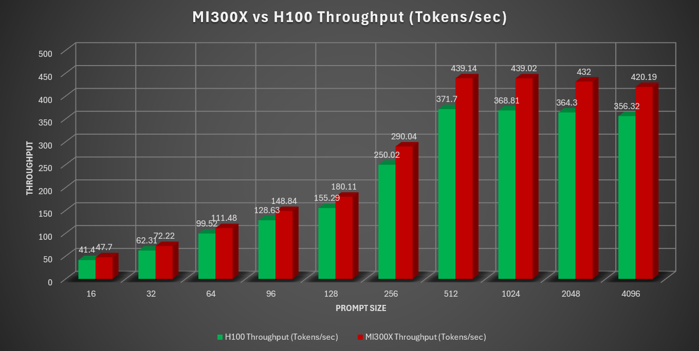

<!---
Copyright (c) 2025 Advanced Micro Devices, Inc. (AMD)

Permission is hereby granted, free of charge, to any person obtaining a copy
of this software and associated documentation files (the "Software"), to deal
in the Software without restriction, including without limitation the rights
to use, copy, modify, merge, publish, distribute, sublicense, and/or sell
copies of the Software, and to permit persons to whom the Software is
furnished to do so, subject to the following conditions:

The above copyright notice and this permission notice shall be included in all
copies or substantial portions of the Software.

THE SOFTWARE IS PROVIDED "AS IS", WITHOUT WARRANTY OF ANY KIND, EXPRESS OR
IMPLIED, INCLUDING BUT NOT LIMITED TO THE WARRANTIES OF MERCHANTABILITY,
FITNESS FOR A PARTICULAR PURPOSE AND NONINFRINGEMENT. IN NO EVENT SHALL THE
AUTHORS OR COPYRIGHT HOLDERS BE LIABLE FOR ANY CLAIM, DAMAGES OR OTHER
LIABILITY, WHETHER IN AN ACTION OF CONTRACT, TORT OR OTHERWISE, ARISING FROM,
OUT OF OR IN CONNECTION WITH THE SOFTWARE OR THE USE OR OTHER DEALINGS IN THE
SOFTWARE.
--->

# Llama.cpp Meets Instinct: A New Era of Open-Source AI Acceleration

Llama.cpp is an open source implementation of a Large Language Model (LLM) inference framework designed to run efficiently on diverse hardware configurations, both locally and in cloud environments. Its plain C/C++ implementation ensures a dependency-free setup, allowing it to seamlessly support various hardware architectures across CPUs and GPUs. The framework offers a range of quantization options, including 1.5-bit to 8-bit integer quantization, to achieve faster inference and reduced memory usage. Llama.cpp is part of an active open-source community within the AI ecosystem, with over 1200 contributors and almost 4000 releases on its [official GitHub repository](https://github.com/ggml-org/llama.cpp) as of early August, 2025. Designed as a CPU-first C++ library, llama.cpp offers simplicity and easy integration with other programming environments - making it widely compatible and rapidly adopted across diverse platforms, especially among consumer devices.

While it started as a CPU first project, llama.cpp has since extended its compatibility to various GPU architectures, including AMD Instinct GPUs such as MI300X via HIP (Heterogeneous-computing Interface for Portability), Moore Threads GPUs via [MUSA](https://github.com/MooreThreads/torch_musa), and supports [Vulkan](https://www.vulkan.org/) and [SYCL](https://www.khronos.org/sycl/) backends. Llama.cpp can also run CPU+GPU hybrid inference, facilitating the acceleration of models that exceed the total VRAM capacity by leveraging both CPU and GPU resources.

The underlying Tensor Library of llama.cpp is called [GGML](https://github.com/ggml-org/ggml). In addition to llama.cpp, there are several popular inference frameworks that are built on top of GGML. Notable ones include [whisper.cpp](https://github.com/ggml-org/whisper.cpp), which is a high-performance port of OpenAI's Whisper in C++, [Ollama](https://www.amd.com/en/developer/resources/technical-articles/running-llms-locally-on-amd-gpus-with-ollama.html), [LM Studio](https://www.amd.com/en/ecosystem/isv/consumer-partners/lm-studio.html) and [GPT4All](https://github.com/nomic-ai/gpt4all). The most widely adopted model format supported by inference frameworks based on GGML is GGUF (GPT-Generated Unified Format). [GGUF](https://github.com/ggml-org/ggml/blob/master/docs/gguf.md) is a binary file format used for storing models for inference with GGML executors, designed for fast loading, saving, and easy readability. It serves as a successor to [GGML, GGMF, and GGJT](https://github.com/ggml-org/ggml/blob/master/docs/gguf.md#overview), ensuring clarity by including all necessary model loading information and allowing for extensibility so new data can be added without compromising compatibility. Typically, models are developed using PyTorch or similar frameworks before being converted to GGUF format.

In this blog, you’ll learn how to set up llama.cpp on a MI300X system from AMD, use it to run inference of [DeepSeek v3](https://huggingface.co/deepseek-ai/DeepSeek-V3), and benchmark its performance across a range of configurations. Performance comparison against the H100 system will be presented to illustrate the leadership position of AMD Instinct GPUs in running modern AI workloads.

## Prerequisites

To follow the steps in this blog to discover the power of llama.cpp on MI300X, you need:

* AMD MI300X: See the [ROCm system requirements documentation](https://rocm.docs.amd.com/projects/install-on-linux/en/latest/reference/system-requirements.html) for supported operating systems.

* ROCm 6.4+: See the [ROCm installation for Linux](https://rocm.docs.amd.com/projects/install-on-linux/en/latest/index.html) for installation instructions.

* Docker: See [Install Docker Engine on Ubuntu](https://docs.docker.com/engine/install/ubuntu/#install-using-the-repository) for installation instructions.

## Prepare the GGUF Model

As mentioned earlier, llama.cpp requires the model to be in GGUF format. You can download the GGUF model from Hugging Face if one is available, or convert the model from the standard format to GGUF locally.  

### Download the GGUF Model

There are many ways to download the GGUF format of a model from Hugging Face. The simplest way is to use the command line tool `huggingface-cli`:

```bash
# Download unsloth/DeepSeek-V3-GGUF using the command line tool
mkdir -p ~/models
huggingface-cli download unsloth/DeepSeek-V3-GGUF --local-dir ~/models
```

```{note}
You may need to install `huggingface-cli` first.  Follow the instructions on the [Hugging Face installation documentation](https://huggingface.co/docs/huggingface_hub/main/en/installation).
```

If you want to download only certain versions of the GGUF model, use the `snapshot_download` function from the `huggingface_hub` library.  For example, run the following script to download the `DeepSeekV3 Q4_K_M` GGUF model only from Hugging Face.

```python
# The following python snippet downloads DeepSeekV3 Q4_K_M model only
from huggingface_hub import snapshot_download

snapshot_download(repo_id="unsloth/DeepSeek-V3-GGUF",
                  local_dir="./models",
                  local_dir_use_symlinks=False,
                  revision="main",
                  allow_patterns="DeepSeek-V3-Q4_K_M*")
```

When the download is completed, you should find the following `gguf` files under `modelsDeepSeek-V3-Q4_K_M/`:

```bash
ls models/DeepSeek-V3-Q4_K_M/

DeepSeek-V3-Q4_K_M-00001-of-00009.gguf  DeepSeek-V3-Q4_K_M-00003-of-00009.gguf  DeepSeek-V3-Q4_K_M-00005-of-00009.gguf  DeepSeek-V3-Q4_K_M-00007-of-00009.gguf  DeepSeek-V3-Q4_K_M-00009-of-00009.gguf
DeepSeek-V3-Q4_K_M-00002-of-00009.gguf  DeepSeek-V3-Q4_K_M-00004-of-00009.gguf  DeepSeek-V3-Q4_K_M-00006-of-00009.gguf  DeepSeek-V3-Q4_K_M-00008-of-00009.gguf
```

### Convert a Model to GGUF Format

If the model you want to use does not have a GGUF version available for download, you can convert the model to GGUF format locally. The following steps illustrate how to download and convert the `Mistral-7B-Instruct-v0.3` model (request access on [Hugging Face](https://huggingface.co/mistralai/Mistral-7B-Instruct-v0.3) first) to GGUF format by leveraging the `convert` and `quantize` functions of the container `rocm/llama.cpp:llama.cpp-b5997_rocm6.4.0_ubuntu24.04_full`. You will need a Hugging Face token, which can be generated by following the instructions on [this page](https://huggingface.co/docs/hub/security-tokens), to download the model.

```bash
# Get the model from Hugging Face
mkdir -p ~/models
huggingface-cli login
huggingface-cli download mistralai/Mistral-7B-Instruct-v0.3 --local-dir "./models" --include "*"
```

Convert the model to GGUF format with this command:

```bash
docker run --rm -v "./models":/repo rocm/llama.cpp:llama.cpp-b5997_rocm6.4.0_ubuntu24.04_full \
           --convert "/repo" --outtype f32
```

You should find the model in `gguf` format in F32 datatype:

```bash
ls ~/models | grep .gguf

Repo-7.2B-F32.gguf
```

Finally, quantize the model from `F32.gguf` to `Q4_K_M.bin` format with this command:

```bash
docker run --rm -v "./models":/repo rocm/llama.cpp:llama.cpp-b5997_rocm6.4.0_ubuntu24.04_full \
           --quantize "/repo/Repo-7.2B-F32.gguf" "/repo/ggml-model-Q4_K_M.bin" "Q4_K_M"
```

You should find the quantized model in the `~/models` folder:

```bash
ls ~/models | grep .bin

ggml-model-Q4_K_M.bin
```

## Run DeepSeek v3 with llama.cpp on MI300X

With the DeepSeek v3 model downloaded, it is time to build llama.cpp and use it to run the model.

### Build llama.cpp from Source

First, follow the steps below to build llama.cpp from source.

```bash
# Start your local container from rocm 6.4 image
export MODEL_PATH='./models'
docker run --name=$(whoami)_llamacpp -it --privileged --network=host --device=/dev/kfd --device=/dev/dri \
           --group-add video --cap-add=SYS_PTRACE --security-opt seccomp=unconfined --ipc=host --shm-size 16G \
           -v $MODEL_PATH:/data rocm/dev-ubuntu-24.04:6.4-complete

# Inside the container, run
apt-get update && apt-get install -y nano libcurl4-openssl-dev cmake git
mkdir -p /workspace && cd /workspace

# Clone the ROCm/llama.cpp repo
git clone https://github.com/ROCm/llama.cpp
cd llama.cpp/

# Build from source. Change gpu target if needed
HIPCXX="$(hipconfig -l)/clang" HIP_PATH="$(hipconfig -R)" \
    cmake -S . -B build -DGGML_HIP=ON -DAMDGPU_TARGETS=gfx942 -DCMAKE_BUILD_TYPE=Release -DLLAMA_CURL=ON \
    && cmake --build build --config Release -j$(nproc)
```

### Run Inference with llama.cpp

> **Disclaimer:** The model output shown in this section is generated by a third-party AI model and is provided for demonstration purposes only.

#### Run Interactive Inference with `llama-cli`

To run the model interactively on llama.cpp, use the CLI tool `llama-cli` to start a command line client:

```bash
./build/bin/llama-cli -m /data/DeepSeek-V3-Q4_K_M/DeepSeek-V3-Q4_K_M-00001-of-00009.gguf 
```

A prompt `>` will appear when the client is ready, and you can start interacting with the model using the client:

```bash
> hi, who are you?
Hi! I’m an AI assistant here to help answer your questions, provide information, or just chat with you. How can I assist you today? 😊

> What is the largest square that is smaller than 1527?
To find the **largest square smaller than 1527**, we need to determine the greatest integer \( n \) such that \( n^2 < 1527 \).

Here’s how we can solve it:

1. **Take the square root of 1527:**
   \[
   \sqrt{1527} \approx 39.08
   \]

2. **Find the greatest integer less than or equal to 39.08:**
   \[
   n = 39
   \]

3. **Calculate \( n^2 \):**
   \[
   39^2 = 1521
   \]

**Verification:**
- \( 39^2 = 1521 \) (which is smaller than 1527)
- \( 40^2 = 1600 \) (which is larger than 1527)

Thus, the largest square smaller than 1527 is:

\[
\boxed{1521}
\]

> What are the main causes of heart failure?
Heart failure is a condition in which the heart cannot pump blood effectively to meet the body's needs. It can result from various underlying causes or contributing factors. The **main causes of heart failure** include:

---

### 1. **Coronary Artery Disease (CAD)**
   - Narrowing or blockage of the coronary arteries reduces blood flow to the heart muscle, weakening it over time.
   - A heart attack (myocardial infarction) can cause significant damage to the heart muscle, leading to heart failure.

---

### 2. **High Blood Pressure (Hypertension)**
   - Chronic high blood pressure forces the heart to work harder to pump blood, eventually causing the heart muscle to thicken or weaken.

---

### 3. **Cardiomyopathy**
   - Diseases of the heart muscle, such as dilated cardiomyopathy, hypertrophic cardiomyopathy, or restrictive cardiomyopathy, can impair the heart's ability to pump effectively.
...
### 11. **Other Conditions**
   - Thyroid disorders, severe anemia, or infections like myocarditis can also lead to heart failure.

---

### Prevention and Management:
Managing risk factors (e.g., controlling blood pressure, maintaining a healthy weight, treating underlying conditions) can help prevent or delay the onset of heart failure. If you suspect symptoms like shortness of breath, fatigue, or swelling, consult a healthcare professional for evaluation and treatment.
```

#### Use `llama-server` to Start a LLM Server

You can start a LLM server with `llama-server` and expose it to a port (`8080` is used in the following example):

```bash
./build/bin/llama-server -m /data/DeepSeek-V3-Q4_K_M/DeepSeek-V3-Q4_K_M-00001-of-00009.gguf --port 8080
```

Enter the container from another terminal and send a prompt to the model with `curl`:

```bash
curl --verbose localhost:8080/v1/completions -H "Content-Type: application/json" -d '{"prompt": " What is AMD Instinct?", "max_tokens": 256, "temperature": 0.0 }'
```

You will get an output similar to this:

```bash
* Host localhost:8080 was resolved.
* IPv6: ::1
* IPv4: 127.0.0.1
*   Trying [::1]:8080...
...
{"choices":[{"text":" AMD Instinct is a brand of GPUs (Graphics Processing Units) developed by Advanced Micro Devices (AMD) specifically designed for high-performance computing (HPC), artificial intelligence (AI), and machine learning (ML) workloads. These GPUs are optimized for tasks that require massive parallel processing capabilities, such as deep learning training and inference, scientific simulations, and data analytics. AMD Instinct GPUs are based on AMD's CDNA (Compute DNA) architecture, which is tailored for compute-intensive applications rather than traditional graphics rendering. Key features of AMD Instinct GPUs include: 1. **High Compute Performance**: Designed to deliver exceptional performance for AI and HPC workloads, with a focus on FP64 (double-precision) and FP32 (single-precision) floating-point operations. 2. **Large Memory Capacity**: Equipped with high-bandwidth memory (HBM) to handle large datasets and complex models efficiently. 3. **Scalability**: Supports multi-GPU configurations an* Connection #0 to host localhost left intact
d is compatible with AMD's Infinity Fabric technology, enabling high-speed interconnects between GPUs and CPUs for scalable performance. 4. **Software Ecosystem**: Supported by AMD's ROCm (Radeon Open Compute) platform, which provides a comprehensive software stack for developing and optimizing applications","index":0,"logprobs":null,"finish_reason":"length"}],"created":1754694593,"model":"gpt-3.5-turbo","system_fingerprint":"b5997-66906cd8","object":"text_completion","usage":{"completion_tokens":256,"prompt_tokens":7,"total_tokens":263},"id":"chatcmpl-pqKhjYj1z76lVZqKuppJ7RWVUmpRa4tr","timings":{"prompt_n":7,"prompt_ms":999.708,"prompt_per_token_ms":142.81542857142855,"prompt_per_second":7.00204459702233,"predicted_n":256,"predicted_ms":57733.467,"predicted_per_token_ms":225.52135546875,"predicted_per_second":4.434169872389615}}
```

```{note}
An easy way to stand up a llama.cpp server is to use the docker image `rocm/llama.cpp:llama.cpp-b5997_rocm6.4.0_ubuntu24.04_server` provided by AMD.  Simply run the docker container with the following command:

docker run --privileged --network=host --device=/dev/kfd --device=/dev/dri --group-add video --cap-add=SYS_PTRACE --security-opt seccomp=unconfined --ipc=host --shm-size 16G -v $MODEL_PATH:/data    rocm/llama.cpp:llama.cpp-b5997_rocm6.4.0_ubuntu24.04_server -m /data/DeepSeek-V3-Q4_K_M/DeepSeek-V3-Q4_K_M-00001-of-00009.gguf --port 8000 --host 0.0.0.0 -n 512 --n-gpu-layers 999

Then send a prompt to the endpoint with `curl` in the same way as starting the server with `llama-server`.
```

## Benchmark llama.cpp

Llama.cpp offers a command line tool [`llama-bench`](https://github.com/ggml-org/llama.cpp/blob/master/tools/llama-bench/README.md) to benchmark the performance of a given model with different configurations.
The following command runs two tests with the model `DeepSeek-V3-Q4_K_M`:

* Prompt processing (pp): processing a prompt with different lengths (specified in the argument `-p`) in batches (default batch size is 2048).
* Text generation (tg): generating a sequence of tokens of lengths specified by the argument `-n`.

```bash
./build/bin/llama-bench \
 -m /data/DeepSeek-V3-Q4_K_M/DeepSeek-V3-Q4_K_M-00001-of-00009.gguf \
 -p 16,32,64,96,128,256,512,1024,2048,4096 \
 -n 64,128,256 \
 -ngl 999
```

The argument `-ngl` specifies the number of model layers offloaded to the GPU. In this case `-ngl 999` means all layers will be offloaded to the GPU as the model has fewer than 999 layers. Each test is repeated five times (this can be configured by the argument `-r`), and the results are averaged. The result of each test is provided as the average and standard deviation of tokens per second (t/s) across the five runs.

The result of the command above should be similar to the following when running on a MI300X system:

```bash
ggml_cuda_init: GGML_CUDA_FORCE_MMQ:    no
ggml_cuda_init: GGML_CUDA_FORCE_CUBLAS: no
ggml_cuda_init: found 8 ROCm devices:
  Device 0: AMD Instinct MI300X, gfx942:sramecc+:xnack- (0x942), VMM: no, Wave Size: 64
  Device 1: AMD Instinct MI300X, gfx942:sramecc+:xnack- (0x942), VMM: no, Wave Size: 64
  Device 2: AMD Instinct MI300X, gfx942:sramecc+:xnack- (0x942), VMM: no, Wave Size: 64
  Device 3: AMD Instinct MI300X, gfx942:sramecc+:xnack- (0x942), VMM: no, Wave Size: 64
  Device 4: AMD Instinct MI300X, gfx942:sramecc+:xnack- (0x942), VMM: no, Wave Size: 64
  Device 5: AMD Instinct MI300X, gfx942:sramecc+:xnack- (0x942), VMM: no, Wave Size: 64
  Device 6: AMD Instinct MI300X, gfx942:sramecc+:xnack- (0x942), VMM: no, Wave Size: 64
  Device 7: AMD Instinct MI300X, gfx942:sramecc+:xnack- (0x942), VMM: no, Wave Size: 64
| model                          |       size |     params | backend    | ngl |            test |                  t/s |
| ------------------------------ | ---------: | ---------: | ---------- | --: | --------------: | -------------------: |
| deepseek2 671B Q4_K - Medium   | 376.65 GiB |   671.03 B | ROCm       | 999 |            pp16 |         47.71 ± 1.50 |
| deepseek2 671B Q4_K - Medium   | 376.65 GiB |   671.03 B | ROCm       | 999 |            pp32 |         72.22 ± 0.76 |
| deepseek2 671B Q4_K - Medium   | 376.65 GiB |   671.03 B | ROCm       | 999 |            pp64 |        111.48 ± 2.64 |
| deepseek2 671B Q4_K - Medium   | 376.65 GiB |   671.03 B | ROCm       | 999 |            pp96 |        148.84 ± 1.22 |
| deepseek2 671B Q4_K - Medium   | 376.65 GiB |   671.03 B | ROCm       | 999 |           pp128 |        180.11 ± 1.54 |
| deepseek2 671B Q4_K - Medium   | 376.65 GiB |   671.03 B | ROCm       | 999 |           pp256 |        290.04 ± 1.37 |
| deepseek2 671B Q4_K - Medium   | 376.65 GiB |   671.03 B | ROCm       | 999 |           pp512 |        439.14 ± 1.68 |
| deepseek2 671B Q4_K - Medium   | 376.65 GiB |   671.03 B | ROCm       | 999 |          pp1024 |        439.02 ± 1.61 |
| deepseek2 671B Q4_K - Medium   | 376.65 GiB |   671.03 B | ROCm       | 999 |          pp2048 |        432.00 ± 2.87 |
| deepseek2 671B Q4_K - Medium   | 376.65 GiB |   671.03 B | ROCm       | 999 |          pp4096 |        420.19 ± 0.62 |
| deepseek2 671B Q4_K - Medium   | 376.65 GiB |   671.03 B | ROCm       | 999 |            tg64 |         37.36 ± 0.03 |
| deepseek2 671B Q4_K - Medium   | 376.65 GiB |   671.03 B | ROCm       | 999 |           tg128 |         37.04 ± 0.02 |
| deepseek2 671B Q4_K - Medium   | 376.65 GiB |   671.03 B | ROCm       | 999 |           tg256 |         36.53 ± 0.01 |

build: 66906cd8 (5997)
```

The same benchmark can be run on a comparable system H100. The graph below shows the throughput of the prompt processing tests across different prompt sizes.



The next graph (below) shows the same information but normalizes the throughput with H100 to 100%, representing the throughput performance gain of MI300X over H100 across different prompt sizes.


## Optimize Performance on MI300X

The results described above are the outcome of an extensive optimization effort by AMD, which was [upstreamed to the llama.cpp repository](https://github.com/ggml-org/llama.cpp/pull/14624) in July 2025.

A key factor of GPU performance is the number of work items that can be executed in a wavefront (aka warp), which is a grouping of work items that can be executed simultaneously. One of the main reasons that earlier versions of llama.cpp did not achieve good performance on AMD Instinct GPUs is because it failed to take advantage of the higher wavefront size of AMD GPUs.  Specifically, NVIDIA® GPUs only have a wavefront size of 32, while AMD Instinct™ GPUs have a wavefront size of 64. Earlier implementations of llama.cpp hardcoded the wavefront size to 32, making it impossible to fully utilize the compute power of AMD Instinct GPUs.

* Remove the dependency on a variable `WARP_SIZE` closely tied to wavefront size with value [hardcoded to 32](https://github.com/ROCm/llama.cpp/blob/86793ee333e31952efe95bccab3d70f0a526698c/ggml/src/ggml-cuda/common.cuh#L41).  Just launching more threads on device with wavefront size larger than 32 would cause various issues like register spilling, LDS overflow, bank conflicts, etc. The [changes](https://github.com/ggml-org/llama.cpp/pull/14624)  made allow llama.cpp to support wavefront size of 64, which is supported by the CDNA architecture from AMD.
  * Specifically, the optimization involves decoupling the shared memory tile sizes from `warp_size` to allow for different wavefront sizes.
  * This is achieved by introducing a constant `MMQ_TILE_NE_K`, which is set at 32.  The K dimension size of the tiles for quantized data with 32 bit elements (not including scales) is:
    * `1*MMQ_TILE_NE_K==32` (always for `TILE_Y_K`), or
    * `2*MMQ_TILE_NE_K==64` (typically for `TILE_X_K`)
  * In other words, the size of the quantized data in the K dimension is a multiple of `MMQ_TILE_NE_K`.
  * The final tile size in K direction is padded to avoid shared memory bank conflicts, in terms of 32 bit elements that means `K % 2 == 1` for dp4a or `K % 8 == 4` for mma.
* Change output tiling specification for workgroup compute.
  * Set max values for output tile size for a workgroup based on GPU architecture.
  * Support variable tile size to maximize the use of LDS without exceeding available resources.
* Redesign how the input tiles are loaded to account for 64 work-items and 8 wavefronts, which are specific to CDNA architecture.
* Redesign [`*_mma() kernels`](https://github.com/ggml-org/llama.cpp/blob/master/ggml/src/ggml-cuda/mmq.cuh) for all datatypes.
  * Changed granularity of wavefront level tiles.
  * Redesigned compute strategy for AMD GPUs. Instead of operating on K dim first with (M,N) fixed, now works on (M,N) first with K dim fixed.
  * Introduce bit masking work-item values for MFMA instructions with a constant wavefront-tile size.
  * Redesign how LDS-to-register data movement works.
* Add Matrix Cores / MFMA instruction support for CDNA architectures.
  * Leverage dp4a instruction (`__builtin_amdgcn_sdot4`) for GCN architecture.
* Enable Stream-K Support to improve the active CUs(Compute Units) from 85 to 250 for MI300X. Note that Stream-K was previously disabled for AMD hardware/compute.

While the scope of this effort is only for CDNA3, the support for CDNA, CDNA2, and GCN architectures has been implemented, and will extend to RDNA eventually.

## Summary

This blog detailed how to leverage the llama.cpp framework for high-performance LLM inference on AMD Instinct GPUs, specifically the MI300X. It provides a comprehensive guide for setting up the environment, preparing models in the GGUF format, and running inference with a command-line client or a server. The blog also highlights the notable performance gains of llama.cpp on AMD hardware, showcasing a benchmark comparison where the MI300X outperforms the H100 system for a popular LLM DeepSeek v3. It also explains the key technical optimizations, such as adapting the framework to AMD's larger wavefront size and integrating Matrix Core/MFMA instructions, that were crucial in achieving these results.

## Acknowledgements

The authors would also like to acknowledge the broader AMD team whose contributions were instrumental in enabling llama.cpp: Nicolas Curtis, Giovanni Baraldi, Ammar Elwazir, Ritesh Hiremath, Bhavesh Lad, Radha Srimanthula, Anisha Sankar, Amit Kumar, Ram Seenivasan, Kiran Thumma, Aakash Sudhanwa, Phaneendr-kumar Lanka, Jayshree Soni, Ehud Sharlin, Saad Rahim, Anshul Gupta, Lindsey Brown, Cindy Lee, Aditya Bhattacharji.

## Disclaimers

Third-party content is licensed to you directly by the third party that owns the
content and is not licensed to you by AMD. ALL LINKED THIRD-PARTY CONTENT IS
PROVIDED “AS IS” WITHOUT A WARRANTY OF ANY KIND. USE OF SUCH THIRD-PARTY CONTENT
IS DONE AT YOUR SOLE DISCRETION AND UNDER NO CIRCUMSTANCES WILL AMD BE LIABLE TO
YOU FOR ANY THIRD-PARTY CONTENT. YOU ASSUME ALL RISK AND ARE SOLELY RESPONSIBLE
FOR ANY DAMAGES THAT MAY ARISE FROM YOUR USE OF THIRD-PARTY CONTENT.
