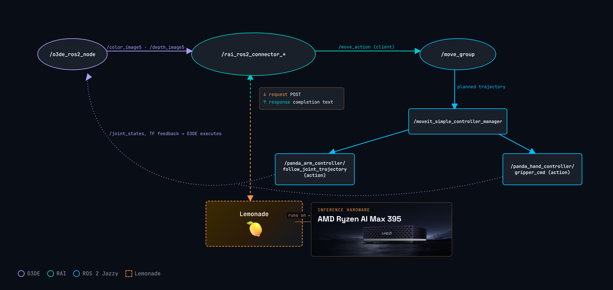

<!---
Copyright (c) 2026 Advanced Micro Devices, Inc. (AMD)

Permission is hereby granted, free of charge, to any person obtaining a copy
of this software and associated documentation files (the "Software"), to deal
in the Software without restriction, including without limitation the rights
to use, copy, modify, merge, publish, distribute, sublicense, and/or sell
copies of the Software, and to permit persons to whom the Software is
furnished to do so, subject to the following conditions:

The above copyright notice and this permission notice shall be included in all
copies or substantial portions of the Software.

THE SOFTWARE IS PROVIDED "AS IS", WITHOUT WARRANTY OF ANY KIND, EXPRESS OR
IMPLIED, INCLUDING BUT NOT LIMITED TO THE WARRANTIES OF MERCHANTABILITY,
FITNESS FOR A PARTICULAR PURPOSE AND NONINFRINGEMENT. IN NO EVENT SHALL THE
AUTHORS OR COPYRIGHT HOLDERS BE LIABLE FOR ANY CLAIM, DAMAGES OR OTHER
LIABILITY, WHETHER IN AN ACTION OF CONTRACT, TORT OR OTHERWISE, ARISING FROM,
OUT OF OR IN CONNECTION WITH THE SOFTWARE OR THE USE OR OTHER DEALINGS IN THE
SOFTWARE.
--->

# Enabling Physical AI Agents with Lemonade

In this blog we will demonstrate how to run local agents enabled by VLMs (Vision-Language Models) hosted by the Lemonade framework in the domain of robot control. These models allowed us to run an interactive robotic arm manipulation simulation entirely locally, showing the effectiveness of Lemonade for Physical AI.

Through combining the [RAI framework](https://github.com/RobotecAI/rai) for robot control, [O3DE](https://github.com/o3de/o3de) for simulation, [ROS 2 Jazzy](https://docs.ros.org/en/jazzy/index.html) for the robotics interface, and the [Lemonade SDK](https://github.com/lemonade-sdk/lemonade) for local AI model deployment on the GPU, we were able to perform tasks such as picking, placing, and sorting different objects. All code is available in the [AMD Ryzers repository](https://github.com/AMDResearch/Ryzers).

For this demonstration we will set up RAI and Lemonade through Ryzers, pull the Gemma-4-E2B-it-GGUF model, and launch an O3DE robot arm simulation. From there, you can give the arm natural-language commands, such as asking it to pick up objects, place them in different locations, and sort them across the table as the model executes each task in real time.

## Agentic Reasoning vs. End-to-End Policies

One of our [previous blogs](https://rocm.blogs.amd.com/artificial-intelligence/rocm-lerobot/README.html) explored running local AI models for manipulation through an end-to-end policy, fine-tuning a Vision Language Action model (VLA) on demonstration datasets to map camera input directly to motor commands. Although VLAs show a lot of promise, as end-to-end trained systems they lack interpretability and deterministic behavior. RAI instead takes an agentic approach, preserving the reasoning capability of language models while maintaining functionality: by exposing existing perception, planning, and control methods as tools, it constrains the policy outputs to valid and safe actions; there's no task-specific policy. To achieve this, we place a general-purpose VLM in the loop as a reasoning agent that receives the scene through the camera feed, reasons over the available tools, and delegates motion planning to [MoveIt](https://github.com/moveit/moveit). The trade-offs are per-step inference latency, since each action requires model reasoning, and a hard requirement for vision-capable models, since the agent must see the scene to identify objects and reason about their positions before acting. In exchange, there is no need for data collection, fine-tuning, or training infrastructure. Any model compatible with Lemonade can immediately start working, every decision is interpretable as an explicit tool call, and the agent can approach new tasks without extra training.

## RAI

RAI was created by [Robotec.ai](https://github.com/RobotecAI) as an open-source agentic AI framework. Built on top of ROS 2, it acts as a bridge between multimodal AI models and robotic systems, enabling robots to perform more complex tasks, interpret human language, and make autonomous decisions. The integration with ROS 2 is significant, as it is an industry-ready middleware already used in production, backed by an extensive community. Further, RAI supports local models, which enables us to plug in Lemonade directly and benefit from out-of-the-box manipulation with minimal edits.

## AMD Lemonade

Lemonade is a local inference server that serves a variety of models, including LLMs, VLMs, speech-to-text, and text-to-speech, on your hardware through an OpenAI-compatible API, letting any supporting tool point at a model running on the machine instead of the cloud. With its ROCm backend it offloads the models onto the Radeon iGPU, keeping inference fast, private, and entirely on-device. Since RAI reads its endpoint from a standard OpenAI configuration, swapping in Lemonade is a one-line change; with that, Lemonade is now available for Physical AI.

## The Importance of Locally Hosted Models for Physical AI

Running AI inference locally on robotic systems offers several advantages over hosting the compute in the cloud. Because the model runs on the machine itself, there is no round-trip to a remote server, cutting latency and removing any dependency on network connectivity. This keeps the robot responsive even offline, lets the control loop react in real time, and ensures that sensor data never leaves the device, preserving privacy. AMD's Ryzen AI platforms are well suited to this type of workload.

## System Overview

Our software stack is composed of the following packages:

- **O3DE** - provides the manipulation simulation and camera feed for the robot.
- **ROS 2 Jazzy** - the standard robotics interface layer that interacts with the robot.
- **RAI** - routes agent calls to an OpenAI-compatible endpoint and delivers responses back to the system.
- **Lemonade SDK** - serves the model locally on the Radeon iGPU through the ROCm backend.



The pipeline runs as a closed perception–decision–action loop. O3DE simulates the scene and publishes the robot's camera feed, exposing `/color_image5` and `/depth_image5` on ROS 2, which the RAI connector node subscribes to. On each step, RAI packages the latest camera frame together with the task prompt and sends it to Lemonade as a standard OpenAI-format request, a base64 image plus text over `POST /chat/completions`. The model, served locally on the Radeon iGPU, receives not only the prompt but also the list of tools RAI exposes, each with a description, and then responds with completion text and a `tool_call` in JSON. RAI reads that response and executes the chosen tool as a real ROS 2 call. The process is iterative: rather than committing to a motion immediately, the agent first searches for information-gathering tools, querying detection and segmentation services or looking up object positions in the scene, and feeds the results back into the next request to Lemonade. The model reasons over this accumulated context across several turns, refining its understanding of where objects are and what to do before it ever moves the arm.

Once the agent decides on a motion, it issues a `/move_action` goal to `/move_group`, MoveIt's planning node. MoveIt takes the target and computes a collision-free trajectory, then hands that planned trajectory to `/moveit_simple_controller_manager`, which distributes it to the appropriate controllers: `/panda_arm_controller/follow_joint_trajectory` drives the seven arm joints along the path, while `/panda_hand_controller/gripper_cmd` actuates the gripper for picking and placing. These commands are executed by the O3DE engine, which drives the simulated Panda arm and publishes `/joint_states` along with the transform (TF) feedback, which tracks the pose of every coordinate frame in the scene, so the loop can observe the result and iterate again. The key detail is that every decision, from which object to grasp to the final joint trajectory, originates from the Lemonade model, where reasoning is done on-device, with ROS 2 acting only as the transport carrying the decisions to the motors.

# Tutorial: Running a Physical AI Agent Locally

This section will guide you through the process of building and running the manipulation demo in a ROCm Docker container. We'll use the Ryzers framework to simplify the process, driving a simulated 7-DOF Panda arm through a model running on Lemonade.

## Prerequisites and Initial Setup

The only requirements are an AMD Ryzen AI platform with ROCm support, Docker, and Python. Everything else is built into the container image by Ryzers, including ROS 2, O3DE, RAI, and the Lemonade SDK.

### 1. Install the Ryzers Framework

[Ryzers](https://github.com/AMDResearch/Ryzers) is AMD's composable Docker framework for robotics AI on Ryzen platforms. It lets you assemble a container image from modular packages, each contributing one layer of the stack. Start by cloning and installing it.

```bash
git clone https://github.com/amdresearch/ryzers
pip install ryzers/
```

### 2. Build and Run the Container

Then we need to build the image with the stack of packages that will be utilized:

```bash
ryzers build ros o3de rai lemonade-sdk
ryzers run bash
```

The build chains these packages into a single image; `ryzers run bash` then launches a container from the last built image with GPU devices, display, and the experiments directory already mounted, dropping you into a shell inside it.

### 3. Configuring Lemonade

In the container, the `lemonade_env.sh` script prepares the Lemonade environment by starting the Lemonade server (log available in `/tmp/lemond.log`), loading the requested model (downloading it first if not cached), pointing RAI's OpenAI endpoint at the local server with a dummy `OPENAI_API_KEY`, and sourcing the ROS 2 environment.

```bash
source lemonade_env.sh
```

By default, the environment uses the Gemma-4-E2B-it-GGUF model.

If you would like to load a different model:

```bash
source lemonade_env.sh <model>
```

[More Models](https://lemonade-server.ai/models.html)

## Running the O3DE Manipulation Demo

Finally, you can run the interactive manipulation demo:

```bash
bash /ryzers/manipulation_demo.sh
```

The manipulation demo lets you chat with the model and interact with the simulation at http://localhost:8501. Through models running on Lemonade, you can give the arm natural-language instructions such as picking, placing, stacking, and sorting objects on the table, watching it plan and execute each task in real time.

```{video} videos/Final_Manipulation_Demo.mp4
:width: 800
:controls:
:align: center
```

## Next Steps

Try running the manipulation demo with different models and compare how they behave across the same task. For example, you can try `Gemma-4-12B-it-MTP-GGUF`, which is a larger Gemma-4 variant with more parameters, or switch to a different model family like `Qwen3.5-9B-GGUF` to compare response quality, speed, and task completion.

RAI also comes with a benchmark suite that can be used to quantitatively evaluate model performance. You can run the O3DE manipulation benchmark with:

```bash
# manipulation benchmark
python src/rai_bench/rai_bench/examples/manipulation_o3de.py --model-name Gemma-4-E2B-it-GGUF --vendor openai --levels easy
```

The possible values for the `--levels` flag are `[trivial, easy, medium, hard, very_hard]`.

## Summary

By combining RAI and Lemonade, we ran VLMs against a robot-arm manipulation simulation, entirely locally on the AMD Ryzen AI Max+ (Strix Halo) developer platform. Serving models on the Radeon iGPU through Lemonade's ROCm backend, the agent plans and acts on the arm with no cloud dependency, keeping inference private, low-latency, and fully on-device. This marks the first time Lemonade powers Physical AI, a step forward for embedding capable local AI inference and granting robots complete decision-making autonomy.

The agentic approach showcased here requires no data collection, training, or fine-tuning. A general-purpose VLM reasons over the scene, gathers information through RAI's tools, and delegates motion planning to MoveIt, with ROS 2 carrying its decisions down to the arm. Because every boundary in the stack is a standard ROS 2 interface, the same agent that drives the O3DE simulation can drive real robots.

We highly encourage you to try it yourself. All code is available in the [AMD Ryzers repository](https://github.com/AMDResearch/Ryzers). Clone it, source `lemonade_env.sh`, and run the simulation on your own hardware. To take it further, explore the [Lemonade SDK](https://github.com/AMDResearch/Ryzers/tree/main/packages/llm/lemonade-sdk) and the [RAI framework](https://github.com/AMDResearch/Ryzers/tree/main/packages/robotics/rai), and start building your own Physical AI applications on AMD hardware.

## Disclaimers

The information presented in this document is for informational purposes only and may contain technical inaccuracies, omissions, and typographical errors. The information contained herein is subject to change and may be rendered inaccurate for many reasons, including but not limited to product and roadmap changes, component and motherboard version changes, new model and/or product releases, product differences between differing manufacturers, software changes, BIOS flashes, firmware upgrades, or the like. Any computer system has risks of security vulnerabilities that cannot be completely prevented or mitigated. AMD assumes no obligation to update or otherwise correct or revise this information.
However, AMD reserves the right to revise this information and to make changes from time to time to the content hereof without obligation of AMD to notify any person of such revisions or changes.
THIS INFORMATION IS PROVIDED ‘AS IS.” AMD MAKES NO REPRESENTATIONS OR WARRANTIES WITH RESPECT TO THE CONTENTS HEREOF AND ASSUMES NO RESPONSIBILITY FOR ANY INACCURACIES, ERRORS, OR OMISSIONS THAT MAY APPEAR IN THIS INFORMATION. AMD SPECIFICALLY DISCLAIMS ANY IMPLIED WARRANTIES OF NON-INFRINGEMENT, MERCHANTABILITY, OR FITNESS FOR ANY PARTICULAR PURPOSE. IN NO EVENT WILL AMD BE LIABLE TO ANY PERSON FOR ANY RELIANCE, DIRECT, INDIRECT, SPECIAL, OR OTHER CONSEQUENTIAL DAMAGES ARISING FROM THE USE OF ANY INFORMATION CONTAINED HEREIN, EVEN IF AMD IS EXPRESSLY ADVISED OF THE POSSIBILITY OF SUCH DAMAGES.
AMD, the AMD Arrow logo, [insert all other AMD trademarks used in the material here per AMD Trademarks] and combinations thereof are trademarks of Advanced Micro Devices, Inc. Other product names used in this publication are for identification purposes only and may be trademarks of their respective companies. [Insert any third party trademark attribution here per AMD's Third Party Trademark List.]
© [Insert year written*] Advanced Micro Devices, Inc. All rights reserved
