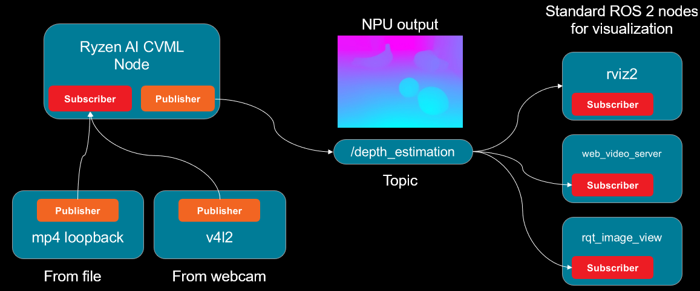
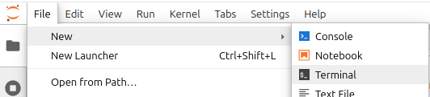
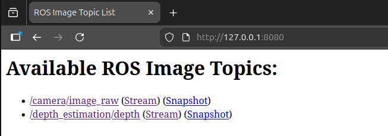

<!---
Copyright (c) 2026 Advanced Micro Devices, Inc. (AMD)

Permission is hereby granted, free of charge, to any person obtaining a copy
of this software and associated documentation files (the "Software"), to deal
in the Software without restriction, including without limitation the rights
to use, copy, modify, merge, publish, distribute, sublicense, and/or sell
copies of the Software, and to permit persons to whom the Software is
furnished to do so, subject to the following conditions:

The above copyright notice and this permission notice shall be included in all
copies or substantial portions of the Software.

THE SOFTWARE IS PROVIDED "AS IS", WITHOUT WARRANTY OF ANY KIND, EXPRESS OR
IMPLIED, INCLUDING BUT NOT LIMITED TO THE WARRANTIES OF MERCHANTABILITY,
FITNESS FOR A PARTICULAR PURPOSE AND NONINFRINGEMENT. IN NO EVENT SHALL THE
AUTHORS OR COPYRIGHT HOLDERS BE LIABLE FOR ANY CLAIM, DAMAGES OR OTHER
LIABILITY, WHETHER IN AN ACTION OF CONTRACT, TORT OR OTHERWISE, ARISING FROM,
OUT OF OR IN CONNECTION WITH THE SOFTWARE OR THE USE OR OTHER DEALINGS IN THE
SOFTWARE.
--->

# Building Robotics Applications with Ryzen AI and ROS 2

This blog showcases how to deploy power-efficient Ryzen AI perception models with ROS 2 - the Robot Operating System. We utilize the Ryzen AI Max+ 395 (Strix-Halo) platform, which is equipped with an efficient Ryzen AI NPU and iGPU. The [Ryzen AI CVML Library](https://ryzenai.docs.amd.com/en/latest/ryzen_ai_libraries.html) is used to deploy supported models efficiently on the Ryzen AI platform. All of the code is available on GitHub in the [AMD Ryzers repository](https://github.com/AMDResearch/Ryzers/tree/main/packages/workshops/roscon25) and was originally presented at [ROSCon'25](https://roscon.ros.org/2025/).

[ROS](https://docs.ros.org/) is a standardized set of tools and software libraries built specifically for developing robotics applications. It is [widely adopted by industry](https://rosindustrial.org/current-members), and is an essential instrument in every roboticist's toolkit. ROS uses a publisher/subscriber model where nodes (sensors and actuators) can communicate by publishing and subscribing to other nodes. This standardized interface makes it really easy to prototype new robotics applications.

In this blog post, we walk you through how to set up ROS and CVML on Ryzen AI using the Ryzers platform. We will deploy a custom ROS 2 node that wraps three CVML features - depth estimation, face detection and face mesh. Then we will use standard off-the-shelf ROS 2 nodes to visualize the outputs of the live NPU processed frames.

## Our ROS 2 System

We want to utilize the power-efficient NPU to offload some perception tasks, like depth estimation, for our robot. How do we easily integrate this into a robotics application that could have multiple sensors, actuators and data formats we need to worry about? This is what ROS has been created for.

By using the [ROS 2 client libraries](https://docs.ros.org/en/kilted/Tutorials/Beginner-Client-Libraries/Writing-A-Simple-Cpp-Publisher-And-Subscriber.html) and exposing our model in a standard publisher/subscriber interface, suddenly we have access to thousands of ROS-compatible packages and and the broader ecosystem. The following figure shows the ROS 2 node graph of our example application with the custom Ryzen AI node interfacing with standard off-the-shelf ROS 2 components.



### Ryzen AI CVML

Our custom ROS 2 node is built on the Ryzen AI CVML Library. Suited for edge robotics applications running on Ryzen AI processors, the Ryzen CVML Library is a unified, out-of-the-box solution for deploying vision AI models on Ryzen AI NPUs and GPUs. The models span multiple perception applications ranging from depth estimation to pose tracking and human segmentation, enabling downstream tasks for robots to utilize these capabilities.

Read more about how Ryzen AI CVML was used in a previous blog - [STX-B0T - a real-time AI robot assistant](https://rocm.blogs.amd.com/artificial-intelligence/stx-b0t/README.html)

# Tutorial: Running Custom CVML ROS 2 Node with Ryzen AI

In this section, we will walk you through setting up your environment with Ryzers that will install ROS 2, Ryzen AI CVML alongside NPU drivers - all packaged in a single Docker image. We will then run our custom ROS node and visualize results using standard ROS 2 packages.

## Prerequisites and Initial Setup

### 1. Install the Ryzers Framework

First, clone and install the ryzers package:

```bash
git clone https://github.com/amdresearch/ryzers
pip install ryzers/
```

### 2. Docker Container Setup

```{note}
To use the XDNA package you need to have the driver installed on your system. Refer to the [Ryzers XDNA package README](https://github.com/AMDResearch/Ryzers/tree/main/packages/npu/xdna) for more detailed instructions.
```

Build and run the ROCm-enabled Docker container:

```bash
ryzers build xdna ryzenai_cvml ros roscon25-npu
ryzers run
```

Since Ryzers is a composable framework we can list the packages we want in our final Docker image. Here we specify:

- `xdna` - the XDNA driver necessary for communication with the NPU, this is also a prerequisite for CVML.
- `ryzenai_cvml` - pulls in and installs the Ryzen AI CVML Library which runs a variety of perception models.
- `ros` - this package installs and sets up a ROS 2 development environment.
- `roscon25-npu` - this package contains the CVML ROS node and a set of educational Jupyter notebooks on how to utilize the CVML library with the NPU. This material was originally presented at [ROSCon'25](https://roscon.ros.org/2025/).

The run command will automatically launch a Jupyter server with packages like ROS 2 and CVML pre-installed. You will also have access to various workshop notebooks you can explore at your leisure.

Next we will look in more detail how to run our custom perception node in our Ryzers environment.

## Running the CVML ROS Node

In the following steps we will need to open a couple of new terminal windows to launch the various nodes. We will do it directly from Jupyter as shown in the figure below.



### 1. Setup ROS environment and Install CVML Node

Now in the new terminal window we will build our custom node using the native ROS 2 command-line build tool called [colcon](https://docs.ros.org/en/rolling/Tutorials/Beginner-Client-Libraries/Colcon-Tutorial.html).

```bash
source /opt/ros/$ROS_DISTRO/setup.bash
colcon build --packages-select cvml_ros
```

This will result in an `install` directory in your current workspace. To be able to use your custom CVML node you will have to source a setup script from that location to make the node discoverable.

```bash
source install/setup.bash
```

### 2. Run a Video Loopback Publisher

We packaged a simple script to loopback and publish a video file to test the perception pipeline. Use `ros-args` to specify the file location and the topic on which the video should be made available.

```bash
ros2 run cvml_ros video_publisher.py \
    --ros-args \
    -p video_path:=/ryzers/notebooks/videos/video_call.mp4 \
    -p topic:=/camera/image_raw
```

To make sure that the node is actually publishing on the new topic we can run the `node list` command to get a list of all active nodes:

```bash
ros2 node list
```

which should result in the following output:

```shell
/video_publisher
```

Additionally if we list the topics,

```bash
ros2 topic list
```

we should see `/camera/image_raw` listed as below:

```bash
/camera/image_raw
/parameter_events
/rosout
```

After confirming that we have an active topic streaming video frames we can continue to the next steps and run a node to subscribe to it.

### 3. Launch the CVML ROS 2 Node

Open a new terminal and source the workspace, then launch the CVML depth estimation node

```bash
source install/setup.bash
ros2 launch cvml_ros depth_estimation.launch.py
```

Our final output should look something like this:

```shell
...
[depth_estimation_node-1] [Vitis AI EP] No. of Operators :   CPU     2    NPU   616 
[depth_estimation_node-1] [Vitis AI EP] No. of Subgraphs :   NPU     1 Actually running on NPU     1 
[depth_estimation_node-1] [INFO] time:105068115 thread:124865516279488 [ONNX VAI] Session created
[depth_estimation_node-1] [INFO] [1768347617.540007570] [depth_estimation_node]: Published first depth map
```

And now after executing another `node list` command:

```bash
ros2 node list
```

we can see that both nodes are running.

```shell
/depth_estimation_node
/video_publisher
```

If we want to verify that the processing is actually running on the NPU device, we can further probe the XDNA driver and make sure the hardware contexts are being generated:

```bash
xrt-smi examine --report aie-partitions
```

Output should look like this:

```shell
--------------------------------
[0000:c6:00.1] : NPU Strix Halo
--------------------------------
AIE Partitions
  Total Memory Usage: N/A
  Partition Index   : 0
    Columns: [0, 1, 2, 3, 4, 5, 6, 7]
    HW Contexts:
      |PID                 |Ctx ID     |Submissions |Migrations  |Err  |Priority |
      |Process Name        |Status     |Completions |Suspensions |     |GOPS     |
      |Memory Usage        |Instr BO   |            |            |     |FPS      |
      |                    |           |            |            |     |Latency  |
      |====================|===========|============|============|=====|=========|
      |13280               |1          |8570        |0           |0    |Normal   |
      |N/A                 |Active     |8570        |37          |     |9        |
      |N/A                 |1712 KB    |            |            |     |N/A      |
      |                    |           |            |            |     |N/A      |
      |--------------------|-----------|------------|------------|-----|---------|
```

Knowing that our efficient low-power accelerator is being utilized, we can happily proceed to visually verifying our results.

### 4. Visualizing the Output

We have successfully deployed our custom CVML ROS 2 node on our Strix Halo machine and verified that the NPU is being used to process the video frames. Now how do we visualize the actual output of the model?

Here we can use standard ROS 2 components like web_video_server, which is preinstalled with our ROS 2 Ryzers environment. Launching the server is trivial, in a new terminal, we just give it a port and run on localhost:

```bash
ros2 run web_video_server web_video_server \
    --ros-args \
    -p port:=8080 \
    -p address:=0.0.0.0
```

Now you can go to your web browser at http://0.0.0.0:8080 and explore the available topics to subscribe to. You'll see multiple options based on the currently running nodes:



Once you subscribe, you can visualize the different video streams in separate windows. Here we show the original video feed of a robot arm trying to keep the cube within its bounds next to the depth estimation map of the model running on the NPU.

```{video} videos/depth_estimation.mp4
:width: 960
:height: 540
:controls:
```

## Next Steps

Try other off-the-shelf ROS 2 packages like `rviz2` and see if you can subscribe to these topics. This is the beauty of ROS - once you have a component that is compatible with the standard interfaces you can utilize the whole ecosystem.

You can also use the `v4l2_camera` ROS 2 package to create a webcam node instead of a video loopback - check out the [example demo](https://github.com/AMDResearch/Ryzers/tree/main/packages/npu/ryzenai_cvml#ros-2-demo) running CVML features live from a webcam node.

## Summary

In this blog post we have demonstrated how you can easily set up ROS 2 using the AMD Ryzers platform and run various perception workloads with the Ryzen AI CVML library. By wrapping the perception model inference in a standardized ROS 2 node we can utilize the wealth of available off-the-shelf packages from the ROS ecosystem and rapidly prototype our robotics applications.

If you have an AI PC like one of the Ryzen AI Max series, head over to [Ryzers](https://github.com/amdresearch/ryzers) to explore what other robotics packages you can easily run on your Ryzen AI-powered machine.

## Disclaimers

Third-party content is licensed to you directly by the third party that owns the
content and is not licensed to you by AMD. ALL LINKED THIRD-PARTY CONTENT IS
PROVIDED “AS IS” WITHOUT A WARRANTY OF ANY KIND. USE OF SUCH THIRD-PARTY CONTENT
IS DONE AT YOUR SOLE DISCRETION AND UNDER NO CIRCUMSTANCES WILL AMD BE LIABLE TO
YOU FOR ANY THIRD-PARTY CONTENT. YOU ASSUME ALL RISK AND ARE SOLELY RESPONSIBLE
FOR ANY DAMAGES THAT MAY ARISE FROM YOUR USE OF THIRD-PARTY CONTENT.
