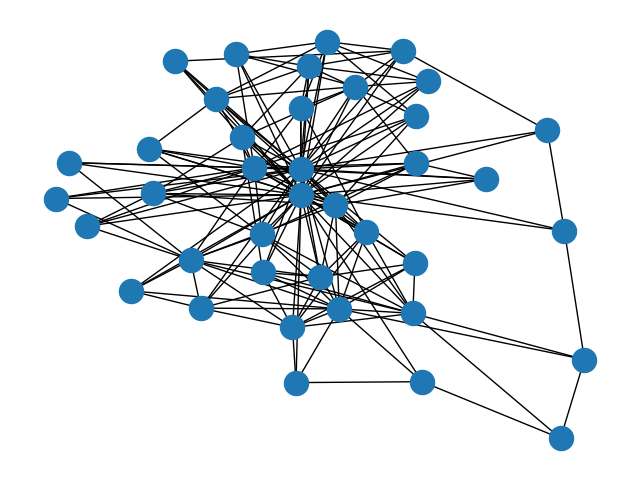
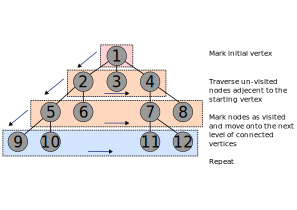
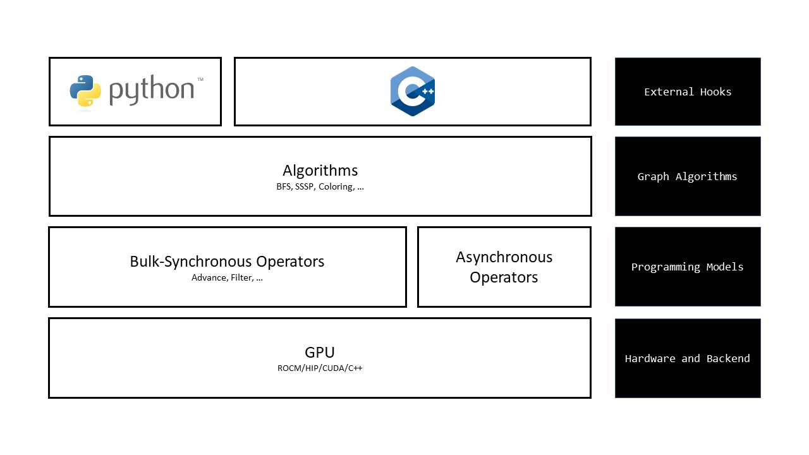

<!---
Copyright (c) 2024 Advanced Micro Devices, Inc. (AMD)

Permission is hereby granted, free of charge, to any person obtaining a copy
of this software and associated documentation files (the "Software"), to deal
in the Software without restriction, including without limitation the rights
to use, copy, modify, merge, publish, distribute, sublicense, and/or sell
copies of the Software, and to permit persons to whom the Software is
furnished to do so, subject to the following conditions:

The above copyright notice and this permission notice shall be included in all
copies or substantial portions of the Software.

THE SOFTWARE IS PROVIDED "AS IS", WITHOUT WARRANTY OF ANY KIND, EXPRESS OR
IMPLIED, INCLUDING BUT NOT LIMITED TO THE WARRANTIES OF MERCHANTABILITY,
FITNESS FOR A PARTICULAR PURPOSE AND NONINFRINGEMENT. IN NO EVENT SHALL THE
AUTHORS OR COPYRIGHT HOLDERS BE LIABLE FOR ANY CLAIM, DAMAGES OR OTHER
LIABILITY, WHETHER IN AN ACTION OF CONTRACT, TORT OR OTHERWISE, ARISING FROM,
OUT OF OR IN CONNECTION WITH THE SOFTWARE OR THE USE OR OTHER DEALINGS IN THE
SOFTWARE.
--->

# Graph analytics on AMD GPUs using Gunrock

Graphs and graph analytics are related concepts that can help us understand complex
data and relationships. In this context, a graph is a mathematical model that represents entities
(called nodes or vertices) and their connections (called edges or links). And graph analytics
is a form of data analysis that uses graph structures and algorithms to reveal insights
from the data.

Graph analytics can be used for various purposes, such as social network analysis,
fraud detection, supply chain optimization, and search engine optimization. Graph
analytics can also help us measure the importance, influence, similarity, and structure
of the entities and their relationships.

Can AMD GPUs help with graph analytic operations? We will show some cases where GPUs can improve
the performance of these valuable algorithms.



<p style="text-align:center">
Figure 1: Visualization of the "chesapeake" dataset, a graph with 34 nodes and 340 edges.
</p>

## The world of graph algorithms

Now that we know that graphs are awesome, how do we analyze these complex data and
relationships and find useful information from them? That’s where graph algorithms come
in handy. Graph algorithms are 46 recipes that tell us how to cook up some insights
from graphs. There are many types of graph algorithms that can do different things, such as:

- Shortest Path algorithms: These algorithms help us find the quickest or cheapest way to get from one node to another in a graph.
- Minimum Spanning Tree algorithms: These algorithms help us find a set of edges that connects all nodes in a graph with the lowest total weight.
- Maximum Flow algorithms: These algorithms help us find the maximum amount of flow that can be sent from a source node to a sink node in a network.
- Network Flow algorithms: These algorithms help us find the best way to match or assign nodes or resources in a bipartite graph.
- Connectivity algorithms: These algorithms help us find whether two nodes are connected or reachable in a graph, or how many connected components are there in a graph.
- Coloring algorithms: These algorithms help us assign colors to nodes or edges in a graph such that no two adjacent nodes or edges have the same color.

In this article, we will look in detail at a search algorithm known as Breadth-First Search (BFS)
as a case study to help us learn more about graphs and graph analytics on GPUs.

## Breadth-First Search, an introduction

Breadth-First Search (BFS) is an algorithm for searching a tree or graph data structure
for a node that satisfies a given property.

1. It starts at the root node and explores all the neighboring nodes
2. Then, it selects the nearest node and explores all the unexplored nodes
3. It often uses a queue data structure to keep track of the nodes to be visited
4. It also marks each node as explored or unexplored to avoid visiting the same node twice
5. BFS can find the shortest path from the root node to any other node in the graph



<p style="text-align:center">
Figure 2: Visualization of BFS iterations operating on different levels of a graph.
</p>

### How do I implement BFS?

Let's first start with a pseudocode. The BFS pseudocode below visits all the vertices of a
graph in breadth-first order by placing the vertex into a queue, $Q$, marking it as visited,
and visiting all its neighbors. Each visited vertex is marked as "visited" to avoid processing
the same vertex again. This process is repeated until all vertices have been visited
(and the queue is empty). Simple!

```cpp
BFS(graph, root):
    create a queue Q
    enqueue root onto Q
    mark root as visited
    while Q is not empty:
        current_vertex = dequeue Q
        for each neighbor of current_vertex:
            if neighbor is not visited:
                mark neighbor as visited
                enqueue neighbor onto Q
```

### What can I do with BFS, a graph and a dream?

BFS is a versatile algorithm with many applications in different domains. Some of them are:

- Finding the shortest path and minimum spanning tree for unweighted graphs,
- Finding all nodes within a given distance from a source node in a social network,
- Finding the best move in a game tree by exploring all possible moves,
- Crawling web pages by following links from a source page,
- As a subroutine of more complex graph algorithms!

Within the Python ecosystem, frameworks like NetworkX provide convenient interfaces for building a variety of graph applications. For the BFS algorithmm, you can view
the NetworkX Python implementation [here.](https://github.com/networkx/networkx/blob/main/networkx/algorithms/traversal/breadth_first_search.py) Now that we have defined the scope
for the BFS algorithm, let us consider implementation on the GPU.

## We can do better: AMD GPUs and Gunrock

A wide variety of applications in HPC and AI have had remarkable successes using GPU acceleration.
However, applying GPUs to problems in graph analytics remains a significant challenge. While GPUs are
excellent in their ability to handle data parallelism spread out across a single-instruction set
(single instruction multiple data a.k.a SIMD parallelism), graph applications often have multiple branching conditions
and irregular memory access patterns, which pose a serious challenge. As a result, graph applications on GPUs
often suffer from suboptimal GPU utilization and workload imbalances across wavefronts/warps. If that was not
enough, certain graph algorithms require costly synchronization and communication between threads, which is
amplified as the graph size increases.

The irregular and unpredictable nature of memory access patterns in graph algorithms can frequently lead
to cache misses. With limited fast-chip memory, such as shared memory and thread-private registers,
it is impractical to fit all the data necessary for processing large graphs and requires repeated requests
to slower global memory. This will incur latency penalties that will greatly outweigh the high memory bandwidth
GPUs provide and drastically reduce kernel performance. To get around these challanges, graph application
code often requires intricate and complex modifications to compute kernels in order to handle these difficulties.

### GPU accelerated graph analytics made easy and programmable

Now that have a good sense of what GPU architecture looks like, we can leverage the massive parallelism
available within the GPUs for graph analytics. Graph vertices and edges (millions or more of them) are
a great fit for the massive parallelism and memory bandwidth available within modern GPUs. Researchers
have proposed various programming abstractions which make the process of implementing graph algorithms and holistically
thinking about parallel graph algorithms easier. Some of which include bulk-synchronous, asynchronous,
data-centric, sparse-linear algebra based and more.

Since this article focuses on BFS, we highlight that parallel Breadth-first search (BFS) on GPUs
is a well studied topic and has evolved significantly over the years. To summarize, some of the notable works:

- Harish and Narayanan proposed a quadratic GPU BFS mapped each vertex's neighbor list to a thread
- Hong et al. improved this by using virtual warps
- Merrill et al.'s linear parallelization with adaptive load balancing had a substantial impact
- Beamer et al. introduced a hybrid BFS for shared memory machines, while
- Enterprise optimized direction, load balancing, and status checks
- BFS-4K refined the virtual warp method to a per-iteration dynamic one, using dynamic parallelism for improved load balancing.

Importantly, most of these works attempt to figure out a possible way to parallelize and load-balance
the available computation within the BFS traversal onto the GPUs. For example, one possible implementation
could map all the active vertices to individual threads, another could map all active edges (or source,
edge, neighbor tuple) to individual threads, etc

### Gunrock's abstraction for graph analytics

To simplify the complexity of programming parallel graph algorithms, such as BFS, we can rely on frameworks
such as Gunrock to leverage the power of GPUs to solve complex graph algorithms.
Gunrock is a C++-based GPU graph library which imploys bulk-synchronous, data-centric programming model and
abstraction. Simply, it means that instead of translating graphs into sparse-matrices and implementing graph
algorithms using sparse-linear algebra, Gunrock considers them as a collection of vertices connected with
edges (the data-centric view). The "active" vertices (or edges), where active implies that in that specific
iteration they are ready to be processed, are arranged into buckets called frontiers. All the active vertices
or edges within a frontier are processed in parallel using GPU threads (bulk-synchronous view). After every
parallel step, the system/GPU synchronizes and this process iteratively continues until an algorithm has converged.
There are few key things we can summarize from Gunrock's programming model:

- Graph algorithms are generally expressed as iterative convergent processes
- Frontiers are active set of vertcies or edges being processed in a specific iteration
- Parallel operators which run on GPUs, process these frontiers
- We can chain together parallel operators to create complex graph algorithms

Available parallel operators and their descriptions can be found in Gunrock's documentation:
https://gunrock.github.io/gunrock/gunrock.wiki/Gunrock-Operators.html. We instead will focus
on only one key operation which is required to implement BFS. It is called *advance*.
The *advance* operator simply generates a new frontier (new active set of vertices or edges)
from a current frontier by visiting the neighbors of the current frontier. The illustration
below shows *advance*, where the current frontier contained vertices 1 and 4, and the output
frontier (after *advance*) contained all the neighbors of vertices 1 and 4.

### Our first parallel Breadth-First Search!

To implement our first parallel Breadth-First Search, we refer back to the sequential
implementation above and recognize that BFS is being performed in an iterative manner.
The first iteration is effectively a frontier that contains the starting vertex (source
vertex) of the algorithm, and *advancing* to all of the neighbors of the active vertex.
In the next iteration, the neighbors now become the active frontier and we visit all
their neighbors until we have traversed the entire graph. We modify our pseudocode
to show this parallel BFS approach:

```cpp
PARALLEL_BFS(graph, root):
    create input frontier I
    create output frontier O
    add root onto I
    mark root as visited
    while I is not empty:
        [parallel] for all vertices in I:
            for each neighbor of source:
                if neighbor is not visited:
                    mark neighbor as visited
                    add neighbor onto O
        swap(O, I)
```

The key difference between parallel and sequential approach is the `[parallel] for` that
now visits all vertices `I` in the input frontier, and loops through the neighbors for
each vertex in `I`, producing the output frontier `O`.

### The hard part of the puzzle: load-balancing

Graph algorithms often inherently have workload imbalance, where neighboring parallel threads
processing different source vertices (parallel for in the pseudocode above) can have different
amounts of work to process. For example, if we are processing a social network graph; the vertices
in the graph are "users" and an edge exists between two "users" if they are "followers" in that
social network. If two "users" with drastically different numbers of "followers" were assigned
to neighboring threads, and these threads needed to be synchronized at the end of our
bulk-synchronous programming model defined above; then the thread with very few number
of "followers" to process will be waiting on the thread with lots of "followers" to process.
This problem is known as the load imbalance problem and is one of the most difficult thing
to address when performing graph analytics in parallel (specifically on the GPUs, which follow
the SIMD/SIMT model).

Luckily for us, Gunrock hides the complexity of load-balancing and other challenging implementation
level details within parallel graph analytics, and exposes operator level interface (such as
`advance` operator) to express the graph algorithms. And we can run it on AMD GPUs to see the
performance difference versus one of the most common python-based networkx library graph library.

### Understanding the programming stack

As implied in the previous section, Gunrock's programming stack
follows a "separation of concerns" philsophy, which separates its core
programming models (such as the bulk-synchronous programming model described previously)
from the low-level implementation details required to make graph alogorithms
efficient on the GPU. In other words, Gunrock is written in a higher-level abstraction
than hardwired implementations, leveraging reuse of its fundamental operators
across different graph primitives. Applications using Gunrock can interface directly
at the C++ level, or through a Python interface (not discussed here).
An overview of supported graph primitives within Gunrock can
be found [here](https://github.com/gunrock/gunrock/wiki/Graph-Algorithms).

[](https://gunrock.github.io/gunrock/gunrock.wiki/Overview.html#who-may-use-gunrock)

### From python to C++/HIP

The code below implements high-performant BFS (minus the boilerplate code), the two key
functions are the set-up phase: `prepare_frontier` and the loop phase: `loop`.

```cpp
// Set-up the starting frontier.
void prepare_frontier(frontier_t* f,
                    gcuda::multi_context_t& context) override {
auto P = this->get_problem();
f->push_back(P->param.single_source);
}

// Execute this loop (on CPU) in a bulk-synchronous fashion
// till we have traversed the entire graph (output frontier is empty.)
void loop(gcuda::multi_context_t& context) override {

// User-provided root node to begin BFS.
auto single_source = P->param.single_source;

// Distances array to keep track of distances from root.
auto distances = P->result.distances;

// Visited array to mark vertices visited.
auto visited = P->visited.data().get();

// Define what should happen to each source, neighbor, edge and weight tuple
// on every step of the advance. This condition is applied in parallel.
auto search = [distances, single_source, iteration] __host__ __device__(
                    vertex_t const& source,    // ... source
                    vertex_t const& neighbor,  // neighbor
                    edge_t const& edge,        // edge
                    weight_t const& weight     // weight (tuple).
                    ) -> bool {
    // If the neighbor is not visited, update the distance. Returning false
    // here means that the neighbor is not added to the output frontier, and
    // instead an invalid vertex is added in its place. These invalides (-1 in
    // most cases) can be removed using a filter operator or uniquify.
    auto old_distance =
        math::atomic::min(&distances[neighbor], iteration + 1);
    return (iteration + 1 < old_distance);
};

// Launch advance operator on the above lambda function "search".
operators::advance::execute<operators::load_balance_t::block_mapped>(
    G, E, search, context);
}
```

### Getting started with Gunrock for AMD GPUs

Before building the HIP version of Gunrock, make sure your
system has ROCm installed properly. Any
version greater than 5 should be more than sufficient.
We recommend readers consult the blog post on
[installing ROCm](https://rocm.docs.amd.com/projects/install-on-linux/en/latest/tutorial/install-overview.html)
for a comprehensive overview. Installing the ROCm stack will also
ensure library dependencies, such as rocPRIM and rocThrust,
are available since these are required frameworks for the HIP
build of Gunrock.

In addition to having ROCm installed, you will also need
[CMake](https://github.com/Kitware/CMake/) version 3.20.1
or higher for configuration and building. Once these key
dependencies are available on your system, you are ready to
get started. The build instructions here assume you are using
a Linux distribution, such as Ubuntu. Below is an example
showing how to clone the Gunrock repository and compile for
consumer graphics cards, such as the Radeon 6800XT or 6900XT.
For our example, we specifically make an executable for running
Gunrock's BFS algorithms.

```bash
git clone -b hip-devel https://github.com/gunrock/gunrock.git
cd gunrock
mkdir build && cd build
cmake .. -DCMAKE_HIP_ARCHITECTURES=gfx1030  # change arch depending on the target device
make bfs  # or for all algorithms, use: make -j$(nproc)
```

Gunrock comes with a variety of
[graph datasets](https://github.com/gunrock/gunrock/tree/hip-develop/datasets) ready for
experimenting with out of the box. To build all the datasets,
simply execute `make` in the `datasets` subdirectory of the
Gunrock project:

```bash
cd ../datasets
make
```

Once the datasets have been extracted, you can run
the `bfs` executable in the `build/bin` subdirectory and
provide the resulting `.mtx` data files:

```bash
cd ../build
bin/bfs ../datasets/chesapeake/chesapeake.mtx
```

For a complete list of argument options to the `bfs` executable, simply run `bin/bfs --help`.

### Accelerating BFS: NetworkX versus Gunrock

[NetworkX](https://networkx.org/) is a Python package for
graph analytics, which is easy to install, use, and experiment
with. It is one of the most popular graph frameworks used
by data scientists in Python, and it makes excellent use of
the vibrant Python ecosystem for numerical linear algebra and
data visualization. However, using GPUs through frameworks
such as Gunrock even for basic graph traversal algorthms
such as BFS can often result in *significant* boosts to
performance for larger graph datasets.

To illustrate the impact of using AMD GPUs for accelerating
graph workloads, we perform a simple comparison using the
BFS algorithm from NetworkX (Python implementation) and Gunrock (HIP implementation) on a variety of
datasets. The complete list of datasets featured in this
comparison can be found in the
[Gunrock repository](https://github.com/gunrock/gunrock/tree/hip-develop/datasets). The results collected using Gunrock were
obtained using ROCm 5.7.1 and running on the Radeon 6900XT gaming GPU.
The NetworkX calculations were obtained on
an AMD EPYC 7742 64-Core Processor, though no parallelism
was exploited in these experiments.

For all datasets, a random starting node was selected for each invocation of BFS (same across NetworkX and Gunrock results)
and timing was averaged over a total of 25 iterations.
The results for select datasets are presented in the table below.

| Dataset           | Nodes     | Edges      | NetworkX (ms) | Gunrock (ms) |
|-------------------|-----------|------------|---------------|--------------|
| chesapeake        | 39        | 340        | 0.097646      | 0.544522     |
| webbase-1M        | 1,000,005 | 3,105,536  | 10,975.20     | 2.94         |
| hollywood-2009    | 1,139,905 | 113,891,327| 64,862.21     | 9.93         |
| roadNet-CA        | 1,971,281 | 5,533,214  | 21,996.39     | 41.28        |
| delaunay_n21      | 2,097,152 | 12,582,816 | 27,857.40     | 41.19        |
| kron_g500-logn21  | 2,097,152 | 182,082,942| 166,905.78    | 22.45        |
| indochina-2004    | 7,414,866 | 194,109,311| 146,979.89    | 1.17         |
| delaunay_n24      | 16,777,216| 100,663,202| 251,753.90    | 116.38       |
| road_usa          | 23,947,347| 57,708,624 | 309,478.87    | 328.47       |

**Table 1:** Comparison of average time (ms) for BFS to complete on different
graph datasets using NetworkX and Gunrock. Dataset names, as well as the number of nodes/edges are provided.

The speed-ups observed are typical for this type of comparison
and should not be generalized to frameworks using a parallel CPU
implementation of BFS. For small datasets, such as the chesapeake graph,
there is no real advantage to using GPUs. However, for datasets with several millions of nodes and edges, the difference
in performance is very significant, resulting in a speed-up
of several orders of magnitude just by switching to Gunrock's
GPU implementation.

## Conclusion

Graph analytics is an important tool for analysis of complex data, and graphs are
ubiquituous across a wide variety of applications. If you
are a data scientist working with interesting graph problems and
datasets, in this blog we show that using Gunrock to take
advantage of the AMD GPU in your system and get considerable
performance benefits when processing large graphs through
parallel graph analytics. If you have any questions or
comments, please reach out to us on GitHub [Discussions](https://github.com/ROCm/rocm-blogs/discussions).

## Acknowledgements

The authors would like to acknowledge the great work done by [Atharva Gondhalekar](https://www.linkedin.com/in/atharvamg1),
a Ph.D. student in the Department of Electrical and Computer Engineering at Virginia Tech under the supervision of Prof. Wu Feng. During his time as a
co-op in the Data Center GPU Software Solutions group, Atharva ported the Gunrock
graph operators to HIP, which enabled Gunrock to run on AMD GPUs.
