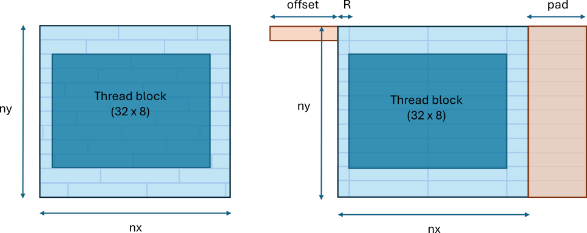
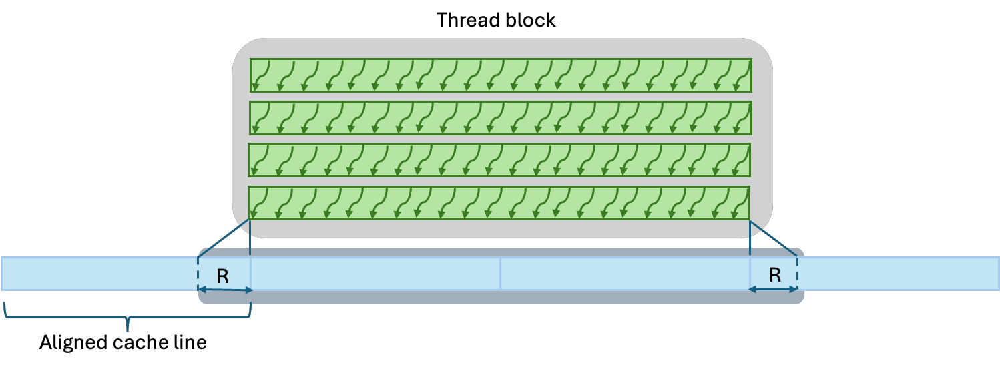
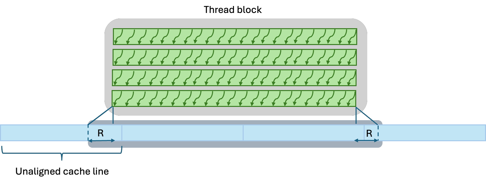
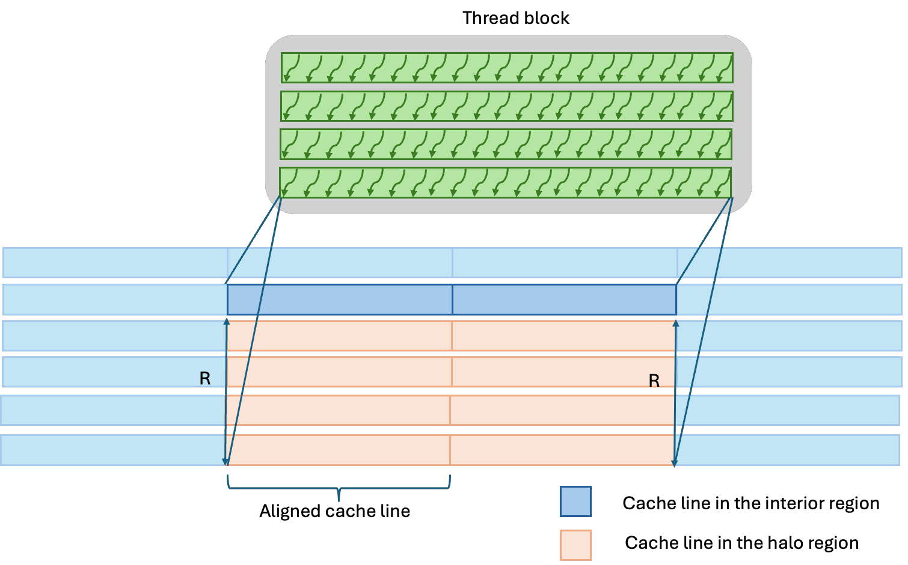
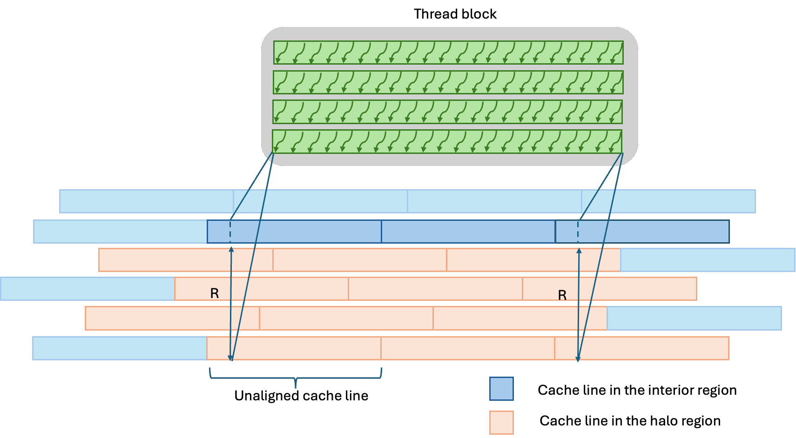
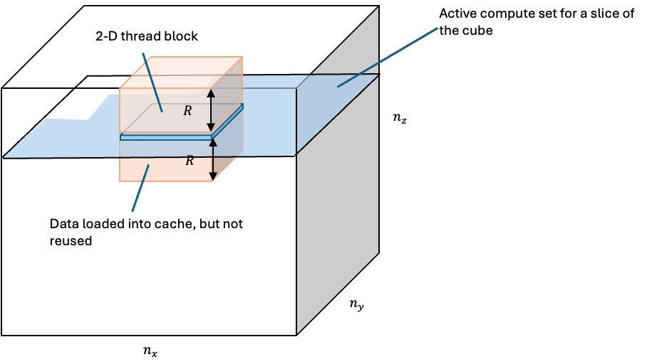
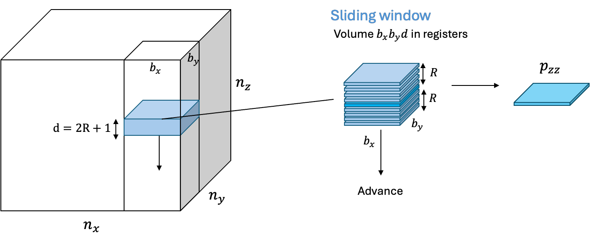
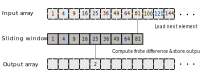
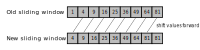
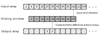

# Seismic stencil codes - part 2

<span style="font-size:0.7em;">12 Aug, 2024 by {hoverxref}`Justin Chang<justchan>` and {hoverxref}`Ossian O'Reilly<ossiorei>`. </span>

In the previous post, recall that the kernel with stencil computation in the z-direction suffered
from low effective bandwidth. This low performance comes from generating substantial amounts
of data to movement to global memory. To address this performance bottleneck, we will consider
two optimizations, one that trades off memory footprint for improved performance,
and another one that diverts pressure away from the memory subsystem and places more
of the pressure on the GPUs vector registers. For simplicity, all experiments
use a cubic grid size `nx, ny, nz = 512, 512, 512` and stencil radius `R=4`.

## Aligned vs unaligned memory accesses

The first optimization aligns memory accesses so that each wave in a thread block
writes to a complete set of cache lines. To align the memory accesses, pad the leading
dimension and offset the base pointers. The leading dimension should be a multiple
of the cache line size. Otherwise, the organization of cache lines changes depending
on which line or slice of the computational grid is accessed. The figure below demonstrates
how an excessive number of cache lines can get accessed in an unaligned case (left) and
how the optimal number of cache lines is accessed with a proper offset and padding.



<p style="text-align:center">
Figure 1: Unaligned and aligned cache line accesses for a 2D array.
(left) Unaligned accesses and (right) aligned accesses. Each shaded
box in light blue represents a cache line.
</p>

Here, we pad the leading dimension such that it is always divisible by 64.

```c++
int align = 64;
// Define mx = nx + 2 * R and pad it by some amount such that mx is divisible
// by 'align'
int mx = nx + 2 * R;
int mx = ((mx - 1) /align + 1) * align;
```

Naturally, another option is to restrict the grid size to be a multiple of the wave size,
if possible. This strategy can lead to further performance improvements as it also ensures
that all threads in wave are fully utilized, i.e., leaving no idle threads near the boundary.

To ensure aligned memory accesses without changing the kernel itself, we offset the base pointers

```c++
int offset = align - R;
hipMalloc(&d_p_in, (mx * (ny + 2 * R) * (nz + 2 * R) + offset) * sizeof(float));
hipMalloc(&d_p_out, (mx * (ny + 2 * R) * (nz + 2 * R) + offset) * sizeof(float));
d_p_in += offset;
d_p_out += offset;
```

This offset assumes that the input argument that specifies the starting index
in the x-direction for the baseline kernel is `x0=R`. Recall the baseline kernel
implementation:

```cpp
  template <int R>
  __launch_bounds__((BLOCK_DIM_X) * (BLOCK_DIM_Y) * (BLOCK_DIM_Z))
  __global__ void compute_fd_x_gpu_kernel(float *__restrict__ p_out, const float *__restrict__ p_in,
          int line, int slice, int x0, int x1, int y0, int y1, int z0, int z1) {

      const int i = x0 + threadIdx.x + blockIdx.x * blockDim.x;
      const int j = y0 + threadIdx.y + blockIdx.y * blockDim.y;
      const int k = z0 + threadIdx.z + blockIdx.z * blockDim.z;

      if (i >= x1 || j >= y1 || k >= z1) return;

      size_t pos = i + line * j + slice * k;
      int stride = 1; // x-direction

      // Shift pointers such that that p_in points to the first value in the stencil
      p_in += pos - R * stride;
      p_out += pos;

      // Compute the finite difference approximation
      float out = 0.0f;
      for (int r = 0; r <= 2 * R; ++r)
          out += p_in[r * stride] * d_dx<R>[r]; // x-direction

      // Write the result
      p_out[0] = out;

  }
```

### Baseline performance

Next, we demonstrate the performance implications of aligned vs unaligned memory accesses.
In this experiment, all settings remain the same except for whether memory
accesses are aligned or not. When the accesses are aligned, the arrays are padded such that
the leading dimension is divisible by 64 elements and the base pointers are offset by 60
elements for the radius `R=4`. The table below shows that proper alignment of the memory
accesses can have a significant impact on performance for AMD Instinct MI200 series GPUs.

|Kernel |Effective memory bandwidth | Speedup |
|---|---|---|
| x-direction: Unaligned | 956 GB/s | 1.00 |
| x-direction: Aligned   | 990 GB/s | 1.04 |
| y-direction: Unaligned | 940 GB/s | 1.00 |
| y-direction: Aligned   | 966 GB/s | 1.03 |
| z-direction: Unaligned | 217 GB/s | 1.00 |
| z-direction: Aligned   | 297 GB/s | 1.37 |

It should be mentioned that the aligned version uses slightly more memory due
to the array padding. For a 512 x 512 x 512 cube, this increase in memory consumption
is $\approx 10\%$ . On the other hand, the effective memory bandwidth improves by up to 1.37x.

At the L1, and L2 cache levels, the aligned memory access pattern reduces the
number of requests compared to the unaligned case. This is
because without aligned memory accesses, the data requested by a wave can be
spread across both full and partial cache lines. The caches operate at their
cache line granularity, meaning that any partial cache line requests still
need to be serviced by allocating and moving full cache lines into the caches.
Since the partial cache lines also need to be accessed by neighboring thread
blocks, they are reused if they are cached in L2. As a result, we
should expect to see to an insignificant difference in data movement from main/global
memory (referred to as High Bandwidth Memory or HBM for MI250) when toggling alignment on/off. You can see
these behaviors by collecting the following performance counters:

| Performance counter | Description |
|---------------------|-------------|
| `TCP_TOTAL_CACHE_ACCESSES_sum` | The total number of cache line accessed in the L1 cache.  |
| `TCP_TCC_READ_REQ_SUM`         | The total number of read requests that missed in L1 and went to the L2 cache.  |
| `TCP_TCC_WRITE_REQ_SUM`        |  The total number of write requests that missed in L1 and went to the L2 cache.     |

To convert the number of requests into the amount of data they moved in bytes,
multiply them by 64 B - the MI250 L1 cache line size.

|Kernel|L1|L2 read|L2 write|HBM|
|---|---|---|---|---|
| x-direction: Unaligned |  7247 MB | 570 MB | 671 MB | 1088 MB |
| x-direction: Aligned   |  6979 MB | 604 MB | 537 MB | 1105 MB |
| y-direction: Unaligned | 10737 MB | 2009 MB | 671 MB | 1097 MB |
| y-direction: Aligned   |  5369 MB | 1610 MB | 537 MB | 1080 MB |
| z-direction: Unaligned | 10737 MB | 6040 MB | 671 MB | 4447 MB |
| z-direction: Aligned   |  5369 MB | 4832 MB | 537 MB | 4268 MB |

To gain further insight into the amount of data moved throughout
the memory subsystem, divide each data entry in the table above by the
cube size `(512 * 512 * 512) * sizeof(float)` which is
approximately 536 MB. See the new ratios:

|Kernel|L1|L2 read|L2 write|HBM|
|---|---|---|---|---|
| x-direction: Unaligned | 13.5 | 1.06 | 1.25 | 2.03 |
| x-direction: Aligned   | 13.0 | 1.13 | 1.00 | 2.06 |
| y-direction: Unaligned | 20.0 | 3.75 | 1.25 | 2.05 |
| y-direction: Aligned   | 10.0 | 3.00 | 1.00 | 2.01 |
| z-direction: Unaligned | 20.0 | 11.3 | 1.25 | 8.30 |
| z-direction: Aligned   | 10.0 | 9.00 | 1.00 | 7.96 |

This number represents the number of cubes that passes through each level
of the memory hierarchy. For both the x-direction and y-direction
kernels, roughly two cubes move between the L2 cache and HBM. This case is
the ideal scenario because it corresponds to reading and writing a cube once.
However, we notice from the L1 and L2 caches that up to 20 cubes worth of data is
processed. Ideally we want these cubes loaded and stored
as little as possible, which alignment appears to reduce. The next sub sections
will analyze this phenomena for each direction.

#### X-direction accesses

The small difference between the aligned and unaligned HBM data movement
shows that the alignment optimization primarily impacts the number of cache
lines moved through the caches. For the x-direction kernel, most stencil
neighboring accesses hit on the same cache line regardless whether the
data is cache-line aligned or not (Fig. 2). As a result, there is small
difference in data movement across all levels of the memory subsystem.



<p style="text-align:center">
Figure 2: Due to the halo region of radius R, partial cache lines need to
 be loaded at the thread block boundaries in the x-direction regardless
 whether the data is cache line-aligned or not.
</p>



<p style="text-align:center">
Figure 3: The number of cache lines accessed when loading the neighboring
 values in the unaligned case can be the same as the aligned case or one
 cache line less, depending on the cache line boundary location.
</p>

#### Y-direction accesses

In contrast, for the y kernel, each neighboring access hits on a different cache line.
Without alignment, the number of accessed cache lines per thread block is much greater
compared to the aligned case (Fig. 3 and Fig 4.).



<p style="text-align:center">
Figure 3:  The figure shows the cache lines that a group of threads along the bottom
edge of a thread block need to access to compute the stencil in the y-direction
(only the bottom half of the neighbors are shown). Each neighbor access in the
y-direction hits on a different cache line. Since the data is aligned, all cache
lines are collinear and that minimizes the number of accesses needed when
computing the y-direction stencil using the cache.
</p>



<p style="text-align:center">
Figure 4:  Same as (Fig. 3) but with unaligned data. In this case, the y-direction
stencil computation accesses an additional cache line for each row of neighbors in the y-direction.
</p>

#### Z-direction accesses

While the aligned z-direction kernel saturates main memory bandwidth too a high degree,
the kernel's performance is far away from its limits. Since the kernel only
loads and writes two arrays in the ideal case, the optimal read-to-write ratio should be close
to unity. The x and y direction kernels are already close to this optimal limit
but the z-direction kernel is nowhere close:

|Kernel|HBM Read / Write|
|---|---|
| x-direction: Unaligned | 1.01 |
| x-direction: Aligned   | 1.07 |
| y-direction: Unaligned | 1.02 |
| y-direction: Aligned   | 1.02 |
| z-direction: Unaligned | 7.05 |
| z-direction: Aligned   | 7.02 |

> **Note:** As noted in [Part 4](../../finite-difference/docs/Laplacian_Part4.md) of the Finite Difference Laplacian blog series,
> an xy-plane of a 512 x 512 x 512 cube fits into the L2 cache of a single MI250X
> GCD so there is some reuse, hence why the z-direction read / write ratio is 7.0
> and not 9.0. In our experimentation not shown in this blog post, a 1024 x 1024 x 1024
> cube indeed has a read / write ratio of 9.0



<p style="text-align:center">
Figure 5: The stencil in the z-direction suffers from excessive HBM data
movement due to poor data reuse. The thread blocks are 2-D and all of
the currently active blocks running on the device fall within a narrow
band of the cube (the active compute set in the figure). The thread
blocks load the halo data above and below them into the L2 cache.
The L2 cache is not large enough to hold multiple slices of data.
By the time a thread block computes below a thread block, the data
has most likely been evicted from the cache. As a result, the data
needs to be reloaded once more from HBM.  
</p>

This massive amount of excess reads for the z-direction come from nearly no data reuse in
the stencil computation (Fig 5). Recall that the stencil computation needs to
load 8 neighboring values. Ideally, these values should be loaded from
caches or registers instead of main memory. The reason they do not
persist in the L2 cache for reuse is due to the current kernel implementation,
thread block configuration, and problem size. In the current thread block
configuration, the threads are layed out in a 2D pattern. So, there are
no waves in the thread block in the vertical direction, and therefore
there are no neighboring waves in the vertical direction that share data
via either the L1 or L2 caches. The second reason is because the problem
size is large enough to keep the entire device busy with thread blocks
that work on the same vertical slice. Thus, any data that any thread
block loads into L2 is highly unlikely to be reused because it would
require a thread block working on a slice either immediately below or
above it. For these reasons, there is little data in the L2 cache
that can be reused by other thread blocks (hence the 7.0 read / write ratio
noted above). While it is possible to
mitigate the situation to some extent by choosing another thread
block size, we are going to address it by changing the algorithm.

Since the z-direction stencil computation is the worst performing kernel,
the next optimization will focus solely on improving its performance.

## Sliding window

The z-direction kernel demonstrated one of the key challenges that arise
when implementing high order finite differences. Namely, how to
effectively reuse data during the stencil computation. To achieve
outstanding performance, it is important to avoid expensive loads that
go to global memory. Fortunately, the type of stencil patterns that
emerge from high order finite differences have a repeating pattern that
can be handled using a sliding window technique (Fig. 6)



<p style="text-align:center">
Figure 6: The key idea behind the sliding window technique for
stencil computation is to hold a local volume of the input array
data in registers and compute the stencil in the z-direction
entirely using these registers. To compute the stencil for the
next z-value, it is sufficient to load only one more slice of
data of the data into registers and re-use the previous data
found in registers from before.
</p>

The sliding window algorithm can be implemented in four steps:

1. Load all of values in the stencil except for the last one into an
   array of registers
2. Load the last value in the stencil into the register array
3. Compute the FD approximation using all of the values in the register
   array
4. Update the sliding window by shifting it forward one step,
   overwriting the previous first value in the register array

Repeat steps 2 - 4 for each grid point that the sliding window updates.
See the below images for a pictorial description of the above steps assuming
`R=4` and an input array `p[i]` initialized with `p[i] = i * i` :


<p style="text-align:center">
Figure 7: Step 1 - priming the window by loading the first 8 values
</p>



<p style="text-align:center">
Figure 8: Steps 2 and 3 - loading the last value of the window, computing the finite difference,
and storing the result
</p>



<p style="text-align:center">
Figure 9: Step 4 - updating the sliding window
</p>



<p style="text-align:center">
Figure 10: Repeat steps 2 through 4 with the newly shifted sliding window
</p>

The sliding window reduces the number of main memory load instructions
for $N$ updates from $(2R+1)*N$ to $2R + N$ at the price of needing
$2R+1$ registers.

Here is a sliding window implementation of the high order stencil
function we saw before:

```c++
template <int stride, int R>
__inline__ void compute_fd_z_sliding_window(float *p_out, const float *p_in, const float *d,
        int begin, int end, int pos, int stride) {
    // Sliding window
    float w[2 * R + 1];

    // 1. Prime the sliding window
    for (int r = 0; r < 2 * R; r++)
        w[r] = p_in[pos + (begin - R + r) * stride];

    // Apply the sliding window along the given grid direction determined by `stride`
    for (int i = begin; i < end; ++i) {

        // 2. Load the next value into the sliding window at its last position
        w[2 * R] = p_in[pos + (i + R) * stride];

        // 3. Compute the finite difference approximation using the sliding window
        float out = 0.0f;
        for (int r = 0; r <= 2 * R; r++)
            out += w[r] * d[r];
        p_out[pos + i * stride] = out;

        // 4. Update the sliding window by shifting it forward one step
        for (int r = 0; r < 2 * R; r++)
            w[r] = w[r+1];

    }
}
```

This function can be used as follows for computing the sliding window in
the z-direction:

```c++
// Apply approximation in the x-direction for all interior grid points
for (int j = R; j < ny + R; ++j) {
    for (int i = R; i < nx + R; ++i) {
        const uint64_t pos = i + line * j;          
        compute_fd_z_sliding_window<R>(p_out, p_in, d, R, nz + R, pos, slice);
    }
}
```

### Sliding window on the GPU

The GPU-based sliding window implementation shares many similiaries with
the host-based implementation. Here it is:

```c++
template <int R>
__launch_bounds__((BLOCK_DIM_X) * (BLOCK_DIM_Y))
__global__ void compute_fd_z_window_kernel(float *p_out, const float *p_in, const float *d, int line, int
        slice, int x0, int x1, int y0, int y1, int z0, int z1, int dimz) {

    const int i = x0 + threadIdx.x + blockIdx.x * blockDim.x;
    const int j = y0 + threadIdx.y + blockIdx.y * blockDim.y;

    if (i >= x1 || j >= y1) return;

    // Determine the k indices covered by this sliding window
    // The extent cannot exceed the z1
    const int kbegin = z0 + blockIdx.z * dimz;
    const int kend = kbegin + dimz > z1 ? z1 : kbegin + dimz;

    // Sliding window
    float w[2 * R + 1];

    size_t pos = i + line * j + slice * kbegin;

    // Shift pointers such that that p_in points to the first value in the sliding window
    p_in += pos - R * slice;
    p_out += pos;

    // 1. Prime the sliding window
    for (int r = 0; r < 2 * R; ++r) {
        w[r] = p_in[0];
          p_in += slice;
      }

   // Apply the sliding window along the given grid direction
   for (int k = kbegin; k < kend; ++k) {

       // 2. Load the next value into the sliding window at its last position
       w[2 * R] = p_in[0];

       // 3. Compute the finite difference approximation using the sliding window
       float out = 0.0f;
       for (int r = 0; r <= 2 * R; ++r)
           out += w[r] * d_dz<R>[r];
       p_out[0] = out;

       // 4. Update the sliding window by shifting it forward one step
       for (int r = 0; r < 2 * R; ++r)
           w[r] = w[r+1];

       // Increment pointers
       p_in += slice;
       p_out += slice;
   }
}
```

In this implementation, the thread block configuration must be 2D and
the threads layed out in the XY-plane. Each thread in a thread
block is responsible for computing a sliding window that starts from
`kbegin` and finishes at `kend-1`.
These start and end points depend on
the number of grid points a thread block should update in the
z-direction. In this implementation, each thread block slides over the
same number of grid points, $n_w$, except for thread blocks near the
boundaries if the work is not evenly divisible by the grid size.

As previously explained, while the thread block dimension is 2D, the
thread blocks cover a 3D thread block grid. The kernel is launched via:

```c++
    dim3 block(BLOCK_DIM_X, BLOCK_DIM_Y);
    dim3 grid;
    grid.x = ceil(x1 - x0, block.x);
    grid.y = ceil(y1 - y0, block.y);
    grid.z = ceil(z1 - z0, nw);

    compute_fd_z_window_kernel<R><<<grid, block>>>(p_out, p_in, d, line, slice, x0, x1,
            y0, y1, z0, z1, nw);
```

### Performance considerations

The parameter $n_w$ that controls the number of grid points that a
thread block slides over can have major performance implications. If
$n_w=1$, the sliding window degenerates to the baseline kernel that only
updates one grid point per thread. In this case, we know that the number
of load instructions explodes to $(2R+1)n_z$. On the other hand, this
choice exposes $n_z$ amount of parallelism. In the opposite limit,
$n_w=n_z$, the number of load instructions is $2R + n_z$, but there is
no parallelism exposed in the z-drection. In the general case, the
number of load instructions is $(2R + n_w)n_z/n_w$ and $n_z / n_w$ is
the parallelism exposed. Hence, depending on the problem dimensions,
there can be a trade-off between reducing the number of load
instructions and exposing a sufficient amount parallelism to saturate
the hardware resources. If we assume that the reduction in parallelism
is negligible, then an upper bound on the speedup is the ratio of the
number of load and stores of the baseline kernel to the optimal number:
$S \leq (1 + (2R + 1))/(1 + 1) = R+1$. For $R=4$, the speedup is at most
5x.


<p style="text-align:center">
Figure 11: The sliding window kernel exhibits up to an effective memory bandwidth of
1200 GB/s[^1], which is roughly a 4x speedup over the baseline kernel. This speedup comes from reducing the
read/write ratio by roughly 7x.
</p>

In the figure above, the left sub-panel shows both the effective and achieved
memory bandwidths as a function of the window dimension, $n_w$ on a semi log scale.
There is a point of diminishing returns for the effective bandwidth. This point occurs when
there is little change in the HBM read - write ratio for increasing $n_w$.
The right sub-panel shows the HBM read - write ratio comparing the predicted vs achieved
results. Recall from our earlier discussion that due to the size of the xy-plane, there is
come reuse in the L2 cache hence why the achieved value is 7.0 compared to the predicted
value of 9.0. Either way, both curves approach near unity.

Due to the trade-off between increasing parallelism and decreasing
read-write ratio, the maximum speedup is about 4x instead of 5x. In
our experiment, the decrease in exposed parallelism gradually decreases
the achieved bandwidth. Both the achieved and effective memory bandwidths for the
z-direction kernel are now close to 1200 GB/s[^1].

## Conclusion

Cache line alignment can be an important optimization to consider for stencil computation
because it reduces the number of cache line accesses. For any stencil computation leveraging
the cache, it is important to use a thread block configuration that encourages a high degree
of data re-use of the stencil's neighboring values. For the stencils in the z-direction,
if the problem size is large enough and the thread block is 2-D, then there can be little
to no data re-use. This issue emerges because the cache is not large enough to hold the
number of slices of the data required for caching the stencil neighbors in the z-direction.
As a result, HBM data movement gets inflated and performance drops dramatically. An
effective way to address this problem on AMD GPUs is to use a sliding thread block
technique. When the sliding thread block technique is combined with the alignment
optimization it results in nearly a 5.5x speedup improvement over the naive, baseline
case. Another way to further reduce the number of global memory requests is to use
the user-programmable cache, the so-called local data share (LDS). The next blog
post will focus on this topic for the x-direction, and y-direction kernels, as well
as combining all three kernels into a single monolithic one.

[Accompanying code examples](https://github.com/amd/HPCTrainingExamples/tree/main/rocm-blogs-codes/seismic-stencils)

If you have any questions or comments, please reach out to us on
GitHub [Discussions](https://github.com/amd/amd-lab-notes/discussions)

[^1]:Testing conducted using ROCm version 6.1.0-82. Benchmark results are not
validated performance numbers, and are provided only to demonstrate relative
performance improvements of code modifications. Actual performance results
depend on multiple factors including system configuration and environment
settings, reproducibility of the results is not guaranteed.
