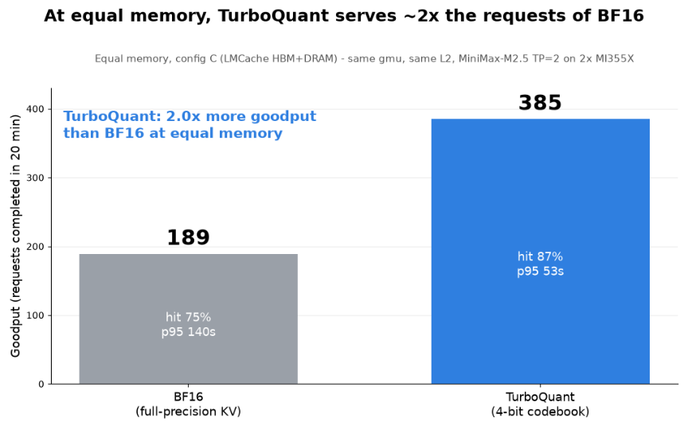
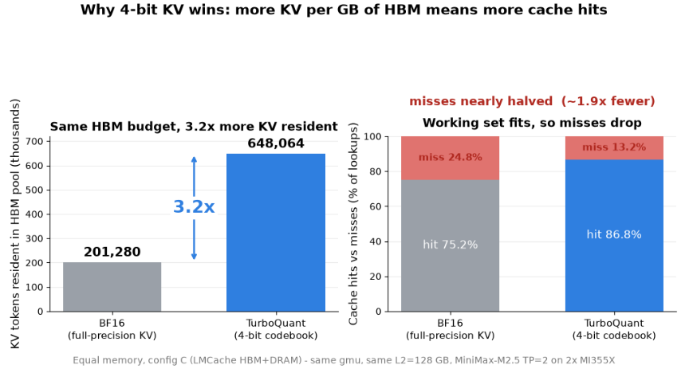
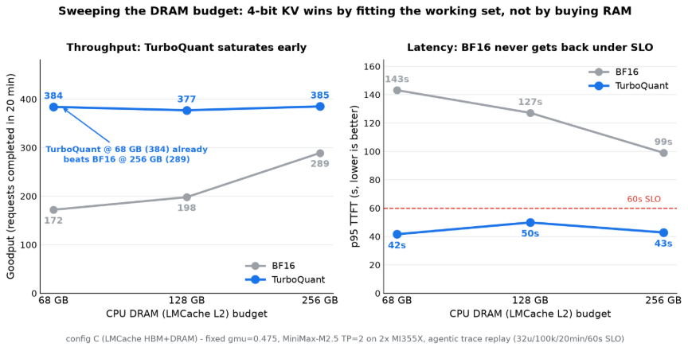
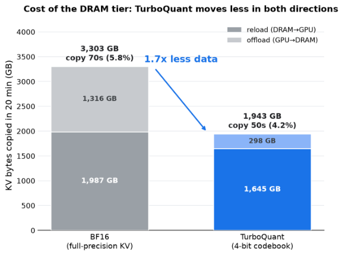
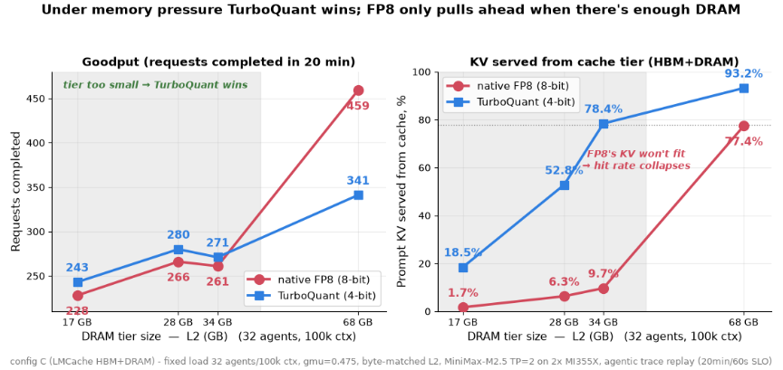
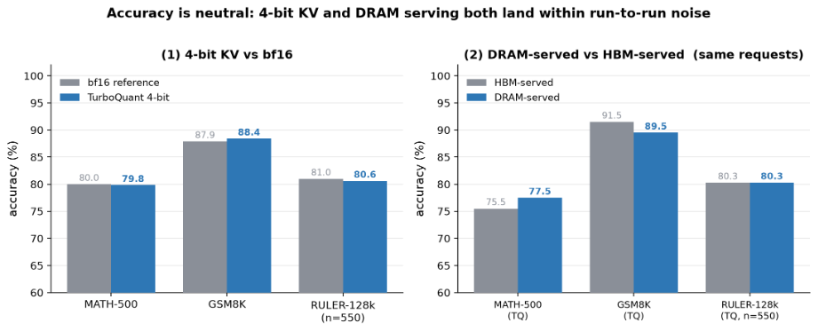

<!---
Copyright (c) 2026 Advanced Micro Devices, Inc. (AMD)
Permission is hereby granted, free of charge, to any person obtaining a copy
of this software and associated documentation files (the "Software"), to deal
in the Software without restriction, including without limitation the rights
to use, copy, modify, merge, publish, distribute, sublicense, and/or sell
copies of the Software, and to permit persons to whom the Software is
furnished to do so, subject to the following conditions:
The above copyright notice and this permission notice shall be included in all
copies or substantial portions of the Software.
THE SOFTWARE IS PROVIDED "AS IS", WITHOUT WARRANTY OF ANY KIND, EXPRESS OR
IMPLIED, INCLUDING BUT NOT LIMITED TO THE WARRANTIES OF MERCHANTABILITY,
FITNESS FOR A PARTICULAR PURPOSE AND NONINFRINGEMENT. IN NO EVENT SHALL THE
AUTHORS OR COPYRIGHT HOLDERS BE LIABLE FOR ANY CLAIM, DAMAGES OR OTHER
LIABILITY, WHETHER IN AN ACTION OF CONTRACT, TORT OR OTHERWISE, ARISING FROM,
OUT OF OR IN CONNECTION WITH THE SOFTWARE OR THE USE OR OTHER DEALINGS IN THE
SOFTWARE.
--->

# 4-bit KV Caching in LMCache: Offloading Quantized KV Beyond HBM for Context-Heavy Agents on AMD MI355X

As agents carry ever-longer context from turn to turn, the KV cache becomes the resource that runs out first. Two techniques ease that pressure from different angles: KV quantization makes each cached token smaller, while a hierarchical cache like LMCache spills cold KV to CPU DRAM. The two have mostly been developed independently.

This blog brings them together on AMD Instinct™ MI355X: a KV cache that is both 4-bit and tiered, taking quantized KV (TurboQuant) past the HBM boundary into CPU DRAM and back, bit-exact, accuracy-neutral, and fast. We walk through the layout-aware connector that makes a mixed bf16 + 4-bit cache safe to offload, the serving methodology we used to measure it, and what happens to goodput, latency, and accuracy when quantization and tiering compound at equal memory.

## Key Results

- LMCache extends TurboQuant past the HBM wall. 4-bit KV holds more, but big agent contexts still overflow HBM. LMCache catches the overflow in CPU DRAM and reloads it fast, so a miss is a quick copy, not a full re-prefill. That turns 4-bit's saved space into real goodput (more requests served), not just a bigger cache.
- Quantized KV offload with TurboQuant. LMCache now stores, evicts, and reloads a mixed bf16 + 4-bit KV stack through CPU DRAM, using our optimized TurboQuant 4-bit codebook, the AMD-productionized kernels from [turboquant-vllm-agentic](https://rocm.blogs.amd.com/artificial-intelligence/turboquant-vllm-agentic/README.html).
- A layout-aware connector. TurboQuant doesn't store KV in one uniform format: it keeps the sensitive boundary layers in bf16 and packs the middle layers into 4-bit. The LMCache connector understands the mix and moves every byte back exactly.
- Quantization makes the cache fit. At a fixed HBM+DRAM budget, TurboQuant keeps ~3.2× more KV resident in HBM and lifts the LMCache hit rate from 75.2% (BF16) to 86.8% (TurboQuant), so most reused context is served straight from cache instead of being recomputed.
- Big serving win. TurboQuant delivers ~2.0× the goodput — requests completed in the fixed 20-min replay — at ~2.6× lower p95 TTFT than a BF16 cache, while moving ~1.7× less data across at equal memory.

## When KV Outgrows HBM

An agent carries the same context from turn to turn: system prompt, tools, retrieved files, a running plan. That's tens to hundreds of thousands of tokens, ~95% of it reused each turn. At those lengths it's the KV cache, not the model weights, that fills HBM. And once HBM is full, the cache has to evict old prefixes, so every reused turn hits one of two bad options: re-prefill the dropped prefix (pay its full compute and TTFT again) or reload it from a slower tier.

[LMCache](https://github.com/LMCache/LMCache) is an open-source KV-cache layer for vLLM that stores and reuses KV across requests, so repeated context is reloaded instead of recomputed. It spreads that KV across a memory hierarchy ordered by speed and size: GPU HBM (fast, small) → CPU DRAM (slower, large) → disk (slowest, largest). Each level is a tier, and LMCache reloads KV from a lower tier on demand instead of dropping it (see the [LMCache blog](https://blog.lmcache.ai/)). But by default, LMCache keeps KV at full precision (bf16), which is heavy: HBM fits only a few tokens, fills up and evicts early, and every reload from DRAM copies a lot of bytes, slowly. The result is a cache that spills to DRAM early and keeps moving big blocks back.

Quantization attacks both problems at once. Packing the KV cache to 4-bit makes each token ~3.76× smaller, which buys two things: ~3.2× more tokens stay in fast HBM before anything spills to DRAM, and tokens that do spill move as 4-bit datatypes, a much smaller payload. These two effects compound: more reuse is served from HBM, and the spills that remain are cheaper.

## Implementation: What We Changed in LMCache

vLLM serves the model through its KV-connector hook, handing each request's KV to `LMCacheConnectorV1`, which tiers GPU HBM and CPU DRAM, evicting and reloading on demand. What flows through that path is a mixed bf16 + 4-bit KV stack instead of uniform bf16.

We don't compress every layer, and that's deliberate. The first two and last two attention layers are the most accuracy-sensitive, so they stay bf16; the middle 58 layers tolerate compression, so they're packed to 4-bit. This keeps full precision where it matters and takes memory savings everywhere else ([vLLM TurboQuant OSS](https://vllm.ai/blog/2026-05-11-turboquant)). One model holds two physically different KV tensors:

| | Boundary layers (×4) | Middle layers (×58) |
| --- | --- | --- |
| dtype | bf16 | uint8 (packed) |
| bytes/token/head | 512 B | 134 B (TurboQuant, packed 4-bit) |
| K/V | separate, 2-byte elements | interleaved into one opaque slot |

Our implementation is on top of LMCache (GPU connector, vLLM integration, kernels, correctness tests) and builds on LMCache's existing layer-group support to make the connector group-aware for a quantized workflow. At registration it partitions layers into two transfer groups (bf16, packed-uint8) and issues one correctly-strided copy per group, so both ride the same HBM-to-DRAM path. Two properties keep it a no-config run:

- **Auto-selection.** A uint8 KV container is an unambiguous packed signal, so the group-aware path turns on by itself — no new flags, and one code path regardless of how the 4-bit slot is packed.
- **Byte-transparency.** The slot's internal K/V split never leaks into the cache; LMCache copies whole slots as opaque uint8, so the round-trip is byte-exact however K and V are packed inside.

## Methodology

### Hardware & Software

We run on 2× AMD Instinct MI355X GPUs (gfx950, 288 GB HBM each), which gives us a large but finite HBM budget to put under pressure. The serving stack is ROCm 7.2.3 with vLLM V1, and LMCache built for HIP and extended with our group-aware connector. Our test model is MiniMax-M2.5, a 230 GB FP8 mixture-of-experts, served with tensor parallelism across both GPUs (TP=2). As a safety measure, we also set `PYTHONHASHSEED=0` and `LMCACHE_PRE_CACHING_HASH_ALGORITHM=sha256` on every run to keep cache keys stable across TP workers.

**KV encodings.** BF16 (baseline) vs TurboQuant: our AMD-productionized 4-bit build with a custom FlyDSL kernel.

**Three cache configurations.** We run the same workload three times, swapping only the KV strategy (see [LMcacheMI300X](https://blog.lmcache.ai/en/2026/05/12/benchmarking-lmcache-for-multi-turn-agentic-workloads-on-amd-mi300x/) for reference and settings):

| Config | Server flags | What's cached |
| --- | --- | --- |
| A — no cache | `--no-enable-prefix-caching` | nothing; every prefill from scratch |
| B — HBM prefix cache | `--enable-prefix-caching` | KV blocks in HBM, LRU-evicted when full |
| C — LMCache HBM+DRAM | `--enable-prefix-caching` + `--kv-transfer-config '{…LMCacheConnectorV1…,"kv_role":"kv_both"}'` | HBM L1 + CPU DRAM L2 |

### Workload

Every benchmark replays the same agentic trace for 20 minutes: many users hit the server at once, and each finished conversation is replaced by a new one, keeping the server continuously loaded. Terms:

- Agentic trace replay: we re-issue 739 recorded, anonymized Claude Code sessions (multi-turn, tool-using coding), so the load is real agent traffic, not synthetic.
- Concurrent users: independent conversations running at once (we test 32–64); more users = more pressure on HBM and the cache.
- Context (~100k tokens): the history each request carries (system prompt, tool schemas, files, earlier turns). At this length the KV cache, not the weights, fills HBM.
- Warm prefix (~12k tokens): the leading context identical across turns/users (system prompt + tool defs); it repeats, so it's a cache hit after the first request.
- TTFT and p95: time-to-first-token is the delay to the first output token; p95 is the worst-5% value, the tail latency users feel.
- SLO: the latency bar we hold — p95 TTFT under 60 s. Slower requests are what caching is meant to prevent.
- Goodput: rate of requests served successfully (fast enough to matter), as opposed to raw throughput that counts every request regardless of latency. We report it as requests completed during the fixed 20-minute run.
- Recycled users: a finished conversation is immediately replaced, so concurrency stays constant for the full run.
- gmu (GPU-memory utilization): fraction of HBM given to the KV pool; we undersize it so the working set overflows and forces eviction.

## Results

All numbers below run on config C (LMCache HBM+DRAM tier) under the agentic stress workload where the working set outgrows HBM and the offload path matters. On that same tier, we compare the two KV encodings head-to-head: TurboQuant vs BF16, at equal memory.

### At Equal Memory: TurboQuant vs BF16

We give BF16 and TurboQuant the same memory — the same HBM pool (same gmu) and the same 128 GB DRAM tier — and change only how the KV is stored (full-precision BF16 vs 4-bit TurboQuant). Then we run the identical 20-minute agent workload and see which serves more. Each arm serves under config C and replays the 739-session agentic trace (32 users, 100k context, 20 min, 60 s TTFT SLO). Only the KV dtype changes between arms; gmu and L2 are held equal, and the group-aware connector engages automatically on the uint8 signal.

**What we saw.** TurboQuant completes 385 requests to BF16's 189 — about 2× the goodput — and its slow requests are far faster (p95 TTFT 53 s vs 140 s). The reason is simple: 4-bit KV is ~3.76× smaller, so the same memory keeps ~3× more reused context on-chip (648k vs 201k tokens). More of what each request needs is already cached, so fewer requests pay to re-compute it. The gap holds as we grow or shrink the DRAM tier. Figure 1 captures this equal-memory comparison.



Figure 1: At equal memory (config C, L2 = 128 GB, same gmu), TurboQuant serves almost all reused context from cache while BF16 keeps missing and re-computing it — ~2.0× the goodput at ~2.6× lower p95 TTFT.

It comes down to how much reused context each format keeps in fast HBM and how that translates into cache hits, which Figure 2 breaks down.



Figure 2: At the same gmu-sized HBM pool, TurboQuant keeps 3.2× more KV tokens resident on-chip, which nearly halves cache misses (~1.9× fewer). Each miss is a full re-prefill, so this is what flips p95 TTFT from 140 s (over the 60 s SLO) to 53 s.

We gave BF16 more room to work with, sweeping the CPU DRAM tier from 68 GB up to 256 GB and re-running both formats. Extra RAM buys back BF16's throughput, but never its latency, as Figure 3 shows:



Figure 3: Goodput and p95 latency vs DRAM-tier size (config C, fixed gmu). TurboQuant stays flat and high from 68 GB up, matching BF16 at 256 GB with 4× less RAM.

Why it holds: TurboQuant keeps ~3.2× more KV on-chip, so the working set fits and the hit rate saturates instead of thrashing (L2 = 128 GB):

| At equal memory (L2 = 128 GB) | BF16 | TurboQuant |
| --- | --- | --- |
| KV resident in HBM | 201,280 tok | 648,064 tok |
| LMCache hit (HBM+DRAM) | 75.2% | 86.8% |
| Total KV copied | 3.30 TB | 1.94 TB |

More DRAM buys BF16 request count, but not latency or transfer cost — every byte it moves is still 3.76× heavier.

### The Cost of Offloading

Moving KV between HBM and DRAM isn't free, so we measured the cost directly, parsing every LMCache offload/reload event (config C, L2 = 128 GB); Figure 4 shows the bytes moved by direction:



Figure 4: KV bytes moved over the 20-min run, split by direction. TurboQuant hauls ~1.7× less data (1.94 vs 3.30 TB) and copies for less time (50 s vs 70 s).

| L2 = 128 GB | BF16 | TurboQuant |
| --- | --- | --- |
| Copy-time overhead (D2H+H2D) | 69.6 s (5.8% of run) | 50.2 s (4.2%) |
| DRAM share of cache hits | 93.6% | 97.3% |

Copy time is cheap and hidden — a small % of wall time, fully overlapped with compute. Offload drops far more than reload: offloads happen when HBM evicts and reloads happen when we reuse. TurboQuant fits ~3.2× more KV in HBM, so it evicts far less (offload ~4.4× smaller). But it also gets more hits and finishes ~2× the requests, so it still reloads about as often, just lighter each time.

### TurboQuant vs Native FP8 KV

vLLM's native 8-bit FP8 KV (`fp8_e4m3`) is a strong point of comparison — half of BF16, hardware-native, and a faster decode path than TurboQuant's 4-bit unpack. Which format comes out ahead hinges on whether the DRAM tier can hold its working set. We fix the load (32 agents, 100k context) and shrink the tier from 68 GB down to 17 GB, and the advantage flips partway down, as Figure 5 shows:



Figure 5: Left: goodput as the DRAM tier shrinks. Right: share of prompt KV served from the LMCache tier. TurboQuant's KV — ~2× denser — stays cached in a tier that is already too small for FP8, leading goodput everywhere except the roomiest point.

When the tier is small (17–34 GB), FP8's heavier KV doesn't fit, so it keeps re-computing and TurboQuant wins. FP8 only pulls ahead at 68 GB, once both fit — and even then it moves twice the data.

### Correctness

A mixed 4-bit/bf16 cache is easy to corrupt on the way to DRAM and back, so we check the round-trip directly: bf16 layers come back bit-for-bit identical, 4-bit and bf16 data never overwrite each other, and under 32 concurrent requests with one shared prefix (forced out to DRAM and reloaded 20 times) every answer is 480/480 correct with zero cross-request leakage.

### Accuracy: Neutral

A new 4-bit format and a new offload path raise two accuracy questions on MiniMax-M2.5. We isolate each one by changing a single variable: (1) bf16 vs 4-bit KV at matched cache settings (pure quantization effect), and (2) score the same requests twice — once served from HBM, once re-served from DRAM after flushing HBM (pure tier effect, with a gate confirming pass 2 truly reloaded from DRAM). Long context is covered by RULER (NIAH-style retrieval, 550 samples/length at 16k–128k). Both questions come back neutral, as summarized in Figure 6:



Figure 6: Left: 4-bit KV vs the bf16 reference. Right: the same requests re-served from DRAM vs from HBM, gate-confirmed reloaded.

- **4-bit KV ≈ bf16:** within ~1 pt on all three benchmarks.
- **DRAM = HBM:** short-context within ±2 pt; RULER long-context matches to ≤0.4 pt across 16k/64k/128k (Δ +0.4 / −0.1 / 0.0), over thousands of gate-verified DRAM reloads.
- **Why:** the DRAM round-trip is bit-exact, so the tier adds no error.

## Takeaways

- Quantization and tiering compound. 4-bit makes the working set small enough to fit the DRAM tier, so the cache serves almost every reuse instead of constantly re-computing it. Neither alone is enough: quantization still overflows without the tier, and the tier can't hold the working set without quantization.
- Use it for high-concurrency, long-context agentic traffic that oversubscribes HBM, or when host DRAM bandwidth is the constraint; skip it when the working set fits HBM (short-context / low-concurrency chat).
- One ROCm gotcha: `PYTHONHASHSEED=0` is mandatory at TP>1, or bit-identical prompts hash to different keys and you get 0% cache hits.

## Reproducibility

We ship the exact validated build as one pinned public Docker image, so you can reproduce our numbers on the identical stack. Image: [`rocm/vllm-dev:quark-ultraquant-lmcache-mi355`](https://hub.docker.com/layers/rocm/vllm-dev/quark-ultraquant-lmcache-mi355/images/sha256-563d12ab9d6ffb22f4ff1a24ce630ed29829812c2a1f925a94ae350d80ff7bc0) on Docker Hub. Everything is baked in and pinned, including the mandatory hash fix (`PYTHONHASHSEED=0`, `LMCACHE_PRE_CACHING_HASH_ALGORITHM=sha256`).

```bash
# 1. Pull the pinned public image.
docker pull rocm/vllm-dev:quark-ultraquant-lmcache-mi355

# 2. Start a container with GPU access (mount the model weights).
docker run -d --name lmcache-bench --network=host --ipc=host \
  --device=/dev/kfd --device=/dev/dri --group-add video \
  -v /models/MiniMax-M2.5:/models/MiniMax-M2.5:ro \
  --entrypoint /bin/bash \
  rocm/vllm-dev:quark-ultraquant-lmcache-mi355 -c "sleep infinity"

# 3. Grab the one-file harness and run each arm (gmu 0.475, L2=128 GB).
#    The script boots vllm serve with the right KV flags, then replays the
#    agentic trace (32 users, 100k context, 20 min, 60 s TTFT SLO).
docker exec -it lmcache-bench bash -c '
  curl -fsSL https://gist.github.com/aditi-amd/7fc2d9e531746874db3cd453025c0ecb/raw/run_equal_memory.sh -o run.sh && chmod +x run.sh
  MODEL=/models/MiniMax-M2.5 ./run.sh tq      # TurboQuant 4-bit
  MODEL=/models/MiniMax-M2.5 ./run.sh bf16    # BF16 baseline'
```

`--ipc=host` matters: vLLM's TP workers use shared-memory broadcast. On a busy host they can intermittently stall at graph capture with `No available shared memory broadcast block`; it's a transient boot flake, so just kill and relaunch.

| Layer | Source | Ref |
| --- | --- | --- |
| base | `rocm/vllm-dev@sha256:a73159fd…4a6fb73ee` | ROCm 7.2.1 / torch 2.10 |
| vLLM | fork snapshot (TurboQuant) | `3cc38a1b` |
| FlyDSL | ROCm/FlyDSL (prebuilt, self-contained) | `41500b0` |
| LMCache | aditi-amd/LMCache (group-aware packed connector, HIP) | `efd5389` |

## Summary

In this blog, we showed that 4-bit KV plus tiering is a real serving win, not just a way to save memory:

- On the same GPU and the same memory budget, TurboQuant + LMCache lets you keep far more of the cache around, so most repeated context is read back from memory instead of being recomputed, and more requests finish within the same speed target.
- The gain is biggest exactly where agents struggle today: long conversations, many turns, and lots of users at once, enough traffic that the cache no longer fits on the GPU. When everything already fits on the GPU, the benefit fades.
- The 4-bit cache moves between GPU and CPU on its own. Storing and reloading it need no extra tuning and no special handling from the user, and accuracy is unchanged whether the cache is served from the GPU or reloaded from CPU memory.
- Get more out of the GPUs you already own. In our test, the same two MI355X cards served about twice as many requests under the same speed target, extra capacity from smarter caching.

Several directions remain open for future work:

- UltraQuant + LMCache: this post stops at 4-bit TurboQuant; the same tiering path should carry more aggressive UltraQuant presets.
- Broader case coverage: extend beyond the single stress point to a larger sweep — more models and attention families, wider concurrency and context ranges, and more tier sizes.
- Sharing the cache across machines: large deployments often split the work across several GPUs or servers and pass the cache between them. Because a 4-bit cache is much smaller, sending it over the network is faster and cheaper, so the same idea that saves memory here should also save bandwidth there.

## Acknowledgements

We thank our colleagues across the AMD kernel, quantization, and inference-serving teams, and the open-source vLLM and LMCache communities, whose upstream work and technical discussions made this study possible.

## Disclaimers

Third-party content is licensed to you directly by the third party that owns the content and is not licensed to you by AMD. ALL LINKED THIRD-PARTY CONTENT IS PROVIDED "AS IS" WITHOUT A WARRANTY OF ANY KIND. USE OF SUCH THIRD-PARTY CONTENT IS DONE AT YOUR SOLE DISCRETION AND UNDER NO CIRCUMSTANCES WILL AMD BE LIABLE TO YOU FOR ANY THIRD-PARTY CONTENT. YOU ASSUME ALL RISK AND ARE SOLELY RESPONSIBLE FOR ANY DAMAGES THAT MAY ARISE FROM YOUR USE OF THIRD-PARTY CONTENT.

The information presented in this document is for informational purposes only and may contain technical inaccuracies, omissions, and typographical errors. The information contained herein is subject to change and may be rendered inaccurate for many reasons, including but not limited to product and roadmap changes, component and motherboard version changes, new model and/or product releases, product differences between differing manufacturers, software changes, BIOS flashes, firmware upgrades, or the like. Any computer system has risks of security vulnerabilities that cannot be completely prevented or mitigated. AMD assumes no obligation to update or otherwise correct or revise this information. However, AMD reserves the right to revise this information and to make changes from time to time to the content hereof without obligation of AMD to notify any person of such revisions or changes.
THIS INFORMATION IS PROVIDED "AS IS." AMD MAKES NO REPRESENTATIONS OR WARRANTIES WITH RESPECT TO THE CONTENTS HEREOF AND ASSUMES NO RESPONSIBILITY FOR ANY INACCURACIES, ERRORS, OR OMISSIONS THAT MAY APPEAR IN THIS INFORMATION. AMD SPECIFICALLY DISCLAIMS ANY IMPLIED WARRANTIES OF NON-INFRINGEMENT, MERCHANTABILITY, OR FITNESS FOR ANY PARTICULAR PURPOSE. IN NO EVENT WILL AMD BE LIABLE TO ANY PERSON FOR ANY RELIANCE, DIRECT, INDIRECT, SPECIAL, OR OTHER CONSEQUENTIAL DAMAGES ARISING FROM THE USE OF ANY INFORMATION CONTAINED HEREIN, EVEN IF AMD IS EXPRESSLY ADVISED OF THE POSSIBILITY OF SUCH DAMAGES.
AMD, the AMD Arrow logo, AMD Instinct, ROCm, and combinations thereof are trademarks of Advanced Micro Devices, Inc. Other product names used in this publication are for identification purposes only and may be trademarks of their respective companies. vLLM is a trademark of vLLM Project. All other trademarks and product names referenced in this publication, including LMCache, TurboQuant, MiniMax, RULER, and Claude, are the property of their respective owners.
© 2026 Advanced Micro Devices, Inc. All rights reserved.
