# Accelerating LLM Inference on AMD GPUs with Low-Latency GEMMs

Large language model inference is becoming increasingly interactive. Users expect chatbots, coding assistants, agents, and real-time copilots to respond quickly, stream tokens smoothly, and stay responsive under concurrent load. In that setting, decode-time latency is not just a backend metric. It directly affects perceived quality.

In this blog, you will explore one small but important part of that inference path: **decode-time GEMMs with small `M`, large `N` and `K`, BF16/FP16 inputs, optional bias, and shapes that repeat across real models**. These shapes can leave conventional GEMM tiling underutilized, which makes them a useful target for decode-path optimization.

The main technique is **LDS-Pipelined Split-K GEMM**: the long `K` reduction is split across CTAs, further sliced across warp groups inside each CTA, and kept moving through a multi-stage LDS memory pipeline. On AMD GPUs, LDS means Local Data Share, the on-chip scratchpad memory used for fast cooperation inside a CTA.

You will also see how we implement this idea as an [AITER](https://github.com/ROCm/aiter) [FlyDSL](https://github.com/ROCm/FlyDSL) kernel family. FlyDSL keeps low-level ROCm™ software details such as MFMA selection, LDS layout, async copies, and synchronization explicit, while still generating shape-specialized variants for the model dimensions that appear in decode. In benchmark sweeps, this targeted decode optimization reaches a **`1.64x` average latency improvement** over the fastest of `HipblasLT`, `AITER Triton`, and `AITER ASM` on the `K = 7168` decode grid[^1], and a **`1.49x` average latency improvement** on additional BF16 model-shape tests.

## Why Does Decode Latency Matter for LLM Serving?

LLM serving has two broad phases:

1. **Prefill**, where the model processes the prompt.
2. **Decode**, where the model generates output tokens one step at a time.

Prefill often has a larger effective `M` because many prompt tokens can be processed together. Decode is different. Each step may only process a small number of active tokens, especially after batching, scheduling, tensor parallelism, and request-level dynamics are taken into account.

That makes decode performance important for user-facing latency:

- **Time to first token** affects how quickly the system appears to respond.
- **Time per output token** affects streaming smoothness.
- **Inter-token latency** affects whether the interaction feels fluid.
- **Throughput under concurrency** affects how many users can be served without hurting responsiveness.

Figure 1 illustrates this interactive decode serving setting and shows where these latency concerns appear in the user-facing path.

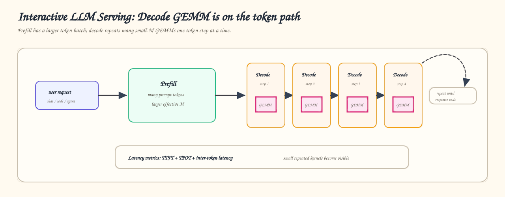

<p align="center"><em>Figure 1: Interactive LLM decode serving.</em></p>

For these workloads, shaving overhead from repeated decode GEMMs can matter at the model-serving level.

## Why Do Small-`M`, Large-`K` GEMMs Underperform?

In large-model decode, GEMM often looks like:

```text
C[M, N] = A[M, K] @ B[N, K]^T
```

Visually, the kernel still starts from the standard GEMM idea: compute a tile of `C` from a tile of `A` and a tile of `B`. The problem is that a small `M` produces too few output tiles, even though the `K` dimension can be very long.

Figure 2 shows this small-`M`, large-`K` bottleneck: the output grid is narrow, while the reduction dimension still contains substantial work.

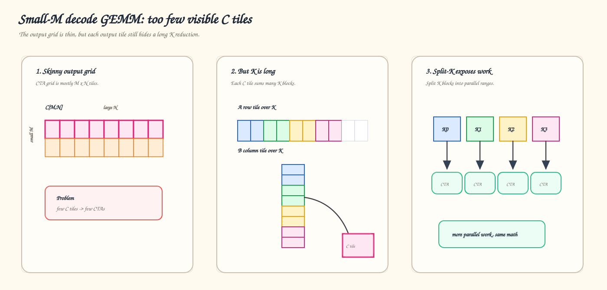

<p align="center"><em>Figure 2: Small-<code>M</code>, large-<code>K</code> GEMM bottleneck.</em></p>

where `M` is the number of active tokens in a decode step or micro-batch. For serving workloads, `M` is frequently small: `1`, `2`, `4`, `8`, `16`, `32`, sometimes up to `128` or `256`. At the same time, `N` and `K` are model-hidden-size dimensions and can be thousands or tens of thousands.

That shape regime is awkward for general GEMM libraries. A conventional large-tile GEMM wants enough `M x N` work per block to keep all compute units busy. Decode GEMM often does not provide that naturally. The result is under-occupancy, poor wave utilization, and too much overhead relative to useful math.

Common GEMM optimizations such as larger CTA tiles, better memory coalescing, LDS staging, MFMA-focused scheduling, and pipelining still matter. But they do not by themselves create enough independent work when the `M x N` output grid is small. This is why LDS-Pipelined Split-K combines multiple forms of K parallelism instead of relying on one optimization layer.

## Decode GEMM Shapes in Real Models

The motivation came directly from model shape traces, not from synthetic square GEMMs.

Across current LLMs, decode GEMM shapes repeatedly show the same pattern:

| Model family     | Typical decode GEMM pattern                                                                    |
| ---------------- | ---------------------------------------------------------------------------------------------- |
| DeepSeek V3      | `M = 1–256`, `N = 256 / 2112 / 3072 / 7168 / 16160`, `K = 1536 / 2048 / 7168`                  |
| GPT-OSS          | `M = 1–256`, `N = 128 / 640 / 2560 / 2880 / 5120`, `K = 512 / 2048 / 2880 / 4096`              |
| GLM5             | `M = 1–256`, plus prefill-like large `M`, with `N` and `K` around `6144`, `4096`, `2048`, etc. |
| Kimi K2          | many skinny decode shapes such as `M = 8–512`, `N = 384 or 1024`, `K = 7168`                   |
| Llama 70B / 450B | `M = 1–32768`, but decode-critical cases include `M = 1/16/32/64`, with large `N` and `K`      |
| Qwen32B          | `M = 1–32768`, with decode-heavy skinny projections such as `N = 100/200/800`, `K = 5120`      |

The important observation is not just “small `M` exists.” It is that **small-`M`, large-`K` GEMMs occur everywhere in decode paths**, and they affect end-to-end serving throughput.

So the design target is a low-overhead GEMM path with:

- Small `M` and large `K`
- Moderate-to-large `N`
- Optional bias support
- Low launch overhead
- Good occupancy even when `M` is tiny

## The Core Idea: LDS-Pipelined Split-K

The kernel treats `K` as splittable reduction work rather than a private serial loop inside one CTA. For one output tile `C[m_tile, n_tile]`, the computation is:

```text
C_tile =
    A[m_tile, K0] @ B^T[K0, n_tile]
  + A[m_tile, K1] @ B^T[K1, n_tile]
  + A[m_tile, K2] @ B^T[K2, n_tile]
  + ...
```

LDS-Pipelined Split-K exposes those `K0/K1/K2/...` chunks at three levels:

1. **Inter-CTA Split-K**: split the full K dimension across multiple CTAs (workgroups).
2. **Intra-CTA K-slice splitting**: split the K tile of one CTA across multiple warp groups inside the block.
3. **Multi-stage LDS pipeline**: pipeline K blocks through ring-buffered LDS stages while overlapping global-to-LDS copies, LDS reads, and MFMA compute.

These layers solve different problems.

| Technique                   | Where it adds parallelism | What it helps                                                                       | What it needs                             |
| --------------------------- | ------------------------- | ----------------------------------------------------------------------------------- | ----------------------------------------- |
| Inter-CTA Split-K           | Across CTAs (workgroups)  | Better GPU occupancy when `M x N` has too few tiles                                 | Global accumulation and synchronization   |
| Intra-CTA K-slice splitting | Inside one CTA            | Better use of warp groups for K-heavy tiles                                         | LDS staging and local reduction           |
| Multi-stage LDS pipeline    | Across time inside a CTA  | Overlap global-to-LDS copies, LDS reads, and MFMA while K blocks advance            | Ring-buffered LDS stages and scheduling   |
| LDS-Pipelined Split-K       | All three levels          | More work across the GPU, more useful work per CTA, and smoother K-block pipelining | A coordinated reduction and pipeline path |

Figure 3 shows the full tiled data path for this design. A selected `C` tile is not produced by one monolithic CTA. The long `K` dimension is first broken into inter-CTA Split-K ranges, each CTA streams its assigned K blocks through the multi-stage LDS pipeline, and intra-CTA K-slice splitting lets multiple warp groups compute partial accumulations for the same output tile. Those local partials are reduced through LDS before the inter-CTA Split-K partials are accumulated into the final `C` tile.

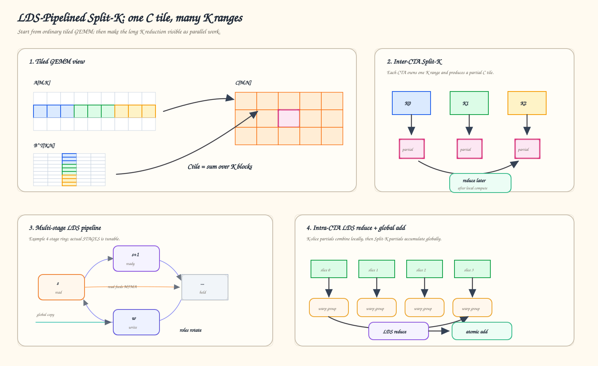

<p align="center"><em>Figure 3: LDS-Pipelined Split-K data path.</em></p>

### Inter-CTA Split-K: More CTAs for Small-M GEMM

When `M` is small, the normal `M x N` tile grid may not launch enough CTAs to saturate the GPU.

Inter-CTA Split-K expands the launch grid along K:

```text
grid = [mn_tiles, split_k]
```

Each Split-K partition computes a partial sum over a different K range. After that partition finishes its local pipeline work and intra-CTA LDS reduction, the partial result is accumulated into the same output tile.

In the launch wrapper, inter-CTA Split-K is visible as the second grid dimension:

```python
bm = (m + BLOCK_M - 1) // BLOCK_M
hgemm_kernel(C, A, B, BIAS, m, semaphore, signal).launch(
    grid=(bm * N_BLOCKS, SPLIT_K, 1),
    block=(BLOCK_THREADS, 1, 1),
    stream=stream,
)
```

This is especially useful for decode shapes like:

```text
M = 1, 2, 4, 8, 16
N = 2560 / 2880 / 5120
K = 2880 / 4096 / 7168
```

Without this extra Split-K dimension, there may simply not be enough independent work.

### Intra-CTA K-slice Splitting: More Warp-Group Parallelism

Inter-CTA Split-K increases the number of CTAs. Intra-CTA K-slice splitting increases useful work inside one CTA.

The kernel assigns multiple warp groups to different K slices of the same tile. Each group computes a partial accumulation. At the end of the CTA, those partial results are reduced through LDS before writing back.

This helps in two ways:

- It increases parallelism for K-heavy tiles.
- It controls register pressure by distributing work across warp groups.

### Multi-Stage LDS Pipeline: Keep K Blocks in Flight

The third layer is temporal. Once a CTA owns a K range, it still has to repeatedly compute:

```text
C_tile += A[m_tile, K_i] @ B^T[K_i, n_tile]
```

for many consecutive `K_i` blocks. Instead of treating those blocks as a serial load-then-compute sequence, the kernel uses `STAGES` as a ring buffer of LDS tiles. A stage that was filled earlier is consumed by LDS reads and MFMA, while another stage is reused for a future global-to-LDS copy.

In the `B_TO_LDS` path, both A and B participate in this LDS ring. The prologue first prefetches `STAGES - 1` K blocks, and the hot loop then consumes one stage while issuing the copy for a future stage:

```python
for s in range_constexpr(STAGES - 1):
    ldg_sts_b_async(ks_begin + s * BLOCK_K, s)
    ldg_sts_a_async(ks_begin + s * BLOCK_K, s)

for bki, state in range(0, BLOCK_K_LOOPS - (STAGES - 1), 1, init=init_state):
    k_offset = state[0]
    current_stage = fx.Index(state[1])
    next_stage = (current_stage + 1) % STAGES
    write_stage = (current_stage + STAGES - 1) % STAGES

    __barrier((STAGES - 2) * LDG_WAIT_COUNT)
    ldg_sts_b_async(k_offset + (STAGES - 1) * BLOCK_K, write_stage)
    ldg_sts_a_async(k_offset + (STAGES - 1) * BLOCK_K, write_stage)
    c_frags_new = ldmatrix_compute_tile_streaming(current_stage, c_frags)
    hot_loop_scheduler()
```

The hot loop then advances the ring one K block at a time. `current_stage` is the LDS stage being consumed, and `write_stage = current_stage + STAGES - 1` modulo `STAGES` is the stage receiving the future K block. The wait count intentionally leaves newer copies outstanding:

```python
__barrier((STAGES - 2) * LDG_WAIT_COUNT)
```

That means the loop waits for the current stage to be safe to read, without draining every in-flight global-to-LDS copy. Conceptually:

```text
current stage : LDS reads feed MFMA for K block i
write stage   : global-to-LDS copy brings K block i + STAGES - 1
next stage    : becomes current in the next loop iteration
```

The scheduler hints in `hot_loop_scheduler()` order VMEM, LDS reads, and MFMA instructions so this producer/consumer pipeline keeps moving through the CTA. This pipeline depth is separate from the two K-parallelism knobs: `SPLIT_K` adds CTAs across K, while `BLOCK_K_WARPS` splits a CTA's K tile across warp groups.

When `B_TO_LDS` is disabled, the pipeline is narrower: A is still staged through LDS, but B fragments are loaded directly from global memory into registers instead of joining the staged LDS ring.

## Single-Launch Split-K Synchronization

Inter-CTA Split-K creates a correctness problem: multiple CTAs contribute to the same output tile.

This kernel uses a lightweight global synchronization protocol with two global buffers:

```text
signal[]
semaphore[]
```

The flow is:

1. The first Split-K partition initializes the output tile.
   - If bias is enabled, it writes bias into `C`.
   - Otherwise, it zeroes `C`.
2. After initialization, it writes a `signal`.
3. Other Split-K partitions spin-wait on that signal before accumulating.
4. Each Split-K partition computes its partial result.
5. The partial result is accumulated into global `C` with atomic add.
6. A semaphore counts how many Split-K partitions have arrived.
7. The last arriving partition resets both `signal` and `semaphore`.

Figure 4 shows the same flow as a small protocol among the inter-CTA Split-K partitions:

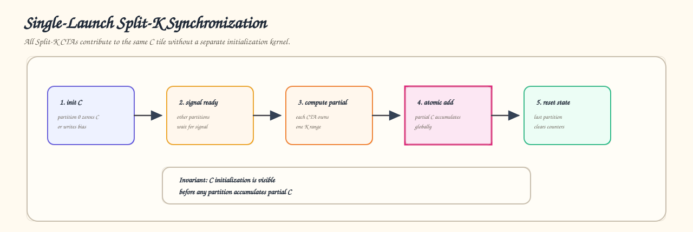

<p align="center"><em>Figure 4: Split-K synchronization protocol.</em></p>

This avoids a separate initialization kernel and keeps the entire operation inside one GEMM launch. That matters for decode, where launch overhead and small-kernel overhead are visible at the model level. The protocol relies on two simple correctness invariants:

1. **No Split-K partition accumulates into `C` before initialization is visible.**
   Partition 0 initializes the output tile and publishes `signal = 1`; the other partitions spin-wait on that signal before doing global atomic accumulation.
2. **Synchronization state is reset only after all Split-K partitions arrive.**
   Each partition increments `semaphore[]`; the last arriving partition resets both `signal[]` and `semaphore[]` for reuse.

In the implementation, the protocol stays close to the algorithm. Partition 0 initializes `C` and publishes the signal:

```python
if const_expr(IS_SPLIT_K):
    zero_c()

# inside zero_c()
signal_ptr = get_llvm_ptr(signal, signal_idx, 4)
llvm.InlineAsmOp(
    None,
    [signal_ptr, arith.constant(1, type=T.i32)],
    "global_store_dword $0, $1, off sc0 sc1",
    "v,v",
    has_side_effects=True,
)
```

Every Split-K partition later enters the barrier, increments the semaphore, and the last partition clears the state:

```python
arrive_idx = llvm.AtomicRMWOp(
    llvm.AtomicBinOp.add,
    semaphore_ptr,
    arith.constant(1, type=T.i32),
    llvm.AtomicOrdering.monotonic,
    syncscope="agent",
    alignment=4,
).result

cond_ksl = arith.cmpi(
    arith.CmpIPredicate.eq,
    fx.Index(arrive_idx),
    fx.Index(SPLIT_K - 1),
)
cond_ksl_if = scf.IfOp(cond_ksl, results_=[], has_else=False)
with ir.InsertionPoint(cond_ksl_if.then_block):
    semaphore_[signal_idx] = arith.constant(0, type=T.i32)
    signal_[signal_idx] = arith.constant(0, type=T.i32)
```

## LDS Reduction for Intra-CTA K-slice Splitting

Intra-CTA K-slice splitting happens inside a CTA. Each K-slice warp group produces partial `C` fragments. Instead of immediately writing each partial to global memory, the kernel stages the partial results through LDS:

```text
partial C from slice 0
partial C from slice 1
...
partial C from slice K
        ↓
LDS reduction
        ↓
global store or global atomic
```

When inter-CTA Split-K is disabled, the CTA reduces local K-slice partials and stores the final result. When inter-CTA Split-K is enabled, the CTA first reduces its local K-slice partials, then participates in the global accumulation. The implementation makes this hierarchy explicit by giving LDS `C` storage an extra `BLOCK_K_WARPS` dimension:

```python
cs_ = STensor(smem_c_ptr, dtype_, shape=(BLOCK_K_WARPS, BLOCK_M, BLOCK_N))
```

Each warp group writes its own K-slice partial into `cs_[wid_k, ...]`. The epilogue then reduces those partials before either storing the tile or participating in inter-CTA Split-K atomic accumulation.

## Memory Pipeline Details

Figure 5 summarizes the memory pipeline from the tiled-GEMM view. For one selected output tile, the CTA walks through a stream of K blocks:

```text
C_tile =
    A_i   @ B_i^T
  + A_i+1 @ B_i+1^T
  + A_i+2 @ B_i+2^T
  + ...
```

The multi-stage pipeline does not change this math. It changes **where each K block is while the loop is running**. One LDS stage feeds MFMA for the current K block, another stage can hold the next block, and another can receive a future block through global-to-LDS copy.

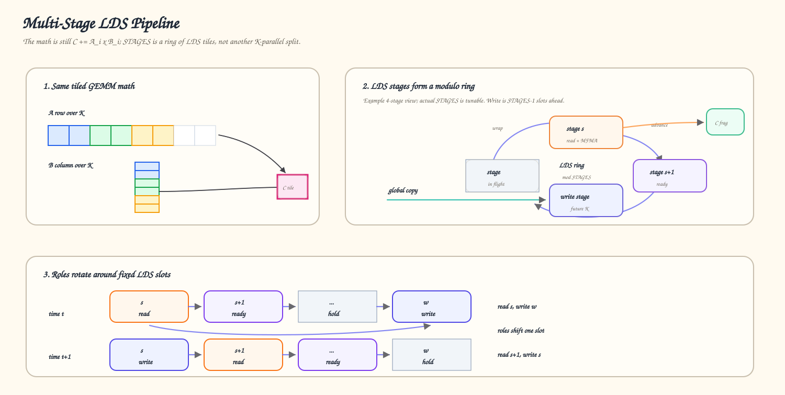

<p align="center"><em>Figure 5: Multi-stage LDS pipeline.</em></p>

This is the memory-side reason the pipeline pairs well with Split-K. Split-K creates more K-parallel work, while the LDS ring keeps each CTA from repeatedly stalling on a simple load-then-compute sequence.

## Implementation Notes: From Algorithm to FlyDSL Kernel

LDS-Pipelined Split-K is not one fixed kernel. It is a family of specialized kernels whose best configuration depends on shape, dtype, bias, and GPU architecture.

This is where FlyDSL matters. The algorithm is expressed as a parameterized kernel generator rather than as one handwritten kernel per shape. The implementation keeps low-level pieces explicit: MFMA selection, LDS allocation, async copies, global atomics, `s_waitcnt`, barriers, and inline assembly for specific global memory operations. FlyDSL then lets the kernel specialize the tile shape, Split-K factor, memory path, and epilogue together.

In `splitk_hgemm.py`, the naming maps directly to implementation knobs: `SPLIT_K` controls inter-CTA K partitioning, `BLOCK_K_WARPS` controls intra-CTA K-slice parallelism, `STAGES` controls the depth of the LDS ring, and `B_TO_LDS` controls whether B is staged through that ring. The kernel family is parameterized directly in the builder:

```python
@functools.lru_cache(maxsize=1024)
def compile_hgemm_kernel(
    dtype: str,
    n: int,
    k: int,
    TILE_M: int = 128,
    TILE_N: int = 128,
    TILE_K: int = 64,
    STAGES: int = 2,
    SPLIT_K: int = 1,
    BLOCK_M_WARPS: int = 2,
    BLOCK_N_WARPS: int = 2,
    BLOCK_K_WARPS: int = 1,
    B_TO_LDS: bool = False,
    HAS_BIAS: bool = False,
):
    IS_SPLIT_K = SPLIT_K > 1
    IS_SLICE_K = BLOCK_K_WARPS > 1
```

Those parameters are the tuning surface:

```text
TILE_M / TILE_N / TILE_K  -> CTA tile shape
SPLIT_K                  -> global K parallelism across CTAs
BLOCK_K_WARPS            -> intra-CTA K-slice parallelism
B_TO_LDS                 -> whether B is staged through LDS
HAS_BIAS                 -> fused bias path
dtype + GPU_ARCH         -> MFMA instruction selection
```

This gives the implementation a middle ground: more shape-specific control than a generic GEMM library call, but faster iteration than maintaining a fully hand-written assembly kernel.

1. **The kernel is generated as a family of specialized kernels.**
   Each shape can JIT to the right tile, inter-CTA Split-K factor, intra-CTA K slicing, LDS policy, MFMA path, and bias path.
2. **The synchronization logic stays connected to the algorithm.**
   Split-K initialization, signal wait, semaphore reset, LDS reduction, and epilogue logic are written in one kernel instead of being scattered across several auxiliary launches.
3. **The compiler can specialize aggressively.**
   Branches like `HAS_BIAS`, `B_TO_LDS`, `SPLIT_K > 1`, `BLOCK_K_WARPS > 1`, and architecture-specific MFMA paths become compile-time constants.
4. **Tuning moves faster than hand-written assembly iteration.**
   For model-serving kernels, this matters. We need to test many real model shapes, not just one benchmark shape.

That implementation strategy matters because the algorithm needs many tuned variants, not one universal kernel.

## Benchmark Results

We evaluate LDS-Pipelined Split-K as a concrete BF16/FP16 GEMM kernel family on representative decode GEMM shapes. The first sweep uses `K = 7168` on an AMD Instinct™ MI355X GPU (`gfx950`) with `256` CUs, and compares four backend paths:

- `AITER FLYDSL`
- `AITER ASM`
- `HipblasLT`
- `AITER Triton`

In Figures 6 through 11, `AITER FLYDSL` is the FlyDSL-generated kernel path, `AITER ASM` is the tuned assembly path, `HipblasLT` is the library backend, and `AITER Triton` is the Triton-based backend.

All performance data in this section was measured on the benchmark setup described in the footnote.[^1]

The benchmark section should be read shape by shape. The goal is to show where `AITER FLYDSL`, the generated shape-specialized kernel path, improves decode latency, where it is merely competitive, and where another backend remains the better choice.

Figure 6 is the main visual speedup table. Each cell corresponds to one `(M, N, K)` shape. The large number is the speedup of `AITER FLYDSL` against the fastest of `HipblasLT`, `AITER Triton`, and `AITER ASM`, and the small text shows the measured latencies.

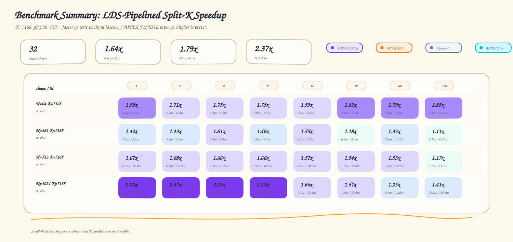

<p align="center"><em>Figure 6: <code>K = 7168</code> speedup table.</em></p>

For each `(M, N, K)` shape, the baseline is the fastest of `HipblasLT`, `AITER Triton`, and `AITER ASM`, and the cell value is:

```text
speedup = min(hipblaslt_latency, aiter_triton_latency, aiter_asm_latency) / aiter_flydsl_latency
```

Across these 32 decode GEMM shapes, `AITER FLYDSL` improves the average latency against the fastest of `HipblasLT`, `AITER Triton`, and `AITER ASM` by about `1.64x`. For the most decode-sensitive region, `M <= 8`, the average speedup is about `1.79x`, with the best observed shape reaching about `2.37x`. Some shapes remain close because backend performance depends on the exact `(M, N, K)` geometry and how much useful K-parallel work the shape exposes.

Compared with the `AITER ASM` path, `AITER FLYDSL` is also competitive across the sweep, with an average speedup of about `1.44x`, and with a best observed speedup of around `1.97x`. A few shapes remain close, which is expected because the best backend depends on the exact `(M, N, K)` tile geometry and reduction balance.

Figure 7 shows the fastest backend for each shape directly. This is useful as a sanity check because it answers a simpler question: which path wins this shape?

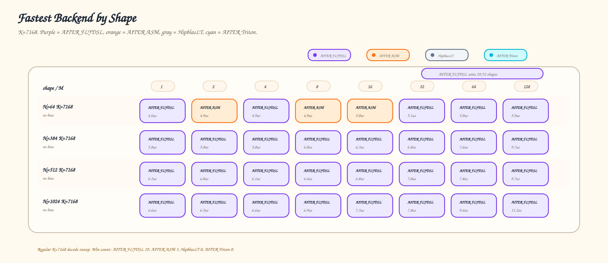

<p align="center"><em>Figure 7: <code>K = 7168</code> fastest-backend table.</em></p>

For readers who want to inspect the raw latency trend, Figure 8 keeps the original backend-by-backend comparison. Each panel fixes `N`, while the x-axis changes `M` from `1` to `128`. These curves are useful because they show where `AITER FLYDSL` wins cleanly and where `AITER ASM` remains close.

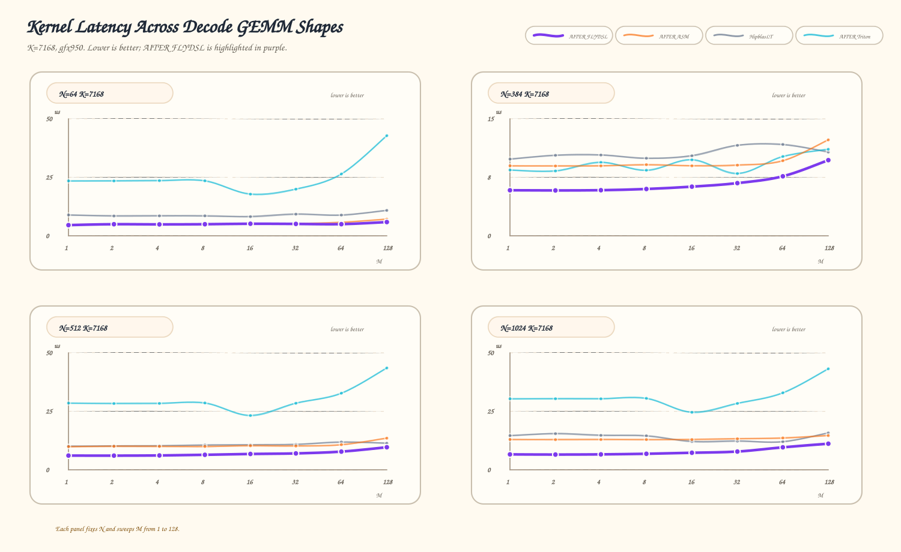

<p align="center"><em>Figure 8: <code>K = 7168</code> latency curves.</em></p>

The same benchmark data also includes an additional BF16 model-shape sweep beyond the regular `K = 7168` grid. These shapes cover projection sizes such as `N = 128`, `640`, `2112`, `2880`, and `5120`, with `K = 2048`, `2880`, `4096`, or `7168` and both bias and no-bias cases. Figure 9 keeps the same visual convention, but groups rows by `(N, K, bias)` so the reader can compare families rather than isolated points.

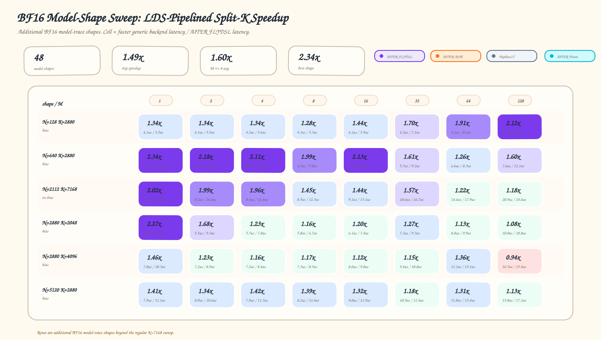

<p align="center"><em>Figure 9: BF16 model-shape speedup table.</em></p>

Across these 48 additional model-shape GEMMs, `AITER FLYDSL` improves the average latency against the fastest of `HipblasLT`, `AITER Triton`, and `AITER ASM` by about `1.49x`. For `M <= 8`, the average speedup is about `1.60x`, with the best observed shape reaching about `2.34x`.

Figure 10 shows the fastest backend for the same BF16 model-shape sweep, making it easier to see which path wins each grouped shape.

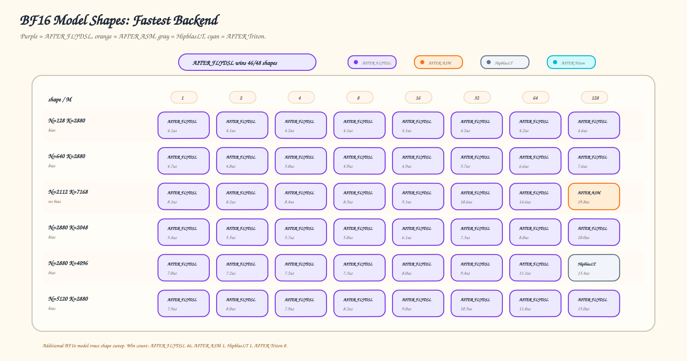

<p align="center"><em>Figure 10: BF16 model-shape fastest-backend table.</em></p>

For raw latency comparison, Figure 11 fixes one model-shape family per panel and sweeps `M` from `1` to `128`.

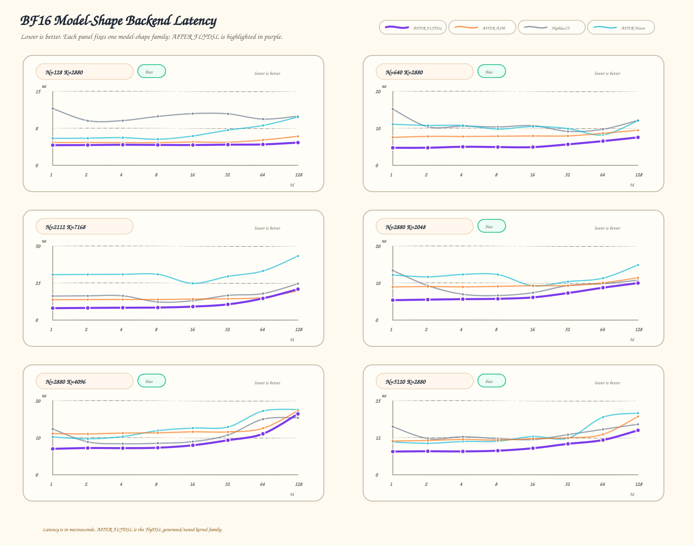

<p align="center"><em>Figure 11: BF16 model-shape latency curves.</em></p>

## Summary

In this blog, you explored why decode-time GEMMs are a critical path for interactive LLM serving, especially when small `M`, large `K`, and repeated model shapes leave conventional GEMM tiling short of parallel work.

You also saw how LDS-Pipelined Split-K addresses that gap with three cooperating layers: inter-CTA Split-K for more global work, intra-CTA K-slice splitting for better warp-group utilization, and a multi-stage LDS pipeline that keeps K blocks moving through memory and compute. The single-launch signal/semaphore protocol ties these layers together without auxiliary kernels.

On the MI355X GPU, the generated FlyDSL kernel family delivers about `1.64x` improvement over the fastest of the `HipblasLT`, `AITER Triton`, and `AITER ASM` baselines on the `K = 7168` decode grid, and about `1.49x` on the broader BF16 model-shape sweep. These results show why decode-heavy inference stacks benefit from shape-specialized kernels that treat `M`, `K`, and `N` as first-class tuning dimensions.

LDS-Pipelined Split-K is available as part of AITER. In future work, the team plans to extend this FlyDSL kernel family to additional model architectures, quantized dtypes, and mixed precision paths, and to share more practical guidance for tuning low-latency inference kernels on AMD GPUs.

## Disclaimers

The information presented in this document is for informational purposes only and may contain technical inaccuracies, omissions, and typographical errors. The information contained herein is subject to change and may be rendered inaccurate for many reasons, including but not limited to product and roadmap changes, component and motherboard version changes, new model and/or product releases, product differences between differing manufacturers, software changes, BIOS flashes, firmware upgrades, or the like. Any computer system has risks of security vulnerabilities that cannot be completely prevented or mitigated. AMD assumes no obligation to update or otherwise correct or revise this information. However, AMD reserves the right to revise this information and to make changes from time to time to the content hereof without obligation of AMD to notify any person of such revisions or changes. THIS INFORMATION IS PROVIDED ‘AS IS.” AMD MAKES NO REPRESENTATIONS OR WARRANTIES WITH RESPECT TO THE CONTENTS HEREOF AND ASSUMES NO RESPONSIBILITY FOR ANY INACCURACIES, ERRORS, OR OMISSIONS THAT MAY APPEAR IN THIS INFORMATION. AMD SPECIFICALLY DISCLAIMS ANY IMPLIED WARRANTIES OF NON-INFRINGEMENT, MERCHANTABILITY, OR FITNESS FOR ANY PARTICULAR PURPOSE. IN NO EVENT WILL AMD BE LIABLE TO ANY PERSON FOR ANY RELIANCE, DIRECT, INDIRECT, SPECIAL, OR OTHER CONSEQUENTIAL DAMAGES ARISING FROM THE USE OF ANY INFORMATION CONTAINED HEREIN, EVEN IF AMD IS EXPRESSLY ADVISED OF THE POSSIBILITY OF SUCH DAMAGES. AMD, the AMD Arrow logo, ROCm, Instinct, and combinations thereof are trademarks of Advanced Micro Devices, Inc. Other product names used in this publication are for identification purposes only and may be trademarks of their respective companies. © 2026 Advanced Micro Devices, Inc. All rights reserved

[^1]: Testing was conducted by AMD using an AMD Instinct™ MI355X GPU (`gfx950`, `256` CUs) with the BF16/FP16 GEMM benchmark shapes described in this post. Software configuration: AITER commit `eb57cf26ca414b636c7779277de0b84fd4c0f9ce`, Python `3.12.3`, PyTorch `2.10.0+rocm7.2.4.git3d3aa833`, Triton `3.7.0+amd.rocm7.2.0.gitd0d77a509`, vLLM `0.22.1.dev0+g0b3ba88f1.d20260611.rocm724`, and HIP `7.2.53211` / ROCm `7.2.4`. Baselines were `HipblasLT`, `AITER Triton`, and `AITER ASM`; reported speedups compare `AITER FLYDSL` latency with the stated baseline for each sweep. Server manufacturers may vary configurations, yielding different results. Performance may vary based on system configuration, usage, software version, driver version, and optimizations.
