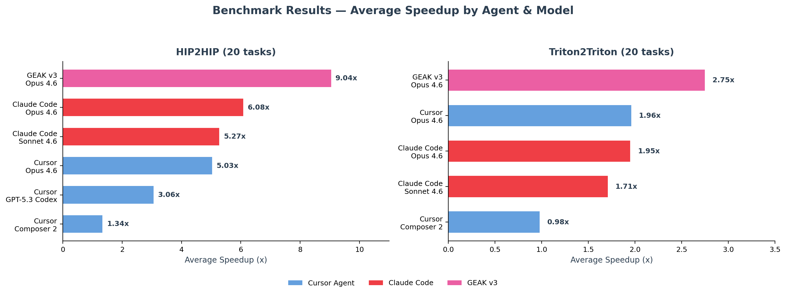
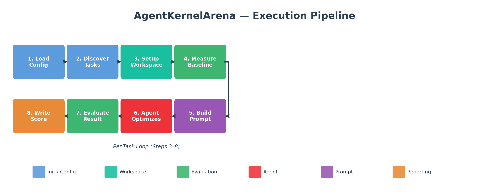
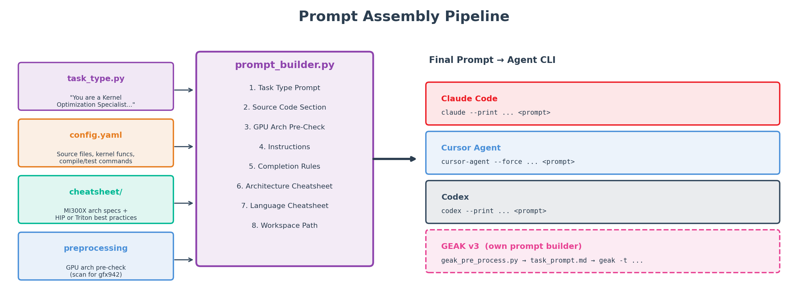
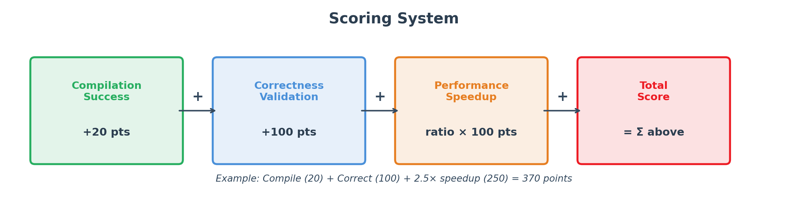
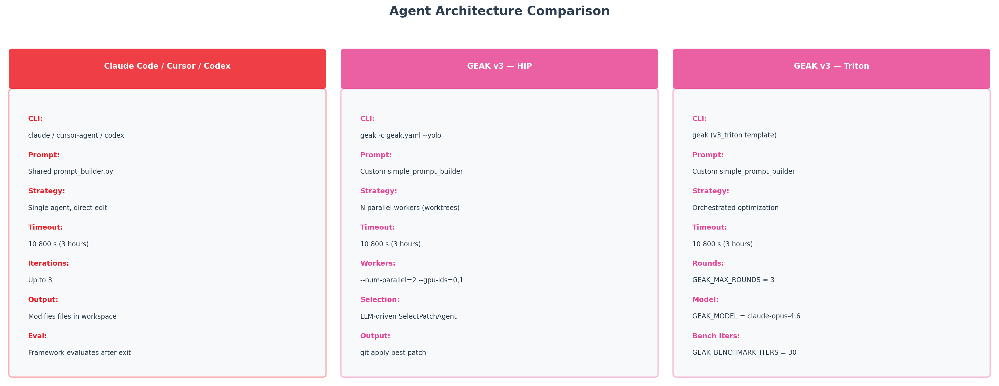

<!---
Copyright (c) 2026 Advanced Micro Devices, Inc. (AMD)

Permission is hereby granted, free of charge, to any person obtaining a copy
of this software and associated documentation files (the "Software"), to deal
in the Software without restriction, including without limitation the rights
to use, copy, modify, merge, publish, distribute, sublicense, and/or sell
copies of the Software, and to permit persons to whom the Software is
furnished to do so, subject to the following conditions:

The above copyright notice and this permission notice shall be included in all
copies or substantial portions of the Software.

THE SOFTWARE IS PROVIDED "AS IS", WITHOUT WARRANTY OF ANY KIND, EXPRESS OR
IMPLIED, INCLUDING BUT NOT LIMITED TO THE WARRANTIES OF MERCHANTABILITY,
FITNESS FOR A PARTICULAR PURPOSE AND NONINFRINGEMENT. IN NO EVENT SHALL THE
AUTHORS OR COPYRIGHT HOLDERS BE LIABLE FOR ANY CLAIM, DAMAGES OR OTHER
LIABILITY, WHETHER IN AN ACTION OF CONTRACT, TORT OR OTHERWISE, ARISING FROM,
OUT OF OR IN CONNECTION WITH THE SOFTWARE OR THE USE OR OTHER DEALINGS IN THE
SOFTWARE.
--->

# AgentKernelArena: Benchmarking AI Coding Agents for GPU Kernel Optimization on AMD Instinct GPUs

AI coding agents such as [Cursor Agent](https://cursor.com/), [Claude Code](https://www.anthropic.com/claude-code), and [OpenAI Codex](https://openai.com/codex/) are improving fast, and people increasingly trust them with specialized, high-stakes work, including GPU kernel optimization. But most of the public evidence is still a cherry-picked demo on a single kernel, not a controlled, head-to-head comparison on the same tasks, the same hardware, and the same scoring rules. On [AMD Instinct™ GPUs](https://www.amd.com/en/products/accelerators/instinct/mi300/mi300x.html), where every percentage point of kernel performance translates directly into training and inference cost, that gap matters.

**AgentKernelArena (AKA)** closes that gap. It is an open-source benchmarking arena, built by AMD, that measures how well AI coding agents perform on real GPU kernel optimization tasks. You drop an agent into AKA — Cursor Agent, Claude Code, Codex, [GEAK](https://github.com/AMD-AGI/GEAK), a single-LLM call, or your own — and the framework runs it in an isolated workspace, on the same task definitions every other agent sees, and scores it through one shared automated pipeline: compile, correctness, performance.

In this blog we walk through how AKA works, how to run it yourself, and what we found when we benchmarked six agent/model configurations on a 44-task subset on AMD Instinct™ MI300X. The lineup includes **GEAKv3**, AMD's in-house GPU kernel optimization agent. If you are new to the GPU side of this problem, the [AMD Instinct™ MI300X](https://www.amd.com/en/products/accelerators/instinct/mi300/mi300x.html) product page and the [AMD ROCm™ documentation](https://rocm.docs.amd.com/) are good starting points, and our [GEAK family blog](https://rocm.blogs.amd.com/artificial-intelligence/geak-agents-family/README.html) covers the agent side in depth.

## Key Takeaways

- **AgentKernelArena is an open-source arena** for benchmarking AI coding agents on GPU kernel optimization on AMD Instinct™ GPUs. It ships with **214 tasks** across four categories: `triton2triton`, `hip2hip`, `torch2hip`, and repository-scale tasks.
- **One unified evaluator scores every agent the same way**: 20 points for compilation, 100 for correctness, and 100× the measured speedup over baseline. Per-test-case metrics, medians, and P25/P75/P90 percentiles come out of the box.
- **We evaluated 6 agent/model configurations on a 44-task subset on MI300X.** On this subset, GEAKv3 recorded average speedups of **9.04×** on 20 HIP2HIP tasks, **2.75×** on 20 Triton2Triton tasks, and **1.20×** on 4 repository-scale rocPRIM tasks — ahead of the other five configurations in every category.
- **Among the frontier general-purpose agents,** Claude Code (Opus 4.6) and Cursor (Opus 4.6) reached 6.08× and 5.03× average speedup on HIP2HIP. Triton2Triton was the most challenging category for every agent we tested.
- **AKA is built for fair, reproducible comparison — and for A/B testing agent-side changes** such as new tools, MCP servers, or prompt tweaks. Timestamped runs and resumable evaluation let you attribute any score change to a real change in the agent.

Figure 1, below, summarizes these results at a glance — the average speedup each agent recorded in each task category.



*Figure 1. AgentKernelArena results at a glance: average speedup over baseline by agent and task category on AMD Instinct™ MI300X, evaluated on a representative subset of 44 tasks.*

## Why a Standardized Arena for Kernel Agents?

GPU kernel optimization is hard for an AI agent. A good kernel agent has to reason about tiling and block sizes, memory coalescing, occupancy, [LDS](https://rocm.docs.amd.com/projects/HIP/en/latest/) usage, asynchronous copies, MFMA/WMMA matrix operations, numerical stability, and correctness on edge-case shapes — often all at once. A flashy result on one kernel tells you very little about how the same agent will handle the next one.

Most public kernel benchmarks today evaluate single LLM calls or fixed-shape correctness, not full agent workflows. They typically do not measure:

- **kernel-to-kernel optimization**, where the agent starts from a working baseline and has to make it faster without breaking correctness;
- **repository-level optimization**, where the agent has to navigate and edit a real upstream codebase;
- **real GPU performance on AMD Instinct™ hardware**, measured under controlled, reproducible conditions;
- **the effect of agent-side machinery** — prompts, tools, MCP servers, planners, profilers — on the final score.

AKA closes exactly these gaps. We built it as an *arena*, not a single benchmark, so the evaluation logic, task definitions, scoring, and reporting all live *outside* the agent. New agents and new tasks plug into the same evaluator and produce comparable scores by construction.

## What Is AgentKernelArena?

AgentKernelArena runs AI coding agents on GPU kernel optimization tasks inside isolated, reproducible workspaces, and scores them with a single, centralized evaluator. Figure 2 shows the end-to-end pipeline.



*Figure 2. AgentKernelArena end-to-end pipeline. Task definitions, cheatsheets, and agent configuration feed into a workspace-setup and baseline-measurement stage. The agent then gets a configurable number of iterations (read → edit → compile → test → profile). Once it finishes, a centralized evaluator — identical for every agent — runs compilation, correctness, and performance measurement, and computes the final score.*

The per-task loop is straightforward:

1. **Pick an agent, a model, and a task.** AKA spins up an isolated workspace, copies in the source kernel and task scripts, and measures the baseline performance.
2. **The agent reads the task and iterates** on the kernel inside its workspace.
3. **The unified evaluator compiles the optimized kernel**, runs the correctness suite across every configured test shape, measures performance with warmup and benchmark iterations, and computes the final score.
4. **AKA writes per-task results**, per-test-case speedup plots, and aggregate reports (CSV, JSON, text) into a timestamped run directory you can compare or resume later.

A key design choice is the separation of *optimization* from *evaluation*: the agent only optimizes the kernel, while the framework owns all measurement. This removes a real fairness problem — otherwise every agent would time execution slightly differently and scores would stop being comparable.

### Supported Agents and Models

AKA ships with first-class integrations for a range of frontier and AMD agents:

- **Cursor Agent** (via the `cursor-agent` CLI)
- **Claude Code** (via the `claude` CLI)
- **OpenAI Codex** (via the `codex` CLI)
- **SWE-agent**
- **GEAKv3**, AMD's in-house GPU kernel optimization agent
- **Single-LLM-call agents** (for clean single-shot baselines)
- **Your own agent**, registered via a single launcher function

You select the model through the agent layer. The runs in this blog use Anthropic Claude Opus 4.6 and Sonnet 4.6, OpenAI GPT-5.3 Codex, and Cursor Composer 2. You can also point AKA at other models through OpenRouter or a [vLLM](https://github.com/vllm-project/vllm) endpoint.

### Task Categories

AKA currently includes 214 task configurations across four categories, listed in Table 1. Together they cover the kinds of GPU kernel work an agent faces in practice — from optimizing existing [Triton](https://triton-lang.org/) and [HIP](https://rocm.docs.amd.com/projects/HIP/) kernels, to translating PyTorch operators, to editing real upstream repositories.

| Category | # Tasks | Description |
|---|---|---|
| `triton2triton` | 148 | Optimize existing Triton kernels (e.g., vLLM, ROCmBench, TritonBench-modified). |
| `hip2hip` | 36 | Optimize HIP kernels (gpumode-style ops, MMCV-style ops). |
| `torch2hip` | 26 | Convert PyTorch operators into optimized HIP kernels. |
| `repository` | 4 | Optimize kernels inside full upstream repositories such as rocPRIM. |

*Table 1. AgentKernelArena task categories and counts.*

### What the Agent Sees: Prompts, Cheatsheets, and Instructions

AKA assembles a structured prompt for every task from the same set of sections, so every agent — frontier or custom — gets the same information in the same shape. As Figure 3 illustrates, the sections cover the task-type role, the source files and target functions, a GPU architecture pre-check, the task-specific optimization instructions, a completion directive, the cheatsheet block, and the workspace path.



*Figure 3. The shared prompt pipeline. Cursor Agent, Claude Code, and Codex all receive the identical prompt for a given task; only the CLI binary, its flags, and the backend model differ.*

Two pieces of this prompt are worth calling out, because they meaningfully change agent behavior:

- **Domain cheatsheets.** Each task type and GPU architecture can attach a verbatim cheatsheet to the prompt: an MI300X architecture guide (CDNA3 topology, memory hierarchy, MFMA instructions), a HIP best-practices document, and a Triton best-practices document. The cheatsheets live in `src/prompts/cheatsheet/` and are selected automatically from `target_gpu_model`. Adding a new GPU architecture is a small change: add an arch entry, drop in a markdown guide, and the prompt picks it up.
- **Task-specific instructions.** Each task's `config.yaml` can override the auto-generated instructions with a `prompt.instructions` field. This is how we tell the agent exactly what to optimize — for example, *"Optimize the Triton `fused_moe_kernel` for maximum GPU throughput; keep the `fused_moe` signature; output must match the reference within `atol=5e-2, rtol=5e-2` for float16."* When omitted, AKA generates instructions automatically from the compile, correctness, and performance commands.

One more deliberate choice: `max_iterations` is delivered as a natural-language directive ("you must iterate up to 3 versions") appended to the prompt, not as a hard cap on tool calls. Agents are free to make as many internal tool calls per version as they need. This keeps the task prompt and iteration directive consistent across different agent runtimes, while allowing each agent to use its native tool-calling workflow.

### Unified Evaluator and Scoring

The unified evaluator does five things:

1. **Compiles** the optimized code with the task's declared compile command (`hipcc` for HIP, Triton for Triton, and so on).
2. **Runs correctness checks** on every configured test shape, not just one.
3. **Measures performance** with configurable warmup and benchmark iterations, computes per-test-case speedup, and aggregates into median, standard deviation, and P25/P75/P90 percentiles.
4. **Produces per-test-case speedup plots** and a structured `task_result.yaml` per task.
5. **Writes run-level reports** (`overall_report.txt`, `overall_summary.csv`, `task_type_breakdown.json`) inside a timestamped `run_{YYYYMMDD_HHMMSS}/` workspace.

Each task contributes to a per-task score, summarized in Table 2:

| Metric | Points | Description |
|---|---|---|
| Compilation | 20 | Code compiles successfully without errors. |
| Correctness | 100 | Code produces correct output across all configured test shapes. |
| Speedup | ratio × 100 | Measured performance improvement over the baseline kernel. |

*Table 2. AgentKernelArena scoring system (default).*

Figure 4, below, visualizes how these three dimensions stack into a single cumulative score.



*Figure 4. The cumulative scoring system rewards each dimension of kernel quality.*

A submission that compiles, passes correctness, and lands a 1.5× speedup scores **270 points** on that task. Correctness is weighted heavily on purpose: a fast but incorrect kernel is useless in practice, while a correct kernel that merely matches the baseline is still a valid replacement. If you prefer a different policy, swap the scoring function — the evaluator stays the same.

## Walk Through AgentKernelArena Yourself

The best way to understand AKA is to run it. In this section we take one real task — the vLLM [Triton](https://triton-lang.org/) RMS-norm kernel — all the way from its baseline to an agent-optimized version, and read the score the evaluator produces. Everything here runs on a single AMD Instinct™ MI300X inside the official ROCm PyTorch container, and every command is copy-paste ready. Follow along in your own terminal as you read.

### Step 0 — Set up the environment

Start the official ROCm PyTorch container, clone the repo, and install the lightweight Python dependencies (PyTorch and Triton already ship in the container):

```bash
# Start the official ROCm PyTorch container on your MI300X host
docker run -it --rm \
  --device /dev/kfd --device /dev/dri \
  --group-add video --ipc host --shm-size 16G \
  rocm/pytorch:rocm7.1.1_ubuntu24.04_py3.12_pytorch_release_2.10.0

# Inside the container
git clone https://github.com/AMD-AGI/AgentKernelArena.git
cd AgentKernelArena
pip install -r requirements.txt
```

AKA launches agents through their official CLIs, so install the one you want to drive and export its API key. We will use [Claude Code](https://www.anthropic.com/claude-code):

```bash
npm install -g @anthropic-ai/claude-code
export ANTHROPIC_API_KEY="your_anthropic_key"
```

### Step 1 — Look at a single task

Every task is a self-contained folder under `tasks/`. Open the RMS-norm task and you will find three files that fully define it:

```text
tasks/triton2triton/vllm/triton_rms_norm/
├── source/triton_rms_norm.py     # the baseline kernel the agent will optimize
├── scripts/task_runner.py        # how the kernel is compiled, checked, and timed
└── config.yaml                   # what the agent is told, and which commands to run
```

The **source file** holds the starting kernel — a straightforward, correct, two-pass Triton RMS norm. This is the agent's "before":

```python
@triton.jit
def _rms_norm_kernel(input_ptr, weight_ptr, output_ptr, ...):
    # Pass 1: accumulate sum of squares in float32
    # Pass 2: normalize and apply weight
    ...
```

The **task runner** is the contract for "is this kernel correct and how fast is it." It defines the test shapes and the timing protocol, so every agent is measured the same way — note the five input shapes, the float32 reference, and the warmup/benchmark iteration counts:

```python
TEST_SHAPES = [(32, 128), (64, 512), (128, 1024), (256, 2048), (512, 4096)]
WARMUP_ITERATIONS = 10
BENCHMARK_ITERATIONS = 100
# correctness checks torch.allclose(result, ref, atol=1e-2, rtol=1e-2)
```

The **task config** is what ties it together — the kernel symbol to optimize, the compile/correctness/performance commands, and the natural-language `instructions` the agent actually reads:

```yaml
target_kernel_functions:
  - _rms_norm_kernel
compile_command:
  - python3 scripts/task_runner.py compile
correctness_command:
  - python3 scripts/task_runner.py correctness
performance_command:
  - python3 scripts/task_runner.py performance
task_type: triton2triton
prompt:
  instructions: |
    Optimize the Triton RMS normalization kernel `_rms_norm_kernel` for maximum
    GPU throughput while maintaining numerical correctness.
    ...
    Constraints:
    - Must maintain the same function signature for `rms_norm`
    - Output must match reference within atol=1e-2, rtol=1e-2 for float16
```

Before any agent touches the kernel, you can run the exact same measurement the framework uses to establish the baseline. From the task directory:

```bash
cd tasks/triton2triton/vllm/triton_rms_norm
python3 scripts/task_runner.py compile
python3 scripts/task_runner.py correctness
python3 scripts/task_runner.py performance
```

You will see the baseline compile, pass correctness on all five shapes, and report a per-shape execution time. That time is the denominator of every speedup AKA will report. Now let's hand the kernel to an agent.

### Step 2 — Run an agent on the task

Drive the whole framework from a single `config.yaml` at the repository root. A minimal config that points one agent at our one task looks like this:

```yaml
agent:
  template: claude_code        # or: cursor, codex, geak_optimagentv2, single_llm_call, ...
tasks:
  - triton2triton/vllm/triton_rms_norm
  # - triton2triton/vllm/*     # run every Triton kernel under vllm
  # - all                      # run every task in the suite
target_gpu_model: MI300        # maps to the gfx942 architecture
log_directory: logs
workspace_directory_prefix: workspace
```

Per-agent runtime settings — the backing model, the iteration budget, and the timeout — live in `agents/<agent>/agent_config.yaml`. For Claude Code, `agents/claude_code/agent_config.yaml` sets `model: claude-opus-4-6`, `max_iterations: 3`, and `timeout_seconds: 3600`. Change those to swap the model or the budget without touching anything else.

With the config and your key in place, a full run is one command:

```bash
python main.py
```

Here is what AKA does for you: it spins up an isolated, timestamped workspace, copies the task into it, measures the baseline, hands the kernel to Claude Code with the shared prompt, lets the agent iterate, and then runs the centralized evaluator on whatever the agent produced. You will see the agent's output stream live in your terminal.

### Step 3 — Read the results and the score

Each run lands in its own timestamped directory, so no run ever overwrites another:

```text
workspace_MI300_claude_code/run_<timestamp>/
├── triton2triton_vllm_triton_rms_norm_<timestamp>/
│   ├── source/triton_rms_norm.py   # the agent's optimized kernel
│   └── task_result.yaml            # per-task verdict and timings
└── reports/
    ├── overall_report.txt          # human-readable summary
    ├── overall_summary.csv         # per-task scores and speedups
    └── task_type_breakdown.json    # aggregate stats by task type
```

Open `task_result.yaml` to see exactly how the task scored:

```yaml
task_name: triton2triton/vllm/triton_rms_norm
pass_compilation: true
pass_correctness: true
base_execution_time: ...        # baseline ms (averaged across shapes)
best_optimized_execution_time: ...   # optimized ms
speedup_ratio: ...              # base / optimized
```

Plug those into the scoring rule from Table 2 — 20 points for compiling, 100 for correctness, and `speedup × 100` for performance — and you have the task's score, the same number that lands in `overall_summary.csv`. `diff` the agent's `source/triton_rms_norm.py` against the original to see exactly what it changed (block-size tuning, fused passes, vectorized loads). That is the full loop: one task, one agent, one reproducible score.

To pause and continue a long evaluation, pass `--resume-latest` or `--resume-run run_YYYYMMDD_HHMMSS`. Because the evaluator lives outside the agent, any score you produce is reproducible by anyone running the same config on the same hardware.

### Bring Your Own Task or Agent

AKA is designed so that adding to the arena is cheap. **A new task** is just a folder with a `config.yaml` (source files, the kernel symbol to optimize, and compile/correctness/performance commands) plus a `scripts/task_runner.py`. Every new task must first pass our **task validator agent**, which runs 10 automatic sanity checks — schema, kernel symbol resolution, compile/correctness/performance, GPU hang detection, and report-template compatibility — before it can be merged:

```yaml
# config.yaml at the repo root
agent:
  template: task_validator
tasks:
  - triton2triton/vllm/my_new_task
```

```bash
python main.py   # writes validation_report.yaml into the workspace
```

**A new agent** plugs in through one launcher function and a registry entry. Implement `launch_agent`, decorate it with `@register_agent`, and add it to the `AgentType` enum so AKA can find it:

```python
# agents/your_agent/launch_agent.py
from agents import register_agent

@register_agent("your_agent")
def launch_agent(eval_config: dict, task_config_dir: str, workspace: str) -> str:
    """Build the prompt, run your agent inside `workspace`, and return its output.
    The framework owns all measurement — your agent only edits the kernel."""
    ...
    return agent_output
```

Add a matching entry to the `AgentType` enum and its import in `src/module_registration.py`, point `config.yaml` at `template: your_agent`, and your agent is scored by the exact same evaluator as every other agent in the arena. Figure 5 contrasts the two agent shapes the arena hosts today: the single-agent loop used by the frontier CLIs, and GEAKv3's parallel sub-agents with a patch-selection step.



*Figure 5. Agent architecture comparison: single-agent designs (Claude Code, Cursor, Codex) versus GEAKv3's parallel sub-agents with patch selection.*

## Benchmarking Setup

For this initial release, we picked **44 representative tasks** that span the major task types and a range of difficulty levels. We ran every configuration on AMD Instinct™ MI300X with identical task definitions, prompts, and the unified evaluator. Every agent ran with the same compute budget: a 3600-second per-task timeout and `max_iterations` set to 3. We evaluated six configurations:

- GEAKv3 with Claude Opus 4.6
- Cursor Agent with Claude Opus 4.6
- Cursor Agent with GPT-5.3 Codex
- Cursor Agent with Composer 2
- Claude Code with Claude Opus 4.6
- Claude Code with Claude Sonnet 4.6

One caveat matters for reading these results fairly. The general-purpose coding agents — Cursor Agent, Claude Code, and Codex — all run through the same harness, receive the identical task prompt, and share the same iteration budget, so the differences between them come down to each agent's own orchestration and its backing model. GEAKv3 is not a general coding agent: it is a dedicated GPU kernel-optimization agent with a more involved architecture — parallel sub-agents that explore different optimizations, plus a patch-selection step — so it brings domain-specific machinery the others do not. We report all of them side by side because that is the comparison AKA is built to make, but GEAKv3's design is meaningfully different from the single-agent loop the frontier agents use. Note too that the frontier agents are moving targets: their CLIs may change their internal tool use, orchestration, or default model over time, so the same configuration can produce different numbers on a later run.

The 44 tasks break down as: **20 HIP2HIP** tasks (gpumode-style attention, MLP, normalization, activation, and loss kernels), **20 Triton2Triton** tasks (drawn from vLLM and ROCmBench), and **4 repository-scale rocPRIM** tasks (L3 difficulty).

### System Configuration

We ran every experiment inside the official ROCm PyTorch container on AMD Instinct™ MI300X. Table 3 lists the exact hardware and software versions.

| Component | Specification |
|---|---|
| GPU | AMD Instinct™ MI300X (192 GB HBM3) |
| ROCm | 7.1.1 |
| Docker image | `rocm/pytorch:rocm7.1.1_ubuntu24.04_py3.12_pytorch_release_2.10.0` |
| Host OS | Ubuntu 24.04 |
| Python | 3.12 |
| PyTorch | 2.10.0 (ROCm) |
| Triton | 3.6.0 |
| Per-task timeout | 3600 s |
| `max_iterations` | 3 |

*Table 3. Hardware and software configuration used for all benchmarks.*

## Results

> **Scope.** These results are a *controlled comparison*, not a peak-performance benchmark. Every configuration ran the same 44 tasks under one fixed recipe — identical task definitions and prompts, the same 3600 s per-task timeout, `max_iterations=3`, and one shared evaluator — with no per-agent or per-model tuning. Read the *relative* differences between configurations rather than the absolute speedup magnitudes: the numbers are a floor with tuning headroom, not a ceiling, and they reflect this 44-task subset on AMD Instinct™ MI300X. They are also a snapshot in time — the frontier agent CLIs and their backing models change frequently, and an agent may alter its internal orchestration, tool calls, or default model between releases, so re-running the same configuration later can produce different numbers.

### HIP2HIP — 20 Selected Kernels

HIP2HIP tasks ask each agent to take an existing, correct HIP kernel and meaningfully optimize it on MI300X, subject to correctness checks on multiple input shapes.

**The 20 kernels — from GPU Mode:** CrossEntropyLossLabelSmoothing, Feedforward, FusedLeakyReLU, GateGRUSelectionLayer, Gather, GELU, InnerProd, ItemQueryAttention, KDLoss, layer_normalization, MaskedLanguageModel, MLP_model, MultiHeadAttention, NormalAttention_dot, NormalAttention_embedded_gaussian, PositionEmbedder, Sigmoid, and SiLU. **From other HIP sources:** assign_score_withk and ball_query.

Table 4 reports the per-agent results on these 20 kernels.

| Agent (Model) | Compile % | Correct % | Speedup>1 % | Avg Speedup | Median | P25 / P75 / P90 | Avg Score |
|---|---|---|---|---|---|---|---|
| Cursor (Composer 2) | 100% | 100% | 65% | 1.34× | 1.02× | 1.00 / 1.75 / 2.17× | 254.34 |
| Cursor (Claude Opus 4.6) | 100% | 100% | 100% | 5.03× | 1.99× | 1.21 / 4.20 / 20.57× | 623.05 |
| Cursor (GPT-5.3 Codex) | 100% | 100% | 90% | 3.06× | 1.33× | 1.02 / 2.24 / 10.37× | 426.02 |
| Claude Code (Sonnet 4.6) | 100% | 100% | 95% | 5.27× | 2.85× | 1.04 / 6.46 / 17.99× | 647.12 |
| Claude Code (Opus 4.6) | 100% | 100% | 95% | 6.08× | 3.05× | 1.38 / 8.44 / 18.53× | 727.99 |
| **GEAKv3 (Opus 4.6)** | 100% | 100% | 95% | **9.04×** | 3.03× | 1.24 / 10.15 / 38.81× | **1023.93** |

*Table 4. HIP2HIP results on 20 selected kernels (AMD Instinct™ MI300X).*

Every agent/model we tested compiles and passes correctness on every HIP2HIP task. On this selected subset, frontier general-purpose agents were very reliable at producing code that passed AKA’s configured correctness checks. Where they differ is performance. On this subset, GEAKv3 with Claude Opus 4.6 recorded a 9.04× average speedup and a long upper tail (P90 of 38.81×). Among the general-purpose agents, Claude Code (Opus 4.6) recorded 6.08×, with Claude Code (Sonnet 4.6) at 5.27× and Cursor (Opus 4.6) at 5.03×. The lighter-weight models recorded smaller gains: Cursor (Composer 2) reached 1.34× and improved on the baseline for 65% of tasks.

### Triton2Triton — 20 Selected Kernels

Triton-to-Triton optimization is harder than HIP-to-HIP. The Triton search space is narrower — block sizes, `num_warps`, `num_stages`, autotune configs, masking strategies, fused-vs-split passes — and many reference kernels are already reasonably well-tuned.

**The 20 kernels — from vLLM:** triton_awq_dequantize, triton_awq_gemm, triton_batched_moe, triton_flash_prefill_attention, triton_fused_moe, triton_layernorm_gated, triton_matmul_persistent, triton_rms_norm, triton_scaled_mm, and triton_topk_log_softmax. **From ROCmBench:** test_add_kernel, test_batched_vecmat, test_block_copy, test_kernel_dot, layernorm, naive_softmax, rmsnorm_fwd, softmax, gemm, and moe_gemm.

The results for these kernels are shown in Table 5.

| Agent (Model) | Compile % | Correct % | Speedup>1 % | Avg Speedup | Median | P25 / P75 / P90 | Avg Score |
|---|---|---|---|---|---|---|---|
| Cursor (Composer 2) | 100% | 100% | 40% | 0.98× | 0.99× | 0.91 / 1.03 / 1.10× | 217.76 |
| Cursor (Claude Opus 4.6) | 100% | 95% | 90% | 1.96× | 1.05× | 1.03 / 1.20 / 1.31× | 300.97 |
| Cursor (GPT-5.3 Codex) | 100% | 100% | 65% | 0.99× | 1.00× | 0.95 / 1.03 / 1.09× | 219.19 |
| Claude Code (Sonnet 4.6) | 100% | 100% | 80% | 1.71× | 1.03× | 1.00 / 1.15 / 2.81× | 290.74 |
| Claude Code (Opus 4.6) | 100% | 100% | 70% | 1.95× | 1.04× | 0.99 / 1.24 / 2.71× | 314.63 |
| **GEAKv3 (Opus 4.6)** | 100% | 100% | 80% | **2.75×** | **1.31×** | 1.09 / 2.04 / 6.81× | **395.27** |

*Table 5. Triton2Triton results on 20 selected kernels (AMD Instinct™ MI300X).*

On Triton2Triton the gap between agents narrows. GEAKv3 recorded a 2.75× average and a 1.31× median in this subset. Because GEAKv3's *median* is well above 1, these gains look broad rather than driven by a single outlier kernel. Claude Code (Opus 4.6) and Cursor (Opus 4.6) recorded very similar averages (1.95× and 1.96×) but lower medians (~1.04×), which points to a heavier-tailed distribution — most of their gains come from a few kernels. Composer 2 and GPT-5.3 Codex through Cursor stayed near 1.0× on average on most Triton kernels in this subset.

### Repository-Scale — 4 L3 rocPRIM Tasks

Repository-scale tasks are the most realistic and the most demanding. The agent works inside a full upstream repository ([rocPRIM](https://github.com/ROCm/rocPRIM)) and has to locate, edit, and verify the relevant kernels without breaking the build or the correctness suite.

**The 4 rocPRIM kernels:** block_radix_rank, device_binary_search, device_merge_sort, and device_search_n.

Table 6 summarizes how each agent fared on these repository-scale tasks.

| Agent (Model) | Compile % | Correct % | Speedup>1 % | Avg Speedup | Median | P25 / P75 / P90 | Avg Score |
|---|---|---|---|---|---|---|---|
| Cursor (Composer 2) | 100% | 100% | 50% | 0.95× | 1.04× | 0.68 / 1.14 / 1.20× | 215.24 |
| Cursor (Claude Opus 4.6) | 100% | 100% | 75% | 1.08× | 1.06× | 1.01 / 1.16 / 1.25× | 227.91 |
| Cursor (GPT-5.3 Codex) | 100% | 100% | 50% | 1.06× | 1.04× | 1.00 / 1.13 / 1.19× | 225.58 |
| Claude Code (Opus 4.6) | 100% | 100% | 100% | 1.15× | 1.11× | 1.04 / 1.29 / 1.45× | 234.62 |
| **GEAKv3 (Opus 4.6)** | 100% | 100% | 100% | **1.20×** | **1.17×** | 1.10 / 1.33 / 1.43× | **239.67** |

*Table 6. Repository-scale results on 4 L3 rocPRIM tasks (AMD Instinct™ MI300X).*

Every agent compiles and passes correctness on rocPRIM, but the speedups are smaller than on HIP2HIP. rocPRIM is already a heavily tuned production library, so the headroom for further optimization is naturally limited. GEAKv3 recorded a 1.20× average with a 100% Speedup>1 rate, and Claude Code (Opus 4.6) recorded 1.15× (also 100% Speedup>1). The takeaway: on real upstream code, both model capability and kernel-specific specialization matter — but neither one buys you double-digit speedups.

### The Overall Picture

Table 7 brings the three categories together, listing each configuration's average speedup side by side.

| Agent (Model) | HIP2HIP (20) | Triton2Triton (20) | Repo rocPRIM (4 L3) |
|---|---|---|---|
| GEAKv3 (Opus 4.6) | **9.04×** | **2.75×** | **1.20×** |
| Claude Code (Opus 4.6) | 6.08× | 1.95× | 1.15× |
| Cursor (Opus 4.6) | 5.03× | 1.96× | 1.08× |
| Cursor (GPT-5.3 Codex) | 3.06× | 0.99× | 1.06× |
| Cursor (Composer 2) | 1.34× | 0.98× | 0.95× |

*Table 7. Average speedup by category on the selected 44-task subset (AMD Instinct™ MI300X).*

Three patterns stand out across the three categories:

- **GEAKv3 recorded higher average speedups than the other configurations in every category** on this subset, by the widest margin on HIP2HIP.
- **HIP2HIP showed the largest speedups of the three categories**, suggesting that iterative agent workflows can uncover substantial kernel-level optimizations on this subset.
- **Model choice has a consistent effect.** Switching from Opus 4.6 to Composer 2 inside the same Cursor agent moved the HIP2HIP average from 5.03× to 1.34× and pushed Triton2Triton and rocPRIM below 1×.

## Discussion

These initial results match what we see when we work with these agents day to day. Frontier general-purpose agents are now very reliable at producing *correct* GPU code — compilation and correctness rates are at or near 100% across almost every cell of our tables. What separates them is whether they can find non-trivial *performance* improvements: restructuring the kernel (grid layout, tiling, fused-vs-split passes), tuning launch parameters for the target architecture, and avoiding common anti-patterns.

GEAKv3 is AMD's in-house agent, designed specifically for GPU kernel optimization. On this subset it recorded higher average speedups than the other configurations on HIP2HIP and Triton2Triton. We read this as one data point — on a small, fixed task set — that a domain-specific agent can be competitive with frontier general-purpose agents on kernel tasks, not as a general ranking. A larger task set and more runs per configuration would be needed to draw stronger conclusions, and that is exactly the kind of comparison AKA is built to support.

One thing to be clear about: **AKA is not a final leaderboard, and these results are not a verdict on any single agent.** AKA is an arena. Anyone running the same config on the same hardware can reproduce these scores. Any change in score should map back to a concrete change in the agent — a different model, prompt, tool, or orchestration pattern. That is exactly what makes AKA useful as an A/B testing harness for agent improvements.

## Summary

In this blog you learned what AgentKernelArena is and why it matters, how its unified pipeline separates optimization from evaluation to keep every agent's score comparable (Figure 2), and how its cumulative scoring rewards compilation, correctness, and measured speedup (Table 2, Figure 4). You walked through a complete run on the vLLM Triton RMS-norm kernel end to end — from baseline measurement to reading the final score — and saw how to bring your own task or agent into the arena. And you saw what we found when we benchmarked six agent/model configurations across HIP2HIP, Triton2Triton, and repository-scale rocPRIM tasks on AMD Instinct™ MI300X (Tables 4–7, Figure 1).

To recap the headline numbers: AgentKernelArena puts AI coding agents for GPU kernel optimization on a common, reproducible footing. It decouples the agent from the evaluator, supports heterogeneous launchers and models, and reports unified scores with per-test-case detail — enabling fair comparisons that were previously hard to make. On the 44-task subset we evaluated here, GEAKv3 recorded higher average speedups than the other configurations on HIP2HIP (9.04×), Triton2Triton (2.75×), and repository-scale rocPRIM (1.20×); among the general-purpose coding agents we tested, Claude Code (Opus 4.6) and Cursor (Opus 4.6) recorded the largest speedups.

Try AKA. Run your own agent against the same tasks, contribute new tasks, or propose a new scoring policy. The arena is built to grow, and this release is just the starting line: in upcoming work we plan to expand to other task types, add more agents and models, broaden coverage to additional AMD Instinct™ hardware targets, and publish deeper A/B studies on how agent-side changes — new tools, MCP servers, planners, and prompt strategies — move the score. Check the GitHub repository for the latest tasks and results. The framework is open-source and actively maintained — we believe rigorous, domain-specific benchmarks like AgentKernelArena are essential for driving genuine progress in AI-assisted GPU programming.

## Additional Resources

- AgentKernelArena GitHub repository: <https://github.com/AMD-AGI/AgentKernelArena>
- GEAK GitHub repository: <https://github.com/AMD-AGI/GEAK>
- GEAK family blog: <https://rocm.blogs.amd.com/artificial-intelligence/geak-agents-family/README.html>
- AMD Instinct™ MI300X: <https://www.amd.com/en/products/accelerators/instinct/mi300/mi300x.html>
- AMD ROCm™ documentation: <https://rocm.docs.amd.com/>
- HIP programming guide: <https://rocm.docs.amd.com/projects/HIP/en/latest/>
- ROCm workload tuning guide: <https://rocm.docs.amd.com/en/latest/how-to/rocm-for-ai/inference-optimization/workload.html>
- rocprof-compute (profiler): <https://github.com/ROCm/rocm-systems/tree/develop/projects/rocprofiler-compute>
- Triton language: <https://triton-lang.org/>
- rocPRIM: <https://github.com/ROCm/rocPRIM>
- ROCm Blogs: <https://rocm.blogs.amd.com/>

## Bias, Risks, and Limitations

- AI coding agents may generate kernels that are incorrect, unsafe, or that contain subtle numerical issues. AgentKernelArena's correctness gate reduces but does not eliminate this risk; users must conduct their own evaluation and validation before deploying any generated kernel.
- The results in this blog are based on a 44-task subset and a fixed compute budget. They illustrate the framework and should not be read as a definitive ranking of any agent or model.

## License

The AgentKernelArena code is released under the Apache 2.0 license.

## Acknowledgements

This work was made possible thanks to the contributions of Parsa Fashi, Ji Liu, Yue Liu, Yuchen Yang, Hao Li, Ziqiong Liu, Saptarshi Majumder, Subrahmanya Pavankumar Dubagunta, Pratik Prabhanjan Brahma, Dong Li, Arsalan Farooq.

## Disclaimers

The information presented in this document is for informational purposes only and may contain technical inaccuracies, omissions, and typographical errors. The information contained herein is subject to change and may be rendered inaccurate for many reasons, including but not limited to product and roadmap changes, component and motherboard version changes, new model and/or product releases, product differences between differing manufacturers, software changes, BIOS flashes, firmware upgrades, or the like. Any computer system has risks of security vulnerabilities that cannot be completely prevented or mitigated. AMD assumes no obligation to update or otherwise correct or revise this information.
However, AMD reserves the right to revise this information and to make changes from time to time to the content hereof without obligation of AMD to notify any person of such revisions or changes.
THIS INFORMATION IS PROVIDED ‘AS IS.” AMD MAKES NO REPRESENTATIONS OR WARRANTIES WITH RESPECT TO THE CONTENTS HEREOF AND ASSUMES NO RESPONSIBILITY FOR ANY INACCURACIES, ERRORS, OR OMISSIONS THAT MAY APPEAR IN THIS INFORMATION. AMD SPECIFICALLY DISCLAIMS ANY IMPLIED WARRANTIES OF NON-INFRINGEMENT, MERCHANTABILITY, OR FITNESS FOR ANY PARTICULAR PURPOSE. IN NO EVENT WILL AMD BE LIABLE TO ANY PERSON FOR ANY RELIANCE, DIRECT, INDIRECT, SPECIAL, OR OTHER CONSEQUENTIAL DAMAGES ARISING FROM THE USE OF ANY INFORMATION CONTAINED HEREIN, EVEN IF AMD IS EXPRESSLY ADVISED OF THE POSSIBILITY OF SUCH DAMAGES.
AMD, the AMD Arrow logo, AMD CDNA, AMD Instinct, AMD ROCm, and combinations thereof are trademarks of Advanced Micro Devices, Inc. PyTorch is a registered trademark of Meta Platforms, Inc. Other product names used in this publication are for identification purposes only and may be trademarks of their respective companies.
© 2026 Advanced Micro Devices, Inc. All rights reserved
