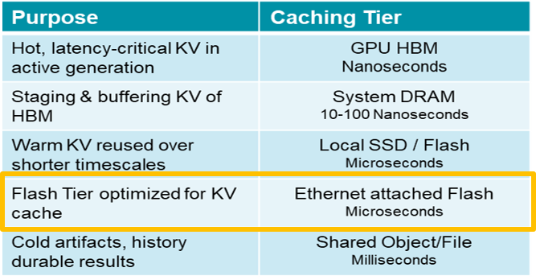
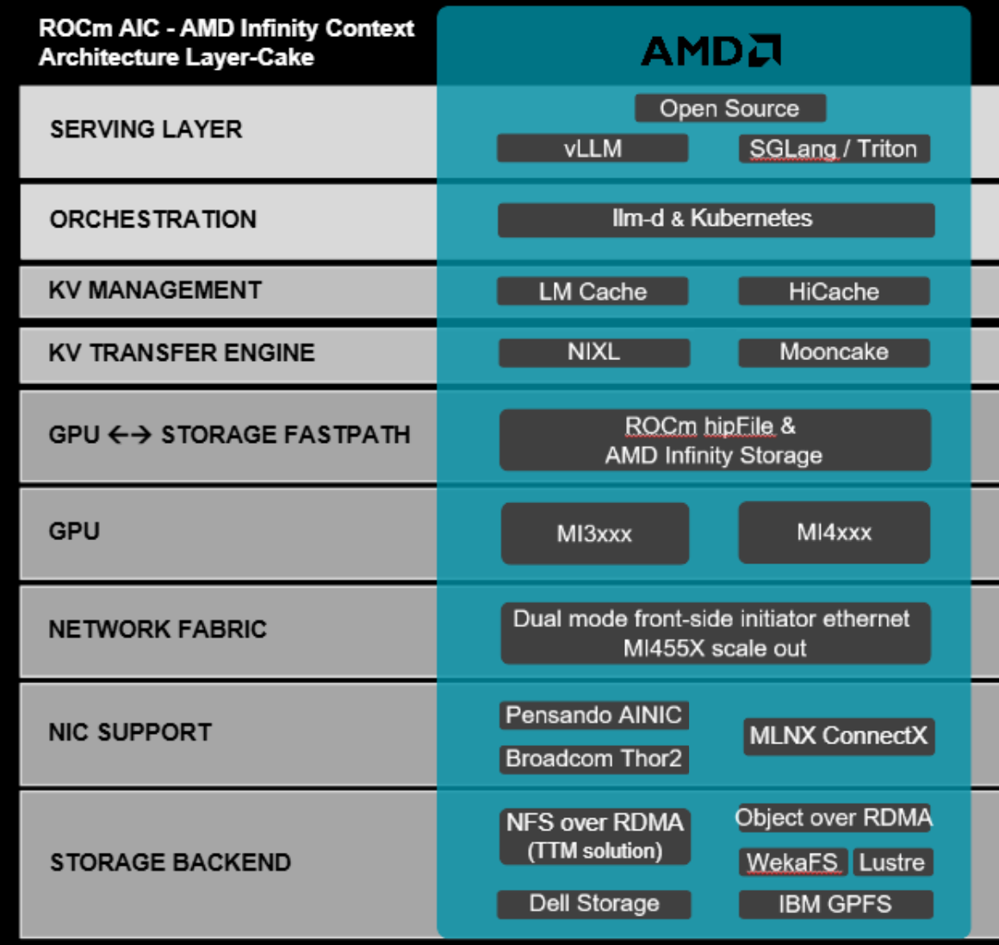

<!---
Copyright (c) 2026 Advanced Micro Devices, Inc. (AMD)

Permission is hereby granted, free of charge, to any person obtaining a copy
of this software and associated documentation files (the "Software"), to deal
in the Software without restriction, including without limitation the rights
to use, copy, modify, merge, publish, distribute, sublicense, and/or sell
copies of the Software, and to permit persons to whom the Software is
furnished to do so, subject to the following conditions:

The above copyright notice and this permission notice shall be included in all
copies or substantial portions of the Software.

THE SOFTWARE IS PROVIDED "AS IS", WITHOUT WARRANTY OF ANY KIND, EXPRESS OR
IMPLIED, INCLUDING BUT NOT LIMITED TO THE WARRANTIES OF MERCHANTABILITY,
FITNESS FOR A PARTICULAR PURPOSE AND NONINFRINGEMENT. IN NO EVENT SHALL THE
AUTHORS OR COPYRIGHT HOLDERS BE LIABLE FOR ANY CLAIM, DAMAGES OR OTHER
LIABILITY, WHETHER IN AN ACTION OF CONTRACT, TORT OR OTHERWISE, ARISING FROM,
OUT OF OR IN CONNECTION WITH THE SOFTWARE OR THE USE OR OTHER DEALINGS IN THE
SOFTWARE.
--->

# Introducing ROCm™ AMD Infinity Context: A Purpose-Built KV Cache Tier for Distributed Inference

In this blog, you will learn how **ROCm™ AMD Infinity Context (ROCm AIC)** addresses one of the fastest-growing bottlenecks in production AI systems: key-value (KV) cache management. You will explore the problem, the solution, the components that make up the stack, and how ROCm AIC works with existing AMD Instinct™ GPU deployments.

As AI models grow larger and inference workloads become more complex, long-context requests, agentic workflows, and multi-turn conversations generate KV caches that no longer fit comfortably in GPU High-Bandwidth Memory (HBM). Teams today face three inadequate options: expensive recomputation, node-bound local NVMe (Non-Volatile Memory Express) storage, or slow general-purpose network file systems. None of these solutions were built for the demands of modern inference.

Today, AMD introduces **ROCm AIC** as a purpose-built, open, AI-native KV cache storage tier for distributed inference on AMD Instinct™ GPUs. Support begins with the Instinct MI300X Series and MI350 Series and extends to the MI450 Series / Helios platform.

## The Problem: KV Cache Is Becoming the Bottleneck

When an LLM processes a prompt, it generates a KV cache that represents the internal state for every token in the input. This cache is needed repeatedly during decoding and can be reused across similar requests. For short prompts on a single node, keeping the KV cache in GPU HBM works fine. But modern inference is changing fast:

- **Context windows are growing significantly per generation.**  Models like GPT-OSS-120B and Qwen3 (235B) now support 128K–1M token contexts, and Meta's [Llama 4 Scout](https://ai.meta.com/blog/llama-4-multimodal-intelligence/) pushes another 10x beyond that, to 10 million tokens. Even a single 1M-token request can generate over 600 GB of KV data, more than the HBM capacity of an entire MI455X node.

- **Agentic AI demands cross-session KV reuse.** AI agents replay long prompt histories on every turn. Without KV caching across turns, every step pays the full prefill cost (the initial computation required to process all input tokens and generate the KV cache). At 100k tokens, the compute cost grows explosively with context length, consuming trillions of FLOPs per turn on a GPU running over 1000W.

- **Local NVMe is node-bound.** The common workaround of offloading KV cache to local NVMe via host CPU and RAM works on a single node, but KV blocks cannot be efficiently shared across GPU nodes. This limits the value of local NVMe storage as a caching tier for frameworks like LMCache when used for multi-node, shared-context workloads such as RAG (Retrieval-Augmented Generation) pipelines, agentic loops, and multi-tenant chat services.

The scale of the problem translates directly to real costs. At the time of the writing, this blog, HBM3e costs approximately $50/GB at the system level.[^kv-cost] Wasting HBM on cold KV cache is one of the largest cost inefficiencies in inference deployments today. Recomputing KV cache wastes GPU compute that could be serving new requests.

[^kv-cost]: Source of memory cost and calculation of GPU-burdened cost usable for KV, based on AMD internal calculations.

## ROCm AIC: What It Is

**ROCm™ AMD Infinity Context (ROCm AIC)** is a combination of software and hardware that leverages low-latency, RDMA (Remote Direct Memory Access)-capable network attached storage as an intelligent caching tier for KV cache prefill data in distributed inference workloads.

ROCm AIC provides an additional tier that sits below GPU HBM and CPU DRAM in the KV cache hierarchy:

The key innovation in ROCm AIC is making the network-attached tier fast enough for production inference. ROCm AIC achieves this by combining AMD hardware with open-source inference frameworks to move data directly from network-attached storage into GPU HBM, bypassing the CPU memory bus entirely.

ROCm AIC is applicable to:

- **AMD Instinct MI300X Series and MI350 Series GPUs** via front-side Ethernet network attach
- **AMD Instinct MI450 Series / Helios** via front-side Ethernet or high-bandwidth MI455X Scale-Out network

## The ROCm AIC Software Stack

ROCm AIC is designed with an **upstream-first, open-source philosophy**. There is no proprietary software layer. Every component is either an existing AMD asset, an open-source framework, or an open standard. This means ROCm AIC integrations are portable and compatible with the inference ecosystem you are already using.

The stack is organized into the following layers. *For each layer, the framework listed first is supported in the initial release; additional frameworks will follow.*

### Orchestration: llm-d + Kubernetes

**llm-d** handles inference orchestration, routing requests to the right model replica, deciding on prefill vs. decode worker placement, and managing KV cache locality so that requests are directed to replicas that already hold the relevant cached KV blocks. Kubernetes provides the deployment plane for containerized inference clusters.

### Serving Layer: vLLM, with SGLang to follow

ROCm AIC launches with **vLLM** as its primary serving framework, one of the most widely adopted open-source LLM inference engines available today. SGLang and Triton support follow in subsequent phases.

### KV Management: LMCache, with HiCache to follow

**LMCache** is the KV block manager. It decides which KV blocks live in GPU HBM, which are evicted to CPU DRAM, and which are offloaded to the remote storage tier. LMCache tracks block identifiers, handles prefix-aware caching, and orchestrates reuse across requests and across nodes. AMD contributes the ROCm AIC integration directly upstream to LMCache, with no proprietary fork required.

### KV Transfer Engine: NIXL, with Mooncake to follow

**NIXL** (NVIDIA Inference Transfer Engine) is a high-performance, RDMA-capable transfer engine for moving KV blocks between GPU memory and the storage tier. NIXL is open-source and AMD co-maintains it. It supports standard file-based NVMe paths as well as AMD Infinity Storage (AIS) object store paths. NIXL also enables cross-node KV migration, which allows KV cache blocks to move between GPU nodes. This is a key requirement for prefill/decode disaggregation, where the prefill and decode phases of inference run on separate hardware to improve overall throughput.

### GPU to Storage Fast Path: ROCm hipFile + AMD Infinity Storage

**ROCm [hipFile](https://rocm.docs.amd.com/projects/hipFile/en/latest/)** is AMD's file I/O library. It enables data transfers directly between GPU HBM and storage, bypassing the host CPU memory bus. hipFile reached GA with [ROCm 7.14](https://rocm.blogs.amd.com/ecosystems-and-partners/rocm-7.14-blog/README.html) (July 2026) and is the critical AMD asset that makes the remote KV tier practical in production. **AIS** is the umbrella for hipFile and future libraries, including hipObject for object store support, to provide optimized, GPU-aware I/O management across local and networked storage backends.

### Network Fabric: Dual-Mode Attach

ROCm AIC uniquely supports two network attach modes:

- **Front-side Ethernet** uses standard Ethernet infrastructure, supported on all AMD Instinct MI300 Series, MI350 Series, and MI400 Series GPU platforms. A key benefit is compatibility with existing GPU cluster deployments.
- **AMD Instinct MI400 Series Scale-Out Network** serves MI455X / Helios deployments requiring maximum storage bandwidth. It connects directly to the GPU scale-out fabric or can be used to create a dedicated context storage network, enabled by 800GbE AMD Pensando AI-NICs.

### NIC Support: Pensando AI-NIC, Broadcom Thor2, Mellanox ConnectX

ROCm AIC supports multiple RDMA-capable NICs:

- **AMD Pensando AI-NIC** primary NIC with RDMA acceleration for NFS over RDMA paths
- **Broadcom BCM57608 (Thor2)** alternative NIC for broader deployment compatibility
- **Mellanox ConnectX** planned support for broader ecosystem reach

There is no requirement to adopt a specific SmartNIC. ROCm AIC works with existing RDMA-capable NIC deployments.

### Storage Backend: NFS over RDMA, with Object over RDMA, WekaFS, Lustre, and IBM GPFS to follow

The initial storage backend is **NFS (Network File System) over RDMA**, an open standard that enables high-performance access to networked file storage without buffering data through CPU memory. Storage vendors including VAST, Dell PowerScale (formerly Isilon), and NetApp support this standard. This means you can use your existing NAS/NFS storage infrastructure as the KV cache tier, as long as it is RDMA-capable. Later phases expand to object over RDMA, WekaFS, Lustre, and IBM GPFS for broader storage ecosystem support.

## Architecture: How It Flows

Here is how a KV cache offload request flows through the ROCm AIC stack:

1. **vLLM** receives an inference request and begins prefill. LMCache intercepts KV block generation.
2. **LMCache** checks whether the required KV prefix is already in GPU HBM or CPU DRAM. If not, it initiates a fetch from the ROCm AIC tier.
3. **NIXL** receives the transfer request and initiates an RDMA operation via the configured NIC (Pensando AI-NIC or BCM57608).
4. **hipFile / AIS** manages the data path. Data moves from networked storage directly into GPU HBM without passing through host CPU memory.
5. **LMCache** signals vLLM that the KV blocks are ready. Prefill resumes from the cached state, skipping the expensive recompute.

The net result: requests that would have required seconds of GPU compute to recompute KV context can instead be served from the storage tier in a fraction of the time, enabling dramatically lower Time to First Token (TTFT) and higher concurrency at the same GPU footprint.

## Why This Matters: Key Benefits

**Reduced Time to First Token (TTFT)**
By eliminating redundant KV recompute, ROCm AIC removes the dominant latency driver for long-context inference. For shared-context workloads with high cache hit rates, substantial TTFT improvements may be achievable.

**Higher Throughput and Concurrency**
When GPU compute is no longer consumed by KV prefill for cached content, the same GPUs can handle more concurrent requests. Idle or partially active conversations can have their KV state evicted to the remote tier, freeing HBM for active requests.

**Lower Infrastructure Cost**
A terabyte of NVMe-based networked storage costs a fraction of a terabyte of GPU HBM. By storing cold KV cache in the ROCm AIC tier, clusters can handle significantly more KV state without adding GPU nodes. If your GPU cluster BOM (Bill of Materials) had planned for large local NVMe storage for KV offload, moving this to a dedicated networked storage tier with ROCm AIC can dramatically increase cache hit rates across distributed inference workloads.

**Longer Context Windows in Practice**
With an expanded KV tier, inference engines can serve prompts far longer than GPU HBM alone would permit, enabling practical deployment of 1M+ token context models.

**Open and Vendor-Neutral**
All ROCm AIC components are contributed upstream to open-source projects. There is no proprietary API surface. Storage vendors can integrate with ROCm AIC using standard NFS over RDMA, and in the future with object over RDMA and other network file systems.

## Use Cases Where ROCm AIC Makes the Biggest Difference

ROCm AIC delivers the most value when the same context, document, or prompt history appears across multiple requests. Here are the workloads where that pattern is strongest:

- **Agentic AI and multi-turn chatbots** cache system instructions and conversation history once, then reuse them across all subsequent turns without recomputation.
- **RAG pipelines** index documents into KV cache once and share them across every query against the same corpus.
- **Code repository analysis** processes long codebases once, then serves repeated queries from the cached context.
- **Legal document review** reads large documents once and answers multiple questions from the same KV state.
- **Video and media analysis** processes lengthy content once and caches it for repeated downstream queries.
- **Long-running inference services** maintain warm caches in the storage tier that survive across session boundaries.

## Platform Support

| Platform | Network Attach | Status |
|----------|---------------|--------|
| AMD Instinct MI300X Series | Front-side Ethernet | Supported |
| AMD Instinct MI350 Series | Front-side Ethernet | Supported |
| AMD MI450 Series / Helios | Front-side Ethernet + MI455X Scale-Out | Upcoming |

## Open-Source and Community Contributions

ROCm AIC is built on upstream-first principles. AMD's contributions include:

- **LMCache** KV block management integration contributed upstream
- **NIXL** a co-maintained transfer engine that connects to hipFile (AIS)
- **vLLM** ROCm AIC support contributed to the main vLLM repository
- **ROCm hipFile** open-source under ROCm, GA in ROCm 7.14
- **ROCm-AIC** reference implementation, benchmarks, container recipes, and Grafana dashboards at [github.com/ROCm/rocm-aic](https://github.com/ROCm/rocm-aic)

Storage vendors and NIC vendors can integrate with ROCm AIC using standard interfaces. No proprietary co-design certification is required.

## What's Coming Next

ROCm AIC is being demonstrated at AMD Advancing AI Day, July 2026. The roadmap beyond the initial demo includes:

- **September 2026:** Tech Preview of ROCm AIC available as part of the Fall ROCm release
- **Q3 2026:** Engagements with storage partners and customers
- **Q4 2026:** ROCm AIC launch with AMD Infera DI platform, a fully integrated "speed of light" configuration that maximizes performance
- **H1 2027:** hipObject for AIS object storage

## Summary

In this blog, you learned how ROCm™ AMD Infinity Context (ROCm AIC) addresses the growing KV cache bottleneck in production inference: why long-context and agentic workloads outgrow GPU HBM, what ROCm AIC is, the open upstream-first stack it's built on, how a KV offload request flows through it, and the workloads and platforms where it delivers the most value.

The KV cache problem is real, growing, and expensive. ROCm AIC gives production inference teams a practical path forward: a high-performance, open-source storage tier built on AMD Infinity Storage that plugs into the frameworks you already use, works with the storage you already have and scales with your AMD Instinct infrastructure as context windows and model sizes continue to grow.

To get started, explore the reference implementation at [github.com/ROCm/rocm-aic](https://github.com/ROCm/rocm-aic) and try the benchmark scripts included in the repository. For more on AIS and hipFile, see the [ROCm hipFile documentation](https://rocm.docs.amd.com/projects/hipFile/en/latest/). This is just the introduction, so check back for follow-up technical posts and hands-on guidance as the stack develops.

## Disclaimers

The information presented in this document is for informational purposes only and may contain technical inaccuracies, omissions, and typographical errors. The information contained herein is subject to change and may be rendered inaccurate for many reasons, including but not limited to product and roadmap changes, component and motherboard version changes, new model and/or product releases, product differences between differing manufacturers, software changes, BIOS flashes, firmware upgrades, or the like. Any computer system has risks of security vulnerabilities that cannot be completely prevented or mitigated. AMD assumes no obligation to update or otherwise correct or revise this information.

However, AMD reserves the right to revise this information and to make changes from time to time to the content hereof without obligation of AMD to notify any person of such revisions or changes.

THIS INFORMATION IS PROVIDED ‘AS IS.” AMD MAKES NO REPRESENTATIONS OR WARRANTIES WITH RESPECT TO THE CONTENTS HEREOF AND ASSUMES NO RESPONSIBILITY FOR ANY INACCURACIES, ERRORS, OR OMISSIONS THAT MAY APPEAR IN THIS INFORMATION. AMD SPECIFICALLY DISCLAIMS ANY IMPLIED WARRANTIES OF NON-INFRINGEMENT, MERCHANTABILITY, OR FITNESS FOR ANY PARTICULAR PURPOSE. IN NO EVENT WILL AMD BE LIABLE TO ANY PERSON FOR ANY RELIANCE, DIRECT, INDIRECT, SPECIAL, OR OTHER CONSEQUENTIAL DAMAGES ARISING FROM THE USE OF ANY INFORMATION CONTAINED HEREIN, EVEN IF AMD IS EXPRESSLY ADVISED OF THE POSSIBILITY OF SUCH DAMAGES.

AMD, the AMD Arrow logo and combinations thereof are trademarks of Advanced Micro Devices, Inc. Other product names used in this publication are for identification purposes only and may be trademarks of their respective companies.  

## Cautionary Statement

This blog may contain forward-looking statements concerning Advanced Micro Devices, Inc. (AMD), which are made pursuant to the Safe Harbor provisions of the Private Securities Litigation Reform Act of 1995. Forward-looking statements are commonly identified by words such as "would," "may," "expects," "believes," "plans," "intends," "projects" and other terms with similar meaning. Investors are cautioned that any forward-looking statements in this blog are based on current beliefs, assumptions and expectations, speak only as of the date of this blog and involve risks and uncertainties that could cause actual results to differ materially from current expectations. Such statements are subject to certain known and unknown risks and uncertainties, many of which are difficult to predict and generally beyond AMD's control, that could cause actual results and other future events to differ materially from those expressed in, or implied or projected by, the forward-looking information and statements. Investors are urged to review in detail the risks and uncertainties in AMD’s Securities and Exchange Commission filings, including but not limited to AMD’s most recent reports on Forms 10-K and 10-Q.

AMD does not assume, and hereby disclaims, any obligation to update forward-looking statements made in this blog, except as may be required by law.

© 2026 Advanced Micro Devices, Inc. All rights reserved
