<!---
Copyright (c) 2025 Advanced Micro Devices, Inc. (AMD)

Permission is hereby granted, free of charge, to any person obtaining a copy
of this software and associated documentation files (the "Software"), to deal
in the Software without restriction, including without limitation the rights
to use, copy, modify, merge, publish, distribute, sublicense, and/or sell
copies of the Software, and to permit persons to whom the Software is
furnished to do so, subject to the following conditions:

The above copyright notice and this permission notice shall be included in all
copies or substantial portions of the Software.

THE SOFTWARE IS PROVIDED "AS IS", WITHOUT WARRANTY OF ANY KIND, EXPRESS OR
IMPLIED, INCLUDING BUT NOT LIMITED TO THE WARRANTIES OF MERCHANTABILITY,
FITNESS FOR A PARTICULAR PURPOSE AND NONINFRINGEMENT. IN NO EVENT SHALL THE
AUTHORS OR COPYRIGHT HOLDERS BE LIABLE FOR ANY CLAIM, DAMAGES OR OTHER
LIABILITY, WHETHER IN AN ACTION OF CONTRACT, TORT OR OTHERWISE, ARISING FROM,
OUT OF OR IN CONNECTION WITH THE SOFTWARE OR THE USE OR OTHER DEALINGS IN THE
SOFTWARE.
--->

# ROCm Runfile Installer Is Here!

From ROCm 6.4, and after much user demand, we are introducing the ROCm Runfile Installer method primarily for network secured environments, or those who wish to bypass a native Linux package management system, or those that just want to download and run a single file to install ROCm.

## What is the ROCm Runfile Installer and why might I need it?

Before ROCm 6.4, the options to install ROCm were all based on Linux package managers.

1. "[Quick install](https://rocm.docs.amd.com/projects/install-on-linux/en/latest/install/quick-start.html)"
    uses your preferred host OS native package manager directly

2. "[Detailed install](https://rocm.docs.amd.com/projects/install-on-linux/en/latest/install/detailed-install.html)" giving the option of your preferred host OS
    native package manager or amdgpu-install script.

Linux package managers are awesome and convenient for many users but there is always a situation you may want a different option. What these procedures do not cater for though are scenarios where you may have security and networking constraints in your deployment environment so they need amdgpu and ROCm pre-packaged to install easily without external Internet connectivity.

Prior to ROCm 6.4, our 3rd option that existed was the [offline ROCm creator](https://rocm.docs.amd.com/projects/install-on-linux/en/latest/install/rocm-offline-installer.html). This required a host machine with identical kernel environment to the deployment target to build an offline installer file. While this helps with the lack of internet connectivity, many of our customers with secure environments work with Windows machines and ssh directly to their target nodes.

The ROCm Runfile Installer addresses this by providing a .run file per supported OS flavor to check, validate and install dependencies, then the ability to install amdgpu driver and/or ROCm in an automated fashion, without internet connectivity, including post-install options.

## Sounds good -- where do I start?

Full details can be found [here](https://rocm.docs.amd.com/projects/install-on-linux/en/latest/install/rocm-runfile-installer.html) but to show how simple it is to use the ROCm Runfile Installer, let's just to walk through it --

1. Let’s walk through a basic installation on Ubuntu Server 24.04.2 LTS.

2. Download and locate your ROCm runfile installer from [here](https://repo.radeon.com/rocm/installer/rocm-runfile-installer/) for your machines distribution and run it. For ROCm 6.4 on Ubuntu 24.04 you can use the following command:

```bash
wget https://repo.radeon.com/rocm/installer/rocm-runfile-installer/rocm-rel-6.4/ubuntu/24.04/rocm-installer_1.1.0.60400-9-47~24.04.run
```

Then you can run it with:

```bash
./rocm-installer_1.1.0.60400-9-47~24.04.run
```

3. You will see the ROCm Runfile Installer menu

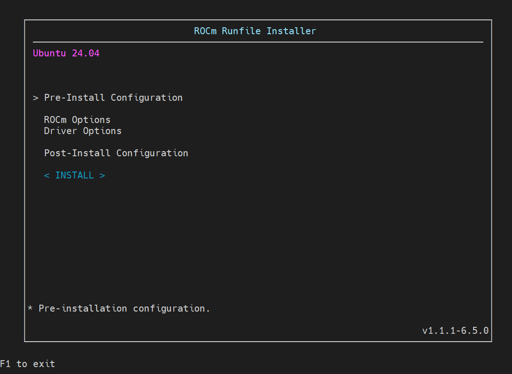

4. If you enter the Pre-Install Configuration, you can see the options first for ROCm and amdgpu driver

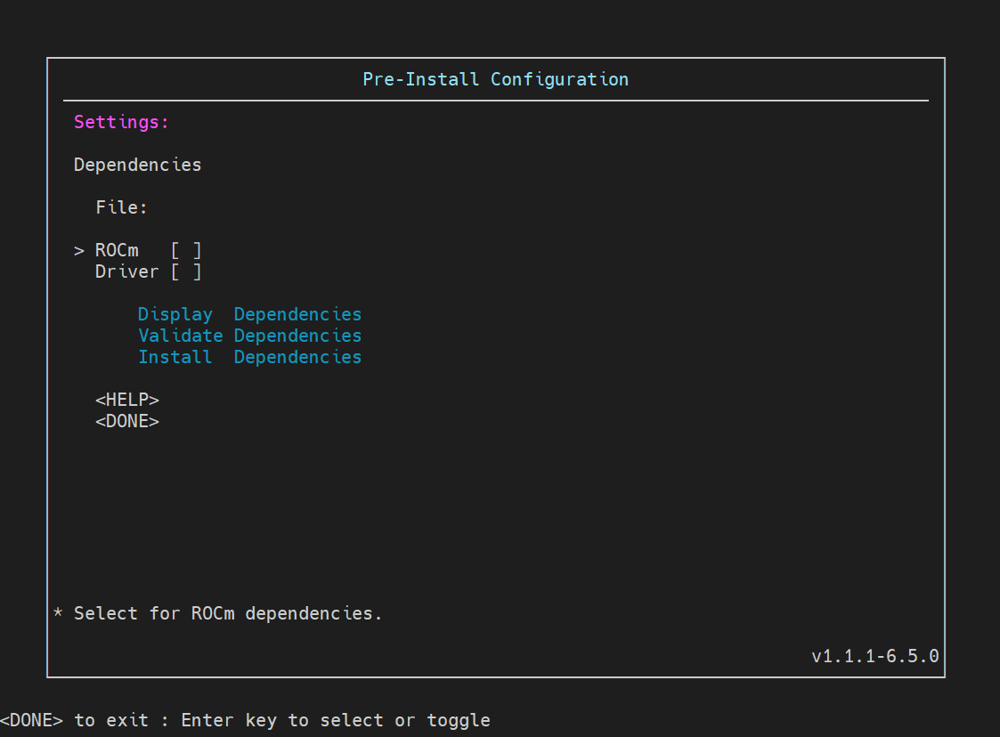

5. Selecting either or both you can then select the options to Display Dependencies -- this will display and write out a file with all the dependencies for the ROCm and/or amdgpu driver option(s) you select. For example checking ROCm only dependencies:

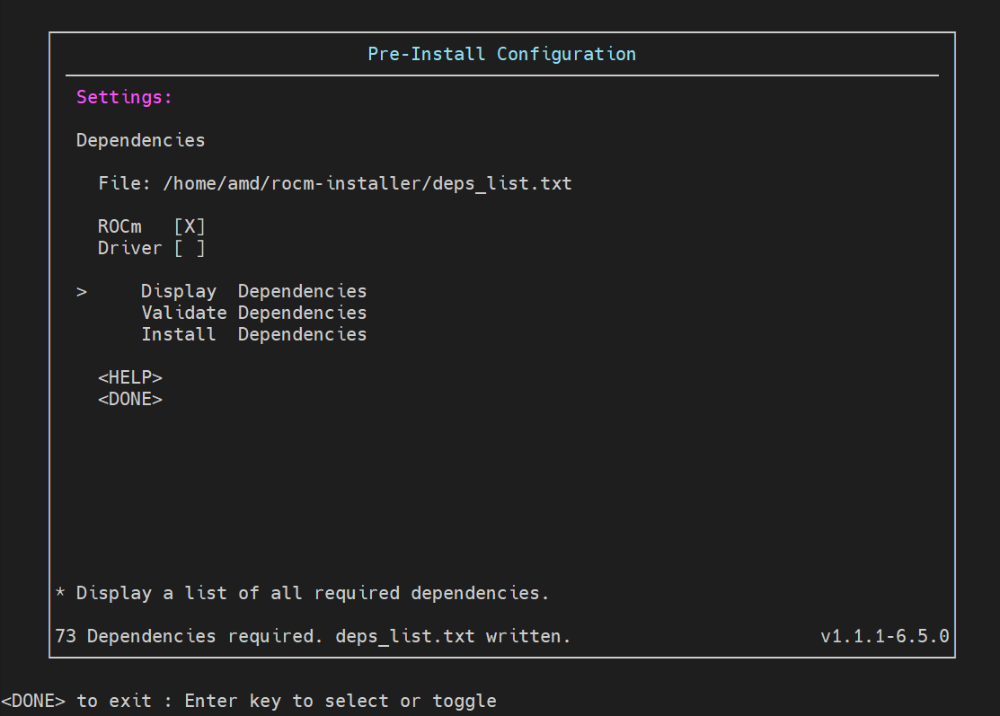

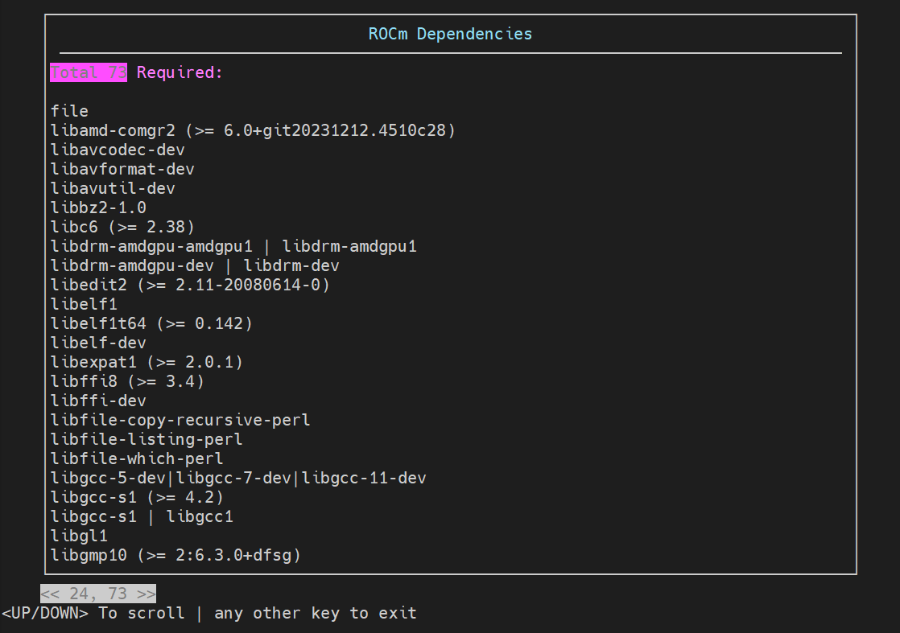

6. Due to the open source ethos of ROCm and indeed AMD, there are dependencies on non-AMD packages associated with the Linux distributions that cannot be included within the ROCm Runfile Installer. That leaves a couple of options:

    a.  If you do have internet connectivity then your OS package manager will download and install all required dependencies for your selected options under the instruction of the ROCm Runfile Installer.

    b.  In environments where you do not have internet connectivity, the standard practice is that your IT department would have a local repository of OS distribution packages locally to access for exactly this case.

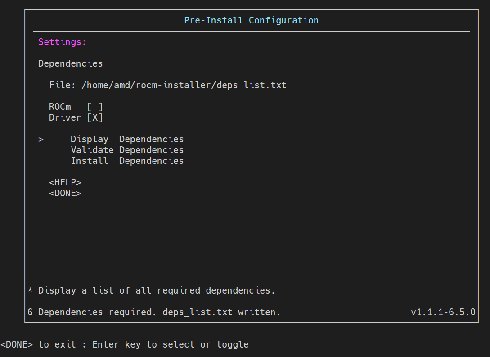

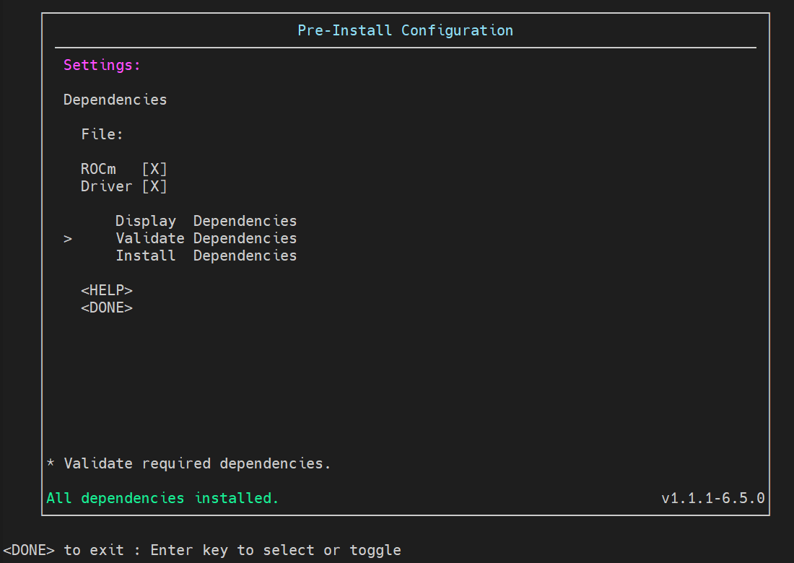

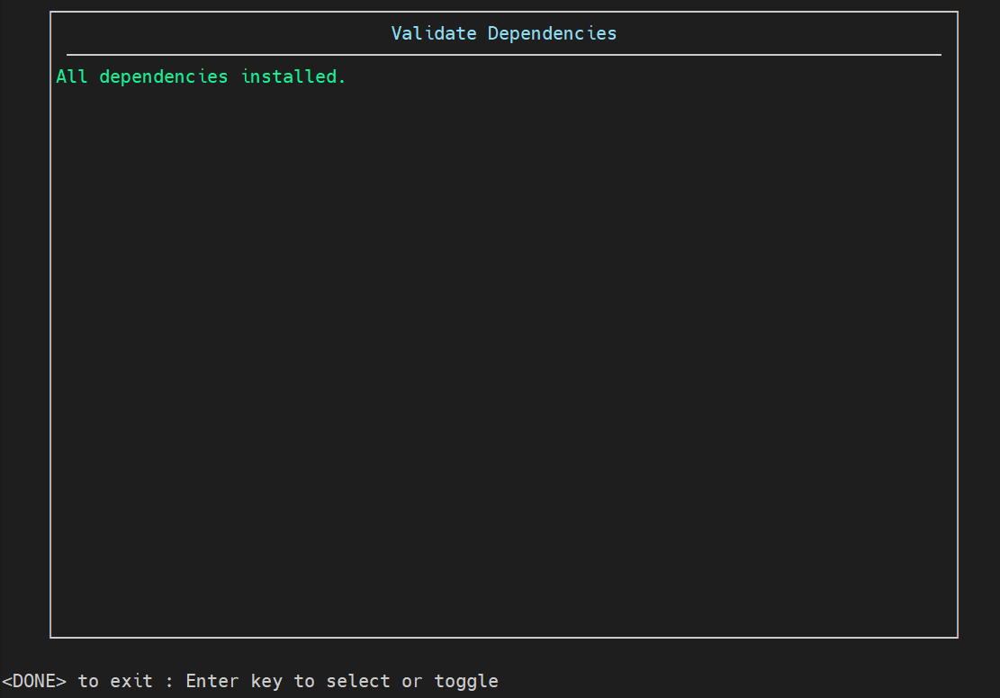

7. At this point the installation is completed completely from the ROCm Runfile Installer locally. Next up, the ROCm Options:

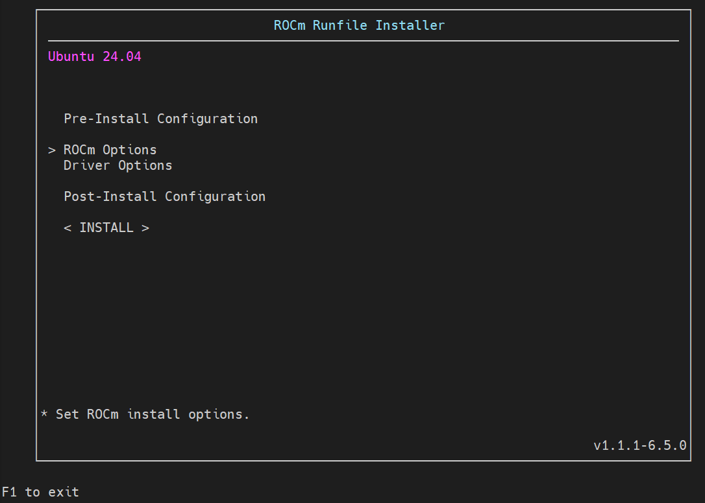

8. Here you can see the option to select installing ROCm, select the components and install path. Note that the / as a path will use the default /opt/rocm/ path but any other path is valid, provided the path already exists.

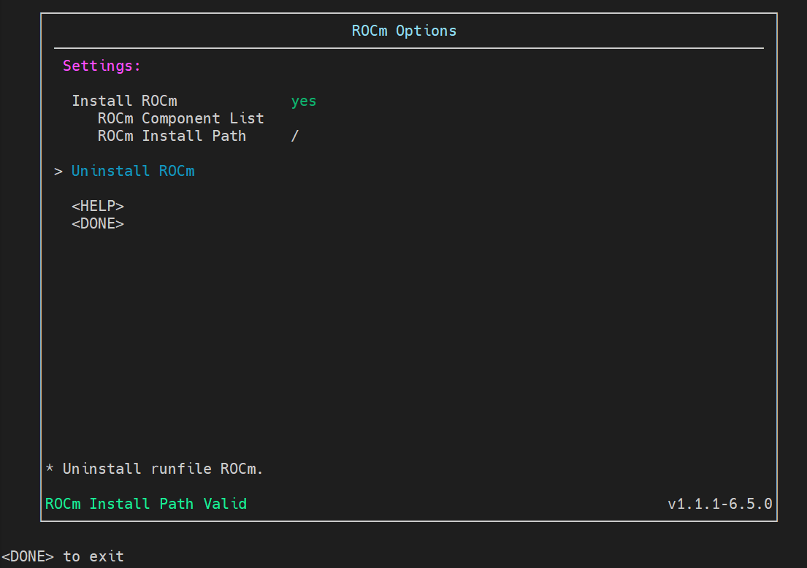

9. Now to Driver Options:


10. Specify if you want the amdgpu driver installed and started on install or not:

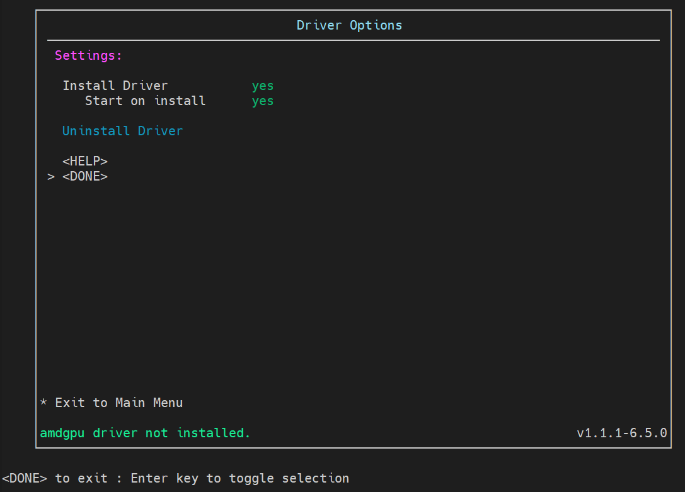

11. The final selection is for Post-Install:

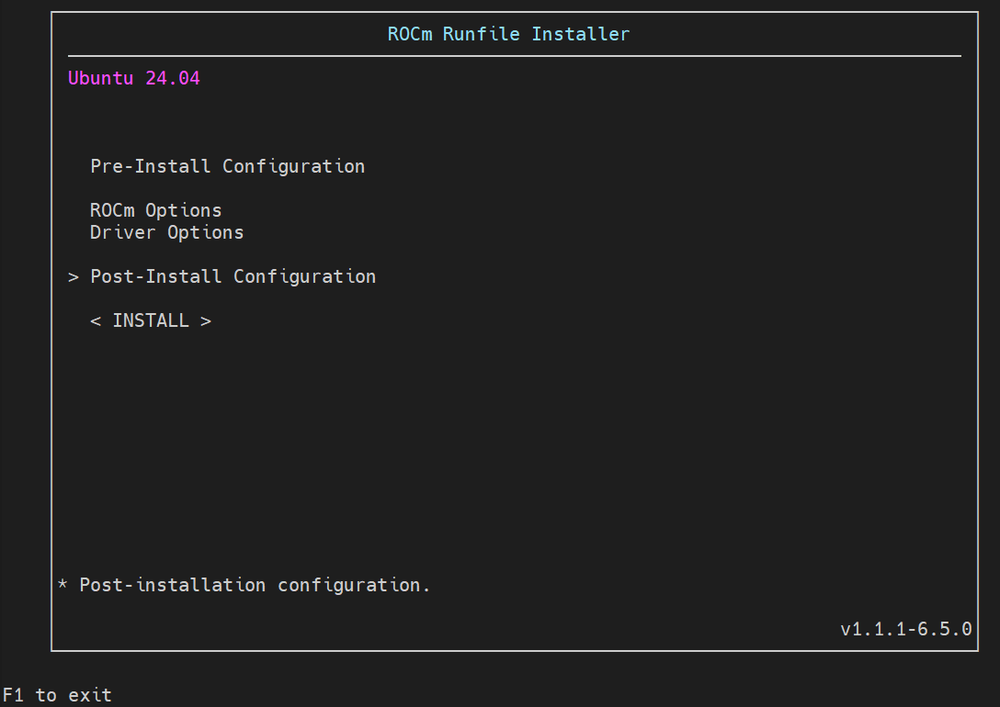

12. With the previous options of installation, it was required to set video and render group permissions for the current user in Linux, or for all with the udev rule. The Runfile Installer can also enable post-install configuration, which sets permissions and symbolic links, paths, etc to ensure correct ROCm operation.

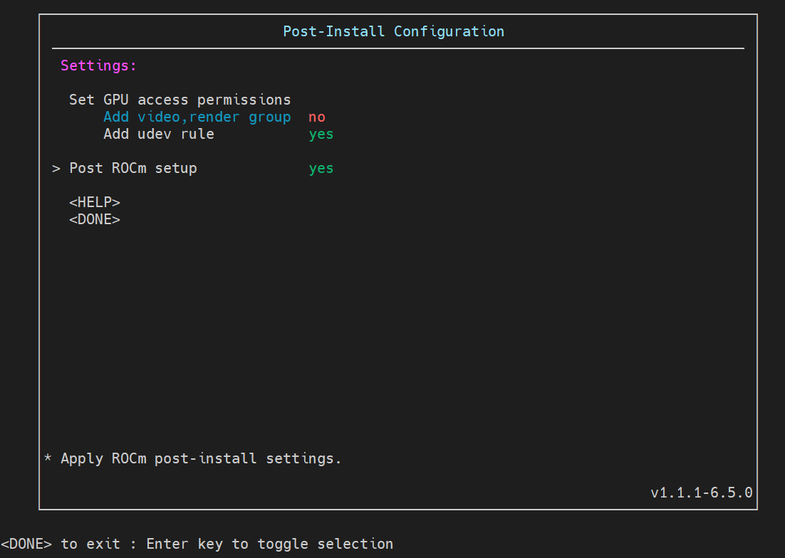

13. Now, INSTALL, with the configured options and you are done!!

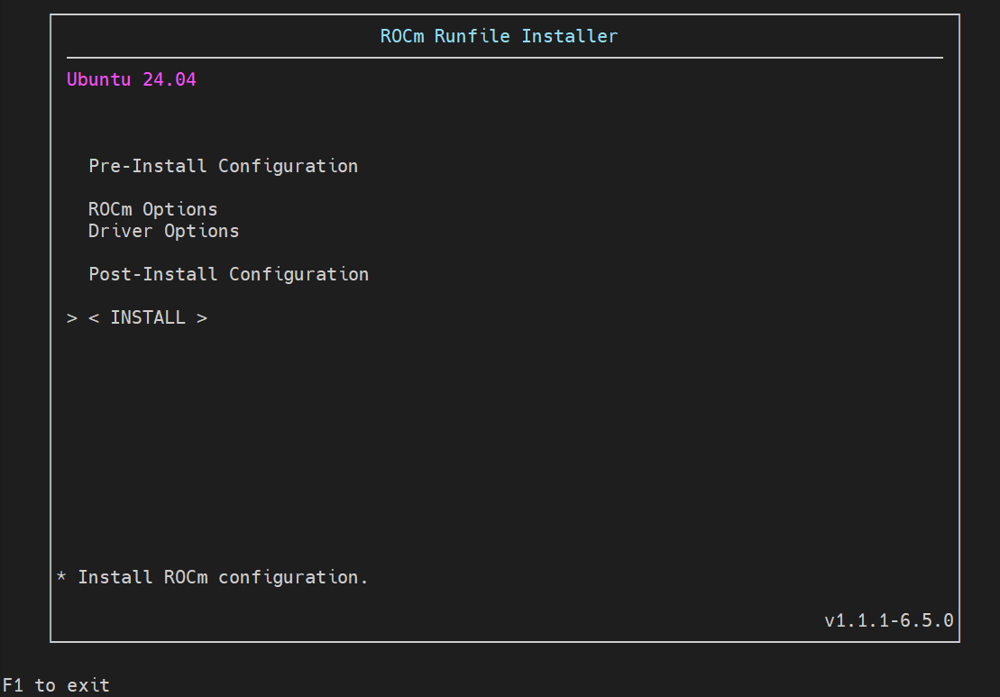

14. You can check with rocminfo that the AMD GPU is recognized as an HSA agent afterwards and that is it!

```bash
rocminfo
```

## Summary

In this blog, we introduce the ROCm Runfile Installer, a new installation method available from ROCm 6.4 that simplifies deploying ROCm and amdgpu components in secure, offline, or package-manager-limited environments. The ROCm Runfile Installer gives users the ability to install ROCm and/or amdgpu components from a self-contained .run file, with an easy-to-use interface. This approach is particularly useful for users working in secure or restricted environments without internet connectivity.

With the availability of the single file installer, amdgpu-installer is no longer recommended for use for Instinct GPUs to install ROCm. Whether you're managing a high-security cluster or just want a faster setup experience, the ROCm Runfile Installer makes deploying ROCm easier and more accessible than ever.
