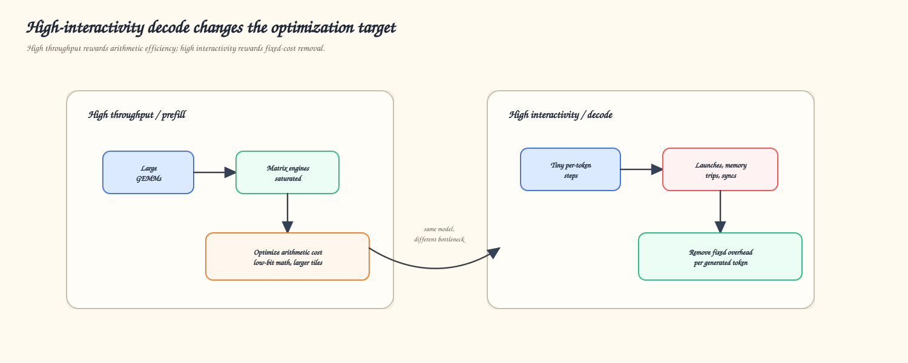
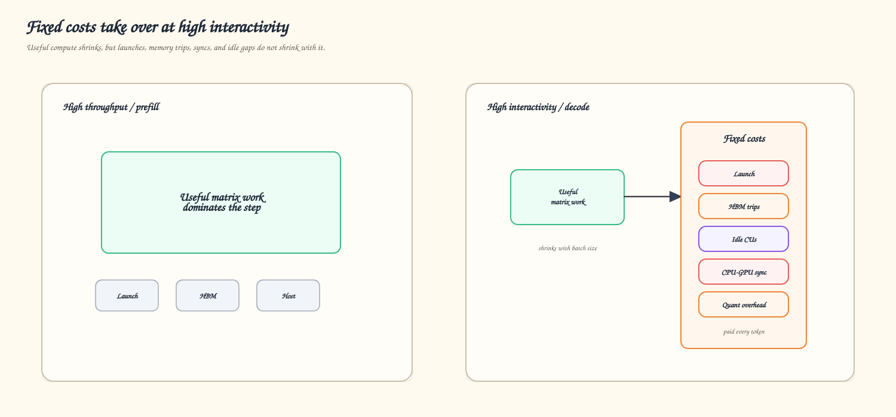
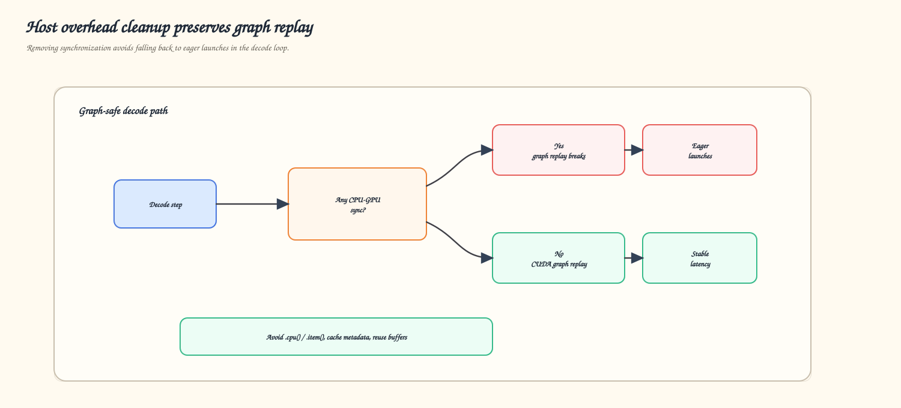
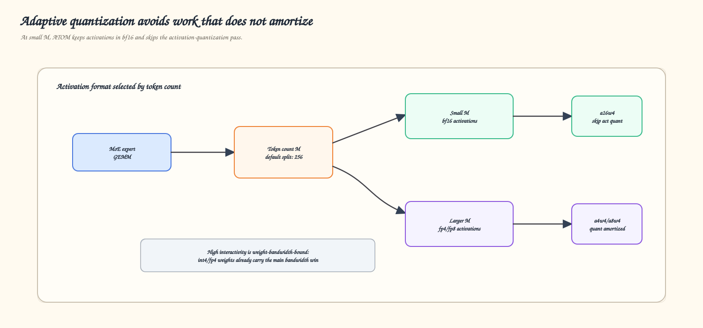
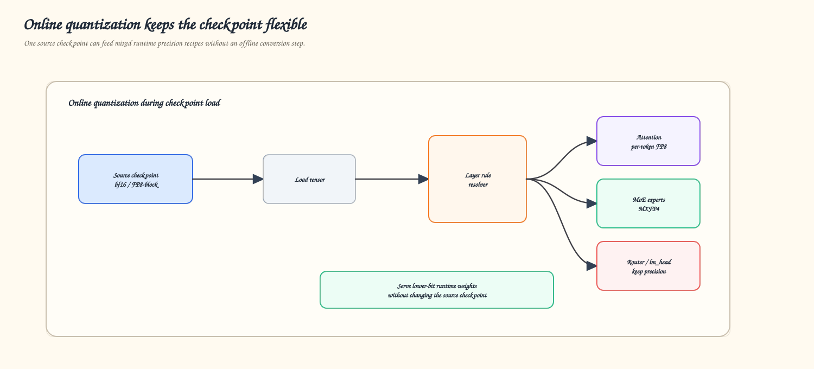
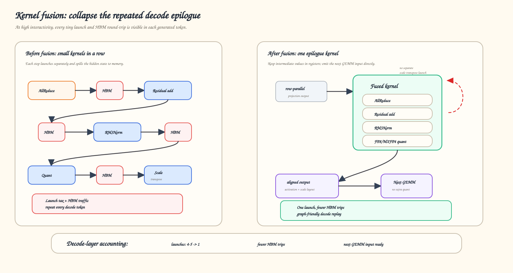
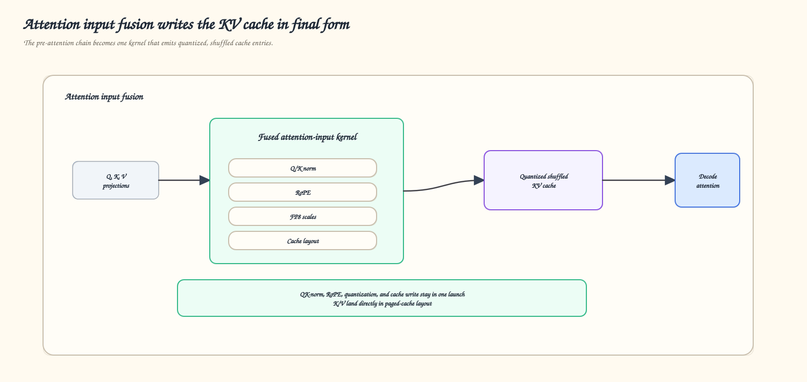
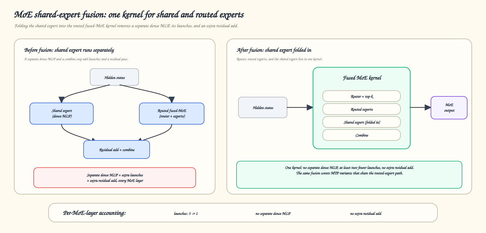
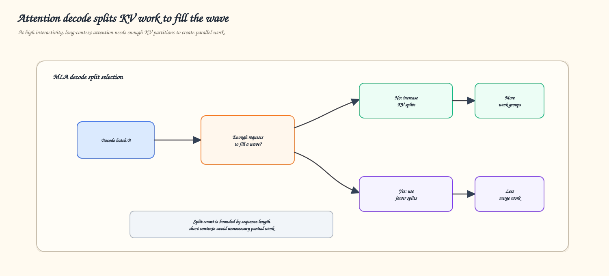
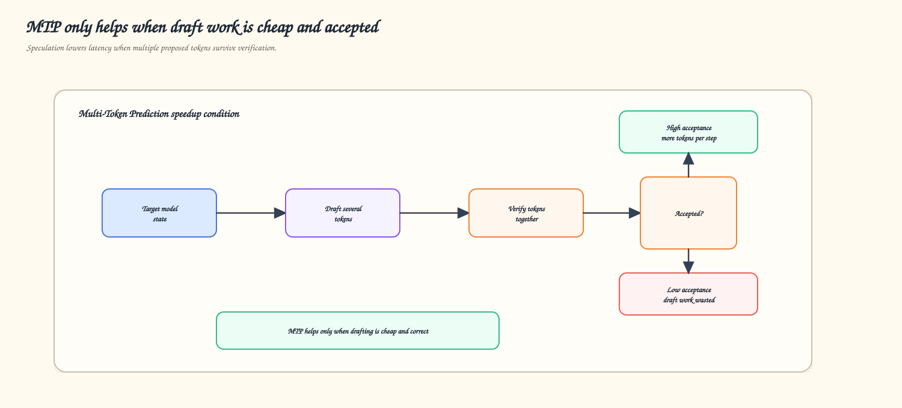

<!---
Copyright (c) 2026 Advanced Micro Devices, Inc. (AMD)

Permission is hereby granted, free of charge, to any person obtaining a copy
of this software and associated documentation files (the "Software"), to deal
in the Software without restriction, including without limitation the rights
to use, copy, modify, merge, publish, distribute, sublicense, and/or sell
copies of the Software, and to permit persons to whom the Software is
furnished to do so, subject to the following conditions:

The above copyright notice and this permission notice shall be included in all
copies or substantial portions of the Software.

THE SOFTWARE IS PROVIDED "AS IS", WITHOUT WARRANTY OF ANY KIND, EXPRESS OR
IMPLIED, INCLUDING BUT NOT LIMITED TO THE WARRANTIES OF MERCHANTABILITY,
FITNESS FOR A PARTICULAR PURPOSE AND NONINFRINGEMENT. IN NO EVENT SHALL THE
AUTHORS OR COPYRIGHT HOLDERS BE LIABLE FOR ANY CLAIM, DAMAGES OR OTHER
LIABILITY, WHETHER IN AN ACTION OF CONTRACT, TORT OR OTHERWISE, ARISING FROM,
OUT OF OR IN CONNECTION WITH THE SOFTWARE OR THE USE OR OTHER DEALINGS IN THE
SOFTWARE.
--->

# Optimizing ATOM and vLLM-ATOM for High-Interactivity Inference

When you type a question into a chat assistant, ask a coding agent to make an edit, or watch tokens stream back from a model, what you feel is not throughput. You feel *responsiveness*. The pause before the first word appears, and the pace at which each following word arrives, decide whether an assistant feels instant or sluggish. As LLMs move into interactive assistants, coding agents, and multi-step tool-calling loops, this responsiveness — how quickly the system reacts to a single user — has become a first-class product requirement.

We call this the **high-interactivity** regime: one user, or a handful of concurrent users, each waiting on their own stream of tokens. It is the opposite of the batch-throughput regime that most inference optimization targets. Serving many requests at once keeps the GPU's matrix engines busy and amortizes every fixed cost across a large batch. Serving one user responsively does not. In this regime, the GPU is rarely short of FLOPs; it is short of *useful work per step*, and every fixed per-token cost is left exposed on the critical path.

This post describes how we optimized **ATOM**, a lightweight LLM inference engine built on the AMD **AITER** GPU kernels for the ROCm™ platform, and **vLLM-ATOM**, which exposes ATOM modeling as a vLLM plugin. This work is general across popular model structures — such as **gpt-oss, Kimi-K2, Qwen3-Next, DeepSeek-V3.2, and MiniMax-M2.5** — including their **Multi-Token Prediction (MTP)** speculative-decoding paths. The optimizations target structural properties of the decode path rather than any single model, so they carry over broadly to any model that shares the same building blocks.

More importantly, this post is intended as a technical reference for the broader LLM inference community. The specific kernels and environment flags are ATOM/AITER-specific, but the optimization process is portable: identify which fixed costs dominate at high interactivity, decide which costs should be removed rather than accelerated, and then validate the result model by model. Readers building other inference engines, plugins, or model-specific kernels can use the same checklist to reason their own decode path.

The central lesson is simple:

> For high-interactivity decode, the winning move is often not to make each operation cheaper. It is to remove operations, launches, copies, synchronizations, and idle gaps from the critical path.

Figure 1, below, contrasts the two regimes and shows how the optimization target shifts as concurrency falls.

<em>Figure 1: The optimization target changes with concurrency. High-throughput inference is mostly about arithmetic efficiency; high-interactivity decode is mostly about fixed-cost removal.</em>

The rest of the post is a reusable optimization playbook. After a diagnostic look at *why* this regime is different, it works through four areas of optimization:

- **Host-overhead elimination:** keep the decode loop graph-safe, allocation-light, and free of host-device synchronization.
- **Quantization recipe:** apply activation quantization only when its overhead amortizes and quantize weights online to fit the runtime.
- **Kernel optimization and fusion:** collapse chains of tiny kernels into one launch and reshape work, so the GPU has enough parallelism.
- **Multi-Token Prediction (MTP):** make speculative decoding cheap and correct enough to turn accepted tokens into real latency reduction.

---

## Why High Interactivity Is a Different Problem

In a throughput-heavy workload, every kernel has enough arithmetic to hide launch latency and memory traffic. In the high-interactivity regime — batch size one, or a decode loop that emits one token per step — each transformer layer processes only a handful of rows. The fixed costs stay almost the same, while useful computation shrinks dramatically. Figure 2 makes that shift concrete: as the useful work per step shrinks, the fixed costs left behind occupy a much larger fraction of the step.

<em>Figure 2: In high-interactivity decode, fixed costs occupy a much larger fraction of the step.</em>

Five categories dominate:

- **Kernel-launch latency:** A decode layer decomposed into AllReduce, residual add, RMSNorm, quantization, RoPE, and cache write can spend more time launching kernels than doing useful arithmetic.
- **HBM round-trips:** Intermediate tensors are written and read back between tiny kernels. In this regime, memory traffic can dominate the layer.
- **GPU under-utilization:** A small-M GEMM or single-query attention operation may not produce enough workgroups to occupy all compute units.
- **Host-device synchronization:** A single `.cpu()` or `.item()` in the decode loop serializes the CPU and GPU and breaks CUDA-graph replay.
- **Unamortized quantization:** Activation quantization adds passes, scales, and sorting work. Below a certain token count, that overhead can cost more than it saves.

This is the lens we used for the rest of the work, and it is the first diagnostic step we recommend for any high-interactivity inference stack: list the costs that repeat every token, then ask whether each one should be fused, cached, overlapped, reshaped, or removed entirely.

---

## Host-Overhead Elimination: Keep Decode Graph-Safe

When GPU kernels are tiny, CPU-side work becomes visible in every token. Metadata construction, tensor allocation, Python dispatch, and host-device synchronization all show up on the critical path — so this is the first place we look. As Figure 3 shows, removing a host-device synchronization is not only about the cost of one copy; it is what keeps the captured decode path safe to replay.

<em>Figure 3: Removing host-device synchronization is not just about one copy; it preserves the captured decode path.</em>

ATOM and vLLM-ATOM reduced host-side overhead in four areas:

- **Synchronization removal:** MTP drafting uses a dedicated metadata builder for uniform single-token decode, avoiding the general split routine that required `.cpu()` and `.item()` calls. Native decode replaces a GPU-to-CPU-to-NumPy-to-GPU sampled-token path with a direct GPU-to-GPU copy. The V2 model-runner path reuses vLLM's host-resident sequence-length tensor instead of synchronizing `seq_lens`.
- **Metadata caching:** Sparse-MLA metadata is a deterministic function of the decode shape in a steady state. ATOM fingerprints that shape and skips the schedule kernel on cache hits, while clearing only the tail of index buffers. The cache is used only in pure decode, so MTP and mixed batches still recompute for correctness.
- **CUDA-graph consistency:** The cudagraph-versus-eager decision was unified into one function that rounds batch size to the nearest captured graph size and dispatches consistently across call sites.
- **Buffer reuse:** Gated-delta-net accepts caller-provided output buffers, MLA up-projection writes directly into the target view, and sparse MLA emits FP8 directly into an FP8 output buffer.

---

## Quantization Recipe: Sometimes the Fastest Quantization Is No Activation Quantization

Quantization is usually presented as a universal win: lower precision means cheaper math and less bandwidth. In high-interactivity MoE decode, the story is more conditional.

For MoE layers with 4-bit weights, high-throughput paths often quantize activations too, using formats such as a4w4 or a8w4. That is the right tradeoff when the GEMM is large enough. But at small M, the expert GEMM is often weight-bandwidth-bound. The 4-bit weights already deliver the main bandwidth reduction; an extra activation-quantization pass adds fixed overhead that a tiny GEMM cannot amortize.

ATOM therefore uses the adaptive dispatch rule shown in Figure 4: rather than applying activation quantization unconditionally, it picks the activation format from the concurrency of the step.

<em>Figure 4: ATOM chooses the activation format by concurrency instead of applying activation quantization unconditionally.</em>

The crossover is controlled by a tunable threshold, currently exposed as `GPTOSS_SWIGLU_MXFP4_BF16_BOUND` with a default of 256. Below that threshold, ATOM keeps activations in bf16 and uses a weight-only path. Above it, activation quantization becomes worthwhile because the GEMM has enough work to amortize the quantization pass.

This adaptive path generalizes across MXFP4 MoE workloads — the crossover depends on the size of the expert GEMM, not on the model. The same principle also influences tile selection: small-M paths use smaller tile heights and split the K dimension to expose enough parallelism for decode shapes.

### Online Quantization at Load Time

Adaptive activation quantization is complemented by **online weight quantization**. Instead of requiring an offline conversion step, ATOM can quantize or re-quantize weights in memory while the checkpoint is loaded. The source checkpoint on disk remains unchanged, while the runtime can serve attention projections, MoE experts, routers, and output layers with different precision choices. Figure 5 shows how one checkpoint on disk can back several runtime precision recipes this way.

<em>Figure 5: Online quantization lets one source checkpoint support multiple runtime precision recipes.</em>

This helps both regimes. At high throughput, it reduces arithmetic costs. At high interactivity, it reduces weight footprint and HBM bandwidth, which are often the dominant costs.

---

## Kernel Optimization and Fusion

Once host overhead and quantization are under control, the remaining fixed costs live in the kernels themselves: too many launches, too much intermediate memory traffic, and too few workgroups to keep the GPU busy. This section covers three levers — fusing kernels together, scheduling small-M GEMMs, and splitting attention decode work — that together collapse the decode step and fill the device.

### Kernel Fusion: Collapse the Decode Step

Kernel fusion is the most direct answer to launch overhead and HBM round-trips. Instead of writing an intermediate tensor to memory and launching the next tiny kernel, AITER keeps more work inside one kernel and emits the output in the layout expected by the next operation.

Figure 6 shows the tensor-parallel epilogue before and after fusion. The important change is not just that several operations move into one kernel; it is that the normalized activation and scale layout are produced in the form the next GEMM already expects.

<em>Figure 6: Kernel fusion collapses the repeated decode epilogue.</em>

#### Tensor-Parallel Epilogue

The standard tensor-parallel epilogue is:

`allreduce(x) -> x += residual -> RMSNorm -> quant`

Unfused, this costs multiple launches and several full-hidden-state memory round-trips. The fused AITER path performs AllReduce, residual addition, RMSNorm, and FP8 or MXFP4 quantization in one kernel. The output can be padded, strided, and scale-transposed into the exact layout required by the next GEMM, eliminating another small layout kernel.

For decode, ATOM selects a one-shot AllReduce path for small payloads, controlled by `AITER_AR_1STAGE_MAX_KB` with a default of 128 KiB. We also fixed decode-specific correctness issues in this path, including token coverage beyond the original fixed grid limit and a missing terminal barrier needed for safe CUDA-graph replay.

This fusion applies to any tensor-parallel model that uses the standard AllReduce → residual → RMSNorm → quant epilogue. It is toggled with `ATOM_ENABLE_ALLREDUCE_RMSNORM_FUSION` and already wired into models such as Qwen3-Next, Kimi-K2.5, GLM, and MiniMax-M2.5. Model code attaches the collective to the normalization layer and disables the redundant collective in the previous row-parallel projection, so the AllReduce still happens exactly once.

#### Attention Input Fusion

The attention input path has the same problem. A typical unfused chain is:

`Q/K norm -> RoPE -> reshape -> KV-cache write -> quantize`

AITER's fused attention-input kernel computes Q/K normalization, applies RoPE, calculates FP8 scales, and writes K/V directly into the paged cache in the final quantized and shuffled layout. ATOM enables this through `ATOM_ENABLE_QK_NORM_ROPE_CACHE_QUANT_FUSION`. Figure 7 traces that fused path against the unfused chain above.

<em>Figure 7: QK-norm, RoPE, quantization, and KV-cache write are fused into the attention input path.</em>

The most complete form of this fusion combines `allreduce(qkv)`, Q/K RMSNorm, RoPE, FP8 quantization, and shuffled KV-cache write into a single kernel. This removes roughly six small operations from the decode critical path and includes a tensor-parallel-degree-one variant for single-GPU deployments.

#### MoE Shared-Expert Fusion

MoE shared experts can also be folded into the routed fused-MoE kernel when the quantization layout is compatible. This removes a separate dense MLP, at least two launches, and an extra residual add per MoE layer. The same fusion applies to MTP variants when they share the routed-expert path. Figure 8 shows what disappears from the layer once the shared expert is folded in.

<em>Figure 8: MoE shared-expert fusion folds the shared expert into the routed fused-MoE kernel, removing a separate dense MLP, its launches, and an extra residual add.</em>

### Small-M GEMM and MoE Scheduling: Fill the GPU With Less Work

Even after fusion, a batch-size-one GEMM may produce too few tiles to occupy the GPU. The problem is not the total amount of math, but the number of independent workgroups available at once.

For dense bf16 GEMMs, ATOM uses decode-specialized GEMM paths that treat `M`, `N`, and `K` as first-class tuning dimensions. Conceptually, the long `K` reduction is split into multiple partitions, each partition computes a partial result for the same output tile, and the partials are accumulated inside one GEMM launch. This creates more workgroups for skinny `M x N` grids without adding a separate initialization kernel. The broader GEMM algorithm is covered in [*Accelerating LLM Inference on AMD GPUs with Low-Latency GEMMs*](https://rocm.blogs.amd.com/software-tools-optimization/accelerating-llm-inference-on-amd-gpus-with-low-latency-gemms/README.html), so this post focuses on the MoE-specific pieces.

For MoE expert GEMMs, ATOM separates decode and prefill variants instead of forcing both to share one tile configuration. The decode path uses small tile heights, wide-N/deep-K shapes, software-pipelined asynchronous weight loading, and lookup-table tuning by shape.

MoE dispatch overhead matters too. Sorting tokens, combining top-k outputs, and reducing expert-parallel results are fixed costs paid every decode step. ATOM reduces them with faster token sorting, a no-combine mode when the caller performs its own reduction, and an expert-parallel reduction fused into the second GEMM stage as a masked gather.

### Attention Decode: Split Memory Work to Fill the Device

Decode attention is usually a single-query, memory-bound operation. Long contexts add plenty of memory traffic, but high interactivity still leaves the GPU under-occupied unless the KV work is split carefully. Figure 9 shows how the split count is chosen so that long-context work fills the hardware wave without over-splitting short contexts.

<em>Figure 9: MLA decode chooses KV splits from batch size and sequence length, so long-context work fills the hardware wave without over-splitting short contexts.</em>

For MLA decode on the Instinct™ MI350-class hardware, the split count is derived from batch size to fill a 256-workgroup wave, then bounded by sequence length so short contexts do not waste work. Per-split log-sum-exp values are kept in fp32 buffers to avoid merge-precision loss, and very short contexts are supported on the same path.

DeepSeek-V3.2 sparse attention adds another fixed cost: the DSA indexer must select top-k blocks from the KV cache. ATOM reduces that cost with an index cache that reuses selections across layers on a configurable refresh interval. The FP8 paged multi-query-attention logits kernel and the persistent FP8 MLA decode kernel were also extended and tuned for MI350-class hardware.

Paged-attention dispatch is selected per model and decode batch size. Triton/Gluon kernels are faster for high-interactivity decode, while assembly kernels win once the batch is large enough. Instead of using one global rule, vLLM-ATOM keeps model-specific crossover points for Qwen3 MoE, GLM4 MoE, and MiniMax-M2.

---

## Multi-Token Prediction: Speculation Only Helps When Drafting Is Cheap and Correct

MTP reduces user-visible latency by drafting multiple candidate tokens and verifying them together. But speculation is fragile: if draft steps are expensive, or if the acceptance rate is low, MTP can fail to improve latency. As Figure 10 shows, speculation pays off only where both conditions hold at once.

<em>Figure 10: MTP needs both inexpensive draft steps and a high acceptance rate.</em>

We optimized MTP on both axes.

First, we reduced the draft-step cost. Draft metadata is built without CPU-GPU synchronization for uniform decode. In MTP predictor blocks with both shared and routed experts, the shared expert can run on an alternate stream while routed experts run on the main stream, overlapping two otherwise under-occupied GEMMs. For DeepSeek-V3.2 sparse-MLA MTP, the indexer owns the sparse-index buffer consumed by attention, replacing several small per-layer conversion kernels. The persistent FP8 MLA decode kernel also covers the query-length-four verification shape used by common MTP configurations.

Second, we fixed correctness issues that directly affected the acceptance rate. For Qwen3.5, draft weights were being skipped by the loader due to name remapping, and the proposer used the wrong dimension for multi-axis MRoPE positions; both issues drove acceptance to zero. Multi-step speculation under data-parallel attention was also blocked by CUDA-graph capture, which assumed a maximum query length of one. ATOM now computes the true speculative maximum, and standalone NextN draft checkpoints are supported with correct FP8 quantization and weight remapping.

The result is a draft path that is cheaper per proposed token and accurate enough for speculation to translate into real latency reduction.

---

## Summary

In this blog you learned why high-interactivity inference is a different optimization problem from batch throughput. The bottleneck shifts away from pure arithmetic and toward the fixed overhead that repeats on every token: launches, memory round-trips, synchronization, allocations, and idle GPU capacity.

You then worked through four ways to remove that overhead across ATOM, vLLM-ATOM, and AITER. You saw how host-side cleanup preserves CUDA-graph replay, how adaptive quantization skips activation quantization when it does not amortize, how fusion and small-M scheduling cut launches and HBM traffic while exposing enough parallelism to occupy the GPU, and how MTP turns multiple accepted tokens into one more efficient step. Every one of them follows the same principle: remove the cost that repeats every token.

That principle also reflects how the stack is designed to evolve: kernels are implemented and tuned in AITER, wired and validated per model in ATOM, exposed through the vLLM plugin, and upstreamed where they generalize. We are continuing along that path, extending the fused decode paths to more model families, widening the adaptive quantization crossover, and raising MTP acceptance rates, and we plan to cover this work in follow-up posts. In the meantime, you can watch how the models discussed here perform from night to night on the [ATOM benchmark dashboard](https://rocm.github.io/ATOM/benchmark-dashboard/).

We hope the same breakdown is useful beyond ATOM. If you are optimizing another LLM serving stack, the exact implementation details will differ, but the questions are similar: which work repeats every token, which kernels are too small to amortize their launch, which tensors are round-tripping through memory, where does the host synchronize with the device, and which model-specific paths deserve their own dispatch rules?

---

## Additional Resources

- [ATOM repository](https://github.com/ROCm/ATOM) — model implementations, vLLM-ATOM plugin integration, recipes, validation workflows, and benchmark automation
- [vLLM-ATOM plugin backend guide](https://github.com/ROCm/ATOM/blob/main/docs/vllm_plugin_backend_guide.md) — plugin architecture, runtime integration, and model bring-up path
- [vLLM-ATOM model recipes](https://github.com/ROCm/ATOM/tree/main/recipes/atom_vllm) — runnable examples for DeepSeek, Kimi, GPT-OSS, Qwen, MiniMax, GLM, Llama, and related model families
- [AITER kernel library](https://github.com/ROCm/aiter) — ROCm GPU kernels used by ATOM for attention, GEMM, MoE, normalization, quantization, and fused decode paths
- [ATOM benchmark dashboard](https://rocm.github.io/ATOM/benchmark-dashboard/) — nightly performance tracking across models and configurations
- [Accelerating LLM Inference on AMD GPUs with Low-Latency GEMMs](https://rocm.blogs.amd.com/software-tools-optimization/accelerating-llm-inference-on-amd-gpus-with-low-latency-gemms/README.html)

## Disclaimers

The information presented in this document is for informational purposes only and may contain technical inaccuracies, omissions, and typographical errors. The information contained herein is subject to change and may be rendered inaccurate for many reasons, including but not limited to product and roadmap changes, component and motherboard version changes, new model and/or product releases, product differences between differing manufacturers, software changes, BIOS flashes, firmware upgrades, or the like. Any computer system has risks of security vulnerabilities that cannot be completely prevented or mitigated. AMD assumes no obligation to update or otherwise correct or revise this information. However, AMD reserves the right to revise this information and to make changes from time to time to the content hereof without obligation of AMD to notify any person of such revisions or changes.

THIS INFORMATION IS PROVIDED "AS IS." AMD MAKES NO REPRESENTATIONS OR WARRANTIES WITH RESPECT TO THE CONTENTS HEREOF AND ASSUMES NO RESPONSIBILITY FOR ANY INACCURACIES, ERRORS, OR OMISSIONS THAT MAY APPEAR IN THIS INFORMATION. AMD SPECIFICALLY DISCLAIMS ANY IMPLIED WARRANTIES OF NON-INFRINGEMENT, MERCHANTABILITY, OR FITNESS FOR ANY PARTICULAR PURPOSE. IN NO EVENT WILL AMD BE LIABLE TO ANY PERSON FOR ANY RELIANCE, DIRECT, INDIRECT, SPECIAL, OR OTHER CONSEQUENTIAL DAMAGES ARISING FROM THE USE OF ANY INFORMATION CONTAINED HEREIN, EVEN IF AMD IS EXPRESSLY ADVISED OF THE POSSIBILITY OF SUCH DAMAGES.

Third-party content is licensed to you directly by the third party that owns the content and is not licensed to you by AMD. ALL LINKED THIRD-PARTY CONTENT IS PROVIDED "AS IS" WITHOUT A WARRANTY OF ANY KIND. USE OF SUCH THIRD-PARTY CONTENT IS DONE AT YOUR SOLE DISCRETION AND UNDER NO CIRCUMSTANCES WILL AMD BE LIABLE TO YOU FOR ANY THIRD-PARTY CONTENT. YOU ASSUME ALL RISK AND ARE SOLELY RESPONSIBLE FOR ANY DAMAGES THAT MAY ARISE FROM YOUR USE OF THIRD-PARTY CONTENT.

AMD, the AMD Arrow logo, AMD Instinct, ROCm, and combinations thereof are trademarks of Advanced Micro Devices, Inc. Other product names used in this publication are for identification purposes only and may be trademarks of their respective companies.

© 2026 Advanced Micro Devices, Inc. All rights reserved.
