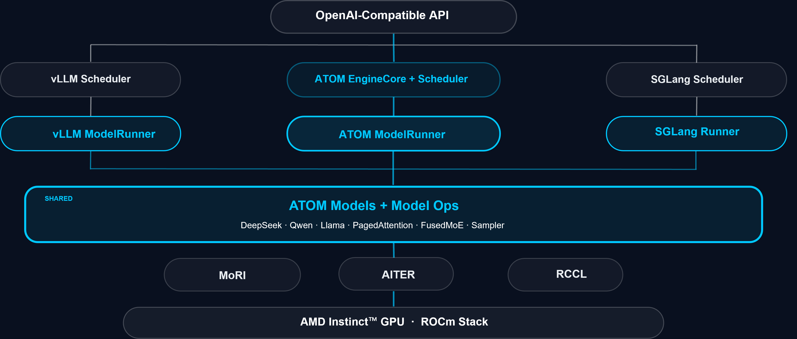
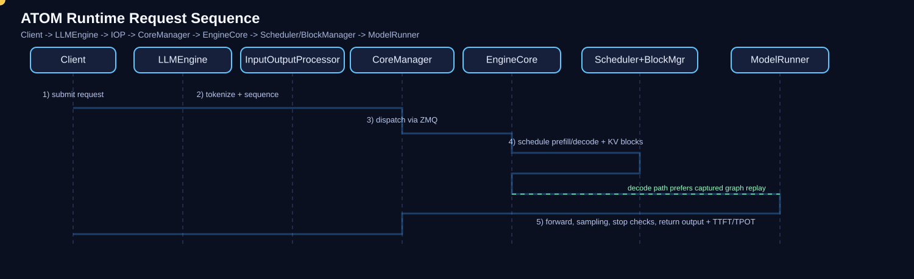

<!---
Copyright (c) 2026 Advanced Micro Devices, Inc. (AMD)

Permission is hereby granted, free of charge, to any person obtaining a copy
of this software and associated documentation files (the "Software"), to deal
in the Software without restriction, including without limitation the rights
to use, copy, modify, merge, publish, distribute, sublicense, and/or sell
copies of the Software, and to permit persons to whom the Software is
furnished to do so, subject to the following conditions:

The above copyright notice and this permission notice shall be included in all
copies or substantial portions of the Software.

THE SOFTWARE IS PROVIDED "AS IS", WITHOUT WARRANTY OF ANY KIND, EXPRESS OR
IMPLIED, INCLUDING BUT NOT LIMITED TO THE WARRANTIES OF MERCHANTABILITY,
FITNESS FOR A PARTICULAR PURPOSE AND NONINFRINGEMENT. IN NO EVENT SHALL THE
AUTHORS OR COPYRIGHT HOLDERS BE LIABLE FOR ANY CLAIM, DAMAGES OR OTHER
LIABILITY, WHETHER IN AN ACTION OF CONTRACT, TORT OR OTHERWISE, ARISING FROM,
OUT OF OR IN CONNECTION WITH THE SOFTWARE OR THE USE OR OTHER DEALINGS IN THE
SOFTWARE.
--->

# ATOM: Unlocking Extreme AMD Instinct Inference with Software-Hardware Co-Optimization

As LLM serving enters a phase defined by high concurrency, long-context workloads, sparse MoE activation, and multi-GPU deployment, the challenge is no longer basic functionality but sustaining peak efficiency on AMD GPUs under production-scale load. ATOM (AiTer Optimized Model) is built for that goal, following four core principles: system-level optimization for LLM inference on AMD Instinct™ GPUs, kernel-level acceleration through AITER, distributed inference scaling with MORI, and a rollout-engine path for RL workloads. It builds on earlier ROCm blog coverage of [AITER](https://rocm.blogs.amd.com/software-tools-optimization/aiter-ai-tensor-engine/README.html) and [vLLM-ATOM](https://rocm.blogs.amd.com/software-tools-optimization/vllm-atom/README.html), moving from kernel and plugin acceleration into the standalone ATOM inference engine. Rather than being a generic framework adapted to the ROCm™ software, ATOM is an execution engine designed with ROCm-first priorities, AITER-native operators, and deep optimization on the inference-critical path. Aligned with the AMD Instinct roadmap from single-node optimization to multi-node scale-out, ATOM evolves its architecture, kernel strategy, and distributed execution model in lockstep with each hardware generation.

This blog covers six topics: ATOM's software positioning in the AMD AI stack, the ATOM architecture, current feature scope, model coverage, benchmark dashboard usage, and practical takeaways.

By the end of this blog, you will have a practical view of where ATOM fits in the AMD AI software stack, what it supports today, and how to use ATOM recipes and dashboard data for deployment and tuning decisions.

## Software Positioning in the AMD AI Stack

To understand ATOM's role clearly, it is useful to place it inside the AMD AI software stack from bottom to top:

- **ROCm (Foundation platform)**: Open-source AMD accelerator software platform, including runtime, compiler, and core libraries such as HIP, RCCL, MIOpen, and rocBLAS.
- **AITER (Kernel acceleration layer)**: High-performance kernel library for inference-critical operators, including Flash/Paged Attention, GEMM (FP8/MXFP4/INT8/INT4), Fused MoE, and norm/activation/position-encoding fusions.
- **MoRI (Communication and RDMA layer)**: Modular RDMA and traffic-control stack optimized for HBM/XGMI/RDMA paths, with EP dispatch/combine and KV transfer support for distributed MoE serving.
- **ATOM (Inference engine layer)**: The serving/runtime layer that exposes OpenAI-compatible APIs and coordinates scheduling, KV cache, torch.compile/HipGraph execution, TP/DP/EP parallelism, speculative decoding, and plugin integration.

This layering clarifies ATOM's software positioning: ATOM is the system-level inference engine that orchestrates model execution end-to-end, while AITER and MoRI provide the underlying compute-kernel and communication acceleration paths that ATOM composes into production serving performance.

## Architecture Overview: From API to GPU Execution

ATOM currently supports two deployment modes:

1. **Standalone ATOM serving mode**  
   ATOM runs as an independent inference service stack and directly exposes OpenAI-compatible serving APIs.

2. **Ecosystem-compatible deployment mode**  
   ATOM integrates with the vLLM and SGLang ecosystem through compatible plugin paths, allowing users to adopt ATOM acceleration without rebuilding the full serving platform.

This blog focuses on the standalone serving mode. For ecosystem-compatible deployment, see the [vLLM-ATOM blog](https://rocm.blogs.amd.com/software-tools-optimization/vllm-atom/README.html).

ATOM follows a mainstream inference engine architecture pattern, but with stronger ROCm/AITER-oriented execution design. Figure 1 shows the software architecture used in standalone serving mode.


<p align="center">Figure 1. ATOM software architecture stack.</p>

- **Serving Interfaces**: Entry surface for sync, async, and streaming inference requests.
- **InputOutputProcessor**: Tokenization/detokenization and TTFT/TPOT statistics.
- **LLMEngine**: OpenAI-compatible serving engine entry and request handoff.
- **CoreManager + EngineCore**: Multi-process orchestration and per-DP-rank runtime loop (`intake -> schedule -> execute -> output`) over ZMQ.
- **Scheduler + BlockManager + Parallelism Strategy**: Prefill-first batching, KV block lifecycle/prefix cache, and TP/DP/EP policy application.
- **ModelRunner -> Modeling -> Model Ops**: Execution chain for prepare/run/postprocess, forward/decode flow construction, and dispatch to optimized ops (attention, MoE, sampling, MTP, quantization kernels).

A typical request lifecycle:

1. The request enters `LLMEngine`, is preprocessed, and converted into a `Sequence`
2. `CoreManager` dispatches it to an `EngineCore`
3. `Scheduler` decides prefill/decode based on token budget, batch limits, and block availability
4. `ModelRunner` executes forward; decode prefers captured graph replay
5. Sampling and stop-condition checks complete, and the output returns with TTFT/TPOT metrics

Runtime sequence diagram (Figure 2):


<p align="center">Figure 2. ATOM runtime sequence diagram.</p>

The architectural advantage is clear: scheduling, kernels, parallelism, caching, and compilation policy are coordinated under one controlled execution surface without sacrificing maintainability.

## Feature Scope

ATOM’s feature scope can be summarized as the following feature matrix:

| Feature Domain | Current Support |
|---|---|
| Serving and API Compatibility | OpenAI-compatible endpoints: `/v1/chat/completions`, `/v1/completions`, `/v1/models`<br>Operational endpoints: `/health`, `/start_profile`, `/stop_profile`<br>Sync / async / streaming inference workflows |
| Scheduling and Cache Management | Prefill-first continuous batching<br>KV cache block lifecycle via `BlockManager`<br>Prefix cache sharing across requests (xxhash64-based) |
| Compilation and Execution Optimization | Compilation levels: Level 0-3 (Level 3 recommended: piecewise + CUDA graph)<br>Decode-stage graph replay to reduce launch overhead<br>Dynamic-shape-aware piecewise compilation and cache mechanisms |
| Distributed Parallelism | TP (tensor parallelism, NCCL all-reduce)<br>DP (data parallelism, replica-based throughput scaling)<br>EP (expert parallelism, MORI all-to-all)<br>Composable TP/DP/EP strategies for MoE serving |
| Quantization and Kernel Fusion | Quantization formats: FP8, MXFP4, INT8, INT4 (auto-detected from HuggingFace model config)<br>Fusion paths: QK norm + RoPE + cache + quant; RMSNorm + quant/all-reduce; SiLU+mul+quant (model dependent)<br>Model-optimized paths for Llama, DeepSeek, Qwen3-MoE, GPT-OSS, and others |
| Advanced Inference Capabilities | MTP speculative decoding (EAGLE proposer + rejection sampling)<br>Integrated online benchmarking and profiling<br>Automated regression detection and trace collection in CI workflows |

## Model Coverage

ATOM resolves HuggingFace model architectures through `support_model_arch_dict`. Current model coverage can be summarized as:

| Model Family | Representative Models | Architecture Type | Support Notes |
|---|---|---|---|
| Llama | Llama 2 / 3 / 3.1 | Dense | Mainstream dense serving path |
| Qwen | Qwen3, Qwen3-MoE, Qwen3-Next | Dense + MoE + inference-enhanced | Includes MoE and next-gen variants |
| DeepSeek | DeepSeek V2 / V3 / V3.2 / V4 | MoE (MLA variants included) | Optimized MoE routing and long-context serving; V3.2/V4 architecture paths supported |
| Mixtral | Mixtral | MoE | Production MoE deployment path |
| GLM | GLM-4-MoE, GLM-5 (GlmMoeDsa) | MoE | Expanded expert-model coverage |
| GPT-OSS | GPT-OSS | MoE | Sliding-window attention + attention sinks + MoE serving path |
| Kimi | Kimi-K2.5 (KimiK25) | MoE family variant | Native architecture support (`KimiK25ForConditionalGeneration`) and recipe coverage |
| MiniMax | MiniMax-M2 | MoE family variant | Native architecture support (`MiniMaxM2ForCausalLM`) for large-model serving |

From a deployment perspective, ATOM support maps to mixed production traffic as follows:

| Traffic Profile | ATOM Coverage Value |
|---|---|
| Dense models | Low latency and stable throughput |
| MoE models | Better routing efficiency, controlled communication overhead, and multi-GPU scalability |
| Inference-enhanced models | MTP draft-model support (for example, DeepSeekMTP and Qwen3NextMTP) |

If your serving stack includes Dense + MoE + long-context workloads, ATOM can reduce per-model tuning overhead through a unified execution framework.

## Benchmark Dashboard: Overview and Usage

ATOM provides a public benchmark dashboard:
<https://rocm.github.io/ATOM/benchmark-dashboard/>

Figure 3 shows the ATOM benchmark dashboard overview used for nightly performance and accuracy tracking.

```{figure} ./images/atom_dashboard.png
:align: center
:alt: ATOM benchmark dashboard overview
:width: 100%

Figure 3. ATOM benchmark dashboard overview.
```

The dashboard is not just for showcasing peak numbers. Its core value is **continuous nightly tracking and regression visibility**. The highlighted tabs focus on:

- **Performance**: snapshot of benchmark runs and primary performance entries.
- **Throughput vs Latency**: tradeoff analysis between throughput and latency under different settings.
- **Trends**: time-series movement of key metrics such as throughput, TTFT, and TPOT.
- **Data & Trace**: benchmark data drill-down and trace artifacts for root-cause analysis.
- **Accuracy**: model quality/accuracy validation results tracked alongside performance.

### Recommended Usage Pattern

1. **Define scenario first**: model, ISL/OSL, concurrency, quantization mode, and TP/DP/EP strategy
2. **Track trends, not single points**: prioritize TTFT/TPOT and output throughput stability over time
3. **Compare configurations**: with/without MTP, with/without EP, and different `kv_cache_dtype` choices
4. **Trace regressions**: combine benchmark output with profiler traces to isolate scheduling, kernel, or communication bottlenecks

### Reproduction via Official Recipes

For reproducible setup and model-specific run instructions, use the official ATOM recipes:

- ATOM recipes root: <https://github.com/ROCm/ATOM/tree/main/recipes>
- Native ATOM examples: DeepSeek-R1, GPT-OSS, Qwen3-Next, Qwen3-235B, Kimi-K2.5, Kimi-K2-Thinking, GLM-5
- `vLLM-ATOM` plugin examples: DeepSeek-R1, GPT-OSS, GLM-4, Qwen3.5, Qwen3Next, Kimi-K2.5, Kimi-K2-Thinking, Qwen-235B
- `SGLang-ATOM` plugin examples: DeepSeek-R1 and Qwen3.5

These recipes provide standardized commands and parallelism settings by model family, and map directly to dashboard metrics for practical A/B validation before and after optimization changes. For implementation details and source code, see the [ATOM repository](https://github.com/ROCm/ATOM).

## Summary

In this blog, you learned where ATOM fits in the AMD AI software stack, how requests move through its standalone serving architecture, which model families and inference features it supports today, and how to use the benchmark dashboard and recipes to guide deployment decisions.

The significance of ATOM is not simply "another inference framework." It is a unified performance path for AMD Instinct GPUs, from kernels to runtime, built to maximize performance across multiple model families and structures:

- At the **engine layer**, multi-process scheduling, KV cache, and continuous batching stabilize throughput
- At the **execution layer**, AITER kernels plus CUDA graph/piecewise compile reduce decode overhead
- At the **parallelism layer**, TP/DP/EP with MORI supports MoE and large-scale deployment
- At the **model layer**, mainstream Dense/MoE families are covered, including newly expanded Kimi-K2.5 and MiniMax-M2 architecture paths, with MTP support for inference-enhanced workloads
- Across **model structures**, Dense, MoE, and MTP-enabled model families are all optimized under one execution framework

If your target is to unlock extreme performance on AMD GPUs, ATOM can be used directly as a high-performance inference engine and also serve as a practical reference for performance tuning on AMD GPUs in other inference frameworks.

Future ROCm blog posts from this team will continue to cover ATOM recipes, dashboard-guided tuning, and ecosystem integration paths as ATOM expands across new models, kernels, and distributed serving scenarios.

## Additional Resources

- [ATOM repository](https://github.com/ROCm/ATOM)
- [ATOM recipes](https://github.com/ROCm/ATOM/tree/main/recipes)
- [ATOM benchmark dashboard](https://rocm.github.io/ATOM/benchmark-dashboard/#)
- [vLLM-ATOM blog](https://rocm.blogs.amd.com/software-tools-optimization/vllm-atom/README.html)
