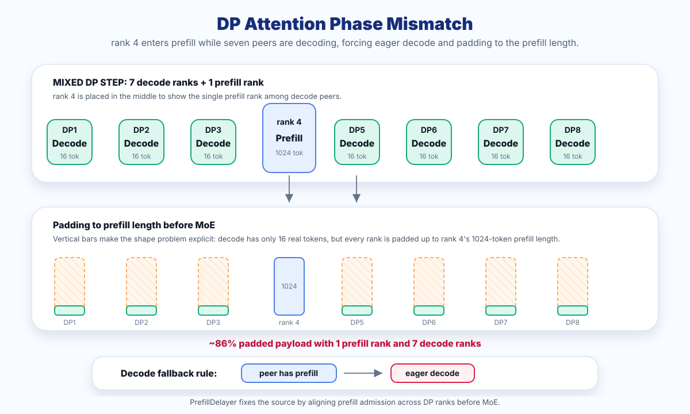
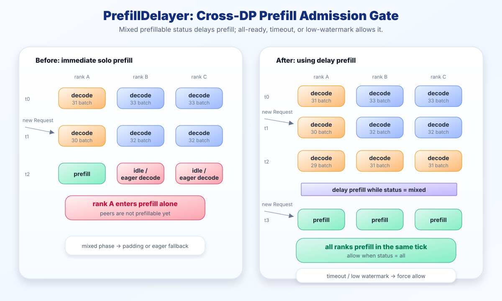
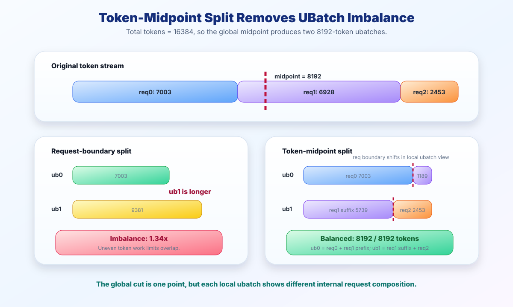
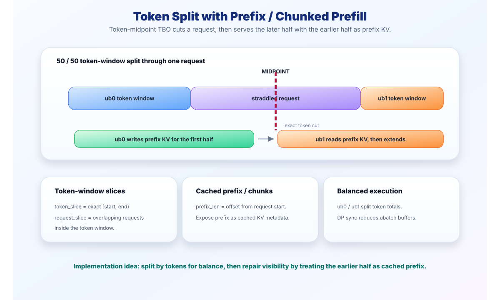
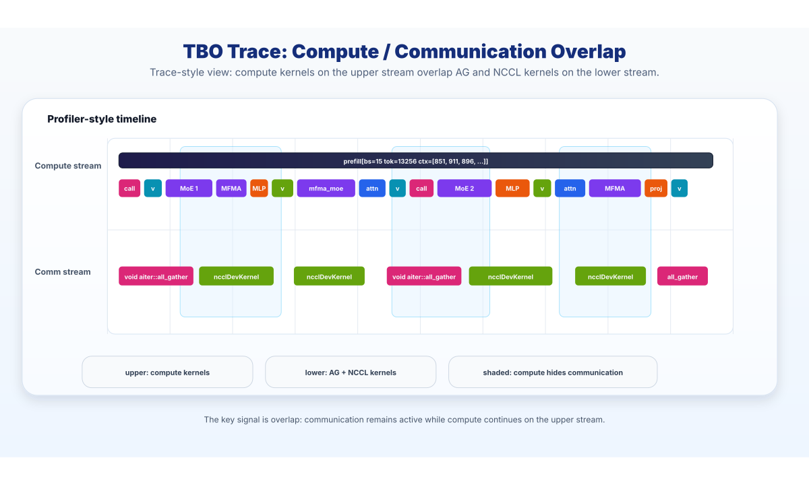
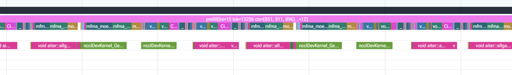
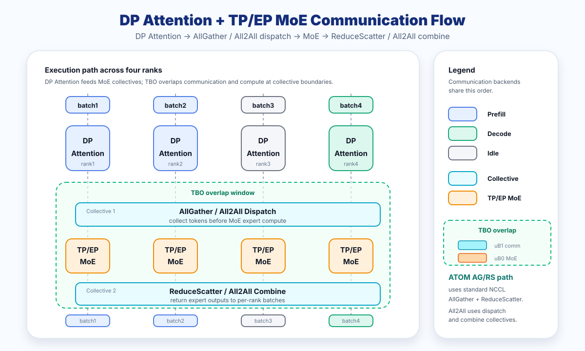
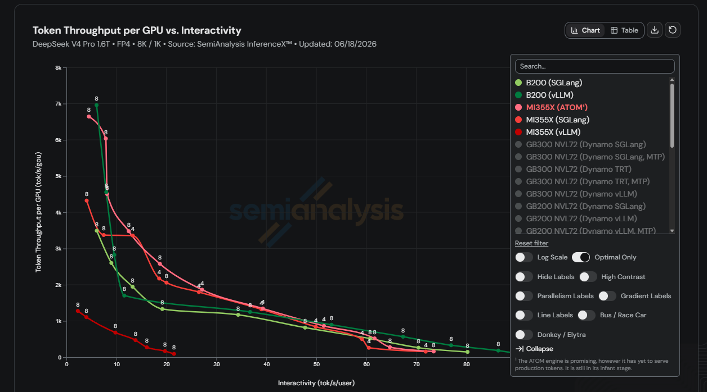

# DP Attention and TBO for DeepSeek-V4 on MI355X

Running DeepSeek-V4 efficiently requires solving two intertwined problems: how to parallelize MoE communication across GPUs, and how to hide that communication behind useful compute. The dominant approach is Expert Parallel with all2all backends like DeepEP. This solves both problems, but it also requires specialized kernels, topology assumptions, and careful expert placement.

ATOM takes a different path. Using **DP Attention with TP MoE**, combined with two key optimizations — a **coordinated prefill scheduler** and **Two-Batch Overlap (TBO) for standard collectives such as all_gather/reduce_scatter (AG/RS)** — ATOM delivers strong DeepSeek-V4 inference performance on AMD Instinct™ MI355X GPUs.

This post covers two key optimizations:

- **DP Attention Scheduling**: PrefillDelayer — reducing the eager-decode and dummy-prefill overheads that hurt real-world DP performance
- **TBO Optimization**: Token-level even splitting + breaking the all2all barrier, extending TBO beyond all2all to standard collectives such as AG/RS

---

## DP Attention Scheduling Optimization

DP Attention has an implicit scheduling goal: to reuse fixed-shape CUDA Graphs and avoid padding-amplified MoE collectives (all_gather/reduce_scatter), the system should keep DP ranks in the same phase whenever possible — all prefill, or all decode.

This is not just a design preference; it is the shape stability needed for efficient execution. If rank 4 is doing prefill (1024 tokens) while 7 others are decoding (16 tokens each), all_gather pads every rank to the maximum dimension of 1024. Batch size becomes unpredictable, CUDA Graph replay requires fixed shapes, and decode falls back to the eager path.

Without scheduling control, once any rank enters prefill early, the other ranks are pulled into a mixed phase. Figure 1 shows this phase mismatch: ranks that are still decoding fall back to eager decode and are padded up to the prefill length in MoE gather; alternatively, other ranks that are still decoding may be forced to pause their current decode work and run dummy prefill just to participate in the same collective.



<p align="center"><em>Figure 1: DP Attention phase mismatch when one rank enters prefill while the other ranks remain in decode.</em></p>

### Request Variability Creates DP Phase Mismatch

In the ideal case, request lengths and arrival timing are aligned across the 8 DP ranks, so the ranks naturally stay phase-aligned: all prefill together, then all decode together. Real workloads are less regular. With roughly 20% variability in request length or arrival timing, decode completion times diverge across ranks.

Figure 1 shows a representative state: rank 4 has entered prefill while the other seven ranks are still decoding. MoE collectives still require all ranks to participate in the same communication round, but the token shapes are now different. Decode ranks can no longer replay a fixed-shape CUDA Graph and must fall back to eager decode; in the same MoE gather, they are padded up to the prefill rank's token length. Another possible behavior is that other ranks still in decode pause their current work and run dummy prefill to match the prefill collective shape.

When 1 rank is doing prefill (~1024 tokens) and 7 ranks are decoding (~16 tokens each), most of the communication payload is not useful work. The padding waste reaches **86%**. More importantly, after MoE gather, decode ranks must wait for the prefill rank to finish MoE compute before all ranks can enter the following reduce_scatter, which significantly lengthens the synchronization wait.

### PrefillDelayer: Coordinated Prefill Scheduling Across DP Ranks

PrefillDelayer addresses the source of the mixed phase: **avoid letting a single rank enter prefill alone when possible**. Figure 2 shows how the scheduler coordinates prefill admission across DP ranks.



<p align="center"><em>Figure 2: PrefillDelayer coordinates prefill admission across DP ranks to reduce mixed-phase overhead.</em></p>

When one rank first becomes prefillable, the scheduler does not immediately admit it. Instead, it observes the prefillable status across DP ranks. Prefill is admitted only when all ranks are ready, or when timeout / low-watermark logic triggers a force allow. This keeps phase and shape more consistent when entering MoE collectives, avoiding the eager decode plus padding shown above, as well as forcing other ranks still in decode to pause and run dummy prefill.

The result is that prefill admission changes from allowing one rank to enter early to coordinating admission across DP ranks, significantly reducing eager decode, padding, and dummy prefill in mixed phases.

---

## TBO Optimization

Two-Batch Overlap (TBO) splits the batch into micro-batches and overlaps compute of one micro-batch with communication of another. ATOM improves this TBO path in two ways:

### Optimization 1: Token-Level Even Splitting for Prefill

#### The Old Way: Request-Based Splitting

The original TBO implementation split prefill batches by **request boundary**: it divides the batch in half, assigning whole requests to each ubatch. For example, a 3-request batch with `[bs=3, total_tokens=16384, ctx=[7003, 6928, 2453]]` becomes `7003 / 9381` tokens under request-boundary splitting, so ubatch 1 is `1.34x` larger than ubatch 0.

Because requests have wildly varying sequence lengths, splitting at request boundaries produces severely imbalanced ubatches. The faster ubatch finishes early and idles while the slower one is still computing. Worse, NCCL collectives must wait for both ubatches, so the slower one dictates the pace — the overlap window is wasted on waiting rather than hiding communication.

#### The New Way: Token-Level Even Splitting

Instead of treating request boundaries as fixed split points, the new approach **balances token counts across ubatches** and splits a request only when the midpoint falls inside it, as shown in Figure 3:



<p align="center"><em>Figure 3: Token-midpoint splitting balances prefill micro-batches by token count instead of request boundary.</em></p>

A request that spans the midpoint is split: its first portion goes to ubatch 0, the remainder to ubatch 1. In this example, total tokens are `16384`, so the midpoint is `8192` and both ubatches become exactly `8192` tokens.

The tradeoff: splitting a request across ubatches means the **attention computation must be adapted**. The suffix of a split request is not a new independent request; it still needs the context from the prefix of the same request. In other words, suffix tokens in ubatch 1 must be able to attend to KV produced by prefix tokens in ubatch 0.

This is similar to **chunk prefill**: when a long prefill is split into chunks, later chunks treat KV from earlier chunks as prefix cache. Token-midpoint splitting uses the same idea. As Figure 4 illustrates, the attention metadata builder must expose the split prefix as cached prefix for the suffix, while setting the correct sequence length, prefix length, and token offset for each ubatch. That lets ubatch 1 compute only the suffix tokens while preserving the same attention semantics as a full request prefill.



<p align="center"><em>Figure 4: Metadata handling for a request that straddles the token midpoint, using the earlier half as cached prefix.</em></p>

**Impact**: Token-level even splitting dramatically improves TBO prefill throughput. Both ubatches finish at the same time, maximizing the overlap window and eliminating idle waiting.

### Breaking the All2All Barrier: TBO for All_Gather/Reduce_Scatter

This is the core optimization that differentiates ATOM from every other MoE inference framework.

#### Existing Frameworks Only Overlap All2All

vLLM's DBO depends on the MoE backend exposing async prepare/finalize; SGLang is closer to stage-level pipelined overlap across MoE execution stages. Both naturally fit EP all2all backends: all2all usually splits MoE communication into dispatch and combine phases, so the runtime can interleave one micro-batch's dispatch/combine communication with another micro-batch's expert or shared-expert compute.

But all_gather/reduce_scatter is **atomic**: the entire gather must complete before compute can begin and reduce_scatter has no dispatch/combine split point analogous to all2all. Under vLLM's current abstraction, the AG/RS path is explicitly blocked from enabling DBO:

```python
# vllm/model_executor/layers/fused_moe/modular_kernel.py:1126-1130
if not self.prepare_finalize.supports_async():
    assert not dbo_enabled()  # NaiveDPEP hits this — no DBO allowed
```

Only DeepEP backends implement `supports_async() → True`. The all_gather/reduce_scatter path (`NaiveDPEP`) does not, and fundamentally cannot under vLLM's current abstraction.

#### ATOM's Approach: Micro-Batch Overlap at AG/RS Collective Boundaries

More precisely, both ATOM and vLLM split batches into micro-batches and schedule them with multiple threads/contexts. The difference is where the yield point is tied. vLLM's DBO yield points are attached to async prepare/finalize inside `FusedMoEModularKernel`, so they depend on all2all backends such as DeepEP exposing asynchronous dispatch/combine. In the DP Attention + AG/RS path, ATOM places the yield and stream switch at the `all_gather` / `reduce_scatter` collective boundaries around MoE, so one micro-batch's AG/RS communication can interleave with another micro-batch's MoE compute.

The overlap pattern is easiest to see as a timeline: Figure 5 shows communication work placed on the communication stream while the other micro-batch keeps the compute stream busy.



<p align="center"><em>Figure 5: Conceptual trace-style view of Two-Batch Overlap across compute and communication streams for all_gather/reduce_scatter collectives.</em></p>

AG = all_gather and RS = reduce_scatter. ATOM switches to the communication stream before AG and yields to the other micro-batch; after AG completes, it switches back to the compute stream for MoE; after MoE compute, it switches to the communication stream again for RS. This lets ub0's RS overlap with ub1's MoE compute, and ub1's AG overlap with ub0's compute.

The same behavior is visible in the real DeepSeek V4 profiler snapshot in Figure 6, where AG/NCCL communication kernels on the lower stream overlap with attention, MoE, and GEMM kernels on the upper compute stream:



<p align="center"><em>Figure 6: Real DeepSeek V4 overlap trace showing AG/NCCL communication kernels active while compute kernels continue on the upper stream.</em></p>

In implementation, ATOM combines micro-batch scheduling with CUDA stream switching: communication runs on the communication stream, MoE computation runs on the compute stream, and the two are interleaved at collective boundaries. This execution pattern can also be captured and replayed with CUDA Graphs, so decode does not pay extra CPU scheduling overhead at every step.

#### Framework Comparison

| Feature | vLLM DBO | SGLang TBO | ATOM TBO |
| --- | --- | --- | --- |
| EP/All2All overlap | Yes (DeepEP) | Yes (DeepEP, MORI) | Yes (MORI) |
| AG/RS overlap | **No** | **No** | **Yes** |
| Overlap level | MoE backend async prepare/finalize | MoE stage-level pipeline overlap | Micro-batch + collective boundaries |
| SM partitioning | Yes (DBO_COMM_SMS) | — | — |

---

## ATOM DP + TBO Architecture and Performance

The two optimizations are complementary:

1. **PrefillDelayer** ensures that when DP ranks enter prefill, they do so together — eliminating dummy prefill waste and keeping all ranks productive.

2. **TBO** ensures that during both prefill and decode, MoE communication is hidden behind compute — using token-level even splitting for balanced prefill ubatches and AG/RS overlap for the non-EP path.

Together, they make DP Attention + TP MoE a **first-class deployment strategy** — simpler than EP (no specialized all2all libraries, no expert partitioning, works on any interconnect) with performance that exceeds EP-based setups. Figure 7 summarizes how DP Attention scheduling and TBO fit together in ATOM.



<p align="center"><em>Figure 7: ATOM combines DP Attention scheduling with TBO at MoE collective boundaries.</em></p>

### Performance on AMD MI355X

Figure 8 shows the DeepSeek V4 Pro throughput frontier on the MI355X for the **8K/1K** workload, using the **SemiAnalysis InferenceX open-source benchmarks**:



<p align="center"><em>Figure 8: DeepSeek V4 Pro throughput frontier on the MI355X GPU over the first several weeks. Source: SemiAnalysis InferenceX open-source benchmarks. Results measured on InferenceX as of June 18, 2026, based on specific test configurations and workloads described above and may vary depending on model, configuration, and system tuning.</em></p>

These results show that, with PrefillDelayer for DP scheduling and TBO for all_gather/reduce_scatter (AG/RS), standard collective communication on AMD hardware can deliver strongly competitive DeepSeek-V4 inference performance.

---

## Importance

The LLM inference ecosystem has converged on the assumption that high-performance MoE requires Expert Parallel with specialized all2all communication kernels. This assumption often leads system designs toward specialized all2all backends and the topology assumptions around them.

ATOM demonstrates an alternative: with the right scheduling (PrefillDelayer) and the right overlap strategy (TBO for standard collectives such as AG/RS), standard collective operations on standard interconnects can match specialized setups. This has implications for:

- **Hardware flexibility**: ATOM can deliver competitive MoE inference with standard collectives and conventional interconnects
- **Simpler dependencies and configuration**: DP Attention + TP MoE has fewer dependencies and configuration choices than EP — no expert placement, no EP-rank load balancing, and no specialized all2all library requirement
- **Software architecture**: batch-level overlap is a more general abstraction than operation-level overlap — it works with any communication primitive, not just all2all

---

## Summary

In this blog, you learned how ATOM improves DeepSeek-V4 inference on AMD Instinct MI355X GPUs by combining DP Attention scheduling with Two-Batch Overlap for standard collectives such as all_gather/reduce_scatter. We showed why mixed DP phases create padding, eager decode, and dummy-prefill overhead; how PrefillDelayer coordinates prefill admission across ranks; and how token-level even splitting keeps TBO prefill micro-batches balanced.

You also saw how ATOM extends overlap beyond all2all-style MoE backends. By placing yield and stream-switch points around AG/RS collective boundaries, ATOM overlaps MoE communication with compute while preserving the simpler DP Attention + TP MoE deployment model.

Future posts from the ATOM team will delve deeper into the implementation details behind these results, including CUDA Graph capture for decode, stream scheduling, attention metadata handling for split prefill requests, and practical tuning guidance for deploying large MoE models on AMD Instinct GPUs.

*Note: With DP Attention scheduling and TBO for standard collectives such as all_gather/reduce_scatter (AG/RS), ATOM improves DeepSeek-V4 inference on AMD MI355X by keeping DP ranks phase-aligned and overlapping MoE communication with compute.*

## Additional Resources

- [ATOM repository](https://github.com/ROCm/ATOM): AMD's open-source LLM inference engine optimized for AMD Instinct GPUs.
- *[SemiAnalysis InferenceX: AI Inference Benchmarks](https://inferencex.semianalysis.com/inference)*
- *[SGLang v0.4: Data Parallelism Attention For DeepSeek Models](https://www.lmsys.org/blog/2024-12-04-sglang-v0-4/#data-parallelism-attention-for-deepseek-models)*
- *[SGLang PR #14201: Delay prefill for DP attention](https://github.com/sgl-project/sglang/pull/14201)*
- *[vLLM Design Doc: Dual Batch Overlap](https://github.com/vllm-project/vllm/blob/b39a5026ebac9242740e48debc79ce8db92c868b/docs/design/dbo.md)*

## Disclaimers

The information presented in this document is for informational purposes only and may contain technical inaccuracies, omissions, and typographical errors. The information contained herein is subject to change and may be rendered inaccurate for many reasons, including but not limited to product and roadmap changes, component and motherboard version changes, new model and/or product releases, product differences between differing manufacturers, software changes, BIOS flashes, firmware upgrades, or the like. Any computer system has risks of security vulnerabilities that cannot be completely prevented or mitigated. AMD assumes no obligation to update or otherwise correct or revise this information. However, AMD reserves the right to revise this information and to make changes from time to time to the content hereof without obligation of AMD to notify any person of such revisions or changes. THIS INFORMATION IS PROVIDED ‘AS IS.” AMD MAKES NO REPRESENTATIONS OR WARRANTIES WITH RESPECT TO THE CONTENTS HEREOF AND ASSUMES NO RESPONSIBILITY FOR ANY INACCURACIES, ERRORS, OR OMISSIONS THAT MAY APPEAR IN THIS INFORMATION. AMD SPECIFICALLY DISCLAIMS ANY IMPLIED WARRANTIES OF NON-INFRINGEMENT, MERCHANTABILITY, OR FITNESS FOR ANY PARTICULAR PURPOSE. IN NO EVENT WILL AMD BE LIABLE TO ANY PERSON FOR ANY RELIANCE, DIRECT, INDIRECT, SPECIAL, OR OTHER CONSEQUENTIAL DAMAGES ARISING FROM THE USE OF ANY INFORMATION CONTAINED HEREIN, EVEN IF AMD IS EXPRESSLY ADVISED OF THE POSSIBILITY OF SUCH DAMAGES. AMD, the AMD Arrow logo, ROCm, Instinct, and combinations thereof are trademarks of Advanced Micro Devices, Inc. Other product names used in this publication are for identification purposes only and may be trademarks of their respective companies. © 2026 Advanced Micro Devices, Inc. All rights reserved
