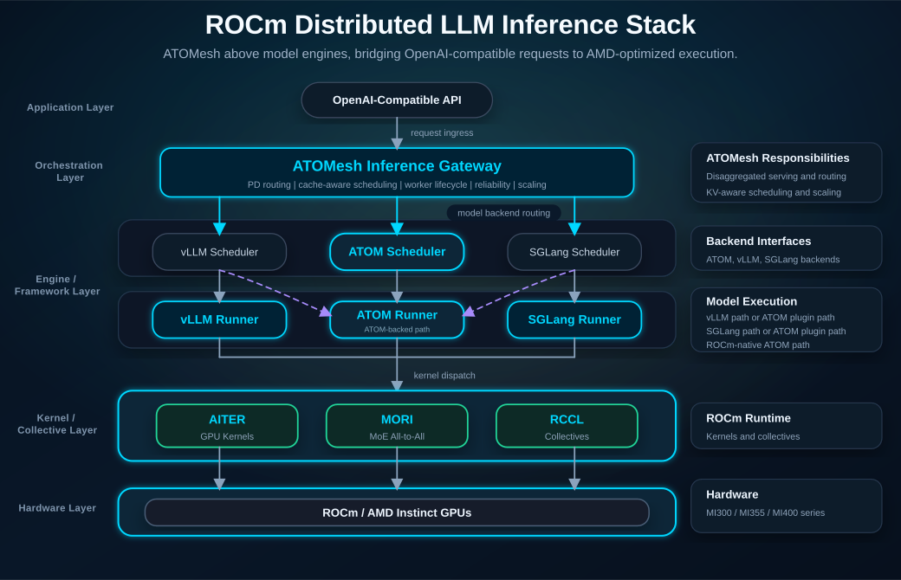
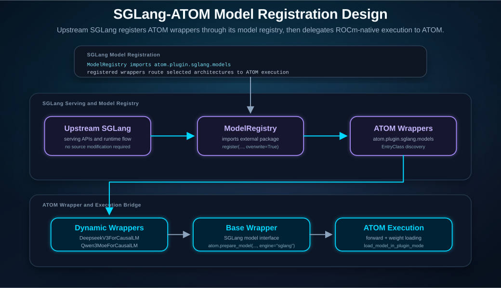
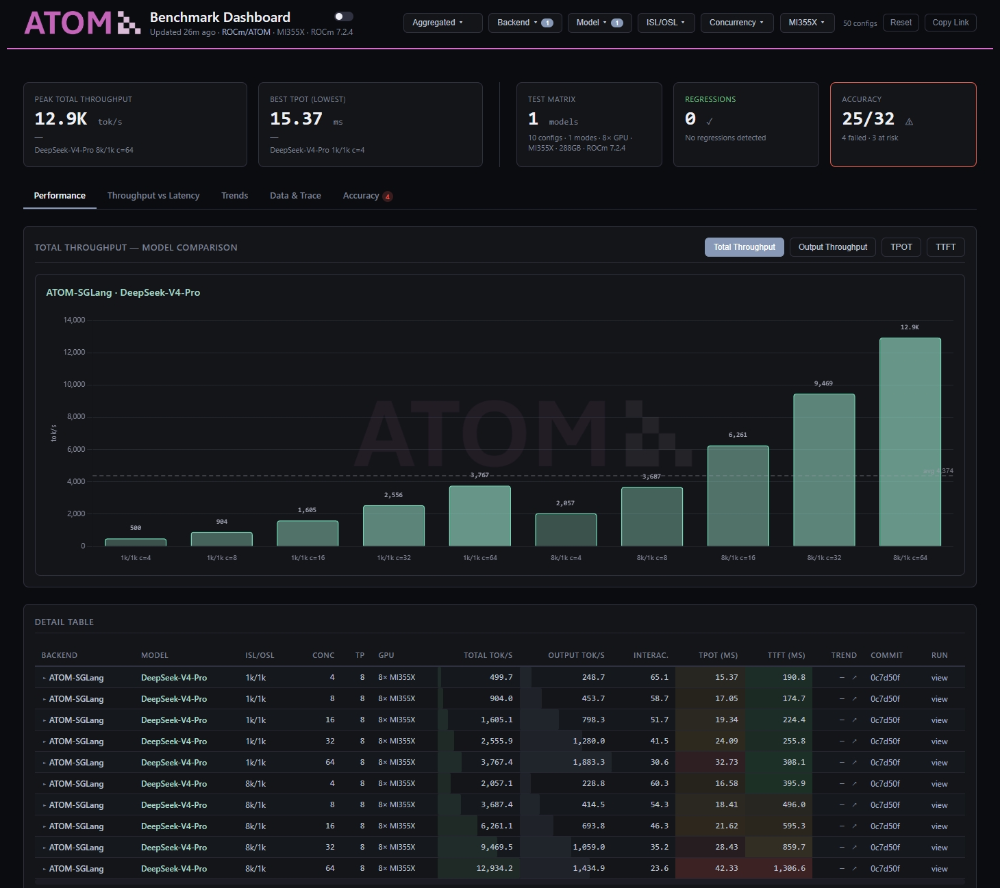
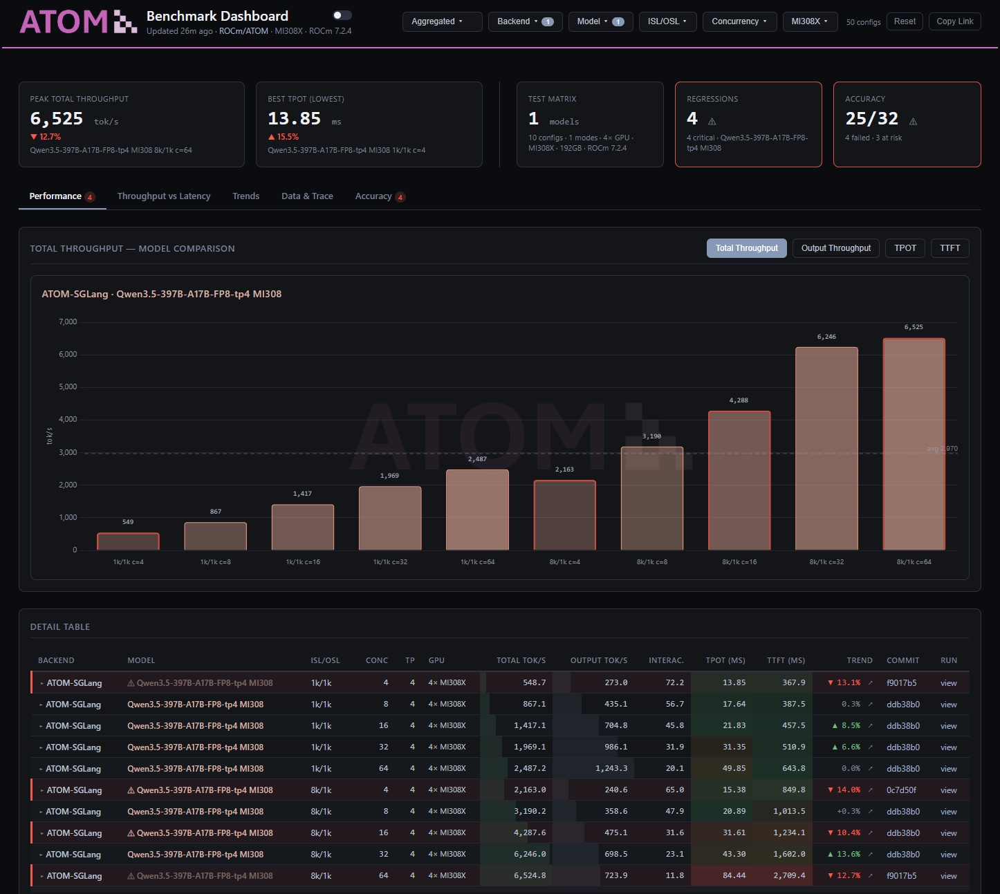

# SGLang-ATOM: Bring ROCm-Native Acceleration to SGLang Serving

Large language model serving teams often face two competing goals: keeping the flexibility and developer velocity of an ecosystem serving framework, while also reaching strong throughput, latency, and cost efficiency on production accelerators. In this blog, you will explore how SGLang-ATOM bridges these needs for AMD Instinct GPUs by connecting the SGLang serving experience with ATOM's ROCm-native execution path.

By the end of this blog, you will understand where SGLang-ATOM fits in the ROCm LLM software stack, how its SGLang model registration design integrates ATOM-backed execution into upstream SGLang, why this approach reduces migration effort for existing SGLang applications, and how benchmark dashboard results on MI355X and MI308X can help guide deployment evaluation.

SGLang-ATOM has also been successfully deployed in a major customer business scenario, further validating both the feasibility of the integration path and the serving performance of the ATOM-backed execution model.

> *"To accommodate diverse, fast-changing LLM usage scenarios across our advertising business, our AI infrastructure inference team partnered with the AMD team. Leveraging the SGLang-ATOM Plugin Mode solution, the two parties deployed the Qwen 3.5/3.6 model family on AMD Instinct GPUs. With well-defined role split and teamwork, optimization work progressed concurrently along two axes: runtime performance and engineering productivity. Benchmark measurements prove that Qwen 3.5 delivers inference performance matching or outperforming peer alternatives on the MI308X accelerator, reliably meeting the advertising business's core requirements for low latency and high throughput."*
>
> *-- Advertising team of a major customer*

## Architecture Overview

### Position in the ROCm LLM Stack

As shown in Figure 1, the ROCm LLM inference stack can be viewed as layers: application, orchestration, engine/framework, kernel/collective, and hardware. The orchestration layer is covered in more detail in the [ATOMesh blog](https://rocm.blogs.amd.com/software-tools-optimization/atomesh-inference/README.html), while this blog focuses on SGLang-ATOM in the engine/framework layer. SGLang-ATOM acts as the bridge between the familiar SGLang serving surface and ATOM's ROCm-native execution path, letting SGLang route performance-critical execution into ATOM when AMD acceleration is preferred. Below this layer, AITER, MORI, and RCCL provide the optimized compute and communication foundation that maps model execution onto AMD Instinct GPUs.

*Figure 1. The ROCm LLM inference stack.*

### SGLang-ATOM Detailed Design

ATOM is a lightweight, ROCm-native inference engine that optimizes model execution, weight loading, attention, kernel dispatch, quantization, and distributed runtime behavior for AMD Instinct GPUs, as shown in Figure 2 below.

*Figure 2. ATOM runtime request sequence for model execution.*

SGLang-ATOM uses SGLang's model registration mechanism to connect upstream SGLang with ATOM-optimized model implementations. Through this registration path, ATOM registers selected model wrappers into SGLang's model registry while keeping SGLang as the serving-facing framework and ATOM as the ROCm-native execution backend.

When ATOM's SGLang model registration path is enabled, SGLang's model registry imports the ATOM package, discovers the package modules, and registers model classes exposed through `EntryClass`. This keeps the SGLang source tree unchanged while allowing ATOM to override selected model implementations with ROCm-native execution paths.

Figure 3 summarizes this design, from the SGLang model registration path to ATOM-backed execution and ROCm runtime components.

*Figure 3. SGLang-ATOM model registration design.*

Inside ATOM, the SGLang plugin path uses a compact wrapper design:

- A shared base wrapper conforms to SGLang's model interface and delegates model creation to `atom.prepare_model(config=config, engine="sglang")`.
- A model-name list defines the enabled Hugging Face architecture names, such as `DeepseekV3ForCausalLM` and `Qwen3MoeForCausalLM`.
- Dynamic class generation creates concrete wrapper classes whose names match the model architecture names that SGLang uses for lookup.
- ATOM-side weight loading handles name mapping, sharding, quantization, and plugin-mode checkpoint layout through `load_model_in_plugin_mode`.

This design reduces per-model boilerplate. Adding a new common model path can be as small as adding ATOM-side model support, registering it in ATOM, and appending the architecture name to the SGLang plugin model list.

SGLang-ATOM also integrates ATOM's optimized attention backend into SGLang's attention backend registration mechanism. ATOM can register an AITER-backed attention path so prefill, decode, KV cache handling, and graph replay can use AMD-optimized kernels underneath the SGLang serving layer. This is where ROCm-native execution becomes visible in the runtime path: SGLang keeps the serving flow, while ATOM supplies optimized model execution, weight loading, attention, and kernel dispatch.

At a high level, the SGLang-ATOM request flow is:

1. A user or application sends an OpenAI-compatible request through the serving surface.
2. The SGLang layer handles the serving workflow and prepares the request for model execution.
3. SGLang's model registry selects the ATOM wrapper through the model registration path.
4. The wrapper delegates model creation, weight loading, and forward execution to ATOM.
5. ATOM applies ROCm-native scheduling, graph execution, kernel selection, quantization-aware execution, and parallelism strategies.
6. AITER, MORI, and RCCL map the workload onto AMD Instinct GPUs through optimized kernels and distributed communication.
7. The result is returned through the SGLang serving surface.

This design separates developer-facing serving integration from hardware-facing optimization. It gives teams a staged adoption path: start from upstream SGLang, enable the ATOM model registration path, and adopt ATOM-backed acceleration where model support and workload requirements align.

## Why SGLang-ATOM

SGLang-ATOM is intended for teams that want to move quickly without giving up access to AMD-specific inference optimization. Instead of rebuilding the serving stack from scratch, teams can adopt ATOM acceleration through a plugin-style path while continuing to build around SGLang's serving model. This makes SGLang-ATOM a practical bridge between open-source serving workflows and AMD-tuned inference performance.

The value of this approach centers on three areas:

- **ROCm-native optimization**: ATOM is built around ROCm-first priorities and AMD Instinct GPU behavior. It brings kernel acceleration through AITER, communication efficiency through MORI and RCCL, execution policy coordination across scheduling and KV cache behavior, and quantization-aware execution for modern LLM serving workloads.
- **Time-to-market**: SGLang-ATOM preserves the ecosystem surface that SGLang users already understand. Teams can keep familiar SGLang request handling and serving workflows, adopt ROCm optimization through a plugin path rather than a full serving stack migration, and evaluate optimized execution on AMD GPUs while keeping application-facing behavior stable.
- **Zero-friction migration**: Customers already serving workloads through SGLang can integrate SGLang-ATOM with minimal changes to their existing business logic, APIs, deployment scripts, and operational workflows. This enables a near-zero migration path from a standard SGLang serving stack to an ATOM-backed SGLang-ATOM deployment.

For SGLang users, the intended benefit is not only peak performance. It is also access to AMD-tuned recipes that can reduce the amount of manual performance engineering needed for each model and deployment shape. This approach is especially useful when teams need to validate AMD Instinct GPU deployments quickly, compare serving configurations, or move from experimentation toward production readiness without rewriting the full application integration layer.

## Benchmark Dashboard

SGLang-ATOM benchmark results are tracked through the ATOM benchmark dashboard, which provides a unified view of model-level performance on AMD Instinct GPUs. The dashboard is intended to help users understand how different SGLang-ATOM model paths perform under representative serving configurations, including variations in model architecture, quantization mode, tensor parallelism, concurrency, input/output sequence length, and KV cache settings.

Figure 4 shows the MI355X dashboard with SGLang-ATOM benchmark results on AMD Instinct MI355X systems, helping users compare performance across models and serving configurations.

*Figure 4. SGLang-ATOM benchmark dashboard on MI355X.*

Dashboard link: [ATOM-SGLang on MI355X](https://rocm.github.io/ATOM/benchmark-dashboard/#backend=ATOM-SGLang&hardware=mi355x)

Figure 5 shows the MI308X dashboard with SGLang-ATOM benchmark results on AMD Instinct MI308X systems, helping users evaluate performance across models and serving configurations.

*Figure 5. SGLang-ATOM benchmark dashboard on MI308X.*

Dashboard link: [ATOM-SGLang on MI308X](https://rocm.github.io/ATOM/benchmark-dashboard/#backend=ATOM-SGLang&hardware=mi308x)

## What’s Next for SGLang-ATOM

SGLang-ATOM is part of a broader direction for bringing AMD-optimized inference recipes into open-source serving ecosystems. As ATOM recipes mature, the plugin path can help SGLang users adopt those recipes without giving up their existing applications built on the SGLang serving framework.

Future work can focus on:

- Expanding model coverage and validating model-specific optimized paths.
- Strengthening plugin integration between SGLang request handling and ATOM execution.
- Optimizing critical performance paths for long-context, MoE, and high-concurrency workloads.
- Combining with ATOMesh to extend distributed inference capabilities, including multi-node routing, prefill/decode disaggregation, and KV-aware scheduling for SGLang-ATOM deployments.
- Integrating benchmark, profiling, and regression tracking workflows for repeatable performance validation.

This roadmap keeps the integration practical: SGLang continues to provide the serving-facing experience, while ATOM and the ROCm software stack continue to provide the AMD-optimized execution path.

## Summary

SGLang-ATOM offers a practical path for bringing ROCm-native LLM acceleration into familiar SGLang serving workflows on AMD Instinct GPUs. It fits naturally into the ROCm LLM software stack by using the SGLang model registration mechanism to connect upstream SGLang with ATOM-backed model wrappers, preserving existing SGLang applications while enabling AMD-optimized execution underneath.

For deployment teams, this approach reduces migration effort, accelerates time-to-market, exposes model-level benchmark visibility through the ATOM dashboard, and provides a practical path for adopting optimized ATOM recipes in existing SGLang-based services. As the integration matures, SGLang-ATOM can continue expanding model coverage, optimizing critical performance paths, and working with ATOMesh to extend distributed inference capabilities.

## Additional Resources

1. [ATOM and ATOMesh repository](https://github.com/ROCm/ATOM)
2. [SGLang repository](https://github.com/sgl-project/sglang)
3. [ATOM benchmark dashboard](https://rocm.github.io/ATOM/benchmark-dashboard/)
4. [ROCm documentation](https://rocm.docs.amd.com/)

## Disclaimers

The information presented in this document is for informational purposes only and may contain technical inaccuracies, omissions, and typographical errors. The information contained herein is subject to change and may be rendered inaccurate for many reasons, including but not limited to product and roadmap changes, component and motherboard version changes, new model and/or product releases, product differences between differing manufacturers, software changes, BIOS flashes, firmware upgrades, or the like. Any computer system has risks of security vulnerabilities that cannot be completely prevented or mitigated. AMD assumes no obligation to update or otherwise correct or revise this information. However, AMD reserves the right to revise this information and to make changes from time to time to the content hereof without obligation of AMD to notify any person of such revisions or changes. THIS INFORMATION IS PROVIDED ‘AS IS.” AMD MAKES NO REPRESENTATIONS OR WARRANTIES WITH RESPECT TO THE CONTENTS HEREOF AND ASSUMES NO RESPONSIBILITY FOR ANY INACCURACIES, ERRORS, OR OMISSIONS THAT MAY APPEAR IN THIS INFORMATION. AMD SPECIFICALLY DISCLAIMS ANY IMPLIED WARRANTIES OF NON-INFRINGEMENT, MERCHANTABILITY, OR FITNESS FOR ANY PARTICULAR PURPOSE. IN NO EVENT WILL AMD BE LIABLE TO ANY PERSON FOR ANY RELIANCE, DIRECT, INDIRECT, SPECIAL, OR OTHER CONSEQUENTIAL DAMAGES ARISING FROM THE USE OF ANY INFORMATION CONTAINED HEREIN, EVEN IF AMD IS EXPRESSLY ADVISED OF THE POSSIBILITY OF SUCH DAMAGES. AMD, the AMD Arrow logo, ROCm, Instinct, and combinations thereof are trademarks of Advanced Micro Devices, Inc. Other product names used in this publication are for identification purposes only and may be trademarks of their respective companies. © 2026 Advanced Micro Devices, Inc. All rights reserved
