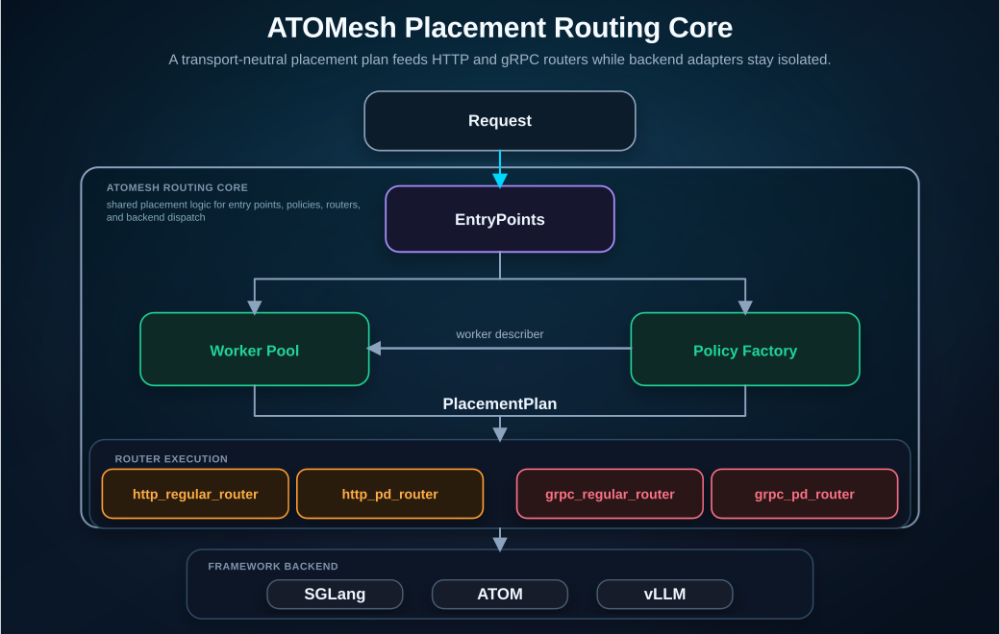
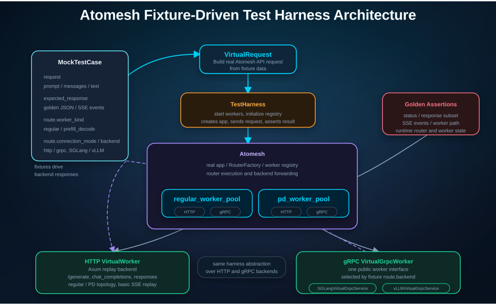
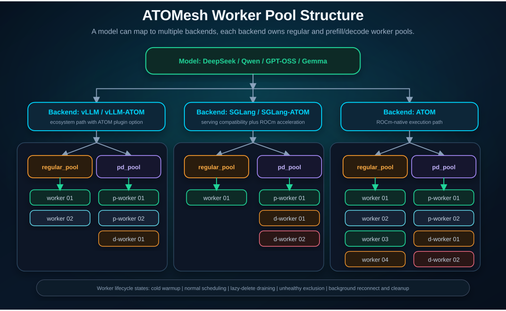
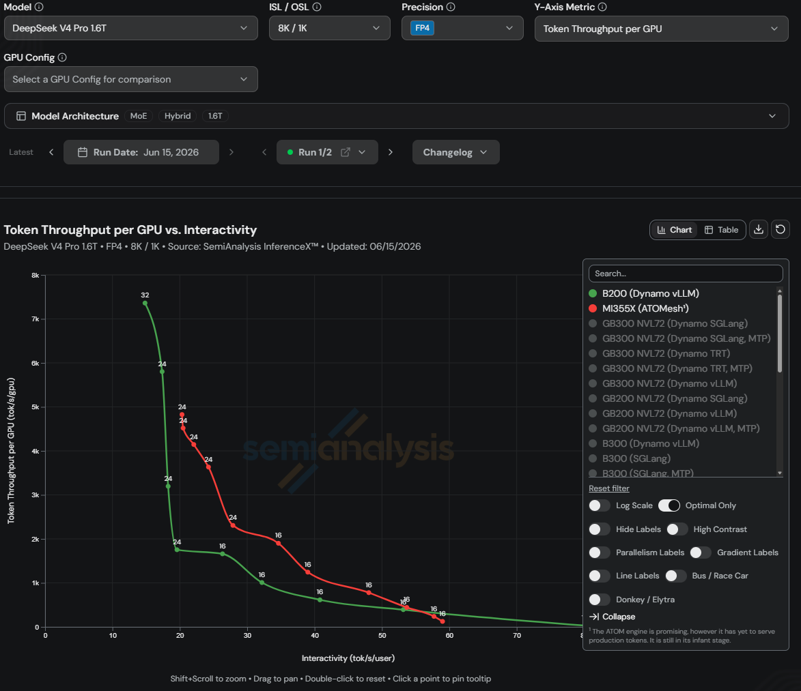

# ATOMesh: Unlocking AMD Hardware for Scalable LLM Serving

Large language model serving is moving from single-engine optimization to full-stack distributed inference. Production deployments must handle high concurrency, long-context prefill, latency-sensitive decode, KV cache store pressure, and multi-node GPU utilization at the same time. On AMD Instinct GPUs, the key opportunity is to connect ROCm-native kernels, communication libraries, inference engines, and distributed orchestration into one scalable serving stack.

ATOMesh and ATOM are designed for this goal. ATOM provides the AMD-optimized inference engine path, while ATOMesh provides the distributed serving and orchestration layer above model engines. Together, they turn AMD GPU clusters into a scalable LLM serving platform that can route requests intelligently, reuse KV cache efficiently, and dispatch execution to ROCm-optimized backends.

## Distributed Inference Architecture on AMD GPUs

As shown in Figure 1, the AMD LLM inference stack can be viewed as five layers: application, orchestration, engine/framework, kernel/collective, and hardware. ATOMesh sits in the orchestration layer. ATOM sits in the engine layer. ROCm components such as AITER, MORI, and RCCL provide the optimized execution foundation below them.

*Figure 1. ATOMesh in the ROCm LLM inference stack.*

At the top, users and applications send OpenAI-compatible requests. ATOMesh receives these requests and coordinates distributed inference across the cluster. Its responsibilities include prefill/decode routing, cache-aware scheduling, worker lifecycle management, reliability handling, and scaling. Instead of exposing every backend directly to applications, ATOMesh provides a unified serving surface for AMD GPU inference deployments.

Below ATOMesh, model execution can be handled by ATOM, vLLM, or SGLang backends. ATOM is the primary ROCm-native execution path in this design, coordinating model execution, scheduling, KV cache management, graph execution, quantization-aware kernels, and parallelism strategies such as tensor parallelism, data parallelism, and expert parallelism. vLLM and SGLang provide ecosystem-compatible serving paths for teams that already build on those frameworks, while ATOMesh can route them either through their native runners or through ATOM plugin paths when AMD-optimized execution is preferred. This keeps the serving layer flexible without losing access to ROCm-specific performance opportunities.

The vLLM with ATOM runner and SGLang with ATOM runner paths bridge these two needs. They preserve the familiar serving interfaces, request formats, and operational patterns of vLLM and SGLang, while delegating the performance-critical execution path to ATOM. This lets teams keep compatibility with open-source serving ecosystems and still take advantage of ROCm-native optimization on AMD GPUs.

Under the engine layer, AITER provides inference-critical GPU kernels, MORI supports MoE and RDMA-oriented communication paths, and RCCL provides collectives for distributed execution. These components map the serving workload to AMD Instinct hardware. ATOMesh does not replace these layers. It connects them into a practical production-serving architecture.

From the ATOMesh perspective, the stack is organized around a clear serving hierarchy:

- **ATOMesh** owns the distributed inference gateway: request routing, prefill/decode disaggregation, KV-aware scheduling, worker health, retries, scaling, and multi-engine integration.
- **ATOM, vLLM, and SGLang** act as execution backends behind ATOMesh. ATOM provides the ROCm-native optimized path, while vLLM and SGLang provide ecosystem-compatible paths that can also use ATOM plugin integrations.
- **AITER, MORI, and RCCL** provide the kernel and communication foundation underneath the execution backends, allowing the stack to expose AMD hardware performance through optimized compute and distributed communication paths.

This layering keeps ATOMesh focused on distributed serving policy while allowing each backend to evolve its own model execution and optimization path. It also gives production teams a common control plane for heterogeneous inference stacks, where ROCm-native ATOM execution, vLLM or SGLang compatibility, and future specialized backends can be registered, discovered, scheduled, and monitored consistently.

## ATOMesh Design and Highlights

ATOMesh is designed as the distributed inference gateway for ROCm-based LLM serving. Its core design goal is to keep cluster-level serving policy independent from model execution internals, so routing, scheduling, reliability, and scaling can evolve without forcing changes into each backend engine.

Several design choices make ATOMesh practical for both production deployment and rapid development.

As shown in Figure 2, ATOMesh uses a unified placement core for multi-connection routing. Instead of maintaining separate routing logic for HTTP regular, HTTP prefill/decode, gRPC regular, and gRPC prefill/decode modes, worker selection is centralized around a transport-neutral placement plan. The planner can return either a single worker for regular routing or a prefill/decode worker pair for disaggregated routing. This is especially important for long-context workloads, where prefill and decode have different resource behavior and KV cache locality can significantly affect cluster efficiency. Backend-specific wire formats are isolated behind backend adapters for ATOM, SGLang, and vLLM, so each backend can evolve independently while ATOMesh keeps one consistent scheduling model.

ATOMesh separates request preparation, backend dispatch, and response rendering. Transport-neutral concerns such as chat template handling, tool constraints, stop sequence processing, streaming aggregation, and response formatting are kept outside the low-level gRPC transport path. This makes the routing pipeline easier to reason about and easier to test, while keeping protocol-specific code focused on transport and worker communication.

*Figure 2. ATOMesh placement routing core.*

Figure 3 illustrates ATOMesh's fixture-driven mocker framework for local validation. Test cases are described as reusable fixtures that can be replayed across HTTP, gRPC, regular, and prefill/decode modes. Virtual workers simulate backend responses, streaming chunks, delays, and failures, allowing developers to validate the real ATOMesh request path without requiring GPUs, model weights, or live inference engines. This is especially useful for agent-assisted development, because new routing behavior can be tested quickly through structured fixtures.

*Figure 3. ATOMesh fixture-driven mock worker framework.*

ATOMesh treats observability as part of the serving layer. Mesh-owned metrics are exposed through a stable metrics facade and Prometheus exporter, while backend engine metrics can be scraped and aggregated separately. Centralized metric naming, labels, route normalization, and inventory metadata help prevent schema drift and make routing behavior easier to inspect during production operation.

Figure 4 summarizes how ATOMesh organizes workers by model backend and pool type, with separate regular and prefill/decode pools for each backend. The worker lifecycle model keeps mutations out of the request scheduling hot path: before regular routing policies are applied, newly registered workers can receive targeted warmup traffic to build runtime state such as KV cache, unhealthy workers can be excluded from placement, and lazy-delete workers can drain in-flight requests before cleanup. Background maintenance handles reconnects, draining, timeout handling, graceful shutdown, retries, and physical removal while routing stays fast.

*Figure 4. ATOMesh worker pool structure and backend routing.*

Together, these design choices give ATOMesh a clear role as the control plane for distributed inference serving. It centralizes placement policy, backend registration, worker lifecycle management, observability, and testability while keeping model execution inside specialized engines. This separation lets operators change routing behavior, add or drain workers, introduce new backends, and validate failure cases without rewriting the GPU execution path. In practice, ATOMesh turns a collection of model servers into a coordinated serving system that can evolve with production traffic, hardware scale, and backend diversity.

## ATOMesh Future Roadmap

ATOMesh is evolving toward a more scalable, extensible, and production-ready inference orchestration layer for AMD-based LLM serving. The roadmap focuses on deepening routing intelligence, KV-cache efficiency, development validation, and production operations while preserving the backend-neutral control-plane design already used for ATOM, vLLM, and SGLang.

Routing will continue to evolve from individual policies into a more comprehensive decision system. Existing policies already cover basic routing behavior and parts of request-aware or cache-aware placement. The next step is to combine multiple signals, such as request characteristics, KV-cache locality, backend capability, worker health, and real-time multi-worker load discovery, into one coordinated routing decision. This allows ATOMesh to balance latency, throughput, cache reuse, and cluster utilization through a unified placement framework rather than choosing a single policy in isolation.

KV-aware scheduling remains a key performance direction. ATOMesh should improve prefix index discovery, cache-aware worker selection, request synchronization across backends and nodes, KV cache transfer, and integration with prefill/decode disaggregation. These capabilities are important for reducing redundant prefill work, improving time-to-first-token, and increasing cluster efficiency.

The mocker framework will also become a stronger development and CI/CD asset. Virtual HTTP and gRPC workers, regular and prefill/decode simulation, fixture-driven replay, streaming behavior, latency, and error injection can help validate routing and API behavior without GPUs or live inference engines. Integrated into CI/CD, these fixtures can support regression testing, router validation, benchmark cases, and agent-assisted test generation.

ATOMesh is also being designed for broader workloads and production operations. Future work includes multimodal and diffusion readiness, modular tool-calling and reasoning-output parsing, Kubernetes-oriented orchestration, worker restart and recovery, health checks, graceful shutdown, autoscaling hooks, and service lifecycle management. These capabilities help move ATOMesh from local or static deployment toward resilient cluster operation.

Extended production capabilities include Prometheus-compatible metrics, structured logging and tracing, profiler and configurator tools, service discovery through Kubernetes, etcd, or NATS, and real workload benchmark automation. Together, these features can support capacity planning, deployment recommendations, continuous performance regression tracking, and comparison against other inference orchestration systems.

## Performance

We evaluated the ATOMesh and ATOM stack on InferenceX with DeepSeek-V4-Pro and observed strong serving performance on AMD Instinct GPUs. The result demonstrates that a ROCm-native architecture can combine distributed request orchestration with optimized model execution to deliver practical high-throughput, low-latency LLM serving.

This evaluation is associated with the SemiAnalysisAI InferenceX PR for AMD DS-V4 FP4 MI355X ATOM disaggregated inference.

*Figure 5. DeepSeek V4 Pro throughput frontier on the MI355X GPU over the first several weeks. Source: SemiAnalysis InferenceX open-source benchmarks. Results measured on InferenceX as of June 12, 2026, based on specific test configurations and workloads described above and may vary depending on model, configuration, and system tuning.*

ATOMesh improves how requests are routed and scheduled across the cluster. ATOM improves how each request is executed on AMD GPUs. AITER, MORI, and RCCL provide the optimized kernel and communication paths underneath. Together, these layers unlock AMD hardware for scalable LLM serving.

## ATOMesh Preview

ATOMesh is currently an alpha release intended for early evaluation, architecture exploration, and feedback. It should not yet be used for production serving, and requests for production deployment should wait until the project reaches a more mature release stage.

The goal of ATOMesh is to explore the speed-of-light distributed inference recipes for AMD data center products, consistent with ATOM's role as the reference path for ROCm-optimized inference optimization. As shown in Figure 1, once these recipes are proven and mature through ATOMesh and ATOM, the planned path is for open-source ecosystem engines such as SGLang and vLLM to incorporate them through plugin mode, including SGLang-ATOM and vLLM-ATOM. This enables broader adoption while preserving each engine's serving model.

## Summary

ATOMesh provides the orchestration layer that turns AMD GPU clusters into a coordinated distributed inference serving system. It exposes OpenAI-compatible APIs, manages multi-engine backends, applies prefill/decode disaggregation and KV-aware scheduling, and keeps routing, worker lifecycle, observability, and reliability concerns in the serving layer. Behind this control plane, ATOM provides the ROCm-native model execution path, vLLM and SGLang provide open-source ecosystem-compatible serving paths, and AITER, MORI, and RCCL supply optimized kernels and distributed communication.

For teams exploring large language model serving on AMD Instinct GPUs, ATOMesh is an early entry point from hardware capability to coordinated distributed inference. It coordinates requests, workers, routing policy, and backend selection as a path toward a scalable production serving surface as the project matures.

## Additional Resources

1. [ATOMesh and ATOM repository](https://github.com/ROCm/ATOM)
2. [ROCm AITER](https://github.com/ROCm/aiter)
3. [ROCm MORI](https://github.com/ROCm/mori)
4. [ATOM benchmark dashboard](https://rocm.github.io/ATOM/benchmark-dashboard/#)
5. [InferenceX dashboard](https://inferencex.semianalysis.com/inference)
